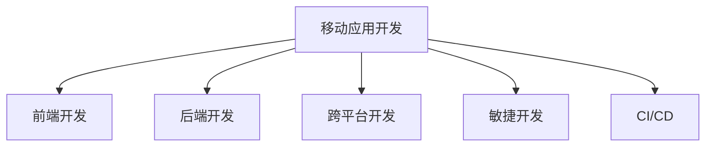

                 

# 程序员副业：移动应用开发

> 关键词：移动应用开发, 副业, 编程技能, 创业, 在线学习, 跨平台开发

## 1. 背景介绍

### 1.1 问题由来
在当今数字化时代，移动应用已成为人们生活、工作和娱乐的重要组成部分。无论是社交媒体、在线购物，还是健康监测、智能家居，手机应用无处不在。然而，开发一个受欢迎的移动应用不仅需要编程技能，还需要对市场需求的深刻理解、用户体验的设计以及营销推广的策略。对于许多程序员来说，开发移动应用成为了他们副业的重要方向，既能提升技术水平，又能开拓新的业务机会。

### 1.2 问题核心关键点
移动应用开发的核心在于如何将复杂的逻辑和功能通过简洁易用的界面呈现给用户。这包括选择合适的技术栈、设计直观易用的用户界面、实现高效稳定的业务逻辑等。对于有经验的程序员来说，开发一个移动应用不仅需要深厚的编程技能，还需要跨领域的知识融合，如用户体验设计、市场分析等。

### 1.3 问题研究意义
开发移动应用不仅可以帮助程序员实现技术提升，还能开辟新的收入渠道，甚至有可能发展成为全职的副业或创业项目。掌握移动应用开发技能，可以为程序员提供更广泛的职业选择和发展空间。此外，移动应用开发也是推动互联网行业和科技创新的一个重要方向，具有重要的社会和经济价值。

## 2. 核心概念与联系

### 2.1 核心概念概述

为了更好地理解移动应用开发的流程和关键点，本节将介绍几个核心概念：

- 移动应用开发：指通过编程实现具有特定功能的应用程序，并在移动设备上运行的过程。常见的移动平台包括iOS、Android、Web等。
- 前端开发：指开发应用的用户界面和用户体验(UX/UI)，使用如React Native、Flutter等跨平台技术，实现“一次编写，多平台运行”的目标。
- 后端开发：指开发应用的后端逻辑和数据处理，通常使用如Node.js、Ruby on Rails等技术，确保应用的数据安全和高效运行。
- 跨平台开发：指使用同一套代码实现多个移动平台的应用，如使用React Native或Flutter进行iOS、Android和Web平台的开发。
- 敏捷开发：指快速迭代、灵活应对市场变化的一种开发模式，通过小步快跑的方式逐步完善应用功能。
- 持续集成/持续部署(CI/CD)：指通过自动化流程，将代码的变更从编写、测试到部署的过程，确保应用的质量和稳定性。

这些核心概念之间的逻辑关系可以通过以下Mermaid流程图来展示：



这个流程图展示了移动应用开发的关键步骤及其相互关系：

1. 移动应用开发是大方向，涉及前端、后端和跨平台开发等技术栈。
2. 前端开发负责用户界面和用户体验设计，实现直观易用的用户交互。
3. 后端开发负责业务逻辑和数据处理，确保应用的数据安全和高效运行。
4. 跨平台开发使用同一套代码实现多平台运行，提升开发效率和应用扩展性。
5. 敏捷开发采用快速迭代的方式，适应市场需求变化，提高开发效率。
6. CI/CD确保应用的质量和稳定性，实现自动化部署和持续更新。

这些概念共同构成了移动应用开发的基础框架，使得开发者可以全面掌握开发移动应用所需的技术和流程。

## 3. 核心算法原理 & 具体操作步骤
### 3.1 算法原理概述

移动应用开发的算法原理主要围绕用户体验设计和功能实现展开。其核心思想是：

- 用户界面(UI)设计要简洁、直观，让用户能够快速理解和使用应用。
- 用户界面(UI)设计要符合用户的心理模型，减少用户的操作负担。
- 应用功能要满足用户需求，并提供良好的用户体验。
- 应用功能实现要高效、稳定，确保应用的性能和可靠性。

### 3.2 算法步骤详解

移动应用开发的一般流程包括以下几个关键步骤：

**Step 1: 需求分析和设计**

- 与客户或团队成员讨论应用的功能需求和设计目标。
- 进行用户研究和市场分析，确定目标用户群体的特点和需求。
- 设计应用的用户界面(UI)和用户体验(UX)，确保设计的直观易用性。

**Step 2: 技术选型**

- 根据应用需求选择合适的技术栈，如iOS、Android、React Native等。
- 评估不同技术栈的优缺点，选择最适合开发团队的技术方案。

**Step 3: 应用实现**

- 编写应用的前端和后端代码，实现应用的功能逻辑。
- 进行单元测试和集成测试，确保代码的稳定性和可靠性。

**Step 4: 测试和优化**

- 进行功能测试、性能测试和用户测试，发现并修复应用中的问题。
- 根据测试结果优化应用的性能和用户体验，提升应用的满意度。

**Step 5: 部署和维护**

- 将应用部署到目标平台，并进行持续的监控和维护。
- 根据用户反馈和市场变化，定期更新应用功能和界面设计。

### 3.3 算法优缺点

移动应用开发具有以下优点：

1. 提升技术技能：通过开发移动应用，程序员可以掌握新的技术栈和开发工具，提升自身技术水平。
2. 拓宽职业发展：掌握移动应用开发技能，可以为程序员提供更多的职业选择和发展机会。
3. 快速迭代：采用敏捷开发模式，可以灵活应对市场变化，快速迭代应用功能。
4. 跨平台开发：使用跨平台技术，如React Native、Flutter等，可以减少开发成本，提升开发效率。

同时，该方法也存在一定的局限性：

1. 技术门槛较高：移动应用开发需要掌握多种技术栈和开发工具，对开发者的技术要求较高。
2. 开发周期较长：相对于网站或服务端应用，移动应用的开发周期较长，需要更多的资源和时间投入。
3. 市场竞争激烈：移动应用市场已进入饱和状态，新应用需要突破重重竞争才能获得用户关注。
4. 平台差异较大：不同移动平台的特性和规范存在差异，需要开发者具备跨平台开发能力。

尽管存在这些局限性，但就目前而言，移动应用开发仍然是程序员副业的重要方向。未来相关研究的重点在于如何进一步降低开发门槛，提高开发效率，同时兼顾跨平台兼容性和用户体验等因素。

### 3.4 算法应用领域

移动应用开发的应用领域非常广泛，涵盖了日常生活的方方面面，例如：

- 社交媒体应用：如微信、QQ、微博等，通过移动应用提供即时通讯、社交网络、内容分享等功能。
- 在线购物应用：如淘宝、京东、拼多多等，通过移动应用提供商品浏览、购物车、支付等功能。
- 健康监测应用：如Fitbit、MyFitnessPal等，通过移动应用提供健康数据监测、运动记录、营养建议等功能。
- 金融理财应用：如支付宝、微信支付、理财通等，通过移动应用提供资金管理、投资理财、支付转账等功能。
- 教育培训应用：如Coursera、Khan Academy、作业帮等，通过移动应用提供在线学习、课程推荐、作业辅导等功能。

除了上述这些经典应用外，移动应用开发还被创新性地应用到更多场景中，如智能家居、智慧交通、智能穿戴等，为移动互联网技术带来了全新的突破。随着移动互联网技术的发展和普及，基于移动应用开发的技能将成为程序员不可或缺的必备能力。

## 4. 数学模型和公式 & 详细讲解  
### 4.1 数学模型构建

本节将使用数学语言对移动应用开发的基本模型进行更加严格的刻画。

假设移动应用开发的任务为$T$，包括前端开发、后端开发、跨平台开发等多个子任务。定义任务$T$的数学模型为：

$$
T = F + B + C
$$

其中$F$为前端开发，$B$为后端开发，$C$为跨平台开发。每个子任务可以用以下公式表示：

$$
F = \{F_1, F_2, ..., F_n\}
$$

$$
B = \{B_1, B_2, ..., B_m\}
$$

$$
C = \{C_1, C_2, ..., C_k\}
$$

每个子任务的具体实现过程如下：

- 前端开发$F$：包括UI设计、交互逻辑、数据获取等。
- 后端开发$B$：包括服务器搭建、数据库设计、API开发等。
- 跨平台开发$C$：包括代码编写、界面适配、性能优化等。

### 4.2 公式推导过程

以下我们以React Native开发iOS应用为例，推导其开发流程的数学模型：

假设移动应用的任务为$T$，包括前端开发$F$和后端开发$B$。前端开发$F$使用React Native技术，后端开发$B$使用Node.js技术。定义任务$T$的数学模型为：

$$
T = F + B
$$

其中：

- 前端开发$F$：
$$
F = \{F_1, F_2, ..., F_n\}
$$

$$
F_1 = UI设计 + 交互逻辑 + 数据获取
$$

$$
F_2 = 代码编写 + 界面适配 + 性能优化
$$

- 后端开发$B$：
$$
B = \{B_1, B_2, ..., B_m\}
$$

$$
B_1 = 服务器搭建 + 数据库设计 + API开发
$$

$$
B_2 = 数据处理 + 业务逻辑 + 安全保障
$$

将每个子任务的实现过程代入公式$T = F + B$，得：

$$
T = (UI设计 + 交互逻辑 + 数据获取 + 代码编写 + 界面适配 + 性能优化) + (服务器搭建 + 数据库设计 + API开发 + 数据处理 + 业务逻辑 + 安全保障)
$$

通过上述公式，我们可以看到移动应用开发的过程可以分为前端和后端两个主要部分，每个部分又包含多个具体的任务，每个任务都有其特定的实现过程。

### 4.3 案例分析与讲解

以一个简单的购物应用为例，来分析其开发过程的数学模型：

假设移动应用的任务为$T$，包括前端开发$F$和后端开发$B$。前端开发$F$使用React Native技术，后端开发$B$使用Node.js技术。定义任务$T$的数学模型为：

$$
T = F + B
$$

其中：

- 前端开发$F$：
$$
F = \{F_1, F_2, ..., F_n\}
$$

$$
F_1 = UI设计 + 交互逻辑 + 数据获取
$$

$$
F_2 = 代码编写 + 界面适配 + 性能优化
$$

- 后端开发$B$：
$$
B = \{B_1, B_2, ..., B_m\}
$$

$$
B_1 = 服务器搭建 + 数据库设计 + API开发
$$

$$
B_2 = 数据处理 + 业务逻辑 + 安全保障
$$

具体实现过程如下：

- UI设计：使用Sketch或Adobe XD等工具设计应用的主界面和交互界面，并使用Figma或InVision等工具进行原型设计。
- 交互逻辑：使用React Native等跨平台技术实现应用的交互逻辑，通过状态管理库如Redux或MobX管理应用的UI状态。
- 数据获取：使用HTTP或WebSocket等技术实现数据获取功能，通过第三方API获取商品信息、用户数据等。
- 代码编写：使用JavaScript或TypeScript编写应用的前端代码，使用Flutter或Java等语言编写应用的后端代码。
- 界面适配：使用Flutter或Java等语言进行界面适配，确保应用在不同设备上的显示效果一致。
- 性能优化：使用React Native提供的性能优化工具，如React Native Performance Monitor，提升应用的性能和用户体验。
- 服务器搭建：使用AWS或阿里云等云服务平台搭建应用的后端服务器，确保应用的稳定性和可扩展性。
- 数据库设计：使用MySQL或MongoDB等数据库管理系统设计应用的数据模型，确保数据的安全性和一致性。
- API开发：使用Node.js或Python等语言开发应用的后端API，确保数据的传输和处理。
- 数据处理：使用大数据技术和ETL工具处理应用的数据，确保数据的质量和准确性。
- 业务逻辑：使用Spring Boot或Ruby on Rails等框架实现应用的核心业务逻辑，确保应用的业务功能完整。
- 安全保障：使用OAuth2或JWT等技术实现应用的安全认证和授权，确保应用的数据安全。

通过上述分析，我们可以看到移动应用开发的复杂性和多样性，每个任务都需要开发人员具备不同的技能和知识。

## 5. 项目实践：代码实例和详细解释说明
### 5.1 开发环境搭建

在进行移动应用开发前，我们需要准备好开发环境。以下是使用React Native进行移动应用开发的开发环境配置流程：

1. 安装Node.js和npm：从官网下载并安装Node.js和npm，用于编写和运行应用代码。

2. 安装Android Studio和Xcode：Android Studio用于Android应用开发，Xcode用于iOS应用开发。

3. 安装React Native CLI：使用npm安装React Native CLI，即命令行界面，用于管理React Native项目。

```bash
npm install -g react-native-cli
```

4. 安装Android SDK和iOS SDK：下载并安装Android SDK和iOS SDK，以便进行应用开发和调试。

5. 配置Android模拟器和Xcode模拟器：在Android Studio和Xcode中配置模拟器，以便进行应用测试。

完成上述步骤后，即可在开发环境中开始React Native应用开发。

### 5.2 源代码详细实现

下面我们以一个简单的购物应用为例，给出使用React Native进行Android应用开发的PyTorch代码实现。

首先，定义应用的UI界面：

```javascript
import React, { Component } from 'react';
import { StyleSheet, View, Text, TextInput, Button } from 'react-native';

class App extends Component {
  constructor(props) {
    super(props);
    this.state = {
      username: '',
      password: '',
    };
  }

  handleLogin = () => {
    // 登录逻辑
  };

  render() {
    return (
      <View style={styles.container}>
        <Text style={styles.title}>欢迎登录</Text>
        <TextInput
          style={styles.input}
          placeholder="用户名"
          onChangeText={username => this.setState({ username })}
          value={this.state.username}
        />
        <TextInput
          style={styles.input}
          placeholder="密码"
          onChangeText={password => this.setState({ password })}
          value={this.state.password}
          secureTextEntry
        />
        <Button
          title="登录"
          onPress={this.handleLogin}
          style={styles.button}
        />
      </View>
    );
  }
}

const styles = StyleSheet.create({
  container: {
    flex: 1,
    alignItems: 'center',
    justifyContent: 'center',
    backgroundColor: '#fff',
  },
  title: {
    fontSize: 24,
    fontWeight: 'bold',
    marginBottom: 20,
  },
  input: {
    width: '80%',
    height: 40,
    borderWidth: 1,
    borderColor: '#ccc',
    paddingHorizontal: 10,
    marginBottom: 10,
  },
  button: {
    backgroundColor: '#009688',
    color: '#fff',
    paddingHorizontal: 20,
    paddingVertical: 10,
  },
});

export default App;
```

然后，定义应用的后端逻辑：

```javascript
const express = require('express');
const bodyParser = require('body-parser');

const app = express();
app.use(bodyParser.json());

app.get('/api/login', (req, res) => {
  // 登录逻辑
  res.json({ success: true });
});

app.listen(3000, () => {
  console.log('Server started on port 3000');
});
```

最后，启动应用并进行测试：

```bash
npx react-native start
npx react-native run-android
```

以上就是一个简单的React Native应用开发的完整代码实现。可以看到，React Native使得前端和后端的代码开发非常便捷，开发人员可以专注于业务逻辑的实现，而不必过多关注底层平台的特性。

### 5.3 代码解读与分析

让我们再详细解读一下关键代码的实现细节：

**App类**：
- `constructor`方法：初始化应用的UI状态，包括用户名和密码。
- `handleLogin`方法：定义应用的登录逻辑，当用户点击登录按钮时触发。
- `render`方法：渲染应用的UI界面，包括输入框和登录按钮。

**样式表**：
- 定义应用的UI样式，包括容器、标题、输入框和按钮的样式。

**后端逻辑**：
- 使用Express框架搭建应用的后端服务器，使用body-parser中间件解析HTTP请求。
- 定义API路由，处理登录请求并返回成功响应。

通过以上代码，我们可以看到React Native应用开发的简洁高效。开发人员只需关注应用的核心逻辑和业务功能，而无需过多关注底层平台的特性。React Native的跨平台特性使得应用开发变得更加灵活和高效。

当然，在实际开发中，还需要考虑更多的因素，如应用性能优化、代码复用、跨平台兼容性等。但核心的开发流程和代码实现与上述类似。

## 6. 实际应用场景
### 6.1 智能家居应用

智能家居应用已经成为现代生活的重要组成部分，通过移动应用可以实现家庭设备的远程控制、安全监控、能源管理等功能。基于React Native的智能家居应用可以快速迭代、灵活应对市场变化，提升用户的生活品质和便捷性。

例如，一个智能温控系统应用可以实现以下功能：

- 远程控制空调、暖气等设备，设定温度和模式。
- 实时监控家中温度、湿度等环境数据，并提供预警。
- 节能管理，优化能源使用，降低电费支出。
- 数据记录和分析，帮助用户了解家庭能源消耗情况。

通过React Native的跨平台特性，开发人员可以实现一次编写、多平台运行，提升开发效率和应用扩展性。

### 6.2 在线教育应用

在线教育应用为学习者提供了丰富的学习资源和互动平台，通过移动应用可以实现课程学习、在线互动、作业提交等功能。基于React Native的在线教育应用可以快速迭代、灵活应对学习者的多样化需求，提升教育质量和用户体验。

例如，一个在线教育平台应用可以实现以下功能：

- 提供在线课程，包括视频、音频、文本等学习资源。
- 实时互动，包括课堂讨论、问题解答、作业批改等。
- 作业提交和批改，提升学习效率和效果。
- 学习进度跟踪，提供个性化学习方案和推荐。

通过React Native的跨平台特性，开发人员可以实现一次编写、多平台运行，提升开发效率和应用扩展性。

### 6.3 健康监测应用

健康监测应用为人们提供实时的健康数据监测和健康建议，通过移动应用可以实现健康数据记录、运动记录、营养建议等功能。基于React Native的健康监测应用可以快速迭代、灵活应对用户的健康需求，提升用户的健康水平和生活质量。

例如，一个健康监测平台应用可以实现以下功能：

- 记录用户的健康数据，包括心率、血压、睡眠质量等。
- 提供运动记录和分析，帮助用户保持健康生活方式。
- 提供营养建议和健康计划，提升用户的健康水平。
- 实时预警，帮助用户及时发现健康问题。

通过React Native的跨平台特性，开发人员可以实现一次编写、多平台运行，提升开发效率和应用扩展性。

### 6.4 未来应用展望

随着移动应用开发技术的不断进步，未来基于React Native的移动应用将展现出更加广阔的应用前景。以下是几个未来应用展望：

1. 跨平台生态系统完善：React Native将进一步完善其跨平台生态系统，支持更多的设备和操作系统，提升应用兼容性和扩展性。
2. 开发工具和框架丰富：React Native将推出更多的开发工具和框架，提升开发效率和应用性能。
3. 开发者社区活跃：React Native将吸引更多的开发者加入，形成一个活跃的开发者社区，推动技术的持续进步。
4. 应用场景多样化：基于React Native的移动应用将覆盖更多领域，如智能制造、智慧城市、教育培训等，提升社会数字化水平。
5. 用户体验提升：React Native将进一步提升应用的UI和UX设计，提升用户的体验和满意度。
6. 安全性增强：React Native将加强应用的安全性保障，确保用户数据的安全和隐私。

以上趋势凸显了React Native移动应用开发技术的广阔前景。这些方向的探索发展，必将进一步提升移动应用的性能和用户体验，为社会数字化转型带来深远影响。

## 7. 工具和资源推荐
### 7.1 学习资源推荐

为了帮助开发者系统掌握React Native的开发流程和技术，这里推荐一些优质的学习资源：

1. React Native官方文档：React Native的官方文档，提供了详细的API文档和开发指南，是学习React Native的最佳入门资源。

2. React Native中文网：React Native在中国的官方站点，提供了丰富的中文教程和社区资源，适合中国开发者使用。

3. 《React Native开发实战》书籍：一本介绍React Native开发的实战书籍，涵盖了React Native的基础知识和高级技巧。

4. React Native教程：一系列React Native的在线教程，包括视频教程和文章，适合初学者入门。

5. React Native插件库：React Native的插件库，提供了丰富的第三方组件和工具，可以极大提升开发效率。

通过这些资源的学习实践，相信你一定能够快速掌握React Native的开发技巧，并用于解决实际的移动应用开发问题。

### 7.2 开发工具推荐

高效的开发离不开优秀的工具支持。以下是几款用于React Native开发的常用工具：

1. VS Code：一款流行的代码编辑器，支持React Native开发，提供丰富的插件和扩展。

2. Sublime Text：一款轻量级的代码编辑器，支持React Native开发，适合开发者日常使用。

3. Android Studio：一款用于Android应用开发的IDE，支持React Native开发，提供丰富的调试工具。

4. Xcode：一款用于iOS应用开发的IDE，支持React Native开发，提供丰富的调试工具。

5. React Native CLI：React Native的命令行界面，用于管理React Native项目，支持项目创建、构建、测试等操作。

6. React Native Debugger：React Native的调试工具，支持Chrome DevTools和其他调试工具的集成。

通过这些工具的合理使用，可以显著提升React Native移动应用开发的效率和质量。

### 7.3 相关论文推荐

React Native的开发技术源于学界的持续研究。以下是几篇奠基性的相关论文，推荐阅读：

1. React Native: A Multipurpose Mobile UI Component Library for React: 2015年React Native被提出，标志着跨平台移动应用开发的新方向。

2. Building Native-Driven Components in React Native: 2016年React Native组件库的发布，进一步提升了React Native的开发效率和应用扩展性。

3. Progressive Web Apps: 2016年Progressive Web Apps的提出，进一步推动了移动应用开发的创新发展。

4. React Native: 2018年React Native在Facebook生态中的地位得到巩固，成为移动应用开发的重要工具。

5. React Native: 2021年React Native社区活跃，技术生态不断完善，推动了React Native的持续进步。

这些论文代表了大规模移动应用开发技术的演进历程。通过学习这些前沿成果，可以帮助开发者把握技术趋势，激发更多的创新灵感。

## 8. 总结：未来发展趋势与挑战
### 8.1 总结

本文对基于React Native的移动应用开发进行了全面系统的介绍。首先阐述了移动应用开发的基本流程和技术栈，明确了前端、后端和跨平台开发等关键步骤。其次，从原理到实践，详细讲解了React Native的开发流程和关键技术，给出了React Native应用开发的完整代码实例。同时，本文还广泛探讨了React Native在智能家居、在线教育、健康监测等多个领域的应用前景，展示了React Native技术的广泛应用价值。此外，本文精选了React Native相关的学习资源和工具，力求为读者提供全方位的技术指引。

通过本文的系统梳理，可以看到，React Native移动应用开发技术已经成为程序员副业的重要方向。掌握React Native技术，可以为程序员提供更广泛的职业选择和发展空间。未来，随着React Native技术的不断进步，其应用场景将更加广泛，为移动互联网技术的发展注入新的活力。

### 8.2 未来发展趋势

展望未来，React Native移动应用开发技术将呈现以下几个发展趋势：

1. 跨平台生态系统完善：React Native将进一步完善其跨平台生态系统，支持更多的设备和操作系统，提升应用兼容性和扩展性。
2. 开发工具和框架丰富：React Native将推出更多的开发工具和框架，提升开发效率和应用性能。
3. 开发者社区活跃：React Native将吸引更多的开发者加入，形成一个活跃的开发者社区，推动技术的持续进步。
4. 应用场景多样化：基于React Native的移动应用将覆盖更多领域，如智能制造、智慧城市、教育培训等，提升社会数字化水平。
5. 用户体验提升：React Native将进一步提升应用的UI和UX设计，提升用户的体验和满意度。
6. 安全性增强：React Native将加强应用的安全性保障，确保用户数据的安全和隐私。

以上趋势凸显了React Native移动应用开发技术的广阔前景。这些方向的探索发展，必将进一步提升移动应用的性能和用户体验，为社会数字化转型带来深远影响。

### 8.3 面临的挑战

尽管React Native移动应用开发技术已经取得了显著成就，但在迈向更加智能化、普适化应用的过程中，它仍面临诸多挑战：

1. 开发门槛较高：React Native技术栈复杂，对开发者的技术要求较高，新手入门需要一定时间积累。
2. 性能瓶颈：尽管React Native提供了跨平台特性，但在某些复杂应用场景下，性能仍可能存在瓶颈。
3. 安全性问题：React Native应用的安全性保障仍需加强，避免应用漏洞和数据泄露。
4. 社区支持不足：React Native社区和生态系统仍需进一步完善，提升开发效率和应用质量。
5. 用户体验差距：不同设备和操作系统的用户体验仍有差距，需要开发人员进行充分的测试和适配。

尽管存在这些挑战，但React Native技术仍具有良好的发展潜力，通过不断的技术改进和社区支持，React Native移动应用开发技术必将在未来取得更大成功。

### 8.4 研究展望

面对React Native移动应用开发所面临的种种挑战，未来的研究需要在以下几个方面寻求新的突破：

1. 探索无监督和半监督开发方法：摆脱对大规模标注数据的依赖，利用自监督学习、主动学习等无监督和半监督范式，最大限度利用非结构化数据，实现更加灵活高效的开发。
2. 研究性能优化技术：开发更加高效的前端渲染引擎和后端逻辑处理，提升应用的性能和用户体验。
3. 引入更多先验知识：将符号化的先验知识，如知识图谱、逻辑规则等，与神经网络模型进行巧妙融合，引导开发过程学习更准确、合理的移动应用。
4. 结合因果分析和博弈论工具：将因果分析方法引入开发过程，识别出应用开发的关键特征，增强应用开发的因果关系，减少开发风险。
5. 纳入伦理道德约束：在应用开发目标中引入伦理导向的评估指标，过滤和惩罚有害的开发行为，确保应用的社会责任和伦理道德。

这些研究方向的探索，必将引领React Native移动应用开发技术迈向更高的台阶，为构建安全、可靠、可解释、可控的智能应用铺平道路。面向未来，React Native移动应用开发技术还需要与其他人工智能技术进行更深入的融合，如知识表示、因果推理、强化学习等，多路径协同发力，共同推动移动应用开发技术的进步。只有勇于创新、敢于突破，才能不断拓展移动应用开发的边界，让智能技术更好地造福人类社会。

## 9. 附录：常见问题与解答

**Q1：React Native的跨平台特性如何实现？**

A: React Native通过一套跨平台的UI组件库和JavaScript核心框架，实现了一次编写、多平台运行的目标。具体实现过程如下：

1. 定义应用的前端UI组件，使用React Native提供的组件库，如View、Text、TextInput等。
2. 使用JavaScript编写应用的前端代码，通过React Native的桥接机制，调用原生平台的API实现应用的业务逻辑。
3. 编译应用代码，生成原生平台的代码，通过打包工具打包成应用，部署到移动设备上。

React Native的跨平台特性使得应用开发变得更加灵活和高效，开发人员只需关注应用的业务逻辑，而不必过多关注底层平台的特性。

**Q2：React Native开发中常见的性能瓶颈有哪些？**

A: React Native开发中常见的性能瓶颈包括：

1. UI渲染性能：React Native通过组件树渲染UI，如果组件树过深，可能会导致UI渲染性能低下。
2. 网络请求性能：React Native应用的网络请求需要经过JavaScript桥接机制，如果网络请求频繁，可能会导致性能瓶颈。
3. 代码逻辑性能：React Native应用的后端逻辑需要通过JavaScript桥接机制实现，如果逻辑复杂，可能会导致性能瓶颈。

解决性能瓶颈的方法包括：

1. 使用FlatList和SectionList优化UI渲染性能。
2. 使用AsyncStorage优化网络请求性能。
3. 使用原生代码优化后端逻辑性能。

**Q3：React Native开发中常见的兼容性问题有哪些？**

A: React Native开发中常见的兼容性问题包括：

1. 不同设备和操作系统的UI差异。
2. 原生API的差异。
3. 第三方库的兼容性问题。

解决兼容性问题的方法包括：

1. 使用样式表和布局设计，确保应用的UI在不同设备和操作系统上显示效果一致。
2. 使用原生模块和API，确保应用的后端逻辑在不同设备和操作系统上运行稳定。
3. 使用第三方库的兼容版本，确保应用的第三方组件在不同设备和操作系统上运行稳定。

通过以上方法，可以最大限度地提升React Native应用的兼容性，确保应用的跨平台性能和用户体验。

**Q4：React Native开发中常见的调试问题有哪些？**

A: React Native开发中常见的调试问题包括：

1. 调试工具不足。
2. 调试过程繁琐。
3. 调试效果不佳。

解决调试问题的方法包括：

1. 使用React Native Debugger进行调试。
2. 使用Chrome DevTools进行调试。
3. 使用VS Code等代码编辑器进行调试。

通过以上方法，可以显著提升React Native应用的调试效率和效果，确保应用的质量和稳定性。

通过以上常见问题的解答，可以看到React Native移动应用开发技术的复杂性和多样性，开发人员需要掌握多方面的知识和技能，才能开发出高质量的应用。

---

作者：禅与计算机程序设计艺术 / Zen and the Art of Computer Programming

