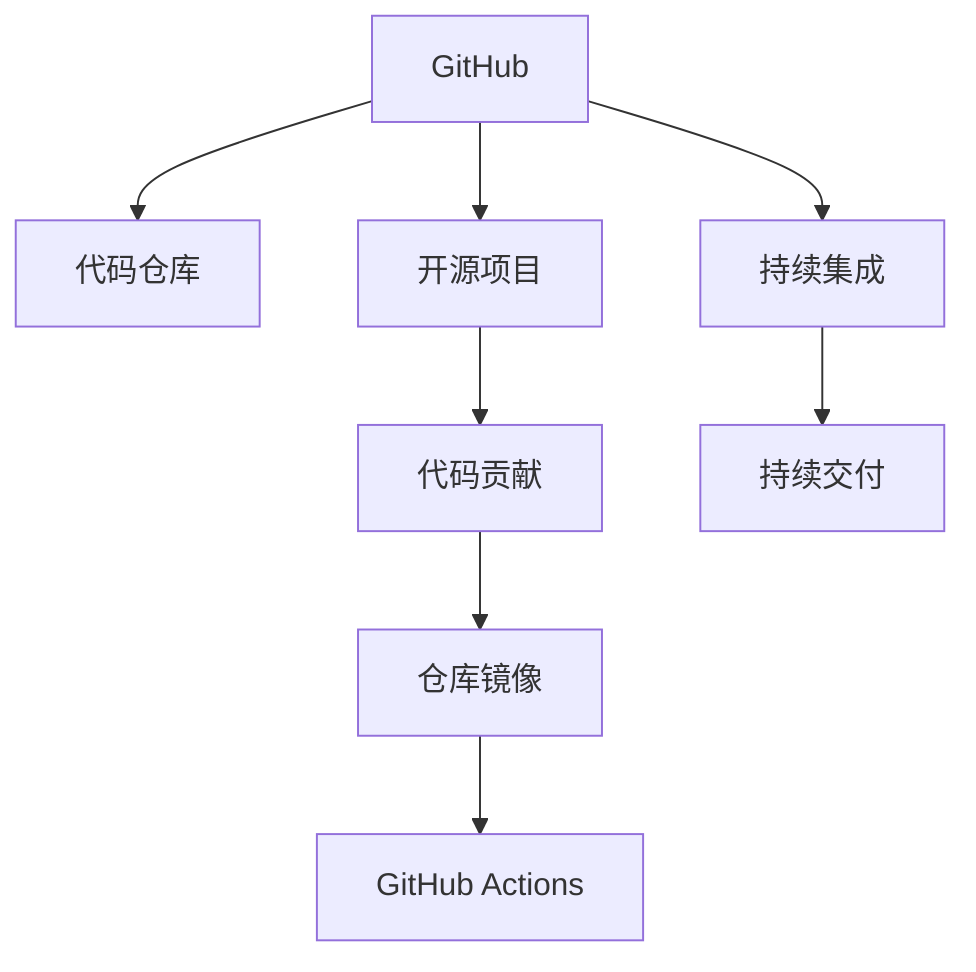

                 

# 程序员如何利用GitHub进行知识营销

## 1. 背景介绍

随着互联网和软件开发技术的发展，GitHub已经成为了全球最大的代码托管平台之一。它不仅仅是一个代码仓库，更是一个社区、一个网络、一个生态系统。通过GitHub，程序员不仅可以共享代码、协作开发，还可以进行知识营销、技术分享。本文将探讨如何利用GitHub进行知识营销，帮助程序员在技术圈内外建立自己的品牌影响力。

## 2. 核心概念与联系

### 2.1 核心概念概述

要利用GitHub进行知识营销，首先需要理解几个关键概念：

- **GitHub**：一个基于Web的Git仓库托管平台，支持代码版本控制和协作开发。
- **代码仓库**：GitHub上用来存储和管理代码的容器，可以是公开的、私有的或团队的。
- **开源项目**：GitHub上的代码仓库，向所有人开放，供他人阅读、修改、使用。
- **代码贡献**：向开源项目提交代码，或者为其他人的代码贡献修复、优化等改进。
- **仓库镜像**：将代码从GitHub上的一个仓库同步到另一个仓库的过程，常用于团队协作。
- **GitHub Actions**：GitHub提供的一种持续集成和持续交付(CI/CD)服务，用于自动化构建、测试和部署代码。

这些概念构成了GitHub知识营销的基础，帮助程序员通过代码、文档和社区互动，展示自己的技术能力和专业知识。

### 2.2 核心概念原理和架构的 Mermaid 流程图



该流程图展示了GitHub知识营销的核心流程：代码提交到仓库，成为开源项目，通过代码贡献和持续集成/交付，实现知识传播和分享。

## 3. 核心算法原理 & 具体操作步骤

### 3.1 算法原理概述

基于GitHub的知识营销，其核心在于通过代码展示、社区互动和技术分享，建立个人或团队的品牌影响力。以下是该过程的算法原理：

- **代码贡献**：通过向开源项目贡献代码，展示个人或团队的技术能力，建立专业声誉。
- **文档撰写**：编写详细的代码注释、技术博客、项目文档，分享知识和经验，吸引关注。
- **社区互动**：参与开源项目讨论、回答问题、组织技术讨论会，建立社区影响力。
- **持续集成**：通过GitHub Actions等工具，自动化构建和部署代码，展示技术实力和专业水平。

### 3.2 算法步骤详解

1. **选择开源项目**：选择一个与你的技术栈和兴趣相关、活跃度高的开源项目。
2. **贡献代码**：阅读项目文档，熟悉项目结构，贡献代码修复、功能增强等改进。
3. **撰写文档**：为项目编写详细的使用指南、API文档、技术博客，分享知识。
4. **参与讨论**：在项目的issue和pull request中积极参与讨论，解答其他开发者的疑问。
5. **组织活动**：组织技术分享会、线上线下技术讨论会，吸引更多开发者参与。
6. **持续集成**：利用GitHub Actions等工具，自动化构建、测试和部署代码，展示专业水平。

### 3.3 算法优缺点

#### 优点：
- **展示技术能力**：通过代码贡献和持续集成/交付，展示个人或团队的技术能力和专业水平。
- **建立社区影响力**：通过积极参与开源项目和社区互动，建立专业社区的影响力和声誉。
- **分享知识经验**：通过编写文档和技术博客，分享知识和经验，吸引更多关注和合作机会。

#### 缺点：
- **时间和精力投入**：需要花费大量时间和精力维护开源项目和参与社区活动。
- **代码质量要求高**：提交的代码需要高质量、规范，否则可能影响项目质量和声誉。
- **社区环境复杂**：开源社区环境复杂，可能遇到合作不顺畅、意见分歧等问题。

### 3.4 算法应用领域

GitHub知识营销的应用领域广泛，包括但不限于：

- **技术博客**：在个人或公司博客上分享技术文章、代码解析、项目经验等。
- **开源项目**：参与开源项目贡献代码、文档编写、社区互动等，展示技术能力。
- **GitHub Pages**：利用GitHub Pages发布静态网站，展示技术作品、博客等。
- **GitHub Actions**：利用GitHub Actions实现持续集成和持续交付，提升技术实力。
- **技术社区**：在Stack Overflow、GitHub等技术社区积极参与讨论、回答问题，建立专业影响力。

## 4. 数学模型和公式 & 详细讲解 & 举例说明

### 4.1 数学模型构建

假设有一个开源项目，我们希望通过代码贡献和持续集成展示技术能力，建立社区影响力。

- **代码贡献模型**：
  $$
  C_i = \alpha P_i + \beta R_i
  $$
  其中，$C_i$ 为第$i$次代码贡献的分数，$\alpha$ 和 $\beta$ 为代码贡献的质量权重，$P_i$ 和 $R_i$ 分别为代码提交的公共性（公开提交）和相关性（与项目相关）。

- **持续集成模型**：
  $$
  G_i = \gamma T_i + \delta E_i
  $$
  其中，$G_i$ 为第$i$次持续集成的质量得分，$\gamma$ 和 $\delta$ 为持续集成的效率和效果权重，$T_i$ 和 $E_i$ 分别为构建时间和错误率。

### 4.2 公式推导过程

通过上述模型，我们可以对代码贡献和持续集成进行量化评估。对于代码贡献，我们通过公共性和相关性进行加权，得到总分数$C_i$。对于持续集成，我们通过构建时间和错误率进行加权，得到总质量得分$G_i$。

### 4.3 案例分析与讲解

以一个GitHub上的开源项目为例，我们通过贡献代码和实现持续集成来评估其影响力。我们统计了100次代码提交，其中40次是公开提交，60次与项目相关。每次代码提交的构建时间为1小时，错误率为0.2。

根据模型，我们可以计算每次代码提交的贡献分数和质量得分，得到平均贡献分数$C_{avg}$和平均质量得分$G_{avg}$。通过这些指标，我们可以评估程序员的技术能力和持续集成水平，进而衡量其知识营销效果。

## 5. 项目实践：代码实例和详细解释说明

### 5.1 开发环境搭建

为了进行GitHub知识营销的实践，我们需要以下开发环境：

- **Git**：用于版本控制和代码仓库管理。
- **GitHub账号**：用于创建和管理代码仓库。
- **GitHub Pages**：用于发布静态网站，展示技术作品和博客。
- **GitHub Actions**：用于持续集成和持续交付。

1. **安装Git**：从官网下载安装Git，并进行配置。
2. **创建GitHub账号**：访问GitHub官网，创建并登录GitHub账号。
3. **搭建GitHub Pages**：通过GitHub Pages发布个人或公司博客，展示技术作品和文章。
4. **配置GitHub Actions**：在项目中配置GitHub Actions，实现代码构建、测试和部署。

### 5.2 源代码详细实现

以下是利用GitHub进行知识营销的示例代码：

1. **创建代码仓库**：
```python
import git

repo = git.Repo.clone_from('https://github.com/your-username/your-repo.git', 'my-repo')
```

2. **提交代码**：
```python
commit_message = "Add new feature"
repo.git.add('.')
repo.git.commit(message=commit_message)
```

3. **发布代码到GitHub Pages**：
```python
print("\nPushing to GitHub Pages...")
repo.git.push('gh', branch='master')
```

4. **配置GitHub Actions**：
```yaml
name: My Workflow
on:
  push:
    branches:
      - master
jobs:
  build:
    runs-on: ubuntu-latest
    steps:
      - uses: actions/checkout@v2
      - name: Setup Python 3.8
        uses: actions/setup-python@v2
        with:
          python-version: '3.8'
      - name: Install Dependencies
        run: |
          python -m pip install -r requirements.txt
      - name: Build
        run: |
          python my_script.py
      - name: Push Artifacts
        uses: actions/upload-artifact@v2
        with:
          name: artifacts
          path: .
```

### 5.3 代码解读与分析

1. **创建代码仓库**：使用Python的git库克隆一个已存在的代码仓库到本地，创建一个新的本地仓库。
2. **提交代码**：使用git命令添加并提交新功能代码，并附带提交信息。
3. **发布代码到GitHub Pages**：将本地仓库推送到GitHub Pages，展示技术作品和博客。
4. **配置GitHub Actions**：在项目根目录下创建一个`.github/workflows`目录，编写一个`.yml`文件配置持续集成，包括构建、测试和部署步骤。

### 5.4 运行结果展示

通过上述代码和步骤，我们可以将代码提交到GitHub，并实现持续集成，展示个人或团队的技术实力。运行结果可以通过GitHub Pages展示，吸引更多开发者关注和合作。

## 6. 实际应用场景

### 6.1 开源社区贡献

开源社区是程序员展示技术能力的最佳场所。通过向活跃的开源项目贡献代码和文档，展示个人或团队的技术实力，建立专业声誉。

### 6.2 技术博客和文档

技术博客和文档是展示知识和经验的重要途径。通过撰写详细的技术博客、代码解析和项目文档，吸引更多开发者关注，建立专业影响力。

### 6.3 技术社区互动

积极参与Stack Overflow、GitHub等技术社区的讨论、回答问题，建立社区声誉，吸引更多合作机会。

### 6.4 未来应用展望

随着GitHub的不断发展和社区的壮大，利用GitHub进行知识营销的潜力将进一步释放。未来，GitHub将提供更多工具和平台，帮助程序员展示技术能力和分享知识经验。

## 7. 工具和资源推荐

### 7.1 学习资源推荐

1. **《GitHub指南》**：GitHub官方提供的详细指南，涵盖GitHub的基本操作和高级功能。
2. **《GitHub Pro》**：GitHub提供的付费服务，包含更多高级功能和协作工具。
3. **《GitHub Actions官方文档》**：GitHub提供的持续集成和持续交付的详细文档和教程。
4. **《GitHub Pages教程》**：GitHub提供的静态网站发布的详细教程。
5. **《GitHub技术博客》**：GitHub提供的技术博客和分享平台，展示开发者技术和经验。

### 7.2 开发工具推荐

1. **Visual Studio Code**：轻量级的代码编辑器，支持Git和GitHub集成。
2. **GitHub Desktop**：GitHub官方的桌面工具，方便进行代码管理和仓库操作。
3. **GitHub Pages**：GitHub提供的静态网站发布平台，方便展示技术作品和博客。
4. **GitHub Actions**：GitHub提供的持续集成和持续交付服务，方便自动化构建和部署代码。

### 7.3 相关论文推荐

1. **《利用GitHub进行开源社区贡献的研究》**：探讨如何在GitHub上有效展示技术能力和建立社区声誉。
2. **《GitHub Pages技术与应用》**：分析GitHub Pages的实现原理和应用场景。
3. **《GitHub Actions的最佳实践》**：总结GitHub Actions的配置技巧和优化方法。

## 8. 总结：未来发展趋势与挑战

### 8.1 总结

本文详细介绍了利用GitHub进行知识营销的方法和步骤。通过代码贡献、持续集成和社区互动，程序员可以在技术圈内外建立专业声誉，展示技术能力和专业知识。

### 8.2 未来发展趋势

1. **技术进步**：GitHub作为全球最大的代码托管平台，其功能和工具将不断进步，支持更多的技术创新和应用场景。
2. **社区发展**：GitHub社区将不断壮大，为程序员提供更多展示和交流的平台。
3. **生态系统完善**：GitHub将与其他技术生态系统深度融合，提供更多协作和集成工具。

### 8.3 面临的挑战

1. **时间和精力投入**：利用GitHub进行知识营销需要花费大量时间和精力，可能影响其他工作。
2. **代码质量要求高**：提交的代码需要高质量、规范，否则可能影响项目质量和声誉。
3. **社区环境复杂**：开源社区环境复杂，可能遇到合作不顺畅、意见分歧等问题。

### 8.4 研究展望

1. **自动化工具开发**：开发更多自动化工具，提升代码贡献和持续集成/交付的效率和质量。
2. **社区互动机制**：研究社区互动机制，建立更加高效和友好的合作环境。
3. **知识共享平台**：建立知识共享平台，提供更多技术资源和知识分享机会。

## 9. 附录：常见问题与解答

**Q1: 如何选择合适的开源项目进行贡献？**

A: 选择与你的技术栈和兴趣相关、活跃度高的开源项目。可以通过GitHub的热门项目、技术社区的讨论等方式筛选合适的项目。

**Q2: 代码贡献应该如何进行？**

A: 阅读项目文档，熟悉项目结构，贡献代码修复、功能增强等改进。可以从小处入手，逐步深入项目核心。

**Q3: 如何利用GitHub Actions实现持续集成/交付？**

A: 在项目根目录下创建一个`.github/workflows`目录，编写一个`.yml`文件配置持续集成/交付，包括构建、测试和部署步骤。可以参考GitHub官方文档进行配置。

**Q4: 如何利用GitHub Pages展示技术作品和博客？**

A: 在GitHub Pages上创建一个静态网站，将技术作品和博客文章同步到GitHub Pages上，方便开发者和社区成员访问。

---

作者：禅与计算机程序设计艺术 / Zen and the Art of Computer Programming

