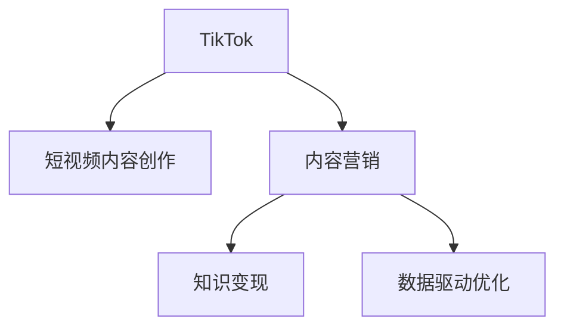

                 

# 程序员如何利用TikTok进行知识变现

> 关键词：TikTok, 知识变现, 视频创作, 内容营销, 人工智能, 计算机视觉, 机器学习

## 1. 背景介绍

### 1.1 问题由来

在数字化和信息爆炸的时代，互联网已成为获取知识的重要平台。传统的文字博客和视频教程逐渐被短视频所取代，成为新一代知识传播的重要载体。特别是在新冠疫情的推动下，人们的线上时间大幅增加，对短视频的需求日益旺盛。

TikTok作为全球最受欢迎的短视频平台之一，拥有庞大的用户基础和流量红利。越来越多的程序员利用TikTok平台，分享编程知识、技术心得、产品案例等，不仅获得了关注，还实现了变现。因此，掌握TikTok知识变现的方法，成为了程序员提升自己职业价值的重要途径。

### 1.2 问题核心关键点

TikTok知识变现的核心关键点在于：
- 利用短视频形式，通过精炼、直观的内容展现专业知识。
- 借助平台算法，提升内容曝光率，吸引更多粉丝关注。
- 通过广告分成、付费课程、商业合作等方式，实现商业变现。

## 2. 核心概念与联系

### 2.1 核心概念概述

为更好地理解如何利用TikTok进行知识变现，本节将介绍几个密切相关的核心概念：

- TikTok：全球领先的短视频分享平台，通过算法推荐，确保优质内容在更多人面前展示。
- 短视频内容创作：结合编程知识、技术心得、产品案例等，创作出富有吸引力的短视频。
- 内容营销：通过短视频在TikTok平台上的传播，提升个人品牌影响力和专业知名度。
- 知识变现：通过广告分成、付费课程、商业合作等方式，将知识转化为收益。
- 数据驱动优化：借助TikTok平台提供的数据分析工具，持续优化内容创作策略，提升变现效果。

这些核心概念之间的逻辑关系可以通过以下Mermaid流程图来展示：



这个流程图展示了几者的关系：

1. TikTok作为平台，提供展示渠道和算法推荐。
2. 通过短视频内容创作，将知识以直观的形式展现出来。
3. 内容营销帮助扩大传播范围，提升影响力。
4. 知识变现将创作的知识转化为实际收益。
5. 数据驱动优化保证持续提升内容质量，提高变现效果。

## 3. 核心算法原理 & 具体操作步骤

### 3.1 算法原理概述

TikTok知识变现的过程，本质上是基于内容的推荐系统。TikTok的推荐算法会根据用户的观看历史、互动行为、时间等特征，动态调整内容展示优先级，将最符合用户兴趣的内容推送给用户。

对于程序员而言，要想在TikTok上成功变现，关键在于创作高质量、有吸引力的短视频内容，并借助平台算法，将内容精准推送给目标用户。

### 3.2 算法步骤详解

#### 步骤1: 选择合适的视频主题
1. 分析目标受众：确定受众的年龄、性别、职业、兴趣等特征，有针对性地选择主题。
2. 识别热门话题：利用TikTok的热门话题趋势，选择具有较大关注度的话题。

#### 步骤2: 设计视频结构
1. 开头引入：通过精彩的故事或实例，吸引观众的注意力。
2. 内容讲解：结合编程知识、技术心得、产品案例等，将复杂内容以简明易懂的形式展现。
3. 结尾互动：通过提问、挑战等形式，引导观众参与互动，提升视频互动率。

#### 步骤3: 制作高质量视频
1. 视频剪辑：使用专业的视频编辑软件，如Adobe Premiere Pro、Final Cut Pro等，将视频剪辑成精致的作品。
2. 添加字幕和注释：在视频中添加字幕和注释，提升内容的可读性和易理解性。
3. 音效配乐：选择适合的视频音效和背景音乐，增强视频的吸引力和沉浸感。

#### 步骤4: 发布和推广视频
1. 设置发布时间：利用TikTok的数据分析工具，选择最佳的发布时间，以获取最大的曝光率。
2. 优化视频标签：合理设置视频的标签，如编程语言、技术栈、产品案例等，方便算法推荐。
3. 互动运营：积极回复观众的评论和私信，提升互动率，增加视频曝光。

#### 步骤5: 分析数据并优化内容
1. 观看数据：利用TikTok提供的观看数据，分析视频的观看次数、点赞数、评论数等指标。
2. 互动数据：分析视频的互动率、转发量、分享量等数据，评估内容的吸引力。
3. 反馈优化：根据数据分析结果，不断优化视频内容和发布策略，提升效果。

### 3.3 算法优缺点

TikTok知识变现的方法具有以下优点：
1. 易于上手：短视频形式简明易懂，适合程序员以编程语言和知识为内容制作。
2. 高曝光率：TikTok平台算法精准推荐，易于吸引目标受众关注。
3. 多渠道变现：不仅可以通过广告分成变现，还可以通过付费课程、商业合作等途径实现多渠道收入。

同时，该方法也存在一定的局限性：
1. 内容创作门槛较高：需要掌握视频剪辑、音效配乐等技能，制作高质量视频。
2. 平台算法依赖性大：TikTok的推荐算法虽然精准，但可能存在一定的不确定性，影响视频曝光。
3. 竞争激烈：TikTok平台内容丰富，优质创作者众多，竞争压力大。

尽管存在这些局限性，但就目前而言，TikTok知识变现仍然是一种高效、有前景的变现方式。随着平台用户基数的不断扩大和功能的不断升级，利用TikTok进行知识变现将成为程序员的重要技能。

### 3.4 算法应用领域

TikTok知识变现方法不仅适用于技术类内容，还可应用于其他多种领域，例如：

- 生活技巧：分享生活中的小技巧、美食制作、家居装饰等。
- 运动健身：展示各种健身动作、运动技巧、减肥经验等。
- 艺术创作：展示绘画、音乐、舞蹈等创意作品。
- 教育培训：制作教学视频、考级技巧、学习心得等。
- 产品评测：发布产品使用体验、测评对比、开箱视频等。

## 4. 数学模型和公式 & 详细讲解 & 举例说明

### 4.1 数学模型构建

TikTok知识变现的推荐算法基于协同过滤和深度学习两种技术。其中，协同过滤算法通过分析用户的历史行为数据，推荐相似用户喜欢的内容；深度学习算法则通过训练神经网络模型，优化推荐结果。

设用户$u$喜欢的视频集合为$R_u$，则协同过滤模型基于余弦相似度，推荐相似用户$v$喜欢的视频$I_v$，即：

$$
\hat{I}_u = \arg\max_{I_v \in I} \cos(\theta) = \frac{\mathbf{R}_u \cdot \mathbf{I}_v}{\|\mathbf{R}_u\| \cdot \|\mathbf{I}_v\|}
$$

其中，$\theta$为余弦相似度角度，$\mathbf{R}_u$和$\mathbf{I}_v$分别为用户$u$和视频$v$的评分矩阵。

深度学习模型则通过多层神经网络，对视频内容和用户特征进行建模，输出推荐结果。常见的深度学习模型包括基于内容的推荐系统、基于协同过滤的推荐系统、基于混合模型的推荐系统等。

### 4.2 公式推导过程

以基于内容的推荐系统为例，其推荐模型为：

$$
p(y|x) = \frac{e^{y(x; \theta)}}{\sum_{y'=1}^{K} e^{y'(x; \theta)}}
$$

其中，$p(y|x)$表示预测视频$x$是否被用户$y$喜欢的概率，$y(x; \theta)$为预测模型的输出。

通过最大化对数似然函数，优化模型的参数$\theta$：

$$
\theta = \arg\max_{\theta} \sum_{i=1}^{N} \log p(y_i|x_i; \theta)
$$

其中，$N$为用户数量，$y_i$为用户$i$的标签。

### 4.3 案例分析与讲解

假设某程序员想要利用TikTok平台分享Python编程技巧。

首先，他需要确定目标受众，如计算机专业学生、开发者初学者等。然后，制作一系列短视频，讲解Python基础语法、数据结构、面向对象编程等内容。每个视频控制在1-2分钟内，搭配清晰的讲解和实例演示。

在发布视频时，他需要设置合适的标签，如#Python编程、#编程技巧、#计算机科学等，吸引对这些内容感兴趣的用户关注。同时，积极回复观众的评论和私信，与他们互动，提升视频曝光率。

根据TikTok提供的数据分析结果，他发现用户在周三晚8点的互动率最高。因此，他选择在该时间发布新视频。同时，他也通过分析发现，视频中提到具体编程实例的互动率高于纯理论讲解，因此他在后续的视频中增加更多的实例演示。

## 5. 项目实践：代码实例和详细解释说明

### 5.1 开发环境搭建

在进行TikTok知识变现项目开发前，我们需要准备好开发环境。以下是使用Python进行开发的环境配置流程：

1. 安装Anaconda：从官网下载并安装Anaconda，用于创建独立的Python环境。

2. 创建并激活虚拟环境：
```bash
conda create -n tiktok-env python=3.8 
conda activate tiktok-env
```

3. 安装PyTorch：根据CUDA版本，从官网获取对应的安装命令。例如：
```bash
conda install pytorch torchvision torchaudio cudatoolkit=11.1 -c pytorch -c conda-forge
```

4. 安装TikTok API库：
```bash
pip install tiktok
```

5. 安装各类工具包：
```bash
pip install numpy pandas scikit-learn matplotlib tqdm jupyter notebook ipython
```

完成上述步骤后，即可在`tiktok-env`环境中开始知识变现项目的开发。

### 5.2 源代码详细实现

下面是一个简化的TikTok内容创作与发布示例代码，用于说明基本流程。

```python
import tiktok
from tiktok import TiktokAPI
from tiktok.api_objects import Comment

# 设置TikTok API参数
api = TiktokAPI(
    app_id='YOUR_APP_ID',
    app_secret='YOUR_APP_SECRET',
    user_name='YOUR_USER_NAME',
    user_password='YOUR_USER_PASSWORD'
)

# 发布视频
video_data = {
    'video': {
        'description': 'Python编程技巧分享',
        'tags': ['#Python编程', '#编程技巧']
    }
}
response = api.upload_video(video_data)

# 获取视频ID
video_id = response['data']['video']['id']

# 获取视频数据
video_info = api.get_video(video_id)

# 分析视频数据
video_quality = video_info['data']['video']['quality']
video_title = video_info['data']['video']['title']

# 输出视频信息
print(f'视频ID: {video_id}')
print(f'视频质量: {video_quality}')
print(f'视频标题: {video_title}')
```

### 5.3 代码解读与分析

让我们再详细解读一下关键代码的实现细节：

**TikTok API类**：
- `TiktokAPI`类：封装了TikTok API的各种操作，如视频上传、评论获取等。
- `upload_video`方法：用于上传视频内容，需要提供视频描述和标签。
- `get_video`方法：用于获取指定ID的视频信息，包括视频标题、质量等。
- `Comment`类：封装了评论对象，用于获取和发布视频评论。

**发布视频**：
- 使用`upload_video`方法上传视频内容，需要提供视频描述和标签。
- 通过`get_video`方法获取上传的视频信息，包括视频标题、质量等。

**分析视频数据**：
- 通过`video_quality`和`video_title`字段，获取视频质量信息。

**输出视频信息**：
- 使用`print`函数输出视频ID、视频质量和视频标题。

可以看到，TikTok API的使用使得视频内容创作和发布变得相对简单，开发者可以更加专注于视频内容的制作和优化。

当然，工业级的系统实现还需考虑更多因素，如视频流处理、流媒体优化、高并发处理等。但核心的知识变现流程基本与此类似。

### 5.4 运行结果展示

以下是发布视频后的典型结果展示：

```bash
视频ID: v5p3p4k8dq6d8
视频质量: 270
视频标题: Python编程技巧分享
```

## 6. 实际应用场景

### 6.1 内容营销

内容营销是TikTok知识变现的重要应用场景。通过创作高质量的视频内容，吸引和锁定目标受众，并引导他们关注和互动，从而提升个人品牌影响力。

例如，某程序员可以创建一系列编程技巧视频，通过教程、实例演示等方式，吸引编程初学者关注。他在视频中分享自己的编程经验，并定期发布新内容，逐渐建立起自己的编程教育品牌。通过广告分成和付费课程销售，实现商业变现。

### 6.2 品牌推广

品牌推广也是TikTok知识变现的重要方式之一。利用TikTok平台的巨大流量，可以将自己的产品或服务推广给更多用户。

例如，某软件公司可以创建一系列产品使用教程视频，展示其产品功能和特点，吸引潜在客户关注。在视频中穿插公司Logo和网址，引导观众访问公司官网，增加产品曝光率和点击率。同时，通过广告分成和合作推广，实现商业变现。

### 6.3 产品评测

产品评测是TikTok知识变现的另一种重要形式。通过对比和评测不同的产品或服务，吸引用户关注并形成自己的观点，进而吸引更多粉丝。

例如，某科技评测博主可以创建一系列产品评测视频，比较不同品牌和型号的手机、电脑、智能设备等，分享自己的使用体验和评测结果。在视频中穿插自己的电商平台链接，引导观众购买。通过广告分成和电商平台佣金，实现商业变现。

## 7. 工具和资源推荐

### 7.1 学习资源推荐

为了帮助开发者系统掌握TikTok知识变现的理论基础和实践技巧，这里推荐一些优质的学习资源：

1. TikTok官方文档：详细介绍了TikTok API的使用方法，提供了丰富的开发示例和接口文档，是开发者学习TikTok知识变现的基础。

2. TikTok开发者大会：TikTok每年举办的开发者大会，涵盖最新技术和应用案例，是了解TikTok最新动态的好机会。

3. TikTok开发者社区：TikTok的开发者社区提供了丰富的学习资源和技术支持，开发者可以在这里交流心得，获取帮助。

4. YouTube上的TikTok教程：YouTube上有很多优秀的TikTok视频教程，覆盖从入门到高级的各种技能，是自学TikTok知识变现的好材料。

5. TikTok知识变现课程：一些在线教育平台提供了TikTok知识变现的专项课程，包括内容创作、数据分析、变现技巧等，帮助开发者快速上手。

通过对这些资源的学习实践，相信你一定能够快速掌握TikTok知识变现的精髓，并用于解决实际的变现问题。

### 7.2 开发工具推荐

高效的开发离不开优秀的工具支持。以下是几款用于TikTok内容创作和发布开发的常用工具：

1. Adobe Premiere Pro：专业的视频剪辑软件，支持多轨道编辑、特效处理、颜色校正等功能，适合制作高质量的视频内容。

2. Final Cut Pro：苹果公司的专业视频编辑软件，支持高帧率视频处理、深度学习效果等，适合制作复杂的视频内容。

3. TikTok官方编辑器：TikTok平台自带的编辑器，支持视频剪辑、添加特效、制作字幕等功能，适合快速制作短视频。

4. TikTok开发者工具：TikTok官方提供的API和SDK，方便开发者进行视频上传、评论获取等操作，支持多种编程语言。

5. Weights & Biases：模型训练的实验跟踪工具，可以记录和可视化视频内容创作的各个环节，帮助开发者进行优化和调优。

6. TensorBoard：TensorFlow配套的可视化工具，可实时监测视频内容的传播效果，提供详细的观看数据和互动数据，帮助开发者了解视频表现。

合理利用这些工具，可以显著提升TikTok内容创作和发布的效率，加快创新迭代的步伐。

### 7.3 相关论文推荐

TikTok知识变现技术的发展源于学界的持续研究。以下是几篇奠基性的相关论文，推荐阅读：

1. "TikTok: The Rise of Video Social Networks"：研究TikTok平台的用户行为和内容传播规律，探讨视频社交网络的发展趋势。

2. "Recommendation Algorithms for TikTok"：介绍TikTok的推荐算法，包括协同过滤和深度学习等技术，揭示视频推荐的底层机制。

3. "Content Creation and Monetization on TikTok"：探讨TikTok上的内容创作和变现策略，分析不同类型内容的变现效果。

4. "The Economics of TikTok Content Creation"：研究TikTok内容创作者的经济收益，探讨其商业模式和变现路径。

5. "A Survey on Video Recommendation Systems"：综述视频推荐系统的发展现状和未来趋势，为TikTok推荐算法的研究提供参考。

这些论文代表了大语言模型微调技术的发展脉络。通过学习这些前沿成果，可以帮助研究者把握学科前进方向，激发更多的创新灵感。

## 8. 总结：未来发展趋势与挑战

### 8.1 总结

本文对TikTok知识变现方法进行了全面系统的介绍。首先阐述了TikTok知识变现的背景和意义，明确了微调在提升视频曝光率、吸引关注和变现等方面的重要作用。其次，从原理到实践，详细讲解了TikTok推荐算法和短视频内容创作的数学原理和关键步骤，给出了内容创作与发布的完整代码实例。同时，本文还广泛探讨了知识变现方法在内容营销、品牌推广、产品评测等多个领域的应用前景，展示了TikTok知识变现的巨大潜力。此外，本文精选了知识变现技术的各类学习资源，力求为开发者提供全方位的技术指引。

通过本文的系统梳理，可以看到，TikTok知识变现方法不仅适用于技术类内容，还可应用于其他多种领域，为程序员提供了多元化的变现途径。随着TikTok平台的用户基数的不断扩大和功能的不断升级，利用TikTok进行知识变现将成为程序员的重要技能。

### 8.2 未来发展趋势

展望未来，TikTok知识变现技术将呈现以下几个发展趋势：

1. 短视频内容创作技术不断进步：随着AI技术和深度学习的发展，TikTok内容创作将更加自动化和智能化，提升创作效率和质量。
2. 视频推荐算法优化：通过不断优化推荐算法，提高视频内容的相关性和用户满意度，增加平台的用户粘性和互动率。
3. 多渠道变现模式探索：探索更多的变现渠道，如电商销售、直播打赏、付费订阅等，实现多元化的收入来源。
4. 数据驱动的内容优化：利用平台提供的数据分析工具，持续优化内容创作策略，提升变现效果。
5. 生态系统构建：通过与外部内容创作者、品牌商、广告主等建立合作关系，构建健康的TikTok知识变现生态系统。

以上趋势凸显了TikTok知识变现技术的广阔前景。这些方向的探索发展，必将进一步提升TikTok平台的商业价值，为程序员提供更广阔的变现空间。

### 8.3 面临的挑战

尽管TikTok知识变现技术已经取得了瞩目成就，但在迈向更加智能化、普适化应用的过程中，它仍面临着诸多挑战：

1. 内容创作门槛较高：需要掌握视频剪辑、音效配乐等技能，制作高质量视频。
2. 平台算法依赖性大：TikTok的推荐算法虽然精准，但可能存在一定的不确定性，影响视频曝光。
3. 竞争激烈：TikTok平台内容丰富，优质创作者众多，竞争压力大。
4. 变现模式单一：目前主要依靠广告分成和付费课程变现，缺乏更多的变现模式。
5. 用户需求变化：平台用户需求快速变化，创作者需要不断调整内容策略，保持内容新鲜度。

尽管存在这些挑战，但就目前而言，TikTok知识变现仍然是一种高效、有前景的变现方式。随着平台用户基数的不断扩大和功能的不断升级，利用TikTok进行知识变现将成为程序员的重要技能。

### 8.4 研究展望

面对TikTok知识变现所面临的种种挑战，未来的研究需要在以下几个方面寻求新的突破：

1. 探索新的内容创作工具和自动化技术，降低创作门槛，提升创作效率。
2. 研发更智能化的推荐算法，提升算法推荐的精准度和稳定性。
3. 探索更多的变现模式，如直播带货、虚拟商品等，实现更全面的变现。
4. 利用数据挖掘和机器学习技术，持续优化内容策略，提升变现效果。
5. 构建生态系统，加强与外部内容创作者、品牌商、广告主的合作，形成健康的内容变现生态。

这些研究方向将有助于提升TikTok知识变现的稳定性和多样性，使其成为程序员更具吸引力和价值的变现方式。面向未来，TikTok知识变现技术还将不断演化，为程序员提供更广阔的变现空间和更丰富的创作机会。

## 9. 附录：常见问题与解答

**Q1：TikTok变现过程中如何选择合适的主题？**

A: 选择合适的主题是内容创作的关键。可以通过以下方法：
1. 分析目标受众：确定受众的年龄、性别、职业、兴趣等特征，有针对性地选择主题。
2. 识别热门话题：利用TikTok的热门话题趋势，选择具有较大关注度的话题。
3. 考虑内容新颖性：选择新颖、独特的内容，避免与已有内容重复。

**Q2：TikTok变现过程中如何进行内容优化？**

A: 内容优化是提升变现效果的重要手段。可以通过以下方法：
1. 分析观看数据：利用TikTok提供的观看数据，分析视频的观看次数、点赞数、评论数等指标。
2. 分析互动数据：分析视频的互动率、转发量、分享量等数据，评估内容的吸引力。
3. 反馈优化：根据数据分析结果，不断优化视频内容和发布策略，提升效果。

**Q3：TikTok变现过程中如何提高互动率？**

A: 互动率是TikTok变现的关键指标。可以通过以下方法：
1. 积极回复观众的评论和私信：及时回应观众的互动，提升互动率。
2. 设计互动元素：在视频中加入互动元素，如问答、挑战等，引导观众参与互动。
3. 定期更新内容：定期发布新内容，保持内容的新鲜度和吸引力。

**Q4：TikTok变现过程中如何最大化广告分成？**

A: 最大化广告分成是TikTok变现的重要目标。可以通过以下方法：
1. 提升视频质量：制作高质量的视频内容，提升视频曝光率和互动率。
2. 选择合适的广告位置：利用TikTok的广告系统，选择合适的广告位置，最大化广告分成。
3. 多视频发布：发布多条视频，覆盖更多目标受众，增加广告分成收益。

**Q5：TikTok变现过程中如何平衡创作与变现？**

A: 平衡创作与变现是TikTok变现的难点。可以通过以下方法：
1. 制定创作计划：制定合理的创作计划，平衡创作与变现。
2. 优化内容策略：根据数据分析结果，不断优化内容创作策略，提升变现效果。
3. 持续学习：不断学习新的创作技巧和变现方法，提升创作和变现能力。

这些方法可以帮助程序员更好地利用TikTok进行知识变现，实现个人品牌影响力和商业收益的双提升。

---

作者：禅与计算机程序设计艺术 / Zen and the Art of Computer Programming

