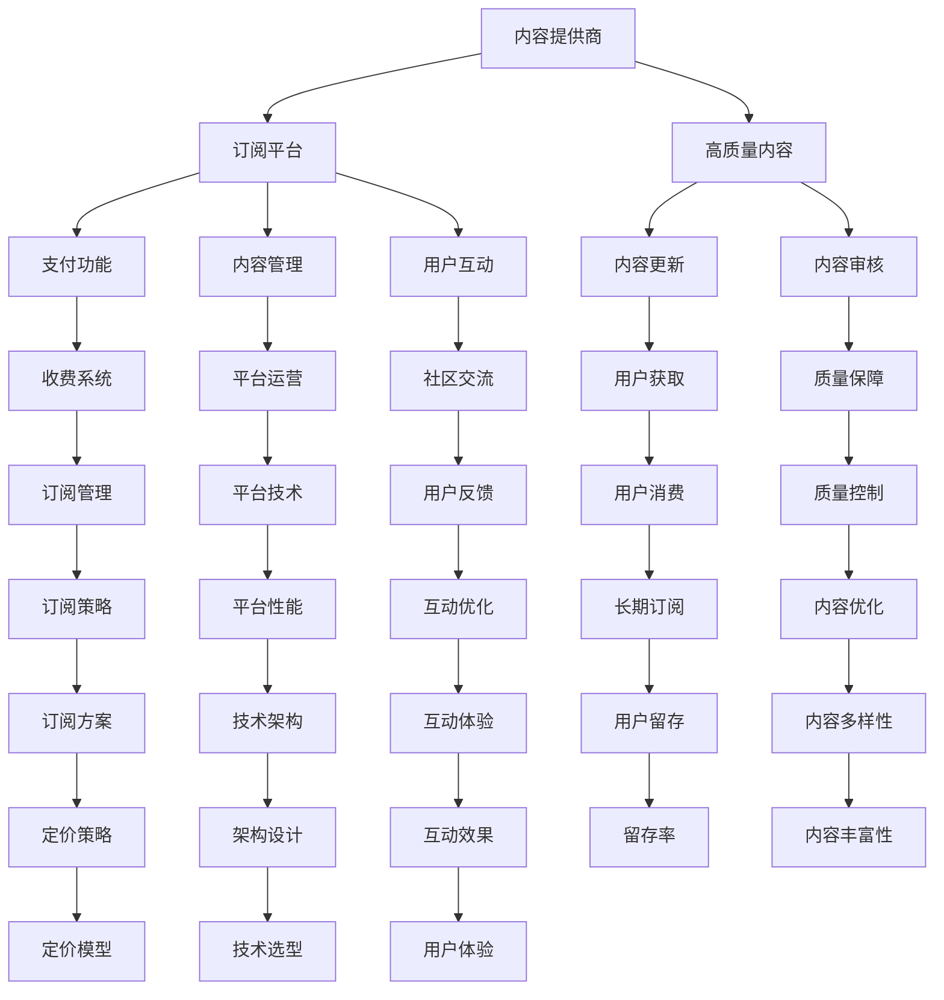

                 

## 1. 背景介绍

### 1.1 问题由来

随着互联网的普及和数字内容的日益丰富，知识付费逐渐成为用户获取高质量信息的主要方式。然而，由于传统知识付费模式（如一次性购买、订阅包年等）存在内容分散、质量不一、用户体验差等问题，越来越多的互联网公司和个人开始探索基于订阅制（Subscription-Based Model）的知识付费模式，以此来解决这些问题。

订阅制模式将高质量的知识内容通过持续更新的方式提供给用户，用户按月、按年或按需支付费用，可以享受更稳定、系统的学习体验，从而极大提高了知识付费的吸引力和用户的粘性。在编程和软件技术领域，该模式正逐渐被广泛应用，例如通过各种在线编程学习平台、技术博客和社区等形式，程序员可以利用订阅制模式进行知识付费，为用户提供系统化、高质量的编程知识和资源。

### 1.2 问题核心关键点

订阅制模式的核心在于利用持续更新的内容和高频次的互动体验，吸引用户进行长期订阅。其主要特点包括：

- **持续性**：内容按计划定期更新，保持用户的新鲜感和兴趣。
- **互动性**：提供多种互动方式，如问答、讨论、直播等，增加用户参与度。
- **灵活性**：用户可以根据自身需求，自由选择订阅的频率和时长。
- **优质性**：内容经过严格筛选和质量控制，保证用户获取的信息可靠且实用。
- **社区性**：构建用户社区，增强用户粘性和归属感。

## 2. 核心概念与联系

### 2.1 核心概念概述

为了更好地理解订阅制模式在知识付费中的应用，以下将介绍几个关键概念：

- **订阅制模式**：指用户按计划定期支付费用，获取持续更新的高质量内容。
- **内容提供商**：负责创建、维护和更新内容的组织或个人，如在线编程学习平台、技术博客等。
- **用户**：订阅并消费内容的消费者，可以是个人开发者、企业用户等。
- **订阅平台**：连接内容提供商和用户的第三方平台，负责收费、内容管理和用户互动等。

这些概念之间存在密切的联系，相互支持，共同构成了订阅制模式的知识付费生态系统。内容提供商提供优质内容，订阅平台提供技术支持和管理服务，用户则通过付费获取所需资源。

### 2.2 核心概念原理和架构的 Mermaid 流程图(Mermaid 流程节点中不要有括号、逗号等特殊字符)



## 3. 核心算法原理 & 具体操作步骤

### 3.1 算法原理概述

订阅制模式的核心算法原理是基于时间序列的推荐系统。该系统根据用户的订阅记录、消费行为和互动反馈，动态调整内容推送策略，提高用户的满意度和订阅率。其基本流程包括内容生成、用户选择、平台管理和反馈优化等步骤。

### 3.2 算法步骤详解

**Step 1: 内容生成**
内容生成是订阅制模式的第一步。内容提供商需根据订阅平台的策略，定期生产高质量的编程知识、工具、资源等。内容形式包括文章、视频、代码示例、在线课程等，覆盖编程语言、框架、工具、算法等各个方面。

**Step 2: 用户选择**
用户在订阅平台浏览、筛选并订阅自己感兴趣的内容。平台提供搜索、过滤、分类等功能，帮助用户快速找到合适的资源。用户可通过月度、年度等不同频次的订阅，选择不同深度的学习路径。

**Step 3: 平台管理**
订阅平台需提供良好的用户体验和管理功能，包括支付系统、内容管理系统、用户互动系统等。平台需确保用户支付流畅，内容更新及时，互动体验丰富。同时，平台需对内容进行严格审核，保证其高质量和合规性。

**Step 4: 反馈优化**
平台根据用户的订阅记录、消费行为和互动反馈，动态调整内容和推送策略。例如，根据用户的互动频率，调整内容推送的时间、频率和内容形式。通过用户满意度调查和评价反馈，优化平台功能和内容质量。

### 3.3 算法优缺点

**优点**：
- **持续性**：通过定期更新，保持用户新鲜感和兴趣。
- **互动性**：多种互动方式提高用户参与度。
- **灵活性**：用户自由选择订阅频率和时长。
- **优质性**：内容经过严格审核和质量控制。
- **社区性**：增强用户粘性和归属感。

**缺点**：
- **成本高**：内容生产和平台管理需要大量资源和技术支持。
- **风险大**：内容质量不稳定或平台运营不当，可能导致用户流失。
- **依赖性强**：高度依赖内容提供商和订阅平台。

### 3.4 算法应用领域

订阅制模式在知识付费领域具有广泛的应用前景，适用于以下场景：

- **编程学习平台**：如LeetCode、Codecademy、Coursera等，提供系统化编程课程、在线练习、社区交流等功能。
- **技术博客和社区**：如Medium、Stack Overflow、GitHub等，提供高质量的技术文章、代码示例、问答讨论等功能。
- **企业培训平台**：如Udemy for Business、LinkedIn Learning等，提供企业定制的编程培训、技术认证等功能。
- **在线编程工具**：如CodePen、JSFiddle等，提供实时编码和调试工具，支持用户上传和分享代码。

## 4. 数学模型和公式 & 详细讲解 & 举例说明（备注：数学公式请使用latex格式，latex嵌入文中独立段落使用 $$，段落内使用 $)
### 4.1 数学模型构建

订阅制模式的知识付费模型可以通过以下数学模型来描述：

假设用户总数为 $U$，内容总数为 $C$，每个用户每月订阅的内容数量为 $S_i$，内容更新的频率为 $F$，用户每月消费金额为 $E_i$。则总内容更新量为 $C \times F$，每月总消费金额为 $\sum_{i=1}^U E_i$。

### 4.2 公式推导过程

订阅制模式下的知识付费模型主要考虑以下两个方面的因素：

1. **用户订阅率**：设用户订阅率为 $P$，则有 $U \times P = U \times \frac{S_i}{C \times F}$，即用户订阅的内容数量与内容总数和更新频率成正比。
2. **用户消费行为**：设用户每月平均消费金额为 $E$，则有 $\frac{\sum_{i=1}^U E_i}{U} = \frac{E_i}{S_i}$，即用户消费金额与订阅内容数量成正比。

综合以上两个因素，可得总内容更新量与每月总消费金额的关系为：

$$ C \times F = \frac{U \times P \times S_i}{E_i} $$

### 4.3 案例分析与讲解

以LeetCode为例，分析其订阅制模式的运行机制。

LeetCode通过持续更新的题目库、在线练习和讨论区，吸引程序员订阅。其订阅模型如下：

- **内容生成**：LeetCode每天更新一定数量的新题目，并提供丰富的解题视频、文章和讨论区。
- **用户选择**：用户可按月、按年订阅，并选择不同的学习路径，如按难度、按类型等。
- **平台管理**：LeetCode提供流畅的支付系统、内容管理系统、互动系统等，确保用户体验。
- **反馈优化**：LeetCode通过用户反馈和互动数据，动态调整内容和推送策略，提高用户满意度。

## 5. 项目实践：代码实例和详细解释说明

### 5.1 开发环境搭建

**环境要求**：
- Python 3.8+
- Flask
- SQLAlchemy
- Redis
- Docker

**环境搭建步骤**：

1. 安装Python和Flask。
2. 配置SQLAlchemy作为数据库访问层。
3. 配置Redis作为缓存系统。
4. 安装Docker并启动容器。

### 5.2 源代码详细实现

以下是一个简单的订阅制模式平台后端代码实现：

**用户注册和登录**

```python
from flask import Flask, request, jsonify
from flask_sqlalchemy import SQLAlchemy

app = Flask(__name__)
app.config['SQLALCHEMY_DATABASE_URI'] = 'sqlite:///users.db'
db = SQLAlchemy(app)

class User(db.Model):
    id = db.Column(db.Integer, primary_key=True)
    username = db.Column(db.String(80), unique=True, nullable=False)
    password = db.Column(db.String(120), nullable=False)

@app.route('/register', methods=['POST'])
def register():
    username = request.json.get('username')
    password = request.json.get('password')
    if User.query.filter_by(username=username).first() is None:
        user = User(username=username, password=password)
        db.session.add(user)
        db.session.commit()
        return jsonify({'message': 'User registered successfully'})
    else:
        return jsonify({'message': 'Username already exists'})

@app.route('/login', methods=['POST'])
def login():
    username = request.json.get('username')
    password = request.json.get('password')
    user = User.query.filter_by(username=username).first()
    if user and user.check_password(password):
        session = request.session.new()
        session['user_id'] = user.id
        return jsonify({'message': 'Login successful'})
    else:
        return jsonify({'message': 'Invalid username or password'})
```

**内容订阅和消费**

```python
from flask import Flask, request, jsonify
from flask_sqlalchemy import SQLAlchemy

app = Flask(__name__)
app.config['SQLALCHEMY_DATABASE_URI'] = 'sqlite:///content.db'
db = SQLAlchemy(app)

class Content(db.Model):
    id = db.Column(db.Integer, primary_key=True)
    name = db.Column(db.String(80), unique=True, nullable=False)
    description = db.Column(db.String(255), nullable=False)
    is_published = db.Column(db.Boolean, default=True)
    subscription_price = db.Column(db.Decimal, nullable=False)

@app.route('/subscribe', methods=['POST'])
def subscribe():
    user_id = request.session.get('user_id')
    content_id = request.json.get('content_id')
    content = Content.query.filter_by(id=content_id).first()
    if user_id is None or content is None or content.is_published is False:
        return jsonify({'message': 'Invalid content or user'})
    if content.subscription_price <= 0:
        return jsonify({'message': 'Content price cannot be zero'})
    user = User.query.filter_by(id=user_id).first()
    if user.id is None:
        return jsonify({'message': 'Invalid user'})
    user.subscriptions.append(content)
    db.session.commit()
    return jsonify({'message': 'Subscription successful'})

@app.route('/consume', methods=['POST'])
def consume():
    user_id = request.session.get('user_id')
    content_id = request.json.get('content_id')
    user = User.query.filter_by(id=user_id).first()
    if user is None or content_id is None:
        return jsonify({'message': 'Invalid user or content'})
    for content in user.subscriptions:
        if content.id == content_id:
            user.balance -= content.subscription_price
            db.session.commit()
            return jsonify({'message': 'Consumption successful'})
    return jsonify({'message': 'Content not found'})
```

**订阅管理**

```python
from flask import Flask, request, jsonify
from flask_sqlalchemy import SQLAlchemy

app = Flask(__name__)
app.config['SQLALCHEMY_DATABASE_URI'] = 'sqlite:///subscriptions.db'
db = SQLAlchemy(app)

class Subscription(db.Model):
    id = db.Column(db.Integer, primary_key=True)
    user_id = db.Column(db.Integer, db.ForeignKey('user.id', ondelete='CASCADE', nullable=False))
    content_id = db.Column(db.Integer, db.ForeignKey('content.id', ondelete='CASCADE', nullable=False))
    price = db.Column(db.Decimal, nullable=False)
    start_date = db.Column(db.DateTime, nullable=False)
    end_date = db.Column(db.DateTime, nullable=False)

@app.route('/get_subscriptions', methods=['GET'])
def get_subscriptions():
    user_id = request.session.get('user_id')
    subscriptions = Subscription.query.filter_by(user_id=user_id).all()
    return jsonify({'subscriptions': [{'id': sub.id, 'content_name': sub.content.name, 'price': sub.price, 'start_date': sub.start_date.isoformat(), 'end_date': sub.end_date.isoformat()} for sub in subscriptions]}
```

### 5.3 代码解读与分析

**用户注册和登录**：

- 用户注册功能使用Flask的请求方法和SQLAlchemy的数据库模型，将用户名和密码存储到数据库中。
- 用户登录功能检查用户名和密码是否正确，并在用户成功登录后，通过Flask的Session对象，将用户ID存储到Session中，便于后续访问。

**内容订阅和消费**：

- 订阅功能判断用户是否已登录，并从数据库中查询内容信息。
- 订阅功能将用户ID与内容ID关联，记录到数据库中，并从用户余额中扣除费用。
- 消费功能同样判断用户是否已登录，并从数据库中查询用户订阅内容，验证用户是否有权限消费该内容。

**订阅管理**：

- 订阅管理功能列出用户已订阅的内容，并展示每个订阅内容的详细信息。

### 5.4 运行结果展示

通过以上代码，可以建立一个基本的订阅制模式平台。用户可以注册、登录、订阅、消费和管理自己的订阅内容。在实际应用中，平台还需加入更多功能，如内容审核、用户评价、个性化推荐等，以提供更好的用户体验和内容质量。

## 6. 实际应用场景

### 6.1 在线编程学习平台

在线编程学习平台如LeetCode、HackerRank等，广泛采用订阅制模式。这些平台通过高质量的编程题目和实时反馈，吸引程序员订阅并持续练习。

### 6.2 技术博客和社区

技术博客和社区如Medium、Stack Overflow等，提供高质量的技术文章、代码示例和社区讨论。通过订阅，用户可以享受持续的优质内容推送，并与其他开发者交流互动。

### 6.3 企业培训平台

企业培训平台如Udemy for Business、LinkedIn Learning等，提供定制的编程培训和技术认证。通过订阅，企业可以降低培训成本，提高员工的技能水平。

### 6.4 未来应用展望

未来，订阅制模式将进一步拓展其应用场景，并在以下领域得到广泛应用：

- **编程工具和编辑器**：如Visual Studio Code、Atom等，通过订阅提供高级功能和插件支持。
- **数据分析和可视化工具**：如Tableau、Power BI等，通过订阅提供高级报表和分析功能。
- **云服务和AI平台**：如AWS、Azure等，通过订阅提供云资源和AI模型的使用权限。
- **软件开发生命周期管理**：如JIRA、Confluence等，通过订阅提供项目管理、文档协作等功能。

## 7. 工具和资源推荐

### 7.1 学习资源推荐

**书籍**：
- 《Python编程：从入门到实践》
- 《Flask Web开发：实战指南》
- 《数据库设计与SQLAlchemy》
- 《Redis官方文档》

**在线课程**：
- 《Python微服务开发》（Udemy）
- 《Flask框架实战》（Udemy）
- 《SQLAlchemy高级教程》（Udemy）
- 《Redis高级应用》（Udemy）

### 7.2 开发工具推荐

**开发环境**：
- PyCharm
- Visual Studio Code

**数据库**：
- MySQL
- PostgreSQL

**缓存系统**：
- Redis

**部署工具**：
- Docker
- Kubernetes

**监控工具**：
- Prometheus
- Grafana

### 7.3 相关论文推荐

**订阅制模式的理论研究**：
- 《Subscription-Based Online Learning: A Survey》（《在线学习订阅：综述》）
- 《Subscription Model for Mobile Applications》（《移动应用的订阅模型》）

**编程学习的实践案例**：
- 《LeetCode的订阅制模式》（LeetCode Blog）
- 《HackerRank的订阅制策略》（HackerRank Blog）

## 8. 总结：未来发展趋势与挑战

### 8.1 研究成果总结

订阅制模式的知识付费已成为互联网行业的新趋势。通过持续更新的高质量内容和高频次的互动体验，订阅制模式大幅提高了用户粘性和满意度。该模式在编程学习、技术博客、企业培训等领域取得了显著的应用效果。

### 8.2 未来发展趋势

未来，订阅制模式将在更多领域得到应用，发展趋势如下：

- **内容多样化**：除了编程和软件技术，还将涵盖数据分析、AI、云计算等领域。
- **服务增值化**：将提供更多增值服务，如专家咨询、项目合作等，提升用户价值。
- **平台智能化**：利用人工智能技术，提供个性化推荐、内容生成等智能服务。
- **生态系统化**：构建完整的生态系统，涵盖内容生产、平台运营、用户互动等多个环节。

### 8.3 面临的挑战

订阅制模式在发展过程中，面临以下挑战：

- **内容质量不稳定**：内容提供商需确保内容高质量、持续更新，避免影响用户体验。
- **用户订阅转化率低**：需提升订阅服务的吸引力，降低用户流失率。
- **平台运营成本高**：需合理控制成本，提高平台盈利能力。
- **用户个性化需求多**：需开发更多个性化推荐和定制服务，满足用户多样化需求。

### 8.4 研究展望

未来研究将集中在以下几个方面：

- **内容生成自动化**：利用机器学习技术，自动生成高质量的编程题目和文章。
- **个性化推荐系统**：开发更加智能的推荐算法，提升内容匹配度。
- **用户行为分析**：深入分析用户行为，优化平台运营策略。
- **多模态交互**：将文本、语音、视频等多种互动方式融合，提升用户体验。

## 9. 附录：常见问题与解答

**Q1: 什么是订阅制模式？**

A: 订阅制模式是指用户按计划定期支付费用，获取持续更新的高质量内容。这种模式提高了用户粘性和满意度，适用于编程学习、技术博客、企业培训等多个领域。

**Q2: 订阅制模式的优势是什么？**

A: 订阅制模式的优势在于持续性、互动性、灵活性、优质性和社区性。通过持续更新的内容和高频次的互动体验，吸引用户进行长期订阅。

**Q3: 订阅制模式的劣势是什么？**

A: 订阅制模式的劣势在于成本高、风险大、依赖性强。内容生产和平台管理需要大量资源和技术支持，平台需确保内容高质量和用户体验。

**Q4: 订阅制模式如何应对用户流失？**

A: 订阅制模式通过动态调整内容和推送策略，提高用户满意度和订阅率。例如，根据用户互动频率，调整内容推送的时间、频率和形式。同时，平台需定期收集用户反馈，优化内容和运营策略。

**Q5: 订阅制模式的应用前景如何？**

A: 订阅制模式在编程学习、技术博客、企业培训等领域具有广泛应用前景。未来还将拓展到更多领域，如编程工具、数据分析、云服务等领域。通过持续更新的高质量内容和高频次的互动体验，订阅制模式将极大提升用户粘性和满意度。

---

作者：禅与计算机程序设计艺术 / Zen and the Art of Computer Programming

