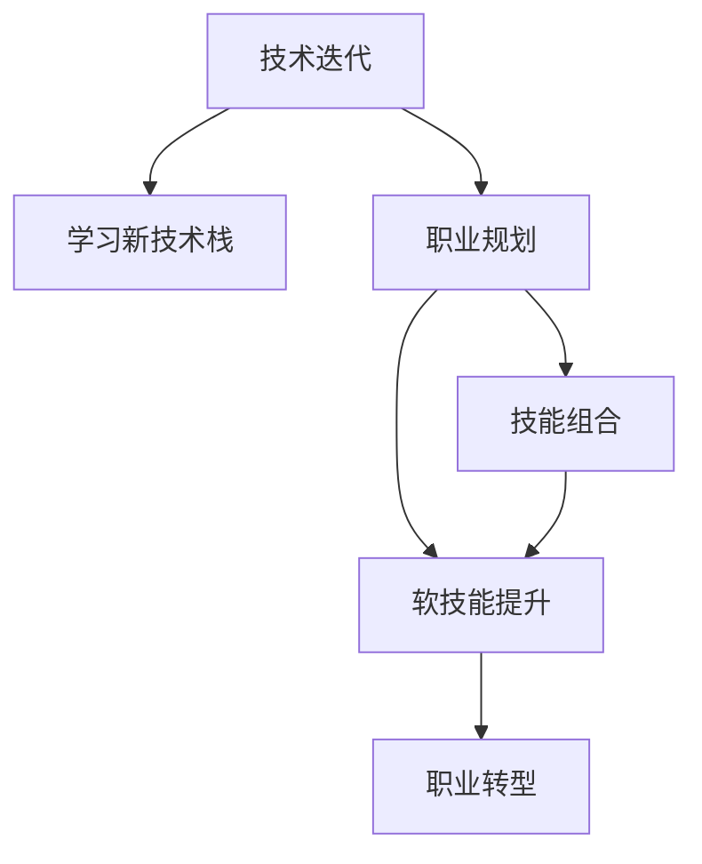

                 

# 程序员如何应对中年职场危机

> 关键词：职场危机, 技术迭代, 职业规划, 能力提升, 持续学习, 职业转型

## 1. 背景介绍

在快速发展变化的科技行业中，尤其是信息技术领域，中年程序员面临前所未有的职场危机。技术栈的快速迭代，新技术、新工具的层出不穷，使部分中年技术人逐渐陷入职业瓶颈，甚至面临被淘汰的风险。本文旨在探讨中年程序员如何应对这一职场危机，通过深入理解技术发展趋势，重新定位职业规划，全面提升自身能力，实现职业转型和长期发展。

### 1.1 问题由来
科技行业以其快节奏和高度竞争著称，新技术不断涌现，技术栈迭代迅速。中年程序员由于长期浸淫在一个技术框架或语言中，学习新技术的效率和热情可能会受到影响。同时，随着年龄增长，中年程序员在体力、认知上可能也出现劣势，从而遭遇职场危机。

### 1.2 问题核心关键点
中年程序员应对职场危机的核心关键点在于：

- **技术认知更新**：不断学习新技术、新工具，避免因技术陈旧而被淘汰。
- **技能组合转型**：根据技术发展趋势，重新构建自己的技能组合，适应市场需求。
- **职业定位与规划**：明确自身的职业目标，制定清晰的职业发展路径。
- **软技能提升**：加强沟通、领导、团队合作等软技能，弥补技术之外的职业竞争力。

## 2. 核心概念与联系

### 2.1 核心概念概述

为更好地理解中年程序员应对职场危机的方法，本节将介绍几个密切相关的核心概念：

- **技术迭代**：指技术栈的快速更新和演进，要求从业者持续学习和适应。
- **新技术栈**：指新兴的、前景广阔的技术领域，如人工智能、大数据、区块链等。
- **职业规划**：根据个人兴趣、技能和市场需求，制定长期职业发展目标。
- **技能组合**：根据市场需求和职业目标，组合多种技能，构建复合型职业竞争力。
- **软技能**：指与技术技能并列的沟通、领导、团队合作等非技术性能力，对于职业发展同样重要。

这些概念之间的逻辑关系可以通过以下Mermaid流程图来展示：



这个流程图展示了几大核心概念及其之间的关系：

1. 技术迭代是促使职业发展的基础。
2. 新技术栈是职业发展的方向和目标。
3. 职业规划是根据自身特点和市场需求，明确职业方向。
4. 技能组合是实现职业目标的手段，需要技术和软技能并重。
5. 软技能提升是全面提升职业竞争力的关键。
6. 职业转型是基于上述因素，实现职业发展的重要步骤。

## 3. 核心算法原理 & 具体操作步骤
### 3.1 算法原理概述

中年程序员应对职场危机的过程，本质上是一个持续学习和适应技术变化的过程。其核心思想是：通过不断学习新技术、提升软技能、重新规划职业路径，以保持技术栈的前沿性和职业的竞争力。

形式化地，假设一个中年程序员的技术栈为 $\theta$，目标技术栈为 $\theta_{new}$。微调的目标是找到最优技术栈 $\theta^*$，使得 $\theta^*$ 最接近 $\theta_{new}$：

$$
\theta^* = \mathop{\arg\min}_{\theta} ||\theta - \theta_{new}||^2
$$

其中 $||.||$ 表示欧式距离，用于衡量技术栈之间的差距。通过优化算法（如梯度下降），微调过程不断更新技术栈 $\theta$，最小化技术栈差距，最终得到最优技术栈 $\theta^*$。

### 3.2 算法步骤详解

基于持续学习的微调过程，一般包括以下几个关键步骤：

**Step 1: 确定技术栈目标**
- 收集行业动态和公司需求，确定要掌握的新技术栈 $\theta_{new}$。
- 通过调查分析，了解新技术的应用场景、难点和价值。

**Step 2: 制定学习计划**
- 根据新技术栈的要求，列出学习清单，包括新语言、新框架、新工具等。
- 制定时间表，分配学习任务，确保有足够时间深入学习。

**Step 3: 选择学习资源**
- 选择优质教程、培训课程、在线课程等学习资源。
- 参与技术社区，交流学习心得，解决实际问题。

**Step 4: 实践与迭代**
- 在实际项目中应用新技术，进行实践和调试。
- 记录学习过程中的问题与解决方案，不断迭代优化。

**Step 5: 技能组合与软技能提升**
- 根据新旧技术栈的结合，构建新的技能组合。
- 加强沟通、领导、团队合作等软技能，提升综合职业竞争力。

**Step 6: 职业转型**
- 根据学习成果和市场需求，调整职业路径。
- 寻找新的工作机会或创业机会，实现职业转型。

以上是基于持续学习的微调方法，具体到每个步骤中还有更多详细的实施策略和技巧，这里只作概要说明。

### 3.3 算法优缺点

基于持续学习的微调方法具有以下优点：
1. 适应性强。通过不断学习和适应新技术，可以避免技术陈旧带来的风险。
2. 自主性强。技术栈的微调由个人自主实施，不受外界环境限制。
3. 灵活性强。结合自身兴趣和市场需求，可以选择合适的技术栈方向。

但同时也存在一些局限性：
1. 学习成本高。新技术的学习需要大量时间和精力投入，短期内可能难以看到成效。
2. 风险较高。选择错误的技术栈方向可能陷入新的技术陷阱。
3. 软技能欠缺。软技能的学习和提升需要更多时间，有时可能与技术学习产生冲突。

尽管如此，持续学习的微调方法仍是目前应对中年职场危机的有效手段。未来相关研究的重点在于如何通过更科学的评估手段，选择合适的技术栈方向，同时平衡技术学习与软技能提升，以实现更好的职业发展。

### 3.4 算法应用领域

基于持续学习的微调方法，在IT领域中已经得到了广泛的应用，特别是在以下场景中：

- **技术栈转型**：如从Java转Python，或从传统Web开发转向人工智能领域。
- **技术能力提升**：如学习机器学习、大数据、云计算等前沿技术，提高自身技术栈的深度和广度。
- **软技能提升**：如提升沟通能力、团队协作能力、项目管理能力等，增强综合职业竞争力。
- **职业转型**：如从技术岗位转型为架构师、项目经理、产品经理等非技术岗位，实现职业多元化。

除了这些经典场景外，基于持续学习的微调方法还应更多地考虑如何在新兴技术领域进行布局，如区块链、物联网、边缘计算等，以适应未来的技术趋势。

## 4. 数学模型和公式 & 详细讲解  
### 4.1 数学模型构建

本节将使用数学语言对中年程序员技术栈微调过程进行更加严格的刻画。

记当前技术栈为 $\theta$，目标技术栈为 $\theta_{new}$。假设技术栈差距为 $D$，微调的目标是最小化技术栈差距 $D$：

$$
D = ||\theta - \theta_{new}||^2
$$

定义模型 $\theta$ 在数据样本 $(x,y)$ 上的损失函数为 $\ell(\theta)$，则在数据集 $D$ 上的经验风险为：

$$
\mathcal{L}(\theta) = \frac{1}{N} \sum_{i=1}^N \ell(\theta(x_i))
$$

微调的优化目标是最小化经验风险，即找到最优技术栈 $\theta^*$：

$$
\theta^* = \mathop{\arg\min}_{\theta} \mathcal{L}(\theta)
$$

在实践中，我们通常使用基于梯度的优化算法（如SGD、Adam等）来近似求解上述最优化问题。设 $\eta$ 为学习率，$\lambda$ 为正则化系数，则参数的更新公式为：

$$
\theta \leftarrow \theta - \eta \nabla_{\theta}\mathcal{L}(\theta) - \eta\lambda\theta
$$

其中 $\nabla_{\theta}\mathcal{L}(\theta)$ 为损失函数对技术栈参数 $\theta$ 的梯度，可通过反向传播算法高效计算。

### 4.2 公式推导过程

以下我们以Java转Python为例，推导新技术栈微调的损失函数及其梯度的计算公式。

假设模型 $\theta$ 在输入 $x$ 上的输出为 $\hat{y}=M_{\theta}(x) \in [0,1]$，表示技术栈掌握程度。目标技术栈 $\theta_{new}$ 的掌握程度为 $y \in [0,1]$。则损失函数定义为：

$$
\ell(\theta) = ||\theta - \theta_{new}||^2
$$

将其代入经验风险公式，得：

$$
\mathcal{L}(\theta) = \frac{1}{N} \sum_{i=1}^N \ell(\theta(x_i))
$$

根据链式法则，损失函数对技术栈参数 $\theta_k$ 的梯度为：

$$
\frac{\partial \mathcal{L}(\theta)}{\partial \theta_k} = -2\frac{\partial \ell(\theta)}{\partial \theta_k}
$$

其中 $\frac{\partial \ell(\theta)}{\partial \theta_k}$ 可进一步递归展开，利用自动微分技术完成计算。

在得到损失函数的梯度后，即可带入参数更新公式，完成技术栈的迭代优化。重复上述过程直至收敛，最终得到适应新技术栈的最优技术栈 $\theta^*$。

## 5. 项目实践：代码实例和详细解释说明
### 5.1 开发环境搭建

在进行技术栈微调实践前，我们需要准备好开发环境。以下是使用Python进行Jupyter Notebook开发的环境配置流程：

1. 安装Anaconda：从官网下载并安装Anaconda，用于创建独立的Python环境。

2. 创建并激活虚拟环境：
```bash
conda create -n py36 python=3.6 
conda activate py36
```

3. 安装Jupyter Notebook：
```bash
conda install jupyter notebook
```

4. 安装必要的Python包：
```bash
pip install matplotlib numpy pandas jupyter jupyterlab jupyterlab_server
```

5. 测试Jupyter Notebook：
```bash
jupyter lab --no-browser
```

完成上述步骤后，即可在`py36`环境中开始技术栈微调实践。

### 5.2 源代码详细实现

这里我们以Java转Python为例，给出使用Jupyter Notebook对技术栈进行微调的Python代码实现。

首先，定义当前技术栈和目标技术栈：

```python
import numpy as np

# 当前技术栈，例如Java熟练程度
current_skill = np.array([0.7, 0.6, 0.8, 0.5, 0.6])  # 对Java的熟练度评估

# 目标技术栈，例如Python熟练度
target_skill = np.array([0.9, 0.8, 0.9, 0.7, 0.85])  # 对Python的熟练度评估

# 定义损失函数
def skill_distance(skill):
    return np.linalg.norm(skill - target_skill)

# 计算当前技术栈与目标技术栈的距离
current_distance = skill_distance(current_skill)

print(f"当前技术栈与目标技术栈的差距为：{current_distance:.3f}")
```

然后，定义技术栈微调的优化算法：

```python
from scipy.optimize import minimize

# 定义损失函数
def loss(theta):
    return skill_distance(theta)

# 定义优化目标
def objective(theta):
    return loss(theta)

# 初始技术栈参数
theta0 = np.array([0.7, 0.6, 0.8, 0.5, 0.6])

# 设置优化参数
bounds = [(0, 1), (0, 1), (0, 1), (0, 1), (0, 1)]
options = {'disp': True, 'ftol': 1e-6}

# 执行优化
result = minimize(objective, theta0, method='BFGS', bounds=bounds, options=options)

# 输出优化结果
print(result.x)
```

最后，输出优化后的技术栈参数：

```python
# 优化后的技术栈参数
print(f"优化后的技术栈参数为：{result.x:.3f}")
```

以上就是使用Jupyter Notebook对技术栈进行微调的完整代码实现。可以看到，通过简单的数学模型和优化算法，即可实现技术栈的微调。

### 5.3 代码解读与分析

让我们再详细解读一下关键代码的实现细节：

**定义技术栈参数**：
- 使用numpy数组表示当前技术栈和目标技术栈的熟练程度，每个维度对应一种技术。

**定义损失函数**：
- 使用numpy的linalg.norm计算技术栈之间的欧式距离，作为损失函数。

**定义优化目标**：
- 通过scipy.optimize库的minimize函数，最小化损失函数，求解最优技术栈参数。

**设置优化参数**：
- 定义优化参数，如初始参数、约束条件、迭代次数等。

**执行优化**：
- 调用minimize函数执行优化，得到最优技术栈参数。

**输出优化结果**：
- 输出优化后的技术栈参数，表示达到目标技术栈的差距。

可以看到，通过简单的代码实现，即可有效地对技术栈进行微调。尽管这里仅用简单的线性模型来计算技术栈差距，实际应用中还需要考虑更复杂的技术栈组合，可能需要引入非线性模型、多目标优化等算法进行计算。

## 6. 实际应用场景
### 6.1 智能开发平台

基于持续学习的大语言模型微调技术，可以应用于智能开发平台，帮助程序员快速掌握新技术，提升开发效率。智能开发平台可以根据程序员的当前技术栈和目标技术栈，推荐相关学习资源，提供实际项目中的技术栈微调案例，加速程序员的职业成长。

### 6.2 职业发展培训

在企业内部，技术栈微调技术可以应用于职业发展培训项目。企业可以定期对员工进行技术栈的评估，并根据评估结果制定个性化培训计划，帮助员工提升技术栈，实现职业生涯的快速成长。

### 6.3 在线教育平台

在线教育平台可以利用技术栈微调技术，为学员提供个性化学习路径。平台可以根据学员的当前技术水平和目标，推荐学习资源，设计学习任务，帮助学员逐步达到目标技术栈，实现职业转型和技能提升。

### 6.4 未来应用展望

随着技术栈微调技术的不断发展和普及，其在更多场景中的应用将逐步显现。除了智能开发平台、职业发展培训、在线教育平台外，未来还将涌现更多创新应用，如自动技能评估、个性化职业规划、自动学习路径生成等，为科技人才的全面发展提供支持。

## 7. 工具和资源推荐
### 7.1 学习资源推荐

为了帮助程序员系统掌握技术栈微调的理论基础和实践技巧，这里推荐一些优质的学习资源：

1. Coursera《Python for Data Science》课程：系统学习Python，掌握数据分析和机器学习技能。
2. Udacity《人工智能基础》课程：学习人工智能基础知识，了解前沿技术发展。
3. edX《Java Programming: From Novice to Professional》课程：深入学习Java编程，掌握Java编程技巧。
4. Codecademy《Python》课程：零基础学习Python，快速上手Python编程。
5. Kaggle《Data Science》竞赛：参加数据科学竞赛，实战提升技术栈。

通过这些资源的学习实践，相信你一定能够快速掌握技术栈微调的技能，并用于解决实际的职业发展问题。

### 7.2 开发工具推荐

高效的开发离不开优秀的工具支持。以下是几款用于技术栈微调开发的常用工具：

1. Jupyter Notebook：免费、开源、易用的交互式编程环境，支持多语言编程。
2. Visual Studio Code：功能丰富的编程编辑器，支持多语言编程和代码调试。
3. PyCharm：专业的Python IDE，支持版本控制、项目管理和调试。
4. Sublime Text：快速、轻量级的文本编辑器，支持多语言编程和插件扩展。
5. Git：版本控制工具，帮助程序员进行代码管理和协同开发。

合理利用这些工具，可以显著提升技术栈微调的开发效率，加快创新迭代的步伐。

### 7.3 相关论文推荐

技术栈微调技术的发展源于学界的持续研究。以下是几篇奠基性的相关论文，推荐阅读：

1. Automating Software Engineering with Machine Learning：介绍机器学习在软件工程中的应用，包括技术栈微调等。
2. Automated Software Testing with Deep Learning：探索深度学习在自动化测试中的应用，提供技术栈微调的方法。
3. Enhancing Software Engineering with Machine Learning：总结机器学习在软件开发中的多个应用，包括代码生成、缺陷检测等。
4. Deep Learning for Software Engineering：系统介绍深度学习在软件工程中的应用，涵盖技术栈微调等多个方向。

这些论文代表了大语言模型微调技术的发展脉络。通过学习这些前沿成果，可以帮助研究者把握学科前进方向，激发更多的创新灵感。

## 8. 总结：未来发展趋势与挑战
### 8.1 总结

本文对中年程序员应对职场危机的过程进行了全面系统的介绍。首先阐述了技术栈快速迭代带来的职场危机，明确了技术栈微调在职业发展中的重要意义。其次，从原理到实践，详细讲解了持续学习的微调过程，给出了技术栈微调的完整代码实例。同时，本文还探讨了技术栈微调在智能开发平台、职业发展培训、在线教育平台等场景中的应用前景，展示了技术栈微调技术的广泛潜力。此外，本文精选了技术栈微调技术的各类学习资源，力求为读者提供全方位的技术指引。

通过本文的系统梳理，可以看到，技术栈微调技术正在成为程序员应对职场危机的有效手段。技术栈的持续学习与适应，是程序员在技术日新月异的今天，保持职业竞争力的重要策略。未来，伴随技术栈微调技术的不断进步，相信程序员将能够更好地适应快速变化的技术环境，实现职业生涯的持续发展。

### 8.2 未来发展趋势

展望未来，技术栈微调技术将呈现以下几个发展趋势：

1. 自动化程度提高。未来的技术栈微调将更多借助自动化工具和算法，减少手动调整的工作量。
2. 个性化推荐。技术栈微调系统将结合用户的学习历史和行为数据，提供个性化的学习路径和资源推荐。
3. 跨平台集成。技术栈微调技术将集成到更多开发平台和培训系统中，成为其核心功能之一。
4. 实时反馈。技术栈微调系统将实时跟踪学习进度和效果，及时反馈调整策略，优化学习效果。
5. 社区互助。技术栈微调技术将引入社区互助功能，用户可以相互交流学习经验，共同解决问题。
6. 前沿技术融合。技术栈微调技术将与更多前沿技术结合，如AI辅助开发、增强现实等，提升学习体验和效果。

以上趋势凸显了技术栈微调技术的未来发展方向。这些方向的探索发展，必将进一步提升程序员的学习效率和职业竞争力，加速技术栈的迭代升级，实现个人与技术环境的同步进步。

### 8.3 面临的挑战

尽管技术栈微调技术已经取得了一定的成果，但在迈向更加智能化、自动化应用的过程中，它仍面临着诸多挑战：

1. 学习资源不足。虽然技术栈微调技术正在迅速发展，但优质学习资源仍相对匮乏，难以满足所有程序员的需求。
2. 学习效果评估困难。技术栈微调效果的评估标准不统一，缺乏科学的评估方法，难以量化衡量学习成效。
3. 知识更新快速。技术栈迭代速度快，要求学习者不断跟进新知识，但学习负担过重可能导致学习效果不佳。
4. 学习路径设计复杂。技术栈微调路径设计需要考虑多方面因素，如技术栈分布、职业目标、兴趣偏好等，设计复杂且难以自动化。
5. 学习动力不足。长时间的学习可能导致学习动力不足，难以坚持技术栈微调。

尽管如此，技术栈微调技术仍是目前应对职场危机的有效手段。未来相关研究的重点在于如何提供更丰富、更精准的学习资源，采用更科学的评估方法，设计更自动化的学习路径，以提升学习效率和效果。

### 8.4 研究展望

面对技术栈微调所面临的种种挑战，未来的研究需要在以下几个方面寻求新的突破：

1. 提供个性化推荐系统。开发基于用户学习行为和需求的数据分析模型，提供个性化学习路径和资源推荐。
2. 引入自动化评估工具。开发智能评估工具，对技术栈微调效果进行量化评估，帮助用户及时调整学习策略。
3. 设计自动化学习路径。引入机器学习模型，自动生成最优学习路径，指导用户进行技术栈微调。
4. 实现学习动力激励。设计激励机制，通过游戏化、社交化等方式提升用户的学习动力，延长技术栈微调过程。
5. 引入前沿技术手段。利用AI辅助开发、增强现实等前沿技术，提升学习体验和效果。

这些研究方向的探索，必将引领技术栈微调技术迈向更高的台阶，为程序员的职业发展提供更有力的支持。面向未来，技术栈微调技术还需要与其他人工智能技术进行更深入的融合，如知识表示、因果推理、强化学习等，多路径协同发力，共同推动程序员的职业成长。只有勇于创新、敢于突破，才能不断拓展技术栈的边界，让程序员更好地适应快速变化的技术环境，实现职业生涯的持续发展。

## 9. 附录：常见问题与解答

**Q1：如何选择合适的技术栈方向？**

A: 选择技术栈方向应考虑多个因素，如市场趋势、公司需求、个人兴趣等。可以参考以下步骤：

1. 调查行业发展趋势，了解前沿技术，如人工智能、大数据、区块链等。
2. 分析当前市场需求，明确公司业务方向，确定需要掌握的技术栈。
3. 评估自身兴趣和能力，选择最符合自身发展方向的技术栈。

**Q2：技术栈微调的学习路径如何设计？**

A: 技术栈微调的学习路径应结合用户的学习历史和行为数据，进行个性化设计。可以考虑以下策略：

1. 评估用户当前技术栈，确定需要提升的技能。
2. 根据市场需求和职业目标，推荐相关学习资源。
3. 设计阶段性的学习任务，逐步提升技术栈。
4. 结合用户反馈，动态调整学习路径。

**Q3：技术栈微调过程中如何提高学习效果？**

A: 提高学习效果需要综合考虑多个因素，如学习环境、学习资源、学习策略等。以下是一些具体方法：

1. 利用自动化学习工具，如智能评估系统、推荐系统等，优化学习路径。
2. 采用任务驱动学习法，通过实际项目进行学习，提升学习效果。
3. 引入游戏化元素，如积分、排行榜等，提升用户的学习动力。
4. 建立学习社区，提供交流讨论的平台，相互学习和帮助。

通过以上措施，可以有效提升技术栈微调的学习效果，帮助程序员快速提升技能，适应技术变化。

**Q4：技术栈微调过程中如何避免技术陷阱？**

A: 技术栈微调过程中可能遇到技术陷阱，如学习新技术后难以应用，或者新旧技术切换不顺利。以下是一些具体策略：

1. 选择具有实际应用场景的技术栈，避免学习空洞的理论知识。
2. 在实际项目中进行实践，通过实际应用巩固学习成果。
3. 多学习技术栈组合，避免过度依赖单一技术栈。
4. 及时反思和调整学习策略，避免盲目跟风。

**Q5：技术栈微调过程中如何保持持续学习动力？**

A: 长时间的学习可能导致学习动力不足，以下是一些策略：

1. 设定短期目标，实现小成就以获得成就感。
2. 利用社交网络分享学习成果，获得社区支持。
3. 引入学习激励机制，如积分、奖励等，提升学习动力。
4. 参与学习活动，如技术社区、在线竞赛等，增强学习兴趣。

通过这些措施，可以保持持续学习动力，坚持技术栈微调，实现职业发展。

---

作者：禅与计算机程序设计艺术 / Zen and the Art of Computer Programming

