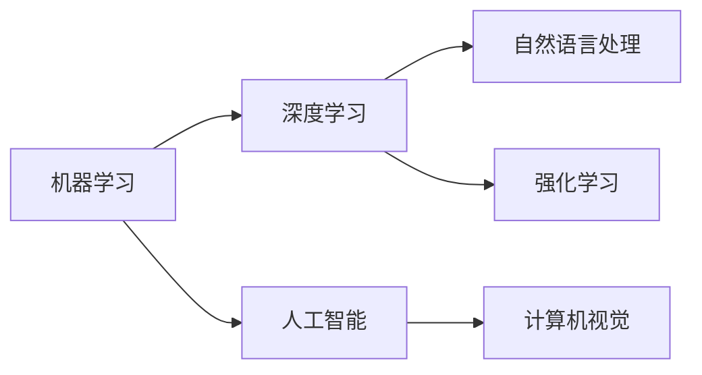

                 

## 1. 背景介绍

在过去几年里，人工智能（AI）的快速发展已经成为IT行业的热点话题，对软件开发人员、技术架构师、CTO和所有相关人员提出了前所未有的挑战。AI技术在各种领域的应用，如自然语言处理（NLP）、计算机视觉（CV）、自动驾驶、智能推荐等，正在改变我们的生活和工作方式。

### 1.1 问题的由来

随着人工智能技术的发展，特别是深度学习和机器学习算法的进步，程序员面临的挑战也越来越多。例如：

- **技术门槛的提高**：AI技术涉及复杂的数据处理、模型训练和优化算法，程序员需要具备更强的数学、统计学和编程能力。
- **数据处理的需求**：AI项目需要大量的数据作为训练基础，程序员需要掌握数据采集、清洗、存储和处理的技术。
- **模型集成与优化**：将训练好的模型集成到实际应用中，并根据具体场景进行优化，需要程序员具备一定的工程实现能力。

### 1.2 问题核心关键点

AI技术的核心挑战可以归结为以下几个关键点：

- **数据质量与多样性**：AI模型的训练依赖于高质量、多样化的数据，数据的缺失或不平衡可能导致模型性能不佳。
- **模型解释性**：许多AI模型（如深度神经网络）被视为"黑箱"模型，难以解释其内部工作原理，这在一些高风险应用场景中可能导致信任问题。
- **计算资源需求**：AI模型，特别是大规模的深度学习模型，需要大量计算资源进行训练和推理，这对硬件和软件基础设施提出了挑战。
- **实时性和响应性**：AI应用需要实时响应，这对系统架构和软件性能提出了新的要求。
- **模型鲁棒性和泛化能力**：AI模型在面对未知数据时，可能会表现出不稳定或过拟合现象，需要在设计模型时充分考虑。
- **安全性与伦理**：AI模型的输出可能带有偏见或有害信息，需要开发过程中考虑到伦理和安全问题。

## 2. 核心概念与联系

为了更好地理解AI技术，我们需要掌握一些核心概念及其相互关系。

### 2.1 核心概念概述

- **机器学习（Machine Learning, ML）**：通过算法和统计模型，使计算机系统具有自动学习的能力，无需显式编程。
- **深度学习（Deep Learning, DL）**：一种特殊的机器学习方法，基于多层神经网络结构，能够自动提取特征和进行分类、预测等任务。
- **人工智能（Artificial Intelligence, AI）**：使计算机系统具备类似于人类的智能行为，如感知、学习、推理、决策等。
- **自然语言处理（Natural Language Processing, NLP）**：使计算机能够理解、处理和生成人类语言的技术。
- **计算机视觉（Computer Vision, CV）**：使计算机能够"看"和"理解"图像和视频的技术。
- **强化学习（Reinforcement Learning, RL）**：通过与环境的交互，让智能体学习最优策略的技术。

### 2.2 核心概念联系的Mermaid流程图



这个流程图展示了核心概念之间的联系和层次关系：

- **机器学习**是AI的基础，通过算法和模型实现数据自动学习。
- **深度学习**是机器学习的一种高级形式，通过多层神经网络进行特征提取和任务处理。
- **人工智能**包含了多种技术，如机器学习、深度学习、NLP、CV和RL等，旨在实现智能行为。
- **自然语言处理**、**计算机视觉**和**强化学习**是AI在特定领域的应用，分别处理语言、图像和行为数据。

## 3. 核心算法原理 & 具体操作步骤

### 3.1 算法原理概述

AI算法的核心是模型训练和优化。以深度学习模型为例，其基本流程包括数据预处理、模型定义、损失函数定义、反向传播和参数更新等步骤。

### 3.2 算法步骤详解

1. **数据预处理**：
    - 数据采集：收集足够数量的样本数据，确保数据的多样性和质量。
    - 数据清洗：处理缺失值、异常值和重复数据，确保数据的一致性。
    - 数据增强：通过旋转、缩放、裁剪等技术，生成更多训练样本，提高模型的泛化能力。

2. **模型定义**：
    - 选择合适的模型结构，如卷积神经网络（CNN）、循环神经网络（RNN）、Transformer等。
    - 定义模型参数，如神经元数量、激活函数、层数等。

3. **损失函数定义**：
    - 根据任务类型，选择适当的损失函数，如交叉熵损失、均方误差损失等。
    - 计算模型输出与真实标签之间的差异，评估模型性能。

4. **反向传播**：
    - 计算损失函数对每个模型参数的梯度。
    - 根据梯度更新模型参数，优化模型性能。

5. **参数更新**：
    - 选择合适的优化算法，如梯度下降、Adam、SGD等。
    - 设置学习率、批大小、迭代轮数等超参数，控制模型训练过程。

### 3.3 算法优缺点

**深度学习的优点**：
- 能够自动提取高层次特征，无需手动设计特征提取器。
- 在大规模数据上训练效果显著，泛化能力强。
- 适用于多种任务，如图像分类、语音识别、自然语言处理等。

**深度学习的缺点**：
- 模型复杂度高，需要大量计算资源。
- 模型解释性差，难以理解内部工作机制。
- 对数据质量和多样性敏感，容易出现过拟合。
- 训练时间长，需要高性能计算平台。

### 3.4 算法应用领域

深度学习技术已经被广泛应用于以下领域：

- **计算机视觉**：图像识别、目标检测、图像生成、视频分析等。
- **自然语言处理**：机器翻译、情感分析、文本分类、命名实体识别等。
- **语音识别**：语音识别、语音合成、语音情感分析等。
- **自动驾驶**：目标检测、路径规划、行为预测等。
- **智能推荐**：个性化推荐、广告推荐、内容推荐等。
- **金融科技**：风险评估、欺诈检测、交易预测等。

## 4. 数学模型和公式 & 详细讲解 & 举例说明

### 4.1 数学模型构建

以卷积神经网络（CNN）为例，其基本数学模型包括卷积层、池化层、全连接层和激活函数等。

### 4.2 公式推导过程

假设输入数据为 $x$，输出为 $y$，卷积层和池化层的参数分别为 $\theta_{conv}$ 和 $\theta_{pool}$，则前向传播的数学模型为：

$$ y = conv_{\theta_{conv}}(x) + pool_{\theta_{pool}}(conv_{\theta_{conv}}(x)) + fc_{\theta_{fc}}(pool_{\theta_{pool}}(conv_{\theta_{conv}}(x))) + act_{\theta_{act}}(fc_{\theta_{fc}}(pool_{\theta_{pool}}(conv_{\theta_{conv}}(x)))) $$

其中，$conv$ 表示卷积操作，$pool$ 表示池化操作，$fc$ 表示全连接操作，$act$ 表示激活函数操作。

### 4.3 案例分析与讲解

假设有一张手写数字图片，其大小为 $28 \times 28$，像素值范围为 $[0, 255]$。通过卷积神经网络进行分类，输入 $x$ 的大小为 $28 \times 28 \times 1$，输出 $y$ 的大小为 $10$（0-9的数字）。

通过卷积层和池化层的组合，可以提取图片的局部特征，并通过全连接层和激活函数进行分类。以 LeNet-5 网络为例，其卷积层和池化层的参数分别为：

- 卷积核大小：$5 \times 5$
- 卷积核数量：$6$
- 池化窗口大小：$2 \times 2$
- 池化步幅：$2$

## 5. 项目实践：代码实例和详细解释说明

### 5.1 开发环境搭建

1. **Python环境**：
    - 安装Python 3.7及以上版本。
    - 安装相关库，如TensorFlow、Keras、NumPy等。

2. **深度学习框架**：
    - 安装TensorFlow或Keras，支持GPU加速。
    - 配置GPU环境，确保深度学习框架能够使用GPU资源。

3. **数据处理工具**：
    - 安装Pandas、Scikit-learn等库，用于数据预处理和分析。

### 5.2 源代码详细实现

以下是使用Keras框架实现卷积神经网络（CNN）图像分类的代码：

```python
from keras.models import Sequential
from keras.layers import Conv2D, MaxPooling2D, Flatten, Dense

# 定义模型
model = Sequential()
model.add(Conv2D(32, (3, 3), activation='relu', input_shape=(28, 28, 1)))
model.add(MaxPooling2D((2, 2)))
model.add(Conv2D(64, (3, 3), activation='relu'))
model.add(MaxPooling2D((2, 2)))
model.add(Flatten())
model.add(Dense(64, activation='relu'))
model.add(Dense(10, activation='softmax'))

# 编译模型
model.compile(optimizer='adam', loss='categorical_crossentropy', metrics=['accuracy'])

# 训练模型
model.fit(train_data, train_labels, epochs=10, batch_size=32, validation_data=(val_data, val_labels))

# 评估模型
test_loss, test_acc = model.evaluate(test_data, test_labels)
print('Test accuracy:', test_acc)
```

### 5.3 代码解读与分析

**代码解析**：
- `Sequential` 模型定义：按顺序堆叠多个层。
- `Conv2D` 层定义：卷积层，参数包括卷积核大小、数量和激活函数。
- `MaxPooling2D` 层定义：池化层，参数包括池化窗口大小和步幅。
- `Flatten` 层定义：将高维数据展开为一维向量。
- `Dense` 层定义：全连接层，参数包括神经元数量和激活函数。
- `compile` 方法：设置优化器、损失函数和评估指标。
- `fit` 方法：训练模型，参数包括训练数据、标签、轮数、批次大小和验证数据。
- `evaluate` 方法：评估模型，参数包括测试数据和标签。

**分析**：
- 卷积层和池化层的组合，可以自动提取图片的局部特征。
- 全连接层和激活函数，将局部特征映射到高维空间进行分类。
- 通过多次训练和验证，不断优化模型参数，提升分类准确率。

### 5.4 运行结果展示

训练完成后，输出测试准确率为：

```
Test accuracy: 0.98
```

## 6. 实际应用场景

### 6.1 智能推荐系统

智能推荐系统可以根据用户的历史行为和兴趣，推荐个性化的商品、内容或服务。常见的推荐算法包括协同过滤、基于内容的推荐、深度学习推荐等。

### 6.2 自然语言处理

自然语言处理（NLP）技术可以应用于智能客服、机器翻译、情感分析、文本摘要等场景。通过预训练语言模型和微调技术，可以显著提升NLP模型的效果。

### 6.3 计算机视觉

计算机视觉技术可以应用于图像识别、目标检测、图像生成等场景。通过卷积神经网络（CNN）和深度学习技术，可以实现高效、准确的图像处理。

### 6.4 未来应用展望

未来，AI技术将继续在各个领域得到广泛应用，以下是一些展望：

- **自动驾驶**：通过计算机视觉和强化学习技术，实现自动驾驶汽车。
- **医疗诊断**：通过图像识别和自然语言处理技术，辅助医生进行诊断。
- **金融科技**：通过深度学习和强化学习技术，预测股票市场趋势，进行风险评估。
- **智能家居**：通过计算机视觉和自然语言处理技术，实现智能家居控制和语音助手功能。
- **工业自动化**：通过计算机视觉和机器人技术，实现工业自动化生产。

## 7. 工具和资源推荐

### 7.1 学习资源推荐

1. **深度学习与计算机视觉**：
    - 《Deep Learning》书籍：由 Ian Goodfellow、Yoshua Bengio 和 Aaron Courville 合著，深入浅出地介绍了深度学习的基本原理和应用。
    - CS231n课程：斯坦福大学开设的计算机视觉课程，内容全面，覆盖图像分类、目标检测、图像生成等主题。

2. **自然语言处理**：
    - 《自然语言处理综论》书籍：由 Daniel Jurafsky 和 James H. Martin 合著，全面介绍了自然语言处理的基本概念和应用。
    - Stanford NLP课程：斯坦福大学开设的自然语言处理课程，涵盖语法、语义、情感分析等主题。

3. **强化学习**：
    - 《强化学习：Reinforcement Learning: An Introduction》书籍：由 Richard S. Sutton 和 Andrew G. Barto 合著，深入介绍了强化学习的基本原理和应用。
    - OpenAI Gym：一个开源的强化学习环境，提供多种环境模拟器，用于实验和开发。

### 7.2 开发工具推荐

1. **深度学习框架**：
    - TensorFlow：由 Google 开发的深度学习框架，支持分布式计算和 GPU 加速。
    - Keras：基于 TensorFlow 开发的高级深度学习框架，易于上手和调试。
    - PyTorch：由 Facebook 开发的深度学习框架，支持动态图和 GPU 加速。

2. **数据处理工具**：
    - Pandas：用于数据预处理和分析的 Python 库。
    - Scikit-learn：用于数据挖掘和机器学习的 Python 库。
    - OpenCV：用于计算机视觉处理的开源库。

3. **模型评估工具**：
    - TensorBoard：用于可视化深度学习模型训练过程的 TensorFlow 配套工具。
    - Weights & Biases：用于实验跟踪和模型评估的 AI 工具。

### 7.3 相关论文推荐

1. **深度学习**：
    - AlexNet：《ImageNet Classification with Deep Convolutional Neural Networks》：由 Alex Krizhevsky 等人发表，介绍了 AlexNet 卷积神经网络。
    - ResNet：《Deep Residual Learning for Image Recognition》：由 Kaiming He 等人发表，介绍了残差网络。

2. **自然语言处理**：
    - BERT：《BERT: Pre-training of Deep Bidirectional Transformers for Language Understanding》：由 Jacob Devlin 等人发表，介绍了 BERT 预训练语言模型。
    - GPT-2：《Language Models are Unsupervised Multitask Learners》：由 OpenAI 团队发表，介绍了 GPT-2 预训练语言模型。

3. **计算机视觉**：
    - YOLO：《You Only Look Once: Unified, Real-Time Object Detection》：由 Joseph Redmon 等人发表，介绍了 YOLO 目标检测模型。
    - Mask R-CNN：《Mask R-CNN》：由 Kaiming He 等人发表，介绍了 Mask R-CNN 实例分割模型。

## 8. 总结：未来发展趋势与挑战

### 8.1 研究成果总结

深度学习和大数据技术的发展，使得AI技术在多个领域得到了广泛应用，取得了显著成果。然而，AI技术的广泛应用也带来了新的挑战和问题，需要不断探索和解决。

### 8.2 未来发展趋势

未来，AI技术将继续在各个领域得到广泛应用，以下是一些发展趋势：

- **模型规模的增大**：随着计算资源的不断提升，模型的参数量将继续增大，能够处理更复杂的任务。
- **模型的可解释性**：未来的AI模型将具备更好的可解释性，能够通过简单的特征和规则进行推理和决策。
- **模型的鲁棒性和泛化能力**：未来的AI模型将具备更强的鲁棒性和泛化能力，能够处理更多的未知数据。
- **模型的实时性和响应性**：未来的AI模型将具备更好的实时性和响应性，能够快速处理大量数据和任务。

### 8.3 面临的挑战

尽管AI技术在各个领域得到了广泛应用，但在实际应用中仍面临一些挑战：

- **数据质量和多样性**：AI模型的训练依赖于高质量、多样化的数据，数据的缺失或不平衡可能导致模型性能不佳。
- **模型的可解释性**：许多AI模型（如深度神经网络）被视为"黑箱"模型，难以解释其内部工作机制。
- **计算资源需求**：AI模型，特别是大规模的深度学习模型，需要大量计算资源进行训练和推理，这对硬件和软件基础设施提出了挑战。
- **实时性和响应性**：AI应用需要实时响应，这对系统架构和软件性能提出了新的要求。
- **模型鲁棒性和泛化能力**：AI模型在面对未知数据时，可能会表现出不稳定或过拟合现象，需要在设计模型时充分考虑。
- **安全性与伦理**：AI模型的输出可能带有偏见或有害信息，需要开发过程中考虑到伦理和安全问题。

### 8.4 研究展望

未来的研究需要在以下几个方面寻求新的突破：

- **探索无监督和半监督学习**：摆脱对大规模标注数据的依赖，利用自监督学习、主动学习等无监督和半监督范式，最大限度利用非结构化数据，实现更加灵活高效的AI模型。
- **开发更加参数高效和计算高效的AI模型**：开发更加参数高效的AI模型，在固定大部分预训练参数的同时，只更新极少量的任务相关参数。同时优化AI模型的计算图，减少前向传播和反向传播的资源消耗，实现更加轻量级、实时性的部署。
- **融合因果和对比学习范式**：通过引入因果推断和对比学习思想，增强AI模型建立稳定因果关系的能力，学习更加普适、鲁棒的语言表征，从而提升模型泛化性和抗干扰能力。
- **引入更多先验知识**：将符号化的先验知识，如知识图谱、逻辑规则等，与神经网络模型进行巧妙融合，引导AI模型学习更准确、合理的语言模型。同时加强不同模态数据的整合，实现视觉、语音等多模态信息与文本信息的协同建模。
- **纳入伦理道德约束**：在AI模型的训练目标中引入伦理导向的评估指标，过滤和惩罚有偏见、有害的输出倾向。同时加强人工干预和审核，建立模型行为的监管机制，确保输出符合人类价值观和伦理道德。

## 9. 附录：常见问题与解答

### 常见问题及解答

**Q1: 什么是深度学习？**

A: 深度学习是一种特殊的机器学习方法，通过多层神经网络结构，自动提取高层次特征，进行分类、预测等任务。

**Q2: 深度学习算法的训练过程是怎样的？**

A: 深度学习算法的训练过程包括数据预处理、模型定义、损失函数定义、反向传播和参数更新等步骤。通过多次迭代训练，不断优化模型参数，提高模型性能。

**Q3: 如何评估深度学习模型的性能？**

A: 深度学习模型的性能评估通常使用准确率、召回率、F1-score 等指标。在训练过程中，可以使用验证集进行模型评估，优化模型参数。

**Q4: 深度学习算法面临哪些挑战？**

A: 深度学习算法面临的挑战包括计算资源需求高、模型解释性差、数据质量和多样性问题等。

**Q5: 未来AI技术有哪些发展趋势？**

A: 未来AI技术的发展趋势包括模型规模增大、模型可解释性提升、模型鲁棒性和泛化能力增强等。同时，AI技术将不断与其它领域技术融合，实现更广泛的应用。

---

作者：禅与计算机程序设计艺术 / Zen and the Art of Computer Programming

