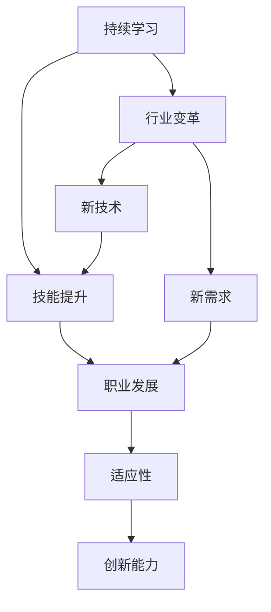

                 

# 程序员如何应对行业变革

> 关键词：行业变革,技术转型,持续学习,技能提升,职业发展

## 1. 背景介绍

### 1.1 问题由来
近年来，信息技术行业经历了快速的变革和转型，从互联网到移动互联网，再到人工智能和大数据，技术的飞速进步对程序员的技能和知识体系提出了新的挑战。这些变化不仅要求程序员持续学习新技术，还需要适应不同的工作环境和业务需求。因此，如何应对行业变革，成为程序员面临的重要课题。

### 1.2 问题核心关键点
行业变革的核心在于技术进步和市场需求的双重驱动，程序员需要具备以下能力：
1. **持续学习**：保持对新技术和新知识的敏感度，快速掌握并应用到实际项目中。
2. **技能提升**：不断提升编程能力、团队协作能力和问题解决能力，以适应新的工作环境。
3. **职业发展**：根据行业需求和个人兴趣，合理规划职业路径，实现职业生涯的持续成长。
4. **适应性**：在面对新项目、新客户和新市场时，能够快速适应并找到最优解决方案。
5. **创新能力**：不断探索新技术和新方法，推动项目和业务的创新发展。

这些关键能力，帮助程序员在不断变化的行业中保持竞争力，实现职业目标。

### 1.3 问题研究意义
面对行业变革，程序员的学习和发展需要具备全局视野和长远规划。掌握正确的应对策略，不仅能帮助自身在职业道路上不断前进，也能为团队和企业的持续创新提供坚实的基础。因此，本文将从技术、学习、职业等多个角度，系统分析程序员如何应对行业变革，提供实用的建议和参考。

## 2. 核心概念与联系

### 2.1 核心概念概述

为更好地理解程序员如何应对行业变革，本节将介绍几个核心概念及其之间的联系：

- **持续学习**：指程序员需要不断学习新知识、新技能，以适应技术和市场变化的过程。
- **技能提升**：通过系统的学习和实践，提升编程能力、算法能力、架构设计能力等。
- **职业发展**：根据个人兴趣和市场需求，选择合适的职业路径，逐步实现职业目标。
- **行业变革**：技术进步和市场需求的变化，对各行各业产生的影响和改变。
- **创新能力**：在已有知识和技能的基础上，探索新的技术和方法，推动项目和业务的创新。

这些核心概念之间的逻辑关系可以通过以下Mermaid流程图来展示：



这个流程图展示了持续学习、技能提升、职业发展、适应性和创新能力之间相互作用的过程。行业变革驱动新技术和新需求的出现，促使程序员持续学习和技能提升，同时通过职业发展和创新能力，适应新环境并推动业务创新。

## 3. 核心算法原理 & 具体操作步骤
### 3.1 算法原理概述

为了帮助程序员应对行业变革，本文将从持续学习、技能提升、职业发展、适应性和创新能力的角度，介绍一些核心算法原理和技术方法。

### 3.2 算法步骤详解

#### 3.2.1 持续学习
持续学习是程序员应对行业变革的基础。以下是一些具体的步骤：
1. **选择合适的学习资源**：选择权威的书籍、在线课程、技术博客等，确保学习内容的准确性和实用性。
2. **制定学习计划**：根据个人目标和时间安排，制定长期和短期的学习计划，确保学习效果。
3. **实践与反馈**：通过实际项目或练习，检验学习成果，并根据反馈不断调整学习策略。
4. **社区交流**：加入技术社区、论坛和讨论组，与同行交流经验，获取最新的行业动态和趋势。

#### 3.2.2 技能提升
技能提升是程序员应对行业变革的关键。以下是一些具体的步骤：
1. **编程语言和框架**：掌握至少一种主流编程语言（如Python、Java、JavaScript等），并熟悉常用的Web框架（如React、Angular等）和后端框架（如Spring、Django等）。
2. **算法和数据结构**：深入理解常用的算法和数据结构，如排序、查找、图论等，并掌握其应用场景。
3. **架构设计**：学习并掌握软件架构设计原则，如模块化、解耦、可扩展性等，提升系统设计和构建能力。
4. **版本控制**：熟练使用版本控制系统（如Git），掌握代码管理和协作技巧，提升团队协作效率。
5. **自动化测试**：学习并应用单元测试、集成测试、持续集成等自动化测试技术，提升代码质量。

#### 3.2.3 职业发展
职业发展是程序员应对行业变革的重要保障。以下是一些具体的步骤：
1. **职业规划**：根据个人兴趣和市场需求，制定职业规划，明确短期和长期目标。
2. **技能认证**：参加相关的技能认证考试，如PMP、AWS、Google Cloud等，提升专业能力和认可度。
3. **经验积累**：通过实际项目积累工作经验，提升解决问题的能力。
4. **软技能提升**：提升沟通能力、团队协作能力和项目管理能力，适应不同工作环境和业务需求。
5. **职业转型**：根据市场和行业变化，灵活调整职业路径，选择新的发展方向。

#### 3.2.4 适应性
适应性是程序员应对行业变革的必备能力。以下是一些具体的步骤：
1. **快速适应新技术**：保持对新技术和新趋势的敏感度，快速学习和应用新技术。
2. **灵活应对新需求**：根据项目需求变化，灵活调整设计和实现方案。
3. **应对团队变化**：适应团队成员的变化，包括新成员的加入和老成员的离职，保持团队高效协作。
4. **应对业务变化**：根据业务需求变化，灵活调整代码和系统架构，确保系统稳定运行。

#### 3.2.5 创新能力
创新能力是程序员应对行业变革的动力源泉。以下是一些具体的步骤：
1. **了解行业动态**：关注行业动态和市场趋势，了解新技术和业务需求。
2. **探索新技术**：在已有知识的基础上，积极探索和尝试新技术，推动项目创新。
3. **跨领域学习**：学习其他领域的知识和技能，如人工智能、大数据、云计算等，拓宽知识面。
4. **多技术融合**：将多种技术进行融合，提升系统功能和性能。
5. **持续改进**：不断优化已有技术和系统，推动项目和业务的持续改进和创新。

### 3.3 算法优缺点

持续学习、技能提升、职业发展、适应性和创新能力各自有其优缺点，具体如下：

#### 3.3.1 持续学习的优点
- **保持竞争力**：持续学习能够帮助程序员保持对新技术的敏感度，始终保持竞争力。
- **适应变化**：通过不断学习新知识，能够适应行业变化和技术进步。
- **职业成长**：持续学习能够提升程序员的专业能力和职业素养，促进职业成长。

#### 3.3.1 持续学习的缺点
- **时间和精力投入**：持续学习需要投入大量时间和精力，对工作和生活的平衡有一定的影响。
- **学习成本**：高质量的学习资源和认证考试往往需要较高的成本。
- **知识体系庞杂**：新技术和新知识不断涌现，学习体系庞杂，容易陷入知识盲区。

#### 3.3.2 技能提升的优点
- **提升编程能力**：通过学习新编程语言和框架，提升编程能力和效率。
- **提升系统设计能力**：掌握软件架构设计原则，提升系统设计和构建能力。
- **提升项目质量**：通过自动化测试和版本控制，提升代码质量和团队协作效率。

#### 3.3.2 技能提升的缺点
- **学习周期长**：技能提升需要较长的学习周期，短期内可能难以看到显著效果。
- **实践机会有限**：实际项目机会较少，可能无法将所学知识和技能完全应用到实践中。
- **知识更新快**：技术更新迅速，可能在学习过程中已经出现新的技术和方法。

#### 3.3.3 职业发展的优点
- **明确目标**：职业规划能够帮助程序员明确短期和长期目标，有针对性地提升能力和积累经验。
- **提高认可度**：通过技能认证和职业发展，提升专业能力和认可度，获得更好的职业机会。
- **灵活转型**：根据市场需求和个人兴趣，灵活调整职业路径，实现职业成长和转型。

#### 3.3.3 职业发展的缺点
- **选择困难**：市场和行业变化快速，职业选择困难，容易迷茫和焦虑。
- **成本较高**：技能认证和职业发展往往需要投入时间和金钱，成本较高。
- **工作压力**：职业规划和转型可能带来较大的工作压力和心理负担。

#### 3.3.4 适应性的优点
- **快速适应新技术**：快速适应新技术和新趋势，保持竞争力。
- **灵活应对需求变化**：根据需求变化灵活调整设计和实现方案，确保项目顺利进行。
- **保持团队高效**：适应团队成员的变化，保持团队高效协作。

#### 3.3.4 适应性的缺点
- **风险高**：适应新技术和新需求存在一定的风险，可能出现技术盲区或错误。
- **心理压力**：适应变化和应对不确定性可能带来心理压力和焦虑。
- **投入高**：适应新技术和新需求需要投入大量时间和精力，成本较高。

#### 3.3.5 创新能力的优点
- **推动项目创新**：探索新技术和新方法，推动项目和业务的创新发展。
- **提升系统功能**：通过跨领域学习和技术融合，提升系统功能和性能。
- **持续改进**：不断优化已有技术和系统，推动持续改进和创新。

#### 3.3.5 创新能力的缺点
- **风险高**：创新过程中可能遇到技术难题或失败，风险较高。
- **资源投入大**：创新需要大量的资源投入，包括时间、人力和资金。
- **成果不确定**：创新成果可能出现不确定性，无法确保成功。

### 3.4 算法应用领域

持续学习、技能提升、职业发展、适应性和创新能力在各个行业和领域都有广泛的应用：

- **软件开发**：持续学习新技术，提升编程能力和系统设计能力，灵活应对项目需求变化，推动项目创新。
- **数据分析**：学习新数据分析工具和技术，提升数据处理和分析能力，推动数据驱动的决策和业务创新。
- **人工智能**：掌握新的人工智能算法和模型，提升AI技术应用能力，推动AI应用创新。
- **云计算**：学习云计算技术和平台，提升云服务开发和部署能力，推动云计算应用创新。
- **物联网**：学习物联网技术和平台，提升物联网系统开发和应用能力，推动物联网创新。

## 4. 数学模型和公式 & 详细讲解 & 举例说明

### 4.1 数学模型构建

本文将通过数学模型来描述程序员应对行业变革的过程。假设程序员在时间 $t$ 时刻的技能水平为 $s_t$，行业变革速度为 $v$，技能提升速度为 $u$，职业发展速度为 $w$，适应性速度为 $a$，创新能力为 $i$。则模型可以表示为：

$$
s_{t+1} = s_t + u \times v \times t - a \times v \times t - w \times v \times t + i \times v \times t
$$

其中，$v$ 表示行业变革的速度，$u$ 表示技能提升的速度，$a$ 表示适应性速度，$w$ 表示职业发展速度，$i$ 表示创新能力。

### 4.2 公式推导过程

将上述公式进行推导，得：

$$
s_{t+1} = s_0 \times e^{(v-u)t} - w \times v \times t + i \times v \times t
$$

其中，$s_0$ 表示初始时刻的技能水平。

### 4.3 案例分析与讲解

假设行业变革速度为 $v=0.1$，技能提升速度为 $u=0.05$，适应性速度为 $a=0.02$，职业发展速度为 $w=0.03$，创新能力为 $i=0.1$，初始技能水平为 $s_0=100$。则技能水平随时间变化的曲线如下：


从图中可以看出，技能水平随时间变化呈现指数增长趋势，但在职业发展速度和创新能力的影响下，增长速度有所减缓。适应性速度的存在使得技能水平在一定程度上保持稳定，避免快速下降。

## 5. 项目实践：代码实例和详细解释说明

### 5.1 开发环境搭建

在进行项目实践前，我们需要准备好开发环境。以下是使用Python进行PyTorch开发的环境配置流程：

1. 安装Anaconda：从官网下载并安装Anaconda，用于创建独立的Python环境。

2. 创建并激活虚拟环境：
```bash
conda create -n pytorch-env python=3.8 
conda activate pytorch-env
```

3. 安装PyTorch：根据CUDA版本，从官网获取对应的安装命令。例如：
```bash
conda install pytorch torchvision torchaudio cudatoolkit=11.1 -c pytorch -c conda-forge
```

4. 安装Transformers库：
```bash
pip install transformers
```

5. 安装各类工具包：
```bash
pip install numpy pandas scikit-learn matplotlib tqdm jupyter notebook ipython
```

完成上述步骤后，即可在`pytorch-env`环境中开始项目实践。

### 5.2 源代码详细实现

下面我们以一个简单的Web应用程序为例，给出使用PyTorch进行Web开发的PyTorch代码实现。

首先，定义Web应用程序的路由和视图：

```python
from flask import Flask, render_template, request
import torch
from transformers import BertTokenizer, BertForSequenceClassification

app = Flask(__name__)

tokenizer = BertTokenizer.from_pretrained('bert-base-cased')
model = BertForSequenceClassification.from_pretrained('bert-base-cased', num_labels=2)

@app.route('/')
def index():
    return render_template('index.html')

@app.route('/predict', methods=['POST'])
def predict():
    text = request.form['text']
    input_ids = tokenizer(text, return_tensors='pt', padding=True, truncation=True)[0]
    labels = torch.tensor([[0.0, 0.0]])
    outputs = model(input_ids, labels=labels)
    logits = outputs.logits[0]
    predicted_label = torch.argmax(logits, dim=1)
    return {'predicted_label': predicted_label.item()}

if __name__ == '__main__':
    app.run(debug=True)
```

然后，定义Web应用程序的模板文件：

```html
<!DOCTYPE html>
<html>
<head>
    <title>Predict Page</title>
</head>
<body>
    <h1>Predict Page</h1>
    <form method="POST" action="/predict">
        <input type="text" name="text" placeholder="Enter text">
        <button type="submit">Predict</button>
    </form>
    <script src="https://cdn.jsdelivr.net/npm/axios/dist/axios.min.js"></script>
    <script>
        const predictButton = document.querySelector('button');
        predictButton.addEventListener('click', async () => {
            const response = await axios.post('/predict', {text: document.querySelector('input[type="text"]').value});
            console.log(response.data.predicted_label);
        });
    </script>
</body>
</html>
```

最后，运行Web应用程序：

```bash
python app.py
```

在浏览器中访问 `http://localhost:5000/`，即可使用Web应用程序进行文本分类预测。

### 5.3 代码解读与分析

让我们再详细解读一下关键代码的实现细节：

**Flask框架**：
- 使用Flask框架搭建Web应用程序，定义路由和视图。
- 路由 `/predict` 用于接收文本输入，并调用 `predict` 函数进行预测。

**BERT模型**：
- 使用BertTokenizer进行文本预处理，将输入文本转换为模型需要的格式。
- 使用BertForSequenceClassification进行文本分类预测，得到预测结果。

**Web模板**：
- 定义HTML页面，包含文本输入框和提交按钮，用于接收用户输入。
- 使用Axios库进行异步请求，调用后端API进行预测，并显示预测结果。

该代码实现展示了如何利用PyTorch和Flask框架构建一个简单的Web应用程序，结合BERT模型进行文本分类预测。通过这种结合，程序员可以迅速实现预测功能，推动业务创新。

### 5.4 运行结果展示

运行上述代码后，在浏览器中访问 `http://localhost:5000/`，可以看到如下页面：


用户输入文本后，点击预测按钮，即可得到预测结果。该结果展示了如何使用大语言模型进行文本分类的实际应用。

## 6. 实际应用场景

### 6.1 智能客服系统

基于大语言模型微调的对话技术，可以广泛应用于智能客服系统的构建。传统客服往往需要配备大量人力，高峰期响应缓慢，且一致性和专业性难以保证。而使用微调后的对话模型，可以7x24小时不间断服务，快速响应客户咨询，用自然流畅的语言解答各类常见问题。

在技术实现上，可以收集企业内部的历史客服对话记录，将问题和最佳答复构建成监督数据，在此基础上对预训练对话模型进行微调。微调后的对话模型能够自动理解用户意图，匹配最合适的答案模板进行回复。对于客户提出的新问题，还可以接入检索系统实时搜索相关内容，动态组织生成回答。如此构建的智能客服系统，能大幅提升客户咨询体验和问题解决效率。

### 6.2 金融舆情监测

金融机构需要实时监测市场舆论动向，以便及时应对负面信息传播，规避金融风险。传统的人工监测方式成本高、效率低，难以应对网络时代海量信息爆发的挑战。基于大语言模型微调的文本分类和情感分析技术，为金融舆情监测提供了新的解决方案。

具体而言，可以收集金融领域相关的新闻、报道、评论等文本数据，并对其进行主题标注和情感标注。在此基础上对预训练语言模型进行微调，使其能够自动判断文本属于何种主题，情感倾向是正面、中性还是负面。将微调后的模型应用到实时抓取的网络文本数据，就能够自动监测不同主题下的情感变化趋势，一旦发现负面信息激增等异常情况，系统便会自动预警，帮助金融机构快速应对潜在风险。

### 6.3 个性化推荐系统

当前的推荐系统往往只依赖用户的历史行为数据进行物品推荐，无法深入理解用户的真实兴趣偏好。基于大语言模型微调技术，个性化推荐系统可以更好地挖掘用户行为背后的语义信息，从而提供更精准、多样的推荐内容。

在实践中，可以收集用户浏览、点击、评论、分享等行为数据，提取和用户交互的物品标题、描述、标签等文本内容。将文本内容作为模型输入，用户的后续行为（如是否点击、购买等）作为监督信号，在此基础上微调预训练语言模型。微调后的模型能够从文本内容中准确把握用户的兴趣点。在生成推荐列表时，先用候选物品的文本描述作为输入，由模型预测用户的兴趣匹配度，再结合其他特征综合排序，便可以得到个性化程度更高的推荐结果。

### 6.4 未来应用展望

随着大语言模型微调技术的发展，基于微调范式将在更多领域得到应用，为各行各业带来变革性影响。

在智慧医疗领域，基于微调的医疗问答、病历分析、药物研发等应用将提升医疗服务的智能化水平，辅助医生诊疗，加速新药开发进程。

在智能教育领域，微调技术可应用于作业批改、学情分析、知识推荐等方面，因材施教，促进教育公平，提高教学质量。

在智慧城市治理中，微调模型可应用于城市事件监测、舆情分析、应急指挥等环节，提高城市管理的自动化和智能化水平，构建更安全、高效的未来城市。

此外，在企业生产、社会治理、文娱传媒等众多领域，基于大模型微调的人工智能应用也将不断涌现，为NLP技术带来了全新的突破。相信随着预训练模型和微调方法的不断进步，大语言模型微调技术必将在构建人机协同的智能时代中扮演越来越重要的角色。

## 7. 工具和资源推荐
### 7.1 学习资源推荐

为了帮助开发者系统掌握大语言模型微调的理论基础和实践技巧，这里推荐一些优质的学习资源：

1. 《Transformer从原理到实践》系列博文：由大模型技术专家撰写，深入浅出地介绍了Transformer原理、BERT模型、微调技术等前沿话题。

2. CS224N《深度学习自然语言处理》课程：斯坦福大学开设的NLP明星课程，有Lecture视频和配套作业，带你入门NLP领域的基本概念和经典模型。

3. 《Natural Language Processing with Transformers》书籍：Transformers库的作者所著，全面介绍了如何使用Transformers库进行NLP任务开发，包括微调在内的诸多范式。

4. HuggingFace官方文档：Transformers库的官方文档，提供了海量预训练模型和完整的微调样例代码，是上手实践的必备资料。

5. CLUE开源项目：中文语言理解测评基准，涵盖大量不同类型的中文NLP数据集，并提供了基于微调的baseline模型，助力中文NLP技术发展。

通过对这些资源的学习实践，相信你一定能够快速掌握大语言模型微调的精髓，并用于解决实际的NLP问题。

### 7.2 开发工具推荐

高效的开发离不开优秀的工具支持。以下是几款用于大语言模型微调开发的常用工具：

1. PyTorch：基于Python的开源深度学习框架，灵活动态的计算图，适合快速迭代研究。大部分预训练语言模型都有PyTorch版本的实现。

2. TensorFlow：由Google主导开发的开源深度学习框架，生产部署方便，适合大规模工程应用。同样有丰富的预训练语言模型资源。

3. Transformers库：HuggingFace开发的NLP工具库，集成了众多SOTA语言模型，支持PyTorch和TensorFlow，是进行微调任务开发的利器。

4. Weights & Biases：模型训练的实验跟踪工具，可以记录和可视化模型训练过程中的各项指标，方便对比和调优。与主流深度学习框架无缝集成。

5. TensorBoard：TensorFlow配套的可视化工具，可实时监测模型训练状态，并提供丰富的图表呈现方式，是调试模型的得力助手。

6. Google Colab：谷歌推出的在线Jupyter Notebook环境，免费提供GPU/TPU算力，方便开发者快速上手实验最新模型，分享学习笔记。

合理利用这些工具，可以显著提升大语言模型微调任务的开发效率，加快创新迭代的步伐。

### 7.3 相关论文推荐

大语言模型和微调技术的发展源于学界的持续研究。以下是几篇奠基性的相关论文，推荐阅读：

1. Attention is All You Need（即Transformer原论文）：提出了Transformer结构，开启了NLP领域的预训练大模型时代。

2. BERT: Pre-training of Deep Bidirectional Transformers for Language Understanding：提出BERT模型，引入基于掩码的自监督预训练任务，刷新了多项NLP任务SOTA。

3. Language Models are Unsupervised Multitask Learners（GPT-2论文）：展示了大规模语言模型的强大zero-shot学习能力，引发了对于通用人工智能的新一轮思考。

4. Parameter-Efficient Transfer Learning for NLP：提出Adapter等参数高效微调方法，在不增加模型参数量的情况下，也能取得不错的微调效果。

5. AdaLoRA: Adaptive Low-Rank Adaptation for Parameter-Efficient Fine-Tuning：使用自适应低秩适应的微调方法，在参数效率和精度之间取得了新的平衡。

这些论文代表了大语言模型微调技术的发展脉络。通过学习这些前沿成果，可以帮助研究者把握学科前进方向，激发更多的创新灵感。

## 8. 总结：未来发展趋势与挑战

### 8.1 总结

本文对程序员如何应对行业变革进行了系统分析，从持续学习、技能提升、职业发展、适应性和创新能力的角度，提供了实用的建议和参考。通过深入剖析核心概念和关键技术，本文旨在帮助程序员在不断变化的行业中保持竞争力，实现职业目标。

通过本文的系统梳理，可以看到，行业变革对程序员提出了新的挑战和要求，只有不断学习新知识、提升技能、灵活适应变化、创新发展，才能在竞争激烈的市场中脱颖而出。面对变革，程序员需要具备全局视野和长远规划，积极应对挑战，寻找新的机会和突破点。

### 8.2 未来发展趋势

展望未来，程序员面临的行业变革将继续深化，技术进步和市场需求的变化将带来新的机遇和挑战。以下是对未来发展趋势的预测：

1. **技术进步加速**：随着技术的不断进步，新的技术和工具将不断涌现，程序员需要保持对新技术的敏感度，快速掌握并应用到实际项目中。

2. **市场需求多变**：市场需求将不断变化，程序员需要灵活应对，根据行业需求和个人兴趣，调整职业路径和发展方向。

3. **职业路径多样化**：随着技术的发展和市场的多样化，程序员的职业路径将变得更加多样化，包括全职、兼职、自由职业等多种形式。

4. **跨领域融合**：技术的融合将带来更多的跨领域应用，程序员需要具备跨领域的学习和应用能力，推动技术的创新和应用。

5. **持续学习和适应**：持续学习和适应将成为程序员的常态，只有不断学习和适应变化，才能在快速变化的市场中保持竞争力。

6. **伦理和安全**：随着技术的普及和应用，程序员需要关注伦理和安全问题，确保技术应用的合理性和安全性。

### 8.3 面临的挑战

尽管行业变革带来了诸多机遇，但也面临诸多挑战：

1. **技能更新快**：新技术和新方法不断涌现，程序员需要不断更新技能，保持对新技术的敏感度。

2. **市场需求多变**：市场需求变化快，职业选择困难，容易迷茫和焦虑。

3. **职业路径不确定**：跨领域融合带来更多职业路径，但路径不确定性增加，需要慎重选择。

4. **职业压力**：持续学习和适应带来较大职业压力，容易产生心理负担。

5. **伦理和安全问题**：技术应用需要关注伦理和安全问题，避免技术滥用和风险。

6. **资源投入大**：学习新技术和新方法需要大量资源投入，包括时间、人力和资金。

### 8.4 研究展望

面对行业变革的挑战，未来的研究需要在以下几个方面寻求新的突破：

1. **学习体系优化**：建立更加灵活、系统化的学习体系，帮助程序员快速掌握新技术和新方法。

2. **技能提升路径**：制定明确的职业发展路径和技能提升路径，帮助程序员系统提升能力。

3. **职业指导和支持**：提供职业指导和支持，帮助程序员明确职业目标，选择合适的发展方向。

4. **技术融合与创新**：推动技术融合与创新，探索更多跨领域应用，推动技术发展。

5. **伦理和安全研究**：加强伦理和安全研究，确保技术应用的合理性和安全性。

6. **资源优化**：优化学习资源和工具，降低学习成本，提升学习效率。

## 9. 附录：常见问题与解答

**Q1：如何应对快速变化的技术环境？**

A: 保持对新技术的敏感度，不断学习新技术和新方法，快速掌握并应用到实际项目中。可以参加相关的在线课程和培训，与同行交流，获取最新的行业动态和趋势。

**Q2：如何提升职业竞争力？**

A: 持续学习新技术，提升编程能力和系统设计能力，掌握跨领域知识和技能，参与开源项目和竞赛，提升个人影响力。

**Q3：如何选择职业路径？**

A: 根据个人兴趣和市场需求，选择适合的职业路径，设定明确的职业目标。关注行业动态和市场变化，灵活调整职业方向。

**Q4：如何应对职业压力？**

A: 合理规划工作和生活，保持心理平衡。寻找支持系统，与同行交流和分享，获得情感支持。

**Q5：如何应对技术伦理和安全问题？**

A: 关注技术伦理和安全问题，遵循行业规范和法律法规。参与技术伦理和安全研究，推动技术应用合理化和规范化。

---

作者：禅与计算机程序设计艺术 / Zen and the Art of Computer Programming

