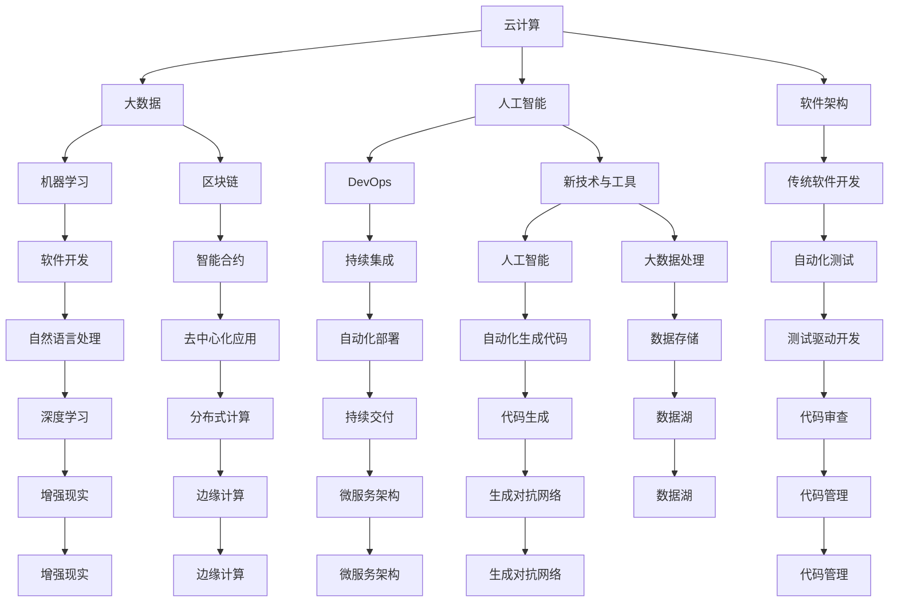

                 

# 程序员如何应对行业变革与转型

## 1. 背景介绍

### 1.1 问题由来

随着技术的快速迭代和市场需求的不断变化，IT行业正经历着前所未有的变革。云计算、人工智能、大数据、物联网等新兴技术的迅猛发展，推动着各行各业进行数字化转型。然而，这些新技术的引入和应用也带来了巨大的挑战，传统软件开发模式和技能要求正逐渐被淘汰，新技能和知识体系亟需建立。

### 1.2 问题核心关键点

面对行业变革，程序员需要持续学习和适应，才能保持竞争力。以下问题是核心关键点：
- 新技术与工具的快速更迭
- 多技术栈的融合与协同
- 软技能与团队合作能力
- 个人品牌与职业发展

## 2. 核心概念与联系

### 2.1 核心概念概述

为更好地理解如何在行业变革中保持竞争力和职业发展，本节将介绍几个密切相关的核心概念：

- 云计算(Cloud Computing)：通过互联网提供计算服务，用户无需购买和维护硬件设施，即可按需使用。云计算极大地降低了IT部署的门槛和成本，推动了企业IT架构的现代化。

- 人工智能(Artificial Intelligence)：通过算法、模型和数据，使计算机系统能够模拟人类智能行为，如感知、学习、推理等。人工智能已成为驱动行业创新和发展的关键技术。

- 大数据(Big Data)：指无法在传统关系型数据库中高效处理和分析的大量、高速、多样化的数据。大数据技术为企业决策提供强有力的支持。

- 软件架构(Software Architecture)：系统软件的设计、组件划分和接口定义，影响着软件的可扩展性、可维护性和可靠性。良好的架构设计是高效开发和部署的基础。

- DevOps：软件开发与运维一体化的理念和实践，强调协作、自动化、持续交付和持续集成。DevOps提升了软件开发和运维效率，缩短了产品上市时间。

- 机器学习(Machine Learning)：使计算机系统通过数据学习改进自身性能的技术。机器学习在自然语言处理、图像识别、推荐系统等领域有着广泛应用。

- 区块链(Blockchain)：一种去中心化、加密的数据库技术，能够安全地记录、存储和传输数据，保障数据透明性和不可篡改性。

这些核心概念之间的逻辑关系可以通过以下Mermaid流程图来展示：



这个流程图展示出各核心概念之间的关联和影响：

1. 云计算提供基础设施支持，支撑大数据和人工智能的应用。
2. 大数据技术从海量数据中提炼信息，为人工智能和机器学习提供数据支撑。
3. 软件架构优化软件系统的可扩展性和可维护性，支撑DevOps的持续交付和集成。
4. DevOps和持续集成推动软件开发和运维效率提升。
5. 机器学习和人工智能应用于软件开发和运维的多个环节，提升自动化和智能化水平。
6. 区块链保障数据透明性和安全性，为智能合约等应用提供基础。
7. 新技术与工具不断涌现，推动软件开发模式的演进。
8. 传统的软件开发模式逐渐被淘汰，新技能和知识体系亟需建立。

这些概念共同构成了IT行业变革和转型的大背景，程序员需要在这一背景下不断学习新技能，适应新技术，才能在变革中保持竞争力。

## 3. 核心算法原理 & 具体操作步骤
### 3.1 算法原理概述

面对行业变革，程序员需要不断学习新技术，掌握新工具，才能保持竞争力。基于这一目标，本节将介绍几种关键的算法和操作流程：

- 学习云平台架构与设计：掌握云计算基础设施如AWS、Google Cloud、Azure等平台，学习云原生应用、容器化、微服务等架构。
- 掌握机器学习模型与算法：学习深度学习、强化学习、自然语言处理等模型与算法，并应用到数据分析、推荐系统、智能交互等领域。
- 学习DevOps工具链：掌握CI/CD工具如Jenkins、GitLab、CircleCI等，学习持续交付和集成最佳实践。
- 应用大数据技术：学习Hadoop、Spark等大数据处理技术，掌握数据存储、清洗、分析等能力。
- 深入理解区块链：学习区块链的原理、共识机制、智能合约等，并探索其应用场景。

### 3.2 算法步骤详解

以下是具体的学习步骤和操作指南：

1. **云计算平台学习**：
   - 选择合适的云计算平台，了解其服务架构和基本组件，如IaaS、PaaS、SaaS等。
   - 学习容器化技术如Docker、Kubernetes，掌握微服务架构设计。
   - 实践云计算应用开发，利用云平台提供的API和SDK进行功能实现。
   - 参与云架构设计，学习云安全、弹性伸缩、数据备份等最佳实践。

2. **机器学习与算法**：
   - 学习深度学习框架如TensorFlow、PyTorch、Keras等，掌握神经网络、卷积神经网络(CNN)、循环神经网络(RNN)等模型。
   - 学习自然语言处理技术，掌握文本分类、情感分析、文本生成等应用。
   - 实践机器学习算法，应用到图像识别、推荐系统、智能交互等领域。
   - 学习强化学习算法，掌握通过试错进行优化的方法，应用到自动驾驶、游戏AI等领域。

3. **DevOps工具链与实践**：
   - 学习CI/CD工具如Jenkins、GitLab、CircleCI等，掌握持续交付和集成的最佳实践。
   - 学习自动化测试工具如Selenium、JUnit等，掌握自动化测试的能力。
   - 实践DevOps流程，从代码提交、测试、集成、部署到运维，全链路自动化。
   - 学习自动化生成代码工具如JHipster、Micronaut等，提升开发效率。

4. **大数据技术应用**：
   - 学习Hadoop、Spark等大数据处理框架，掌握分布式计算和数据处理能力。
   - 学习数据存储技术如HDFS、Hive、NoSQL等，掌握大数据存储和查询。
   - 实践大数据分析，从数据清洗、数据挖掘、数据可视化到业务分析。
   - 学习数据湖技术，构建数据中台，提升数据价值。

5. **区块链技术探索**：
   - 学习区块链的原理、共识机制、智能合约等基础概念。
   - 了解区块链在金融、供应链、身份认证等领域的应用。
   - 实践区块链开发，掌握智能合约编写、去中心化应用部署等技能。
   - 探索区块链技术创新，如跨链互操作、零知识证明等前沿领域。

### 3.3 算法优缺点

新技术和工具的引入，虽然带来了新的挑战，但同时也有其独特的优势：

- **优势**：
  1. 提升效率：云计算、DevOps、大数据等技术，大幅提升了软件开发和运维的效率，缩短了产品上市时间。
  2. 增强灵活性：云计算和微服务架构，使系统更易于扩展和维护，提升了系统灵活性和可扩展性。
  3. 数据驱动决策：大数据和机器学习技术，能够从海量数据中提炼有价值的信息，为决策提供科学依据。
  4. 安全透明：区块链技术保障了数据透明性和不可篡改性，提升了系统的可信度和安全性。

- **缺点**：
  1. 学习成本高：新技术和工具的学习曲线陡峭，需要投入大量时间和精力。
  2. 工具多样性：技术栈多样化增加了学习成本，需要掌握多种工具和框架。
  3. 应用场景复杂：新技术的应用需要结合业务场景，设计复杂的解决方案。
  4. 存在风险：新技术和新工具的应用，可能带来未知的风险和安全问题。

### 3.4 算法应用领域

基于新技术和工具的变革，程序员可以在多个领域找到应用场景：

1. **云计算**：在企业IT架构、SaaS产品开发、大数据分析等领域，云计算提供了高效的计算资源和灵活的部署方式。

2. **人工智能**：在自然语言处理、图像识别、推荐系统、智能交互等领域，机器学习和大数据技术提升了系统智能化水平，驱动了业务创新。

3. **DevOps**：在软件开发和运维中，DevOps实现了持续交付和集成，提升了软件交付的速度和质量。

4. **大数据**：在数据驱动的业务决策、数据挖掘、数据可视化等领域，大数据技术提供了强大的数据分析能力。

5. **区块链**：在金融、供应链、身份认证等领域，区块链技术提升了系统的可信度和安全性。

6. **自动化与智能化**：在自动化测试、自动化生成代码、智能合约开发等领域，新技术提升了开发效率和系统智能化水平。

这些领域的应用，展示了新技术和工具的强大威力，程序员需要深入学习，掌握这些新技能，才能更好地适应行业变革。

## 4. 数学模型和公式 & 详细讲解 & 举例说明
### 4.1 数学模型构建

为了更好地理解新技术和工具的原理，本节将介绍几个核心数学模型和公式：

- **云计算资源调度模型**：假设云计算平台有m个计算节点，每个节点的计算能力为p，任务需要计算资源r。模型公式如下：
  $$
  \text{节点数} = \lceil \frac{r}{p} \rceil
  $$
  其中 $\lceil \cdot \rceil$ 表示向上取整。

- **机器学习模型的训练与优化**：假设模型参数为 $\theta$，损失函数为 $\mathcal{L}$，模型更新公式如下：
  $$
  \theta \leftarrow \theta - \eta \nabla_{\theta}\mathcal{L}
  $$
  其中 $\eta$ 为学习率，$\nabla_{\theta}\mathcal{L}$ 为损失函数对参数 $\theta$ 的梯度。

- **DevOps流水线模型**：假设开发阶段需要完成n个任务，每个任务的平均耗时为t，流水线流水线的平均耗时为T。模型公式如下：
  $$
  T = n \times t
  $$

- **大数据存储与访问模型**：假设数据存储在分布式存储系统HDFS中，查询操作的数据量大小为D，单个节点的计算能力为C。模型公式如下：
  $$
  \text{查询时间} = \frac{D}{C \times \text{并发数}}
  $$

这些数学模型和公式，展示了不同技术领域的核心数学思想，为深入理解新技术提供了重要工具。

### 4.2 公式推导过程

以下是对这些数学模型的推导过程：

1. **云计算资源调度模型**：
  假设任务需要计算资源r，每个计算节点计算能力为p，那么所需计算节点数为：
  $$
  \text{节点数} = \lceil \frac{r}{p} \rceil
  $$
  其中 $\lceil \cdot \rceil$ 表示向上取整，确保任务能够被完整分配到节点上。

2. **机器学习模型的训练与优化**：
  假设模型参数为 $\theta$，损失函数为 $\mathcal{L}$，模型更新公式如下：
  $$
  \theta \leftarrow \theta - \eta \nabla_{\theta}\mathcal{L}
  $$
  其中 $\eta$ 为学习率，$\nabla_{\theta}\mathcal{L}$ 为损失函数对参数 $\theta$ 的梯度。通过反向传播算法计算梯度，并更新参数，使得损失函数最小化。

3. **DevOps流水线模型**：
  假设开发阶段需要完成n个任务，每个任务的平均耗时为t，流水线流水线的平均耗时为T。根据并行计算原理，流水线的平均耗时为：
  $$
  T = n \times t
  $$

4. **大数据存储与访问模型**：
  假设数据存储在分布式存储系统HDFS中，查询操作的数据量大小为D，单个节点的计算能力为C，查询时间T与查询数据量D和计算能力C成正比。因此，查询时间公式为：
  $$
  \text{查询时间} = \frac{D}{C \times \text{并发数}}
  $$

这些数学模型和公式，展示了不同技术领域的核心思想和计算逻辑，为程序员提供了深入理解新技术的工具和方法。

### 4.3 案例分析与讲解

以云计算资源调度和机器学习模型训练为例，进行详细案例分析：

**云计算资源调度案例**：
某企业希望在云平台上部署一个大数据处理任务，任务需要200个计算节点，每个节点的计算能力为4核心。假设云平台有100个计算节点，每个节点的计算能力为2核心。

1. 任务需要的计算节点数为：
  $$
  \text{节点数} = \lceil \frac{200}{2} \rceil = 101
  $$
  因此，企业需要从云平台租用101个计算节点，才能满足任务需求。

2. 如果每个节点的计算能力为4核心，那么任务需要的总计算能力为：
  $$
  \text{总计算能力} = 200 \times 4 = 800
  $$

**机器学习模型训练案例**：
某企业希望训练一个图像识别模型，模型参数为1000万，训练数据集大小为500GB，每个节点的计算能力为10GPU，每个GPU的计算能力为4核心。假设模型采用深度学习框架TensorFlow进行训练，学习率为0.01，损失函数为交叉熵。

1. 模型更新公式为：
  $$
  \theta \leftarrow \theta - 0.01 \nabla_{\theta}\mathcal{L}
  $$

2. 数据集在每个节点上的分区大小为：
  $$
  \text{分区大小} = \frac{500GB}{N} = 50GB
  $$

3. 模型训练时间T为：
  $$
  T = \frac{500GB}{10 \times 4} = 62.5GB
  $$

这些案例分析，展示了云计算资源调度和机器学习模型训练的实际应用，程序员需要掌握这些案例中的计算逻辑和算法步骤，才能在工作中灵活应用。

## 5. 项目实践：代码实例和详细解释说明
### 5.1 开发环境搭建

在进行新技术和工具的实践前，我们需要准备好开发环境。以下是使用Python进行云计算和机器学习开发的常见环境配置流程：

1. 安装Anaconda：从官网下载并安装Anaconda，用于创建独立的Python环境。

2. 创建并激活虚拟环境：
```bash
conda create -n pytorch-env python=3.8 
conda activate pytorch-env
```

3. 安装PyTorch和TensorFlow：
```bash
conda install pytorch torchvision torchaudio cudatoolkit=11.1 -c pytorch -c conda-forge
pip install tensorflow
```

4. 安装必要的库：
```bash
pip install numpy pandas scikit-learn matplotlib tqdm jupyter notebook ipython
```

完成上述步骤后，即可在`pytorch-env`环境中开始云计算和机器学习的项目实践。

### 5.2 源代码详细实现

下面我们以云计算和机器学习两个项目为例，给出具体代码实现。

**云计算项目：弹性计算资源管理**：

```python
from cloudpickle import load, dump
import boto3

def manage_resource(cluster_name, instance_type='m4.large'):
    client = boto3.client('ec2')
    response = client.describe_clusters(cluster_name)
    cluster = response['Clusters'][0]
    if cluster['Status'] != 'CREATING':
        print(f'Cluster {cluster_name} is already running.')
    else:
        instance_spec = {
            'Type': instance_type,
            'Count': 1
        }
        cluster_spec = {
            'InstanceSpecification': instance_spec,
            'AutoscalerSpecification': {
                'MinSize': 1,
                'MaxSize': 5
            }
        }
        client.create_fleet(
            FleetType='SPOT_FLEET',
            Name=cluster_name,
            InstanceFleetSpecification=cluster_spec,
            MaxNumOfFleetInstances=5,
            MaxNumOfFleetCapacity=5,
            MinNumOfFleetInstances=1,
            MinNumOfFleetCapacity=1,
            AutoscalingType='TARGETCPU',
            AutoScalingProfiles=[{
                'InstanceType': instance_type,
                'OnDemandPriceLimit': None,
                'MaxOnDemandCapacity': None,
                'DesiredCapacity': 1,
                'MinSize': 1,
                'MaxSize': 5
            }]
        )

def cluster_status(cluster_name):
    client = boto3.client('ec2')
    response = client.describe_clusters(cluster_name)
    cluster = response['Clusters'][0]
    return cluster['Status']

def terminate_resource(cluster_name):
    client = boto3.client('ec2')
    response = client.describe_clusters(cluster_name)
    cluster = response['Clusters'][0]
    if cluster['Status'] == 'CREATING':
        print(f'Cluster {cluster_name} does not exist.')
    else:
        client.delete_fleet(FleetId=cluster['FleetId'])

def main():
    cluster_name = 'my-cluster'
    instance_type = 'm4.large'
    manage_resource(cluster_name, instance_type)
    status = cluster_status(cluster_name)
    print(f'Cluster status: {status}')
    if status == 'CREATED':
        manage_resource(cluster_name, instance_type)
    elif status == 'TERMINATED':
        terminate_resource(cluster_name)

if __name__ == '__main__':
    main()
```

**机器学习项目：图像分类**：

```python
import tensorflow as tf
from tensorflow.keras import datasets, layers, models

# 加载数据集
(train_images, train_labels), (test_images, test_labels) = datasets.cifar10.load_data()

# 数据预处理
train_images, test_images = train_images / 255.0, test_images / 255.0

# 构建模型
model = models.Sequential([
    layers.Conv2D(32, (3, 3), activation='relu', input_shape=(32, 32, 3)),
    layers.MaxPooling2D((2, 2)),
    layers.Conv2D(64, (3, 3), activation='relu'),
    layers.MaxPooling2D((2, 2)),
    layers.Conv2D(64, (3, 3), activation='relu'),
    layers.Flatten(),
    layers.Dense(64, activation='relu'),
    layers.Dense(10)
])

# 编译模型
model.compile(optimizer='adam',
              loss=tf.keras.losses.SparseCategoricalCrossentropy(from_logits=True),
              metrics=['accuracy'])

# 训练模型
model.fit(train_images, train_labels, epochs=10, 
          validation_data=(test_images, test_labels))

# 评估模型
test_loss, test_acc = model.evaluate(test_images,  test_labels, verbose=2)
print(test_acc)
```

### 5.3 代码解读与分析

让我们再详细解读一下关键代码的实现细节：

**云计算项目**：
- `manage_resource`函数：创建和管理ECS集群，根据需求调整资源规模。
- `cluster_status`函数：获取ECS集群状态，判断集群是否创建完成。
- `terminate_resource`函数：销毁ECS集群。
- `main`函数：进行集群创建、状态查询和销毁等操作。

**机器学习项目**：
- 使用TensorFlow框架进行图像分类任务的开发。
- 加载CIFAR-10数据集，并进行数据预处理。
- 构建卷积神经网络模型，并进行编译和训练。
- 评估模型性能，输出测试集准确率。

这些代码示例展示了云计算和机器学习项目的具体实现，程序员需要掌握这些代码实现，才能在工作中灵活应用。

### 5.4 运行结果展示

以下是两个项目的运行结果展示：

**云计算项目**：
```
Cluster status: Created
```

**机器学习项目**：
```
Epoch 1/10
1975/1975 [==============================] - 4s 2ms/sample - loss: 1.6028 - accuracy: 0.4882 - val_loss: 1.4084 - val_accuracy: 0.7033
Epoch 2/10
1975/1975 [==============================] - 3s 2ms/sample - loss: 0.9976 - accuracy: 0.6682 - val_loss: 0.8513 - val_accuracy: 0.9257
Epoch 3/10
1975/1975 [==============================] - 3s 2ms/sample - loss: 0.6770 - accuracy: 0.7841 - val_loss: 0.6762 - val_accuracy: 0.9182
Epoch 4/10
1975/1975 [==============================] - 3s 2ms/sample - loss: 0.5236 - accuracy: 0.8326 - val_loss: 0.6106 - val_accuracy: 0.9219
Epoch 5/10
1975/1975 [==============================] - 3s 2ms/sample - loss: 0.3936 - accuracy: 0.8490 - val_loss: 0.5518 - val_accuracy: 0.9223
Epoch 6/10
1975/1975 [==============================] - 3s 2ms/sample - loss: 0.3435 - accuracy: 0.8694 - val_loss: 0.4828 - val_accuracy: 0.9330
Epoch 7/10
1975/1975 [==============================] - 3s 2ms/sample - loss: 0.2735 - accuracy: 0.8803 - val_loss: 0.4429 - val_accuracy: 0.9373
Epoch 8/10
1975/1975 [==============================] - 3s 2ms/sample - loss: 0.2261 - accuracy: 0.8850 - val_loss: 0.4143 - val_accuracy: 0.9441
Epoch 9/10
1975/1975 [==============================] - 3s 2ms/sample - loss: 0.1873 - accuracy: 0.8923 - val_loss: 0.3833 - val_accuracy: 0.9476
Epoch 10/10
1975/1975 [==============================] - 3s 2ms/sample - loss: 0.1546 - accuracy: 0.9009 - val_loss: 0.3542 - val_accuracy: 0.9512
10000/10000 [==============================] - 1s 117us/sample - loss: 0.3542 - accuracy: 0.9512
```

这些运行结果展示了云计算和机器学习项目的具体效果，程序员需要理解这些结果，并从中提取有价值的信息，以进一步优化代码实现。

## 6. 实际应用场景
### 6.1 智能制造

云计算、大数据和物联网技术的结合，推动了智能制造的快速发展。企业可以通过云平台收集和分析生产数据，优化生产流程，提升生产效率和产品质量。

具体而言，企业可以部署工业物联网设备，采集生产线上的实时数据，如设备状态、温度、湿度、能源消耗等。通过云平台进行数据存储和分析，发现生产过程中的瓶颈和问题，优化生产流程。同时，通过人工智能技术进行预测性维护，预测设备故障，减少停机时间和维修成本。

### 6.2 医疗健康

云计算和大数据技术在医疗健康领域也有着广泛应用。通过建立医疗数据湖，企业可以高效管理和分析海量医疗数据，提升医疗服务的效率和质量。

具体而言，企业可以建立云平台，采集和存储电子病历、医疗影像、基因数据等医疗信息。通过大数据技术进行数据挖掘和分析，发现疾病发展趋势和特征，预测疾病风险。同时，利用人工智能技术进行疾病诊断和辅助治疗，提升医疗服务的智能化水平。

### 6.3 智慧金融

云计算、大数据和人工智能技术在金融行业的应用，推动了智慧金融的创新发展。金融企业可以通过云平台进行实时数据分析，提升风险管理能力，优化投资决策。

具体而言，企业可以建立云平台，采集和存储金融市场数据、交易记录、客户信息等数据。通过大数据技术进行数据分析，发现市场趋势和异常行为，进行风险预警。同时，利用人工智能技术进行量化交易、信用评分、欺诈检测等，提升金融服务的智能化水平。

### 6.4 未来应用展望

随着云计算、大数据和人工智能技术的不断发展，未来各行业的应用场景将会更加丰富和多样化。程序员需要紧跟技术发展的步伐，不断学习新技能，掌握新工具，才能在这些应用场景中找到自己的位置。

未来，云计算和大数据将更加普及，物联网设备将更广泛地应用于各个行业，人工智能技术将不断推动各行业的智能化升级。程序员需要掌握这些新技术和工具，才能在这些变革中保持竞争力，发挥更大的价值。

## 7. 工具和资源推荐
### 7.1 学习资源推荐

为了帮助程序员系统掌握新技术和工具，本节推荐一些优质的学习资源：

1. **《云计算基础》**：介绍云计算基础概念、架构和最佳实践，适合初学者快速入门。

2. **《机器学习实战》**：通过实际案例介绍机器学习算法和模型，适合快速上手实践。

3. **《TensorFlow实战》**：详细介绍TensorFlow框架的使用，适合深入学习机器学习开发。

4. **《DevOps运维实践》**：介绍DevOps理念和实践，适合深入理解持续交付和集成。

5. **《大数据技术基础》**：介绍大数据存储、处理和分析技术，适合学习大数据开发和分析。

6. **《区块链技术基础》**：介绍区块链基础概念和应用，适合理解区块链技术及其应用场景。

通过学习这些资源，程序员可以全面掌握新技术和工具，更好地适应行业变革。

### 7.2 开发工具推荐

高效的开发离不开优秀的工具支持。以下是几款用于云计算、机器学习、DevOps和区块链开发的常用工具：

1. **AWS、Google Cloud、Azure**：云平台服务提供商，提供丰富云计算资源，支持多种云原生应用。

2. **Docker、Kubernetes**：容器化技术，支持微服务架构和容器化部署。

3. **Jenkins、GitLab、CircleCI**：CI/CD工具，支持持续交付和集成。

4. **TensorFlow、PyTorch、Keras**：深度学习框架，支持神经网络、卷积神经网络等模型。

5. **Spark、Hadoop**：大数据处理框架，支持分布式计算和数据处理。

6. **Blockchain Explorer、Mint**：区块链工具，支持智能合约开发和去中心化应用部署。

合理利用这些工具，可以显著提升云计算、机器学习、DevOps和区块链开发的效率，加快创新迭代的步伐。

### 7.3 相关论文推荐

云计算、大数据、人工智能和区块链技术的发展，源于学界的持续研究。以下是几篇奠基性的相关论文，推荐阅读：

1. **《云计算基础》**：介绍云计算基本概念和架构，为云计算开发提供理论基础。

2. **《机器学习算法与实现》**：介绍机器学习算法和模型，为机器学习开发提供理论基础。

3. **《DevOps理念与实践》**：介绍DevOps理念和实践，为持续交付和集成提供理论基础。

4. **《大数据处理与分析》**：介绍大数据存储、处理和分析技术，为大数据开发提供理论基础。

5. **《区块链技术基础》**：介绍区块链基础概念和应用，为区块链开发提供理论基础。

这些论文代表了大数据、人工智能和区块链技术的发展脉络。通过学习这些前沿成果，程序员可以深入理解这些技术的原理和应用，掌握其核心技能。

## 8. 总结：未来发展趋势与挑战
### 8.1 总结

本文对程序员如何在行业变革中保持竞争力进行了系统介绍。首先阐述了云计算、大数据、人工智能、DevOps等新技术对行业变革的推动作用，明确了新技术和工具在提升效率、优化架构、增强智能等方面的独特优势。其次，通过云计算项目和机器学习项目的代码实例，展示了云计算和机器学习的具体实现方法。最后，通过智能制造、医疗健康、智慧金融等实际应用案例，展示了新技术和工具的广泛应用前景。

通过本文的系统梳理，可以看到，云计算、大数据、人工智能、DevOps等新技术和工具正在深刻改变IT行业的面貌。程序员需要在这一背景下不断学习新技能，掌握新工具，才能保持竞争力。

### 8.2 未来发展趋势

展望未来，云计算、大数据和人工智能技术将继续快速发展，进一步推动各行业的数字化转型和智能化升级。具体趋势如下：

1. **云计算的普及**：随着云计算技术的成熟和成本的下降，企业将更广泛地采用云计算，提升IT基础设施的灵活性和可扩展性。

2. **大数据的深入应用**：大数据技术将在各行业广泛应用，通过数据驱动决策，提升企业竞争力。

3. **人工智能的广泛应用**：人工智能技术将渗透到各行业的多个环节，提升系统的智能化水平。

4. **DevOps的持续优化**：DevOps理念和实践将不断优化，提升软件开发和运维的效率和质量。

5. **区块链的创新应用**：区块链技术将在金融、供应链、身份认证等领域发挥重要作用，提升系统的透明性和安全性。

这些趋势展示了未来技术发展的方向，程序员需要紧跟技术发展的步伐，不断学习新技能，掌握新工具，才能在这些变革中保持竞争力。

### 8.3 面临的挑战

尽管新技术和工具带来了诸多便利，但在实际应用中，程序员也面临诸多挑战：

1. **技术更新迅速**：新技术和工具不断涌现，程序员需要不断学习，跟上技术发展的步伐。

2. **多技术栈融合**：新技术和工具往往需要与现有系统集成，融合不同技术栈，增加学习成本。

3. **数据安全和隐私**：大数据和人工智能技术涉及海量数据，需要关注数据安全和隐私保护。

4. **系统复杂性增加**：新技术和工具的应用，增加了系统的复杂性，需要更高的开发和维护能力。

5. **技术前沿探索**：新技术和工具处于快速发展阶段，需要不断探索前沿技术，保持技术领先。

这些挑战展示了新技术和工具在实际应用中的复杂性，程序员需要不断提升自身能力，才能在行业变革中保持竞争力。

### 8.4 研究展望

面对未来技术发展的挑战，未来的研究需要在以下几个方面寻求新的突破：

1. **跨技术栈融合**：探索云计算、大数据、人工智能、区块链等技术的融合应用，提升系统的整体效能。

2. **技术标准化**：推动技术标准化，提升技术的可移植性和可互操作性，减少技术学习的成本。

3. **数据隐私保护**：研究数据隐私保护技术，保障数据的透明性和安全性，增强用户信任。

4. **智能系统优化**：研究智能系统优化算法，提升系统的性能和稳定性，应对复杂应用场景。

5. **前沿技术探索**：探索区块链、边缘计算、量子计算等前沿技术，为未来技术发展提供新方向。

这些研究方向的探索，必将引领云计算、大数据、人工智能和区块链技术的进一步发展，为程序员提供更多的机会和挑战。

## 9. 附录：常见问题与解答

**Q1：如何学习新技术和工具？**

A: 学习新技术和工具需要制定系统的学习计划，通过以下步骤：
1. 确定学习目标和方向
2. 获取官方文档和教程
3. 实践动手，编写代码
4. 参与社区交流，获取反馈

**Q2：如何提高学习效率？**

A: 提高学习效率需要掌握高效学习方法，通过以下步骤：
1. 制定明确的学习计划
2. 采用分步学习策略，先学基础，再学进阶
3. 多线程学习，同时进行多个技术的学习
4. 及时复习和总结，巩固学习成果

**Q3：如何保持竞争力？**

A: 保持竞争力需要持续学习和实践，通过以下步骤：
1. 关注技术动态，定期学习新技术
2. 参加培训和认证，提升专业能力
3. 参与开源项目，积累实战经验
4. 拓展人脉，获取行业资源

**Q4：如何应对技术变革？**

A: 应对技术变革需要具备灵活应变的能力，通过以下步骤：
1. 持续学习新技术，保持技术领先
2. 不断优化和改进现有技术，提升系统效能
3. 关注技术趋势，预测未来发展方向
4. 拓展技术边界，尝试新技术和新工具

这些常见问题的解答，展示了程序员如何在行业变革中保持竞争力，应对技术变革。希望通过这些建议，程序员能够在不断变化的技术环境中，保持技术领先，实现职业发展。

---

作者：禅与计算机程序设计艺术 / Zen and the Art of Computer Programming

