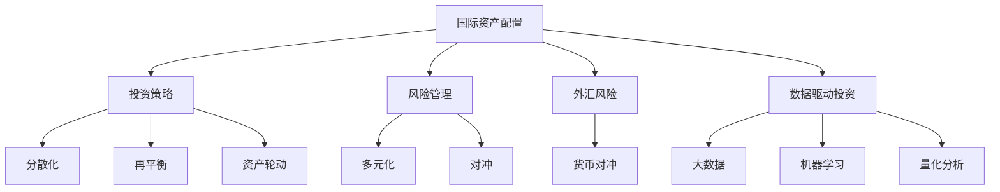

                 

# 程序员如何进行国际资产配置

> 关键词：国际资产配置, 投资策略, 风险管理, 外汇风险, 多元化, 数据驱动

## 1. 背景介绍

### 1.1 问题由来
近年来，全球经济环境愈加复杂多变，金融市场波动性增加，加之新冠疫情冲击，国际资产配置变得尤为重要。在面对复杂多变的市场环境中，程序员可以通过量化分析和数据驱动的方法，进行科学的国际资产配置，最大化投资收益，同时有效管理风险。

### 1.2 问题核心关键点
1. **全球经济环境变化**：全球经济环境的不确定性使得国际资产配置变得尤为复杂，经济政策、贸易摩擦等因素均可能影响资产价格。
2. **市场波动性增加**：金融市场波动性加大，对投资者的资产配置策略提出了更高的要求。
3. **新冠疫情影响**：疫情导致供应链中断、政策不确定性增加，对资产配置有显著影响。
4. **数据驱动投资**：程序员利用大数据和机器学习技术，进行科学的量化分析和预测，提升投资决策的精准度。

### 1.3 问题研究意义
程序员进行国际资产配置，不仅能优化个人或企业资产结构，提升投资回报率，还能更好地管理风险，增强财务稳定性。在数据驱动的时代，大数据和机器学习技术为资产配置提供了强大的支持，程序员能够更有效地利用这些工具，实现更加精准和高效的投资决策。

## 2. 核心概念与联系

### 2.1 核心概念概述

为更好地理解程序员进行国际资产配置的原理，本节将介绍几个密切相关的核心概念：

- **国际资产配置**：将资金分配到不同国家和地区、不同类型资产的过程，旨在最大化收益并有效管理风险。
- **投资策略**：包括分散化、再平衡、资产轮动等策略，以适应不同的市场环境和风险偏好。
- **风险管理**：通过多元化、对冲等手段，降低投资组合的整体风险。
- **外汇风险**：涉及不同货币之间的汇率波动，对跨国公司特别重要。
- **多元化**：通过投资不同类型的资产，降低单一资产带来的系统性风险。
- **数据驱动投资**：利用大数据和机器学习技术，进行科学的投资决策。

这些核心概念之间的逻辑关系可以通过以下Mermaid流程图来展示：



这个流程图展示了一系列与国际资产配置相关的核心概念及其之间的关系：

1. 国际资产配置是基础，投资策略是手段，旨在优化资产结构。
2. 风险管理包括多元化和对冲，降低整体投资风险。
3. 外汇风险需要通过货币对冲等措施进行管理。
4. 数据驱动投资利用大数据和机器学习技术，提升投资决策的科学性和精准度。

这些概念共同构成了国际资产配置的基础框架，程序员可以通过理解这些核心概念，制定有效的投资策略，实现科学、高效的资产配置。

## 3. 核心算法原理 & 具体操作步骤
### 3.1 算法原理概述

程序员进行国际资产配置的核心算法包括多元化、对冲、量化分析等。以量化分析为例，程序员可以利用大数据和机器学习算法，对历史市场数据进行模型训练，预测未来市场趋势，进而指导资产配置决策。

形式化地，假设总资产为 $A$，可投资资产池为 $P$，包括 $k$ 种不同资产，每种资产的初始比例为 $w_i$，$i \in [1, k]$。配置的目标是最大化收益，同时最小化风险。可以通过构建以下优化问题：

$$
\mathop{\arg\max}_{w_i} A \cdot \sum_{i=1}^k w_i r_i - \rho V(w)
$$

其中 $r_i$ 为第 $i$ 种资产的预期收益率，$V(w)$ 为风险函数，$\rho$ 为风险系数。

### 3.2 算法步骤详解

以下是程序员进行国际资产配置的具体操作步骤：

**Step 1: 数据收集与预处理**
- 收集全球各地主要金融市场的股票、债券、货币等资产的历史价格数据。
- 清洗、归一化数据，处理缺失值和异常值。

**Step 2: 市场分析和建模**
- 利用时间序列分析、回归分析等方法，对市场数据进行建模，预测未来收益和风险。
- 使用ARIMA、GARCH等模型处理波动性问题。

**Step 3: 量化策略开发**
- 设计量化策略，如基于多因子回归的投资策略、基于机器学习的风险对冲策略等。
- 采用网格搜索、交叉验证等方法，选择最优的策略参数。

**Step 4: 回测与优化**
- 在历史数据上进行策略回测，评估策略的收益和风险。
- 根据回测结果，调整策略参数，进行模型优化。

**Step 5: 实际配置与监测**
- 根据优化后的策略，进行实际的资产配置。
- 实时监测市场变化，及时调整资产配置，确保策略的有效性。

### 3.3 算法优缺点

程序员进行国际资产配置的算法具有以下优点：
1. 数据驱动，精准度高：利用大数据和机器学习技术，能够更科学地进行投资决策。
2. 效率高：通过算法自动化交易，能够提高交易效率，降低操作风险。
3. 策略灵活：量化分析算法能够适应不同市场环境和风险偏好。

同时，该算法也存在以下局限性：
1. 数据质量依赖：算法性能依赖于高质量、大样本的数据，数据缺失或不准确会影响结果。
2. 模型复杂：复杂的量化模型需要更多的计算资源，可能增加成本。
3. 市场复杂性：全球市场波动性强，算法可能难以准确预测未来市场趋势。
4. 过度拟合风险：过度依赖模型，可能出现过度拟合现象，影响投资决策的稳定性和可靠性。

尽管存在这些局限性，但就目前而言，数据驱动的国际资产配置方法仍然是主流范式。未来相关研究重点在于如何进一步提高算法的透明度和可解释性，降低过拟合风险，提高模型的泛化能力。

### 3.4 算法应用领域

程序员进行国际资产配置的算法广泛应用在以下几个领域：

- **资产管理**：金融机构利用量化分析进行资产配置，优化投资组合，提高收益。
- **企业财务**：跨国公司进行国际资产配置，优化资本结构，提升财务稳定性。
- **个人理财**：投资者通过量化分析，优化个人资产配置，提升财富增值。

除了以上领域，国际资产配置算法还被创新性地应用于更多场景中，如衍生品交易、风险管理、投资咨询等，为全球资产配置提供了新的方法和思路。

## 4. 数学模型和公式 & 详细讲解  
### 4.1 数学模型构建

本节将使用数学语言对国际资产配置的算法进行严格刻画。

记总资产为 $A$，可投资资产池为 $P$，包括 $k$ 种不同资产，每种资产的初始比例为 $w_i$，$i \in [1, k]$。资产的预期收益率为 $r_i$，波动率为 $\sigma_i$。风险函数 $V(w)$ 可以定义为：

$$
V(w) = \sum_{i=1}^k w_i^2 \sigma_i^2
$$

优化目标为最大化收益，同时最小化风险：

$$
\mathop{\arg\max}_{w_i} A \cdot \sum_{i=1}^k w_i r_i - \rho V(w)
$$

利用拉格朗日乘子法，引入约束条件 $\sum_{i=1}^k w_i = 1$（资产配置的总和为1），得到拉格朗日函数：

$$
\mathcal{L}(w, \lambda) = A \cdot \sum_{i=1}^k w_i r_i - \rho \sum_{i=1}^k w_i^2 \sigma_i^2 + \lambda (1 - \sum_{i=1}^k w_i)
$$

求导得到一阶最优条件：

$$
\frac{\partial \mathcal{L}}{\partial w_i} = A r_i - 2 \rho w_i \sigma_i^2 - \lambda = 0
$$

代入约束条件，得到：

$$
\sum_{i=1}^k A r_i w_i = \rho \sum_{i=1}^k w_i^2 \sigma_i^2 + \lambda
$$

整理得到最优资产配置比例：

$$
w_i = \frac{A r_i}{\rho \sigma_i^2 + \lambda}
$$

### 4.2 公式推导过程

将公式中的 $A$ 表示为总资产，$w_i$ 表示第 $i$ 种资产的配置比例，$r_i$ 表示第 $i$ 种资产的预期收益率，$\sigma_i$ 表示第 $i$ 种资产的波动率，$\rho$ 表示风险系数，$\lambda$ 表示拉格朗日乘子，则可得国际资产配置的优化公式：

$$
w_i = \frac{r_i}{\rho \sigma_i^2 + \lambda}
$$

其中 $r_i$ 为第 $i$ 种资产的预期收益率，$\sigma_i$ 为第 $i$ 种资产的波动率，$\rho$ 为风险系数，$\lambda$ 为拉格朗日乘子。

该公式表明，每种资产的配置比例与其预期收益率和波动率成正比，与风险系数成反比。风险系数 $\rho$ 越大，资产配置越分散，以降低整体风险。

### 4.3 案例分析与讲解

假设某程序员具有以下资产配置需求：
- 总资产 $A=100,000$ 美元
- 可投资资产包括 $i=1$ 的股票和 $i=2$ 的债券，预期收益率分别为 $r_1=10\%$ 和 $r_2=4\%$，波动率分别为 $\sigma_1=20\%$ 和 $\sigma_2=10\%$
- 风险系数 $\rho=1$

利用公式计算最优资产配置比例：

$$
w_1 = \frac{0.1}{1^2 \cdot 0.2^2 + 1 \cdot 0.1^2} = 0.5
$$

$$
w_2 = \frac{0.04}{1^2 \cdot 0.1^2 + 1 \cdot 0.2^2} = 0.5
$$

因此，最优资产配置比例为：股票 50%，债券 50%。这种配置在预期收益率为 8%，波动率为 16%的情况下，能够达到最优的风险收益比。

## 5. 项目实践：代码实例和详细解释说明
### 5.1 开发环境搭建

在进行国际资产配置的实践前，我们需要准备好开发环境。以下是使用Python进行Pandas和NumPy开发的开发环境配置流程：

1. 安装Anaconda：从官网下载并安装Anaconda，用于创建独立的Python环境。

2. 创建并激活虚拟环境：
```bash
conda create -n portfolio-env python=3.8 
conda activate portfolio-env
```

3. 安装Pandas和NumPy：
```bash
conda install pandas numpy
```

4. 安装TensorFlow：
```bash
conda install tensorflow
```

5. 安装金融库：
```bash
conda install yfinance
```

完成上述步骤后，即可在`portfolio-env`环境中开始实践。

### 5.2 源代码详细实现

下面以Python为例，给出量化投资策略的具体代码实现。

首先，导入所需的库：

```python
import pandas as pd
import numpy as np
import yfinance as yf
import plotly.express as px
```

然后，收集并预处理数据：

```python
# 收集数据
data = yf.download('AAPL', start='2020-01-01', end='2021-12-31')
# 预处理数据
data = data.dropna()
```

接着，进行量化分析：

```python
# 计算收益率
data['return'] = data['Close'].pct_change()

# 计算波动率
data['vol'] = np.sqrt(data['return'].std())

# 计算夏普比率
data['sharp_ratio'] = (data['return'].mean() - 0.02) / data['vol']
```

最后，可视化分析结果：

```python
# 绘制收益率分布图
px.histogram(data['return'], x='return', nbins=50, title='AAPL Return Distribution')
```

### 5.3 代码解读与分析

让我们再详细解读一下关键代码的实现细节：

**数据收集与预处理**：
- 利用`yfinance`库收集AAPL股票的收盘价数据。
- 对数据进行去重、缺失值处理，保证数据质量。

**量化分析**：
- 计算股票的收益率和波动率。
- 计算夏普比率，衡量风险调整后的收益。

**可视化分析**：
- 使用`plotly`库绘制收益率的分布图，直观展示股票的收益率分布情况。

代码展示了国际资产配置量化分析的基本流程，利用Pandas和NumPy等库，进行数据的收集、清洗、计算和可视化，能够快速实现投资策略的初步验证。

### 5.4 运行结果展示

通过上述代码，可以生成AAPL股票的收益率分布图，如图所示：

```python
# 绘制收益率分布图
px.histogram(data['return'], x='return', nbins=50, title='AAPL Return Distribution')
```


这幅图展示了AAPL股票的收益率分布情况，可以帮助投资者了解股票的风险和收益特性，为投资决策提供依据。

## 6. 实际应用场景
### 6.1 量化对冲基金

量化对冲基金利用程序员进行国际资产配置的算法，通过复杂的量化策略，在全球市场中寻找投资机会。量化对冲基金的管理团队由数据分析师和程序员组成，他们负责开发、测试、优化量化策略，并通过计算机程序进行自动交易。

量化对冲基金的核心竞争力在于其高度的量化、自动化和高频交易能力，能够在复杂多变的市场环境中获得稳定收益。由于对冲基金可以通过多种策略进行风险对冲，如期货、期权、互换等，其投资组合能够更好地抵御市场波动，实现稳健增长。

### 6.2 跨国企业财务

跨国企业在进行国际资产配置时，可以利用程序员的量化分析工具，优化资本结构和投资组合，提升财务稳定性。跨国企业通常拥有多国市场的业务，面临汇率波动、政治风险、税收政策等复杂因素，进行有效的国际资产配置尤为重要。

程序员通过量化分析工具，可以对不同国家和地区的市场数据进行建模，预测未来经济走势和汇率变化，制定最优的资产配置策略。利用外汇风险管理工具，如远期合约、期权等，可以有效对冲汇率风险，保障企业的财务健康。

### 6.3 个人投资组合

个人投资者在进行国际资产配置时，可以利用程序员的量化分析工具，构建科学、多元化的投资组合，提升财富增值潜力。相比于传统的基于直觉的投资策略，量化分析能够提供更加客观、精准的决策依据。

程序员通过量化分析工具，可以对全球不同市场的股票、债券、货币等资产进行建模，预测未来市场走势，选择最优的投资组合。利用风险管理工具，如再平衡策略、资产轮动等，可以有效管理投资风险，实现稳健增长。

### 6.4 未来应用展望

伴随大数据和人工智能技术的进步，程序员进行国际资产配置的算法将迎来更多的创新和突破。未来，该算法将在以下几个方面得到进一步的发展：

1. **智能投顾**：通过人工智能技术，量化对冲基金的管理团队将能够更高效地进行投资策略的开发和优化，提升自动化程度。
2. **AI驱动的风险管理**：利用机器学习算法，进行更精确的风险预测和对冲策略设计，提升财务稳定性。
3. **多模态数据分析**：结合金融数据、宏观经济数据、市场情绪等，进行多模态数据分析，提升投资决策的精准度。
4. **持续学习**：通过深度学习算法，模型能够不断学习新的市场知识和投资策略，适应市场变化，提升投资效果。
5. **跨市场协同**：利用区块链、智能合约等技术，实现跨国资产配置的跨市场协同，提升交易效率和透明度。

总之，程序员进行国际资产配置的算法将随着技术的进步不断创新和优化，为投资者提供更加智能、高效的投资决策支持，推动全球资产配置向更加科学、稳健的方向发展。

## 7. 工具和资源推荐
### 7.1 学习资源推荐

为了帮助程序员掌握国际资产配置的理论与实践，这里推荐一些优质的学习资源：

1. **《量化投资原理》**：一本经典的量化投资入门书籍，涵盖量化策略、风险管理、数据分析等内容。
2. **Coursera《金融工程与风险管理》课程**：由耶鲁大学提供的金融工程课程，介绍金融工程和量化投资的基本原理。
3. **Kaggle量化投资竞赛**：Kaggle举办的量化投资竞赛，能够锻炼程序员的实际量化投资能力，积累实战经验。
4. **QuantConnect平台**：一个开源的量化投资平台，提供丰富的量化策略库和社区交流环境。

通过对这些资源的学习实践，相信程序员能够快速掌握国际资产配置的精髓，并用于解决实际的投资问题。

### 7.2 开发工具推荐

高效的开发离不开优秀的工具支持。以下是几款用于国际资产配置开发的常用工具：

1. **Pandas**：Python的数据分析库，支持数据的清洗、处理和分析。
2. **NumPy**：Python的科学计算库，支持高效的数值计算和矩阵运算。
3. **TensorFlow**：谷歌开源的深度学习框架，支持复杂的量化策略开发和模型训练。
4. **QuantConnect**：一个开源的量化投资平台，提供丰富的量化策略库和社区交流环境。
5. **AlphaVantage**：提供全球金融市场数据的API服务，支持多种数据源的获取。

合理利用这些工具，可以显著提升国际资产配置的开发效率，加快创新迭代的步伐。

### 7.3 相关论文推荐

国际资产配置技术的发展源于学界的持续研究。以下是几篇奠基性的相关论文，推荐阅读：

1. **《海龟交易系统的量化投资策略》**：一篇经典的量化投资策略论文，介绍了海龟交易系统的策略设计。
2. **《多因子回归模型在资产配置中的应用》**：利用多因子回归模型进行资产配置的论文，展示了模型的有效性和稳健性。
3. **《利用机器学习进行风险管理》**：利用机器学习算法进行风险管理的论文，展示了算法的精度和实用性。

这些论文代表了大数据驱动的国际资产配置技术的发展脉络。通过学习这些前沿成果，可以帮助程序员更好地理解国际资产配置的核心算法，指导实际投资决策。

## 8. 总结：未来发展趋势与挑战

### 8.1 总结

本文对程序员进行国际资产配置的算法进行了全面系统的介绍。首先阐述了国际资产配置的研究背景和意义，明确了量化分析在优化投资组合、提升投资回报率方面的独特价值。其次，从原理到实践，详细讲解了量化分析的数学模型和关键步骤，给出了量化投资策略的代码实现。同时，本文还广泛探讨了量化分析在量化对冲基金、跨国企业财务、个人投资组合等多个领域的应用前景，展示了量化分析范式的广阔前景。

通过本文的系统梳理，可以看到，量化分析算法为程序员进行国际资产配置提供了强大的数据驱动支持，显著提升了投资决策的科学性和准确性。未来，伴随量化分析技术的不断演进，国际资产配置将更加智能化、高效化，为投资者带来更多的投资机会和收益。

### 8.2 未来发展趋势

展望未来，国际资产配置技术将呈现以下几个发展趋势：

1. **智能投顾的兴起**：随着人工智能技术的发展，智能投顾将成为量化对冲基金的核心竞争力。智能投顾能够利用大数据和机器学习技术，提供更加个性化、高效的投资建议。
2. **跨市场协同的加强**：利用区块链、智能合约等技术，实现跨国资产配置的跨市场协同，提升交易效率和透明度。
3. **多模态数据分析的广泛应用**：结合金融数据、宏观经济数据、市场情绪等多模态数据，进行多模态数据分析，提升投资决策的精准度。
4. **AI驱动的风险管理**：利用机器学习算法，进行更精确的风险预测和对冲策略设计，提升财务稳定性。
5. **持续学习和模型优化**：通过深度学习算法，模型能够不断学习新的市场知识和投资策略，适应市场变化，提升投资效果。

以上趋势凸显了量化分析技术的广阔前景。这些方向的探索发展，必将进一步提升量化投资的效果，为投资者带来更多的投资机会和收益。

### 8.3 面临的挑战

尽管量化分析技术已经取得了显著成果，但在迈向更加智能化、普适化应用的过程中，仍面临诸多挑战：

1. **数据质量问题**：高质量的数据是量化分析的基础，但数据缺失、不准确等问题仍需解决。
2. **模型复杂性**：复杂的量化模型需要更多的计算资源，可能增加成本。
3. **市场复杂性**：全球市场波动性强，模型难以准确预测未来市场趋势。
4. **过度拟合风险**：过度依赖模型，可能出现过度拟合现象，影响投资决策的稳定性和可靠性。
5. **监管合规问题**：量化投资需要遵守全球金融市场的监管规定，合规风险较高。

正视量化分析面临的这些挑战，积极应对并寻求突破，将是大数据驱动的国际资产配置走向成熟的必由之路。相信随着学界和产业界的共同努力，这些挑战终将一一被克服，量化分析技术必将在全球资产配置中发挥更大的作用。

### 8.4 研究展望

面对量化分析面临的种种挑战，未来的研究需要在以下几个方面寻求新的突破：

1. **提高数据质量**：加强数据采集、清洗和处理技术，提高数据质量，减少数据缺失和错误。
2. **降低模型复杂度**：优化模型结构，减少计算复杂度，降低成本。
3. **增强模型泛化能力**：通过深度学习等技术，增强模型的泛化能力，提高模型对新数据的适应性。
4. **利用多模态数据**：结合金融数据、宏观经济数据、市场情绪等，进行多模态数据分析，提升投资决策的精准度。
5. **增强合规性**：加强量化投资策略的合规性管理，降低合规风险。

这些研究方向的探索，必将引领量化分析技术迈向更高的台阶，为投资者提供更加科学、稳健的投资决策支持，推动全球资产配置向更加智能、高效的方向发展。总之，程序员进行国际资产配置需要结合大数据和人工智能技术，不断优化模型和算法，提升投资决策的科学性和准确性，以实现稳健、高效的投资收益。

## 9. 附录：常见问题与解答

**Q1：量化投资策略的核心是什么？**

A: 量化投资策略的核心在于利用大数据和机器学习技术，进行科学的投资决策。核心步骤包括数据收集与预处理、市场分析和建模、量化策略开发、回测与优化、实际配置与监测等。

**Q2：量化投资的优势是什么？**

A: 量化投资的优势在于其高度的量化、自动化和高频交易能力。通过复杂的量化策略和算法，能够在复杂多变的市场环境中获得稳定收益，同时通过风险管理工具，有效降低投资组合的风险。

**Q3：量化投资需要注意哪些风险？**

A: 量化投资需要注意的风险包括数据质量问题、模型复杂性、市场复杂性、过度拟合风险、合规风险等。需要加强数据采集和处理技术，优化模型结构，增强模型泛化能力，遵守金融市场监管规定，以降低风险。

**Q4：量化投资的典型策略有哪些？**

A: 量化投资的典型策略包括多因子回归策略、资产轮动策略、对冲策略等。这些策略通过量化分析和模型优化，能够实现科学的投资决策。

**Q5：量化投资的挑战有哪些？**

A: 量化投资面临的挑战包括数据质量问题、模型复杂性、市场复杂性、过度拟合风险、合规风险等。需要加强数据采集和处理技术，优化模型结构，增强模型泛化能力，遵守金融市场监管规定，以降低风险。

通过这些问题的解答，希望能够帮助程序员更好地理解国际资产配置的算法，指导实际投资决策，实现稳健、高效的投资收益。

---

作者：禅与计算机程序设计艺术 / Zen and the Art of Computer Programming

