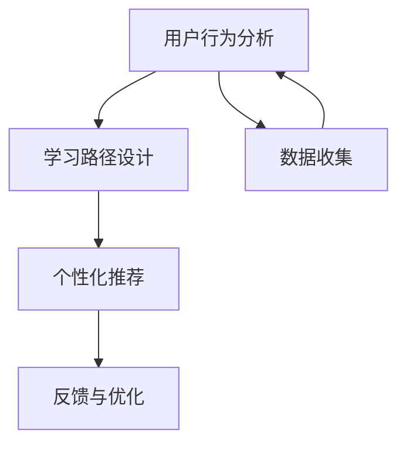

                 

# 程序员如何进行知识付费的用户细分

> 关键词：知识付费,用户细分,程序员,用户行为,学习路径,个人发展,需求分析,技术栈,培训方案

## 1. 背景介绍

### 1.1 问题由来
在互联网飞速发展的今天，知识付费逐渐成为一种趋势，特别是对于程序员这一专业群体而言。程序员在不断更新知识和技能的压力下，往往需要寻找新的学习途径。知识付费平台，如极客时间、CSDN学院等，成为程序员获取知识和提升技能的重要渠道。然而，对于这些平台而言，如何精准把握程序员的学习需求，制定有效的课程内容和培训方案，提升用户黏性和满意度，是一个亟待解决的问题。

### 1.2 问题核心关键点
问题关键点主要在于如何对知识付费用户进行有效的细分，并根据不同细分结果制定差异化的课程方案，提升整体用户体验和学习效果。

1. **用户行为分析**：通过分析用户在平台上的行为数据，识别出不同用户的需求和偏好。
2. **学习路径设计**：根据用户细分结果，设计适合不同用户的学习路径，优化学习效果。
3. **个性化推荐**：结合用户行为和历史学习数据，进行个性化课程推荐，提升用户黏性。
4. **反馈与优化**：收集用户反馈，及时调整课程内容和策略，提升用户满意度。

### 1.3 问题研究意义
对程序员进行知识付费的用户细分，对于提升平台的用户体验和课程效果具有重要意义：

1. **提高课程匹配度**：根据用户细分，设计针对性的课程内容，满足用户个性化需求。
2. **增强用户黏性**：通过个性化推荐和优化学习路径，提升用户满意度和平台粘性。
3. **提升学习效果**：优化课程内容和推荐策略，提高用户学习效率和效果。
4. **增加收入来源**：通过精准的用户细分，提升课程的订阅量和转化率，增加平台的收入。

## 2. 核心概念与联系

### 2.1 核心概念概述

为了更好地理解如何进行知识付费的用户细分，本节将介绍几个关键概念：

- **知识付费**：指用户为获取知识和技能而支付费用的行为，如购买在线课程、订阅技术博客等。
- **用户细分**：根据用户的行为、特征、需求等，将用户划分为不同的群体，以便于进行个性化管理和推荐。
- **学习路径设计**：根据用户的职业阶段、技术栈等特征，设计适合用户的学习路径，指导其系统学习。
- **个性化推荐**：通过分析用户行为和需求，推荐最适合用户的课程和学习资源。
- **反馈与优化**：收集用户反馈，对课程内容和推荐策略进行迭代优化。

这些核心概念之间的逻辑关系可以通过以下Mermaid流程图来展示：



这个流程图展示了知识付费用户细分的基本流程：

1. 通过用户行为分析，识别出不同用户的需求和偏好。
2. 根据用户细分结果，设计适合用户的学习路径。
3. 结合用户行为和历史学习数据，进行个性化课程推荐。
4. 收集用户反馈，及时调整课程内容和策略。

## 3. 核心算法原理 & 具体操作步骤

### 3.1 算法原理概述

知识付费用户细分的核心算法原理，基于用户行为数据的分析与聚类。主要步骤如下：

1. **数据收集**：收集用户在知识付费平台上的行为数据，包括浏览记录、购买记录、评分反馈等。
2. **特征提取**：提取用户行为的关键特征，如学习时间、付费课程数量、课程评分等。
3. **聚类分析**：使用聚类算法将用户分为不同的群体，每个群体代表一种典型的用户需求和偏好。
4. **学习路径设计**：根据聚类结果，设计适合每个群体的学习路径。
5. **个性化推荐**：结合用户行为和历史数据，进行个性化课程推荐。
6. **反馈与优化**：收集用户反馈，迭代优化课程内容和推荐策略。

### 3.2 算法步骤详解

**Step 1: 数据收集**

首先，需要从知识付费平台收集用户的行为数据。这些数据可能包括：

- 用户浏览课程的记录
- 用户购买课程的记录
- 用户对课程的评分和反馈
- 用户的注册信息、活跃时间等

这些数据通常存储在平台的数据库中，可以通过API接口获取。

**Step 2: 特征提取**

从收集到的行为数据中提取关键特征，用于后续的聚类分析。例如，可以提取以下特征：

- 用户浏览课程的平均时长
- 用户购买的课程数量
- 用户对课程的平均评分
- 用户的活跃时间（例如每天的平均使用时长）

**Step 3: 聚类分析**

使用聚类算法对用户进行分组。常用的聚类算法包括K-means、层次聚类、DBSCAN等。以K-means为例，具体步骤为：

1. 随机选择K个中心点，作为初始聚类中心。
2. 计算每个数据点到聚类中心的距离，将数据点分配到距离最近的聚类中。
3. 重新计算每个聚类的中心点。
4. 重复步骤2和3，直到聚类中心不再变化。

**Step 4: 学习路径设计**

根据聚类结果，设计适合每个用户群体的学习路径。学习路径包括：

- 推荐的课程顺序
- 推荐的课程难度级别
- 推荐的课程类型（如基础课程、进阶课程、项目实践等）

**Step 5: 个性化推荐**

使用协同过滤、内容推荐等算法，结合用户行为和历史数据，进行个性化课程推荐。

**Step 6: 反馈与优化**

通过收集用户的反馈和评分，对课程内容和推荐策略进行迭代优化。可以采用的反馈方式包括：

- 课程评分和评价
- 用户对推荐课程的反馈
- 用户在平台上的活跃度和流失率

### 3.3 算法优缺点

知识付费用户细分的优点包括：

1. **提高课程匹配度**：根据用户细分，设计针对性的课程内容，满足用户个性化需求。
2. **增强用户黏性**：通过个性化推荐和优化学习路径，提升用户满意度和平台粘性。
3. **提升学习效果**：优化课程内容和推荐策略，提高用户学习效率和效果。
4. **增加收入来源**：通过精准的用户细分，提升课程的订阅量和转化率，增加平台的收入。

缺点包括：

1. **数据隐私问题**：收集和分析用户行为数据可能涉及隐私问题，需要遵守相关法律法规。
2. **算法复杂度**：聚类分析和个性化推荐算法可能较为复杂，需要较高的计算资源。
3. **用户多样性**：用户行为和需求可能存在较大差异，聚类结果可能不够准确。
4. **动态变化**：用户需求和行为可能随时间变化，需要不断更新聚类模型和推荐策略。

### 3.4 算法应用领域

知识付费用户细分技术可以应用于多个领域，包括：

- **在线教育平台**：如极客时间、CSDN学院等，通过用户细分提升课程效果和用户满意度。
- **技术博客和社区**：如CSDN、知乎等，通过用户细分推荐优质文章和资源。
- **技术培训公司**：如阿里云大学、腾讯学院等，通过用户细分设计培训课程，提升培训效果。
- **企业内部培训**：通过用户细分，为企业员工设计个性化的培训路径，提升整体技能水平。

## 4. 数学模型和公式 & 详细讲解 & 举例说明

### 4.1 数学模型构建

知识付费用户细分的数学模型主要基于聚类算法和协同过滤算法。以下以K-means聚类算法为例，构建用户细分的数学模型。

假设用户集合为 $U=\{u_1, u_2, ..., u_n\}$，每个用户 $u_i$ 对应的特征向量为 $\mathbf{x}_i=(x_{i1}, x_{i2}, ..., x_{im})$，其中 $x_{ij}$ 表示用户 $u_i$ 在特征 $j$ 上的值。

聚类算法的目标是将用户分为K个不同的群体，使得每个群体内的用户特征尽可能相似，而不同群体之间的用户特征尽可能不同。

### 4.2 公式推导过程

K-means聚类的目标函数为：

$$
\min_{K, C} \sum_{k=1}^{K} \sum_{x \in C_k} ||\mathbf{x}_i - \mathbf{\mu}_k||^2
$$

其中 $C_k$ 表示第 $k$ 个聚类群体的用户集合，$\mathbf{\mu}_k$ 表示第 $k$ 个群体的聚类中心。

根据目标函数，K-means算法的具体步骤如下：

1. 随机选择K个聚类中心 $\mathbf{\mu}_k$。
2. 将每个用户分配到距离最近的聚类中。
3. 重新计算每个聚类的中心点 $\mathbf{\mu}_k$。
4. 重复步骤2和3，直到聚类中心不再变化。

### 4.3 案例分析与讲解

假设某知识付费平台收集了1000名用户的浏览和购买数据，提取了4个关键特征：

- 用户浏览课程的平均时长
- 用户购买的课程数量
- 用户对课程的平均评分
- 用户的活跃时间

使用K-means算法对这些用户进行聚类，得到K=5个不同的用户群体。每个群体的特征向量如下：

| 用户群体 | 平均浏览时长 | 购买课程数量 | 平均评分 | 活跃时间 |
| --- | --- | --- | --- | --- |
| 群体1 | 2.5小时 | 3门 | 4.0 | 每天2小时 |
| 群体2 | 1小时 | 1门 | 3.5 | 每天1小时 |
| 群体3 | 4小时 | 5门 | 4.2 | 每周4小时 |
| 群体4 | 1.5小时 | 2门 | 3.8 | 每天1.5小时 |
| 群体5 | 3小时 | 4门 | 4.1 | 每周3小时 |

根据这些特征向量，可以为每个用户群体设计适合的学习路径和个性化推荐方案，例如：

- 群体1用户偏好基础课程，可以推荐入门级课程和项目实战课程。
- 群体2用户对课程评分较高，但购买量较少，可以推荐更多免费试听课程。
- 群体3用户学习时间较充裕，可以推荐进阶课程和专家讲座。

## 5. 项目实践：代码实例和详细解释说明

### 5.1 开发环境搭建

在进行知识付费用户细分实践前，我们需要准备好开发环境。以下是使用Python进行K-means聚类分析的环境配置流程：

1. 安装Anaconda：从官网下载并安装Anaconda，用于创建独立的Python环境。

2. 创建并激活虚拟环境：
```bash
conda create -n py-env python=3.8 
conda activate py-env
```

3. 安装必要的Python库：
```bash
pip install numpy scipy scikit-learn pandas matplotlib
```

4. 安装TensorBoard：用于可视化聚类结果和推荐模型。

5. 配置Jupyter Notebook：安装相关扩展，方便使用。

完成上述步骤后，即可在`py-env`环境中开始实践。

### 5.2 源代码详细实现

以下是一个使用Scikit-Learn库进行K-means聚类分析的Python代码实现：

```python
from sklearn.cluster import KMeans
from sklearn.preprocessing import StandardScaler
import pandas as pd

# 加载数据
data = pd.read_csv('user_data.csv')

# 特征提取
features = data[['avg_time', 'num_courses', 'avg_rating', 'active_time']]

# 数据标准化
scaler = StandardScaler()
features_scaled = scaler.fit_transform(features)

# 聚类分析
kmeans = KMeans(n_clusters=5)
kmeans.fit(features_scaled)

# 输出聚类结果
labels = kmeans.labels_
print(labels)
```

### 5.3 代码解读与分析

代码中，首先使用`pandas`库加载用户数据，提取关键特征。然后使用`StandardScaler`对特征进行标准化，使得每个特征的均值为0，方差为1。接着使用`KMeans`对标准化后的数据进行聚类，得到5个不同的用户群体。最后输出聚类结果，即每个用户对应的聚类标签。

## 6. 实际应用场景

### 6.1 在线教育平台

知识付费用户细分技术在在线教育平台上有广泛应用。例如，某在线教育平台可以收集用户的浏览和购买数据，通过聚类分析，将用户分为不同的学习群体，并为每个群体设计适合的学习路径和个性化推荐方案。

以某在线编程课程平台为例，该平台可以收集用户浏览课程的平均时长、购买的课程数量、对课程的平均评分等数据，通过聚类分析，将用户分为基础用户、进阶用户、专家用户等不同群体。然后，针对不同群体，设计相应的课程推荐路径，提升用户体验和学习效果。

### 6.2 技术博客和社区

技术博客和社区同样可以利用知识付费用户细分技术，提升用户黏性和平台影响力。例如，某技术博客平台可以收集用户的浏览记录、评论内容等数据，通过聚类分析，将用户分为技术新手、中级开发者、技术专家等群体，然后针对不同群体，推荐相应的技术文章和资源。

以某技术博客平台为例，该平台可以收集用户对文章的浏览次数、评论内容、点赞数量等数据，通过聚类分析，将用户分为技术新手、中级开发者、技术专家等群体。然后，针对不同群体，推荐相应的技术文章和资源，提升用户满意度和平台影响力。

### 6.3 企业内部培训

企业内部培训同样可以利用知识付费用户细分技术，设计适合不同岗位和技术栈的培训方案，提升整体技能水平。例如，某企业可以收集员工的培训记录、工作年限、岗位等数据，通过聚类分析，将员工分为新员工、中级员工、高级员工等不同群体，然后针对不同群体，设计相应的培训课程和学习路径。

以某IT公司为例，该公司可以收集员工的培训记录、工作年限、岗位等数据，通过聚类分析，将员工分为新员工、中级员工、高级员工等不同群体。然后，针对不同群体，设计相应的培训课程和学习路径，提升整体技能水平。

### 6.4 未来应用展望

随着知识付费用户细分技术的不断发展，未来的应用场景将更加丰富。例如，在智慧城市、智能家居、智能医疗等领域，知识付费用户细分技术可以用于用户行为分析、个性化推荐、决策支持等，提升系统的智能化水平和用户体验。

## 7. 工具和资源推荐

### 7.1 学习资源推荐

为了帮助开发者系统掌握知识付费用户细分的理论基础和实践技巧，这里推荐一些优质的学习资源：

1. 《Python机器学习》书籍：介绍机器学习算法和Python编程实践，包括聚类算法和协同过滤算法等。
2. 《数据科学导论》课程：由Coursera提供，涵盖数据收集、清洗、分析、可视化等多个方面，适合初学者入门。
3. 《数据科学实战》博客：作者通过实际项目案例，详细讲解了数据处理、特征工程、模型训练等技术。
4. Kaggle竞赛：Kaggle平台提供了大量的数据集和比赛，适合通过实践提升技能。
5. 《知识付费数据分析》在线课程：由某在线教育平台提供，详细介绍知识付费用户细分的理论和方法。

通过对这些资源的学习实践，相信你一定能够快速掌握知识付费用户细分的精髓，并用于解决实际的NLP问题。

### 7.2 开发工具推荐

高效的开发离不开优秀的工具支持。以下是几款用于知识付费用户细分开发的常用工具：

1. Python：Python语言简洁高效，是数据科学和机器学习的主流语言。
2. Scikit-Learn：Python的机器学习库，提供丰富的聚类算法和协同过滤算法。
3. Pandas：Python的数据分析库，方便数据处理和特征提取。
4. TensorBoard：用于可视化聚类结果和推荐模型，方便调试和优化。
5. Jupyter Notebook：支持Python编程和数据可视化，方便进行交互式数据分析。

合理利用这些工具，可以显著提升知识付费用户细分的开发效率，加快创新迭代的步伐。

### 7.3 相关论文推荐

知识付费用户细分技术的发展源于学界的持续研究。以下是几篇奠基性的相关论文，推荐阅读：

1. K-means聚类算法：经典聚类算法，广泛应用于数据分析和机器学习领域。
2. 协同过滤算法：推荐系统的主要算法之一，通过用户行为数据进行个性化推荐。
3. 用户行为分析：介绍如何通过数据挖掘和机器学习技术，分析用户行为和需求。
4. 个性化推荐系统：详细介绍推荐算法和技术，提升用户满意度和平台粘性。
5. 知识图谱在推荐中的应用：通过知识图谱提高推荐系统的准确性和可解释性。

这些论文代表了大数据和机器学习领域的最新进展，通过学习这些前沿成果，可以帮助研究者把握学科前进方向，激发更多的创新灵感。

## 8. 总结：未来发展趋势与挑战

### 8.1 总结

本文对知识付费用户细分的核心算法和操作步骤进行了全面系统的介绍。首先阐述了知识付费用户细分的研究背景和意义，明确了用户细分的核心步骤和关键技术。然后，通过代码实例详细讲解了K-means聚类算法的实现过程，并结合实际应用场景，展示了知识付费用户细分的应用效果。

通过本文的系统梳理，可以看到，知识付费用户细分技术在提升用户体验和课程效果方面具有重要价值。未来，伴随算法和数据技术的不断进步，知识付费用户细分将为在线教育、技术博客、企业培训等多个领域带来新的突破，推动人工智能技术的广泛应用。

### 8.2 未来发展趋势

展望未来，知识付费用户细分技术将呈现以下几个发展趋势：

1. **数据的多样化和实时性**：用户行为数据将更加多样化和实时性，包括社交媒体数据、语音和视频数据等，这将为聚类和推荐算法提供更丰富的输入。
2. **算法的复杂性和可解释性**：未来将涌现更多复杂的聚类和推荐算法，如深度学习、强化学习等，同时提高算法的可解释性，增强用户信任。
3. **跨领域的融合**：知识付费用户细分技术将与其他领域的技术进行更深入的融合，如自然语言处理、计算机视觉等，形成更加全面、智能的推荐系统。
4. **用户隐私的保护**：随着用户数据隐私的重视，未来的聚类和推荐算法将更加注重隐私保护，采用差分隐私、联邦学习等技术。

这些趋势凸显了知识付费用户细分技术的广阔前景，未来将会在更多领域带来变革性影响。

### 8.3 面临的挑战

尽管知识付费用户细分技术已经取得了显著成果，但在迈向更加智能化、普适化应用的过程中，仍面临以下挑战：

1. **数据隐私和伦理问题**：用户数据隐私和伦理问题始终是一个重大挑战，如何在保障用户隐私的前提下进行数据分析和推荐，需要更多的技术支持和政策监管。
2. **算法复杂度和计算资源**：随着算法的复杂性增加，计算资源的需求也随之增加，如何提高算法的效率和可扩展性，是一个重要研究方向。
3. **用户多样性和动态变化**：用户需求和行为可能随时间变化，如何动态调整聚类和推荐策略，提高算法的稳定性和适应性，是一个重要研究方向。
4. **模型的可解释性和透明性**：当前许多推荐算法是"黑盒"系统，难以解释其内部决策逻辑。如何提高模型的可解释性和透明性，是一个重要研究方向。

### 8.4 研究展望

面对知识付费用户细分技术所面临的挑战，未来的研究需要在以下几个方面寻求新的突破：

1. **隐私保护技术**：开发更加安全的隐私保护算法，如差分隐私、联邦学习等，保护用户隐私。
2. **高效算法设计**：设计更加高效的聚类和推荐算法，如深度学习、强化学习等，提高算法的效率和可扩展性。
3. **动态调整策略**：研究动态调整聚类和推荐策略的方法，提高算法的稳定性和适应性。
4. **模型可解释性**：开发可解释性更强的推荐模型，提高模型的透明性和可理解性。

这些研究方向将引领知识付费用户细分技术迈向更高的台阶，为构建安全、可靠、可解释、可控的智能系统铺平道路。面向未来，知识付费用户细分技术还需要与其他人工智能技术进行更深入的融合，如自然语言处理、计算机视觉等，多路径协同发力，共同推动人工智能技术的进步。

## 9. 附录：常见问题与解答

**Q1：如何评估聚类结果的质量？**

A: 聚类结果的质量可以通过以下几个指标进行评估：

1. **簇内距离（Intra-cluster Distance）**：衡量同一簇内的数据点之间的相似度，数值越小表示簇内越紧密。
2. **簇间距离（Inter-cluster Distance）**：衡量不同簇之间的距离，数值越大表示簇间越分离。
3. **轮廓系数（Silhouette Coefficient）**：综合衡量簇内紧密度和簇间分离度，数值越接近1表示聚类效果越好。
4. **Calinski-Harabasz指数**：衡量簇内紧密度和簇间分离度的比值，数值越大表示聚类效果越好。

这些指标通常通过可视化工具和统计分析方法进行评估。

**Q2：如何设计适合用户的学习路径？**

A: 设计适合用户的学习路径需要综合考虑以下几个因素：

1. **用户需求和偏好**：通过聚类分析，了解用户的学习需求和偏好，设计个性化学习路径。
2. **用户的学习背景和基础**：根据用户的背景和基础，设计适合其水平的学习路径，避免重复学习和过度挑战。
3. **学习目标和方向**：结合用户的学习目标，设计有助于其达成目标的学习路径，如通过基础课程提升编程技能，通过高级课程提升技术深度等。

设计学习路径时，需要与用户进行互动，收集反馈，不断优化路径内容。

**Q3：如何收集用户反馈并进行迭代优化？**

A: 收集用户反馈并进行迭代优化需要以下几个步骤：

1. **设计反馈渠道**：通过调查问卷、在线评论、用户访谈等方式，收集用户反馈。
2. **分析反馈数据**：对收集到的反馈数据进行分析和整理，找出用户的主要需求和痛点。
3. **调整推荐策略**：根据反馈数据，调整推荐算法和策略，提高推荐效果和用户满意度。
4. **进行A/B测试**：设计不同推荐策略并进行A/B测试，评估效果并决定采用哪种策略。
5. **持续优化**：通过持续收集反馈和A/B测试结果，不断优化推荐策略，提升用户体验和学习效果。

这些步骤可以通过数据科学和机器学习技术进行实现。

---

作者：禅与计算机程序设计艺术 / Zen and the Art of Computer Programming

