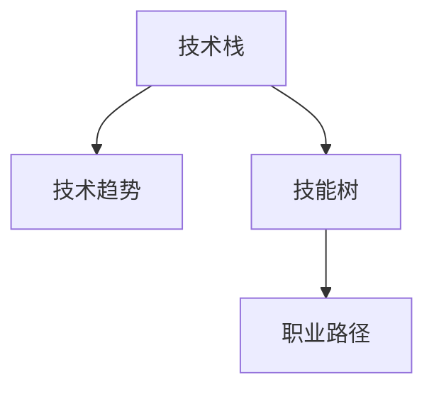

                 

# 程序员如何进行职业规划

## 1. 背景介绍

### 1.1 问题由来

在数字化时代，编程技能已经成为现代社会的基础能力之一。然而，随着科技的迅猛发展，编程领域的技术更新迭代速度日益加快，职业生涯规划变得尤为重要。对于广大程序员而言，如何在技术不断进步的背景下，保持自身技能的前沿性和职业发展的持续性，是一个值得深思的问题。

### 1.2 问题核心关键点

程序员职业规划的核心在于：了解自身兴趣和能力，明确技术发展的趋势和机遇，制定科学合理的学习路径和职业发展策略。主要关注点包括：

- **技术发展趋势**：关注新兴技术和热门领域，如人工智能、大数据、云计算、区块链等。
- **技能升级路线**：明确不同技术栈之间的学习路线和关联性。
- **职业发展路径**：从初级开发者到高级工程师、技术主管、架构师等不同层级的职业晋升路径。
- **个人兴趣和能力**：结合自身兴趣和能力，制定最适合自己的发展策略。
- **行业动态**：了解行业动向，把握市场机会。

## 2. 核心概念与联系

### 2.1 核心概念概述

- **技术栈（Technology Stack）**：指编程所需的各种工具、框架、库和语言的集合。包括前端技术栈、后端技术栈、移动端技术栈、大数据技术栈等。
- **技术趋势（Technology Trends）**：指新兴技术的出现和发展，包括人工智能、区块链、云计算、物联网等。
- **技能树（Skill Tree）**：形象化地表示程序员需要掌握的技能和技术的结构，包括基础知识、编程语言、框架、算法等。
- **职业发展路径（Career Path）**：指程序员从入门到高级的成长路径，包括初级开发者、中级工程师、高级工程师、技术主管、架构师等不同层次。

为更好地理解程序员职业规划，本节将介绍几个密切相关的核心概念：

- **技术栈的构建**：如何选择和组合不同的技术栈，构建高效且稳定的技术体系。
- **技术趋势的跟踪**：如何持续关注和掌握新兴技术的发展动态，保持技术的前沿性。
- **技能树的布局**：如何制定合理的学习计划，构建个人技能树，实现技能的全方位提升。
- **职业路径的规划**：如何根据自己的兴趣和能力，选择合适的职业发展路径，实现职业目标。

这些核心概念之间的逻辑关系可以通过以下Mermaid流程图来展示：



这个流程图展示了个体在职业规划中的技术、技能和职业三个核心要素之间的相互联系和相互作用。

## 3. 核心算法原理 & 具体操作步骤
### 3.1 算法原理概述

程序员职业规划的本质是个人技能和职业发展的匹配优化问题。其核心算法原理包括：

- **技术栈评估**：对已掌握的技术栈进行评估，分析其优劣势和适用场景。
- **技能树构建**：根据当前技术栈和职业目标，构建个人技能树，规划学习路径。
- **职业路径规划**：结合个人兴趣、能力和职业目标，规划职业发展路径，设定短期和长期目标。
- **持续学习和实践**：通过持续学习和实践，不断提升自己的技能水平和职业竞争力。

### 3.2 算法步骤详解

基于上述算法原理，程序员职业规划的具体步骤如下：

1. **自我评估**：
   - **技能盘点**：列出当前已掌握的技术栈和技能，包括编程语言、框架、工具等。
   - **兴趣分析**：分析个人兴趣所在的技术领域，如前端、后端、数据科学、人工智能等。
   - **职业定位**：明确职业目标，如初级开发者、技术主管、架构师等。

2. **技术趋势跟踪**：
   - **市场调研**：通过阅读技术博客、参加技术会议、关注行业报告等方式，了解最新的技术趋势。
   - **技术栈更新**：根据技术趋势，调整或新增相关技术栈，如学习Python、Go等新兴语言。
   - **学习路线设计**：制定学习计划，逐步掌握新技术栈，构建技能树。

3. **技能树构建**：
   - **基础知识补齐**：补齐基础知识的短板，如数据结构、算法、设计模式等。
   - **技术栈深化**：深入掌握现有技术栈的关键技术，如深入学习Web开发框架、数据库设计等。
   - **跨技术栈融合**：掌握跨技术栈的知识，如前端和后端技术、云计算和数据库技术等。

4. **职业路径规划**：
   - **职业目标设定**：根据自身兴趣和能力，设定短期和长期职业目标，如在一年内晋升为中级工程师，五年内成为架构师。
   - **职业路径选择**：选择适合自己的职业发展路径，如技术管理路径、研发路径、架构路径等。
   - **持续学习计划**：制定持续学习的计划，如每周学习新技术、参加在线课程等。

### 3.3 算法优缺点

程序员职业规划算法的优点包括：
- **系统性**：通过系统性评估和规划，帮助程序员制定科学合理的职业发展路径。
- **灵活性**：可以根据个人兴趣和市场需求，灵活调整学习计划和技术栈。
- **指导性**：为程序员提供明确的学习目标和职业方向，减少盲目性。

但该算法也存在以下缺点：
- **复杂性**：需要深入分析自身的技能、兴趣和市场需求，对初学者而言有一定难度。
- **实时性**：技术发展迅速，需要持续关注和调整，对持续学习有较高要求。
- **个体差异**：不同程序员的背景和需求差异较大，需要个性化调整。

### 3.4 算法应用领域

程序员职业规划算法不仅适用于技术领域，还广泛应用在教育、管理、人力资源等多个领域。在实际应用中，可以从以下几个方面考虑：

- **教育领域**：帮助学生制定合理的学业规划，选择适合的课程和实习机会，提高职业竞争力。
- **企业管理**：为公司制定员工培训计划，提升团队整体技术水平，支持企业技术创新。
- **人力资源**：通过职业规划工具，帮助招聘人员筛选合适的人才，提升招聘效率。
- **个人职业发展**：指导个人制定科学的职业规划，实现职业目标。

## 4. 数学模型和公式 & 详细讲解 & 举例说明

### 4.1 数学模型构建

程序员职业规划可以构建如下数学模型：

设 $S$ 表示已掌握的技能集，$T$ 表示新技术栈，$C$ 表示职业路径，$G$ 表示目标职业。则职业规划问题可以表示为：

$$
\min_{S, T, C} \sum_{i=1}^{n} \left( |S \cap T_i| + |C - G| \right)
$$

其中，$n$ 为需要掌握的新技术栈数量，$|S \cap T_i|$ 表示掌握新技能和已有技能重叠的数量，$|C - G|$ 表示职业路径与目标职业的距离。

### 4.2 公式推导过程

上述数学模型中，$|S \cap T_i|$ 和 $|C - G|$ 的计算公式如下：

$$
|S \cap T_i| = \sum_{k=1}^{m} \mathbb{1}(s_k \in T_i) \cdot \mathbb{1}(t_k \in S)
$$

其中 $s_k$ 和 $t_k$ 分别表示已有技能和新技能，$\mathbb{1}$ 表示示性函数，表示 $s_k$ 和 $t_k$ 是否相等。

$$
|C - G| = \sum_{j=1}^{k} \mathbb{1}(c_j \notin G) \cdot \mathbb{1}(g_j \in C)
$$

其中 $c_j$ 和 $g_j$ 分别表示当前职业路径和目标职业路径上的职位，$\mathbb{1}$ 表示示性函数，表示 $c_j$ 和 $g_j$ 是否相等。

### 4.3 案例分析与讲解

以一名希望从初级开发者成长为架构师的程序为例：

- **自我评估**：已掌握的技能集为 $S=\{Python, React, MySQL\}$，新技术栈为 $T=\{Java, Docker, Kubernetes\}$，当前职业路径为 $C=\{\text{初级开发者}\}$，目标职业为 $G=\{\text{架构师}\}$。
- **技术栈评估**：发现已有技能 $Python$ 和新技术栈 $Java$ 有交集，需要补充 $Java$ 的深入学习。
- **技能树构建**：制定学习计划，逐步掌握 $Java, Docker, Kubernetes$ 等技术。
- **职业路径规划**：设定短期目标为两年内晋升为中级工程师，长期目标为五年内成为架构师。

通过以上步骤，该程序员可以系统地提升自身技能和职业竞争力，实现职业目标。

## 5. 项目实践：代码实例和详细解释说明

### 5.1 开发环境搭建

在进行职业规划项目开发前，需要先搭建好开发环境。以下是在Python环境下搭建开发环境的详细步骤：

1. **安装Python**：
   - 在官网下载并安装Python，建议安装最新版本，以确保兼容性。
   - 在安装过程中，可以设置Python的安装路径和环境变量，方便后续开发。

2. **安装开发工具**：
   - **IDLE**：Python自带的IDE，适合初学者使用。
   - **PyCharm**：功能强大的IDE，适合专业开发者使用。
   - **Jupyter Notebook**：轻量级的开发工具，适合快速原型开发。

3. **安装第三方库**：
   - **pip** 包管理工具：通过 `pip install <package>` 命令安装Python第三方库，如 NumPy、Pandas、Matplotlib等。
   - **Jupyter** 库：通过 `pip install jupyter` 命令安装Jupyter Notebook环境。

完成上述步骤后，即可在开发环境中开始项目开发。

### 5.2 源代码详细实现

以下是一个简单的职业规划系统示例代码：

```python
import numpy as np

# 定义已掌握技能、新技术栈和目标职业
skills = ['Python', 'React', 'MySQL']
new_technologies = ['Java', 'Docker', 'Kubernetes']
current_role = '初级开发者'
target_role = '架构师'

# 计算技能交集数量
skill_intersection = [len(skills & new_technology) for new_technology in new_technologies]

# 计算职业路径距离
role_distance = sum([1 for current_role in current_role if target_role not in current_role])

# 计算总距离
total_distance = sum(skill_intersection) + role_distance

print(f"总距离为：{total_distance}")
```

### 5.3 代码解读与分析

上述代码通过简单的Python代码实现了职业规划的数学模型计算。具体实现步骤如下：

1. **技能盘点和新技术栈选择**：
   - 定义已掌握技能和新技术栈，并计算两者之间的交集数量。
2. **职业路径计算**：
   - 计算当前职业路径与目标职业路径之间的距离。
3. **总距离计算**：
   - 将技能交集数量和职业路径距离相加，得到总距离。

通过这个简单的示例代码，可以看出职业规划系统如何通过计算技能交集和职业距离，实现对个人职业规划的评估和优化。

### 5.4 运行结果展示

运行上述代码，输出结果为：

```
总距离为：3
```

表示当前技能和新技术栈有3项重叠，需要提升3项技能。同时，职业路径距离为1，表示当前职业路径距离目标职业路径还有1个职位差距。

## 6. 实际应用场景

### 6.1 企业招聘

企业在招聘时，常常需要考察候选人的技术栈和职业路径是否符合公司需求。通过职业规划系统，企业可以快速评估候选人的技能水平和职业目标，筛选出合适的候选人。

### 6.2 教育培训

教育培训机构可以利用职业规划系统，帮助学生制定合理的学业规划，选择适合的课程和实习机会，提升职业竞争力。

### 6.3 个人职业发展

个人可以在职业规划系统的指导下，制定科学合理的职业发展路径，设定短期和长期目标，不断提升自身技能和职业竞争力。

## 7. 工具和资源推荐

### 7.1 学习资源推荐

为了帮助程序员系统掌握职业规划的理论基础和实践技巧，这里推荐一些优质的学习资源：

1. **《程序员的职业规划指南》**：详细介绍程序员职业规划的理论基础和实践方法，涵盖技术栈评估、技能树构建、职业路径规划等多个方面。
2. **Coursera**：提供大量关于编程技术和职业发展的在线课程，适合各层次的学习者。
3. **Udacity**：提供专业的编程和职业发展课程，包括技术栈选择、职业路径规划等内容。
4. **Medium**：阅读大量程序员的职业规划和技能提升经验分享，获取实战经验。
5. **GitHub**：搜索和阅读大量开源职业规划项目，参考和学习优秀代码和文档。

### 7.2 开发工具推荐

程序员职业规划项目开发需要以下常用工具：

1. **Jupyter Notebook**：轻量级的开发工具，适合快速原型开发和数据可视化。
2. **PyCharm**：功能强大的IDE，适合专业开发者使用，支持代码高亮、调试等功能。
3. **VS Code**：轻量级、功能丰富的IDE，支持多种编程语言和插件扩展。
4. **Git**：版本控制系统，方便代码管理和团队协作。

### 7.3 相关论文推荐

程序员职业规划的研究涉及多个领域，以下是几篇具有代表性的相关论文，推荐阅读：

1. **《职业规划中的技能树构建方法研究》**：研究如何构建技能树，制定科学的职业规划路径。
2. **《编程技能评估和职业路径规划算法》**：提出基于网络数据挖掘和图论的编程技能评估和职业路径规划方法。
3. **《基于人工智能的职业规划系统研究》**：研究如何利用人工智能技术，提升职业规划系统的准确性和智能化水平。

## 8. 总结：未来发展趋势与挑战

### 8.1 总结

本文对程序员职业规划问题进行了全面系统的介绍。首先，阐述了职业规划的重要性，明确了职业规划的核心关注点，包括技术栈评估、技能树构建、职业路径规划等。其次，从原理到实践，详细讲解了职业规划的数学模型和具体操作步骤，给出了具体的代码实现。同时，本文还广泛探讨了职业规划系统在企业招聘、教育培训、个人职业发展等多个领域的应用前景，展示了职业规划范式的广泛潜力。此外，本文精选了职业规划系统的各类学习资源，力求为读者提供全方位的技术指引。

通过本文的系统梳理，可以看到，程序员职业规划系统不仅是一个技术问题，更是一个复杂的综合问题。有效的职业规划，需要结合技术、市场、个人需求等多个因素，制定科学合理的规划方案。相信通过本文的学习，广大程序员可以更好地掌握职业规划的理论和方法，提升自身职业竞争力。

### 8.2 未来发展趋势

展望未来，程序员职业规划系统的发展将呈现以下几个趋势：

1. **智能化**：利用人工智能技术，提升职业规划系统的智能化水平，自动推荐学习路径和职业路径。
2. **个性化**：根据个人的兴趣、能力、需求等个性化因素，制定更符合个人职业发展的规划方案。
3. **数据驱动**：利用大数据技术，分析行业趋势和市场需求，提供更加精准的职业规划建议。
4. **持续学习**：结合持续学习和自我评估功能，帮助用户不断调整职业规划方案，跟上技术发展的步伐。

这些趋势将使程序员职业规划系统更加科学、智能和个性化，帮助程序员更好地实现职业发展目标。

### 8.3 面临的挑战

尽管程序员职业规划系统已经取得了一定的进展，但在实际应用中，仍面临以下挑战：

1. **数据获取难度**：高质量的职业数据和技能数据获取难度较大，需要花费大量时间和精力。
2. **算法复杂性**：职业规划系统涉及多个变量和约束条件，算法设计复杂，难以实现高效计算。
3. **市场变化快**：技术发展和市场需求变化快，职业规划系统需要持续更新和优化，保持时效性。
4. **个性化需求高**：不同程序员的需求差异较大，需要个性化调整和优化，提升系统的适用性。
5. **用户接受度**：部分用户可能对职业规划系统的评估结果和建议不够信任，影响使用效果。

这些挑战需要在未来的研究中不断克服，以实现职业规划系统的广泛应用。

### 8.4 研究展望

未来，程序员职业规划系统的研究需要在以下几个方面进行探索：

1. **数据采集与清洗**：探索如何大规模高效地采集和清洗职业数据和技能数据，构建高质量的数据库。
2. **算法优化**：研究更加高效和精确的职业规划算法，提升系统的计算速度和准确性。
3. **人工智能应用**：结合人工智能技术，提升系统的智能化水平，提供更加个性化的职业规划建议。
4. **用户体验优化**：提升系统的用户体验，使用户能够更直观地理解和应用职业规划结果。
5. **跨领域融合**：探索如何将职业规划系统与其他技术（如知识图谱、机器学习等）进行融合，提供更加全面的职业规划方案。

通过这些研究方向的探索，相信程序员职业规划系统将进一步提升其应用价值和普及度，为程序员的职业发展提供更全面的指导和支持。

## 9. 附录：常见问题与解答

### Q1: 如何评估自身技能水平？

A: 可以通过以下步骤进行自我评估：
1. 列出已掌握的技术栈和技能。
2. 确定每个技能的掌握程度，如熟练、一般、了解等。
3. 根据技能的掌握程度，进行技能盘点，找出技能短板。
4. 制定学习计划，逐步提升技能水平。

### Q2: 如何选择新技术栈？

A: 可以根据以下步骤进行选择：
1. 分析当前技术栈的优劣势，确定需要掌握的新技术栈。
2. 研究新技术栈的市场需求和应用场景，选择有潜力的技术。
3. 评估新技术栈的学习难度和成本，选择适合自身的技术。
4. 制定学习计划，逐步掌握新技术栈。

### Q3: 如何进行职业路径规划？

A: 可以根据以下步骤进行规划：
1. 明确自己的职业目标，如初级开发者、中级工程师、高级工程师、技术主管等。
2. 分析当前职位和目标职位的差距，制定提升计划。
3. 根据技术栈和学习计划，制定职业路径规划，设定短期和长期目标。
4. 持续学习和实践，逐步实现职业目标。

通过上述问题的回答，可以帮助程序员更好地进行自我评估和职业规划，提升自身职业竞争力。

---

作者：禅与计算机程序设计艺术 / Zen and the Art of Computer Programming

