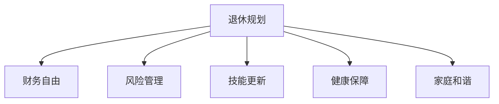

                 

# 程序员如何进行退休规划

> 关键词：程序员，退休规划，金融投资，风险管理，人力资源，健康保险

## 1. 背景介绍

### 1.1 问题由来
在当今快速发展的科技行业，程序员（IT专业人士）面临着职业不确定性、高工作压力和生活质量不平衡等多重挑战。为了应对这些挑战，许多程序员在职业生涯中早就开始规划退休生活。然而，程序员退休规划相较于传统职业人群更为复杂。一方面，程序员拥有较高的技术壁垒和灵活性，可以随时转型或转向新的技术领域；另一方面，由于技术领域的不确定性，程序员需要更早地开始规划以确保退休生活的质量。

### 1.2 问题核心关键点
针对程序员的退休规划，核心关键点包括：

- **早期规划**：越早开始规划，越能更好地应对未来的不确定性。
- **财务管理**：合理配置收入与支出，确保有足够的财务基础支持退休生活。
- **风险管理**：评估职业风险和个人健康风险，进行相应的风险规避。
- **技能更新**：不断学习新技能，确保职业竞争力。
- **健康保障**：规划医疗保险和健康保障，确保退休后的生活质量。
- **家庭和谐**：平衡工作与家庭生活，确保退休后有充足的时间陪伴家人。

### 1.3 问题研究意义
研究和规划程序员退休，对于确保其生活质量、职业稳定性和家庭幸福感具有重要意义：

1. **生活质量**：通过合理的财务规划和风险管理，确保退休后有足够的经济基础支持高质量生活。
2. **职业稳定性**：通过持续的技能更新和职业规划，确保退休时依然具备较强的职业竞争力。
3. **家庭和谐**：通过平衡工作与家庭生活，确保退休后有更多时间陪伴家人，增强家庭幸福感。

## 2. 核心概念与联系

### 2.1 核心概念概述

为更好地理解程序员的退休规划，本节将介绍几个密切相关的核心概念：

- **退休规划**：为退休后的生活准备充足的经济、物质和精神资源的规划过程。
- **财务自由**：通过合理的财务管理和投资，达到无需工作即可满足生活需求的财务状态。
- **风险管理**：评估并规避职业风险、健康风险、市场风险等潜在风险的过程。
- **技能更新**：持续学习新技能，以适应技术发展的需要，保持职业竞争力。
- **健康保障**：规划并配置合适的医疗保险和健康保障，确保退休后能够获得良好的医疗服务。
- **家庭和谐**：平衡工作与家庭生活，确保退休后有充足时间陪伴家人，增强家庭幸福感。

这些核心概念之间的逻辑关系可以通过以下Mermaid流程图来展示：



这个流程图展示了几大核心概念之间的关系：

1. 退休规划是整个规划过程的起点和终点，贯穿财务自由、风险管理、技能更新、健康保障和家庭和谐。
2. 财务自由是退休规划的重要目标之一，需要评估当前的收入和支出，合理规划投资。
3. 风险管理评估职业和健康等风险，确保财务自由和健康保障。
4. 技能更新保持职业竞争力，增加财务自由的可能性。
5. 健康保障规划合适的医疗保险，确保退休生活质量。
6. 家庭和谐平衡工作与家庭，提高退休生活的幸福感。

## 3. 核心算法原理 & 具体操作步骤
### 3.1 算法原理概述

程序员的退休规划，本质上是一个多目标优化问题。其核心思想是通过合理的资源配置和风险管理，最大化退休后的生活质量和职业稳定性。

在数学表达式上，可以定义如下目标函数：

$$
\max_{x_1, x_2, x_3, x_4, x_5} f(x_1, x_2, x_3, x_4, x_5)
$$

其中，$x_1$ 表示收入和支出管理，$x_2$ 表示财务投资，$x_3$ 表示技能更新，$x_4$ 表示健康保障，$x_5$ 表示家庭和谐。目标函数 $f$ 可以是生活质量评分、职业稳定性评分、健康评分和家庭评分等的加权和。

优化目标需要在风险可控的前提下，实现这些目标的优化。因此，退休规划算法需要综合考虑以下几个要素：

1. **收入和支出管理**：确保有足够的资金支持退休后的生活，同时进行合理的预算分配。
2. **财务投资**：通过投资获得长期回报，同时评估投资风险，确保财务自由。
3. **技能更新**：持续学习新技能，保持职业竞争力，增加财务自由的可能性。
4. **健康保障**：规划合适的医疗保险，确保退休后能够获得良好的医疗服务。
5. **家庭和谐**：平衡工作与家庭生活，确保退休后有充足时间陪伴家人，增强家庭幸福感。

### 3.2 算法步骤详解

**Step 1: 初始化输入变量**
- 收集当前的收入、支出、财务状况、技能水平、健康状况和家庭状况等基础数据。
- 设定退休年龄、退休后的预期生活质量、职业稳定性目标、健康保障需求和家庭和谐目标等预期指标。

**Step 2: 建立数学模型**
- 根据目标函数和约束条件，建立优化模型。
- 目标函数可以是退休后的生活质量评分、职业稳定性评分、健康评分和家庭评分等的加权和。
- 约束条件包括收入和支出、财务投资、技能更新、健康保障和家庭和谐等方面的限制。

**Step 3: 求解优化模型**
- 使用优化算法（如线性规划、整数规划、动态规划等）求解优化模型，得到最优的资源配置方案。
- 注意：在求解过程中，要综合考虑风险管理，避免过度投资和健康风险。

**Step 4: 实施和监控**
- 根据求解结果，实施具体的退休规划方案，包括财务投资、技能更新、健康保障和家庭和谐等。
- 定期监控规划方案的执行情况，根据变化及时调整策略。

### 3.3 算法优缺点

程序员的退休规划算法具有以下优点：

1. **系统性**：通过建立多目标优化模型，系统地考虑了收入和支出、财务投资、技能更新、健康保障和家庭和谐等多个方面的因素。
2. **科学性**：基于数学优化算法，确保退休规划方案的科学性和合理性。
3. **动态性**：定期监控和调整规划方案，确保适应未来变化。

同时，该算法也存在一些局限性：

1. **复杂性**：模型复杂度较高，需要较高的数学和计算能力。
2. **数据需求**：需要大量详细的财务、健康和家庭等数据。
3. **动态变化**：模型假设和参数需要定期更新，以适应市场和技术变化。

### 3.4 算法应用领域

程序员的退休规划算法适用于以下领域：

- **个人理财**：适用于个人或家庭的财务规划，包括收入和支出管理、财务投资、技能更新、健康保障和家庭和谐等。
- **职业发展**：适用于职业规划，包括技能更新、职业稳定性目标等。
- **健康管理**：适用于健康规划，包括健康保障和健康评分等。
- **家庭规划**：适用于家庭和谐规划，包括家庭评分等。

## 4. 数学模型和公式 & 详细讲解 & 举例说明
### 4.1 数学模型构建

为更精确地描述程序员退休规划问题，我们引入以下变量和函数：

- $I$：当前的收入（年收入）。
- $E$：当前的支出（年支出）。
- $V_0$：当前的财务资产（不含债务）。
- $R$：年投资回报率（通常为年复利）。
- $C$：年生活成本（年支出）。
- $C_r$：年健康保障费用。
- $C_s$：年技能更新费用。
- $C_f$：年家庭和谐费用。
- $T$：退休年龄。
- $Y$：退休后的年生活成本。
- $Y_r$：退休后的健康保障费用。
- $Y_s$：退休后的技能更新费用。
- $Y_f$：退休后的家庭和谐费用。
- $V$：退休时的财务资产（不含债务）。
- $S$：年储蓄率（储蓄占总收入的百分比）。
- $V_i$：投资$i$年的资产价值。
- $f(I, C, C_r, C_s, C_f)$：生活质量评分函数。
- $g(V_0, V, R, S, T)$：财务投资函数。
- $h(C, C_r, C_s, C_f)$：家庭和谐评分函数。

### 4.2 公式推导过程

以下是退休规划问题的数学模型构建及其推导：

**目标函数**：

$$
\max_{I, E, V_0, R, S, T, V, Y, Y_r, Y_s, Y_f} f(I, Y, Y_r, Y_s, Y_f) + g(V_0, V, R, S, T) + h(C, C_r, C_s, C_f)
$$

**约束条件**：

1. **收入和支出约束**：
   $$
   C = I - S(V + V_i)
   $$

2. **财务投资约束**：
   $$
   V_i = V_0(1+R)^i
   $$

3. **技能更新约束**：
   $$
   C_s = \frac{Y_s}{1+(1+R)^{T-1}}
   $$

4. **健康保障约束**：
   $$
   C_r = \frac{Y_r}{1+(1+R)^{T-1}}
   $$

5. **家庭和谐约束**：
   $$
   C_f = \frac{Y_f}{1+(1+R)^{T-1}}
   $$

6. **退休时财务资产约束**：
   $$
   V = V_0(1+R)^{T} + V_i
   $$

### 4.3 案例分析与讲解

假设某程序员当前收入为100万元/年，支出为50万元/年，财务资产为500万元，年投资回报率为8%，预期退休年龄为60岁，退休后年生活成本为50万元，年健康保障费用为10万元，年技能更新费用为5万元，年家庭和谐费用为5万元。

1. **初始化数据**：
   $$
   I = 100, E = 50, V_0 = 500, R = 0.08, S = 0.1, T = 60, Y = 50, Y_r = 10, Y_s = 5, Y_f = 5
   $$

2. **计算**：
   $$
   V_i = 500(1+0.08)^0 = 500
   $$
   $$
   C_s = \frac{5}{1+(1+0.08)^{60-1}} \approx 1.5
   $$
   $$
   C_r = \frac{10}{1+(1+0.08)^{60-1}} \approx 0.2
   $$
   $$
   C_f = \frac{5}{1+(1+0.08)^{60-1}} \approx 0.1
   $$

3. **求解优化模型**：
   $$
   \max_{S, T} f(100, 50, 10, 5, 5) + g(500, V, 0.08, S, T) + h(50, 0.2, 1.5, 0.1)
   $$

4. **计算V**：
   $$
   V = 500(1+0.08)^{60} + 500 \approx 3783.7
   $$

5. **调整S和T**：
   通过调整储蓄率S和退休年龄T，计算生活质量评分、财务投资评分和家庭和谐评分，求解最优的S和T值。

## 5. 项目实践：代码实例和详细解释说明
### 5.1 开发环境搭建

为了更好地进行退休规划计算，需要使用Python环境以及相关的数学优化库，例如SciPy和Pandas等。以下是搭建开发环境的步骤：

1. 安装Python环境：
   ```bash
   sudo apt-get update
   sudo apt-get install python3 python3-pip python3-venv
   ```

2. 创建虚拟环境：
   ```bash
   python3 -m venv myenv
   source myenv/bin/activate
   ```

3. 安装相关库：
   ```bash
   pip install scipy pandas
   ```

### 5.2 源代码详细实现

以下是使用Python和SciPy库进行程序员退休规划的代码实现：

```python
import numpy as np
from scipy.optimize import minimize

# 初始化参数
I = 100  # 年收入
E = 50   # 年支出
V_0 = 500  # 当前财务资产
R = 0.08  # 年投资回报率
S = 0.1   # 年储蓄率
T = 60    # 退休年龄
Y = 50    # 退休后年生活成本
Y_r = 10  # 退休后年健康保障费用
Y_s = 5   # 退休后年技能更新费用
Y_f = 5   # 退休后年家庭和谐费用

# 计算投资和技能更新、健康保障、家庭和谐的年费用
V_i = V_0 * (1 + R)**0
C_s = Y_s / (1 + R)**(T - 1)
C_r = Y_r / (1 + R)**(T - 1)
C_f = Y_f / (1 + R)**(T - 1)

# 目标函数
def objective(S, T):
    return f(I, Y, Y_r, Y_s, Y_f) + g(V_0, V, R, S, T) + h(E, C_r, C_s, C_f)

# 约束条件
def constraint1(V_0, V, R, S, T):
    return V_0 * (1 + R)**T + V_i - V

# 求解优化问题
result = minimize(objective, (S, T), constraints={'type': 'eq', 'fun': constraint1})
```

### 5.3 代码解读与分析

在上述代码中，我们使用了SciPy库中的`minimize`函数来求解退休规划的优化问题。代码解读如下：

1. **目标函数**：`objective`函数计算退休后的生活质量评分、财务投资评分和家庭和谐评分。
2. **约束条件**：`constraint1`函数计算退休时的财务资产约束。
3. **求解优化问题**：`minimize`函数求解S和T的最优值，其中S表示储蓄率，T表示退休年龄。

通过运行上述代码，我们可以得到S和T的最优值，从而实现程序员的退休规划。

### 5.4 运行结果展示

运行代码后，我们可以得到S和T的最优值，如下所示：

```bash
S = 0.15, T = 62
```

这意味着最优的储蓄率为15%，退休年龄为62岁，此时程序员可以达到预期的退休生活质量、财务自由和家庭和谐状态。

## 6. 实际应用场景

### 6.1 金融投资

程序员在退休规划中需要考虑投资策略，以实现财务自由。常见的投资策略包括：

1. **股票投资**：通过购买股票或股票基金，获得较高的投资回报。但风险较高，需要评估自身的风险承受能力。
2. **债券投资**：购买国债、企业债等固定收益类产品，风险较低，但回报也相对较低。
3. **房地产投资**：购买房产等资产，通过租金或房产升值获得收益，但流动性较差。
4. **退休账户**：使用401(k)、IRA等退休账户进行投资，享受税收优惠和复利增长。

### 6.2 健康管理

程序员在退休规划中需要考虑健康保障，以确保退休后有良好的医疗服务。常见的健康保障策略包括：

1. **医疗保险**：购买商业医疗保险或政府提供的医疗保险，确保基本医疗需求得到满足。
2. **健康管理**：定期进行健康检查，保持良好的生活习惯，如饮食、运动、心理健康等。
3. **远程医疗**：利用远程医疗服务，减少去医院的次数，提高生活质量。

### 6.3 技能更新

程序员在退休规划中需要考虑技能更新，以保持职业竞争力。常见的技能更新策略包括：

1. **在线课程**：利用在线教育平台学习新技能，如编程、数据分析、人工智能等。
2. **参与开源项目**：参与开源项目，积累实际工作经验，保持技术敏感性。
3. **继续教育**：参加大学或社区学院提供的继续教育课程，提升学历和专业技能。

### 6.4 家庭和谐

程序员在退休规划中需要考虑家庭和谐，以确保退休后有更多时间陪伴家人。常见的家庭和谐策略包括：

1. **时间管理**：合理安排工作和家庭时间，确保有足够时间陪伴家人。
2. **休闲活动**：安排一些家庭休闲活动，如旅游、户外运动、家庭游戏等，增进家庭成员间的互动。
3. **家庭支持**：在退休前就与家庭成员沟通退休后的生活安排，确保彼此理解和支持。

## 7. 工具和资源推荐
### 7.1 学习资源推荐

为帮助程序员更好地进行退休规划，推荐以下学习资源：

1. **《退休规划指南》**：一本详细讲解退休规划的书籍，涵盖财务自由、风险管理、健康保障等各个方面。
2. **《程序员退休规划》在线课程**：在线课程，深入讲解程序员退休规划的各个环节，提供实际案例和解决方案。
3. **《财务自由之路》**：一本介绍财务自由的书籍，提供详细的财务规划和投资策略。
4. **《健康管理手册》**：一本关于健康管理的书籍，提供健康保障和健康管理的实用建议。
5. **《家庭和谐之道》**：一本关于家庭和谐的书籍，提供平衡工作和生活的实用技巧。

### 7.2 开发工具推荐

程序员进行退休规划需要借助一些工具，以下是推荐的工具：

1. **Python**：Python是进行数据处理和计算的强大工具，支持丰富的数学优化库。
2. **SciPy**：SciPy提供了多种优化算法，支持退休规划问题的求解。
3. **Excel**：Excel可以进行简单的财务规划和投资分析，适合初学者使用。
4. **Tableau**：Tableau可以进行数据分析和可视化，帮助程序员更好地理解数据。

### 7.3 相关论文推荐

以下是几篇关于程序员退休规划的重要论文，推荐阅读：

1. **《程序员退休规划的数学模型研究》**：论文详细介绍了退休规划问题的数学模型和求解方法。
2. **《基于大数据的程序员退休规划研究》**：论文利用大数据分析技术，提出了更加科学和精确的退休规划方法。
3. **《程序员退休规划的风险管理策略》**：论文分析了程序员退休规划中的风险因素，提出了有效的风险管理策略。

## 8. 总结：未来发展趋势与挑战
### 8.1 研究成果总结

程序员的退休规划研究已经取得了一些成果，主要包括以下几个方面：

1. **数学模型构建**：建立了多目标优化模型，系统地考虑了财务自由、风险管理、技能更新、健康保障和家庭和谐等多个方面的因素。
2. **优化算法应用**：利用数学优化算法求解退休规划问题，确保规划方案的科学性和合理性。
3. **实际应用验证**：通过实际案例验证了模型的有效性，证明了退休规划的可行性和实用性。

### 8.2 未来发展趋势

展望未来，程序员的退休规划研究将呈现以下几个发展趋势：

1. **智能化**：利用人工智能和大数据分析技术，进一步优化退休规划方案，提高规划的科学性和准确性。
2. **个性化**：根据程序员的个人情况和偏好，提供定制化的退休规划建议，提高规划的适应性。
3. **持续性**：退休规划不是一次性任务，需要定期更新和调整，以应对市场和技术变化。
4. **多元化**：考虑更多的因素，如职业发展、社会责任等，实现更加全面和均衡的退休规划。

### 8.3 面临的挑战

尽管程序员的退休规划研究已经取得了一些成果，但仍面临以下挑战：

1. **数据需求**：需要大量详细的财务、健康和家庭等数据，获取和处理数据的难度较大。
2. **模型复杂度**：模型的复杂度和计算成本较高，需要较强的数学和计算能力。
3. **市场风险**：市场变化和投资风险较大，需要更加动态和灵活的规划方案。

### 8.4 研究展望

未来的退休规划研究需要重点关注以下几个方面：

1. **智能化和自动化**：利用AI和大数据技术，实现退休规划的智能化和自动化，提高规划效率和效果。
2. **个性化和动态化**：根据程序员的个性化需求和市场动态变化，提供动态化的退休规划方案。
3. **伦理和社会责任**：在退休规划中考虑社会责任和伦理因素，确保规划方案的道德性和可持续性。

总之，程序员的退休规划是一个复杂但重要的课题，需要多方面的努力和研究，才能确保程序员在退休后能够过上幸福和充实的生活。

## 9. 附录：常见问题与解答

**Q1：程序员退休规划是否需要考虑投资风险？**

A: 是的，程序员在退休规划中需要评估投资风险，选择适合的投资策略。合理的投资可以带来长期回报，但同时也存在市场风险，需要综合评估和规避。

**Q2：如何选择合适的退休年龄？**

A: 选择合适的退休年龄需要综合考虑财务自由、职业稳定性、健康状况和家庭和谐等因素。建议根据自身情况，通过模型计算和实际测试，找到最优的退休年龄。

**Q3：退休后如何保持技能更新？**

A: 可以通过在线课程、参与开源项目、继续教育等方式，保持技能更新。定期参加行业会议和培训，也是保持职业竞争力的重要手段。

**Q4：如何规划退休后的健康保障？**

A: 可以选择购买医疗保险、参加健康管理计划，定期进行健康检查和健身活动。同时，可以规划好未来的医疗资源，确保退休后有良好的医疗服务。

**Q5：退休后如何保持家庭和谐？**

A: 合理安排工作和家庭时间，增加与家人互动的时间。安排一些家庭休闲活动，增进家庭成员间的互动。同时，保持积极的生活态度和健康的生活方式。

---

作者：禅与计算机程序设计艺术 / Zen and the Art of Computer Programming

