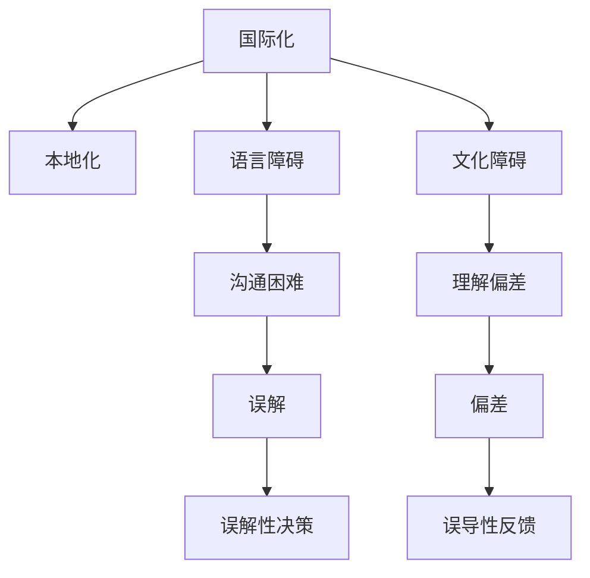
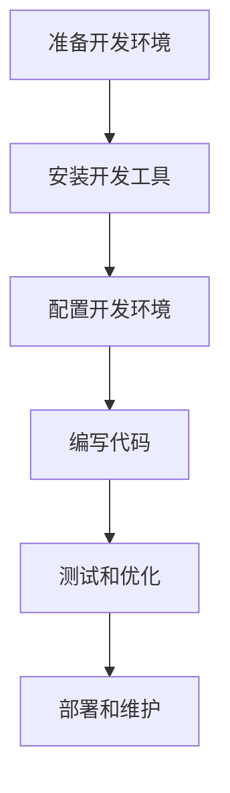

                 

# 程序员的国际化发展：语言与文化障碍

## 1. 背景介绍

### 1.1 问题由来

随着全球化的发展，国际化技术交流与合作日益频繁，程序员的国际化发展成为当下热门话题。越来越多的技术团队和公司注重招聘具有国际化视野和能力的程序员，因为国际化的团队可以带来多维度的思考和更广阔的视野。然而，语言和文化障碍仍是程序员国际化发展中的重大挑战。本文将探讨语言与文化障碍对程序员国际化发展的影响，提出相应的策略和建议，助力程序员克服这些障碍，迎接国际化发展的机遇和挑战。

## 2. 核心概念与联系

### 2.1 核心概念概述

在本节中，我们将介绍与语言和文化障碍相关的几个核心概念：

- **国际化（Internationalization, I18n）**：指在软件设计和开发过程中考虑语言和文化差异，使软件能够适应不同语言和文化环境的操作。

- **本地化（Localization, L10n）**：指将已国际化的软件适应特定地区或国家的语言和文化，包括文本翻译、日期时间格式、货币符号等。

- **语言障碍（Language Barrier）**：指语言不通导致的交流困难和误解。

- **文化障碍（Cultural Barrier）**：指文化差异导致的沟通障碍和理解偏差。

这些概念的联系可以通过以下Mermaid流程图来展示：



这个流程图展示了一些关键概念之间的关系：

1. 国际化是软件设计的起点，而本地化则是在此基础上适应特定地区或国家的操作。
2. 语言障碍和文化障碍是国际化过程中需要克服的主要障碍。
3. 语言障碍可能导致沟通困难和误解，而文化障碍则可能导致理解偏差和误导性反馈。

## 3. 核心算法原理 & 具体操作步骤

### 3.1 算法原理概述

国际化过程中，软件的设计需要考虑多语言和多文化环境下的操作，这可以通过国际化标准化和本地化适配来实现。以下是几个关键步骤：

1. **设计国际化模块**：确保软件模块设计符合国际化标准，如Unicode编码、字符串资源文件等。

2. **实现本地化功能**：根据目标地区或国家的需求，适配语言和文化的差异，如文本翻译、日期时间格式转换等。

3. **处理语言和文化差异**：考虑不同语言和文化背景下用户的输入和输出习惯，进行相应的设计调整。

### 3.2 算法步骤详解

以下是具体的国际化算法步骤：

1. **需求分析**：了解目标地区或国家的语言和文化需求，包括常见的语言字符集、日期格式、货币符号等。

2. **国际标准化设计**：
   - 使用Unicode编码，确保文字在不同语言环境下的兼容性。
   - 设计字符串资源文件，方便多语言环境的文本翻译和替换。
   - 实现日期时间格式化，根据不同文化习惯进行转换。

3. **本地化适配**：
   - 使用资源文件进行文本翻译，支持多语言环境下的用户界面显示。
   - 根据目标地区或国家的货币符号、度量单位等进行适配。

4. **测试与优化**：
   - 在不同语言和文化环境下进行测试，确保软件的本地化效果。
   - 根据测试结果进行优化，提升软件的本地适应性。

### 3.3 算法优缺点

国际化算法的优点包括：

- **提高软件适应性**：使软件能够适应不同语言和文化环境的操作，提高软件的市场竞争力。
- **减少开发成本**：通过一次设计、多次本地化，减少不同语言环境下的重复开发成本。

缺点包括：

- **复杂度高**：国际化设计涉及多种语言和文化环境的适配，需要考虑大量的细节。
- **测试难度大**：不同语言和文化环境下的测试需要额外的时间和资源。

### 3.4 算法应用领域

国际化算法广泛应用于各种软件开发领域，包括：

- **Web应用**：实现多语言支持，确保网站在不同地区的适应性。
- **移动应用**：适配不同语言和文化背景的用户界面。
- **桌面软件**：设计国际化的用户界面，支持多语言切换。
- **API和文档**：提供多语言文档和API支持，方便全球用户使用。

## 4. 数学模型和公式 & 详细讲解 & 举例说明

### 4.1 数学模型构建

在本节中，我们将通过数学模型来阐述国际化设计的原理。

假设有一个包含N个语言版本的软件，每个版本需要翻译M个字符串。设每个字符串的原始长度为L，翻译后的长度为$L_t$。

定义翻译工作量为$W$，则：

$$
W = M \times L \times \frac{1}{L_t}
$$

其中，$1/L_t$表示每个字符串平均翻译所需的额外字符数，即需要考虑的语言和文化的差异。

### 4.2 公式推导过程

国际化设计中的主要公式包括：

1. **字符串翻译公式**：
   - 原始字符串长度为L，翻译后的长度为$L_t$。
   - 单个字符串翻译所需字符数为$L_t - L$。
   - 所有字符串的翻译工作量为$M \times (L_t - L)$。

2. **日期格式化公式**：
   - 原始日期格式为$YYYY-MM-DD$，目标地区格式为$MM/DD/YYYY$。
   - 每个日期字符串的格式化时间复杂度为O(1)。
   - 所有日期字符串的格式转换时间复杂度为$O(NM)$。

### 4.3 案例分析与讲解

以一个国际化Web应用为例，其国际化设计过程如下：

1. **需求分析**：了解目标市场的主要语言，如英文、中文、法语等。

2. **设计国际化模块**：
   - 使用Unicode编码确保字符兼容性。
   - 设计字符串资源文件，方便多语言翻译。

3. **实现本地化功能**：
   - 使用国际化框架进行字符串翻译，支持多语言显示。
   - 根据目标市场的日期格式，实现日期时间的格式化。

4. **测试与优化**：在不同语言和文化环境下进行测试，确保软件适配效果。

## 5. 项目实践：代码实例和详细解释说明

### 5.1 开发环境搭建

在进行国际化项目实践前，我们需要准备好开发环境。以下是使用Python进行国际化项目开发的流程图：



### 5.2 源代码详细实现

以下是一个简单的国际化Web应用示例代码：

```python
# 国际化字符串资源文件
def get_text(key):
    text = {
        'en': 'Hello, World!',
        'zh': '你好，世界！',
        'fr': 'Bonjour le monde!',
        # 添加更多语言版本...
    }
    return text.get(key, 'Unknown')

# 日期格式化函数
def format_date(date_str, target_format):
    if target_format == 'YYYY-MM-DD':
        return date_str
    elif target_format == 'MM/DD/YYYY':
        return date_str.split('-')[::-1].join('/')
    else:
        return 'Unknown'
```

### 5.3 代码解读与分析

**国际化字符串资源文件**：
- 使用Python字典存储不同语言的字符串资源，根据语言键返回对应的字符串。
- 在应用程序中使用`get_text`函数获取国际化字符串，支持多语言显示。

**日期格式化函数**：
- 根据目标格式将日期字符串格式化，支持不同语言和文化环境下的日期表示。

## 6. 实际应用场景

### 6.1 多语言Web应用

一个多语言Web应用可以帮助全球用户访问和互动。例如，电商平台可以使用国际化设计，支持多语言显示和结算，方便全球用户购物。

### 6.2 国际化的移动应用

移动应用可以通过本地化适配，提供符合目标市场语言和文化习惯的用户界面。例如，Twitter的国际化移动应用支持多语言切换，适应不同地区的用户习惯。

### 6.3 国际化的桌面软件

桌面软件通过国际化的设计，支持多语言显示和切换，适应不同语言和文化背景的用户。例如，Microsoft Office提供了多语言界面和文档支持，方便全球用户使用。

### 6.4 国际化的API和文档

API和文档的多语言支持，可以帮助全球开发者更方便地使用和维护系统。例如，GitHub提供的API文档支持多语言版本，方便不同语言环境的开发者使用。

## 7. 工具和资源推荐

### 7.1 学习资源推荐

为了帮助开发者系统掌握国际化设计的理论基础和实践技巧，这里推荐一些优质的学习资源：

1. **《国际化和本地化》（Internationalization and Localization）书籍**：介绍了国际化设计的原理和实践方法，涵盖多语言支持和本地化适配等内容。

2. **《Unicode标准》（Unicode Standard）**：介绍Unicode编码的规范和应用，确保字符在不同语言环境下的兼容性。

3. **《Web开发中的国际化》（Internationalization in Web Development）**：讲解Web应用国际化设计的最佳实践和技巧，提高Web应用的适应性。

4. **《i18n框架教程》**：介绍一些流行的国际化框架，如Gettext、I18n.py等，提供多语言翻译和本地化支持。

5. **《国际化开发指南》**：提供完整的国际化开发教程和实例，涵盖国际化设计、本地化适配等内容。

### 7.2 开发工具推荐

高效的国际化开发离不开优秀的工具支持。以下是几款常用的国际化开发工具：

1. **I18n.js**：提供多语言字符串管理和翻译，方便Web应用的多语言支持。

2. **Gettext**：流行的国际化框架，支持多语言翻译和本地化适配。

3. **Locale**：提供语言和文化环境的配置，方便国际化设计。

4. **Locale.js**：实现语言和文化的本地化适配，支持多语言显示和日期格式化。

5. **Intl.js**：提供国际化相关的API，支持日期、时间、货币等格式化。

### 7.3 相关论文推荐

国际化设计的发展得益于学界的持续研究。以下是几篇经典论文，推荐阅读：

1. **《国际化设计原理》（Principles of Internationalization）**：介绍国际化设计的原理和实践方法，涵盖字符编码、多语言翻译等内容。

2. **《本地化实践指南》（Localization Best Practices）**：提供本地化设计的最佳实践和技巧，提高本地化适配的效果。

3. **《国际化与本地化》（Internationalization and Localization）**：介绍国际化设计和技术实现，涵盖多语言支持、本地化适配等内容。

4. **《多语言Web应用设计》（Designing Multilingual Web Applications）**：讲解Web应用国际化设计的最佳实践和技巧，提高Web应用的适应性。

5. **《国际化开发挑战》（Challenges in Internationalization Development）**：分析国际化开发中遇到的问题和挑战，提供解决方案和优化建议。

## 8. 总结：未来发展趋势与挑战

### 8.1 研究成果总结

本文对国际化设计的核心概念、算法原理和操作步骤进行了系统介绍。通过系统梳理，可以看到国际化设计在多语言、多文化环境下的应用价值和挑战。

### 8.2 未来发展趋势

展望未来，国际化设计将呈现以下几个发展趋势：

1. **多语言支持普及**：随着全球化的发展，多语言支持将成为软件设计的基本要求。
2. **本地化自动化**：利用机器翻译和自动化工具，提高本地化适配的效率和质量。
3. **跨文化设计**：关注不同文化背景下用户的使用习惯，进行跨文化设计，提高软件的适应性。
4. **用户界面本地化**：通过本地化设计，提供符合目标市场语言和文化习惯的用户界面。
5. **国际化API和文档**：提供多语言API和文档支持，方便全球开发者使用。

### 8.3 面临的挑战

尽管国际化设计已经取得了一定的成果，但仍面临以下挑战：

1. **语言和文化差异**：不同语言和文化背景下用户的需求和习惯差异较大，需要进行深入分析。
2. **多语言翻译的准确性**：多语言翻译的准确性和一致性难以保证，需要进行严格的翻译和校对。
3. **本地化适配的复杂性**：本地化适配涉及多个方面的细节，需要综合考虑。
4. **用户体验一致性**：不同语言和文化环境下的用户界面和交互设计需要保持一致性。

### 8.4 研究展望

未来的研究需要在以下几个方面进行深入探讨：

1. **自动化翻译技术**：利用机器翻译和自然语言处理技术，提高多语言翻译的准确性和一致性。
2. **跨文化设计方法**：研究不同文化背景下用户的使用习惯，提供符合用户期望的设计方案。
3. **用户体验一致性**：通过本地化设计，提供一致的用户界面和交互体验。
4. **国际化测试**：设计全面的国际化测试方法，确保软件的适应性和稳定性。

总之，国际化设计需要不断优化和创新，才能更好地适应全球化的需求，提升软件的市场竞争力和用户满意度。

## 9. 附录：常见问题与解答

**Q1：国际化设计和本地化适配的区别是什么？**

A: 国际化设计是指在软件设计中考虑多语言和文化差异，确保软件能够适应不同语言和文化环境的操作。而本地化适配则是将国际化设计实现到具体的地区或国家，适应特定语言和文化的差异，如文本翻译、日期格式等。

**Q2：如何选择合适的国际化框架？**

A: 选择合适的国际化框架需要考虑多个因素，如支持的国际化语言数量、多语言翻译的准确性、本地化适配的复杂度等。常见的一些国际化框架包括Gettext、I18n.js等，具体选择需要根据项目需求和团队技术栈进行选择。

**Q3：如何进行多语言翻译的校对和验证？**

A: 多语言翻译的校对和验证是确保翻译准确性和一致性的关键步骤。常见的校对方法包括人工校对、机器校对、同行评审等。可以通过建立多语言校对团队，进行多轮校对和验证，确保翻译质量。

**Q4：如何处理不同文化背景下的用户界面设计？**

A: 处理不同文化背景下的用户界面设计需要考虑文化差异对用户行为和习惯的影响。可以进行跨文化设计，通过用户研究和市场调研，了解目标市场的文化背景和使用习惯，设计符合用户期望的用户界面。

**Q5：如何测试和优化国际化软件？**

A: 测试和优化国际化软件需要进行全面的国际化测试，包括功能测试、性能测试、兼容性测试等。测试过程中需要模拟不同语言和文化环境下的操作，确保软件的适应性和稳定性。根据测试结果进行优化，提升软件的本地适应性。

通过系统介绍国际化设计的核心概念、算法原理和操作步骤，本文希望为程序员提供全面的国际化开发指导。无论是Web应用、移动应用还是桌面软件，国际化设计都是提升软件市场竞争力和用户体验的关键环节。希望本文能够帮助程序员克服语言和文化障碍，迎接国际化发展的机遇和挑战。

---

作者：禅与计算机程序设计艺术 / Zen and the Art of Computer Programming

