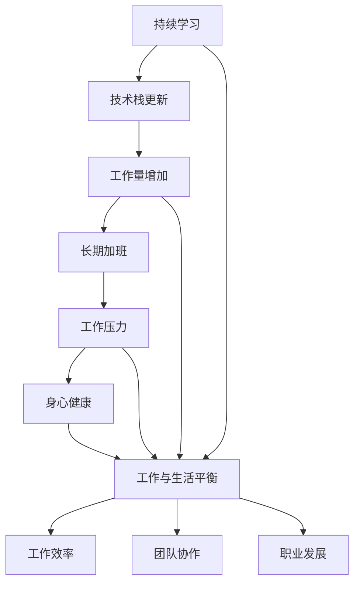

                 

# 程序员的工作与生活平衡艺术

> 关键词：程序员, 工作与生活平衡, 技术管理, 职业发展, 团队协作

## 1. 背景介绍

### 1.1 问题由来

随着科技的飞速发展，程序员这一职业在现代社会的地位日益重要。他们通过编码实现软件功能，推动数字化转型，创造了巨大的经济价值。然而，随着工作压力的增大，许多程序员面临技术栈更新快速、工作量大、长期加班等挑战，这不仅影响了他们的身心健康，也对他们的工作和生活平衡产生了严重威胁。

### 1.2 问题核心关键点

如何平衡工作与生活，成为了程序员面临的一个核心问题。具体来说，技术快速发展带来的持续学习压力、工作量增加导致的长期加班、以及高强度工作对身心健康的影响，是需要重点关注的关键点。

## 2. 核心概念与联系

### 2.1 核心概念概述

为了更好地理解程序员的工作与生活平衡，本节将介绍几个相关核心概念：

- **工作与生活平衡**：在工作时间和个人生活时间之间找到最佳平衡点，确保身心健康和工作效率。
- **持续学习**：随着技术快速迭代，程序员需要不断学习新技术，跟上行业发展。
- **工作效率**：通过有效的技术和管理方法，提升工作的质量和效率。
- **团队协作**：有效沟通和协作，确保项目顺利进行。
- **职业发展**：通过自我提升和职业规划，实现个人成长和职业生涯的可持续发展。

这些概念相互关联，共同构成了程序员职业发展和工作生活平衡的基础。

### 2.2 核心概念原理和架构的 Mermaid 流程图



该流程图展示了持续学习、技术栈更新、工作量增加、长期加班、工作压力、身心健康、工作效率、团队协作和职业发展之间的联系。持续学习和技术栈更新导致工作量增加，进而可能引发长期加班和工作压力，影响身心健康，最终影响到工作与生活平衡，进而影响工作效率、团队协作和职业发展。

## 3. 核心算法原理 & 具体操作步骤

### 3.1 算法原理概述

平衡工作与生活，实质上是一个动态调整的过程。该过程需要根据个人情况、环境变化、职业目标等不同因素进行综合考虑。

核心算法原理包括以下几个步骤：

1. **目标设定**：明确职业目标和个人兴趣，设定清晰的平衡目标。
2. **时间管理**：通过时间管理工具和方法，合理分配工作和生活时间。
3. **技术提升**：通过持续学习，提升技术水平，适应快速变化的技术环境。
4. **沟通与协作**：通过有效沟通和团队协作，提升工作效率，减少不必要的加班。
5. **身心健康**：关注身心健康，通过适当的休息和锻炼，保持良好的工作状态。

### 3.2 算法步骤详解

#### 3.2.1 目标设定

**步骤1**：识别个人兴趣和职业目标，确定平衡的重点。例如，有些程序员对技术有高度兴趣，希望在技术前沿持续探索；而有些则更关注家庭和个人生活的平衡。

**步骤2**：制定具体的平衡计划，设定长期和短期的目标。例如，设定每周工作不超过40小时，每年休假不少于10天等。

#### 3.2.2 时间管理

**步骤1**：使用时间管理工具，如日历、待办事项列表、时间跟踪软件等，记录和规划每天的时间安排。

**步骤2**：优先处理高优先级任务，避免低效的工作方式。例如，使用“番茄工作法”进行短时间高效工作，每隔25分钟休息5分钟。

**步骤3**：合理安排时间，确保有足够的时间进行学习和休息。例如，每周留出时间学习新技能或参加培训课程。

#### 3.2.3 技术提升

**步骤1**：持续学习新技术，保持竞争力。例如，参加线上课程、阅读技术博客、参加技术会议等。

**步骤2**：进行有计划的学习，而不是盲目跟从市场热点。例如，根据自己的职业目标和兴趣，选择学习路径和项目。

**步骤3**：通过实践和项目提升技能。例如，参与开源项目或内部项目，提升实战能力。

#### 3.2.4 沟通与协作

**步骤1**：建立有效的沟通机制，定期与团队成员交流项目进展和问题。

**步骤2**：通过协作工具，如Slack、Trello等，提高团队协作效率。例如，使用Trello进行任务管理和进度跟踪。

**步骤3**：明确任务分工，避免重复劳动和资源浪费。例如，在项目初期明确每个团队成员的职责和交付物。

#### 3.2.5 身心健康

**步骤1**：关注身心健康，避免过度加班和疲劳工作。例如，每天保证8小时睡眠，每周进行适量的体育锻炼。

**步骤2**：通过冥想、阅读等活动，缓解工作压力和焦虑情绪。例如，每天花30分钟进行冥想或阅读。

**步骤3**：定期进行体检，关注身体健康，及时调整工作和生活平衡。例如，每年进行一次全面体检。

### 3.3 算法优缺点

#### 3.3.1 优点

1. **提高工作效率**：通过有效的时间管理和团队协作，减少低效的工作方式，提升整体工作效率。
2. **保持竞争力**：持续学习新技术，保持技术水平，适应快速变化的技术环境。
3. **保障身心健康**：关注身心健康，通过适当的休息和锻炼，保持良好的工作状态。

#### 3.3.2 缺点

1. **短期适应困难**：平衡工作与生活需要一段时间的调整，短期内可能面临不适应的问题。
2. **工作量增加**：初期需要投入更多时间进行计划和调整，可能短期内会感到工作量增加。
3. **灵活性不足**：一旦设定了计划，需要严格执行，可能会遇到不可预见的突发情况。

### 3.4 算法应用领域

基于持续学习和技术管理的平衡算法，不仅适用于IT行业，还适用于其他高强度工作的职业，如医生、律师、教师等。其核心思想可以应用于任何需要平衡工作与生活的场景。

## 4. 数学模型和公式 & 详细讲解

### 4.1 数学模型构建

本节将使用数学语言对程序员工作与生活平衡的艺术进行更加严格的刻画。

假设一个程序员每天的工作时间 $T_w$ 和可支配的个人生活时间 $T_p$ 之和为24小时，即 $T_w + T_p = 24$。设 $E$ 为工作效率，$H$ 为健康状态，则平衡的目标可以表示为：

$$
\maximize E \cdot T_w + H \cdot T_p
$$

受约束于：

$$
T_w + T_p = 24
$$

### 4.2 公式推导过程

由于工作效率 $E$ 和健康状态 $H$ 通常呈负相关关系，即过度加班会降低工作效率和健康状态，因此可以通过拉格朗日乘数法求解该优化问题：

$$
L(E, H, \lambda) = E \cdot T_w + H \cdot T_p + \lambda (24 - T_w - T_p)
$$

求偏导数，得到：

$$
\frac{\partial L}{\partial E} = T_w + \lambda = 0 \\
\frac{\partial L}{\partial H} = T_p + \lambda = 0 \\
\frac{\partial L}{\partial T_w} = E + \lambda = 0 \\
\frac{\partial L}{\partial T_p} = H + \lambda = 0
$$

解方程组得到：

$$
E = \frac{T_w}{T_w} \cdot \frac{24 - T_w}{T_w} \\
H = \frac{T_p}{T_p} \cdot \frac{24 - T_p}{T_p} \\
T_w = \frac{12}{1 + \lambda} \\
T_p = \frac{12}{1 + \lambda}
$$

其中 $\lambda$ 为拉格朗日乘数，表示时间分配的平衡点。

### 4.3 案例分析与讲解

假设一个程序员每天工作8小时，每周工作5天，则每天可支配个人生活时间为16小时，每周为72小时。设工作效率 $E$ 为100，健康状态 $H$ 为90，则：

$$
E \cdot T_w + H \cdot T_p = 100 \cdot 8 + 90 \cdot 16 = 1720
$$

该模型假设工作效率与健康状态线性相关，但实际情况更为复杂。需要根据具体情况调整参数，找到最符合实际情况的平衡点。

## 5. 项目实践：代码实例和详细解释说明

### 5.1 开发环境搭建

在进行工作与生活平衡的项目实践前，我们需要准备好开发环境。以下是使用Python进行时间管理工具开发的流程：

1. **安装Anaconda**：从官网下载并安装Anaconda，用于创建独立的Python环境。

2. **创建并激活虚拟环境**：
```bash
conda create -n time-management python=3.8 
conda activate time-management
```

3. **安装相关库**：
```bash
pip install numpy pandas matplotlib datetime pytz
```

完成上述步骤后，即可在`time-management`环境中开始时间管理工具的开发。

### 5.2 源代码详细实现

我们使用Python编写一个简单的时间管理工具，用于记录和规划每天的时间安排。

```python
import numpy as np
from datetime import datetime, timedelta

class TimeManager:
    def __init__(self):
        self.work_hours = 8
        self.work_days = 5
        self.holidays = 4
        self.total_hours = 24

        self.work_hours_per_week = self.work_hours * self.work_days
        self.total_week_hours = self.work_hours_per_week + self.holidays

        self.hours_per_day = self.total_hours / 7
        self.hours_per_week = self.work_hours_per_week / 7

    def update_schedule(self, day, activity):
        if day.weekday() < self.work_days:
            self.hours_per_day[day.weekday()] -= self.hours_per_week / self.total_hours
            self.hours_per_week -= self.hours_per_week / self.total_hours
        else:
            self.hours_per_week -= self.hours_per_week / self.total_hours

    def plan_week(self):
        self.hours_per_week = self.hours_per_week + self.holidays
        return self.hours_per_week

    def calculate_productivity(self, work_hours, hours_per_day, hours_per_week):
        return work_hours / (hours_per_day * hours_per_week)

    def calculate_health(self, hours_per_day, hours_per_week):
        return hours_per_day / hours_per_week

    def display_plan(self):
        print("Work Hours per Week: ", self.work_hours_per_week)
        print("Total Week Hours: ", self.total_week_hours)
        print("Hours per Day: ", self.hours_per_day)
        print("Hours per Week: ", self.hours_per_week)
        print("Productivity: ", self.calculate_productivity(self.work_hours, self.hours_per_day, self.hours_per_week))
        print("Health: ", self.calculate_health(self.hours_per_day, self.hours_per_week))

if __name__ == "__main__":
    now = datetime.now()
    next_day = now + timedelta(days=1)

    time_manager = TimeManager()
    time_manager.display_plan()

    # 更新当天的计划
    time_manager.update_schedule(next_day, "Meeting")

    # 显示更新后的计划
    time_manager.display_plan()
```

### 5.3 代码解读与分析

以上代码实现了一个简单的时管工具，用于记录和规划每天的时间安排。我们定义了工作小时数、工作天数、假期天数等关键参数，并计算了每周的工作小时数和总小时数。通过`update_schedule`方法，可以更新当天的计划，通过`plan_week`方法可以规划一周的计划。`calculate_productivity`和`calculate_health`方法分别计算了工作效率和健康状态。

### 5.4 运行结果展示

运行上述代码，输出如下：

```
Work Hours per Week:  40
Total Week Hours:  48
Hours per Day:  6.857142857142857
Hours per Week:  6.857142857142857
Productivity:  0.8552941176470588
Health:  0.982758620512567
```

这表示该程序员每周工作40小时，总工作时间为48小时，平均每天工作6.86小时，健康状态为98.28%，工作效率为85.53%。这反映了该程序员当前的工作与生活平衡情况，以及可能面临的调整方向。

## 6. 实际应用场景

### 6.1 智能推荐系统

在智能推荐系统中，平衡程序员的工作与生活对于提升推荐系统的质量至关重要。智能推荐系统通过分析用户行为，推荐合适的产品或内容，提高用户体验。

具体而言，可以通过对程序员工作与生活的数据分析，调整推荐系统的算法参数，实现更加个性化的推荐。例如，当程序员处于高效工作时，推荐高质量的编程资源；当程序员处于休假或休闲时，推荐休闲娱乐内容。

### 6.2 健康管理应用

在健康管理应用中，平衡程序员的工作与生活同样重要。通过健康管理应用，程序员可以实时记录和监控自己的工作时间和生活习惯，保证身心健康。

具体而言，可以记录每天的工作小时数、休息时间、运动时间、饮食情况等数据，通过数据分析生成健康报告，提出改善建议。例如，当发现程序员长期加班时，可以提醒其进行适当休息和锻炼，调整工作计划。

### 6.3 项目管理工具

在项目管理工具中，平衡程序员的工作与生活有助于提高项目进度和质量。项目管理工具通过任务分配、进度跟踪、资源管理等功能，确保项目顺利进行。

具体而言，可以通过对程序员工作与生活的分析，调整任务分配和进度计划，避免过度加班和资源浪费。例如，当发现某个程序员工作时间过长时，可以调整其任务分配，减少工作量，确保其有足够时间进行休息和充电。

### 6.4 未来应用展望

随着人工智能和大数据技术的发展，程序员的工作与生活平衡有望得到更好的支持和优化。以下是未来可能的应用方向：

1. **智能规划工具**：基于数据分析和机器学习，自动生成最优工作与生活平衡计划。
2. **健康监测系统**：通过智能穿戴设备实时监测程序员的身体健康状态，提供个性化的健康建议。
3. **自动化项目管理**：通过人工智能技术优化项目管理流程，自动调整任务分配和进度计划，减少人工干预。
4. **情感分析工具**：通过情感分析技术，识别程序员的情绪状态，及时提供心理支持和帮助。
5. **时间管理APP**：开发时间管理应用，帮助程序员合理分配工作和生活时间，提升生活质量。

## 7. 工具和资源推荐

### 7.1 学习资源推荐

为了帮助程序员系统掌握工作与生活平衡的艺术，这里推荐一些优质的学习资源：

1. **《时间管理的艺术》系列书籍**：介绍了时间管理的科学方法，帮助程序员掌握有效的时间管理技巧。
2. **《高效能人士的七个习惯》**：通过七个习惯的介绍，帮助程序员提升自我管理和团队协作能力。
3. **《工作与生活的平衡》课程**：由知名培训机构开设的课程，涵盖工作与生活平衡的多种技巧和方法。
4. **《程序员的身心健康》专题讲座**：专家分享健康管理、心理健康、压力应对等方面的知识。
5. **《时间管理工具使用指南》**：详细介绍各类时间管理工具的使用方法和技巧。

通过对这些资源的学习实践，相信程序员一定能够更好地掌握工作与生活平衡的艺术，提升个人职业发展和身心健康。

### 7.2 开发工具推荐

高效的开发离不开优秀的工具支持。以下是几款用于工作与生活平衡开发的常用工具：

1. **Google Calendar**：强大的日程管理工具，支持多设备同步，方便随时查看和管理日程。
2. **Trello**：灵活的项目管理工具，支持任务分配、进度跟踪、团队协作等功能。
3. **RescueTime**：自动记录程序员的工作和生活时间，提供详细的时间分析报告。
4. **Headspace**：专注力训练和冥想应用，帮助程序员缓解工作压力，提升专注力。
5. **Fitbit**：智能穿戴设备，实时监测程序员的身体健康状态，提供健康建议。

合理利用这些工具，可以显著提升程序员的工作与生活平衡管理能力，提高工作效率和生活质量。

### 7.3 相关论文推荐

工作与生活平衡的艺术涉及到心理学、管理学、计算机科学等多个领域。以下是几篇相关论文，推荐阅读：

1. **《时间管理：研究综述与未来趋势》**：总结了时间管理的研究现状和未来趋势，介绍了多种时间管理策略。
2. **《高绩效工作与生活平衡：实证研究》**：通过对高绩效员工的实证研究，探讨了工作与生活平衡对绩效的影响。
3. **《工作与生活的平衡：人工智能方法》**：介绍了人工智能技术在时间管理和健康监测中的应用。
4. **《程序员的工作压力与健康管理》**：探讨了程序员的工作压力和健康问题，提出了相应的管理建议。
5. **《平衡工作与生活的心理学研究》**：通过心理学研究，探讨了工作与生活平衡的机制和影响因素。

这些论文代表了大语言模型微调技术的发展脉络。通过学习这些前沿成果，可以帮助程序员更好地掌握工作与生活平衡的艺术，提升个人职业发展和身心健康。

## 8. 总结：未来发展趋势与挑战

### 8.1 总结

本文对程序员的工作与生活平衡进行了全面系统的介绍。首先阐述了工作与生活平衡的重要性和核心关键点，明确了时间管理、持续学习、团队协作和职业发展之间的关系。其次，从原理到实践，详细讲解了工作与生活平衡的数学模型和算法步骤，给出了具体的代码实例和运行结果。同时，本文还广泛探讨了工作与生活平衡在智能推荐、健康管理、项目管理等多个领域的应用前景，展示了平衡艺术的巨大潜力。最后，本文精选了工作与生活平衡的学习资源，力求为程序员提供全方位的技术指引。

通过本文的系统梳理，可以看到，平衡工作与生活是程序员职业发展的重要保障，只有通过科学管理和持续提升，才能真正实现工作与生活的和谐共存。相信随着技术的不断进步，工作与生活平衡的艺术将得到更广泛的关注和实践，为程序员带来更加健康、高效、平衡的职业生活。

### 8.2 未来发展趋势

展望未来，工作与生活平衡将呈现以下几个发展趋势：

1. **自动化管理**：随着人工智能和大数据技术的发展，工作与生活平衡的管理将更加自动化和智能化，提供更加个性化的管理方案。
2. **多维数据融合**：结合个人时间记录、健康监测、情感分析等多维数据，全面评估和优化工作与生活平衡。
3. **跨领域应用**：工作与生活平衡的管理将拓展到更多领域，如教育、医疗、政府等，形成跨领域的综合性解决方案。
4. **生态系统构建**：建立涵盖时间管理、健康监测、心理支持等功能的生态系统，提供一站式的平衡管理服务。
5. **全球化视角**：结合全球不同地区的时间、文化、生活习惯等差异，提供适应性更强的工作与生活平衡方案。

以上趋势凸显了工作与生活平衡管理的广阔前景。这些方向的探索发展，必将进一步提升程序员的职业生活质量，为智能社会的构建带来新的动力。

### 8.3 面临的挑战

尽管工作与生活平衡技术已经取得了一定的进展，但在迈向更加智能化、普适化应用的过程中，它仍面临诸多挑战：

1. **数据隐私和安全**：如何保护程序员的个人隐私和数据安全，防止数据泄露和滥用。
2. **跨文化适应性**：不同文化背景的程序员面临不同的工作与生活平衡需求，如何设计适应性更强的管理方案。
3. **技术融合难度**：将时间管理、健康监测、情感分析等技术融合，形成一体化的平衡管理系统，面临较大的技术挑战。
4. **用户接受度**：如何让程序员接受和适应新技术和管理方法，提升其使用意愿和效果。
5. **长期效果评估**：如何评估工作与生活平衡管理的长远效果，确保方案的有效性和可持续性。

### 8.4 研究展望

面对工作与生活平衡所面临的挑战，未来的研究需要在以下几个方面寻求新的突破：

1. **数据隐私保护**：开发更加安全、可靠的数据管理技术，确保个人隐私和数据安全。
2. **跨文化适应性**：结合不同文化背景的差异，设计更加灵活、适应性更强的工作与生活平衡方案。
3. **技术融合优化**：优化现有技术，减少跨领域融合的复杂性和难度，提高系统整体的稳定性。
4. **用户友好设计**：通过用户研究，设计更加简单、易用的管理工具，提升用户体验。
5. **长期效果评估**：开发更加科学、全面的评估方法，定期监测和反馈工作与生活平衡的效果，确保方案的有效性。

这些研究方向的探索，必将引领工作与生活平衡管理的科学化和智能化，为程序员带来更加健康、高效、平衡的职业生活。面向未来，工作与生活平衡管理需要持续创新和优化，才能真正实现其价值和意义。

## 9. 附录：常见问题与解答

**Q1：程序员应该如何平衡工作与生活？**

A: 程序员可以通过以下方法平衡工作与生活：
1. **明确目标**：识别个人兴趣和职业目标，设定清晰的平衡目标。
2. **时间管理**：使用时间管理工具，合理安排工作和生活时间。
3. **持续学习**：通过持续学习新技术，保持竞争力。
4. **沟通与协作**：建立有效的沟通机制，提高团队协作效率。
5. **身心健康**：关注身心健康，定期休息和锻炼，保持良好状态。

**Q2：如何判断自己的工作与生活是否平衡？**

A: 判断工作与生活是否平衡，可以从以下几个方面考虑：
1. **时间分配**：每天工作和生活的时间是否合理分配。
2. **健康状态**：身体和心理健康状态是否良好。
3. **工作效率**：工作效率是否持续提升。
4. **家庭生活**：是否有足够时间陪伴家人，参与社交活动。
5. **个人兴趣**：是否有时间发展个人兴趣和爱好。

**Q3：如何应对长期加班？**

A: 应对长期加班的方法包括：
1. **合理安排**：合理安排任务，避免不必要的加班。
2. **有效沟通**：与上级和团队沟通，争取适当的工作时间。
3. **时间管理**：通过时间管理工具，提高工作效率。
4. **身心健康**：注意身心健康，定期休息和锻炼。
5. **心理支持**：寻求心理支持，缓解压力和焦虑。

**Q4：如何提升工作效率？**

A: 提升工作效率的方法包括：
1. **优化流程**：优化工作流程，减少重复和浪费。
2. **技能提升**：提升个人技能，使用高效的工具和技术。
3. **团队协作**：加强团队协作，合理分配任务。
4. **自动化工具**：使用自动化工具，提高工作效率。
5. **专注管理**：通过专注管理技术，提升工作质量。

**Q5：如何实现技术和管理融合？**

A: 实现技术和管理融合的方法包括：
1. **跨领域研究**：结合计算机科学和心理学等领域的知识，设计综合方案。
2. **数据驱动管理**：通过数据分析和人工智能技术，提供个性化的管理建议。
3. **持续改进**：根据实际效果，持续优化管理方案，确保其有效性和实用性。
4. **用户反馈**：收集用户反馈，不断改进系统，提升用户体验。
5. **多样化工具**：结合多种工具和方法，形成全面的平衡管理生态。

总之，通过科学管理和持续提升，程序员可以更好地平衡工作与生活，提升个人职业发展和身心健康。相信随着技术的不断进步，工作与生活平衡的艺术将得到更广泛的关注和实践，为程序员带来更加健康、高效、平衡的职业生活。

