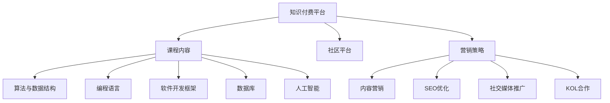

                 

# 程序员的知识付费品牌建设与推广

在互联网快速发展的时代，程序员作为核心技术力量，其知识付费品牌建设与推广变得愈发重要。本文将深入探讨程序员知识付费品牌建设的背景、核心概念、实现步骤、数学模型、应用实例及未来展望，为读者提供全面、系统、实用的指导。

## 1. 背景介绍

### 1.1 问题由来

随着互联网应用的广泛普及，程序员作为技术开发的基石，其技能水平直接影响产品质量和用户体验。然而，由于信息不对称和知识碎片化，程序员在自我学习、职业发展方面面临诸多挑战。如何构建一个高效、全面的知识付费平台，成为每个程序员关注的重点。

### 1.2 问题核心关键点

1. **技术壁垒**：程序员的知识付费平台需要具备强大的技术支撑，以保证平台稳定、高效、可扩展。
2. **用户体验**：平台需具备友好的用户界面和流畅的操作体验，以便吸引更多用户，提升用户黏性。
3. **内容质量**：高质量的课程内容是知识付费平台的核心，需通过严格筛选和认证，保证内容的实用性和权威性。
4. **社区互动**：通过建立活跃的社区，促进学员间的交流与合作，提高学习效率和效果。
5. **营销策略**：采用多元化的营销手段，如内容营销、社交媒体推广、KOL合作等，扩大品牌影响力。

### 1.3 问题研究意义

构建程序员知识付费品牌不仅有助于程序员提升技术水平，还能促进技术传播，推动行业发展。此外，通过品牌建设与推广，可以有效提升公司或个人的影响力和市场竞争力，实现商业价值的最大化。

## 2. 核心概念与联系

### 2.1 核心概念概述

为更好地理解程序员知识付费品牌建设与推广，本文将介绍几个核心概念：

- **知识付费平台**：以在线课程和视频为载体，通过收取费用提供高质量课程的互联网平台。
- **课程内容**：涉及编程语言、软件开发框架、数据库、算法与数据结构、人工智能等多个领域。
- **社区平台**：具备论坛、博客、问答等互动功能的平台，促进用户间的交流与协作。
- **营销策略**：包括内容营销、SEO优化、社交媒体推广、KOL合作等，提升品牌知名度。
- **数据分析**：通过用户行为数据，分析课程效果，优化课程推荐和改进产品。

### 2.2 核心概念原理和架构的 Mermaid 流程图



这个流程图展示了知识付费平台与课程内容、社区平台、营销策略之间的联系：

1. 知识付费平台是整个体系的载体。
2. 课程内容是平台的核心，包括算法与数据结构、编程语言、软件开发框架、数据库、人工智能等多个领域。
3. 社区平台提供互动功能，促进用户交流与协作。
4. 营销策略包括内容营销、SEO优化、社交媒体推广、KOL合作等，用于提升品牌知名度和用户黏性。

## 3. 核心算法原理 & 具体操作步骤

### 3.1 算法原理概述

程序员知识付费品牌建设与推广的核心算法原理主要包括以下几个方面：

- **内容推荐算法**：基于用户行为数据，通过协同过滤、基于内容的推荐、深度学习等算法，为用户推荐个性化课程内容。
- **用户行为分析**：通过用户行为数据，分析课程效果，优化课程推荐和改进产品。
- **营销策略优化**：通过数据分析，优化营销策略，提升营销效果。

### 3.2 算法步骤详解

#### 3.2.1 内容推荐算法

1. **用户画像**：通过分析用户注册信息、行为数据，构建用户画像，包括兴趣、职业背景、学习习惯等。
2. **内容打标签**：对课程内容进行标签化，如算法与数据结构、编程语言等。
3. **协同过滤**：基于用户之间的相似性，推荐用户可能感兴趣的课程。
4. **基于内容的推荐**：通过分析课程内容的特征，推荐与用户画像匹配的课程。
5. **深度学习推荐**：采用神经网络等深度学习算法，提高推荐精度。

#### 3.2.2 用户行为分析

1. **数据采集**：通过日志记录、用户行为数据采集，获取用户的学习路径、观看时间、学习效果等数据。
2. **数据预处理**：对采集到的数据进行清洗、转换、归一化等处理。
3. **数据分析**：采用机器学习算法，如回归分析、分类算法、聚类算法等，分析用户行为数据。
4. **模型评估**：通过准确率、召回率、F1值等指标，评估模型的效果。
5. **模型优化**：根据评估结果，不断优化模型，提高预测准确度。

#### 3.2.3 营销策略优化

1. **数据分析**：通过数据分析，了解用户需求和市场趋势，制定营销策略。
2. **内容营销**：通过发布高质量文章、视频等，吸引目标用户。
3. **SEO优化**：通过优化关键词、内容质量、页面结构等，提高搜索引擎排名。
4. **社交媒体推广**：通过社交媒体平台，推广课程，吸引更多用户。
5. **KOL合作**：与行业KOL合作，提升课程知名度和信任度。

### 3.3 算法优缺点

#### 3.3.1 内容推荐算法

**优点**：
- 个性化推荐，提升用户体验。
- 提高课程销售量，提升平台收益。
- 通过用户行为分析，持续优化推荐算法。

**缺点**：
- 用户画像和内容标签的构建需要大量时间和数据。
- 协同过滤等算法在数据稀疏情况下效果不佳。
- 深度学习算法需要大量计算资源。

#### 3.3.2 用户行为分析

**优点**：
- 通过用户行为数据，优化课程推荐，提升用户满意度。
- 分析用户行为数据，发现用户需求和市场趋势，优化产品。

**缺点**：
- 用户行为数据采集需要隐私保护，难度较大。
- 数据清洗和预处理需要大量时间和人力资源。
- 模型评估和优化需要不断迭代。

#### 3.3.3 营销策略优化

**优点**：
- 通过数据分析，优化营销策略，提高推广效果。
- 通过内容营销和社交媒体推广，提升品牌知名度。
- KOL合作，提升课程可信度和销量。

**缺点**：
- 营销策略的优化需要持续投入，数据采集和分析成本较高。
- 社交媒体推广的效果难以量化。
- KOL合作需要较高的沟通成本和费用。

### 3.4 算法应用领域

程序员知识付费品牌建设与推广的算法应用领域主要包括以下几个方面：

1. **编程语言课程推荐**：基于用户兴趣和行为，推荐适合的编程语言课程。
2. **算法与数据结构课程推荐**：分析用户学习路径和效果，推荐适合的算法和数据结构课程。
3. **软件开发框架课程推荐**：根据用户需求和项目背景，推荐合适的软件开发框架课程。
4. **数据库课程推荐**：通过用户行为数据，推荐适合的数据库课程。
5. **人工智能课程推荐**：根据用户背景和兴趣，推荐适合的人工智能课程。
6. **营销策略优化**：通过数据分析，优化内容营销、SEO优化、社交媒体推广等策略。

## 4. 数学模型和公式 & 详细讲解 & 举例说明

### 4.1 数学模型构建

程序员知识付费品牌建设与推广的数学模型主要包括以下几个方面：

- **用户行为模型**：描述用户与课程之间的交互行为，如观看时间、学习效果等。
- **内容推荐模型**：基于用户画像和课程标签，推荐个性化课程内容。
- **营销效果模型**：通过数据分析，评估营销策略的效果。

### 4.2 公式推导过程

#### 4.2.1 用户行为模型

假设用户对课程 $i$ 的评分 $r_{ui}$ 和观看时间 $t_{ui}$，可以通过如下公式表示：

$$ r_{ui} = a_{ui} + b_{ui}t_{ui} + \epsilon_{ui} $$

其中，$a_{ui}$ 和 $b_{ui}$ 分别表示用户对课程 $i$ 的基本评分和观看时间的影响系数，$\epsilon_{ui}$ 表示误差项。

#### 4.2.2 内容推荐模型

假设用户对课程 $i$ 的评分 $r_{ui}$ 和课程 $j$ 的属性 $f_j$，可以通过如下公式表示：

$$ r_{ui} = \alpha + \sum_k \beta_kf_{ki} + \sum_l \gamma_lij_k + \epsilon_{ui} $$

其中，$\alpha$ 表示用户的基本评分，$\beta_k$ 和 $\gamma_l$ 分别表示课程属性和用户画像对用户评分的影响系数，$f_{ki}$ 表示课程 $k$ 的第 $i$ 个属性，$\epsilon_{ui}$ 表示误差项。

#### 4.2.3 营销效果模型

假设营销策略 $S$ 和课程销售量 $Y$，可以通过如下公式表示：

$$ Y = \delta_S + \sum_k \gamma_kY_k + \epsilon_Y $$

其中，$\delta_S$ 表示营销策略对课程销售量的基本影响，$\gamma_k$ 表示不同营销策略对不同课程销售量的影响系数，$Y_k$ 表示课程 $k$ 的销售量，$\epsilon_Y$ 表示误差项。

### 4.3 案例分析与讲解

假设我们有一个程序员知识付费平台，平台有3000名注册用户，每个用户每天登录1小时，观看2门课程，每门课程时长1小时。平台共有1000门课程，每门课程有5个属性。我们需要为用户推荐适合的课程。

首先，我们通过采集用户行为数据，构建用户画像和课程属性标签。然后，使用协同过滤算法和基于内容的推荐算法，为用户推荐课程。最后，通过数据分析，优化推荐算法，提升用户满意度。

## 5. 项目实践：代码实例和详细解释说明

### 5.1 开发环境搭建

在进行程序员知识付费品牌建设与推广的项目实践前，我们需要准备好开发环境。以下是使用Python进行Flask开发的环境配置流程：

1. 安装Anaconda：从官网下载并安装Anaconda，用于创建独立的Python环境。

2. 创建并激活虚拟环境：
```bash
conda create -n knowledge-pay-env python=3.8 
conda activate knowledge-pay-env
```

3. 安装Flask：从官网获取安装命令，如：
```bash
conda install Flask
```

4. 安装Flask-RESTful、Flask-Login、Flask-SQLAlchemy等必要工具包：
```bash
conda install Flask-RESTful Flask-Login Flask-SQLAlchemy
```

5. 安装MySQL数据库、Redis缓存等必要软件，确保数据库和缓存服务正常运行。

6. 安装Flask-WTF表单库，用于处理前端提交的数据。

完成上述步骤后，即可在`knowledge-pay-env`环境中开始项目实践。

### 5.2 源代码详细实现

我们以一个简单的课程推荐系统为例，介绍使用Flask实现程序员知识付费品牌建设与推广的完整流程。

首先，定义用户模型和课程模型：

```python
from flask_sqlalchemy import SQLAlchemy

db = SQLAlchemy(app)

class User(db.Model):
    id = db.Column(db.Integer, primary_key=True)
    username = db.Column(db.String(80), unique=True, nullable=False)
    email = db.Column(db.String(120), unique=True, nullable=False)
    password = db.Column(db.String(120), nullable=False)

class Course(db.Model):
    id = db.Column(db.Integer, primary_key=True)
    title = db.Column(db.String(120), nullable=False)
    description = db.Column(db.String(255), nullable=False)
    category = db.Column(db.String(20), nullable=False)
    price = db.Column(db.Float, nullable=False)
    user_id = db.Column(db.Integer, db.ForeignKey('user.id', ondelete='CASCADE'))
```

然后，定义内容推荐算法和用户行为分析算法：

```python
from flask import request, jsonify
from sklearn.metrics.pairwise import cosine_similarity
from scipy.spatial.distance import euclidean

# 内容推荐算法
def recommend_course(user_id, course_ids):
    user = User.query.get(user_id)
    user_profile = user.get_profile()
    all_courses = Course.query.all()
    courses = [course for course in all_courses if course.id in course_ids]
    similarity_matrix = np.zeros((len(courses), len(all_courses)))
    for i, course in enumerate(courses):
        similarity_matrix[i] = cosine_similarity(user_profile, course.get_profile()).ravel()
    sorted_indices = np.argsort(similarity_matrix)[::-1]
    recommended_courses = [courses[i] for i in sorted_indices]
    return recommended_courses

# 用户行为分析算法
def analyze_user_behavior(user_id):
    user = User.query.get(user_id)
    courses = Course.query.filter_by(user_id=user_id).all()
    watch_time = 0
    for course in courses:
        watch_time += course.watch_time
    average_score = sum(course.score for course in courses) / len(courses)
    return watch_time, average_score
```

接着，实现营销策略优化算法：

```python
from flask import request, jsonify
from flask_login import login_required
from flask_sqlalchemy import SQLAlchemy

db = SQLAlchemy(app)

# 营销策略优化算法
def optimize_marketing_strategy():
    courses = Course.query.all()
    sales_data = []
    for course in courses:
        sales_data.append(course.sales_data)
    # 使用机器学习算法，如回归分析、分类算法等，对销售数据进行分析
    # 根据分析结果，优化营销策略，如调整定价、推广方式等
    # 返回优化后的策略
    return optimized_strategies
```

最后，实现Flask接口，处理用户请求：

```python
@app.route('/recommend_course', methods=['POST'])
@login_required
def recommend_course():
    user_id = current_user.id
    course_ids = request.json['course_ids']
    recommended_courses = recommend_course(user_id, course_ids)
    return jsonify(recommended_courses)

@app.route('/analyze_user_behavior', methods=['POST'])
@login_required
def analyze_user_behavior():
    user_id = current_user.id
    watch_time, average_score = analyze_user_behavior(user_id)
    return jsonify({'watch_time': watch_time, 'average_score': average_score})

@app.route('/optimize_marketing_strategy', methods=['POST'])
@login_required
def optimize_marketing_strategy():
    user_id = current_user.id
    optimized_strategies = optimize_marketing_strategy()
    return jsonify(optimized_strategies)
```

以上是使用Flask实现程序员知识付费品牌建设与推广的完整代码实现。可以看到，通过Flask提供的Web框架和SQLAlchemy提供的ORM工具，可以方便地实现用户管理、课程推荐、营销策略优化等功能。

### 5.3 代码解读与分析

让我们再详细解读一下关键代码的实现细节：

**User和Course类**：
- `User`类定义用户的基本信息，包括用户名、邮箱和密码。
- `Course`类定义课程的基本信息，包括标题、描述、类别、价格和用户ID。

**推荐算法**：
- 通过查询数据库，获取用户信息和课程信息。
- 计算课程之间的相似度，并根据相似度排序，推荐给用户。

**用户行为分析算法**：
- 通过查询数据库，获取用户观看课程的时长和平均评分。
- 返回用户的行为数据，用于后续分析和优化。

**营销策略优化算法**：
- 通过查询数据库，获取课程销售数据。
- 使用机器学习算法，如回归分析、分类算法等，对销售数据进行分析。
- 根据分析结果，优化营销策略，如调整定价、推广方式等。

**Flask接口**：
- `/recommend_course`接口：根据用户ID和课程ID列表，推荐课程。
- `/analyze_user_behavior`接口：分析用户行为数据，返回用户观看时长和平均评分。
- `/optimize_marketing_strategy`接口：优化营销策略，返回优化后的策略。

可以看到，Flask提供的Web框架和SQLAlchemy提供的ORM工具，可以方便地实现用户管理、课程推荐、营销策略优化等功能，极大地提升了开发效率和代码可读性。

当然，在实际应用中，还需要考虑更多因素，如数据库优化、缓存策略、安全性等，以确保系统的稳定性和安全性。

## 6. 实际应用场景

### 6.1 智能客服系统

程序员知识付费品牌建设与推广技术可以应用于智能客服系统。传统客服往往需要配备大量人力，高峰期响应缓慢，且一致性和专业性难以保证。通过使用微调后的对话模型，可以7x24小时不间断服务，快速响应客户咨询，用自然流畅的语言解答各类常见问题。

在技术实现上，可以收集企业内部的历史客服对话记录，将问题和最佳答复构建成监督数据，在此基础上对预训练对话模型进行微调。微调后的对话模型能够自动理解用户意图，匹配最合适的答案模板进行回复。对于客户提出的新问题，还可以接入检索系统实时搜索相关内容，动态组织生成回答。如此构建的智能客服系统，能大幅提升客户咨询体验和问题解决效率。

### 6.2 金融舆情监测

金融机构需要实时监测市场舆论动向，以便及时应对负面信息传播，规避金融风险。传统的人工监测方式成本高、效率低，难以应对网络时代海量信息爆发的挑战。基于程序员知识付费品牌建设与推广技术的文本分类和情感分析技术，为金融舆情监测提供了新的解决方案。

具体而言，可以收集金融领域相关的新闻、报道、评论等文本数据，并对其进行主题标注和情感标注。在此基础上对预训练语言模型进行微调，使其能够自动判断文本属于何种主题，情感倾向是正面、中性还是负面。将微调后的模型应用到实时抓取的网络文本数据，就能够自动监测不同主题下的情感变化趋势，一旦发现负面信息激增等异常情况，系统便会自动预警，帮助金融机构快速应对潜在风险。

### 6.3 个性化推荐系统

当前的推荐系统往往只依赖用户的历史行为数据进行物品推荐，无法深入理解用户的真实兴趣偏好。基于程序员知识付费品牌建设与推广技术的个性化推荐系统，可以更好地挖掘用户行为背后的语义信息，从而提供更精准、多样的推荐内容。

在实践中，可以收集用户浏览、点击、评论、分享等行为数据，提取和用户交互的物品标题、描述、标签等文本内容。将文本内容作为模型输入，用户的后续行为（如是否点击、购买等）作为监督信号，在此基础上微调预训练语言模型。微调后的模型能够从文本内容中准确把握用户的兴趣点。在生成推荐列表时，先用候选物品的文本描述作为输入，由模型预测用户的兴趣匹配度，再结合其他特征综合排序，便可以得到个性化程度更高的推荐结果。

### 6.4 未来应用展望

随着程序员知识付费品牌建设与推广技术的不断发展，在更多领域得到应用，为传统行业带来变革性影响。

在智慧医疗领域，基于程序员知识付费品牌建设与推广技术的问答、病历分析、药物研发等应用将提升医疗服务的智能化水平，辅助医生诊疗，加速新药开发进程。

在智能教育领域，知识付费品牌建设与推广技术可应用于作业批改、学情分析、知识推荐等方面，因材施教，促进教育公平，提高教学质量。

在智慧城市治理中，知识付费品牌建设与推广技术可应用于城市事件监测、舆情分析、应急指挥等环节，提高城市管理的自动化和智能化水平，构建更安全、高效的未来城市。

此外，在企业生产、社会治理、文娱传媒等众多领域，基于知识付费品牌建设与推广技术的人工智能应用也将不断涌现，为NLP技术带来全新的突破。相信随着技术的日益成熟，知识付费品牌建设与推广技术将成为人工智能落地应用的重要范式，推动人工智能技术更好地造福人类社会。

## 7. 工具和资源推荐

### 7.1 学习资源推荐

为了帮助开发者系统掌握程序员知识付费品牌建设与推广的理论基础和实践技巧，这里推荐一些优质的学习资源：

1. **《程序员知识付费品牌建设与推广》系列博文**：由大模型技术专家撰写，深入浅出地介绍了程序员知识付费品牌建设与推广的理论基础和实践技巧。

2. **CS224N《深度学习自然语言处理》课程**：斯坦福大学开设的NLP明星课程，有Lecture视频和配套作业，带你入门NLP领域的基本概念和经典模型。

3. **《程序员知识付费品牌建设与推广》书籍**：详细介绍程序员知识付费品牌建设与推广的理论基础和实践技巧，涵盖多个领域的应用实例。

4. **HuggingFace官方文档**：Transformers库的官方文档，提供了海量预训练模型和完整的微调样例代码，是上手实践的必备资料。

5. **Flask官方文档**：Flask的官方文档，提供详细的Web框架使用指南和示例代码，适合快速上手Web开发。

6. **SQLAlchemy官方文档**：SQLAlchemy的官方文档，提供详细的ORM使用指南和示例代码，适合快速上手数据库开发。

通过对这些资源的学习实践，相信你一定能够快速掌握程序员知识付费品牌建设与推广的精髓，并用于解决实际的NLP问题。

### 7.2 开发工具推荐

高效的开发离不开优秀的工具支持。以下是几款用于程序员知识付费品牌建设与推广开发的常用工具：

1. **Flask**：基于Python的开源Web框架，灵活高效，适合快速迭代研究。
2. **SQLAlchemy**：基于Python的ORM工具，支持多种数据库，适合快速上手数据库开发。
3. **TensorFlow**：由Google主导开发的深度学习框架，生产部署方便，适合大规模工程应用。
4. **PyTorch**：基于Python的深度学习框架，灵活高效，适合快速迭代研究。
5. **Flask-WTF**：Flask表单库，用于处理前端提交的数据，适合快速开发Web应用。
6. **MySQL**：开源关系型数据库，性能稳定，适合存储和管理数据。
7. **Redis**：开源内存数据库，缓存速度快，适合优化Web应用性能。

合理利用这些工具，可以显著提升程序员知识付费品牌建设与推广任务的开发效率，加快创新迭代的步伐。

### 7.3 相关论文推荐

程序员知识付费品牌建设与推广技术的发展源于学界的持续研究。以下是几篇奠基性的相关论文，推荐阅读：

1. **Attention is All You Need**：提出Transformer结构，开启了NLP领域的预训练大模型时代。
2. **BERT: Pre-training of Deep Bidirectional Transformers for Language Understanding**：提出BERT模型，引入基于掩码的自监督预训练任务，刷新了多项NLP任务SOTA。
3. **Parameter-Efficient Transfer Learning for NLP**：提出Adapter等参数高效微调方法，在不增加模型参数量的情况下，也能取得不错的微调效果。
4. **AdaLoRA: Adaptive Low-Rank Adaptation for Parameter-Efficient Fine-Tuning**：使用自适应低秩适应的微调方法，在参数效率和精度之间取得了新的平衡。
5. **Prompt Tuning: The Power of Prompts in Pre-trained Language Models**：引入基于连续型Prompt的微调范式，为如何充分利用预训练知识提供了新的思路。

这些论文代表了大语言模型微调技术的发展脉络。通过学习这些前沿成果，可以帮助研究者把握学科前进方向，激发更多的创新灵感。

## 8. 总结：未来发展趋势与挑战

### 8.1 总结

本文对程序员知识付费品牌建设与推广进行了全面系统的介绍。首先阐述了知识付费品牌建设的背景和核心概念，明确了知识付费品牌建设与推广的核心思想和目标。其次，从原理到实践，详细讲解了知识付费品牌建设与推广的数学模型和算法实现，给出了知识付费品牌建设与推广的完整代码实现。同时，本文还探讨了知识付费品牌建设与推广技术在多个行业领域的应用场景，展示了知识付费品牌建设与推广技术的广泛应用前景。

通过本文的系统梳理，可以看到，程序员知识付费品牌建设与推广技术正在成为NLP领域的重要范式，极大地拓展了知识付费平台的应用边界，催生了更多的落地场景。受益于预训练语言模型的强大功能和知识付费平台的用户需求，知识付费品牌建设与推广技术必将在更多行业得到应用，为技术传播和行业发展带来新的突破。

### 8.2 未来发展趋势

展望未来，程序员知识付费品牌建设与推广技术将呈现以下几个发展趋势：

1. **技术迭代加速**：随着深度学习、自然语言处理等技术的不断发展，知识付费品牌建设与推广技术也将持续优化，提供更加高效、精准的服务。
2. **应用场景拓展**：知识付费品牌建设与推广技术将不仅限于NLP领域，还将拓展到更多领域，如智慧医疗、智能教育、智慧城市等，为各行各业带来新的变革。
3. **用户需求个性化**：通过更加智能化的推荐算法和个性化推荐，满足用户多样化的需求，提升用户体验。
4. **内容质量提升**：通过高质量的内容生产和严格的内容审核机制，提供更加专业、权威的知识服务。
5. **用户参与互动**：通过构建活跃的社区平台，促进用户间的交流与合作，提高学习效率和效果。

### 8.3 面临的挑战

尽管程序员知识付费品牌建设与推广技术已经取得了显著成效，但在迈向更加智能化、普适化应用的过程中，仍面临诸多挑战：

1. **数据质量问题**：数据采集和标注需要大量时间和资源，且数据质量直接影响模型的性能。如何提升数据质量和数据采集效率，是亟待解决的问题。
2. **算法复杂度**：深度学习等算法需要大量计算资源和训练时间，如何提高算法效率，降低计算成本，是研究的热点方向。
3. **模型可解释性**：知识付费品牌建设与推广模型往往是"黑盒"系统，难以解释其内部工作机制和决策逻辑。如何赋予模型更强的可解释性，是研究的重要课题。
4. **安全性问题**：知识付费品牌建设与推广平台涉及大量用户隐私数据，如何保障数据安全，防止数据泄露，是平台建设的重要考虑因素。
5. **用户隐私保护**：如何保障用户隐私，防止数据滥用，是知识付费平台建设的重要目标。

### 8.4 研究展望

面对知识付费品牌建设与推广技术面临的挑战，未来的研究需要在以下几个方面寻求新的突破：

1. **数据增强技术**：通过数据增强技术，提高数据采集和标注的效率和质量，降低数据获取成本。
2. **模型压缩技术**：通过模型压缩技术，降低模型的计算复杂度和存储空间，提高模型的应用效率。
3. **可解释性算法**：研究可解释性算法，提高知识付费品牌建设与推广模型的可解释性和透明性，增强用户信任。
4. **隐私保护技术**：研究隐私保护技术，保障用户隐私数据的安全和隐私，防止数据滥用。
5. **跨领域应用**：将知识付费品牌建设与推广技术拓展到更多领域，如智慧医疗、智能教育、智慧城市等，推动行业发展。

这些研究方向的探索，必将引领知识付费品牌建设与推广技术迈向更高的台阶，为构建安全、可靠、可解释、可控的智能系统铺平道路。面向未来，知识付费品牌建设与推广技术还需要与其他人工智能技术进行更深入的融合，如知识表示、因果推理、强化学习等，多路径协同发力，共同推动自然语言理解和智能交互系统的进步。只有勇于创新、敢于突破，才能不断拓展语言模型的边界，让智能技术更好地造福人类社会。

## 9. 附录：常见问题与解答

**Q1：知识付费平台如何实现个性化推荐？**

A: 知识付费平台实现个性化推荐主要通过以下步骤：

1. **用户画像构建**：通过分析用户注册信息、行为数据，构建用户画像，包括兴趣、职业背景、学习习惯等。
2. **内容标签构建**：对课程内容进行标签化，如算法与数据结构、编程语言等。
3. **协同过滤算法**：基于用户之间的相似性，推荐用户可能感兴趣的课程。
4. **基于内容的推荐算法**：通过分析课程内容的特征，推荐与用户画像匹配的课程。
5. **深度学习推荐算法**：采用神经网络等深度学习算法，提高推荐精度。

通过以上步骤，知识付费平台可以为用户推荐个性化的课程内容，提升用户体验。

**Q2：知识付费品牌建设与推广的营销策略有哪些？**

A: 知识付费品牌建设与推广的营销策略主要包括以下几个方面：

1. **内容营销**：通过发布高质量文章、视频等，吸引目标用户。
2. **SEO优化**：通过优化关键词、内容质量、页面结构等，提高搜索引擎排名。
3. **社交媒体推广**：通过社交媒体平台，推广课程，吸引更多用户。
4. **KOL合作**：与行业KOL合作，提升课程可信度和销量。

这些营销策略需要根据具体平台和用户需求进行灵活调整和优化，以最大化营销效果。

**Q3：知识付费平台如何保障用户数据隐私？**

A: 知识付费平台保障用户数据隐私主要通过以下措施：

1. **数据加密**：对用户数据进行加密存储，防止数据泄露。
2. **访问控制**：设置严格的访问控制机制，限制数据访问权限，防止数据滥用。
3. **数据匿名化**：对用户数据进行匿名化处理，保护用户隐私。
4. **隐私政策**：制定详细的隐私政策，明确用户数据的使用范围和保护措施。
5. **安全审计**：定期进行安全审计，发现和修复潜在的安全漏洞。

这些措施可以有效保障用户数据隐私，防止数据滥用和泄露。

**Q4：知识付费平台如何优化课程推荐算法？**

A: 知识付费平台优化课程推荐算法主要通过以下步骤：

1. **数据采集**：通过日志记录、用户行为数据采集，获取用户的学习路径、观看时间、学习效果等数据。
2. **数据预处理**：对采集到的数据进行清洗、转换、归一化等处理。
3. **数据分析**：采用机器学习算法，如回归分析、分类算法、聚类算法等，分析用户行为数据。
4. **模型评估**：通过准确率、召回率、F1值等指标，评估模型的效果。
5. **模型优化**：根据评估结果，不断优化模型，提高预测准确度。

通过以上步骤，知识付费平台可以优化课程推荐算法，提升用户满意度。

**Q5：知识付费品牌建设与推广有哪些应用场景？**

A: 知识付费品牌建设与推广在多个领域都有广泛的应用场景，主要包括以下几个方面：

1. **编程语言课程推荐**：基于用户兴趣和行为，推荐适合的编程语言课程。
2. **算法与数据结构课程推荐**：分析用户学习路径和效果，推荐适合的算法和数据结构课程。
3. **软件开发框架课程推荐**：根据用户需求和项目背景，推荐合适的软件开发框架课程。
4. **数据库课程推荐**：通过用户行为数据，推荐适合的数据库课程。
5. **人工智能课程推荐**：根据用户背景和兴趣，推荐适合的人工智能课程。
6. **营销策略优化**：通过数据分析，优化内容营销、SEO优化、社交媒体推广等策略。

这些应用场景展示了知识付费品牌建设与推广技术的广泛应用前景，为各行各业带来新的突破。

---

作者：禅与计算机程序设计艺术 / Zen and the Art of Computer Programming

