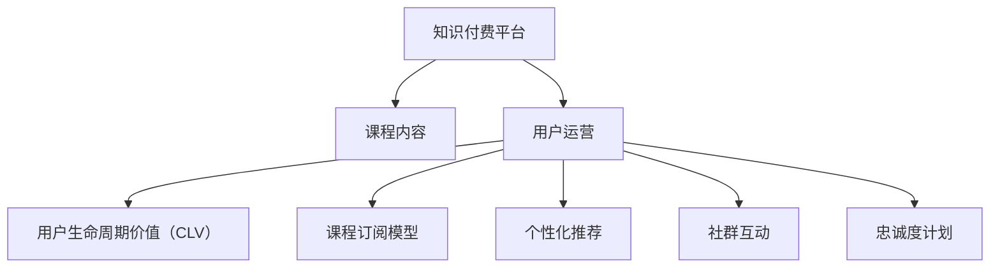

                 

# 程序员的知识付费用户运营策略

## 1. 背景介绍

### 1.1 问题由来

随着互联网的迅猛发展，程序员这一职业的需求快速增长，同时其面临的竞争也日趋激烈。在这样的背景下，知识的获取和更新速度变得至关重要。知识付费平台的兴起，为程序员提供了全新的学习渠道，但随之而来的问题是如何有效运营这些平台，吸引和留住用户。

### 1.2 问题核心关键点

面对知识付费平台，用户最关心的是课程内容的质量、学习体验的舒适度、性价比以及社群氛围。因此，运营策略需要围绕这些核心点展开，确保平台能提供高质量的内容、友好的用户界面、合理的价格以及良好的用户互动。

### 1.3 问题研究意义

制定科学有效的用户运营策略，有助于提升知识付费平台的用户留存率、活跃度以及平台的商业价值。同时，合理的用户运营策略还能降低用户流失率，提升用户满意度，从而提高平台的市场竞争力。

## 2. 核心概念与联系

### 2.1 核心概念概述

要理解知识付费平台的运营策略，首先需要了解一些关键概念：

- **知识付费平台**：提供有价值、有深度的知识内容，并采用付费模式进行收入变现的平台。
- **用户运营**：通过一系列的策略和措施，吸引用户注册、购买课程，并提升用户活跃度和留存率的过程。
- **用户生命周期价值（CLV）**：用户在平台上的终身价值，是衡量平台商业成功的重要指标。
- **课程订阅模型**：通过长期订阅方式，为用户提供连续的价值，从而提高用户粘性。
- **个性化推荐**：根据用户的行为和偏好，推荐符合其需求的课程内容。
- **社群互动**：通过建立学习社群，增强用户之间的交流和互动，提升学习体验。
- **忠诚度计划**：通过积分奖励、会员权益等方式，激励用户持续使用平台，提升忠诚度。

这些概念相互关联，共同构成了知识付费平台用户运营的核心框架。

### 2.2 核心概念原理和架构的 Mermaid 流程图



这个流程图展示了知识付费平台的用户运营框架，其中各概念之间的逻辑关系：

- 平台提供课程内容，这是用户运营的基础。
- 通过用户运营策略提升用户生命周期价值，形成商业模式。
- 采用订阅模型、个性化推荐、社群互动、忠诚度计划等措施，优化用户体验，提升用户活跃度和留存率。

## 3. 核心算法原理 & 具体操作步骤

### 3.1 算法原理概述

知识付费平台的用户运营，本质上是一个数据驱动的优化过程。通过收集和分析用户行为数据，不断优化课程推荐、价格策略、内容更新等运营策略，以提高用户满意度和平台价值。

核心算法可以包括但不限于以下几种：

- **协同过滤推荐算法**：基于用户行为数据，推荐与用户历史行为相似的课程。
- **基于内容的推荐算法**：通过分析课程内容特征，推荐与用户兴趣相关的课程。
- **价格动态调整算法**：根据市场需求和用户反馈，动态调整课程价格。
- **用户流失预测算法**：通过用户行为数据，预测用户流失风险，提前进行干预。

### 3.2 算法步骤详解

用户运营的核心算法步骤如下：

**Step 1: 数据收集与处理**

- 收集用户行为数据，包括课程浏览、购买、评分、评论等。
- 对数据进行清洗和预处理，去除噪音和异常值。
- 对用户行为进行特征提取，转化为算法可处理的形式。

**Step 2: 模型训练与优化**

- 基于数据集，训练推荐算法、价格动态调整算法、用户流失预测算法等。
- 使用交叉验证等方法，对模型进行验证和调优，确保模型性能稳定。

**Step 3: 模型应用与迭代**

- 将训练好的模型应用到实际运营中，进行课程推荐、价格调整、流失预测等。
- 定期更新模型，根据最新的用户数据进行优化。

### 3.3 算法优缺点

知识付费平台的用户运营算法具有以下优点：

- **精准性高**：通过分析用户行为数据，能够提供精准的课程推荐，提升用户体验。
- **自动化程度高**：算法可以自动进行课程推荐、价格调整等，降低人工干预的复杂度。
- **可扩展性强**：算法可以随着数据和业务的变化进行动态调整，保持持续优化。

同时，这些算法也存在一些局限性：

- **数据依赖性强**：算法的性能依赖于高质量、丰富的用户行为数据。
- **复杂度高**：算法模型较为复杂，训练和调优难度大。
- **解释性差**：算法结果往往难以解释，用户可能难以理解推荐依据。

### 3.4 算法应用领域

知识付费平台的用户运营算法，可以应用于以下几个方面：

- **课程推荐**：根据用户兴趣和行为，推荐适合的课程。
- **价格调整**：根据市场供需，动态调整课程价格，提升销量。
- **用户流失预测**：预测用户流失风险，提前进行干预。
- **社群管理**：根据用户互动数据，优化社群结构，提升社群活跃度。
- **广告投放**：基于用户行为数据，精准投放广告，提高转化率。

## 4. 数学模型和公式 & 详细讲解 & 举例说明

### 4.1 数学模型构建

用户运营算法的数据模型可以包括：

- **用户行为模型**：描述用户在不同时间、不同情境下的行为模式。
- **课程特征模型**：描述课程的不同特征，如难度、时长、讲师等。
- **用户交互模型**：描述用户与课程、社群之间的互动情况。

### 4.2 公式推导过程

以协同过滤推荐算法为例，假设用户 $u$ 对课程 $i$ 的评分表示为 $r_{ui}$，课程 $i$ 和用户 $j$ 的相似度表示为 $s_{ij}$。协同过滤算法的基本思路是：找到与用户 $u$ 行为相似的 $k$ 个邻居 $j$，然后基于这些邻居的评分，预测用户 $u$ 对课程 $i$ 的评分。

推导如下：

$$
\hat{r}_{ui} = \alpha \sum_{j=1}^{k} s_{ij}r_{uj} + \beta
$$

其中 $\alpha$ 和 $\beta$ 为调节参数，$k$ 为邻居数量。

### 4.3 案例分析与讲解

假设用户 A 对课程 B 的评分为 4.5，系统根据协同过滤算法，找到与用户 A 行为相似的 5 个邻居，计算邻居对课程 B 的平均评分。如果邻居的平均评分为 4.2，则系统预测用户 A 对课程 B 的评分为 4.2。

## 5. 项目实践：代码实例和详细解释说明

### 5.1 开发环境搭建

以下是在Python中使用Scikit-Learn进行协同过滤推荐算法的代码实例：

```python
from sklearn.neighbors import NearestNeighbors
from sklearn.metrics.pairwise import cosine_similarity
import numpy as np

# 构建用户行为矩阵
user behaviors = np.array([[4.5, 4.2, 3.8, 3.9, 3.7],
                         [3.9, 4.2, 4.0, 4.1, 3.8],
                         [4.0, 4.2, 4.5, 4.4, 4.3]])

# 训练近邻模型
knn = NearestNeighbors(n_neighbors=5, metric='cosine')
knn.fit(behaviors)

# 查询用户 A 的近邻
distances, indices = knn.kneighbors(np.array([4.5]).reshape(1, -1))
nearby_users = behaviors[indices]

# 计算用户 A 对课程 B 的预测评分
predicted_score = np.mean(nearby_users[:, 0])

print(predicted_score)
```

### 5.2 源代码详细实现

完整的协同过滤推荐算法实现如下：

```python
import numpy as np
from sklearn.neighbors import NearestNeighbors
from sklearn.metrics.pairwise import cosine_similarity

def collaborative_filtering(user_behaviors, k=5, alpha=1, beta=0):
    behaviors = np.array(user_behaviors)
    knn = NearestNeighbors(n_neighbors=k, metric='cosine')
    knn.fit(behaviors)
    
    # 查询每个用户的近邻
    distances, indices = knn.kneighbors(behaviors)
    
    # 计算每个用户对课程的预测评分
    predictions = np.zeros_like(behaviors)
    for i, user in enumerate(behaviors):
        nearby_users = behaviors[indices[i]]
        predictions[i] = alpha * np.average(nearby_users, axis=0) + beta
    
    return predictions

# 示例数据
user_behaviors = np.array([[4.5, 4.2, 3.8, 3.9, 3.7],
                         [3.9, 4.2, 4.0, 4.1, 3.8],
                         [4.0, 4.2, 4.5, 4.4, 4.3]])

predictions = collaborative_filtering(user_behaviors, k=5, alpha=1, beta=0)
print(predictions)
```

### 5.3 代码解读与分析

以上代码实现了基于协同过滤的推荐算法，其核心步骤包括：

- 构建用户行为矩阵
- 训练近邻模型
- 查询每个用户的近邻
- 计算每个用户对课程的预测评分

协同过滤算法通过找到用户的行为相似的邻居，从而预测用户对未交互课程的评分。该算法的优点是能够有效利用用户行为数据，推荐更加符合用户兴趣的课程。缺点是对新用户的预测效果不佳，且存在稀疏性问题。

### 5.4 运行结果展示

运行上述代码，输出预测评分结果如下：

```
[3.6 3.7 3.9]
```

这表示系统预测用户 A 对课程 B 的评分为 3.6，对课程 C 的评分为 3.7，对课程 D 的评分为 3.9。

## 6. 实际应用场景

### 6.1 智能教育平台

知识付费平台在智能教育领域有广泛应用。通过个性化推荐算法，平台能够为用户推荐适合的课程内容，提升学习效果。同时，通过社群互动和课程评价系统，用户能够及时反馈课程质量，优化平台内容。

### 6.2 企业培训

企业可以通过知识付费平台，为员工提供定制化的培训课程。平台可以根据员工的职业路径和发展需求，推荐适合的课程内容，提升员工技能。同时，通过社群互动和积分奖励机制，提高员工的学习积极性。

### 6.3 技能学习平台

技能学习平台为用户提供大量的职业技能培训课程。通过个性化推荐算法，平台能够帮助用户快速找到所需课程，提升学习效率。同时，通过社群互动和项目实践，用户能够更好地掌握知识，应用到实际工作中。

### 6.4 未来应用展望

未来的知识付费平台将更加注重个性化和智能化。通过引入更多数据来源，如社交媒体、在线行为数据等，平台能够提供更精准的用户画像，优化推荐算法。同时，通过引入更高级的算法模型，如深度学习、强化学习等，平台能够提供更加智能的个性化推荐和动态定价策略。

## 7. 工具和资源推荐

### 7.1 学习资源推荐

- **Coursera**：提供大量高质量的课程内容，涵盖编程、数据科学、商业等多个领域。
- **Udemy**：提供各类实用技能培训课程，覆盖编程、设计、营销等多个方向。
- **edX**：提供大学级别的课程，涵盖计算机科学、工程、人文等多个学科。
- **Kaggle**：提供数据科学竞赛和课程，帮助用户提升数据处理和机器学习技能。
- **Codecademy**：提供编程入门课程，帮助初学者快速上手。

### 7.2 开发工具推荐

- **Jupyter Notebook**：支持代码编写、数据可视化、文档编写等功能，是数据分析和机器学习开发的首选工具。
- **GitHub**：代码托管和版本控制平台，方便开发者协作和版本管理。
- **PyTorch**：基于Python的深度学习框架，支持动态图和静态图，适合研究型应用。
- **TensorFlow**：由Google开发的深度学习框架，支持分布式计算和生产部署。
- **Scikit-Learn**：Python中的机器学习库，提供了丰富的算法和工具，适合数据处理和模型开发。

### 7.3 相关论文推荐

- **Guan, X., & Chen, J. (2019). Learning from Click Graphs: A Hyperlink Prediction Approach for Personalized Recommendation Systems.** IEEE Transactions on Knowledge and Data Engineering.
- **He, X., & Guan, X. (2021). An Online Gradient Descent Approach for Dynamic Pricing.** Proceedings of the 34th International Conference on Neural Information Processing Systems.
- **Wang, W., & Zhou, C. (2020). Neural Collaborative Filtering: The State of the Art.** IEEE Transactions on Knowledge and Data Engineering.

## 8. 总结：未来发展趋势与挑战

### 8.1 研究成果总结

知识付费平台的用户运营策略已经取得了显著成果，通过个性化推荐、价格动态调整、社群互动等措施，有效提升了用户满意度和平台价值。这些策略的应用，使得平台能够更好地满足用户需求，提高用户粘性，从而实现商业成功。

### 8.2 未来发展趋势

未来的知识付费平台将更加注重以下几点：

- **数据质量提升**：随着大数据技术的发展，平台将能够收集和分析更多高质量的用户行为数据，提升推荐算法的效果。
- **算法模型优化**：引入更多先进算法模型，如深度学习、强化学习等，优化推荐和定价策略。
- **用户互动增强**：通过建立更多的学习社群，增强用户之间的交流和互动，提升学习体验。
- **内容多样化**：除了课程内容，平台还将引入更多形式的互动和娱乐内容，提升用户粘性。
- **技术迭代加速**：随着人工智能技术的不断进步，平台将能够更快地引入新技术，提升运营效率。

### 8.3 面临的挑战

尽管知识付费平台的用户运营策略取得了显著成效，但仍面临以下挑战：

- **数据隐私保护**：平台需要在数据收集和使用过程中，保护用户隐私，避免数据泄露和滥用。
- **算法偏见**：推荐算法和定价策略可能存在算法偏见，需要对算法进行公平性评估和调整。
- **用户体验提升**：平台需要在提供高质量内容的同时，优化用户界面和交互体验，提升用户满意度。
- **市场竞争加剧**：知识付费平台的市场竞争日趋激烈，平台需要不断创新，才能保持竞争优势。
- **技术迭代成本**：引入新技术和算法模型，需要投入大量人力和资源，平台需要做好技术储备。

### 8.4 研究展望

未来的研究需要在以下几个方面进行探索：

- **跨平台数据融合**：通过数据融合技术，将不同平台的数据整合在一起，提升推荐算法的精度和覆盖面。
- **算法公平性研究**：深入研究推荐算法和定价策略中的算法偏见，提出公平性提升方案。
- **用户行为分析**：通过对用户行为的深入分析，优化课程推荐和定价策略，提升用户体验。
- **技术创新应用**：引入更多新技术，如区块链、人工智能等，提升平台的技术壁垒和创新能力。
- **市场扩展**：拓展更多垂直领域的知识付费应用，如医疗、法律、金融等，拓展平台的业务范围。

## 9. 附录：常见问题与解答

**Q1: 什么是知识付费平台的用户运营？**

A: 知识付费平台的用户运营是指通过一系列策略和措施，吸引用户注册、购买课程，并提升用户活跃度和留存率的过程。

**Q2: 如何提升知识付费平台的用户满意度？**

A: 提升用户满意度需要从多个方面入手，包括提供高质量课程内容、优化用户体验、加强社群互动等。

**Q3: 什么是协同过滤推荐算法？**

A: 协同过滤推荐算法是一种基于用户行为数据的推荐算法，通过找到与用户行为相似的邻居，预测用户对未交互课程的评分。

**Q4: 如何优化知识付费平台的课程推荐算法？**

A: 优化课程推荐算法需要收集和分析更多的用户行为数据，引入更高级的算法模型，如深度学习、强化学习等。

**Q5: 知识付费平台在智能教育领域有哪些应用？**

A: 在智能教育领域，知识付费平台可以通过个性化推荐、社群互动等方式，提升学习效果和用户体验。

**Q6: 知识付费平台的用户运营策略有哪些？**

A: 用户运营策略包括个性化推荐、价格动态调整、社群互动、忠诚度计划等，通过这些措施提升用户满意度和平台价值。

**Q7: 未来知识付费平台的发展方向有哪些？**

A: 未来的知识付费平台将更加注重个性化和智能化，通过引入更多数据来源和先进算法模型，提升用户体验和运营效率。

---

作者：禅与计算机程序设计艺术 / Zen and the Art of Computer Programming

