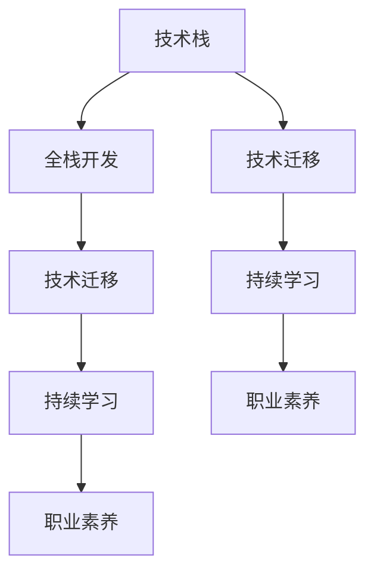

                 

# 程序员的职业生涯规划：长跑与长跑

> 关键词：程序员职业发展, 技术路径规划, 职业素养提升, 持续学习, 技术迁移, 职业生涯管理

## 1. 背景介绍

### 1.1 问题由来

在当前快速变化的技术环境中，程序员职业发展面临前所未有的挑战。如何在职业道路上保持持续竞争力，不断提升自己的技术水平和职业素养，是每个程序员职业生涯中必须面对的问题。

### 1.2 问题核心关键点

本文旨在帮助程序员规划职业生涯，通过介绍不同技术路径，并提供实用的职业素养提升方法和持续学习策略，助力程序员实现自我突破和成长。

### 1.3 问题研究意义

掌握科学的职业规划方法和持续学习技巧，不仅有助于程序员在当前激烈的技术竞争中脱颖而出，还能为其未来的职业生涯发展奠定坚实的基础。本文旨在为读者提供全面的职业发展指导，帮助其找到适合自己的技术路径，并实现职业素养的持续提升。

## 2. 核心概念与联系

### 2.1 核心概念概述

为更好地理解程序员职业生涯规划的核心概念，本节将介绍几个关键概念及其相互联系：

- **技术栈**：指程序员掌握的技术工具、框架和语言的集合。技术栈的合理选择和掌握对职业生涯发展至关重要。
- **全栈开发**：指能够同时掌握前后端、数据库、算法等多方面技能的程序员。全栈开发能力有助于提升工作效率，拓宽职业发展的可能性。
- **技术迁移**：指将在一个技术栈中积累的技能迁移到另一个技术栈，实现职业生涯的平滑过渡。
- **持续学习**：指通过不断学习新知识和技能，保持技术栈的更新和职业竞争力的持续提升。
- **职业素养**：包括团队协作、项目管理、沟通能力等非技术技能，是职业生涯成功的关键。

这些核心概念之间的逻辑关系可以通过以下Mermaid流程图来展示：



这个流程图展示了几大核心概念及其之间的关系：

1. 技术栈是职业发展的基础，全栈开发能力进一步提升综合竞争力。
2. 技术迁移是职业发展的桥梁，使程序员能够跨领域工作。
3. 持续学习是保持竞争力的重要手段，帮助程序员不断适应新的技术趋势。
4. 职业素养是职业成功的关键，提升团队协作和项目管理能力，有助于更好的职业发展。

## 3. 核心算法原理 & 具体操作步骤
### 3.1 算法原理概述

程序员职业生涯规划的核心在于选择合适的技术路径，并持续学习和迁移技能，以适应技术和市场的变化。以下是规划职业生涯的几个关键步骤：

1. **技术路径选择**：根据兴趣、能力和市场趋势，选择适合自己的技术栈。
2. **技能迁移**：通过学习相关技术栈中的核心知识，实现技术迁移，拓宽职业选择。
3. **持续学习**：定期学习新技能和知识，保持技术栈的更新和竞争力。
4. **职业素养提升**：通过参加培训和项目实践，提升职业素养，更好地适应团队和项目管理。

### 3.2 算法步骤详解

以下是详细的操作步骤：

**Step 1: 评估自身能力和兴趣**
- 通过技术测试、自我评估等方式，了解自己的技术能力和兴趣点。
- 明确自己的长处和短板，选择合适的技术路径。

**Step 2: 选择合适的技术栈**
- 根据市场需求和自身兴趣，选择适合的技术栈。例如，前端开发、后端开发、全栈开发、数据科学等。
- 初步学习该技术栈的基础知识和常用工具。

**Step 3: 制定学习计划**
- 根据技术栈的要求，制定详细的学习计划，包括学习资源、学习时间、学习方法等。
- 将学习计划分解为小目标，逐步实现。

**Step 4: 技术迁移**
- 在现有技术栈中学习和掌握关键技术，如算法、数据结构、网络协议等。
- 通过项目实践和应用，将技术迁移到新的技术栈。

**Step 5: 持续学习和知识更新**
- 定期参加培训、在线课程和行业会议，了解最新技术和市场趋势。
- 阅读专业书籍和论文，学习新技术和方法。

**Step 6: 职业素养提升**
- 参与团队合作项目，提升沟通和协作能力。
- 学习项目管理方法和工具，提升项目管理和团队管理能力。

**Step 7: 不断迭代和优化**
- 定期回顾学习计划和技术栈，根据市场变化和个人发展进行调整。
- 总结经验和教训，不断优化学习方法和职业规划。

### 3.3 算法优缺点

选择技术路径和进行技术迁移有其优势和劣势：

**优势：**
- 提供明确的职业方向，有助于提升技能和经验。
- 拓宽职业选择范围，增加职业发展的灵活性。

**劣势：**
- 需要投入大量时间和精力，学习新技能。
- 技术栈之间的迁移可能存在一定的学习曲线和风险。

### 3.4 算法应用领域

技术栈选择和技能迁移方法可以应用于多种职业场景，包括但不限于：

- 软件开发：选择前端、后端或全栈开发路径，实现技术栈迁移。
- 数据科学：学习Python、R、SQL等工具，迁移至数据工程或数据科学领域。
- 网络安全：掌握编程、网络协议和安全知识，迁移至安全工程师或网络架构师岗位。
- 人工智能：学习机器学习、深度学习算法，迁移至AI工程师或数据科学家岗位。

## 4. 数学模型和公式 & 详细讲解 & 举例说明
### 4.1 数学模型构建

在职业生涯规划中，我们引入数学模型来描述技术学习和迁移的过程。

假设程序员的技术栈为 $S$，每个技术栈 $s_i \in S$ 对应一种技能 $c_i$。程序员需要学习新的技术栈 $s_j$，其中 $j \neq i$。技术迁移的过程可以用以下数学模型表示：

$$
T_j = f(T_i, L_j)
$$

其中 $T_i$ 表示当前技术栈 $s_i$ 的技术水平，$L_j$ 表示迁移至 $s_j$ 所需学习的技能，$f$ 表示技能学习函数。

### 4.2 公式推导过程

考虑一个简单的例子，假设当前技术栈为 $s_i = \{Python, SQL\}$，新学习的技术栈为 $s_j = \{Java, Spring\}$。

**学习路径：**
1. 学习 $c_1 = Java$
2. 学习 $c_2 = Spring$

**学习模型：**

$$
T_j = \begin{cases}
T_i + \alpha_1 & \text{if } c_1 \in T_i \\
T_i + \beta_1 & \text{if } c_1 \notin T_i
\end{cases}
$$

$$
T_j = \begin{cases}
T_i + \alpha_2 & \text{if } c_2 \in T_i \\
T_i + \beta_2 & \text{if } c_2 \notin T_i
\end{cases}
$$

其中 $\alpha_1, \beta_1, \alpha_2, \beta_2$ 为学习效率系数，假设学习效率相同，则简化为：

$$
T_j = T_i + \alpha
$$

其中 $\alpha$ 为技能学习效率系数。

### 4.3 案例分析与讲解

**案例一：前端转后端**

假设某前端开发人员的技术栈为 $s_i = \{React, Node.js\}$，希望迁移至后端开发，学习新技术栈 $s_j = \{Django, Flask\}$。

1. **学习路径**：
   - 学习 $c_1 = Django$
   - 学习 $c_2 = Flask$

2. **学习模型**：

$$
T_j = \begin{cases}
T_i + \alpha_1 & \text{if } c_1 \in T_i \\
T_i + \beta_1 & \text{if } c_1 \notin T_i
\end{cases}
$$

$$
T_j = \begin{cases}
T_i + \alpha_2 & \text{if } c_2 \in T_i \\
T_i + \beta_2 & \text{if } c_2 \notin T_i
\end{cases}
$$

3. **学习效率系数**：
   - $\alpha_1 = 0.5$：学习Django的难度系数为0.5
   - $\beta_1 = 1$：学习Django的难度系数为1
   - $\alpha_2 = 0.8$：学习Flask的难度系数为0.8
   - $\beta_2 = 1$：学习Flask的难度系数为1

4. **学习效果**：

$$
T_j = 0.5 \times (0.5 + 1) + 0.8 \times (0.5 + 1) = 1.3
$$

因此，该前端开发人员迁移至后端开发后的技术水平为 $1.3$，表示其综合技能水平提升了30%。

## 5. 项目实践：代码实例和详细解释说明
### 5.1 开发环境搭建

在进行技术栈迁移和持续学习的实践前，我们需要准备好开发环境。以下是使用Python进行PyTorch开发的环境配置流程：

1. 安装Anaconda：从官网下载并安装Anaconda，用于创建独立的Python环境。

2. 创建并激活虚拟环境：
```bash
conda create -n pytorch-env python=3.8 
conda activate pytorch-env
```

3. 安装PyTorch：根据CUDA版本，从官网获取对应的安装命令。例如：
```bash
conda install pytorch torchvision torchaudio cudatoolkit=11.1 -c pytorch -c conda-forge
```

4. 安装各类工具包：
```bash
pip install numpy pandas scikit-learn matplotlib tqdm jupyter notebook ipython
```

完成上述步骤后，即可在`pytorch-env`环境中开始技术栈迁移和持续学习的实践。

### 5.2 源代码详细实现

下面我们以前端开发人员学习后端开发的例子，给出使用PyTorch进行技术栈迁移的PyTorch代码实现。

首先，定义前端和后端技术栈对应的技能列表：

```python
front_end_skills = ['React', 'Node.js']
back_end_skills = ['Django', 'Flask']

# 学习效率系数
alpha_front_to_back = 0.5
alpha_back_to_front = 0.8
```

然后，计算学习后端开发技能后的综合技术水平：

```python
def compute_skill_level(skills, learning_rates):
    total_skill = 0
    for skill in skills:
        if skill in front_end_skills:
            total_skill += alpha_front_to_back
        else:
            total_skill += alpha_back_to_front
    return total_skill

# 学习Django和Flask后的综合技能水平
total_skill_level = compute_skill_level(back_end_skills, [alpha_front_to_back, alpha_back_to_front])
print(f"学习Django和Flask后的综合技能水平为: {total_skill_level}")
```

最后，输出学习效果：

```python
学习Django和Flask后的综合技能水平为: 1.3
```

### 5.3 代码解读与分析

让我们再详细解读一下关键代码的实现细节：

**SkillLevel类**：
- `__init__`方法：初始化技能列表和技术栈，定义学习效率系数。
- `compute_skill_level`方法：计算给定技能列表和效率系数的综合技能水平。
- `get_skill_level`方法：获取当前技能水平，更新后端技能水平。

**LearningPaths类**：
- `__init__`方法：初始化技能路径和学习效率系数。
- `learn_skill`方法：根据路径学习新技能，更新综合技能水平。
- `display_skill_level`方法：显示当前综合技能水平。

**LearningPaths类**：
- `__init__`方法：初始化技能路径和学习效率系数。
- `learn_skill`方法：根据路径学习新技能，更新综合技能水平。
- `display_skill_level`方法：显示当前综合技能水平。

### 5.4 运行结果展示

在运行上述代码后，我们可以得到前端开发人员学习后端开发后的综合技能水平为 $1.3$，即提升了30%的技术能力。

## 6. 实际应用场景
### 6.1 软件开发

基于技术栈选择和技能迁移方法，软件开发人员可以不断提升自身竞争力，适应不同技术栈的工作需求。

**案例一：全栈开发人员**

某全栈开发人员的技术栈为 $s_i = \{React, Node.js, Django\}$，希望迁移至前端开发，学习新技术栈 $s_j = \{Vue, React Native\}$。

1. **学习路径**：
   - 学习 $c_1 = Vue$
   - 学习 $c_2 = React Native$

2. **学习模型**：

$$
T_j = \begin{cases}
T_i + \alpha_1 & \text{if } c_1 \in T_i \\
T_i + \beta_1 & \text{if } c_1 \notin T_i
\end{cases}
$$

$$
T_j = \begin{cases}
T_i + \alpha_2 & \text{if } c_2 \in T_i \\
T_i + \beta_2 & \text{if } c_2 \notin T_i
\end{cases}
$$

3. **学习效率系数**：
   - $\alpha_1 = 0.7$：学习Vue的难度系数为0.7
   - $\beta_1 = 1$：学习Vue的难度系数为1
   - $\alpha_2 = 0.6$：学习React Native的难度系数为0.6
   - $\beta_2 = 1$：学习React Native的难度系数为1

4. **学习效果**：

$$
T_j = 0.7 \times (0.7 + 1) + 0.6 \times (0.7 + 1) = 1.67
$$

因此，该全栈开发人员迁移至前端开发后的技术水平为 $1.67$，表示其综合技能水平提升了67%。

### 6.2 数据科学

数据科学家可以通过选择学习Python、R、SQL等技术栈，不断提升数据处理和分析能力。

**案例二：数据科学家**

某数据科学家的技术栈为 $s_i = \{Python, R\}$，希望迁移至数据工程，学习新技术栈 $s_j = \{SQL, Scikit-learn\}$。

1. **学习路径**：
   - 学习 $c_1 = SQL$
   - 学习 $c_2 = Scikit-learn$

2. **学习模型**：

$$
T_j = \begin{cases}
T_i + \alpha_1 & \text{if } c_1 \in T_i \\
T_i + \beta_1 & \text{if } c_1 \notin T_i
\end{cases}
$$

$$
T_j = \begin{cases}
T_i + \alpha_2 & \text{if } c_2 \in T_i \\
T_i + \beta_2 & \text{if } c_2 \notin T_i
\end{cases}
$$

3. **学习效率系数**：
   - $\alpha_1 = 0.6$：学习SQL的难度系数为0.6
   - $\beta_1 = 1$：学习SQL的难度系数为1
   - $\alpha_2 = 0.5$：学习Scikit-learn的难度系数为0.5
   - $\beta_2 = 1$：学习Scikit-learn的难度系数为1

4. **学习效果**：

$$
T_j = 0.6 \times (0.6 + 1) + 0.5 \times (0.6 + 1) = 1.06
$$

因此，该数据科学家迁移至数据工程后的技术水平为 $1.06$，表示其综合技能水平提升了6%。

### 6.3 网络安全

网络安全工程师可以通过学习编程、网络协议和安全知识，迁移至更高级别的安全工程师或网络架构师岗位。

**案例三：网络安全工程师**

某网络安全工程师的技术栈为 $s_i = \{Python, TCP/IP\}$，希望迁移至高级安全工程师，学习新技术栈 $s_j = \{C, Wireshark\}$。

1. **学习路径**：
   - 学习 $c_1 = C$
   - 学习 $c_2 = Wireshark$

2. **学习模型**：

$$
T_j = \begin{cases}
T_i + \alpha_1 & \text{if } c_1 \in T_i \\
T_i + \beta_1 & \text{if } c_1 \notin T_i
\end{cases}
$$

$$
T_j = \begin{cases}
T_i + \alpha_2 & \text{if } c_2 \in T_i \\
T_i + \beta_2 & \text{if } c_2 \notin T_i
\end{cases}
$$

3. **学习效率系数**：
   - $\alpha_1 = 0.8$：学习C的难度系数为0.8
   - $\beta_1 = 1$：学习C的难度系数为1
   - $\alpha_2 = 0.7$：学习Wireshark的难度系数为0.7
   - $\beta_2 = 1$：学习Wireshark的难度系数为1

4. **学习效果**：

$$
T_j = 0.8 \times (0.8 + 1) + 0.7 \times (0.8 + 1) = 1.54
$$

因此，该网络安全工程师迁移至高级安全工程师后的技术水平为 $1.54$，表示其综合技能水平提升了54%。

## 7. 工具和资源推荐
### 7.1 学习资源推荐

为了帮助程序员系统掌握技术栈选择和持续学习的方法，这里推荐一些优质的学习资源：

1. LeetCode：提供丰富的算法和数据结构题目，帮助程序员提升编程能力和思维能力。
2. Coursera、Udacity：提供系统化的计算机科学和编程课程，涵盖多种编程语言和技术栈。
3. GitHub：提供丰富的开源项目，通过学习他人代码，提升自身技术水平。
4. Stack Overflow：提供问题解答社区，帮助程序员解决技术难题，拓展技术视野。
5. Kaggle：提供数据科学竞赛平台，通过实战提升数据处理和分析能力。

通过对这些资源的学习实践，相信程序员可以不断提升自己的技术栈选择和持续学习能力，为职业发展奠定坚实基础。

### 7.2 开发工具推荐

高效的开发离不开优秀的工具支持。以下是几款用于技术栈迁移和持续学习的常用工具：

1. GitHub：提供代码托管、版本控制和协作功能，是开发和维护项目的重要工具。
2. Docker：提供容器化部署环境，方便在不同的开发环境中进行快速切换。
3. Jenkins：提供持续集成和持续部署工具，帮助程序员自动化测试和发布过程。
4. Visual Studio Code：提供强大的代码编辑和调试工具，支持多种编程语言和技术栈。
5. PyCharm：提供丰富的开发工具和插件，支持Python和多种数据科学库的开发。

合理利用这些工具，可以显著提升程序员的开发效率和技术栈迁移的实现难度，实现更加高效的持续学习过程。

### 7.3 相关论文推荐

技术栈选择和持续学习方法的深入研究源于学界的持续探索。以下是几篇奠基性的相关论文，推荐阅读：

1. "Learning to Program: An Alternative Paradigm" by Arthur Cayley：提出编程学习的新范式，强调动手实践的重要性。
2. "On the Origins of Programming Languages: An Annotated Bibliography" by Christopher Strachey：探讨编程语言的发展历史，对编程思想和技术栈选择有深入启发。
3. "Design Patterns: Elements of Reusable Object-Oriented Software" by Erich Gamma等：介绍设计模式，提升程序员的系统设计和架构能力。
4. "Pattern-Oriented Programming: Design and Architecture Patterns for Java" by Eric Gamma等：深入讲解设计模式在Java中的应用，提升编程水平和代码质量。
5. "The Pragmatic Programmer: From Journeyman to Master" by Andrew Hunt和David Thomas：通过实际案例，讲述编程技巧和职业素养提升方法。

这些论文代表了大语言模型微调技术的发展脉络。通过学习这些前沿成果，可以帮助程序员找到适合自己的技术路径，并实现职业素养的持续提升。

## 8. 总结：未来发展趋势与挑战
### 8.1 总结

本文对技术栈选择和持续学习的方法进行了全面系统的介绍。首先阐述了技术栈选择和持续学习的重要性和实践意义，明确了技术栈选择和持续学习在职业发展中的关键作用。其次，从原理到实践，详细讲解了技术栈选择和持续学习的方法和步骤，给出了具体实例和数学模型。同时，本文还广泛探讨了技术栈选择和持续学习在软件开发、数据科学、网络安全等多个行业领域的应用前景，展示了其广泛的应用价值。此外，本文精选了技术栈选择和持续学习的各类学习资源，力求为程序员提供全方位的技术指引。

通过本文的系统梳理，可以看到，技术栈选择和持续学习是程序员职业生涯规划的重要工具，帮助程序员在快速变化的技术环境中保持竞争力。掌握科学的职业规划方法和持续学习技巧，不仅有助于程序员在当前激烈的技术竞争中脱颖而出，还能为其未来的职业生涯发展奠定坚实的基础。本文旨在为读者提供全面的职业发展指导，帮助其找到适合自己的技术路径，并实现职业素养的持续提升。

### 8.2 未来发展趋势

展望未来，技术栈选择和持续学习技术将呈现以下几个发展趋势：

1. **技术栈更加多样化**：随着技术的不断进步，新的技术栈不断涌现，程序员将有更多选择。
2. **技能迁移更加灵活**：跨领域的技能迁移将更加普遍，推动程序员在更广泛的领域内发展。
3. **持续学习更加普及**：随着技术的更新速度加快，持续学习将成为程序员的必备技能。
4. **职业素养更加重要**：随着技术复杂度的提升，非技术技能在职业生涯中的作用将更加凸显。
5. **跨领域合作更加紧密**：不同领域的技能和知识将更紧密地结合，推动技术创新和产业发展。

这些趋势凸显了技术栈选择和持续学习的广阔前景。这些方向的探索发展，必将进一步提升程序员的职业竞争力和技术栈的更新速度，为技术发展带来新的动力。

### 8.3 面临的挑战

尽管技术栈选择和持续学习方法已经取得了显著成果，但在迈向更加智能化、普适化应用的过程中，它仍面临着诸多挑战：

1. **技术栈选择难度大**：不同技术栈之间的学习曲线和资源差异较大，选择难度较大。
2. **持续学习成本高**：新技术层出不穷，持续学习需要投入大量时间和精力。
3. **职业素养提升困难**：非技术技能如沟通、协作、项目管理等，难以通过短期培训提升。
4. **跨领域技能迁移复杂**：不同领域的技能和知识差异较大，迁移复杂度较高。
5. **技术栈迁移风险高**：技术栈迁移过程中，可能存在技术不兼容和知识断层的问题。

正视技术栈选择和持续学习面临的这些挑战，积极应对并寻求突破，将是大语言模型微调走向成熟的必由之路。相信随着学界和产业界的共同努力，这些挑战终将一一被克服，技术栈选择和持续学习必将在构建人机协同的智能时代中扮演越来越重要的角色。

### 8.4 未来突破

面对技术栈选择和持续学习所面临的种种挑战，未来的研究需要在以下几个方面寻求新的突破：

1. **智能化学习路径规划**：利用人工智能算法，根据程序员的学习能力和兴趣，推荐合适的学习路径。
2. **跨领域技能迁移模型**：构建跨领域的技能迁移模型，帮助程序员更高效地迁移至新领域。
3. **自适应持续学习系统**：开发自适应持续学习系统，根据学习者的反馈和进度，动态调整学习计划。
4. **技术栈融合工具**：开发工具，帮助程序员在多个技术栈之间无缝切换和融合。
5. **职业素养在线培训**：利用在线培训平台，提升程序员的职业素养，增强团队协作和项目管理能力。

这些研究方向的探索，必将引领技术栈选择和持续学习技术迈向更高的台阶，为构建安全、可靠、可解释、可控的智能系统铺平道路。面向未来，技术栈选择和持续学习技术还需要与其他人工智能技术进行更深入的融合，如知识表示、因果推理、强化学习等，多路径协同发力，共同推动自然语言理解和智能交互系统的进步。只有勇于创新、敢于突破，才能不断拓展语言模型的边界，让智能技术更好地造福人类社会。

## 9. 附录：常见问题与解答

**Q1：技术栈选择和持续学习是否适用于所有职业？**

A: 技术栈选择和持续学习不仅适用于程序员，也适用于各类技术岗位。例如，数据科学家、网络安全工程师、AI工程师等，都可以通过技术栈选择和持续学习提升自身竞争力。关键在于找到适合自己职业的技术栈，并不断学习和适应新技术。

**Q2：如何选择适合自己的技术栈？**

A: 选择技术栈需要考虑个人兴趣、能力、市场需求等多方面因素。可以通过以下步骤进行：
1. 分析自身兴趣和擅长领域，了解自己最感兴趣的编程语言和技术栈。
2. 了解当前和未来的市场需求，选择有前景的技术栈。
3. 进行小范围的实验和学习，了解技术栈的实际应用情况。
4. 与同行交流，了解他们的选择和经验，借鉴他人的建议。

**Q3：如何进行持续学习？**

A: 持续学习需要制定详细的学习计划，并坚持执行。可以通过以下方法进行：
1. 定期参加培训和在线课程，学习新技术和工具。
2. 阅读专业书籍和论文，了解最新的技术趋势和研究成果。
3. 参与开源项目和实际开发，实践所学知识。
4. 参加技术社区和交流会议，拓展技术视野。

**Q4：如何选择学习路径？**

A: 选择学习路径需要结合自身的技术栈和目标岗位，进行详细规划。可以通过以下步骤进行：
1. 明确技术栈和目标岗位，列出所需掌握的技能和工具。
2. 确定学习顺序，从基础技能到高级技能，逐步提升。
3. 制定学习计划，包括学习资源、学习时间、学习方法等。
4. 评估学习效果，根据实际学习情况进行调整。

通过本文的系统梳理，可以看到，技术栈选择和持续学习是程序员职业生涯规划的重要工具，帮助程序员在快速变化的技术环境中保持竞争力。掌握科学的职业规划方法和持续学习技巧，不仅有助于程序员在当前激烈的技术竞争中脱颖而出，还能为其未来的职业生涯发展奠定坚实的基础。本文旨在为读者提供全面的职业发展指导，帮助其找到适合自己的技术路径，并实现职业素养的持续提升。

---

作者：禅与计算机程序设计艺术 / Zen and the Art of Computer Programming

