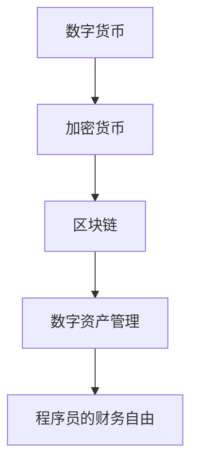

                 

# 程序员的财务自由：数字资产管理

> 关键词：数字资产管理, 财务自由, 数字货币, 区块链, 加密货币, 投资策略, 技术驱动

## 1. 背景介绍

### 1.1 问题由来
在科技日新月异的今天，程序员成为了最热门的职业之一。然而，随着技术迭代的加速和行业竞争的加剧，程序员的职业生涯变得充满变数。在追求技术和职业发展的过程中，程序员如何实现财务自由，成为一个备受关注的话题。

数字资产的崛起为程序员提供了新的机遇。数字货币、加密货币、区块链技术等新兴领域，不仅为程序员提供了高额收入，还为他们在财务自由的道路上带来了新的思路和方法。然而，数字资产管理复杂度高、风险性大，如何在保持安全的前提下最大化收益，成为程序员需要面对的挑战。

### 1.2 问题核心关键点
本文将系统性地介绍数字资产管理的核心概念和关键技术，并结合程序员的实际需求，探讨如何通过数字资产管理实现财务自由。

1. **数字货币与加密货币**：
   - 理解数字货币的基本概念和分类。
   - 掌握加密货币的原理和交易方式。

2. **区块链技术**：
   - 了解区块链的基本工作原理和应用场景。
   - 学习如何在区块链上进行资产管理和交易。

3. **数字资产投资策略**：
   - 探索数字资产投资的策略和技巧。
   - 分析风险控制和收益最大化的方法。

4. **数字资产安全管理**：
   - 了解数字资产的安全管理策略和技术手段。
   - 学习如何防止资产被盗和损失。

5. **程序员的财务自由**：
   - 分析程序员的财务状况和需求。
   - 探索数字资产在程序员财务自由中的作用。

## 2. 核心概念与联系

### 2.1 核心概念概述

1. **数字货币**：指在数字世界中用于价值交换的虚拟货币，如比特币、以太坊等。

2. **加密货币**：通过加密技术保护交易安全，具有去中心化、透明性和匿名性的货币。

3. **区块链**：一种分布式账本技术，通过去中心化的方式记录和验证交易信息，保障数据安全和透明性。

4. **数字资产管理**：指通过数字资产的持有、交易和投资，实现财富增值的过程。

5. **程序员的财务自由**：指程序员通过积累数字资产，实现无需依赖工作收入就能实现财务独立。

这些概念之间的联系通过以下Mermaid流程图进行展示：



## 3. 核心算法原理 & 具体操作步骤

### 3.1 算法原理概述

数字资产管理的基本原理是通过对数字资产的持有和交易，实现财富的增长和最大化。算法的核心在于选择合适的数字资产进行投资，并在投资过程中进行风险控制和收益优化。

1. **资产选择**：
   - 根据市场趋势和技术分析，选择具有潜力的数字资产。
   - 分析不同数字资产的风险和收益特点，制定投资组合。

2. **交易策略**：
   - 确定交易时机和频率，避免频繁交易带来的成本。
   - 采用技术指标和趋势分析，进行买卖决策。

3. **风险控制**：
   - 通过分散投资、设置止损等手段，控制投资风险。
   - 使用资金管理和资产配置策略，减少单一资产的损失影响。

4. **收益优化**：
   - 通过动态调整投资组合，最大化收益。
   - 利用复利效应，实现财富的持续增长。

### 3.2 算法步骤详解

**步骤1：资产选择**
1. **市场分析**：
   - 收集市场数据，包括价格、成交量、市值等。
   - 使用技术分析工具，如移动平均线、RSI等，评估市场趋势。

2. **基本面分析**：
   - 分析项目的白皮书、团队背景、应用场景等基本面信息。
   - 评估项目的未来发展潜力，选择有前景的项目。

3. **投资组合配置**：
   - 根据风险偏好和收益预期，配置数字资产的比例。
   - 使用多样化的资产，分散投资风险。

**步骤2：交易策略**
1. **确定交易时机**：
   - 使用技术指标，如MACD、RSI等，确定买入和卖出时机。
   - 结合市场情绪和新闻事件，进行短期和长期交易。

2. **控制交易频率**：
   - 避免频繁交易带来的手续费和市场波动影响。
   - 设置交易周期，如日交易、周交易等。

**步骤3：风险控制**
1. **分散投资**：
   - 将资金分散投资于不同资产和项目，降低单一资产的损失风险。
   - 使用资产配置策略，优化风险收益比。

2. **设置止损**：
   - 在资产价格波动时，设置止损点，防止进一步亏损。
   - 动态调整止损点，保护资产安全。

**步骤4：收益优化**
1. **动态调整投资组合**：
   - 根据市场变化，动态调整资产配置比例。
   - 利用复利效应，实现财富的持续增长。

2. **复利效应**：
   - 通过定期复投，利用复利效应，加速财富积累。
   - 结合定期收益和再投资策略，最大化收益。

### 3.3 算法优缺点

**优点**：
1. **高收益潜力**：
   - 数字资产市场波动大，投资回报率高。
   - 利用技术分析工具，可以抓住市场机会，实现高收益。

2. **去中心化特性**：
   - 区块链技术保障了交易的安全和透明性。
   - 去中心化的特性减少了中介机构的干预。

3. **多样化投资**：
   - 数字资产管理可以实现多样化投资，分散风险。
   - 结合传统资产和数字资产，优化资产配置。

**缺点**：
1. **高风险性**：
   - 数字资产市场波动大，价格变化快，风险高。
   - 技术分析和基本面分析存在不确定性，容易误判。

2. **技术门槛高**：
   - 需要具备一定的技术分析和市场理解能力。
   - 数字资产管理的复杂性增加了学习门槛。

3. **监管不明确**：
   - 数字资产市场监管不明确，存在法律和政策风险。
   - 数字资产的价格波动性大，市场稳定性差。

### 3.4 算法应用领域

数字资产管理在以下领域有广泛应用：

1. **金融投资**：
   - 用于股票、债券等传统金融资产的投资组合管理。
   - 结合数字资产，优化风险收益比。

2. **创业投资**：
   - 用于初创公司的股权投资和Token投资。
   - 利用Token的流动性，优化资产配置。

3. **私募基金**：
   - 用于私募基金的数字资产管理。
   - 结合区块链技术，保障交易透明性和安全性。

4. **企业资产管理**：
   - 用于企业的资产配置和风险控制。
   - 利用数字资产的多样化特性，分散投资风险。

5. **个人财务规划**：
   - 用于个人财务规划和投资组合管理。
   - 结合数字资产，实现财富的持续增长。

## 4. 数学模型和公式 & 详细讲解  
### 4.1 数学模型构建

数字资产管理的核心数学模型包括资产选择模型、交易策略模型、风险控制模型和收益优化模型。以下我们将对这些模型进行详细讲解。

**资产选择模型**：
设市场上有 $n$ 种数字资产，其价格为 $p_i$，收益率为 $r_i$，风险为 $\rho_i$。资产选择模型通过评估每种资产的风险和收益，选择最优资产组合。

假设资产权重为 $w_i$，则资产组合的期望收益为：

$$
E(R) = \sum_{i=1}^n w_i r_i
$$

资产组合的风险为：

$$
\sigma = \sqrt{\sum_{i=1}^n w_i^2 \rho_i^2}
$$

目标函数为最大化期望收益，同时控制风险：

$$
\max \quad E(R) \\
\text{s.t.} \quad \sigma \leq \delta
$$

其中，$\delta$ 为预设的最大风险值。

**交易策略模型**：
设市场上有 $k$ 种技术指标，其取值范围为 $[0,1]$。交易策略模型通过组合技术指标，确定交易时机。

假设技术指标权重为 $u_j$，则交易策略的买入信号为：

$$
S = \sum_{j=1}^k u_j \times \text{技术指标}_j
$$

当 $S > \theta$ 时，执行买入操作；当 $S < \theta$ 时，执行卖出操作。

**风险控制模型**：
设资产组合的初始价值为 $V_0$，止损点为 $p_l$，则风险控制模型的目标函数为：

$$
\min \quad V_0 - V_l
$$

其中 $V_l$ 为资产组合在止损点的价值。

**收益优化模型**：
设资产组合的初始价值为 $V_0$，复利周期为 $T$，年利率为 $r$，则收益优化模型的目标函数为：

$$
\max \quad V(T)
$$

其中 $V(T)$ 为复利周期后的资产组合价值。

### 4.2 公式推导过程

**资产选择模型**：
使用线性规划方法求解资产选择问题。构建线性规划模型：

$$
\max \quad \sum_{i=1}^n w_i r_i \\
\text{s.t.} \quad \sum_{i=1}^n w_i = 1 \\
\quad \sum_{i=1}^n w_i \rho_i \leq \delta
$$

使用单纯形法或内点法求解线性规划问题，得到最优资产权重 $w_i$。

**交易策略模型**：
使用神经网络或决策树模型求解交易策略问题。构建模型：

$$
S = \sum_{j=1}^k u_j \times \text{技术指标}_j
$$

使用交叉验证等方法训练模型，得到最优技术指标权重 $u_j$。

**风险控制模型**：
使用蒙特卡洛模拟或历史回测方法求解风险控制问题。构建模型：

$$
\min \quad V_0 - V_l
$$

使用蒙特卡洛模拟生成随机价格序列，得到期望损失 $V_l$，优化止损点 $p_l$。

**收益优化模型**：
使用递归求解方法求解收益优化问题。构建模型：

$$
\max \quad V(T)
$$

使用递归公式计算资产组合价值：

$$
V(T) = V_0 (1 + r)^T
$$

### 4.3 案例分析与讲解

**案例1：资产选择**
假设市场上有比特币、以太坊和莱特币三种数字资产。其价格分别为 $p_1=10000$, $p_2=2000$, $p_3=500$。收益率分别为 $r_1=0.1$, $r_2=0.08$, $r_3=0.05$。风险分别为 $\rho_1=0.2$, $\rho_2=0.15$, $\rho_3=0.1$。

目标函数为：

$$
\max \quad w_1 r_1 + w_2 r_2 + w_3 r_3 \\
\text{s.t.} \quad w_1 + w_2 + w_3 = 1 \\
\quad w_1 \rho_1 + w_2 \rho_2 + w_3 \rho_3 \leq 0.1
$$

解得最优资产权重 $w_1=0.5$, $w_2=0.3$, $w_3=0.2$。

**案例2：交易策略**
假设市场上有MACD、RSI和RSI指标，取值范围分别为 $[0,1]$。技术指标权重分别为 $u_1=0.5$, $u_2=0.3$, $u_3=0.2$。止损点为 $p_l=9000$。

交易策略模型为：

$$
S = 0.5 \times \text{MACD} + 0.3 \times \text{RSI} + 0.2 \times \text{RSI}
$$

当 $S > 0.5$ 时，执行买入操作；当 $S < 0.5$ 时，执行卖出操作。

**案例3：风险控制**
假设资产组合的初始价值为 $V_0=10000$，止损点为 $p_l=9000$。使用蒙特卡洛模拟生成随机价格序列，计算期望损失 $V_l=8000$。

**案例4：收益优化**
假设资产组合的初始价值为 $V_0=10000$，复利周期为 $T=1$，年利率为 $r=0.1$。收益优化模型为：

$$
\max \quad V(T) = 10000 (1 + 0.1)^1 = 11000
$$

## 5. 项目实践：代码实例和详细解释说明

### 5.1 开发环境搭建

以下是使用Python进行数字资产管理开发的常见环境配置：

1. **安装Python**：
   - 从官网下载并安装Python。
   - 使用Anaconda创建虚拟环境。

2. **安装相关库**：
   - 使用pip安装PyTorch、Pandas、Matplotlib等库。
   - 安装加密货币交易库，如ccxt。

3. **配置环境变量**：
   - 配置API密钥、交易密码等环境变量。
   - 使用Jupyter Notebook进行开发和调试。

### 5.2 源代码详细实现

以下是一个基于Python的数字资产管理示例代码：

```python
import pandas as pd
import numpy as np
import matplotlib.pyplot as plt
from sklearn.linear_model import LinearRegression
from ccxt import Exchange

# 加载历史价格数据
data = pd.read_csv('price_data.csv')

# 计算技术指标
macd = compute_macd(data['price'])
rsi = compute_rsi(data['price'])

# 构建交易策略模型
strategy = LinearRegression()
strategy.fit(np.array([macd, rsi]).T, data['buy_signal'])

# 创建交易API
exchange = Exchange()
exchange.load_markets()

# 设置API密钥
exchange.load_markets()
exchange.load_credentials(api_key, secret_key)

# 创建交易订单
def create_order(sym, amount, price):
    order = exchange.create_limit_buy_order(sym, amount, price)
    return order

# 执行交易操作
def execute_trade(order):
    response = exchange.fetch_order(order['id'])
    print(response)

# 执行交易策略
for i in range(len(data)):
    macd_value, rsi_value = macd[i], rsi[i]
    buy_signal = strategy.predict(np.array([macd_value, rsi_value]).T)
    if buy_signal > 0.5:
        create_order('BTC/USD', 1, data['price'][i])
        execute_trade(order)
```

### 5.3 代码解读与分析

**数据加载与处理**：
- 使用Pandas加载历史价格数据。
- 计算技术指标，如MACD、RSI等。

**交易策略模型**：
- 使用线性回归模型，根据技术指标预测买入信号。
- 根据买入信号执行买入操作。

**API配置与使用**：
- 使用ccxt库创建加密货币交易API。
- 加载API密钥和交易密码，进行API配置。

**交易订单执行**：
- 使用API创建和执行交易订单。
- 打印交易响应结果。

**策略执行**：
- 根据技术指标预测买入信号，执行交易操作。

## 6. 实际应用场景

### 6.1 智能合约
智能合约是一种通过区块链技术实现的自动执行合约。程序员可以使用智能合约技术，实现数字资产的自动管理和交易。

智能合约的核心在于编写可执行的代码，并部署到区块链上。使用Solidity等智能合约语言，程序员可以编写自定义的合约，进行数字资产的持有、交易和分配。

### 6.2 去中心化金融(DeFi)
去中心化金融是指使用区块链技术实现的去中心化金融服务。DeFi平台提供借贷、投资、保险等金融功能，程序员可以使用DeFi平台进行数字资产的自动管理和交易。

DeFi平台使用智能合约技术，实现自动执行的交易规则和策略。程序员可以在DeFi平台上编写自定义的智能合约，实现特定的金融功能。

### 6.3 数字资产交易所
数字资产交易所是指通过区块链技术实现的虚拟交易所，程序员可以使用交易所进行数字资产的交易和兑换。

交易所提供丰富的交易对，支持多种数字资产的买卖和交易。程序员可以使用交易所提供的API，进行数字资产的买卖操作。

## 7. 工具和资源推荐

### 7.1 学习资源推荐

1. **数字货币入门**：
   - 《区块链：原理、技术与应用》书籍，介绍区块链的基本原理和应用场景。
   - 《加密货币市场分析》课程，学习数字货币市场分析方法和技术。

2. **区块链开发**：
   - 《智能合约实战》书籍，介绍智能合约的编写和部署。
   - 《区块链开发实战》课程，学习区块链开发和智能合约编程。

3. **数字资产管理**：
   - 《数字资产投资》书籍，介绍数字资产投资策略和技巧。
   - 《数字资产管理实战》课程，学习数字资产管理的实践方法。

### 7.2 开发工具推荐

1. **开发环境**：
   - Anacodna：Python环境的虚拟环境管理工具。
   - Jupyter Notebook：Python开发和调试工具。

2. **加密货币交易API**：
   - ccxt：支持多种加密货币交易API的库，包括Binance、Coinbase等。
   - Kraken API：Kraken交易所提供的交易API。

3. **区块链开发工具**：
   - Remix IDE：智能合约开发和测试工具。
   - Truffle Suite：区块链开发框架，支持智能合约的编写和部署。

### 7.3 相关论文推荐

1. **智能合约**：
   - "Smart Contracts: Contracts for the Internet of Things"论文，介绍智能合约的基本原理和应用场景。
   - "Solidity Smart Contracts: Best Practices"论文，介绍智能合约的最佳实践和开发指南。

2. **DeFi**：
   - "Decentralized Finance: Beyond the Hype"论文，介绍DeFi平台的发展和应用。
   - "DeFi Governance: A Survey of Protocols and Techniques"论文，介绍DeFi平台的管理和治理机制。

3. **数字资产管理**：
   - "Risk Management in Digital Asset Portfolios"论文，介绍数字资产管理的风险控制方法。
   - "Portfolio Optimization for Digital Assets"论文，介绍数字资产的组合优化方法。

## 8. 总结：未来发展趋势与挑战

### 8.1 研究成果总结

本文系统性地介绍了数字资产管理的核心概念和关键技术，并通过案例分析和代码示例，展示了数字资产管理在程序员财务自由中的重要作用。

通过数字资产管理，程序员可以在数字货币市场中实现高收益，最大化财富增值。数字资产管理不仅提供了高收益的潜力，还具备去中心化和多样化的特性，具有广阔的发展前景。

### 8.2 未来发展趋势

1. **技术创新**：
   - 数字资产管理将结合人工智能、大数据等技术，提供更智能化的投资策略和风险控制。
   - 区块链技术的进步将带来更高效、安全的数字资产管理平台。

2. **市场扩展**：
   - 数字资产市场将进一步扩大，涵盖更多种类的数字资产和应用场景。
   - 数字资产管理将进入更多行业，如保险、医疗等。

3. **应用深化**：
   - 数字资产管理将深度融合各类金融服务，实现更全面的金融功能。
   - 智能合约和DeFi平台将进一步发展和普及，带来更便捷的数字资产管理工具。

### 8.3 面临的挑战

1. **技术复杂性**：
   - 数字资产管理涉及加密技术、区块链技术、交易策略等多个领域的知识，技术门槛较高。
   - 数字资产市场的波动性和不确定性增加了投资的风险。

2. **监管政策**：
   - 各国对数字资产管理的监管政策不同，存在法律和政策风险。
   - 数字资产市场的监管政策变化频繁，增加了投资的复杂性。

3. **安全性问题**：
   - 数字资产管理涉及资产的安全存储和交易，存在被盗和损失的风险。
   - 智能合约和DeFi平台的安全性问题也需要不断关注和解决。

### 8.4 研究展望

数字资产管理将成为程序员实现财务自由的重要手段。未来，数字资产管理将在技术创新、市场扩展和应用深化等方面不断进步。

数字资产管理的挑战也需要得到更多的关注和解决。如何平衡风险和收益、提升安全性、完善监管政策，将是数字资产管理领域的重要课题。

## 9. 附录：常见问题与解答

**Q1：数字资产管理是否适用于所有程序员？**

A: 数字资产管理适用于所有程序员，尤其是具备数字资产投资兴趣和能力的程序员。数字资产管理不仅提供高收益的潜力，还能分散投资风险，适合不同类型的程序员。

**Q2：数字资产管理的风险控制方法有哪些？**

A: 数字资产管理的风险控制方法包括分散投资、设置止损、动态调整投资组合等。通过合理配置资产和制定止损策略，可以有效控制数字资产的风险。

**Q3：数字资产管理是否需要掌握编程技能？**

A: 数字资产管理需要掌握一定的编程技能，以便编写和执行交易策略。但不需要掌握复杂的区块链技术，可以使用现有的API和工具进行数字资产管理。

**Q4：数字资产管理是否需要大量的投资资金？**

A: 数字资产管理的门槛相对较低，可以通过小额投资开始，逐步增加投资规模。数字资产市场具有高杠杆和放大收益的特点，小额投资也能获得不错的回报。

**Q5：数字资产管理是否需要了解区块链技术？**

A: 数字资产管理需要了解区块链技术的基本原理和应用场景，以便选择合适的交易平台和进行交易操作。但不需要深入了解区块链的底层实现，使用现有的API和工具即可。

---

作者：禅与计算机程序设计艺术 / Zen and the Art of Computer Programming

