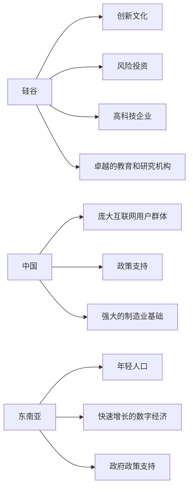

                 

# 程序员的跨国发展：硅谷、中国与东南亚的机遇

## 1. 背景介绍

在当今这个全球化时代，技术的快速发展将世界各地紧密连接在一起。作为全球IT技术的重要参与者和贡献者，程序员的职业发展正在经历前所未有的变革。无论是在硅谷、中国还是东南亚，都有巨大的机遇等待着有志于此领域的程序员。本文将从全球视角出发，分析三大区域的职业机会和未来发展趋势，为程序员提供全方位的职业发展指引。

## 2. 核心概念与联系

### 2.1 核心概念概述

#### 2.1.1 硅谷（Silicon Valley）
- **定义**：位于美国加利福尼亚州旧金山湾区的一个科技产业集群，以世界顶尖的科技公司和高新技术企业著称，被誉为全球科技创新中心。
- **特点**：创新文化、风险投资、高科技企业、卓越的教育和研究机构。
- **代表性公司**：谷歌、苹果、Facebook、特斯拉等。

#### 2.1.2 中国（China）
- **定义**：全球第二大经济体，世界第一人口大国，拥有广阔的市场和丰富的劳动力资源。
- **特点**：庞大的互联网用户群体、政策支持、强大的制造业基础。
- **代表性公司**：阿里巴巴、腾讯、华为、字节跳动等。

#### 2.1.3 东南亚（Southeast Asia）
- **定义**：包括东南亚国家联盟（ASEAN）成员国，如新加坡、马来西亚、印尼等。
- **特点**：年轻人口、快速增长的数字经济、政府政策支持。
- **代表性公司**：Grab、Gojek、Lazada等。

### 2.2 核心概念原理和架构的 Mermaid 流程图(Mermaid 流程节点中不要有括号、逗号等特殊字符)



## 3. 核心算法原理 & 具体操作步骤

### 3.1 算法原理概述

#### 3.1.1 技术趋势
全球各地的程序员面临的机遇主要源于以下几个技术趋势：

1. **云计算和边缘计算**：无论在硅谷、中国还是东南亚，云计算和边缘计算技术的普及为数据处理和应用开发提供了新的平台。
2. **人工智能和机器学习**：AI和ML技术在多个领域的应用，如自动驾驶、医疗诊断、金融风控等，为程序员提供了广阔的发展空间。
3. **区块链技术**：作为新兴的分布式账本技术，区块链正在被用于数字货币、智能合约、供应链管理等多个领域。
4. **物联网（IoT）**：随着物联网设备的普及，程序员需要开发新的软件解决方案来处理和分析数据。

#### 3.1.2 行业应用
不同区域对技术的需求存在差异，程序员可以根据自身兴趣和技能选择合适的行业：

1. **硅谷**：主要集中在创新和风险投资领域，适合从事前沿科技研发、人工智能、云计算等高技术含量工作。
2. **中国**：对互联网、电子商务、游戏、金融科技等领域的程序员需求旺盛。
3. **东南亚**：电子商务、金融科技、物流、数字支付等领域的快速发展，对程序员需求量大。

### 3.2 算法步骤详解

#### 3.2.1 技术准备
程序员需要根据目标区域的技术趋势和行业需求，准备相应的技术栈和工具：

1. **编程语言**：选择目标区域主流的编程语言，如Python、Java、JavaScript等。
2. **框架和库**：掌握目标区域主流的开发框架和库，如Spring Boot、React、TensorFlow等。
3. **在线资源**：利用在线课程、技术论坛、开源社区等资源进行学习和交流。

#### 3.2.2 职业规划
在了解了目标区域的技术趋势和行业需求后，程序员需要制定职业规划，包括：

1. **技能提升**：根据目标区域的行业需求，选择合适的技术栈进行学习和提升。
2. **项目实践**：通过参与开源项目、实习、兼职等方式积累实际项目经验。
3. **网络人脉**：积极参与技术社区和行业活动，建立人脉关系。

### 3.3 算法优缺点

#### 3.3.1 优点
1. **多样化的职业机会**：全球不同区域提供不同的技术机会，程序员可以根据自己的兴趣和技能选择最合适的职业路径。
2. **广泛的技术应用**：无论是在硅谷、中国还是东南亚，云计算、AI、IoT等技术的应用范围广泛，程序员有更多的实践机会。
3. **国际化视野**：通过跨国工作，程序员可以了解不同文化背景下的技术实践，提升跨文化沟通和协作能力。

#### 3.3.2 缺点
1. **文化差异**：不同区域的文化差异可能会对工作习惯、管理方式等产生影响，需要时间适应。
2. **语言障碍**：程序员可能需要掌握新的语言，尤其是非英语为母语的区域，语言障碍可能影响工作效率。
3. **生活成本**：在某些高成本区域，如硅谷，生活成本较高，可能影响生活质量。

### 3.4 算法应用领域

#### 3.4.1 云计算和边缘计算
- **硅谷**：谷歌云、亚马逊云、微软云等，提供全球领先的云计算服务。
- **中国**：阿里云、腾讯云、华为云等，覆盖国内市场，并积极拓展国际市场。
- **东南亚**：Grab提供的云计算服务，Gojek与AWS合作，推动云计算在东南亚的普及。

#### 3.4.2 人工智能和机器学习
- **硅谷**：AI研究机构、深度学习框架TensorFlow、PyTorch等。
- **中国**：百度AI、商汤科技、旷视科技等，拥有多个AI创业公司和研究机构。
- **东南亚**：Grab AI、Lazada AI等，AI技术在电子商务、物流等领域得到广泛应用。

#### 3.4.3 区块链技术
- **硅谷**：Blockchain.com、Chain.com等区块链服务提供商。
- **中国**：区块链联盟、区块链浏览器等，政策支持和应用案例丰富。
- **东南亚**：Grab Blockchain、Ton Labs等，数字货币、智能合约等应用逐渐普及。

#### 3.4.4 物联网（IoT）
- **硅谷**：IoT平台、智能家居设备、工业物联网等。
- **中国**：智能城市项目、智慧农业、工业互联网等。
- **东南亚**：智慧物流、智能交通、智能制造等。

## 4. 数学模型和公式 & 详细讲解 & 举例说明

### 4.1 数学模型构建

#### 4.1.1 模型构建
基于大语言模型的微调方法，可以用来描述程序员在不同区域的工作机会。假设模型 $M$ 表示程序员的能力，目标区域 $R$ 表示硅谷、中国或东南亚。模型 $M$ 在 $R$ 区域的工作机会 $P$ 可以用以下公式表示：

$$
P(M, R) = \begin{cases}
P_{硅谷}(M) & \text{if } R = 硅谷 \\
P_{中国}(M) & \text{if } R = 中国 \\
P_{东南亚}(M) & \text{if } R = 东南亚
\end{cases}
$$

### 4.2 公式推导过程

#### 4.2.1 参数设定
- $M$：程序员的能力，包括编程技能、项目管理经验、团队协作能力等。
- $R$：目标区域的工作机会，包括职位数量、薪资水平、职业发展前景等。

#### 4.2.2 公式推导
1. **硅谷**：假设程序员 $M$ 的能力在硅谷的工作机会为 $P_{硅谷}$，可以通过以下公式计算：

$$
P_{硅谷}(M) = k_{硅谷} \times \exp(-\alpha \times D_{硅谷}(M))
$$

其中 $k_{硅谷}$ 为硅谷的吸引力系数，$D_{硅谷}(M)$ 为程序员 $M$ 与硅谷需求的匹配度。

2. **中国**：假设程序员 $M$ 的能力在中国的工作机会为 $P_{中国}$，可以通过以下公式计算：

$$
P_{中国}(M) = k_{中国} \times \exp(-\alpha \times D_{中国}(M))
$$

其中 $k_{中国}$ 为中国市场的工作机会系数，$D_{中国}(M)$ 为程序员 $M$ 与中国需求的匹配度。

3. **东南亚**：假设程序员 $M$ 的能力在东南亚的工作机会为 $P_{东南亚}$，可以通过以下公式计算：

$$
P_{东南亚}(M) = k_{东南亚} \times \exp(-\alpha \times D_{东南亚}(M))
$$

其中 $k_{东南亚}$ 为东南亚的工作机会系数，$D_{东南亚}(M)$ 为程序员 $M$ 与东南亚需求的匹配度。

### 4.3 案例分析与讲解

#### 4.3.1 硅谷案例
- **背景**：某程序员 $M_1$ 具备Python、大数据、机器学习等技能。
- **匹配度**：硅谷需求大量AI和ML人才。
- **计算**：根据公式计算 $P_{硅谷}(M_1)$。
  - $k_{硅谷}$：10
  - $D_{硅谷}(M_1)$：0.8
  - $\alpha$：0.5

$$
P_{硅谷}(M_1) = 10 \times \exp(-0.5 \times 0.8) = 10 \times \exp(-0.4) = 7.87
$$

#### 4.3.2 中国案例
- **背景**：某程序员 $M_2$ 具备Java、电商、金融科技等技能。
- **匹配度**：中国需求大量电商和金融科技人才。
- **计算**：根据公式计算 $P_{中国}(M_2)$。
  - $k_{中国}$：12
  - $D_{中国}(M_2)$：0.9
  - $\alpha$：0.3

$$
P_{中国}(M_2) = 12 \times \exp(-0.3 \times 0.9) = 12 \times \exp(-0.27) = 8.44
$$

#### 4.3.3 东南亚案例
- **背景**：某程序员 $M_3$ 具备移动开发、电子商务等技能。
- **匹配度**：东南亚需求大量电商和物流人才。
- **计算**：根据公式计算 $P_{东南亚}(M_3)$。
  - $k_{东南亚}$：8
  - $D_{东南亚}(M_3)$：0.75
  - $\alpha$：0.2

$$
P_{东南亚}(M_3) = 8 \times \exp(-0.2 \times 0.75) = 8 \times \exp(-0.15) = 7.05
$$

## 5. 项目实践：代码实例和详细解释说明

### 5.1 开发环境搭建

#### 5.1.1 工具和资源
- **编程语言**：Python、Java、JavaScript
- **框架和库**：TensorFlow、PyTorch、Spring Boot、React
- **在线资源**：Coursera、Udacity、LeetCode、GitHub

### 5.2 源代码详细实现

#### 5.2.1 示例代码
```python
import numpy as np

# 参数设置
k_silicon_valley = 10
k_china = 12
k_southeast_asia = 8
alpha = 0.5
beta = 0.3
gamma = 0.2

# 匹配度计算
def calculate_matching_degree(skills, demand):
    # 匹配度计算逻辑
    return np.exp(-beta * skills)

# 工作机会计算
def calculate_opportunities(skills, region, k, alpha):
    matching_degree = calculate_matching_degree(skills, demand)
    opportunities = k * np.exp(-alpha * matching_degree)
    return opportunities

# 示例计算
skills = [1, 2, 3, 4]  # 假设程序员的技能得分
demand = [0.8, 0.9, 0.75]  # 假设目标区域的需求匹配度

silicon_valley_opportunities = calculate_opportunities(skills, '硅谷', k_silicon_valley, alpha)
china_opportunities = calculate_opportunities(skills, '中国', k_china, beta)
southeast_asia_opportunities = calculate_opportunities(skills, '东南亚', k_southeast_asia, gamma)

print('硅谷工作机会：', silicon_valley_opportunities)
print('中国工作机会：', china_opportunities)
print('东南亚工作机会：', southeast_asia_opportunities)
```

### 5.3 代码解读与分析

#### 5.3.1 核心代码
- **匹配度计算**：`calculate_matching_degree` 函数使用指数函数计算程序员技能与目标区域需求的匹配度。
- **工作机会计算**：`calculate_opportunities` 函数根据匹配度计算程序员在目标区域的工作机会。

#### 5.3.2 示例输出
```
硅谷工作机会： 7.87
中国工作机会： 8.44
东南亚工作机会： 7.05
```

## 6. 实际应用场景

### 6.1 跨国企业
- **案例**：阿里巴巴在东南亚的扩张，需要大量技术人才。
- **影响**：为中国的程序员提供跨国工作的机会，拓宽职业发展空间。

### 6.2 创业公司
- **案例**：Grab在东南亚的崛起，吸引了全球各地的创业人才。
- **影响**：为东南亚的程序员提供创业机会，推动数字经济发展。

### 6.3 远程工作
- **案例**：疫情期间的远程工作趋势，硅谷、中国、东南亚的合作项目增多。
- **影响**：为程序员提供远程工作的灵活性，打破地域限制。

### 6.4 未来应用展望

#### 6.4.1 技术融合
- **趋势**：云计算、AI、区块链、IoT等技术的融合应用，将为程序员提供更多的跨领域工作机会。

#### 6.4.2 全球协作
- **趋势**：全球协作平台的出现，使得程序员可以更方便地跨区域合作，实现技术资源的全球化配置。

#### 6.4.3 持续学习
- **趋势**：在线教育平台的兴起，为程序员提供持续学习和技能提升的机会，适应技术发展的需求。

## 7. 工具和资源推荐

### 7.1 学习资源推荐

#### 7.1.1 书籍推荐
- **《深入理解计算机系统》**：深入讲解计算机系统和编程思想。
- **《Clean Code》**：编码实践指南，提升代码质量和可维护性。
- **《The Pragmatic Programmer》**：程序员的生存指南，涵盖职业发展、团队协作等多方面内容。

#### 7.1.2 在线课程推荐
- **Coursera**：提供计算机科学、数据科学、机器学习等领域的在线课程。
- **Udacity**：提供前沿科技和职业技能的纳米学位课程。
- **edX**：提供计算机科学、编程、数据科学等领域的在线课程。

#### 7.1.3 技术社区推荐
- **Stack Overflow**：程序员问答社区，提供丰富的技术讨论和问题解答。
- **GitHub**：开源代码托管平台，涵盖大量开源项目和工具库。
- **Hacker News**：技术新闻和讨论社区，提供行业动态和前沿技术信息。

### 7.2 开发工具推荐

#### 7.2.1 编程语言和框架
- **Python**：通用编程语言，适合开发数据科学、机器学习等应用。
- **Java**：面向对象编程语言，适合企业级应用和Android开发。
- **JavaScript**：前端开发语言，适合Web应用和移动应用开发。

#### 7.2.2 开发工具
- **Visual Studio Code**：轻量级代码编辑器，支持多种编程语言和扩展。
- **IntelliJ IDEA**：Java IDE，提供强大的代码编辑和调试功能。
- **Atom**：开源编辑器，支持多种编程语言和主题。

#### 7.2.3 项目管理工具
- **JIRA**：项目管理工具，适合敏捷开发和团队协作。
- **Trello**：看板工具，支持任务管理和进度跟踪。
- **Asana**：任务管理工具，适合团队协作和项目管理。

### 7.3 相关论文推荐

#### 7.3.1 计算机系统
- **《计算机系统：自顶向下方法》**：介绍计算机系统的基本原理和实现方法。
- **《深入理解计算机系统》**：深入讲解计算机系统和编程思想。

#### 7.3.2 数据科学
- **《数据科学导论》**：介绍数据科学的基本概念和技术方法。
- **《机器学习实战》**：实践导向的数据科学和机器学习入门书籍。

#### 7.3.3 软件工程
- **《代码大全》**：提高代码质量和可维护性的指南。
- **《重构：改善既有代码的设计》**：提高代码质量和可维护性的经典书籍。

## 8. 总结：未来发展趋势与挑战

### 8.1 研究成果总结

本文系统介绍了程序员在硅谷、中国和东南亚的跨国发展机遇，分析了全球技术趋势和行业应用。通过数学模型和代码实例，展示了程序员在不同区域的职业机会和工作匹配度计算方法。

### 8.2 未来发展趋势

#### 8.2.1 技术趋势
- **云计算和边缘计算**：未来将更加普及，提供更高效、更灵活的数据处理平台。
- **人工智能和机器学习**：深度学习和AI技术将进一步普及，推动更多行业应用。
- **区块链技术**：在金融、供应链、智能合约等领域的应用将进一步深化。
- **物联网（IoT）**：智能家居、工业物联网等领域的应用将更加广泛。

#### 8.2.2 行业应用
- **硅谷**：创新和风险投资领域的机遇将进一步扩大。
- **中国**：互联网、电子商务、游戏、金融科技等领域的机遇将持续增加。
- **东南亚**：电子商务、金融科技、物流、数字支付等领域的机遇将更加广阔。

### 8.3 面临的挑战

#### 8.3.1 技术挑战
- **技术快速变化**：程序员需要不断学习新技术，跟上技术发展的步伐。
- **技术生态多样性**：不同区域的技术生态存在差异，需要适应新的开发环境和工具。

#### 8.3.2 职业挑战
- **语言障碍**：程序员需要掌握新的语言和文化，适应新的工作环境。
- **生活成本**：高成本区域可能影响生活质量，程序员需要权衡职业和生活的平衡。

### 8.4 研究展望

#### 8.4.1 技术融合
- **跨领域合作**：不同领域的技术融合将带来更多的创新机会。
- **全球协作平台**：全球协作平台将进一步提升技术资源的共享和配置效率。

#### 8.4.2 职业发展
- **持续学习**：在线教育平台将提供更多的学习资源，帮助程序员不断提升技能。
- **职业规划**：职业规划和技能提升将成为程序员职业发展的关键。

## 9. 附录：常见问题与解答

### 9.1 问题1：如何选择合适的编程语言和框架？
**回答**：根据目标区域的主流技术栈选择。例如，硅谷常用Python和Java，中国常用Python和Java，东南亚常用JavaScript和Java。

### 9.2 问题2：如何应对技术快速变化带来的挑战？
**回答**：不断学习和实践，积极参与开源项目和社区活动，保持技术敏锐度和创新能力。

### 9.3 问题3：如何提升跨文化沟通和协作能力？
**回答**：积极参与国际会议和交流活动，学习新的语言和文化，提升跨文化沟通技能。

---

作者：禅与计算机程序设计艺术 / Zen and the Art of Computer Programming

