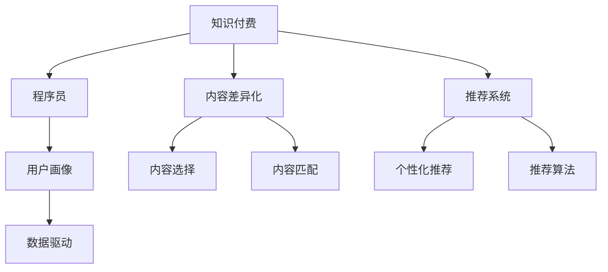

                 

# 程序员知识付费的内容差异化策略

## 1. 背景介绍

### 1.1 问题由来
随着信息技术的发展和互联网的普及，知识付费成为越来越多人获取知识的重要方式。程序员作为信息技术领域的重要从业者，知识付费也成为他们获取新技术、提升个人技能的重要渠道。然而，面对海量的知识付费内容，程序员往往难以从中筛选出最适合自己的高质量资源。这不仅浪费了时间和金钱，还可能导致知识结构的偏差，影响职业发展。

### 1.2 问题核心关键点
本文旨在探讨如何对程序员知识付费的内容进行差异化，帮助程序员在海量知识付费资源中快速定位到最适合自己的内容，从而提高学习效率，提升职业竞争力。本文将从知识付费内容差异化的概念、核心概念之间的联系、核心算法原理及操作步骤、数学模型和公式推导、项目实践案例、实际应用场景、工具和资源推荐、总结与展望等方面进行系统阐述。

## 2. 核心概念与联系

### 2.1 核心概念概述

为更好地理解程序员知识付费内容差异化的策略，本节将介绍几个密切相关的核心概念：

- 知识付费(Knowledge Paywall)：指消费者需要支付一定费用才能获取知识内容，包括在线课程、技术书籍、技术博客等。
- 程序员(K states)：信息技术领域的从业者，具备编程和系统架构能力，需不断学习新技术以适应行业变化。
- 内容差异化(Content Differentiation)：指将不同质量、不同类型、不同来源的知识内容进行区分，帮助用户快速定位到自己需要的知识内容。
- 推荐系统(Recommendation System)：通过分析用户行为数据，推荐符合用户兴趣和需求的内容，提高知识获取效率。
- 用户画像(User Profiling)：对用户基本信息和行为数据的收集和分析，构建用户画像，以便提供更加精准的内容推荐。
- 数据驱动(Datasource-driven)：通过大量数据的收集和分析，驱动内容差异化策略的制定和优化。

这些核心概念之间的逻辑关系可以通过以下Mermaid流程图来展示：



这个流程图展示了几者之间的相互联系：

1. 知识付费平台收集程序员的相关信息，包括兴趣、技能、工作内容等。
2. 利用推荐系统对程序员进行个性化推荐，提供最符合其需求的内容。
3. 推荐系统基于用户画像和数据驱动，分析程序员的行为数据，优化内容推荐算法，提升推荐效果。
4. 内容差异化策略帮助程序员筛选出高质量内容，快速定位到自己需要的知识。

## 3. 核心算法原理 & 具体操作步骤

### 3.1 算法原理概述

程序员知识付费内容差异化的核心算法原理可以概括为：

- 利用推荐系统对程序员进行个性化推荐，提供最符合其需求的内容。
- 根据程序员的行为数据（如点击、学习时长、评价等），动态调整推荐算法，确保推荐的精准性。
- 构建程序员用户画像，包括兴趣、技能、工作内容、学习进度等，以便更精准地进行内容选择和匹配。
- 引入数据驱动的方法，分析程序员的反馈和行为数据，持续优化推荐算法和内容差异化策略。

### 3.2 算法步骤详解

基于上述原理，程序员知识付费内容差异化的主要步骤包括：

**Step 1: 用户画像构建**
- 收集程序员的基本信息和行为数据，如职业、技能、工作内容、学习历史、反馈等。
- 通过数据分析和机器学习技术，构建程序员的用户画像，以便更好地进行内容推荐。

**Step 2: 个性化推荐算法**
- 根据程序员的用户画像，设计个性化的推荐算法，如协同过滤、基于内容的推荐、矩阵分解等。
- 在推荐算法中引入动态调整机制，根据程序员的反馈和行为数据，实时更新推荐模型。

**Step 3: 内容选择与匹配**
- 对知识付费内容进行分类和标注，如编程语言、技术栈、开发工具、框架等。
- 基于推荐算法，对程序员进行内容推荐，并提供内容摘要和预览，帮助程序员快速定位到自己感兴趣的内容。

**Step 4: 用户反馈收集与模型优化**
- 收集程序员对推荐内容的反馈数据，如点击率、学习时长、评价等。
- 根据反馈数据，使用机器学习算法优化推荐模型和内容差异化策略，提升推荐效果。

### 3.3 算法优缺点

程序员知识付费内容差异化的算法主要具有以下优点：

- 提升学习效率。通过个性化推荐，程序员能够快速找到最适合自己的内容，节省时间和精力。
- 提高推荐精度。利用推荐算法和数据驱动的方法，能够动态调整推荐模型，提供更精准的内容推荐。
- 满足个性化需求。构建程序员用户画像，能够更好地匹配其兴趣和技能，提升学习效果。

同时，该算法也存在一定的局限性：

- 数据隐私问题。大量数据的收集和使用可能引发用户隐私风险。
- 推荐冷启动问题。对于新用户，推荐系统难以提供精准的内容推荐。
- 内容丰富度问题。程序员知识付费平台可能面临内容丰富度不足的问题。

尽管存在这些局限性，但就目前而言，基于推荐系统的程序员知识付费内容差异化方法仍是最主流范式。未来相关研究的重点在于如何进一步降低推荐算法对数据的依赖，提高模型的鲁棒性和推荐效果，同时兼顾隐私保护和推荐准确性。

### 3.4 算法应用领域

程序员知识付费内容差异化算法在多个领域得到了广泛的应用，例如：

- 在线编程课程：为程序员提供个性化编程语言、技术栈等课程推荐，帮助他们学习新技术。
- 技术博客和文章：根据程序员的兴趣和技能，推荐相关的技术博客、文章，便于程序员快速了解新技术。
- 开源工具和框架：根据程序员的工作内容，推荐适合的开源工具和框架，提升开发效率。
- 软件架构设计：推荐相关的书籍、文章、课程等，帮助程序员学习先进的软件架构设计方法。
- 项目管理工具：根据程序员的工作流程和需求，推荐适合的项目管理工具，提高项目管理效率。

这些领域的应用表明，程序员知识付费内容差异化算法能够显著提升程序员的学习效率和职业竞争力。

## 4. 数学模型和公式 & 详细讲解 & 举例说明

### 4.1 数学模型构建

本节将使用数学语言对程序员知识付费内容差异化的推荐算法进行更加严格的刻画。

记程序员为 $K$，知识付费内容为 $I$，行为数据为 $D$，用户画像为 $P$，推荐模型为 $M$。定义 $f: K \rightarrow I$ 为内容选择函数，$g: D \rightarrow P$ 为用户画像生成函数，$h: P \rightarrow I$ 为内容匹配函数。推荐系统的一般模型如下：

$$
R(K) = M(f(K), g(D(K)))
$$

其中 $R(K)$ 表示程序员 $K$ 的推荐结果，$D(K)$ 表示程序员 $K$ 的行为数据，$M$ 表示推荐模型。

### 4.2 公式推导过程

假设推荐系统使用协同过滤算法，通过用户-物品评分矩阵 $S$ 和用户画像 $P$，计算相似度 $\text{similarity}(P, P')$，其中 $P'$ 为待推荐内容的用户画像。推荐函数为：

$$
R(K) = \sum_{i \in I} \text{similarity}(P(K), P_i) \cdot S_{Ki}
$$

其中 $S_{Ki}$ 为程序员 $K$ 对内容 $i$ 的评分。

### 4.3 案例分析与讲解

下面以一个简单的程序员知识付费平台为例，说明推荐系统的工作原理。假设平台上有编程语言类课程、技术博客、开源工具等知识内容，记为 $I = \{\text{Python}_i, \text{Java}_j, \text{Ruby}_k, \text{Docker}_l, \text{Git}_m\}$。

- **用户画像构建**：平台收集程序员 $K$ 的职业、技能、工作内容等数据，构建用户画像 $P(K)$。假设 $P(K) = \{\text{Java}, \text{Docker}, \text{Git}\}$。
- **内容匹配**：根据用户画像 $P(K)$，匹配推荐内容。假设 $h(\{\text{Java}, \text{Docker}, \text{Git}\}) = \{\text{Docker}_l, \text{Git}_m\}$。
- **推荐算法**：使用协同过滤算法，计算程序员 $K$ 和内容 $i$ 的评分 $S_{Ki}$。假设 $S_{K\text{Docker}_l} = 0.8, S_{K\text{Git}_m} = 0.6$。
- **推荐结果**：根据推荐函数计算推荐结果。假设 $\text{similarity}(P(K), P_{\text{Docker}}) = 0.7$，$\text{similarity}(P(K), P_{\text{Git}}) = 0.9$。则推荐结果为 $R(K) = 0.7 \cdot 0.8 + 0.9 \cdot 0.6 = 1.16$。

最终推荐结果为 $\text{Docker}_l$ 和 $\text{Git}_m$。程序员 $K$ 可以据此选择最符合自己需求的内容进行学习。

## 5. 项目实践：代码实例和详细解释说明

### 5.1 开发环境搭建

在进行程序员知识付费内容差异化推荐系统的开发前，我们需要准备好开发环境。以下是使用Python进行开发的环境配置流程：

1. 安装Anaconda：从官网下载并安装Anaconda，用于创建独立的Python环境。

2. 创建并激活虚拟环境：
```bash
conda create -n programming_env python=3.8 
conda activate programming_env
```

3. 安装必要的Python包和库：
```bash
pip install pandas numpy matplotlib scikit-learn joblib fastapi uvicorn
```

4. 安装SQL数据库：如MySQL、PostgreSQL等，用于存储用户行为数据和用户画像。

5. 安装GitHub API库，用于获取最新的开源工具和框架信息。

6. 安装OpenStack、AWS、Google Cloud等云平台API库，用于推荐云平台上的编程工具。

完成上述步骤后，即可在`programming_env`环境中开始开发。

### 5.2 源代码详细实现

下面是一个简单的推荐系统实现示例，包括用户画像构建、内容匹配和推荐算法。

```python
import pandas as pd
import numpy as np
import joblib
import fastapi
from fastapi import FastAPI, Request, Response
from pydantic import BaseModel
from sklearn.metrics.pairwise import cosine_similarity
from sklearn.decomposition import TruncatedSVD

class User(BaseModel):
    id: int
    name: str
    job: str
    skills: list[str]
    learning_history: list[str]

class Item(BaseModel):
    id: int
    name: str
    category: str

class Recommendation(BaseModel):
    user: User
    items: list[Item]

app = FastAPI()

# 用户画像
user_profiles = pd.read_csv('user_profiles.csv')
user_profiles.head()

# 内容数据
items = pd.read_csv('items.csv')
items.head()

# 协同过滤算法
svd = TruncatedSVD(n_components=5)
X = svd.fit_transform(user_profiles[['job', 'skills', 'learning_history']].values)
Y = svd.transform(items[['name', 'category']].values)

# 用户画像生成函数
def generate_user_profile(user: User) -> pd.DataFrame:
    user_pf = user_profiles[user.name]
    user_pf = pd.concat([user_pf, pd.Series(svd.transform(user.skills).todense())], axis=1)
    return user_pf

# 内容匹配函数
def match_items(user_profile: pd.DataFrame, items: pd.DataFrame) -> list[int]:
    user_profile = user_profile.T
    item_vectors = Y[user_profile.index]
    scores = np.dot(user_profile.values, item_vectors.T)
    return items.iloc[scores.argmax()].tolist()

# 推荐函数
def recommend_items(user: User) -> Recommendation:
    user_profile = generate_user_profile(user)
    recommended_items = match_items(user_profile, items)
    return Recommendation(user=user, items=recommended_items)

@app.get('/recommend')
def recommend_items_endpoint(user: User = Request.user):
    return recommend_items(user)

if __name__ == '__main__':
    uvicorn.run(app, host='0.0.0.0', port=8000)
```

以上代码实现了基于协同过滤算法的推荐系统，能够在用户请求时实时生成推荐内容。具体流程如下：

1. **用户画像构建**：通过读取用户基本信息和行为数据，构建用户画像。
2. **内容数据准备**：准备推荐内容的数据，包括编程语言、技术博客、开源工具等。
3. **协同过滤算法**：使用SVD算法计算用户画像和内容的相似度，构建用户画像和内容的矩阵。
4. **内容匹配函数**：根据用户画像和内容的矩阵，匹配推荐内容。
5. **推荐函数**：根据用户画像和匹配结果，生成推荐内容。

### 5.3 代码解读与分析

让我们再详细解读一下关键代码的实现细节：

**User类**：
- 定义了用户的基本信息，包括ID、姓名、职位、技能、学习历史等。

**Item类**：
- 定义了推荐内容的基本信息，包括ID、名称、类别等。

**Recommendation类**：
- 定义了推荐结果的类，包括用户信息和推荐内容列表。

**generate_user_profile函数**：
- 根据用户的基本信息和技能，生成用户画像。

**match_items函数**：
- 计算用户画像和内容矩阵的相似度，匹配推荐内容。

**recommend_items函数**：
- 根据用户画像和匹配结果，生成推荐内容。

**FastAPI实现**：
- 使用FastAPI构建API，支持HTTP请求和响应。
- 使用Recommendation类返回推荐结果。

该示例代码实现了一个简单的基于协同过滤算法的推荐系统，帮助程序员快速找到最符合自己需求的知识内容。实际应用中，还需要考虑更多的因素，如推荐算法的优化、用户画像的更新、内容数据的动态维护等，以提高推荐效果。

## 6. 实际应用场景

### 6.1 在线编程课程推荐

基于程序员知识付费内容差异化的推荐系统，可以广泛应用于在线编程课程的推荐中。传统的编程课程推荐往往依赖课程的标签和评分，难以满足个性化需求。推荐系统可以通过收集程序员的学习历史和反馈，精准推荐最适合的编程课程，提高学习效果。

例如，某程序员想要学习Python编程，可以通过推荐系统推荐最新的Python课程、相关书籍和博客，并提供课程评价、学习时长等相关信息，帮助其选择最适合自己的学习资源。

### 6.2 技术博客和文章推荐

技术博客和文章是程序员获取最新技术动态的重要来源。推荐系统可以根据程序员的兴趣和技能，推荐相关领域的博客和文章。例如，某程序员对机器学习感兴趣，推荐系统可以推荐最新的机器学习论文、博客和书籍，便于其快速掌握相关知识。

### 6.3 开源工具和框架推荐

开源工具和框架是程序员日常开发不可或缺的资源。推荐系统可以基于程序员的工作内容，推荐最适合的开源工具和框架。例如，某程序员从事Web开发，推荐系统可以推荐适合的前端框架、后端框架、数据库等，提升开发效率。

### 6.4 未来应用展望

随着推荐系统的不断优化和深入应用，未来将会在更多领域得到应用，为程序员的学习和职业发展带来新的机遇：

- 软件架构设计：推荐系统可以推荐最新的软件架构设计模式、书籍和课程，帮助程序员提升架构设计能力。
- 项目管理工具：推荐系统可以根据程序员的工作流程和需求，推荐适合的项目管理工具，提高项目管理效率。
- 云平台工具：推荐系统可以推荐适合的云平台工具和资源，帮助程序员快速搭建和部署应用。

随着推荐系统的进一步发展，相信程序员知识付费内容差异化将成为一个重要的工具，帮助程序员在知识付费领域获得更多的学习资源和职业发展机会。

## 7. 工具和资源推荐

### 7.1 学习资源推荐

为了帮助程序员系统掌握程序员知识付费内容差异化的理论基础和实践技巧，这里推荐一些优质的学习资源：

1. 《推荐系统实战》：详细介绍了推荐系统的算法原理、实践技巧和应用案例，是推荐系统学习的经典教材。
2. 《深度学习》（Goodfellow等人著）：深度学习领域的经典教材，涵盖推荐系统、知识表示等多个方向，有助于全面了解推荐系统的理论基础。
3. 《数据科学实战》：介绍数据科学领域的实战项目，包括推荐系统的开发和优化，适合实践操作。
4. Kaggle：全球最大的数据科学竞赛平台，涵盖推荐系统、自然语言处理等多个领域，提供大量开源数据和实战案例。
5. GitHub：全球最大的开源社区，提供大量推荐系统的开源项目和代码实现，适合学习和实践。

通过这些资源的学习实践，相信你一定能够快速掌握程序员知识付费内容差异化的精髓，并用于解决实际的推荐问题。

### 7.2 开发工具推荐

高效的开发离不开优秀的工具支持。以下是几款用于程序员知识付费内容差异化推荐系统开发的常用工具：

1. Python：面向对象的动态语言，拥有丰富的第三方库和框架，适合开发推荐系统。
2. pandas：数据分析和处理库，适合数据清洗和预处理。
3. numpy：数学计算库，适合数值计算和算法实现。
4. scikit-learn：机器学习库，适合协同过滤等推荐算法实现。
5. joblib：Python的并行处理库，适合优化推荐算法的计算效率。
6. FastAPI：轻量级的Web框架，适合构建推荐系统的API接口。

合理利用这些工具，可以显著提升程序员知识付费内容差异化推荐系统的开发效率，加快创新迭代的步伐。

### 7.3 相关论文推荐

程序员知识付费内容差异化推荐技术的发展源于学界的持续研究。以下是几篇奠基性的相关论文，推荐阅读：

1. 《推荐系统十大算法》：介绍推荐系统的常用算法，包括协同过滤、基于内容的推荐、矩阵分解等。
2. 《个性化推荐系统》：介绍个性化推荐系统的构建方法和应用场景。
3. 《深度学习与推荐系统》：介绍深度学习在推荐系统中的应用，包括基于深度学习的协同过滤算法。
4. 《知识表示与推荐系统》：介绍知识表示在推荐系统中的应用，如基于知识图谱的推荐。
5. 《推荐系统实时化技术》：介绍推荐系统的实时化技术，如增量学习和缓存技术。

这些论文代表了大语言模型微调技术的发展脉络。通过学习这些前沿成果，可以帮助研究者把握学科前进方向，激发更多的创新灵感。

## 8. 总结：未来发展趋势与挑战

### 8.1 总结

本文对程序员知识付费内容差异化的策略进行了全面系统的介绍。首先阐述了程序员知识付费内容差异化的概念、核心概念之间的联系，以及核心算法原理及操作步骤。接着，从数学模型和公式推导、项目实践案例、实际应用场景、工具和资源推荐、总结与展望等方面进行了详细讲解。

通过本文的系统梳理，可以看到，程序员知识付费内容差异化策略能够帮助程序员在海量知识付费资源中快速定位到最适合自己的内容，从而提高学习效率，提升职业竞争力。未来，伴随推荐系统的不断优化和深入应用，相信程序员知识付费内容差异化将成为一个重要的工具，帮助程序员在知识付费领域获得更多的学习资源和职业发展机会。

### 8.2 未来发展趋势

展望未来，程序员知识付费内容差异化推荐系统将呈现以下几个发展趋势：

1. 用户画像的深度学习化。利用深度学习模型对用户画像进行建模，提取更加丰富的特征信息，提升推荐精度。
2. 推荐算法的多样化和集成化。引入更多的推荐算法，如深度学习推荐、对抗性推荐、协同过滤等，并通过集成学习提升推荐效果。
3. 内容丰富度的提升。不断丰富推荐内容，涵盖更多的开源工具、编程语言、技术博客等，提升推荐系统的完备性。
4. 实时化推荐。利用增量学习和缓存技术，实现实时推荐，满足程序员的即时需求。
5. 跨领域推荐。利用跨领域推荐算法，将不同领域的知识内容进行匹配和推荐，拓展推荐系统的应用范围。
6. 用户反馈的动态化。通过实时收集和分析程序员的反馈数据，动态调整推荐算法和策略，提升推荐效果。

以上趋势凸显了程序员知识付费内容差异化推荐系统的广阔前景。这些方向的探索发展，必将进一步提升程序员的学习效率和职业竞争力，推动程序员知识付费领域的持续进步。

### 8.3 面临的挑战

尽管程序员知识付费内容差异化推荐技术已经取得了一定的进展，但在迈向更加智能化、普适化应用的过程中，它仍面临诸多挑战：

1. 数据隐私和安全问题。大量数据的收集和使用可能引发用户隐私和安全风险。如何保护用户数据隐私，同时提高推荐效果，是一个重要的研究方向。
2. 推荐算法复杂度。现有的推荐算法往往复杂度高，难以实时响应程序员的需求。如何优化算法，降低计算复杂度，提高实时响应能力，是一个重要的挑战。
3. 内容丰富度不足。程序员知识付费平台可能面临内容丰富度不足的问题。如何通过外部数据源和用户反馈，动态丰富推荐内容，提升推荐系统完备性，是一个重要的研究方向。
4. 推荐冷启动问题。对于新用户，推荐系统难以提供精准的内容推荐。如何利用用户行为数据，快速进行冷启动推荐，提高推荐效果，是一个重要的研究方向。
5. 推荐系统公平性。推荐系统可能存在偏见，推荐结果可能对某些程序员不利。如何设计公平的推荐算法，确保推荐结果的公平性，是一个重要的研究方向。

这些挑战需要通过技术创新和实践优化来解决，才能使程序员知识付费内容差异化推荐系统真正落地应用。

### 8.4 研究展望

未来的研究需要在以下几个方面寻求新的突破：

1. 多模态推荐。利用多模态数据（如图像、视频、音频等）进行推荐，提升推荐系统的完备性和丰富度。
2. 个性化推荐算法的优化。利用机器学习算法优化推荐算法，提升推荐精度和效果。
3. 推荐系统隐私保护。利用隐私保护技术，保护用户隐私，同时提高推荐效果。
4. 实时推荐系统的构建。利用增量学习和缓存技术，实现实时推荐，满足程序员的即时需求。
5. 推荐系统的公平性。设计公平的推荐算法，确保推荐结果的公平性，避免偏见。
6. 推荐系统的动态化。利用实时数据和用户反馈，动态调整推荐策略，提升推荐效果。

这些研究方向的探索，必将引领程序员知识付费内容差异化推荐系统走向更高的台阶，为程序员的学习和职业发展带来新的机遇。

## 9. 附录：常见问题与解答

**Q1：程序员知识付费内容差异化的推荐算法有哪些？**

A: 程序员知识付费内容差异化的推荐算法包括协同过滤、基于内容的推荐、矩阵分解、深度学习推荐、对抗性推荐等。不同算法适用于不同的场景和数据特点，选择合适的算法可以有效提升推荐效果。

**Q2：如何评估推荐系统的推荐效果？**

A: 推荐系统的评估指标包括准确率、召回率、F1-score、覆盖率、多样性等。常用的评估方法包括A/B测试、交叉验证、离线评估等。通过综合评估指标，可以优化推荐算法和策略，提升推荐效果。

**Q3：程序员知识付费内容差异化的推荐系统如何优化推荐效果？**

A: 优化推荐效果的方法包括：
1. 数据清洗和预处理，提高数据的准确性和完备性。
2. 选择合适的推荐算法，根据数据特点进行优化。
3. 动态调整推荐算法和策略，根据用户反馈和行为数据进行优化。
4. 引入多模态数据，提升推荐系统的完备性和丰富度。
5. 利用隐私保护技术，保护用户隐私，同时提高推荐效果。

这些方法可以帮助推荐系统提升推荐效果，满足程序员的需求。

**Q4：程序员知识付费内容差异化的推荐系统如何实现实时推荐？**

A: 实现实时推荐的方法包括：
1. 利用增量学习和缓存技术，实时更新推荐模型和数据。
2. 采用分布式计算，提高推荐系统的计算效率。
3. 引入异步算法，减少推荐系统的响应时间。
4. 利用实时数据和用户反馈，动态调整推荐策略。

这些方法可以提高推荐系统的实时响应能力，满足程序员的即时需求。

**Q5：程序员知识付费内容差异化的推荐系统如何保护用户隐私？**

A: 保护用户隐私的方法包括：
1. 匿名化处理，去除个人敏感信息。
2. 加密存储，保护数据传输和存储安全。
3. 差分隐私，引入噪声干扰，保护用户隐私。
4. 用户控制，让用户自主选择数据使用和隐私保护策略。

这些方法可以有效保护用户隐私，同时提高推荐效果。

---

作者：禅与计算机程序设计艺术 / Zen and the Art of Computer Programming

