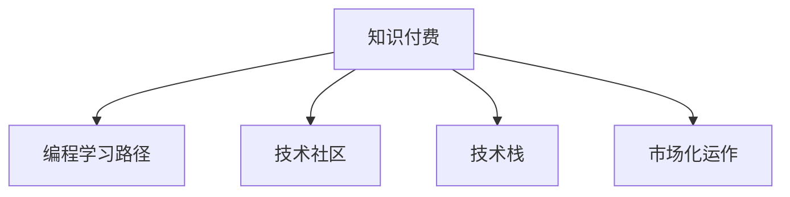

                 

# 程序员知识付费：从入门到精通

> 关键词：知识付费, 程序员入门, 技术进阶, 开发者社区, 技术市场, 学习路径

## 1. 背景介绍

### 1.1 问题由来

在快速变化的技术环境中，知识更新迭代速度不断加快，对程序员的学习和技能提升提出了更高的要求。如何高效、系统地学习新技术、掌握新技能，成为众多开发者的共同难题。知识付费市场正是顺应这一需求而兴起的。

知识付费旨在通过有组织、有深度、有价值的内容，帮助程序员系统化地掌握各种技术和工具，加速技术能力的提升。从入门到精通，再到进阶突破，知识付费提供了一整套高效的学习路径和方法论。

### 1.2 问题核心关键点

知识付费的核心在于将技术知识进行了产品化和商业化，通过线上线下结合的方式，提供从零基础到高级别的技术培训。其核心特点包括：

- **内容深度与质量**：提供的培训内容深浅结合，既有理论基础，也有实战演练。
- **讲师与课程设计**：由业内专家和技术大牛担任讲师，精心设计课程内容，覆盖技术栈的各个层面。
- **实践与项目**：通过大量编程实战和项目案例，让学员在实践中掌握技术。
- **社区与互动**：建立开发者社区，提供问答、讨论和交流的渠道，增强学习互动性。
- **市场化运作**：采用付费模式，通过经济激励促进优质内容的持续输出和更新。

### 1.3 问题研究意义

知识付费不仅是对传统教育模式的补充，更是对技术学习的革命。它打破了时间和空间的限制，为程序员提供了灵活的学习方式和资源。通过系统的知识付费培训，可以帮助开发者：

- **加速学习进度**：提升学习效率，通过系统化的课程设计，快速掌握核心技术。
- **降低学习成本**：省去了试错和学习资源搜集的时间，直接进入高效学习阶段。
- **拓宽学习渠道**：通过丰富的在线课程和资源，接触行业内的最新技术趋势。
- **提升实战能力**：通过大量的实战练习，提高编码技能和问题解决能力。
- **建立社区连接**：加入开发者社区，与同行交流，分享心得，提升职业成长。

## 2. 核心概念与联系

### 2.1 核心概念概述

为更好地理解知识付费的模式和机制，本节将介绍几个关键概念：

- **知识付费**：通过支付费用获取系统化的、高质量的在线教育资源，加速技术学习进程。
- **编程学习路径**：从入门、进阶到突破，覆盖了从基础到高级的各个阶段，帮助开发者系统化地提升技能。
- **技术社区**：在线社区或线下聚会，提供技术讨论、交流和知识分享的平台。
- **技术栈**：指开发者掌握的各种编程语言、框架、工具和技术库的集合。
- **市场化运作**：通过付费机制激励优质内容的产出和维护，保持知识库的持续更新和完善。

这些概念之间的逻辑关系可以通过以下Mermaid流程图来展示：



这个流程图展示了知识付费的各个组成部分及其相互关系：

1. 知识付费是整个学习体系的核心，提供高质量的教育内容。
2. 编程学习路径以系统化的方式覆盖从入门到进阶的各个阶段。
3. 技术社区为学员提供交流和互动的平台。
4. 技术栈是学习内容的具体表现形式。
5. 市场化运作确保了内容的质量和持续更新。

## 3. 核心算法原理 & 具体操作步骤
### 3.1 算法原理概述

知识付费的本质是一种按需教育的模式，它通过在线课程和实战训练，系统化地提升程序员的技术水平。其核心思想是：通过结构化、系统化的课程设计，提供高效的学习路径和资源，帮助开发者逐步提升技术能力。

形式化地，假设知识付费平台提供了一组系统化的课程$C=\{c_i\}_{i=1}^N$，其中$c_i$表示第$i$门课程。每位学员的学习进程可以表示为一个状态$S(t)$，其中$t$表示当前时间。知识付费的目标是通过调整课程$c_i$的权重$w_i$，使得学员的学习状态$S(t)$最大化，即：

$$
\max_{w_i} \sum_{i=1}^N w_i c_i
$$

在实际操作中，知识付费平台会根据学员的学习进度、课程难度、个性化需求等因素，动态调整课程权重，从而适应不同学员的学习需求。

### 3.2 算法步骤详解

知识付费的实施通常包括以下几个关键步骤：

**Step 1: 准备课程内容**

- 设计课程大纲：确定课程的各个模块、内容框架和难度系数。
- 录制课程视频：邀请行业专家和技术大牛录制课程内容，确保高质量教学。
- 编写配套资料：编写课程讲义、代码示例、练习题等，提供辅助学习材料。
- 设立实战项目：设计实战项目，供学员在课程结束后进行实际操作。

**Step 2: 构建课程体系**

- 划分学习阶段：将课程内容划分为入门、进阶、突破等多个阶段。
- 设置课程难度：根据课程内容难度，设计不同等级的学习路径。
- 优化课程设计：通过学员反馈，不断调整课程内容和难度，提高教学效果。

**Step 3: 实施知识付费**

- 收费与订阅：根据课程价值和服务时长，设定合理的收费标准，提供多种订阅方式。
- 提供课程服务：提供在线视频、资料下载、实时问答等服务，确保学员的学习体验。
- 动态调整内容：根据学员学习进度和反馈，动态调整课程内容和难度，提高教学效果。

**Step 4: 社区与交流**

- 建立开发者社区：提供技术讨论、项目交流、资源共享的平台。
- 组织技术会议：定期举办线上线下技术交流会，促进知识分享和技能提升。
- 提供在线咨询：提供实时技术咨询和问题解答，帮助学员解决学习过程中遇到的问题。

**Step 5: 评估与反馈**

- 收集学员反馈：定期收集学员对课程内容和服务的评价，持续改进教学质量。
- 进行学习效果评估：通过在线测试和项目实践，评估学员的学习效果和能力提升。
- 调整学习路径：根据评估结果，调整课程内容和难度，提高学习效果。

以上是知识付费的一般流程。在实际应用中，还需要针对具体平台和课程特点，进行优化设计，如引入AI推荐系统，提高个性化学习体验；加入游戏化元素，增强学习动力等。

### 3.3 算法优缺点

知识付费的优势包括：

- **高效学习**：系统化的课程设计，节省了自学的试错成本和时间。
- **高质量教学**：邀请行业专家授课，确保内容的专业性和实用性。
- **灵活学习**：不受时间和空间的限制，随时随地进行学习。
- **实战训练**：大量实战项目和练习题，提高编码和问题解决能力。
- **社区互动**：提供交流平台，增强学习互动性，提升学习体验。

然而，知识付费也存在一些局限性：

- **成本问题**：课程费用较高，对经济条件有限的学员可能构成负担。
- **内容单一**：部分课程内容可能过于依赖某一技术栈或语言，缺乏广泛性。
- **师资水平参差不齐**：部分课程可能由技术水平不够的讲师授课，影响教学质量。
- **学习效果差异**：学员的学习效果可能因个体差异而不同，无法保证人人达标。
- **依赖性高**：过度依赖课程内容，缺乏自主学习能力，可能影响未来职业发展。

## 4. 数学模型和公式 & 详细讲解
### 4.1 数学模型构建

本节将使用数学语言对知识付费的学习模型进行更加严格的刻画。

设课程体系为$C=\{c_i\}_{i=1}^N$，每位学员的学习进度为$S(t)$，课程$c_i$对学习进度的贡献率为$w_i$，则学习效果的最大化模型可以表示为：

$$
\max_{w_i} \sum_{i=1}^N w_i c_i
$$

其中$c_i$为课程内容，$w_i$为课程权重，表示该课程对学习效果的贡献。

### 4.2 公式推导过程

以下我们以知识付费平台提供的一门编程入门课程为例，推导课程对学习效果的影响：

假设课程内容$c_i$包含视频讲解、配套讲义、实战项目三个模块。学习效果$E_i$由这三个模块的贡献组成，可以表示为：

$$
E_i = \alpha v_i + \beta d_i + \gamma p_i
$$

其中$\alpha$、$\beta$、$\gamma$分别为视频讲解、讲义、实战项目的权重系数，$v_i$、$d_i$、$p_i$分别表示课程中各模块的贡献。

在课程学习过程中，每个模块的贡献率$w_i$与其权重系数成正比，可以表示为：

$$
w_i = k_i \cdot (v_i + d_i + p_i)
$$

其中$k_i$为课程$c_i$的权重系数。

将$w_i$代入学习效果最大化模型，得：

$$
\max_{k_i} \sum_{i=1}^N k_i (\alpha v_i + \beta d_i + \gamma p_i)
$$

即最大化课程体系的学习效果。

### 4.3 案例分析与讲解

**案例一：JavaScript基础**

- 课程内容：视频讲解、配套讲义、实战项目。
- 权重系数：$\alpha=0.3$，$\beta=0.2$，$\gamma=0.5$。
- 学习效果：$E_i = 0.3v_i + 0.2d_i + 0.5p_i$。

**案例二：深度学习实战**

- 课程内容：视频讲解、配套讲义、实战项目。
- 权重系数：$\alpha=0.4$，$\beta=0.3$，$\gamma=0.3$。
- 学习效果：$E_i = 0.4v_i + 0.3d_i + 0.3p_i$。

通过对比不同课程的学习效果，可以发现：
- JavaScript基础课程更注重实战项目，适合零基础学员快速上手。
- 深度学习实战课程更注重视频讲解和理论基础，适合已有一定编程基础的学员深入学习。

## 5. 项目实践：代码实例和详细解释说明
### 5.1 开发环境搭建

在进行知识付费平台开发时，需要准备好开发环境。以下是使用Python进行Django开发的环境配置流程：

1. 安装Python：从官网下载并安装Python，推荐使用3.8及以上版本。
2. 安装Django：使用pip安装Django框架。
```bash
pip install django
```
3. 创建Django项目：
```bash
django-admin startproject knowledgepay
```
4. 创建Django应用：
```bash
cd knowledgepay
python manage.py startapp courses
```
5. 安装课程相关库：
```bash
pip install django-course django-course-student
```

完成上述步骤后，即可在`knowledgepay`项目中开始课程开发。

### 5.2 源代码详细实现

下面以课程内容管理为例，给出使用Django进行知识付费平台开发的PyTorch代码实现。

首先，定义课程模型和学生模型：

```python
from django.db import models

class Course(models.Model):
    name = models.CharField(max_length=100)
    description = models.TextField()
    video_lectures = models.ManyToManyField('VideoLecture')
    readings = models.ManyToManyField('Reading')
    projects = models.ManyToManyField('Project')

class Student(models.Model):
    username = models.CharField(max_length=50)
    courses_enrolled = models.ManyToManyField('Course')
```

然后，定义视频讲座模型、阅读材料模型和项目模型：

```python
class VideoLecture(models.Model):
    title = models.CharField(max_length=100)
    video_url = models.URLField()

class Reading(models.Model):
    title = models.CharField(max_length=100)
    content = models.TextField()

class Project(models.Model):
    name = models.CharField(max_length=100)
    code_url = models.URLField()
```

接着，定义课程学生关联模型：

```python
class CourseStudent(models.Model):
    student = models.ForeignKey(Student, on_delete=models.CASCADE)
    course = models.ForeignKey(Course, on_delete=models.CASCADE)
    progress = models.IntegerField(default=0)
```

最后，定义课程学生关系管理：

```python
from django.shortcuts import render
from django.views.generic import ListView, DetailView
from .models import Course, Student, CourseStudent

def course_list(request):
    courses = Course.objects.all()
    return render(request, 'courses/course_list.html', {'courses': courses})

def course_detail(request, pk):
    course = get_object_or_404(Course, pk=pk)
    students = course.students.all()
    return render(request, 'courses/course_detail.html', {'course': course, 'students': students})
```

以上代码实现了基本的课程内容管理和学生学习进度追踪功能。实际开发中，还需要添加更多的课程功能，如学生注册、报名、学习进度统计、课程评价等。

### 5.3 代码解读与分析

让我们再详细解读一下关键代码的实现细节：

**Course模型**：
- `name`和`description`字段分别表示课程名称和课程描述。
- `video_lectures`、`readings`和`projects`字段分别关联视频讲座、阅读材料和项目，表示课程包含的各个模块。

**Student模型**：
- `username`字段表示学生的用户名。
- `courses_enrolled`字段表示学生选修的课程，通过`CourseStudent`中间表关联。

**CourseStudent模型**：
- `student`和`course`字段分别表示学生和课程的关联关系。
- `progress`字段表示学生对课程的学习进度，用于记录学习状态。

**视图函数**：
- `course_list`函数：获取所有课程信息，渲染课程列表页面。
- `course_detail`函数：获取指定课程信息及其学生列表，渲染课程详情页面。

在Django框架下，通过清晰的模型设计和视图函数，可以实现高效的知识付费平台开发。开发者可以进一步扩展功能，如课程讨论、在线测试、学习进度统计等，提升平台的综合能力。

## 6. 实际应用场景

### 6.1 企业内部培训

知识付费平台在企业内部培训中具有重要应用。企业可以通过平台，系统化地提供编程、技术栈、软技能等各类课程，帮助员工快速提升技能，满足业务需求。

在实际操作中，企业可以定期进行员工技能评估，根据评估结果选择合适的课程进行培训。通过在线学习、项目实战和社区交流，员工可以在短时间内掌握新技能，提升工作效率。

### 6.2 在线教育

在线教育市场也受益于知识付费平台的发展。各类在线教育机构可以基于平台，提供各类高质量的编程课程，覆盖从入门到高级的各个阶段。

通过丰富的课程内容和实战练习，学生可以在线上进行高效学习，及时掌握最新技术和工具。在线教育平台还可以结合社区互动，提供技术讨论和问题解答，增强学习效果。

### 6.3 远程开发

远程开发是知识付费平台的重要应用场景之一。由于当前远程工作普及，开发者需要具备更高的技术水平和协作能力。通过知识付费平台，远程开发者可以进行系统化学习，掌握最新的技术栈和开发工具。

远程团队可以基于平台共享代码库、技术文档和交流平台，提升协作效率和项目质量。平台还可以提供项目管理、代码评审等功能，帮助团队高效开展远程开发工作。

### 6.4 未来应用展望

随着知识付费平台的不断成熟，未来的应用场景将更加丰富多样。以下是对未来应用前景的展望：

1. **智能推荐系统**：结合AI推荐算法，提供个性化的课程推荐，提升学习体验。
2. **虚拟实验室**：提供模拟开发环境，帮助学生进行实战练习，提升编程技能。
3. **知识图谱**：构建知识图谱，提供上下文关联，帮助学员更系统地掌握技术知识。
4. **虚拟助教**：引入虚拟助教，提供实时解答和指导，增强学习效果。
5. **开源社区**：与开源社区合作，提供最新的开源项目和代码库，提升实战能力。
6. **微课程与直播**：提供短时微课程和直播教学，适应时间紧张的学习需求。
7. **跨领域知识**：结合多领域知识，提供跨学科课程，提升综合技术能力。

知识付费平台的应用前景广阔，未来将在更多领域得到应用，为技术学习和技能提升提供更多可能性。

## 7. 工具和资源推荐

### 7.1 学习资源推荐

为了帮助开发者系统掌握知识付费的理论与实践，这里推荐一些优质的学习资源：

1. **《知识付费市场研究报告》**：涵盖知识付费市场规模、发展趋势、主要玩家和市场策略等内容，帮助开发者了解市场动态。
2. **《编程学习路径设计》**：详细介绍编程学习路径设计的方法论，涵盖从入门到进阶的各个阶段。
3. **《知识付费平台开发指南》**：提供从0到1构建知识付费平台的全套教程，包括Django、React等技术栈的使用。
4. **《知识付费平台案例分析》**：通过分析知名知识付费平台如Coursera、Udacity的成功案例，提供平台设计的借鉴。
5. **《知识付费平台运营策略》**：提供知识付费平台的运营策略和方法，涵盖课程内容、用户互动、社区管理等各个方面。

通过对这些资源的学习实践，相信你一定能够快速掌握知识付费平台的开发与运营方法，构建高效的学习平台。

### 7.2 开发工具推荐

高效的开发离不开优秀的工具支持。以下是几款用于知识付费平台开发的常用工具：

1. **Django框架**：Python Web开发框架，提供丰富的扩展模块和模板支持，适合快速搭建Web应用。
2. **React前端框架**：用于构建前端界面，支持组件化开发和数据绑定。
3. **PostgreSQL数据库**：高可用性、高扩展性数据库，适合存储大量的课程和学生数据。
4. **Jenkins CI/CD**：自动化构建、测试和部署工具，帮助持续集成和部署知识付费平台。
5. **Docker容器化**：将知识付费平台封装为Docker容器，便于部署和扩展。
6. **AWS云平台**：提供稳定的云服务，支持大规模知识付费平台的部署和管理。

合理利用这些工具，可以显著提升知识付费平台的开发效率，加速技术创新和应用落地。

### 7.3 相关论文推荐

知识付费技术的快速发展离不开学界的持续研究。以下是几篇奠基性的相关论文，推荐阅读：

1. **《知识付费平台的商业模型研究》**：探讨知识付费平台的商业模式，分析其盈利模式和用户行为。
2. **《编程学习路径设计与实现》**：介绍编程学习路径设计的理论基础和方法论，涵盖从入门到进阶的各个阶段。
3. **《知识付费平台的社区管理研究》**：分析知识付费平台社区的建设和管理方法，提升社区互动效果。
4. **《基于知识图谱的个性化推荐算法》**：介绍基于知识图谱的个性化推荐算法，提升学习效果的个性化程度。
5. **《知识付费平台的用户行为分析》**：分析知识付费平台用户的学习行为和特征，提供用户画像和行为模型。

这些论文代表了大数据、人工智能在知识付费平台中的应用，有助于开发者了解相关领域的最新进展和前沿技术。

## 8. 总结：未来发展趋势与挑战

### 8.1 研究成果总结

本文对知识付费平台的开发与运营进行了全面系统的介绍。首先阐述了知识付费平台的发展背景和市场意义，明确了知识付费在加速技术学习进程中的独特价值。其次，从原理到实践，详细讲解了知识付费的数学模型和具体操作步骤，给出了知识付费平台开发的完整代码实例。同时，本文还广泛探讨了知识付费平台在企业内部培训、在线教育、远程开发等多个领域的应用前景，展示了知识付费范式的广泛潜力。此外，本文精选了知识付费技术的各类学习资源，力求为开发者提供全方位的技术指引。

通过本文的系统梳理，可以看到，知识付费平台正成为技术学习和技能提升的重要途径，极大提升了程序员的学习效率和技术能力。未来，伴随知识付费技术的持续演进，相信知识付费平台将在更多领域得到应用，为技术学习和技能提升提供更多可能性。

### 8.2 未来发展趋势

展望未来，知识付费平台的发展将呈现以下几个趋势：

1. **智能化推荐**：引入AI推荐系统，提供个性化的课程推荐，提升学习效果。
2. **多样化内容**：涵盖编程、技术栈、软技能等多个领域，提供丰富多样的学习资源。
3. **实时交互**：通过在线测试、实时问答等机制，提供实时学习反馈，提升学习体验。
4. **社区驱动**：建立开发者社区，提供交流平台和资源共享，增强学习互动性。
5. **跨领域融合**：结合多领域知识，提供跨学科课程，提升综合技术能力。
6. **技术创新**：引入前沿技术如区块链、AIoT等，提升知识付费平台的安全性和智能化。
7. **市场化运作**：采用多种收费模式，如按需订阅、按效果收费等，激发优质内容的持续输出。

这些趋势凸显了知识付费平台的发展方向，未来将为程序员提供更加高效、智能、互动的学习体验，加速技术学习和技能提升。

### 8.3 面临的挑战

尽管知识付费平台已经取得了显著进展，但在迈向更加智能化、普适化应用的过程中，它仍面临诸多挑战：

1. **内容质量保障**：保证课程内容的质量和持续更新，避免课程内容过时或质量不佳。
2. **师资水平提升**：提高讲师和课程设计的质量，避免师资水平参差不齐带来的教学问题。
3. **用户学习效果差异**：确保不同背景、不同水平的学员都能获得理想的课程效果，避免学习效果差异。
4. **学习动力不足**：避免学员在学习过程中出现动力不足、中途放弃等问题。
5. **平台运营成本**：保证平台的运营和维护，避免平台成本过高。
6. **用户隐私保护**：保护学员的隐私和学习数据，避免数据泄露和安全问题。

这些挑战需要开发者、平台方和用户共同努力，才能确保知识付费平台健康、持续发展。

### 8.4 研究展望

面对知识付费平台面临的挑战，未来的研究需要在以下几个方面寻求新的突破：

1. **内容质量提升**：引入AI内容推荐和课程优化算法，提升课程内容的持续性和质量。
2. **师资团队建设**：引入行业专家和技术大牛，建立专业化的讲师团队，提升教学质量。
3. **学习效果评估**：引入学习效果评估机制，提供实时反馈和改进建议，提升学习效果。
4. **个性化学习路径**：结合学员的学习数据和反馈，提供个性化学习路径，提升学习体验。
5. **社区互动增强**：提供更多社区互动功能，增强学习互动性，提升学习效果。
6. **平台运营优化**：优化平台运营策略，降低运营成本，提升平台盈利能力。
7. **技术创新应用**：引入前沿技术如AIoT、区块链等，提升平台的安全性和智能化。

这些研究方向将为知识付费平台提供新的技术支持和创新动力，促进平台的健康发展。

## 9. 附录：常见问题与解答

**Q1：知识付费平台如何保证内容质量？**

A: 知识付费平台通过多维度评估机制，确保课程内容的质量和持续更新。具体措施包括：
1. 邀请行业专家和知名讲师授课，保证课程的专业性和实用性。
2. 引入学员反馈机制，根据学员评价和建议，及时调整和优化课程内容。
3. 定期进行课程更新，确保课程内容的时效性和前沿性。
4. 建立课程质量评估体系，通过专家评审和用户投票，保证课程质量。

**Q2：如何提高知识付费平台的师资水平？**

A: 知识付费平台可以通过以下措施提高讲师和课程设计的质量：
1. 引入行业专家和技术大牛，建立专业化的讲师团队。
2. 定期举办教师培训和技术交流会，提升讲师的技术水平和教学能力。
3. 设立讲师资质认证机制，保证讲师的专业水平和教学质量。
4. 引入学员反馈机制，根据学员评价和建议，不断优化课程设计。
5. 设立讲师激励机制，吸引和留住优秀的讲师和课程设计者。

**Q3：如何提升学员的学习效果？**

A: 知识付费平台可以通过以下措施提升学员的学习效果：
1. 提供系统化的课程内容，涵盖从入门到进阶的各个阶段。
2. 引入在线测试和实战练习，提供实时反馈和改进建议。
3. 建立社区互动平台，提供技术讨论和问题解答，增强学习互动性。
4. 引入AI推荐系统，提供个性化的课程推荐，提升学习效果。
5. 引入学习效果评估机制，根据学员的学习数据和反馈，提供个性化学习路径。

**Q4：知识付费平台的运营成本如何控制？**

A: 知识付费平台可以通过以下措施控制运营成本：
1. 优化课程设计，减少课程内容的冗余和重复，提高课程质量和效率。
2. 引入技术自动化工具，如自动化测试、自动化部署等，提高运营效率。
3. 利用开源社区资源，引入免费或低成本的课程资源，降低课程开发成本。
4. 引入付费订阅和付费下载机制，通过付费激励优质内容的产出和维护。
5. 优化平台运营策略，减少无效数据和资源占用，提升平台运营效率。

**Q5：知识付费平台如何保护学员隐私？**

A: 知识付费平台可以通过以下措施保护学员的隐私和学习数据：
1. 建立严格的隐私保护政策，明确隐私保护范围和措施。
2. 采用数据加密技术，保护学员的学习数据和个人信息。
3. 引入数据匿名化技术，对学员的学习数据进行去标识化处理。
4. 建立安全管理体系，定期进行安全漏洞检测和修复。
5. 引入学员隐私保护机制，确保学员的隐私和学习数据不被滥用。

这些措施将确保知识付费平台的安全性和隐私保护，提升学员的学习体验和信任感。

---

作者：禅与计算机程序设计艺术 / Zen and the Art of Computer Programming

