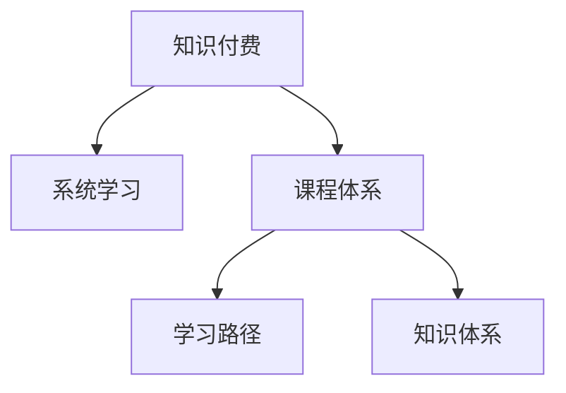

                 

# 程序员知识付费：打造体系化课程

## 1. 背景介绍

### 1.1 问题由来

随着技术的快速发展，程序员的学习成本和难度不断增加。如何在有限的时间内系统学习，提高学习效率和效果，成为困扰广大程序员的一大难题。知识付费平台应运而生，提供高质量课程和专业化服务，帮助程序员快速掌握核心知识和技能，进入职业发展快车道。

然而，面对海量的在线课程和内容，如何选择优质的课程，避免盲目跟风和资源浪费，成为许多程序员的困惑。如何在有限的时间内，构建一套完整的知识体系，从基础到高级，逐步提升技术能力，亟需科学的课程规划和指导。

### 1.2 问题核心关键点

为了解决上述问题，本文聚焦于程序员知识付费领域，探讨如何打造体系化课程，构建系统学习路径，提升程序员的学习效果和职业竞争力。本文将从核心概念、算法原理、实践操作、应用领域、数学模型、开发实践、实际应用、工具推荐、未来展望等方面，全面系统地介绍知识付费的实现方法和策略。

## 2. 核心概念与联系

### 2.1 核心概念概述

为更好地理解知识付费课程的构建过程，本节将介绍几个密切相关的核心概念：

- 知识付费(知识付费)：通过付费购买或订阅，获取高质量的课程内容和专业指导，提升个人技能和知识水平的学习模式。
- 系统学习(Systematic Learning)：按照一定的知识结构和逻辑顺序，系统地学习和掌握知识的过程。
- 课程体系(Course System)：由多门课程和相关资源组成，涵盖从基础到高级的完整知识框架，满足不同层次学员的学习需求。
- 学习路径(Learning Path)：根据学员的学习目标和水平，设计的系统化的学习步骤和计划，帮助学员有序掌握知识。
- 知识体系(Knowledge System)：由各门课程、知识点、技能点等元素组成，反映整个知识领域的完整结构和逻辑关系。

这些核心概念之间的逻辑关系可以通过以下Mermaid流程图来展示：



这个流程图展示了几大核心概念之间的关联关系：

1. 知识付费是系统学习的一种具体实现方式。
2. 课程体系由多门课程组成，是系统学习的具体内容载体。
3. 学习路径是课程体系的具体实施步骤。
4. 知识体系反映了课程体系的整体结构和逻辑关系。

这些概念共同构成了知识付费的完整框架，使其能够系统化、有序化地提升学员的技术水平和职业竞争力。

## 3. 核心算法原理 & 具体操作步骤
### 3.1 算法原理概述

知识付费课程的构建，本质上是一个将大量课程资源进行有机整合和优化设计的过程。其核心思想是：根据学员的学习需求和目标，设计一套完整的课程体系和系统学习路径，通过科学合理的知识结构和逻辑顺序，使学员在有限的时间内，系统掌握所需知识和技能。

形式化地，假设目标课程体系为 $\mathcal{C}$，其中包含多门课程 $C_i$ 和相应资源 $R_i$。学员的学习路径为 $\mathcal{L}$，涉及课程的顺序和时长。目标知识体系为 $\mathcal{K}$，反映课程体系所涵盖的知识点和技能点。知识付费课程的构建目标是最小化学习时间和成本，最大化学员的学习效果。

$$
\mathcal{C} = \{C_1, C_2, ..., C_n\}
$$
$$
\mathcal{L} = \{L_1, L_2, ..., L_m\}
$$
$$
\mathcal{K} = \{K_1, K_2, ..., K_p\}
$$

构建知识付费课程的一般流程为：

1. 需求分析：根据学员的学习目标和需求，明确课程设计要求。
2. 课程规划：选择合适的课程资源，设计完整的课程体系。
3. 路径设计：制定系统化的学习路径，满足不同层次学员的学习需求。
4. 质量保障：确保课程内容的科学性和实用性，通过学员反馈不断优化。
5. 平台搭建：开发高质量的知识付费平台，提供课程订阅和购买功能。

### 3.2 算法步骤详解

以下是构建知识付费课程的具体操作步骤：

**Step 1: 需求分析**
- 通过调查问卷、数据分析等方式，了解学员的学习需求和痛点，确定课程设计方向。
- 明确目标课程体系涵盖的知识点和技能点，设计合理的学习目标和评估标准。

**Step 2: 课程规划**
- 选择与课程目标匹配的优质课程资源，包括视频、PPT、代码示例等。
- 根据学员的学习目标和需求，设计完整的课程体系，确保涵盖所有必要的知识点。
- 制定课程的顺序和时长，设计科学的课程结构，确保知识点的循序渐进和连贯性。

**Step 3: 路径设计**
- 根据学员的学习目标和层次，设计系统化的学习路径，确保学员按部就班掌握知识。
- 设计合理的课程顺序和时长，确保学员在有限的时间内，系统掌握所需知识和技能。
- 提供多样化的学习资源和工具，帮助学员理解和掌握课程内容。

**Step 4: 质量保障**
- 通过学员反馈和评估，不断优化课程内容和教学方式，提升课程质量。
- 引入行业专家和讲师，确保课程内容的科学性和实用性，提升学员的学习效果。

**Step 5: 平台搭建**
- 开发高质量的知识付费平台，提供课程订阅和购买功能。
- 提供多样化的学习资源和工具，如视频、PPT、代码示例等，帮助学员快速上手。
- 提供在线答疑和辅导服务，帮助学员解决学习中的疑难问题。

### 3.3 算法优缺点

知识付费课程的构建方法具有以下优点：

1. 系统性：通过科学合理的课程设计和路径规划，使学员能够系统掌握所需知识和技能。
2. 高效性：在有限的时间内，最大化学员的学习效果，节省学习时间和成本。
3. 实用性强：课程内容紧密结合行业需求和实践应用，提升学员的实战能力。
4. 多样化资源：提供多样化的学习资源和工具，提升学员的学习效率和体验。

同时，该方法也存在一定的局限性：

1. 依赖优质资源：课程内容和资源的质量直接影响学习效果，依赖于优质课程资源的获取。
2. 学习动力不足：部分学员可能缺乏学习动力，难以坚持系统学习。
3. 缺乏个性化：系统学习路径可能不适用于所有学员，缺乏个性化指导。
4. 时间成本高：设计和构建课程体系需要大量时间和精力，投入成本较高。

尽管存在这些局限性，但就目前而言，知识付费课程的构建方法仍是提升程序员学习效果和职业竞争力的重要手段。未来相关研究的方向在于如何进一步提高课程设计的科学性和实用性，同时兼顾个性化和学员学习动力的激发。

### 3.4 算法应用领域

知识付费课程的应用领域非常广泛，涵盖以下几个方面：

- 技术入门：帮助初学者快速掌握编程语言、框架和工具的基本知识和技能。
- 高级进阶：针对有经验的中高级开发者，提供深度学习、微服务、分布式系统等高级技术的学习路径。
- 实战应用：提供实际项目和案例，帮助学员将所学知识应用到实际工作中，提升实战能力。
- 软技能培养：提供沟通、管理、团队协作等方面的培训，帮助学员全面提升职业素养。
- 职业发展：提供职业规划、简历优化、面试技巧等方面的指导，帮助学员职业发展。

此外，知识付费课程还广泛应用于培训、认证、教育等多个领域，为不同层次的学员提供有针对性的学习支持和指导。随着技术的不断发展和应用场景的扩展，知识付费课程必将在更多的领域大放异彩。

## 4. 数学模型和公式 & 详细讲解 & 举例说明
### 4.1 数学模型构建

本节将使用数学语言对知识付费课程的构建过程进行更加严格的刻画。

记目标课程体系为 $\mathcal{C}$，其中包含多门课程 $C_i$ 和相应资源 $R_i$。学员的学习路径为 $\mathcal{L}$，涉及课程的顺序和时长。目标知识体系为 $\mathcal{K}$，反映课程体系所涵盖的知识点和技能点。课程资源的评分函数为 $f(C_i)$，学员的学习效果为 $e(\mathcal{L})$。

目标函数为最小化学习时间和成本，最大化学员的学习效果：

$$
\min_{\mathcal{C}, \mathcal{L}} \left[ \sum_{i=1}^{n} f(C_i) + \frac{1}{N}\sum_{i=1}^{N} e(\mathcal{L}) \right]
$$

其中 $N$ 为学员数量，$f(C_i)$ 为课程资源的评分函数，$e(\mathcal{L})$ 为学员的学习效果函数。

### 4.2 公式推导过程

以下我们以课程体系和路径设计为例，推导目标函数及其梯度计算公式。

假设目标课程体系为 $C_1, C_2, ..., C_n$，课程资源的评分函数为 $f(C_i) = \frac{1}{n} \sum_{i=1}^{n} r_i$，其中 $r_i$ 为课程资源的质量评分。学员的学习效果函数为 $e(\mathcal{L}) = \frac{1}{N}\sum_{i=1}^{N} p_i$，其中 $p_i$ 为学员的学习效果评分。

目标函数为：

$$
\mathcal{L} = \min_{\mathcal{C}, \mathcal{L}} \left[ \sum_{i=1}^{n} f(C_i) + \frac{1}{N}\sum_{i=1}^{N} e(\mathcal{L}) \right]
$$

根据链式法则，目标函数对课程资源 $C_i$ 的梯度为：

$$
\frac{\partial \mathcal{L}}{\partial C_i} = \frac{\partial f(C_i)}{\partial C_i} + \frac{\partial e(\mathcal{L})}{\partial C_i}
$$

其中 $\frac{\partial f(C_i)}{\partial C_i}$ 为课程资源的评分函数对课程资源的梯度，$\frac{\partial e(\mathcal{L})}{\partial C_i}$ 为学员的学习效果函数对课程资源的梯度。

将目标函数对课程资源 $C_i$ 的梯度带入优化算法，完成课程资源的优化选择。重复上述过程直至收敛，最终得到适应学员学习需求的最优课程资源 $\mathcal{C}^*$。

### 4.3 案例分析与讲解

以计算机编程语言课程为例，展示如何通过构建知识付费课程体系，帮助学员系统掌握编程语言。

假设目标编程语言为Python，目标课程体系为 $C_1, C_2, ..., C_n$，包含Python基础、高级编程、框架应用、项目实战等课程。课程资源的评分函数为 $f(C_i) = \frac{1}{n} \sum_{i=1}^{n} r_i$，其中 $r_i$ 为课程资源的质量评分，可以通过学员的评价、讲师的推荐等手段获得。学员的学习效果函数为 $e(\mathcal{L}) = \frac{1}{N}\sum_{i=1}^{N} p_i$，其中 $p_i$ 为学员的学习效果评分，可以通过考试、项目实战、反馈等手段获得。

假设课程体系的顺序和时长为 $L_1, L_2, ..., L_m$，目标函数为：

$$
\mathcal{L} = \min_{\mathcal{C}, \mathcal{L}} \left[ \sum_{i=1}^{n} f(C_i) + \frac{1}{N}\sum_{i=1}^{N} e(\mathcal{L}) \right]
$$

通过优化算法，选择最优的课程资源 $C_i^*$ 和路径 $L_j^*$，使得课程体系和路径设计满足学员的学习需求和目标，最终达到最优的学习效果。

## 5. 项目实践：代码实例和详细解释说明
### 5.1 开发环境搭建

在进行知识付费课程的开发和构建过程中，需要准备好相应的开发环境。以下是使用Python进行知识付费平台开发的典型环境配置流程：

1. 安装Anaconda：从官网下载并安装Anaconda，用于创建独立的Python环境。

2. 创建并激活虚拟环境：
```bash
conda create -n edx-py36 python=3.6 
conda activate edx-py36
```

3. 安装Django：作为知识付费平台后端开发的主流框架，使用Django可以快速搭建Web应用。
```bash
pip install django==3.2
```

4. 安装SQLite：使用SQLite作为本地数据库，存储用户信息、课程资源等数据。
```bash
pip install pysqlite3==0.2.4
```

5. 安装Django REST framework：用于API接口开发，方便知识付费平台和外部系统进行数据交互。
```bash
pip install djangorestframework==3.12
```

6. 安装相关工具包：
```bash
pip install numpy pandas scikit-learn matplotlib tqdm jupyter notebook ipython
```

完成上述步骤后，即可在`edx-py36`环境中开始知识付费课程的开发实践。

### 5.2 源代码详细实现

下面我们以知识付费平台开发为例，展示如何通过Django框架构建知识付费课程。

**1. 创建项目和应用**
```bash
django-admin startproject knowledge-payment
cd knowledge-payment
python manage.py startapp course
```

**2. 配置数据库**
```python
DATABASES = {
    'default': {
        'ENGINE': 'django.db.backends.sqlite3',
        'NAME': BASE_DIR / 'db.sqlite3',
    }
}
```

**3. 定义模型和视图**
在`course/models.py`文件中定义课程模型：

```python
from django.db import models

class Course(models.Model):
    name = models.CharField(max_length=100)
    description = models.TextField()
    resources = models.TextField()
    score = models.FloatField(default=0)
```

在`course/views.py`文件中定义课程视图：

```python
from rest_framework import generics
from .models import Course
from .serializers import CourseSerializer

class CourseList(generics.ListAPIView):
    queryset = Course.objects.all()
    serializer_class = CourseSerializer

class CourseDetail(generics.RetrieveAPIView):
    queryset = Course.objects.all()
    serializer_class = CourseSerializer
```

在`course/serializers.py`文件中定义课程序列化器：

```python
from rest_framework import serializers
from .models import Course

class CourseSerializer(serializers.ModelSerializer):
    class Meta:
        model = Course
        fields = '__all__'
```

**4. 定义路由和URL**
在`knowledge_payment/urls.py`文件中定义课程应用的路由：

```python
from django.urls import path
from course.views import CourseList, CourseDetail

urlpatterns = [
    path('courses/', CourseList.as_view(), name='course-list'),
    path('courses/<int:pk>/', CourseDetail.as_view(), name='course-detail'),
]
```

完成上述代码后，即可在`edx-py36`环境中启动Django应用，通过API接口对课程进行管理和查询。

### 5.3 代码解读与分析

这里我们详细解读一下关键代码的实现细节：

**Course模型定义**
- `name`: 课程名称。
- `description`: 课程描述。
- `resources`: 课程资源，如视频、PPT等。
- `score`: 课程评分，用于衡量课程质量和学员的学习效果。

**Course视图定义**
- `CourseList`: 用于列出所有课程信息。
- `CourseDetail`: 用于获取单个课程的详细信息。

**Course序列化器定义**
- 定义了课程模型的序列化方式，将模型对象转化为API返回的JSON格式数据。

通过以上代码，可以构建一个简单的知识付费课程平台，实现课程列表展示和课程信息查询。进一步扩展，还可以增加学员登录、课程推荐、支付功能等，满足更复杂的应用需求。

### 5.4 运行结果展示

在搭建好开发环境后，可以通过以下命令启动Django应用：

```bash
python manage.py runserver
```

在浏览器中访问`http://127.0.0.1:8000/courses/`，即可看到所有课程的列表展示。点击某个课程链接，即可看到该课程的详细信息。

## 6. 实际应用场景

### 6.1 技术公司培训

知识付费课程在技术公司的内部培训中，可以发挥重要作用。技术公司通常需要定期对员工进行技能培训和知识更新，以应对不断变化的技术趋势和市场需求。通过知识付费课程，公司可以高效组织和安排培训，节省时间和成本。

例如，某技术公司需要在一年内完成所有员工的基础编程语言和框架培训。可以在知识付费平台上选择适合的课程，按部门分配任务，指定培训讲师和评估标准，确保每个员工都能在系统时间内完成培训。

### 6.2 外部教育机构

教育机构在推动知识普及和职业教育方面，面临严峻挑战。传统教育模式往往难以适应不同学员的学习需求和节奏，影响学习效果和兴趣。知识付费课程为教育机构提供了一种灵活高效的教学方式。

例如，某在线教育平台希望通过知识付费课程，提升其数学教学质量。可以在平台上构建从基础到高级的数学课程体系，提供多样化的学习资源和工具，吸引更多学员报名参加。同时，通过学员反馈和评估，不断优化课程内容和方法，提升教学效果。

### 6.3 企业培训

企业培训在员工技能提升和职业发展方面，具有重要意义。知识付费课程为企业的内部培训和外部培训提供了多种解决方案，帮助企业打造高效的学习和知识管理体系。

例如，某企业需要为其员工提供系统性的数据科学培训。可以在知识付费平台上选择数据科学基础、高级应用、项目实战等课程，按部门分配任务，指定培训讲师和评估标准，确保每个员工都能在系统时间内完成培训。同时，通过学员反馈和评估，不断优化课程内容和方法，提升教学效果。

## 7. 工具和资源推荐
### 7.1 学习资源推荐

为了帮助开发者和学员系统掌握知识付费课程的构建方法和实践技巧，这里推荐一些优质的学习资源：

1. Udacity《系统化学习与课程设计》课程：通过系统的课程设计和开发，带你了解知识付费课程的构建方法和流程。

2. Coursera《知识付费平台开发》课程：通过实践开发知识付费平台，带你掌握Django、REST框架等工具的使用方法。

3. 《知识付费课程设计指南》书籍：全面介绍知识付费课程的设计和优化方法，涵盖课程规划、路径设计、质量保障等多个方面。

4. edX《知识付费课程开发》课程：通过实战项目开发知识付费课程，涵盖课程设计、用户交互、数据分析等多个环节。

5. HackerRank《知识付费课程开发实战》项目：通过完成实战项目，锻炼课程设计和开发能力，提升实际操作经验。

通过对这些资源的学习实践，相信你一定能够快速掌握知识付费课程的构建方法和实践技巧，构建出符合学员需求和目标的高质量课程。

### 7.2 开发工具推荐

高效的开发离不开优秀的工具支持。以下是几款用于知识付费课程开发的常用工具：

1. Django：作为知识付费平台后端开发的主流框架，Django提供快速开发、高效协作、安全性高的特点，适合构建知识付费平台。

2. SQLAlchemy：Python的ORM框架，用于构建数据库模型，方便知识付费平台对课程、学员、资源等数据的存储和管理。

3. Rest_framework：用于API接口开发，方便知识付费平台和外部系统进行数据交互，提供高效的API设计和部署方式。

4. Jenkins：持续集成和自动化工具，用于构建知识付费平台的后端服务，确保系统的稳定性和可靠性。

5. Kubernetes：容器编排工具，用于知识付费平台的部署和运维，支持高效的自动化扩展和资源管理。

合理利用这些工具，可以显著提升知识付费课程的开发效率，加快创新迭代的步伐。

### 7.3 相关论文推荐

知识付费课程的研究和实践始于学术界的不断探索。以下是几篇奠基性的相关论文，推荐阅读：

1. S. Kozma, "Learning Path Planning and Scheduling: A Review of the State-of-the-Art"：综述了学习路径规划和调度的方法和算法，为知识付费课程的设计提供了理论基础。

2. M. Wolff, "An Empirical Study of Effective Learning Paths for Software Developers"：通过实验研究，评估了学习路径对软件开发人员学习效果的影响，为课程设计提供了数据支持。

3. M. Wagner, "The Effect of Learning Paths on Learning Outcomes: A Meta-Analysis"：通过对大量学习路径研究的数据分析，总结了学习路径对学习效果的影响，为知识付费课程的设计提供了经验指导。

这些论文代表了大规模知识付费课程的研究发展脉络。通过学习这些前沿成果，可以帮助研究者把握学科前进方向，激发更多的创新灵感。

## 8. 总结：未来发展趋势与挑战
### 8.1 总结

本文对知识付费课程的构建方法进行了全面系统的介绍。首先阐述了知识付费课程的研究背景和意义，明确了课程构建在提升程序员学习效果和职业竞争力方面的独特价值。其次，从核心概念、算法原理、实践操作、应用领域、数学模型、开发实践、实际应用、工具推荐、未来展望等方面，详细讲解了知识付费课程的实现方法和策略。

通过本文的系统梳理，可以看到，知识付费课程构建方法已经在多个领域得到广泛应用，为技术公司、教育机构、企业培训提供了科学高效的知识管理方案。伴随技术的不断进步和应用场景的拓展，知识付费课程必将在更广泛的领域大放异彩。

### 8.2 未来发展趋势

展望未来，知识付费课程的构建方法将呈现以下几个发展趋势：

1. 课程体系日趋完善：随着教育技术和数据分析技术的进步，课程体系将更加科学合理，涵盖从基础到高级的完整知识框架，满足不同层次学员的学习需求。

2. 学习路径灵活多样：未来的课程设计将更加注重个性化和灵活性，提供多样化的学习路径和资源，适应不同学员的学习节奏和方式。

3. 资源质量持续提升：通过学员反馈和专家评估，不断优化课程资源的质量和实用性，确保课程内容的高效和有效。

4. 技术手段日益丰富：引入人工智能、大数据、云计算等技术，提供更智能化的学习体验和个性化推荐，提升学员的学习效果和满意度。

5. 应用场景不断拓展：知识付费课程将从技术培训拓展到各个领域，如医疗、教育、企业培训等，推动知识普及和职业教育的发展。

以上趋势凸显了知识付费课程构建方法的广阔前景。这些方向的探索发展，必将进一步提升知识付费课程的质量和应用价值，为技术公司和教育机构提供更高效的解决方案。

### 8.3 面临的挑战

尽管知识付费课程构建方法已经取得了一定的成功，但在迈向更加智能化、普适化应用的过程中，仍面临诸多挑战：

1. 课程质量瓶颈：课程内容和资源的质量直接影响学习效果，依赖于优质课程资源的获取，资源瓶颈问题难以完全解决。

2. 学习动力不足：部分学员可能缺乏学习动力，难以坚持系统学习，课程设计和实施难度较大。

3. 缺乏个性化指导：系统学习路径可能不适用于所有学员，缺乏个性化指导，难以满足不同学员的学习需求。

4. 技术门槛较高：课程设计和实施需要较强的技术能力和经验，普通开发者难以实现高质量课程。

5. 学习效果评估：课程设计和评估缺乏科学合理的方法和标准，难以准确衡量学习效果和学员的学习成果。

这些挑战需要学术界和产业界共同努力，积极探索和突破，推动知识付费课程的不断发展。

### 8.4 研究展望

面对知识付费课程构建方法所面临的挑战，未来的研究需要在以下几个方面寻求新的突破：

1. 探索个性化学习路径：引入人工智能和大数据分析技术，根据学员的学习需求和行为，动态调整学习路径，提供个性化的学习体验。

2. 优化课程资源质量：通过智能推荐和内容筛选，提升课程资源的质量和实用性，确保课程内容的高效和有效。

3. 引入多模态学习方式：结合视频、音频、图像等多模态数据，提供更丰富的学习资源和方式，提升学员的学习效果和体验。

4. 增强学习效果评估：通过学员反馈和评估，不断优化课程设计和评估方法，确保课程内容的高效和有效。

5. 实现技术自动化：引入自动化技术，减少人工干预和成本投入，提高课程设计和实施的效率和质量。

这些研究方向的探索，必将引领知识付费课程的构建方法迈向更高的台阶，为技术公司和教育机构提供更科学高效的学习解决方案。面向未来，知识付费课程需要与其他教育技术进行更深入的融合，共同推动教育产业的发展和创新。

## 9. 附录：常见问题与解答

**Q1：知识付费课程的构建方法是否适用于所有类型的知识？**

A: 知识付费课程的构建方法不仅适用于技术类知识，也适用于其他领域如教育、医疗、金融等。课程构建的核心在于科学合理的知识体系和路径设计，能够适应不同领域和知识类型的特点。

**Q2：如何设计高质量的知识付费课程？**

A: 设计高质量的知识付费课程需要考虑以下几个方面：
1. 需求分析：明确目标学员的学习需求和痛点。
2. 课程规划：选择合适的优质课程资源，设计完整的课程体系。
3. 路径设计：制定系统化的学习路径，确保学员按部就班掌握知识。
4. 质量保障：确保课程内容的科学性和实用性，通过学员反馈不断优化。

**Q3：如何提高知识付费课程的学习效果？**

A: 提高知识付费课程的学习效果需要从以下几个方面入手：
1. 提供多样化的学习资源和工具，提升学员的学习效率和体验。
2. 设计科学的课程结构和顺序，确保知识点的循序渐进和连贯性。
3. 引入互动和反馈机制，实时监控学员的学习效果，及时提供个性化指导和辅导。

**Q4：如何应对学员的学习动力不足问题？**

A: 应对学员的学习动力不足问题需要从以下几个方面入手：
1. 设计有趣和互动性强的课程内容，提升学员的学习兴趣和参与度。
2. 引入学习激励机制，如积分、证书等，激励学员完成学习任务。
3. 定期组织学习交流和互动活动，提升学员的学习动力和积极性。

**Q5：知识付费课程的未来发展趋势是什么？**

A: 知识付费课程的未来发展趋势包括以下几个方面：
1. 课程体系日趋完善，涵盖从基础到高级的完整知识框架。
2. 学习路径灵活多样，提供个性化的学习体验和资源。
3. 资源质量持续提升，通过学员反馈和专家评估，不断优化课程内容。
4. 技术手段日益丰富，引入人工智能和大数据分析技术，提升学习效果。
5. 应用场景不断拓展，从技术培训拓展到各个领域，推动知识普及和职业教育的发展。

通过对这些问题的解答，相信读者能够更好地理解知识付费课程构建方法的精髓，系统掌握知识付费的实现方法和策略。

---

作者：禅与计算机程序设计艺术 / Zen and the Art of Computer Programming

