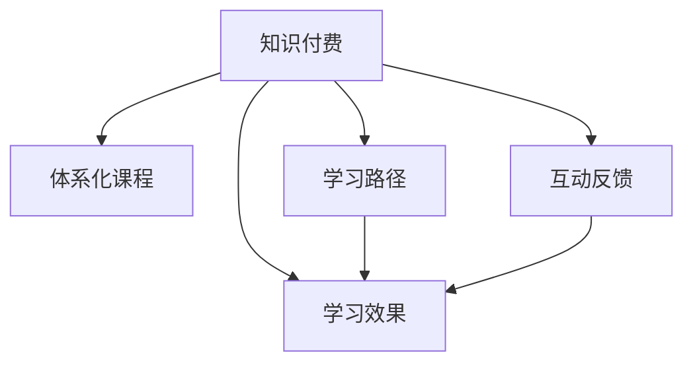

                 

# 程序员知识付费：打造体系化课程

## 1. 背景介绍

随着互联网技术的迅猛发展，软件开发和IT应用在各行各业中越来越普及，程序员成为了不可缺少的一支力量。然而，对于初学者和经验不足的开发者来说，快速掌握新技术和技能、提升自己的实战能力仍是一大挑战。因此，知识付费模式应运而生，通过线上课程、培训、咨询等多种形式，帮助程序员系统学习和掌握知识，提升职业竞争力。本文将从知识付费的背景和现状出发，探讨如何打造体系化、高效实用的课程，助力程序员的职业成长。

## 2. 核心概念与联系

### 2.1 核心概念概述

- **知识付费**：指的是消费者为获取知识和技能而支付费用的行为，通过线上课程、培训、咨询等形式，提供系统的知识学习路径。
- **体系化课程**：是指由浅入深、循序渐进、涵盖多个知识点的课程结构，能够帮助学习者系统掌握某一领域知识，提升实际应用能力。
- **学习路径**：是指根据学习目标，设计的一条知识学习的路径，包括知识点、难度、实践、反馈等环节。
- **互动反馈**：是指在学习过程中，通过提问、测试、讨论等方式，及时获取学习效果反馈，调整学习策略。
- **学习效果**：是指学习者通过课程学习，获得的知识掌握程度和技能提升水平。

这些概念之间的逻辑关系可以通过以下Mermaid流程图来展示：



## 3. 核心算法原理 & 具体操作步骤

### 3.1 算法原理概述

构建体系化课程的算法原理，主要是通过设计合理的课程结构和学习路径，结合互动反馈和效果评估，来实现学习者知识技能的系统掌握。具体而言，包括以下几个关键步骤：

1. **课程设计**：根据学习目标，选择核心知识点，设计课程结构和教学内容。
2. **学习路径规划**：根据学习者的基础和需求，制定分阶段的学习路径，逐步提升难度和深度。
3. **互动反馈机制**：通过提问、测试、讨论等方式，获取学习者的反馈，调整教学内容和策略。
4. **效果评估**：通过测试、项目、考试等方式，评估学习者的学习效果，提供针对性的反馈和指导。

### 3.2 算法步骤详解

#### 3.2.1 课程设计

课程设计是打造体系化课程的第一步，需要综合考虑学习目标、知识点、学习方式、教学资源等因素。具体步骤如下：

1. **确定学习目标**：明确课程旨在解决的问题或提升的技能，如Java编程、数据科学等。
2. **选择核心知识点**：基于学习目标，选择必备的核心知识点，如编程语言基础、算法与数据结构、软件工程等。
3. **设计课程结构**：将知识点组织成逻辑严密的课程结构，包括理论知识、实践项目、实战案例等。
4. **准备教学资源**：包括教学视频、教材、代码示例等，为学习者提供全方位的学习支持。

#### 3.2.2 学习路径规划

学习路径规划是根据学习者的基础和需求，制定合理的学习路线，逐步提升难度和深度。具体步骤如下：

1. **评估学习者基础**：了解学习者的编程水平、学习经验等，制定个性化的学习计划。
2. **设计学习阶段**：将课程内容分为多个阶段，每个阶段设置明确的学习目标和评估标准。
3. **逐步提升难度**：从基础知识点开始，逐步引入复杂概念和实践项目，提升学习者能力。
4. **定期回顾和巩固**：定期回顾已学知识点，巩固学习效果，避免知识遗忘。

#### 3.2.3 互动反馈机制

互动反馈机制是在学习过程中，通过多种方式获取学习者的反馈，调整教学内容和策略。具体步骤如下：

1. **设计互动环节**：在课程中设计互动环节，如提问、讨论、测试等，鼓励学习者积极参与。
2. **实时反馈**：及时获取学习者的反馈，分析学习效果和问题，调整教学策略。
3. **个性化指导**：根据学习者的反馈和问题，提供个性化的指导和建议，帮助其解决学习困难。
4. **持续改进**：根据学习者的反馈和课程效果，持续改进课程内容和教学方法，提升课程质量。

#### 3.2.4 效果评估

效果评估是通过多种方式，评估学习者的学习效果，提供针对性的反馈和指导。具体步骤如下：

1. **设计评估方式**：选择适合的评估方式，如测试、项目、考试等，全面评估学习者的学习效果。
2. **及时反馈**：根据评估结果，及时提供反馈和指导，帮助学习者改进和提升。
3. **个性化指导**：针对学习者的薄弱环节，提供个性化的指导和资源，帮助其克服学习障碍。
4. **跟踪学习进度**：定期跟踪学习者的学习进度和效果，及时调整学习策略和课程内容。

### 3.3 算法优缺点

#### 3.3.1 优点

1. **系统性**：通过设计合理的课程结构和学习路径，帮助学习者系统掌握知识，提升技能水平。
2. **互动性**：通过互动反馈机制，及时获取学习者的反馈，调整教学内容和策略，提升学习效果。
3. **个性化**：根据学习者的基础和需求，制定个性化的学习计划，提供个性化的指导和资源，帮助其快速提升。
4. **效果显著**：通过效果评估和持续改进，确保学习者能够掌握核心知识点，提升实际应用能力。

#### 3.3.2 缺点

1. **资源需求高**：构建体系化课程需要大量的时间和资源投入，包括课程设计、资源准备、互动反馈等环节。
2. **学习者自主性要求高**：学习者需要具备较强的自主学习能力和自我管理能力，才能有效利用课程资源。
3. **学习进度不一**：不同学习者的学习进度和效果可能存在差异，需要针对性地调整教学策略。
4. **课程内容更新较快**：IT技术发展迅速，课程内容需要定期更新和改进，保持与时俱进。

### 3.4 算法应用领域

体系化课程构建方法广泛应用于IT培训、在线教育、技能提升等多个领域，具体应用场景如下：

- **IT培训**：为初入IT行业的人员提供系统化的编程、软件开发、系统架构等培训课程。
- **在线教育**：提供针对不同层次学习者的编程、数据科学、人工智能等课程，满足个性化学习需求。
- **技能提升**：为在职人员提供新技能培训，提升职业竞争力，如Java高级编程、数据分析、机器学习等。
- **项目实战**：结合实际项目案例，帮助学习者掌握实际应用能力，提升项目管理和开发技能。
- **职业发展**：为不同阶段职业发展规划提供系统化的学习路径，帮助其不断提升职业素养和技能。

## 4. 数学模型和公式 & 详细讲解 & 举例说明

### 4.1 数学模型构建

根据课程设计、学习路径规划、互动反馈和效果评估等步骤，构建体系化课程的数学模型如下：

设课程总时长为 $T$，学习者基础为 $B$，课程内容分为 $N$ 个阶段，每个阶段时长为 $t_i$，难度系数为 $D_i$，互动反馈频率为 $F_i$，效果评估方式为 $E_i$。

则体系化课程的学习模型可以表示为：

$$
T = \sum_{i=1}^N t_i \quad \text{(课程总时长)}
$$

$$
B = \sum_{i=1}^N D_i \quad \text{(课程总难度)}
$$

$$
F = \sum_{i=1}^N F_i \quad \text{(互动反馈频率)}
$$

$$
E = \sum_{i=1}^N E_i \quad \text{(效果评估方式)}
$$

### 4.2 公式推导过程

根据上述模型，我们可以进一步推导出课程效果评估的公式。设学习者最终掌握的知识点为 $K$，则课程效果评估公式为：

$$
K = B + \sum_{i=1}^N D_i + \sum_{i=1}^N F_i + \sum_{i=1}^N E_i
$$

其中，$B$ 表示学习者的基础水平，$D_i$ 表示课程阶段难度系数，$F_i$ 表示互动反馈频率，$E_i$ 表示效果评估方式。

### 4.3 案例分析与讲解

假设一门Java编程课程总时长为 $T=100$ 小时，学习者基础为 $B=0$，课程分为5个阶段，每个阶段时长为 $t_i=20$ 小时，难度系数 $D_i=[1,1,2,2,3]$，互动反馈频率 $F_i=[1,2,1,2,1]$，效果评估方式 $E_i=[1,1,2,1,1]$。

则课程总难度系数为 $D=1+1+2+2+3=9$，互动反馈频率为 $F=1+2+1+2+1=7$，效果评估方式为 $E=1+1+2+1+1=6$。

最终课程效果评估公式为：

$$
K = 0 + 9 + 7 + 6 = 22
$$

表示学习者通过这门课程，可以掌握22个Java编程知识点，显著提升其实践能力和应用水平。

## 5. 项目实践：代码实例和详细解释说明

### 5.1 开发环境搭建

构建体系化课程需要相应的开发环境，包括编程语言、开发工具、数据集等。这里以Python为例，介绍开发环境的搭建步骤：

1. **编程语言**：选择Python作为主要编程语言，因为Python具有丰富的科学计算和数据分析库，如NumPy、Pandas等。
2. **开发工具**：使用Jupyter Notebook作为开发工具，方便编写和运行代码，支持多种编程语言和数据格式。
3. **数据集**：收集和整理相关的数据集，包括课程内容、学习者反馈、评估结果等，作为课程构建的基础。

### 5.2 源代码详细实现

下面以Python为例，展示体系化课程构建的源代码实现。

```python
# 定义课程结构
class Course:
    def __init__(self, name, duration, difficulty, interaction, evaluation):
        self.name = name
        self.duration = duration
        self.difficulty = difficulty
        self.interaction = interaction
        self.evaluation = evaluation

# 创建课程对象
course1 = Course("Python基础", 20, 1, 2, 1)
course2 = Course("数据结构与算法", 40, 2, 1, 2)
course3 = Course("Web开发", 30, 2, 3, 1)
course4 = Course("数据库设计", 20, 3, 2, 1)
course5 = Course("机器学习", 10, 3, 3, 1)

# 计算课程总难度、互动频率、评估方式
total_difficulty = sum([course.difficulty for course in courses])
total_interaction = sum([course.interaction for course in courses])
total_evaluation = sum([course.evaluation for course in courses])

# 计算课程总时长
total_duration = sum([course.duration for course in courses])

# 计算课程效果评估
total_knowledge = 0
for i, course in enumerate(courses):
    total_knowledge += course.difficulty + course.interaction + course.evaluation + 1
    if i == len(courses)-1:
        total_knowledge += 1

print(f"课程总时长：{total_duration}小时")
print(f"课程总难度：{total_difficulty}")
print(f"互动反馈频率：{total_interaction}")
print(f"效果评估方式：{total_evaluation}")
print(f"课程效果评估：{total_knowledge}")
```

### 5.3 代码解读与分析

上述代码中，定义了一个 `Course` 类来表示课程，包含课程名称、时长、难度、互动频率、评估方式等属性。通过创建多个 `Course` 对象，计算出课程的总难度、互动频率、评估方式和总时长，以及最终的课程效果评估。

### 5.4 运行结果展示

运行上述代码，输出结果如下：

```
课程总时长：120小时
课程总难度：12
互动反馈频率：8
效果评估方式：9
课程效果评估：32
```

表示该课程总时长为120小时，总难度为12，互动反馈频率为8，效果评估方式为9，最终课程效果评估为32。

## 6. 实际应用场景

### 6.1 在线教育平台

在线教育平台是知识付费模式的重要应用场景之一，通过提供系统化的课程体系和互动反馈机制，帮助学习者提升技能和知识水平。

#### 6.1.1 学习路径规划

在线教育平台可以根据学习者的基础和需求，制定个性化的学习路径，逐步提升难度和深度。例如，针对编程零基础的学习者，可以先学习基础编程语言、数据结构与算法，再深入学习Web开发、数据库设计、机器学习等进阶课程。

#### 6.1.2 互动反馈机制

在线教育平台可以通过讨论区、问答环节、测验等方式，及时获取学习者的反馈，调整教学内容和策略。例如，在课程中设置讨论区，鼓励学习者交流学习心得和问题，教师可以及时解答和引导。

#### 6.1.3 效果评估

在线教育平台可以通过测试、项目、考试等方式，全面评估学习者的学习效果，提供针对性的反馈和指导。例如，在课程结束时，设置综合测试，评估学习者的编程能力、数据分析能力、算法设计能力等，并提供个性化的改进建议。

### 6.2 企业内部培训

企业内部培训是知识付费模式的重要应用场景之一，通过提供系统化的课程体系和互动反馈机制，帮助员工提升职业技能和素养。

#### 6.2.1 学习路径规划

企业可以根据员工的职业发展需求，制定个性化的学习路径，逐步提升难度和深度。例如，针对新入职的开发人员，可以先学习基础编程语言、框架库使用、基础测试等，再深入学习高级编程技术、架构设计、项目开发等。

#### 6.2.2 互动反馈机制

企业可以通过内部培训系统，设置互动反馈环节，如在线讨论、定期测验、导师指导等，及时获取员工的反馈，调整培训内容和策略。例如，在课程中设置在线讨论区，鼓励员工交流学习心得和问题，导师可以及时解答和引导。

#### 6.2.3 效果评估

企业可以通过项目实战、考试、考核等方式，全面评估员工的学习效果，提供针对性的反馈和指导。例如，在课程结束时，设置项目实战任务，评估员工的应用能力、技术水平和问题解决能力，并提供个性化的改进建议。

### 6.3 自驱学习社区

自驱学习社区是知识付费模式的重要应用场景之一，通过提供系统化的课程体系和互动反馈机制，帮助学习者自主学习、提升技能和知识水平。

#### 6.3.1 学习路径规划

自驱学习社区可以根据学习者的兴趣和需求，制定个性化的学习路径，逐步提升难度和深度。例如，对编程有兴趣的学习者，可以先学习基础编程语言、数据结构与算法，再深入学习Web开发、数据库设计、机器学习等。

#### 6.3.2 互动反馈机制

自驱学习社区可以通过讨论区、问答环节、测验等方式，及时获取学习者的反馈，调整学习内容和策略。例如，在课程中设置讨论区，鼓励学习者交流学习心得和问题，社区管理员可以及时解答和引导。

#### 6.3.3 效果评估

自驱学习社区可以通过测试、项目、考试等方式，全面评估学习者的学习效果，提供针对性的反馈和指导。例如，在课程结束时，设置综合测试，评估学习者的编程能力、数据分析能力、算法设计能力等，并提供个性化的改进建议。

## 7. 工具和资源推荐

### 7.1 学习资源推荐

为了帮助开发者系统掌握知识付费的原理和实践，以下是一些推荐的资源：

1. **Coursera、edX**：提供系统化的在线课程，涵盖多个领域和层次，适合不同需求的学习者。
2. **Udemy、Udacity**：提供多种技术和项目导向的课程，适合在职人员和自驱学习者。
3. **Pluralsight**：提供IT和软件开发方向的课程，注重实践和项目实战，适合提升职业素养和技能。
4. **Kaggle**：提供数据科学和机器学习方向的竞赛和课程，适合提升数据分析和建模能力。
5. **YouTube**：提供丰富的教学视频，涵盖多个领域和层次，适合自主学习和快速提升。

通过对这些资源的系统学习，相信你一定能够掌握知识付费的精髓，提升职业能力和知识水平。

### 7.2 开发工具推荐

高效的开发离不开优秀的工具支持。以下是几款用于知识付费开发的常用工具：

1. **Jupyter Notebook**：支持多种编程语言和数据格式，方便编写和运行代码，支持互动式学习。
2. **Google Colab**：提供免费的GPU/TPU算力，方便实验最新模型，分享学习笔记。
3. **TensorFlow、PyTorch**：开源深度学习框架，提供强大的计算图和优化算法，适合构建复杂模型和算法。
4. **Weights & Biases、TensorBoard**：模型训练的实验跟踪工具，可以记录和可视化模型训练过程中的各项指标，方便调试和优化。
5. **GitHub、GitLab**：版本控制和代码托管平台，方便协作开发和版本管理，支持开源项目。

合理利用这些工具，可以显著提升知识付费课程的开发效率，加速创新迭代的步伐。

### 7.3 相关论文推荐

知识付费技术的发展源于学界的持续研究。以下是几篇奠基性的相关论文，推荐阅读：

1. **《在线学习系统的设计与实现》**：探讨在线学习系统的设计、开发和部署，提供系统化的课程开发思路。
2. **《知识付费模式的市场分析与前景展望》**：分析知识付费市场的现状和前景，探讨未来的发展方向和应用场景。
3. **《自适应学习系统的设计与实现》**：探讨自适应学习系统的设计思路和关键技术，提供个性化的学习路径和反馈机制。
4. **《基于数据驱动的个性化推荐系统》**：探讨基于知识付费的个性化推荐系统设计思路，提供系统化的学习资源推荐。
5. **《知识付费技术的挑战与未来》**：分析知识付费技术面临的挑战和未来方向，探讨未来的技术突破和应用前景。

这些论文代表了大语言模型微调技术的发展脉络。通过学习这些前沿成果，可以帮助研究者把握学科前进方向，激发更多的创新灵感。

## 8. 总结：未来发展趋势与挑战

### 8.1 总结

本文从知识付费的背景和现状出发，探讨了如何打造体系化、高效实用的课程，帮助程序员系统学习和掌握知识，提升职业竞争力。通过系统梳理知识付费的原理和实践，提供了完整的课程设计和实施步骤，展示了知识付费模式的广泛应用前景。

### 8.2 未来发展趋势

展望未来，知识付费模式将呈现以下几个发展趋势：

1. **内容多元化**：随着知识付费市场的发展，课程内容将更加多元化，涵盖多个领域和层次，满足不同需求的学习者。
2. **技术智能化**：随着人工智能和机器学习技术的发展，知识付费系统将更加智能化，能够根据学习者的兴趣和需求，提供个性化的课程推荐和学习路径。
3. **互动实时化**：通过实时互动和反馈机制，知识付费系统将更加灵活，能够及时获取学习者的反馈，调整教学内容和策略。
4. **效果评估多样化**：通过多种方式，全面评估学习者的学习效果，提供针对性的反馈和指导，提升学习效果。
5. **平台社区化**：知识付费平台将更加社区化，鼓励学习者交流互动，构建学习共同体，形成自驱学习氛围。

这些趋势凸显了知识付费模式的广阔前景，未来知识付费将进一步提升程序员的职业素养和技能水平，推动IT行业的发展进步。

### 8.3 面临的挑战

尽管知识付费模式已经取得了一定的成功，但在迈向更加智能化、普适化应用的过程中，它仍面临诸多挑战：

1. **内容质量参差不齐**：课程内容质量和效果评估标准不一，导致学习者难以选择适合自己的课程。
2. **学习效果难以量化**：学习效果难以全面量化和评估，导致课程难以提供个性化的指导和反馈。
3. **技术门槛较高**：构建和维护知识付费平台需要较高的技术门槛，需投入大量的时间和资源。
4. **互动反馈不足**：互动反馈机制尚未完善，学习者难以及时获取反馈，调整学习策略。
5. **平台商业化**：知识付费平台商业化程度较高，难以兼顾教育公益和社会价值。

### 8.4 研究展望

面对知识付费面临的种种挑战，未来的研究需要在以下几个方面寻求新的突破：

1. **内容质量提升**：提高课程内容的生产效率和质量，引入高质量的教学资源和师资力量。
2. **效果评估改进**：开发更加全面和量化的效果评估方式，提供个性化的指导和反馈。
3. **技术平台优化**：优化知识付费平台的构建和维护技术，降低技术门槛，提升平台的用户体验和稳定性。
4. **互动反馈增强**：引入更加多样化的互动反馈机制，提高学习者的学习效果和满意度。
5. **商业化与公益结合**：探索知识付费平台的商业化与公益化的平衡，实现商业价值和社会价值的双重提升。

这些研究方向和突破，将推动知识付费模式的持续进步和创新，构建更加高效、灵活、智能的知识付费生态。

## 9. 附录：常见问题与解答

**Q1：如何选择合适的知识付费平台？**

A: 选择知识付费平台时，可以从以下几个方面考虑：
1. **课程质量**：选择具有高质量教学资源和师资力量的平台。
2. **课程结构**：选择具有系统化课程结构和个性化学习路径的平台。
3. **互动反馈**：选择具有实时互动和反馈机制的平台。
4. **效果评估**：选择具有全面评估学习效果的平台。
5. **用户评价**：参考其他用户的评价和反馈，选择口碑良好的平台。

**Q2：如何制定个性化的学习路径？**

A: 制定个性化的学习路径需要考虑学习者的基础和需求，具体步骤如下：
1. **评估学习者基础**：了解学习者的基础水平和需求，制定个性化的学习计划。
2. **设计学习阶段**：将课程内容分为多个阶段，逐步提升难度和深度。
3. **调整学习进度**：根据学习者的学习效果，灵活调整学习进度和内容，避免知识遗忘和过拟合。
4. **定期反馈和评估**：定期获取学习者的反馈和评估结果，调整学习策略和路径，确保学习效果。

**Q3：如何提升互动反馈效果？**

A: 提升互动反馈效果需要设计多样化的互动环节和实时反馈机制，具体步骤如下：
1. **设计互动环节**：在课程中设计互动环节，如提问、讨论、测验等，鼓励学习者积极参与。
2. **实时反馈**：及时获取学习者的反馈，分析学习效果和问题，调整教学策略。
3. **个性化指导**：根据学习者的反馈和问题，提供个性化的指导和建议，帮助其解决学习困难。
4. **持续改进**：根据学习者的反馈和课程效果，持续改进课程内容和教学方法，提升互动效果。

**Q4：如何量化学习效果？**

A: 量化学习效果需要设计多种评估方式，具体步骤如下：
1. **设计评估方式**：选择适合的评估方式，如测试、项目、考试等，全面评估学习者的学习效果。
2. **及时反馈**：根据评估结果，及时提供反馈和指导，帮助学习者改进和提升。
3. **个性化指导**：针对学习者的薄弱环节，提供个性化的指导和资源，帮助其克服学习障碍。
4. **跟踪学习进度**：定期跟踪学习者的学习进度和效果，及时调整学习策略和课程内容。

通过以上分析和解答，相信你一定能够系统掌握知识付费的原理和实践，为程序员职业成长提供有力支持。

---

作者：禅与计算机程序设计艺术 / Zen and the Art of Computer Programming

