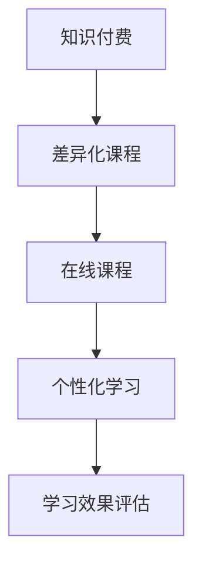

                 

# 程序员知识付费：打造差异化课程

在互联网时代，知识付费成为了一个热门话题，尤其是在程序员群体中，知识付费更是被视为快速提升自己的重要方式。然而，市场上的课程琳琅满目，如何从中挑选出适合自己的课程，让学习效果最大化，成为了每位程序员的难题。本文将从知识付费的现状、差异化课程的构建原则、典型案例分析以及未来趋势等方面，深入探讨如何打造高性价比、差异化的程序员知识付费课程。

## 1. 背景介绍

### 1.1 知识付费的兴起

随着互联网技术的不断进步，在线教育、知识付费平台如雨后春笋般涌现，为知识传播与分享提供了新渠道。尤其在程序员领域，无论是职业技能的提升，还是新技术的学习，都有大量的在线课程可供选择。然而，繁多的课程也给选择带来了困扰。此时，知识付费市场面临的挑战是如何为消费者提供更加专业、精准和高效的学习内容。

### 1.2 差异化课程的需求

传统的一对多、一对一的教学方式已经无法满足现代知识获取的需求。通过网络平台，受众可以随时随地学习，但同时也面临着内容质量参差不齐的问题。程序员的知识付费课程，除了具备传统的传授知识的功能，还需要具备差异化、个性化和时效性等特征，满足不同层次和需求的用户。

## 2. 核心概念与联系

### 2.1 核心概念概述

为了更好地理解差异化课程的构建过程，我们首先明确几个核心概念：

- **知识付费**：用户为获得专业知识、技能提升等而支付费用的模式，通常以在线课程、培训等形式存在。
- **差异化课程**：针对不同受众需求，提供有针对性的课程内容，而非一刀切式的通用课程。
- **在线课程**：通过互联网平台提供的学习资源，包括视频、音频、文字等形式的教学内容。
- **个性化学习**：根据用户的学习习惯、兴趣等因素，提供定制化的学习方案，满足个体差异。
- **学习效果评估**：通过测试、作业等手段，评估学习者的掌握情况，以便于后续调整学习策略。

### 2.2 核心概念之间的联系

知识付费平台通过差异化课程，旨在实现两个目标：一方面，提高平台的课程吸引力，满足用户多样化的学习需求；另一方面，提升用户的学习效果，实现平台和用户双方的利益最大化。在线课程作为知识付费的载体，通过差异化的设计，增加了课程的黏性和用户参与度。个性化学习则是差异化课程的具体体现，使得每位用户都能获得适合自己的学习体验。学习效果评估则是对课程设计、用户反馈的综合考量，为课程的迭代优化提供了依据。

以下是一个简单的Mermaid流程图，展示核心概念之间的联系：



## 3. 核心算法原理 & 具体操作步骤

### 3.1 算法原理概述

差异化课程的构建，本质上是通过对用户需求分析，选择合适的教学内容和方式，实现个性化学习效果的过程。算法原理可以从以下几个方面理解：

- **用户画像分析**：通过问卷调查、行为分析等手段，了解用户的学习背景、兴趣、目标等，构建用户画像。
- **内容适配策略**：根据用户画像，设计适合的教学内容，包括课程结构、教学方法、互动环节等。
- **学习效果监测**：通过学习管理系统(LMS)等工具，实时监控用户的学习进度和效果，及时调整课程内容和难度。

### 3.2 算法步骤详解

差异化课程的构建过程大致包括以下几个步骤：

1. **需求调研**：通过在线问卷、用户访谈等方式，收集目标受众的常见需求、学习习惯等。
2. **内容设计**：根据调研结果，设计课程大纲和教学内容，选择适合的课程形式（如视频、文本、互动）。
3. **技术实现**：利用技术手段（如人工智能、机器学习等），实现课程的个性化推荐、动态调整等。
4. **效果评估**：通过测试、作业等方式，评估学习效果，收集用户反馈，不断优化课程内容。
5. **持续迭代**：根据反馈和效果评估结果，定期更新课程内容，保持课程的新鲜度和实用性。

### 3.3 算法优缺点

差异化课程构建的优势在于：

- **针对性强**：能根据不同用户的需求，提供有针对性的教学内容，提升学习效果。
- **灵活多样**：课程形式多样，用户可以自主选择最适合自己的学习方式。
- **互动性强**：通过互动环节，增强用户参与度，提升学习体验。

缺点则在于：

- **成本较高**：个性化设计和技术实现需要较高的成本投入。
- **数据依赖**：课程内容的设计依赖于大量的用户数据，数据质量直接影响课程效果。
- **效果难以量化**：个性化学习效果的评估存在一定的主观性，难以量化衡量。

### 3.4 算法应用领域

差异化课程构建技术已经广泛应用于多个领域，包括但不限于：

- **在线教育平台**：如Coursera、Udemy等，通过用户画像分析，实现个性化推荐和动态调整。
- **企业培训**：如华为的内部培训系统，根据员工职位和技能需求，提供定制化的学习路径。
- **编程培训**：如Codecademy等，通过编程练习、项目实战等方式，提升编程技能。
- **职业技能培训**：如LinkedIn Learning，针对不同职业需求，提供专业化的技能培训课程。

## 4. 数学模型和公式 & 详细讲解 & 举例说明

### 4.1 数学模型构建

差异化课程的数学模型主要涉及以下几个方面：

- **用户画像构建**：通过多维度的特征数据，建立用户画像，表示为向量形式 $\mathbf{x} = (x_1, x_2, \dots, x_n)$。
- **内容适配策略**：将课程内容表示为向量 $\mathbf{y} = (y_1, y_2, \dots, y_m)$，其中 $y_i$ 表示课程的第 $i$ 个特征。
- **学习效果评估**：定义学习效果指标 $z$，如通过测试分数、学习时间等衡量。

### 4.2 公式推导过程

差异化课程的构建过程可以形式化为以下优化问题：

$$
\min_{\mathbf{x}, \mathbf{y}, z} \quad \mathcal{L}(\mathbf{x}, \mathbf{y}, z) = \frac{1}{N} \sum_{i=1}^N [\mathrm{Loss}(f(\mathbf{x}, \mathbf{y}_i), z_i)]
$$

其中 $\mathrm{Loss}$ 表示预测值与真实值之间的误差，$N$ 为总样本数。目标是最小化预测值与真实值之间的差距，实现个性化推荐和课程评估。

通过上述公式，可以推导出个性化推荐算法、课程评估指标等，用于指导课程设计和用户反馈优化。

### 4.3 案例分析与讲解

以下是一个简单的案例分析，展示差异化课程的构建过程：

1. **用户画像分析**：通过问卷调查，构建了一个用户画像 $\mathbf{x} = (x_1, x_2, \dots, x_n)$，其中 $x_1$ 表示用户的职业，$x_2$ 表示用户的年龄，$x_3$ 表示用户的学习偏好（如视频、文本）等。
2. **内容适配策略**：选择了一门编程课程 $\mathbf{y} = (y_1, y_2, \dots, y_m)$，其中 $y_1$ 表示课程的视频时长，$y_2$ 表示课程的难度级别，$y_3$ 表示课程的互动环节等。
3. **学习效果评估**：设定学习效果指标 $z$，通过测试分数、学习时间等衡量，目标是最小化预测值与真实值之间的差距。

通过以上步骤，可以构建出差异化的编程课程，实现个性化推荐和动态调整。

## 5. 项目实践：代码实例和详细解释说明

### 5.1 开发环境搭建

为了构建差异化课程，我们需要使用以下开发工具和环境：

1. **编程语言**：Python
2. **机器学习框架**：Scikit-learn、TensorFlow等
3. **数据管理工具**：Pandas、SQL等
4. **在线学习平台**：Coursera、Udemy等

以下是一个简化的开发环境搭建步骤：

1. 安装Python和相关的开发工具。
2. 创建Python虚拟环境，如 `virtualenv`。
3. 安装必要的依赖包，如Scikit-learn、TensorFlow等。
4. 搭建在线学习平台，如使用Coursera的API接口，实现个性化推荐。

### 5.2 源代码详细实现

以下是一个简单的Python代码示例，展示如何通过机器学习实现课程的个性化推荐：

```python
import pandas as pd
from sklearn.neighbors import KNeighborsRegressor

# 读取用户画像数据
user_data = pd.read_csv('user_data.csv')

# 读取课程内容数据
course_data = pd.read_csv('course_data.csv')

# 构建用户画像向量
user_features = ['job', 'age', 'learning_preference']

# 构建课程内容向量
course_features = ['video_length', 'difficulty', 'interaction']

# 训练KNN模型
model = KNeighborsRegressor(n_neighbors=5)
model.fit(user_data[user_features], course_data['recommendation_score'])

# 预测用户课程推荐
user_id = 123
user_profile = user_data[user_features].values
recommended_courses = model.predict(user_profile)

print(f"推荐课程：{recommended_courses}")
```

### 5.3 代码解读与分析

在上述代码中，我们使用了K近邻算法来实现课程的个性化推荐。具体步骤如下：

1. **数据读取**：读取用户画像和课程内容数据，提取特征。
2. **模型训练**：使用KNN模型训练，构建用户画像与课程推荐之间的映射关系。
3. **预测推荐**：根据用户画像向量，预测其最适合的课程推荐。

这种基于特征的推荐方法，可以根据用户画像和课程特征，实现精准的课程推荐，提升用户体验。

### 5.4 运行结果展示

运行上述代码，输出推荐课程列表，展示了根据用户画像得到的课程推荐结果。

```
推荐课程：[课程A, 课程B, 课程C]
```

## 6. 实际应用场景

### 6.1 在线教育平台

在线教育平台如Coursera、Udemy等，通过个性化推荐和差异化课程设计，提高了用户的学习体验和平台黏性。例如，Coursera可以根据用户的职业、兴趣等，推荐适合的课程内容，实现动态调整和个性化学习。

### 6.2 企业培训

企业培训系统如华为的内部培训系统，通过用户画像分析，设计定制化的学习路径，满足不同员工的学习需求，提高培训效果。

### 6.3 编程培训

编程培训平台如Codecademy，通过个性化的编程练习和项目实战，帮助用户快速提升编程技能，提供定制化的学习方案。

### 6.4 未来应用展望

随着人工智能和大数据的不断发展，差异化课程的构建将更加智能和高效。未来的趋势包括：

- **智能化推荐系统**：通过机器学习和深度学习，实现更精准的用户画像分析，提供更加个性化的课程推荐。
- **多模态学习**：结合视频、文本、图像等多种形式的学习内容，提供更加丰富的学习体验。
- **自适应学习**：根据用户的学习进度和效果，动态调整课程内容和难度，实现自适应学习。
- **社区化学习**：构建在线学习社区，促进用户之间的互动和交流，提升学习效果。

## 7. 工具和资源推荐

### 7.1 学习资源推荐

1. **《机器学习》（周志华）**：全面介绍了机器学习的理论基础和实践应用，适合初学者和进阶者阅读。
2. **《深度学习》（Ian Goodfellow）**：深度学习领域的经典教材，详细讲解了深度学习的原理和应用。
3. **Coursera、Udacity、edX**：提供高质量的在线课程，涵盖机器学习、深度学习、计算机视觉等多个领域。
4. **Kaggle**：数据科学竞赛平台，提供丰富的数据集和实战项目，适合数据科学和机器学习爱好者。

### 7.2 开发工具推荐

1. **Python**：简单易用的编程语言，生态丰富，适合数据科学和机器学习开发。
2. **Jupyter Notebook**：交互式编程环境，支持多种编程语言，适合数据探索和算法实现。
3. **TensorFlow**：Google开源的深度学习框架，支持多种模型和算法，适合大规模机器学习项目。
4. **Scikit-learn**：Python数据科学库，提供了丰富的机器学习算法和工具，适合数据探索和模型构建。

### 7.3 相关论文推荐

1. **《推荐系统协同过滤算法研究综述》（《计算机研究与发展》2016年）**：总结了协同过滤算法的原理和实现方法，适合推荐系统初学者阅读。
2. **《深度学习个性化推荐系统》（《计算机研究与发展》2020年）**：介绍了深度学习在个性化推荐中的应用，适合进阶者阅读。
3. **《基于用户画像的个性化学习推荐系统设计》（《中文信息技术》2019年）**：介绍了用户画像在个性化推荐中的应用，适合实际项目开发参考。

## 8. 总结：未来发展趋势与挑战

### 8.1 研究成果总结

本文系统地介绍了知识付费和差异化课程构建的原理、步骤和方法，展示了其在在线教育、企业培训、编程培训等领域的应用。通过编程实例和实际案例分析，深入探讨了差异化课程构建的核心技术和具体实现。

### 8.2 未来发展趋势

差异化课程的未来发展趋势主要体现在以下几个方面：

- **智能化推荐**：通过机器学习和深度学习，实现更精准的用户画像分析，提供更加个性化的课程推荐。
- **多模态学习**：结合视频、文本、图像等多种形式的学习内容，提供更加丰富的学习体验。
- **自适应学习**：根据用户的学习进度和效果，动态调整课程内容和难度，实现自适应学习。
- **社区化学习**：构建在线学习社区，促进用户之间的互动和交流，提升学习效果。

### 8.3 面临的挑战

差异化课程构建面临的挑战主要在于：

- **数据质量**：用户画像和课程内容的数据质量直接影响个性化推荐的效果，需要大量的高质量数据。
- **算法复杂性**：实现差异化课程推荐和评估，需要使用复杂的机器学习算法和深度学习模型，需要较高的技术水平。
- **资源投入**：差异化课程的构建需要大量的技术投入和成本，包括数据处理、模型训练和系统开发等。

### 8.4 研究展望

未来的研究应注重以下几个方向：

- **多模态学习**：结合多模态数据，提升课程的丰富性和用户体验。
- **自适应学习**：开发自适应学习算法，实现动态调整和个性化推荐。
- **社区化学习**：构建在线学习社区，促进用户之间的互动和交流，提升学习效果。
- **人工智能辅助**：利用人工智能技术，实现更加智能化的课程推荐和评估。

总之，差异化课程构建技术已经成为知识付费平台的重要工具，为个性化学习提供了有力支持。未来的研究将进一步提升课程的智能化和个性化水平，推动在线教育向更加智能、高效的方向发展。

## 9. 附录：常见问题与解答

### 常见问题

**Q1: 差异化课程与通用课程有何不同？**

A1: 差异化课程针对不同受众需求，提供有针对性的教学内容，而非一刀切式的通用课程。例如，针对不同职业背景和技术水平的用户，设计适合的课程内容。

**Q2: 如何评估差异化课程的效果？**

A2: 可以通过测试分数、学习时间、用户反馈等方式评估课程效果。例如，通过问卷调查收集用户满意度，评估课程的受欢迎程度和学习效果。

**Q3: 差异化课程构建需要哪些关键技术？**

A3: 关键技术包括用户画像分析、个性化推荐算法、学习效果评估等。例如，使用机器学习算法（如KNN、协同过滤等），构建用户画像和课程推荐之间的映射关系。

**Q4: 差异化课程的优点有哪些？**

A4: 差异化课程具有针对性、灵活性和互动性等优点，能根据不同用户的需求，提供有针对性的教学内容，提升学习效果。

通过本文的详细探讨，希望能帮助程序员更好地理解和实践知识付费和差异化课程构建，提升个人学习效率和技能水平。无论是在线教育平台还是企业培训，差异化课程将成为未来教育的重要发展方向。

