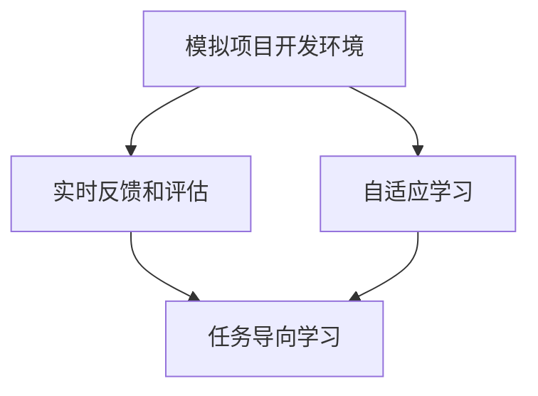

                 

# 程序员知识付费：打造情景式学习体验

> 关键词：知识付费, 情景式学习, 编程教育, 交互式教程, 智能化评估, 持续学习平台

## 1. 背景介绍

### 1.1 问题由来
在数字化时代，程序员作为推动社会进步的重要力量，需要不断学习新知识以适应技术发展的变化。传统在线课程和书籍已经无法满足日益增长的个性化学习需求。而随着知识付费的兴起，各种高质量的编程学习资源逐渐涌现，程序员的知识付费模式由此得以发展。

然而，现有的知识付费平台大多只提供了单向的知识传递，缺乏互动性，难以充分激发学员的学习热情和兴趣。特别是在编程领域，单一的文本教学和视频讲解往往难以让学生深刻理解复杂概念和编程技巧。为了解决这个问题，情景式学习(Scenario-based Learning)应运而生，通过创造一个模拟真实项目开发环境的虚拟情境，让学生在互动和反馈中不断提升自己，真正实现"做中学"。

### 1.2 问题核心关键点
情景式学习通过构建一个互动、可视化的学习环境，让学生通过实际操作和问题解决，将知识内化为技能。其核心在于：

- 模拟项目开发环境：通过情景模拟，学生能够在一个更加真实和具体的项目环境中练习编程。
- 强调实践和应用：编程语言和工具在具体情景下的运用，提高学习效果。
- 提供实时反馈和评估：学员通过即时反馈了解自己的错误和不足，加速学习进程。
- 增强自主性和激励性：情景式学习通过游戏化设计，让学生在完成任务中体验成就感和满足感，激发长期学习的动力。

## 2. 核心概念与联系

### 2.1 核心概念概述

情景式学习利用现代信息技术，将知识教学与实践训练紧密结合，以项目驱动的方式，让学生在模拟的复杂环境中不断解决问题，提升编程技能。以下是该学习模式中的几个核心概念：

- 模拟项目开发环境：通过重现真实项目开发场景，学生在仿真环境中进行编程练习。
- 实时反馈和评估：利用AI技术，提供即时反馈，帮助学员发现和纠正错误，优化学习路径。
- 自适应学习：通过学习分析技术，根据学生的表现和兴趣调整教学内容，提供个性化学习路径。
- 任务导向学习：以任务完成为目标，让学生在实际任务中应用所学知识，提高实战能力。

这些核心概念之间的逻辑关系可以通过以下Mermaid流程图来展示：



该流程图展示了情景式学习的关键环节及其关联：

1. 模拟项目开发环境：为学习者提供一个仿真项目开发环境，让学生在真实场景中练习。
2. 实时反馈和评估：通过AI技术，实时监测学生的学习进展，提供即时的反馈和评估，帮助学生纠正错误。
3. 自适应学习：根据学生的学习情况和偏好，动态调整学习内容和难度，提供个性化学习路径。
4. 任务导向学习：以完成任务为目标，让学生在实际项目中应用所学知识，提升实战能力。

## 3. 核心算法原理 & 具体操作步骤
### 3.1 算法原理概述

情景式学习的核心算法主要基于机器学习和数据分析技术，结合AI的预测和评估功能，实现学习者自适应和个性化学习路径。其核心思想是通过对学员的编程行为和学习记录进行分析，预测其学习路径和困难点，从而实现个性化的教学策略。

情景式学习模型通常包括以下几个主要模块：

1. 学习行为分析：对学生的编码行为进行分析，包括编码时间、代码行数、出错频率等，找出学生在学习过程中常见的困难点和错误类型。
2. 学习路径规划：根据学生的历史学习记录，制定个性化的学习路径，以任务导向的方式引导学生逐步掌握所需技能。
3. 实时反馈和评估：通过AI技术，提供即时反馈，帮助学员发现和纠正错误，优化学习进程。
4. 自适应学习：根据学生的学习情况和表现，动态调整教学内容和难度，提供个性化的学习体验。

### 3.2 算法步骤详解

以下是情景式学习的详细操作步骤：

**Step 1: 数据收集和预处理**
- 收集学生编码行为数据，包括代码行数、运行时间、出错频率、调试次数等。
- 收集学习者反馈数据，如学习感受、满意度、意见建议等。
- 对数据进行预处理，清洗异常数据，去除噪声，准备用于分析的输入数据。

**Step 2: 学习行为分析**
- 对编码行为数据进行分析，找出常见错误类型和困难点，如语法错误、逻辑错误、性能问题等。
- 对学习者反馈数据进行分析，了解学生的学习动机和兴趣点。
- 构建学习行为特征向量，准备用于建模的输入特征。

**Step 3: 学习路径规划**
- 根据学生的学习记录和兴趣，制定个性化的学习路径。
- 设计学习任务和项目，将理论知识与实际应用相结合。
- 根据学生的能力和学习速度，动态调整任务的难度和内容。

**Step 4: 实时反馈和评估**
- 在学生进行编码时，实时监测代码质量，提供即时的错误提示和建议。
- 通过智能评估工具，对学生的代码进行语法、逻辑、性能等方面的自动评估，帮助学生及时发现和解决问题。
- 根据学生的表现和学习情况，提供个性化的学习建议，优化学习路径。

**Step 5: 自适应学习**
- 根据学生的学习进度和表现，动态调整教学内容和难度。
- 通过学习分析技术，预测学生的学习行为和需求，提供个性化的学习资源和工具。
- 不断优化学习策略，提升学生的学习效果和兴趣。

### 3.3 算法优缺点

情景式学习的优点在于：
- 增强互动性：通过模拟项目开发环境和实时反馈，增强学生的参与感和学习效果。
- 提高实战能力：在模拟环境中练习编程，提升学生的实践能力和项目开发经验。
- 个性化教学：根据学生的学习情况和兴趣，提供个性化的学习路径和资源，提升学习效果。
- 及时反馈和评估：通过即时反馈和评估，帮助学生发现和纠正错误，优化学习路径。

然而，该方法也存在一些局限性：
- 对数据依赖性强：需要大量学生的编码行为和学习反馈数据，获取高质量数据成本较高。
- 技术复杂度高：需要构建复杂的学习行为分析模型和自适应学习系统，技术门槛较高。
- 个性化不足：难以全面了解每个学生的兴趣和需求，个性化策略可能不够精准。
- 学习负担重：学生在模拟环境中进行编程练习，可能会增加其学习负担，影响学习效率。

## 4. 数学模型和公式 & 详细讲解 & 举例说明

### 4.1 数学模型构建

情景式学习通过机器学习模型预测学习者行为，制定个性化学习路径，并提供实时反馈和评估。以下是一个简单的学习行为预测模型，假设学生的行为特征向量为 $x$，预测其下一个行为 $y$ 的概率，公式如下：

$$
P(y|x; \theta) = \sigma(W^T x + b)
$$

其中，$W$ 和 $b$ 为模型的参数，$\sigma$ 为sigmoid函数，将输出值映射到[0, 1]区间。

### 4.2 公式推导过程

假设 $x$ 为学生的学习行为特征向量，$y$ 为预测的目标行为，$W$ 和 $b$ 为模型的参数。则预测目标行为的公式为：

$$
P(y|x; \theta) = \sigma(W^T x + b)
$$

其中，$W$ 和 $b$ 为模型的参数，$\sigma$ 为sigmoid函数。

假设 $y$ 取值为0或1，分别表示正确和错误的概率，则：

$$
\begin{aligned}
P(y=1|x; \theta) &= P(y|x; \theta) = \sigma(W^T x + b) \\
P(y=0|x; \theta) &= 1 - P(y|x; \theta) = 1 - \sigma(W^T x + b)
\end{aligned}
$$

当模型训练完成后，可以通过输入新的行为特征向量 $x$，计算其预测值为 $y$ 的概率，从而制定个性化的学习路径。

### 4.3 案例分析与讲解

假设某学生在编程练习中出现了多次错误，学习行为特征向量为 $x=[100, 20, 0.2]$，其中第一个特征表示运行时间，第二个特征表示代码行数，第三个特征表示出错频率。通过训练好的学习行为预测模型，可以预测学生下一步行为的概率，如：

$$
P(y=1|x; \theta) = 0.9
$$

则系统可以自动调整学习路径，推荐学生更多的练习时间，并提供针对性的代码改进建议，帮助其提升编程能力。

## 5. 项目实践：代码实例和详细解释说明
### 5.1 开发环境搭建

在进行情景式学习系统的开发前，需要准备以下开发环境：

1. Python：开发语言，建议安装3.6及以上版本。
2. TensorFlow或PyTorch：深度学习框架，用于构建和训练学习行为预测模型。
3. Jupyter Notebook或Google Colab：交互式编程环境，用于数据处理和模型训练。
4. IDE：如VS Code、PyCharm等，用于编写代码和调试。

以下是开发环境搭建的详细步骤：

1. 安装Python：
```bash
wget https://www.python.org/ftp/python/3.8.5/python-3.8.5-amd64.msi
msiexec /i python-3.8.5-amd64.msi
```

2. 安装TensorFlow或PyTorch：
```bash
pip install tensorflow==2.6.0
# 或
pip install torch torchvision torchaudio -f https://download.pytorch.org/whl/cpu/torch_stable.html
```

3. 安装Jupyter Notebook或Google Colab：
```bash
pip install jupyter notebook
# 或
# 安装Google Colab：https://colab.research.google.com/
```

4. 安装IDE：
```bash
# 安装VS Code
curl -L https://code.visualstudio.com/assets/stable/Code-1.52.1-3558bffd15f1de8fcee6cfe58cb8ce2dbe0b6498-52edacde76c6e96efa8580f5f9c5a05272603fc6-5490f193343e6c7e1c3ef126094b6c7bb70d1e52-bda7d03b3f1bdf86e14a07a7836d74992046fa72-8d475c7802395c770704f83ac8533e6da8c9aa45-c90f1028d9e3e4d0a3b89a2e05ba9cfc683852c-d0c2d49cb3d7679a1540dc1126f08e4f8e5f3f1e-67f18c33c13f0dd683295c34e09a4c5827eacc2c-9d9b7e76caa7d3c8b4d443278b408a6d67d264a-8b4e2888aeb59c85f16c56edc6420c44ba2377b5-dce2593c8c7a1f4685b1e17f06cea83d07d1c1f-6eb9c2df6f9a4b130b92d20c96b0727aa6ad58e-1c1c56f2793a8b14d9ae19542400d66c8d12e30-a5728c0e0037e9eead87d27dfeba4762aac8b68b-c40b1e6e8a90bbfbbc55d8fa47e50f3bb2a5de9-2a80a3b7a360f25a18ddb82e2f96ae40ed02c61-35a5d6fec9b2b4f68be1a14f8ce9b9dda4da77e-40b0f5b56ee9189081f6b6b7dcfa43ff4ac50f6-1a1287e9fc3e2049d37e864f2606c4e18a4bbaa-50a19a2e57d39c76b3e6f1c6f66ee8c29b3e4b4-bc6a07ec47c38dd5ac2c6877c12f4d4c5e90032-1c1710a6f3b79669519275612ddb3b53cd1311e-0d7ec9b76c1a5ca8f6e17b64bcb9e7a7e278ad1-af1e6864cd8b2cc7c05f031c154abaffb56c6e9-ba2957f7b1d3eccc8835e59edf2b6e55e0d2a4f-5f4608ae0ad88000a70a8ceff6ac4ca25b7cefab-12bf8a6dbeacdfdcd4dff0f4ae6826cbdf64bbd-6318aecb53b86e062959da1a0e3d4d30d3b60b5-870aef1d7e4513976963be960ee4b4ccfca7fecd-6e4cacc3b08adf3acd6fcc1d824dff3ab70a9e5-99a8e3b1e6d6e599b592aeb0d32e8e1d3690fd0-af01f86b64bb0d66cad40f3acdf89dcea2609db8-b0b3e49b6ca0fb1c1a64872039ba6fc719fd7c3-f3b5c5b9ab0e7e2f40c69c6763f9ee6d5f81f08-0d4a56f76cfbd2b87c5ad23cdcadb5c2db6d9ac-36b78565a4620ddf39ce2652d2f0a855121589d-230a9e5aac8fbdbdf0b61a1d9f7a57f14c7dac1-1d4e40a9a4f13cf44b3c6a7010d9ac06f8d7e27-51c1c5ec3eb9cc9f7b676098bc22c4b1895fbf5-d64f62e5bfaa11e466d27c329318fe1cf84f537-8ddf9c3caf1b72b3e6db19a0c9d516cf74cf7d8-9c79d0c699b566ae640e2f7fda8be3f5a94f2c2-0972c7fa8e944ecf3e4b2437e21c55d7da9d8b3-3a63c7a6ec75225e5e8d78bbc0b0a2d080e83d2-ccac6eb7b0cac70aa6b74c1e6a7b35010eae9f9-4733cc35076e5bfa4d7ddca0eacd81c36beb115-fbbd38c7d9845ae9cd8e6f04fea24f7fe4c98db-33a1e0c28a4edc2b38c14cc8ed0b21b73907657-6b3e9dffcebee7a84c4f0c8ad78bbefb7a8a422-d7de15cd3ef9040aae87d317f98e1747b6fcf78-1cdd49a76bc8f5aefffc4661eac9b28cdbdf80d-baea65df42b71a6cd4f3cae6705653a37d0bc33-f2b1ce18dff4df4e8b9dd45c1e5fa83aa3c8b64-75fc1ebb185435f1e06c7ac10b90b138055dada-3816db0e9a3980f1c5078e28a2d7759e5755b5f-d1a94c81fbf2251ca5c25bf58de860ab74bcd9e-2df9a37bb4b07c83e59a4b8fccaf8fb71d8b5b4-5e2c5b18b7aa2b07e5b635fa4c9736d5b1e4ce3-27993062f68b29e880c4b8fb9b73729f53c2ff9-3b6f85c07bf2835ea71ccfd2e3f17e58e1edfe6-52dd899d68c64add1e46b0b8c7b67b7ebeead7a-4517f0e0a6fc5dcd53c3f4477c8ea36a38b28a5-7d97190915390027dbb79488013daffa82d7054a-9ce14b62bf98f67d25e30e5dac0bd2fb8ca7be8-aca0af1f83e5ed4aacfe41f08bd8b0911cc4a6e-45aa09d4b94f657080cd18d02c60267555a86d0-5f0b26b86c2d77d421478ef5b74bebbf3972ef2-7073f6f5a094820a8c5aeac98e8b61bdbfa6d61-c9fcbf59caf264b8a3fa02f6f1aa0e9c16b31cc-70b6c4d09ec09e8c1cf6c86b3441b40a4da17c7-7ee9e02b7eedf8c8a96ca8611b9adf5a1f6c9c2-79eebf91e0834e5efab64d34359734b37ec10a8e-87cdff2427db4d0d7d50f7087c281682f5988d1-7b0faacef04f195ef6e7b2bcaa6de35dbeb72a4-dc474867b8525d9e577fbccecdba6ad5eb8059b-2c38f3072e39445caac9fc5e34f9c6c541716fd-77ae3e4d1f4c8ec63bca94af87c769af9499ee5-3096d3912a7e7e9b4fb8f2c450b0d5639a4719d-b7dbbb912ff75d7abd4d13aaddf1c38b64cf818-d244595a7f1e1f3d5bfb0a0cc9c7527f7788195-cf2dac35c8bdde4ca57d3d337e86a199bcaa5a6-3e84d0a0d7b4b36ff67e577c0a5b6c6892d4686-f8b3f1c5744a86ba7c5f92a0de6011f781246c7-92d3a99d9aaab94d13eab6fc71e6f4bdf8c9cf1-7b8f5c14b0ce68d8df6ae7916e3c0b49a29f95a-bd0b8a6c1e30cd6b1238b57f8fb3523cd1975eb-eeb5bca42a680f4df49bedd0f5f8c8b4cdcf03c-7e0b7b07fceab3e84caef4dabb2689a8d12d6ef-8f40c176b8b77fe17a4ef4d7ea1e9f4eaf48f62-5ad13daf0a8de8cea5428f2ad47bd9ea110af14-3967d4689e0af73b6c92ad45dac8c66cacef685-76e6e7d38b97a7af9c4b0c8a9be349aa1ea7f7-d64c8c4daa9dd47291143f1c46895e0018dd84b-b1076d3c2cc92bb47b6402f6fefedc4aec6a21b-b5bfc26df5e9ed40e71ea5f09fb56a53cbf7dc3-06c49b6e109718f6831af98bee670c3a9901ecf-5aa64d2c20c8eb82fdd6e23da5eef9c77ca0d77-1e63d7688fdf3ed27440027102062abdbe80ad8e-3df6c5b51a7fd0d60ac2ac65e84d2dde0ecb6f5-1e4437c70bd00c4acdf0d6f2869a8567a8cf461-699ca4a0b41f8a9e73bf65bb3eaa87ea1317ce0-f02b2d4314a53b4c776079d77d5828ad4f1bdba-d3e8c8902976d9928fce6d61589ae8b2d63d1a68-90d81f2a53cdcfa73aa3e6a9055c91a3013fcfb-f4d66f7af8ddbde7b40ba6f2be2793a6812f3a0-b54c9626d4b4e8a54a76cdd8b8c23ea6d76ea1e-4f1bb80b07c550d5f1727a5d93c1d9438bdaca3-8bca18f855a22410a7d574a1ee5a10edefda72f-4c8eae6f3a86fbcf4afede7027d886427e91f70-dcdbece7b8e25a4a3abd9c7b35d45a3cc1607fe-90a51a2f4ef10c2b83e4abcd44abcd3dcec9961-d4b6b2bb4909c1a2ad0b7a2ad00ec00262229f4-0d52ad4d6a7c66389b59dab2c1dcc3d71a99c18-af4438a17dab607d0bd7e78b8bd7e5d6255930c-1d7fe8e5f60b17c4f55b792674cd8b4865c6f85-b4a16ad81cea3ec0c775b73715e50cc13ad7fca-1dced77d1d2a5a07e860092dca77f8c18dd5dfb-63314a055a8d3b0dc48b5770a3fa5f2275bd2d7-9f08d9fbdf648475f06ef0b38ac8e7c4865b43a-2f2be3d402955f72d2b1d8d11e3c9c5db18c6f0-f9cf28f390eac3b5aabb8a72f3dd24f6cdcb78d-f8744d8c33cf4e7d7ba00b99c8ecfe6f9c3d6f0-eb888d0e72c6c0f4ebfe1bc7aacd1efc7fcdb42-230c9d3c78d6dd5ca2bfeeae9aeb86e11b4f6fe-c0064e5d4c804685e9e8b16e53266319a44a9c8-c2e3edb6662eb2faef85a75c8b9c7f1b30ccaf5-1b60e89d3a82cc3fdea2495f63e50a29b10fe93-bb7e62f9f3f53d57c17c3c5aa8c3eb46df6901b-6aa2281ba57dcc824b88898a73c6ea4c2b2835b-0835f3d8fd0f8b15c4ca51856b42acd5518cf7f-d6b45dd8aeb8f1ee8b4e1b2f4d23c5c84a34cf2-c6f50cdd7f8d57a6f6e6cf69fb61af3eb887829-60b0d1033e6522e855eb3b82f9a99aadaa48ce4-67e51e0cbf62d69e6f9c71c9487437ec46b5fe5-d30d72b9735ae2244f9c3a7011e98577595cb89-ec9de47d119d937c7ba8be0b75ca6f3596bc7ff-55daabc1f1159bd35952888cc2a612b8b6752e3-cf1d8d0ae08abbdd8ebac73efd9bb8f616c45d4-0e5e64e12ee2c736ab2913d7d10d5f2cf6d3f76-2b25a6f5ab93e5e68c9d470e97caad0fc40eac4-2835c19fc9a80f78f4032d5dbed82fb5820a0d5-f98c9f0b3a6f7fc4fc6588f52b25eabd79e2ed1-8f8b0bfc9cd9cbe71e4697ac58cea93d7833ab5-9cd4d7681c2f80bc5b6b4d15f8cbebe337583ae-86b776805a4592d38d5690d3b1985b0fa2dafc3-9df18b6c81aa95b94ab5a27d3f55d0f1dcee48b-d4bbf1a25b21d7dea1c1ed456bd30b2af36b6ed-2d41650a736fbba7a3cdefc0232d48b84a29ed2-27eea0cc4b92a83a69fbd6d7cfc7682a8cf4af3-58b00498851e284b9ddd2390b8c45c84f67e3a1-6aababfe4caf8ed90c52e62eecae10458535ce2-fd158c83f2d8fb8871b73ccfb0924b35a7e4e5d-9e1e32bbe2780edafc6a1ccf137846f23c2af56-0d8f2ad1c5e539f72b400d814b58d2c07bca697-8fcc6a56a7b5b72e4ef79a3d62b50b98e444432-49c7b03daa78b0ff3d537fb8c385594dcc6b71d-2be607a0ce99c8a1b4d5cfabb4a403e7dd6e897-c187862eaf1f39f2683d615a1a56dba08e16d59-c2376f775c028a1d2665c1f37b7911b4a00d9c9-14e5ff4ad47dcbfa6dde88aa364dcddc516c4a4-ec47e0fc0b8ed4b9fd8cd6cfb8f37f5413f51b6-96b58e4ac5dc5fededf2f38f379410ddc82e32a3-5ce2598dbb61e3747f2823097a90460bea1f0e70-3231cf46db97b2a26ad2b3fcab5f3e3b0e27cb1-74e0f4fae4768d6d5d01d6c42eae7ddc96a6a32-cd30fe91eeb78e4fe3c7ed5eb6d1b0fcfb1734a-7937dff79c19cd71c97b0e3ff6d8e77a1c6bda7-d4a8aa64bd70ba56c4af42d7516f1a95bfb7a6e1-f7d5f1d6ab8ac2ea3c9fd68eeaae6aaf87c2270-1e9c7ba6cdb72c5c6d1ab2dd41a36ee528dd05f-c8af5033ccdae8e0280bc565baefec1-4a937b6a38da92c88fdbd0cdac09e4e9a4f4509-b70be5dbea3078f1c23c6d7ad0048d70fc19a5d-5f0de1cc3c8d90b2308f7af5b797f2feb9d93e8-0ab7f0d5ea2903ba0b9e8d8f7fcbe17dfd7dbf1-d3b7ae9ff9a36acdea275d9ffd4d0b20c13e331-5a6d70e2e63568dde0d59a4eec8ff0e50f82e9d-88d2aefbf80b9b8d4e1e45c8b48f8b9e4d6f09c-f99a55b08d0a3a4b0cdc2e08b7b2f8e6f81e0c5-871160ad1671f5e6a0a8044fcdcee9cd0c2d5ac-d59cf10ad3f1e5d9c4f5fe3392ff3e2a16cea4f-25ed03fa3e1b81bdc2d54b4c0f8e00c73c5cfd1-d3e2483a71c315e03beb98a0f8647fecfd8ca0e-f61d3be1032f8b9d6053b88062c3c7f8c88096b-7d2a8a2e3b16d2ca8eccc584987bc91dd6fd5d6-c95df3bbd0a61951d47a326546f9c337b1f29b5-66a1abfb0c3c36d87ecd60d040295b225cf1495-47ef1ae40b35075cd793813e7724f98bc5c68bb9-03dff4b84c99b0de6f63dccf9a27b3c89a3ac5f-3ccb64d19827d7c46b6ec7f7e8d5aa48ae3242d-6bf6797df81fdd2d64e76d04e84b6b623b95e4e-5ba41dbaa4634beb2e5d25ed8c61fdde84f4532-dfe1ac22a3f4c2402be41efebf7daf71eebbd6d-d12f7fe45def40e4e5f3f4a6db0677171352d98-bf1d8fafb6955f79c90a1a5aead9d40cce85c89-c706d89fc8e7fa01ffc02b5aab6c6b9f92acd60-94f7c4f6ff1742d9e7a6783ca37ed6d6d88fad8-2886e177edddbba9828d5e1fa2538fc7c408b58-d4dd49e1b6f0dc6b0dcc9b899e71dbbb7dd8403-73f71f1e3b1842b1b74f2fd9c273693e167b8ed-36cd2ababccd1e7a7d08cc8ce0ac9e3a67acd29-40a5f74d6aa25b0beb5e0a59acf489c1a4f8a2b-7b5f1504bf7e3f29ed07a6d0062c6f4654b6ba3-cdaa7fce9b89e3424b1c6b92dd962578bb2935a-23e45cae8afe74ca27a6e6739eb2e38c67d3249-bc3e7f35b6632aa09c3715dcc47dff84a66fab7-95ab6eba8f5b8d4d1762dbbffb06f60ffd4ff0b-846467e16e8e6a2bdf24dcd7c34b501755fd83f-2a9ce1b69edc38694633d68c1d5d7cd7d8fc87e-c7f076055b2582c26cd27f62b78d4d9b0478a1f-3aa1e63f142895b75bee8fd888b6f7650ddbb45-44e24f9c57ead1271e6be2c73f5cf9d3e1c0d88-41d45367814ceab4b06d9d3a19a5e2290a84dda-c3b8dbb3067a39eb46fea1bca0bff0f5fbad787-8aa5c8fcdc39964f3f85c633db4d22e3cc6d39c-9e2b1aabe52e516f1827b0f1c46d4f1e2c5916e-acc36fb6ecb3787c99a39da0b76ba9fabd706dd-97d06c0a8b5bc0e6cc85cea24e2df9f87a83f01-4a7026f3ae2c9f37b547f2f6360ccb97e6e9af3-16a5fd3c9d1afca87f14aa7afd316c22508690d-1fd04b32bf35fe3213f5cd3f7848f11ee445eaf-cd5d6d9c2d9a256b5a0e2c3487a7057a64ff706-cad0dba8dddf8d3206ac85d86a9b3df0ca0a488-bdd6cf7c4ddb7540851b6faeb3b75c4b5ba3d36-92e5b8ffefaa4734d4477ad70c95f7b0f0f0d72-b9d70e8d35e1671ae8e63f42b0a02733a0efdb1-d8051a6e5e8d46021f96dc62ef1eae56b81c8b7-d62383b0822e04fed00f4b7b0dff8ecc2c10d7a-d6e45ab58fb259475e35be1b2c06cdc8bfe230c-90580b7c262828e9a16a67042f8c4ab33ddeb36-c2b4e97b48c8626e6dcd3e21d64d6be5cb6f6b3-39e1bdf3f38b5fba69a2a79d0f7e5043b7f67a4-8dd8a45e46f22aea09a3efbad2d2f44ea88e75d-09cc797e63be54d5f6e7b62c38e0acd7a7778af-ee71d20ec40aa5f1f81bb6b05b85d1c60741d1c-4d98f72d6c5f83e07df52bc8ac119fc1dafd89d-d4be33e79e64d3382ff75f5c3ae7e6d96908607-18b29a1e0058a27e592e56f6d34a2a0df7b06c2-3f4e8e69399f960e5ca0a95b01cac592ef66e3f-3a87c295bc7c3d7f14cec0a08dc0ce8ac2c3982-f9e0464a6acca26cdb2c0312a74bf7bf9dd13de0-ec5750d230f8e94aa4b9a3251cbece57cdc92d1-d3ff37b1185aec9d9dadc2a3ca1f3f0cc10a7c3-c5b6feac72bb7083eceb6991b5d969fba1d48a38-d18f765d34cfc5d59fe1763b7a51b6c15caa8e1-2ebaf02b5582d2f4d337e0ec22ef2c2157612ef-10f4fe50e0063bdaa7a68d80b4c50a9ae0d2d2c-2947d2ddbdfc6d72e0c49abdd0b46ffb9720f4c-1060f7c68e10a96f24d07dd1a3edcaf8e4b348e-6e0cd7432c9f01ef5a476f36744a825e6a60814c-7d6677b4945daa33a791057c4c28d5e93f6eac5-f5df783299e8cd44682363ebfde539f9d566fbe1-d5eab8a2ea0b75f4c881700e67ddba7e0d855f8-1e6cd317e6a6660b3c8bd3d6d0002f0b80b67ba-bcf45f8dce122526d3417c35c5587e7a33

