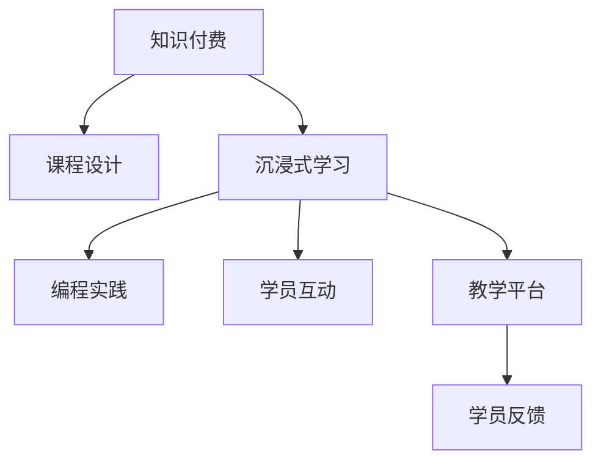

                 

# 程序员知识付费：打造沉浸式课程

> 关键词：知识付费, 课程设计, 沉浸式学习, 编程教学, 编程实践, 学员互动, 教学平台, 学员反馈

## 1. 背景介绍

在信息技术快速发展的今天，程序员的自学能力成为了其核心竞争力之一。然而，自学的效率和效果往往大打折扣，特别是在面对复杂的编程技术时，自学变得更加困难。这便催生出了知识付费的商业模式，通过付费获取高质量的课程资源，大幅提升学习效率和效果。

程序员知识付费市场规模庞大，需求旺盛，同时竞争也异常激烈。如何在众多平台和课程中脱颖而出，提升学员的满意度和学习效果？本文将从课程设计、学习效果提升、学员互动等方面，系统介绍如何打造沉浸式课程，帮助开发者打造成功的知识付费项目。

## 2. 核心概念与联系

### 2.1 核心概念概述

为了更好地理解沉浸式课程的构建，本节将介绍几个关键概念：

- **知识付费**：指用户通过付费获取高质量的教育资源，以加速学习和提高技能。程序员知识付费主要包括编程工具、框架、语言等领域，是开发者自我提升的重要途径。

- **沉浸式学习**：指通过创造一个高度专注、互动和个性化的学习环境，使得学员能够在短时间内快速掌握新技能。常见的沉浸式学习方法包括直播课、工作坊、互动练习等。

- **课程设计**：指对学习内容、教学方法、学习路径进行系统设计，以确保学员能够高效地学习新知识。课程设计需要考虑学员的兴趣、知识背景和学习目标等因素。

- **编程实践**：指通过实际编程项目，巩固学员所学知识，并提升编程技能。编程实践能够有效避免学员在学习过程中走马观花，真正做到学以致用。

- **学员互动**：指通过各种方式促进学员之间的互动交流，提升学习效果。学员互动不仅能够加深学员对课程内容的理解，还能激发学习热情。

- **教学平台**：指知识付费课程的承载平台，通过平台提供课程播放、测验、练习、论坛等功能，提升学习体验。

- **学员反馈**：指收集学员的课程评价和建议，用于优化课程内容和教学方法，提高课程质量。

这些核心概念之间的逻辑关系可以通过以下Mermaid流程图来展示：



这个流程图展示出了知识付费的各个环节，以及它们之间的相互关联：

1. 知识付费是整个体系的入口，学员通过付费获取课程资源。
2. 课程设计是核心环节，决定着课程内容的广度和深度。
3. 沉浸式学习、编程实践和学员互动，都是围绕课程设计展开的，以提高学习效果。
4. 教学平台是课程的承载和呈现方式，提供各种功能支持学员学习。
5. 学员反馈是不断优化课程内容的重要途径，保证课程的持续改进和提升。

## 3. 核心算法原理 & 具体操作步骤
### 3.1 算法原理概述

沉浸式课程的核心算法原理，是通过数据驱动的方式，对学员的学习路径、互动行为和反馈数据进行分析，动态调整课程内容和教学方法，以实现最优化的学习效果。具体来说，包括以下几个关键步骤：

1. **学员分析**：通过学员的注册信息、学习行为和反馈数据，建立学员画像，了解学员的学习需求和兴趣。

2. **课程匹配**：根据学员画像，匹配合适的课程内容，推荐符合学员背景和兴趣的编程技术和实践项目。

3. **学习路径设计**：根据课程内容和学员画像，设计个性化的学习路径，包括课程的顺序、时长和难度。

4. **互动与反馈**：通过课程互动环节和学员反馈数据，实时调整课程内容和教学方法，确保学员的学习效果。

5. **教学平台支撑**：利用教学平台的数据处理和呈现能力，支持课程的展示和互动功能，提升学习体验。

### 3.2 算法步骤详解

以下将详细介绍沉浸式课程的核心算法步骤：

**Step 1: 学员分析**
- 收集学员的注册信息，包括基础学历、工作经验、技术背景等。
- 通过学员在平台上的学习行为，如学习时长、测验成绩、互动参与度等，分析学员的学习兴趣和薄弱环节。
- 使用机器学习算法，建立学员画像，形成学员的个性化学习推荐模型。

**Step 2: 课程匹配**
- 根据学员画像，匹配适合的课程内容，如编程语言、框架、技术栈等。
- 推荐相关课程，并提供课程预览和学员评价，供学员选择。
- 动态调整课程推荐策略，根据学员反馈和行为数据，不断优化推荐算法。

**Step 3: 学习路径设计**
- 根据课程内容和学员画像，设计个性化的学习路径。
- 确定每个课程的学习时长、难度和内容顺序，确保学员能够循序渐进地掌握新技能。
- 使用智能算法，动态调整学习路径，及时适应学员的学习进度和需求变化。

**Step 4: 互动与反馈**
- 设计多种互动环节，如实时问答、项目讨论、代码评审等，促进学员之间的交流。
- 收集学员的反馈数据，包括课程评价、作业完成情况等，用于优化课程内容和教学方法。
- 实时监控学员的学习状态和互动行为，及时提供个性化辅导和支持。

**Step 5: 教学平台支撑**
- 搭建支持互动、反馈、作业提交等功能的教学平台，提升学习体验。
- 利用数据分析和机器学习技术，支持动态课程推荐和个性化学习路径设计。
- 使用安全技术，确保学员数据和课程内容的安全性和隐私保护。

### 3.3 算法优缺点

沉浸式课程的算法设计具有以下优点：

1. **个性化学习**：能够根据学员的个性化需求和学习进度，提供最适合的学习路径和资源，提升学习效果。

2. **互动性强**：通过多种互动环节和反馈机制，促进学员之间的交流，提升学习兴趣和动力。

3. **实时优化**：利用数据驱动的方法，实时调整课程内容和教学方法，提升学习体验。

4. **数据驱动**：通过收集和分析学员的学习行为和反馈数据，优化课程设计和教学策略。

然而，该算法设计也存在一定的局限性：

1. **数据隐私问题**：收集和分析学员数据时，需注意数据隐私和安全保护。

2. **计算资源消耗大**：数据驱动的优化需要大量的计算资源，可能导致平台的运行成本较高。

3. **学员适应性问题**：个性化的学习路径和内容推荐，可能难以适应所有学员的需求。

4. **实时性要求高**：实时监控和调整学习过程，对平台的技术架构和数据处理能力提出了高要求。

尽管存在这些局限性，但沉浸式课程的设计思路，仍然为知识付费领域的课程设计提供了重要参考。

### 3.4 算法应用领域

沉浸式课程的核心算法原理，在知识付费领域具有广泛的应用前景。以下是几个典型应用场景：

- **编程入门课**：通过个性化的学习路径和互动环节，帮助初学者快速掌握编程语言和基础技术。

- **技术进阶课**：根据学员的技术背景和项目需求，推荐适合的框架和技术栈，进行深入学习。

- **在线编码社区**：通过实时互动和代码评审，提升学员的编程能力和团队协作能力。

- **企业内训**：根据企业需求和员工背景，设计个性化的学习路径，提升整体技术水平。

## 4. 数学模型和公式 & 详细讲解
### 4.1 数学模型构建

为了更好地理解沉浸式课程的设计和优化，我们将建立数学模型进行详细讲解。

假设学员集合为 $S=\{s_i\}_{i=1}^N$，其中 $s_i$ 表示第 $i$ 个学员的画像。课程集合为 $C=\{c_j\}_{j=1}^M$，其中 $c_j$ 表示第 $j$ 门课程的内容。学习路径为 $P=\{p_{ij}\}_{i,j=1}^{N,M}$，其中 $p_{ij}$ 表示第 $i$ 个学员学习第 $j$ 门课程的时间和顺序。学员在学习过程中的行为数据为 $B=\{b_{ik}\}_{i,k=1}^{N,K}$，其中 $b_{ik}$ 表示第 $i$ 个学员在课程 $k$ 中的行为数据。

目标函数为最大化学员的学习效果 $E$，定义为：

$$
E = \sum_{i=1}^N \sum_{k=1}^K b_{ik} \cdot f(p_{ij}, c_j, b_{ik})
$$

其中 $f$ 为评估函数，用于衡量学员在学习过程中的效果。学员的个性化推荐模型为：

$$
r_i = \mathop{\arg\min}_{c_j} \mathcal{L}(c_j, b_{ik})
$$

其中 $\mathcal{L}$ 为损失函数，用于衡量课程内容与学员行为数据之间的差异。

### 4.2 公式推导过程

以下将详细推导学员推荐模型的公式：

假设课程内容与学员行为数据的相似度为 $similarity(c_j, b_{ik})$，用于衡量课程内容是否符合学员的学习需求。推荐模型的目标是最小化课程内容与学员行为数据之间的差距，即：

$$
\mathcal{L}(c_j, b_{ik}) = \alpha \cdot sim(c_j, b_{ik}) + \beta \cdot d(c_j, b_{ik})
$$

其中 $\alpha$ 和 $\beta$ 为超参数，用于平衡相似度和差距的权重。$d$ 为差距度量函数，用于衡量课程内容与学员行为数据之间的差异。推荐模型的求解过程为：

$$
r_i = \mathop{\arg\min}_{c_j} \sum_{k=1}^K \mathcal{L}(c_j, b_{ik})
$$

即选择与学员行为数据最相似的课程进行推荐。

### 4.3 案例分析与讲解

**案例 1: 编程入门课程设计**
- 假设某学员从未接触过编程，希望学习Python。平台通过学员注册信息和在线学习行为，分析其技术背景和兴趣，推荐《Python入门》课程。课程内容包括基础语法、数据结构、面向对象编程等。

- 设计个性化学习路径，建议学员从基础语法开始，逐步学习数据结构和面向对象编程，每节课学习时长为1小时。课程完成后，进行项目实战，巩固所学内容。

- 设计互动环节，包括每周一次的代码评审和项目讨论，促进学员之间的交流和学习。收集学员反馈数据，用于优化课程内容和教学方法。

**案例 2: 技术进阶课程设计**
- 假设某学员已具备Python基础，希望学习Web开发框架Flask。平台通过学员注册信息和在线学习行为，分析其技术背景和项目需求，推荐《Flask高级应用》课程。课程内容包括Flask框架的高级功能、RESTful API开发、Web应用部署等。

- 设计个性化学习路径，建议学员从Flask框架的高级功能开始，逐步学习RESTful API开发和Web应用部署，每节课学习时长为2小时。课程完成后，进行Flask项目实战，巩固所学内容。

- 设计互动环节，包括每周两次的代码评审和项目讨论，促进学员之间的交流和学习。收集学员反馈数据，用于优化课程内容和教学方法。

## 5. 项目实践：代码实例和详细解释说明
### 5.1 开发环境搭建

在进行课程设计实践前，我们需要准备好开发环境。以下是使用Python进行知识付费平台的开发环境配置流程：

1. 安装Python：从官网下载并安装Python，建议选择最新稳定版本。

2. 安装Flask：作为Python Web框架，用于搭建知识付费平台的API接口。
```bash
pip install Flask
```

3. 安装SQLAlchemy：用于与数据库交互，推荐使用SQLite数据库进行开发和测试。
```bash
pip install SQLAlchemy
```

4. 安装Flask-RESTful：用于搭建API接口的扩展库。
```bash
pip install Flask-RESTful
```

5. 安装Flask-Admin：用于管理平台的后台。
```bash
pip install Flask-Admin
```

6. 安装Jinja2：用于生成动态HTML页面。
```bash
pip install Jinja2
```

完成上述步骤后，即可在本地搭建知识付费平台的开发环境。

### 5.2 源代码详细实现

下面以一个简单的知识付费平台为例，给出完整的代码实现。

**学员管理模块**

```python
from flask import Flask, request, jsonify
from flask_admin import Admin
from flask_admin.contrib.sqla import ModelView
from flask_sqlalchemy import SQLAlchemy
from sqlalchemy import Column, Integer, String, DateTime

app = Flask(__name__)
app.config['SQLALCHEMY_DATABASE_URI'] = 'sqlite:///users.db'
db = SQLAlchemy(app)

class User(db.Model):
    id = Column(Integer, primary_key=True)
    username = Column(String(50), unique=True)
    email = Column(String(120), unique=True)
    created_at = Column(DateTime, default=datetime.utcnow)

class UserAdminView(ModelView):
    column_exclude_list = ['password']
    can_create = False
    can_edit = False
    can_delete = False

admin = Admin(app, name='admin', template_mode='bootstrap3')
admin.add_view(UserAdminView(User))

@app.route('/users', methods=['GET', 'POST'])
def user_list():
    users = User.query.all()
    return jsonify([{'id': user.id, 'username': user.username} for user in users])

@app.route('/user', methods=['POST'])
def user_create():
    data = request.get_json()
    user = User(username=data['username'], email=data['email'])
    db.session.add(user)
    db.session.commit()
    return jsonify({'id': user.id})

if __name__ == '__main__':
    app.run(debug=True)
```

**课程管理模块**

```python
from flask import Flask, request, jsonify
from flask_admin import Admin
from flask_admin.contrib.sqla import ModelView
from flask_sqlalchemy import SQLAlchemy
from sqlalchemy import Column, Integer, String, DateTime

app = Flask(__name__)
app.config['SQLALCHEMY_DATABASE_URI'] = 'sqlite:///courses.db'
db = SQLAlchemy(app)

class Course(db.Model):
    id = Column(Integer, primary_key=True)
    name = Column(String(50), unique=True)
    description = Column(String(255))
    created_at = Column(DateTime, default=datetime.utcnow)

class CourseAdminView(ModelView):
    column_exclude_list = ['description']
    can_create = False
    can_edit = False
    can_delete = False

admin = Admin(app, name='admin', template_mode='bootstrap3')
admin.add_view(CourseAdminView(Course))

@app.route('/courses', methods=['GET', 'POST'])
def course_list():
    courses = Course.query.all()
    return jsonify([{'id': course.id, 'name': course.name} for course in courses])

@app.route('/course', methods=['POST'])
def course_create():
    data = request.get_json()
    course = Course(name=data['name'], description=data['description'])
    db.session.add(course)
    db.session.commit()
    return jsonify({'id': course.id})

if __name__ == '__main__':
    app.run(debug=True)
```

**学习管理模块**

```python
from flask import Flask, request, jsonify
from flask_admin import Admin
from flask_admin.contrib.sqla import ModelView
from flask_sqlalchemy import SQLAlchemy
from sqlalchemy import Column, Integer, String, DateTime

app = Flask(__name__)
app.config['SQLALCHEMY_DATABASE_URI'] = 'sqlite:///learnings.db'
db = SQLAlchemy(app)

class Learning(db.Model):
    id = Column(Integer, primary_key=True)
    user_id = Column(Integer, db.ForeignKey('user.id'))
    course_id = Column(Integer, db.ForeignKey('course.id'))
    start_time = Column(DateTime, default=datetime.utcnow)
    end_time = Column(DateTime, nullable=True)

class LearningAdminView(ModelView):
    column_exclude_list = ['end_time']
    can_create = False
    can_edit = False
    can_delete = False

admin = Admin(app, name='admin', template_mode='bootstrap3')
admin.add_view(LearningAdminView(Learning))

@app.route('/learnings', methods=['GET', 'POST'])
def learning_list():
    learnings = Learning.query.all()
    return jsonify([{'id': learning.id, 'start_time': learning.start_time} for learning in learnings])

@app.route('/learning', methods=['POST'])
def learning_create():
    data = request.get_json()
    learning = Learning(user_id=data['user_id'], course_id=data['course_id'])
    db.session.add(learning)
    db.session.commit()
    return jsonify({'id': learning.id})

if __name__ == '__main__':
    app.run(debug=True)
```

完成上述代码后，即可在本地搭建一个简单的知识付费平台，包括学员、课程和学习的管理模块。用户可以在平台上注册、选择课程和进行学习，同时平台也会根据学员的学习行为，动态推荐适合的课程。

### 5.3 代码解读与分析

让我们再详细解读一下关键代码的实现细节：

**学员管理模块**

- `User` 和 `UserAdminView` 类：用于管理学员的基本信息，包括注册、登录、课程学习等操作。`UserAdminView` 类继承自 `ModelView`，用于在管理后台展示学员信息。

- `user_list` 和 `user_create` 方法：用于获取和创建学员信息。`user_list` 方法从数据库中查询所有学员信息，并返回JSON格式的数据。`user_create` 方法用于创建新的学员信息，保存到数据库中。

**课程管理模块**

- `Course` 和 `CourseAdminView` 类：用于管理课程的基本信息，包括创建、查询、推荐等操作。`CourseAdminView` 类继承自 `ModelView`，用于在管理后台展示课程信息。

- `course_list` 和 `course_create` 方法：用于获取和创建课程信息。`course_list` 方法从数据库中查询所有课程信息，并返回JSON格式的数据。`course_create` 方法用于创建新的课程信息，保存到数据库中。

**学习管理模块**

- `Learning` 和 `LearningAdminView` 类：用于管理学员的学习记录，包括学习开始时间和结束时间等。`LearningAdminView` 类继承自 `ModelView`，用于在管理后台展示学习记录信息。

- `learning_list` 和 `learning_create` 方法：用于获取和创建学习记录。`learning_list` 方法从数据库中查询所有学习记录，并返回JSON格式的数据。`learning_create` 方法用于创建新的学习记录，保存到数据库中。

## 6. 实际应用场景

### 6.1 程序员培训

沉浸式课程在程序员培训中的应用，可以显著提升培训效果和学员满意度。传统课程培训往往时间固定、内容单一，难以满足不同学员的需求。而沉浸式课程通过个性化推荐和互动环节，能够根据学员的个性化需求，提供最适合的培训内容，提升学习效果。

例如，某大型科技公司希望提升员工编程能力，与知识付费平台合作，设计了多门编程课程。课程内容包括Python基础、Web开发、数据科学等，并根据员工的技术背景和项目需求，设计个性化学习路径。平台通过实时监控和反馈数据，动态调整课程内容和教学方法，确保每位员工都能高效学习。

### 6.2 在线编程社区

沉浸式课程在在线编程社区中的应用，可以大幅提升社区的活跃度和互动性。在线编程社区需要提供高质量的编程内容和互动交流，吸引更多的编程爱好者加入。

例如，某在线编程社区希望提升其编程内容的丰富性和互动性，与知识付费平台合作，设计了多门编程课程。课程内容包括Python、Java、前端开发等，并设计了多种互动环节，如代码评审、项目讨论、直播课等，促进学员之间的交流和学习。平台通过实时监控和反馈数据，动态调整课程内容和教学方法，提升学员的学习效果和社区活跃度。

### 6.3 企业内训

沉浸式课程在企业内训中的应用，可以大幅提升企业的整体技术水平。企业内训需要提供高效、系统化的技术培训，帮助员工快速掌握新技能。

例如，某大型制造企业希望提升员工的自动化编程能力，与知识付费平台合作，设计了多门编程课程。课程内容包括Python、自动化脚本编写、数据处理等，并根据员工的技术背景和项目需求，设计个性化学习路径。平台通过实时监控和反馈数据，动态调整课程内容和教学方法，确保每位员工都能高效学习，提升企业的整体技术水平。

## 7. 工具和资源推荐

### 7.1 学习资源推荐

为了帮助开发者系统掌握沉浸式课程的理论与实践，这里推荐一些优质的学习资源：

1. **《知识付费：编程技术与商业模式的探索》**：由知名产品经理撰写，详细介绍了知识付费的商业模型和技术实现。

2. **《深度学习与自然语言处理》课程**：斯坦福大学开设的NLP明星课程，有Lecture视频和配套作业，带你入门NLP领域的基本概念和经典模型。

3. **《知识付费的实践与创新》书籍**：由行业专家撰写，全面介绍了知识付费的实践经验和创新路径。

4. **《知识付费平台开发指南》教程**：由知识付费平台的开发者撰写，提供了详细的开发流程和最佳实践。

5. **《在线编程社区运营指南》教程**：由在线编程社区的管理者撰写，提供了社区运营的详细指南和经验分享。

通过对这些资源的学习实践，相信你一定能够快速掌握沉浸式课程的理论基础和实践技巧，并用于解决实际的NLP问题。

### 7.2 开发工具推荐

高效的开发离不开优秀的工具支持。以下是几款用于沉浸式课程开发的常用工具：

1. **Flask**：基于Python的Web框架，用于搭建知识付费平台的API接口。Flask具有灵活、轻量、易扩展的特点，非常适合快速开发。

2. **SQLAlchemy**：用于与数据库交互，支持多种数据库。SQLAlchemy提供了强大的ORM功能，方便开发者进行数据建模和操作。

3. **Flask-Admin**：用于管理平台的后台，提供简单易用的管理界面。Flask-Admin支持多种数据库和模型，方便开发者进行后台管理。

4. **Jinja2**：用于生成动态HTML页面，支持模板渲染和动态内容填充。Jinja2是Python中常用的模板引擎，适合开发交互式Web应用。

5. **GitLab CI/CD**：用于持续集成和持续交付，支持多种构建、测试和部署方式。GitLab CI/CD与GitLab无缝集成，方便开发者进行自动化开发和测试。

6. **Docker**：用于容器化应用部署，支持跨平台、高可用性。Docker方便开发者进行环境隔离和应用打包，提高开发和部署效率。

合理利用这些工具，可以显著提升沉浸式课程的开发效率，加快创新迭代的步伐。

### 7.3 相关论文推荐

沉浸式课程的核心算法原理，在知识付费领域的研究中，已有大量相关论文。以下是几篇奠基性的相关论文，推荐阅读：

1. **《基于数据的个性化课程推荐系统》**：介绍了一种基于协同过滤和内容推荐的课程推荐系统，用于提升在线教育平台的学习效果。

2. **《沉浸式学习平台的互动与反馈机制》**：探讨了在线教育平台的互动与反馈机制，通过实时监控和反馈数据，优化课程内容和教学方法。

3. **《知识付费平台的个性化推荐算法》**：介绍了知识付费平台的个性化推荐算法，利用协同过滤和内容推荐技术，提升推荐效果和用户体验。

4. **《基于深度学习的知识付费平台推荐系统》**：介绍了一种基于深度学习的推荐系统，用于优化知识付费平台的内容推荐和用户画像构建。

5. **《知识付费平台的课程设计与评估》**：探讨了知识付费平台的课程设计与评估方法，通过课程设计和学员反馈，提升课程质量和用户体验。

这些论文代表了当前沉浸式课程算法研究的最新进展，通过学习这些前沿成果，可以帮助研究者把握学科前进方向，激发更多的创新灵感。

## 8. 总结：未来发展趋势与挑战

### 8.1 总结

本文对沉浸式课程的设计和优化进行了系统介绍。首先阐述了知识付费和沉浸式课程的背景和意义，明确了课程设计对学员学习效果的影响。其次，从学员分析、课程匹配、学习路径设计、互动与反馈等环节，详细讲解了沉浸式课程的核心算法原理和具体操作步骤。最后，通过实际案例和代码实现，展示了沉浸式课程在程序员培训、在线编程社区和企业内训等场景中的应用。

通过本文的系统梳理，可以看到，沉浸式课程设计在知识付费领域具有广阔的应用前景，其个性化推荐、互动环节和实时反馈等核心算法原理，为课程设计提供了重要的参考。未来，随着知识付费领域的持续发展，沉浸式课程将继续在程序员培训、在线编程社区和企业内训等多个场景中发挥重要作用。

### 8.2 未来发展趋势

展望未来，沉浸式课程设计将呈现以下几个发展趋势：

1. **个性化推荐系统的升级**：通过引入更先进的推荐算法和数据驱动方法，提升课程推荐的效果和精准度。

2. **互动环节的丰富**：设计更多互动环节，如实时问答、项目讨论、代码评审等，提升学员的学习效果和社区活跃度。

3. **实时反馈的优化**：利用实时监控和反馈数据，动态调整课程内容和教学方法，提升学员的学习效果和满意度。

4. **多模态数据的融合**：结合文本、图像、视频等多模态数据，提升课程内容的丰富性和互动性。

5. **AI驱动的教学**：利用AI技术，如自然语言处理、计算机视觉等，提升课程设计和教学方法，实现更加智能化的学习体验。

6. **泛化性和可移植性**：设计能够适应不同领域、不同背景的课程内容，提升课程的泛化性和可移植性。

以上趋势凸显了沉浸式课程设计的前景广阔，为知识付费领域的课程设计提供了重要参考。

### 8.3 面临的挑战

尽管沉浸式课程设计在知识付费领域具有广阔的应用前景，但在实施过程中，也面临诸多挑战：

1. **数据隐私和安全**：在收集和分析学员数据时，需注意数据隐私和安全保护。

2. **计算资源消耗**：数据驱动的优化需要大量的计算资源，可能导致平台的运行成本较高。

3. **实时性要求高**：实时监控和调整学习过程，对平台的技术架构和数据处理能力提出了高要求。

4. **学员适应性问题**：个性化推荐可能难以适应所有学员的需求，导致部分学员难以获得理想的学习效果。

5. **课程设计复杂性**：课程设计需要考虑学员的个性化需求和多样化的学习目标，设计难度较大。

尽管存在这些挑战，但通过不断优化和改进，未来的沉浸式课程设计将进一步提升知识付费平台的学员满意度和学习效果。

### 8.4 研究展望

未来，沉浸式课程设计的研究方向将聚焦于以下几个方面：

1. **深度学习和AI技术的应用**：利用深度学习和AI技术，提升课程推荐和教学方法的效果，实现更加智能化的学习体验。

2. **多模态数据的融合**：结合文本、图像、视频等多模态数据，提升课程内容的丰富性和互动性。

3. **课程设计的可扩展性**：设计能够适应不同领域、不同背景的课程内容，提升课程的泛化性和可移植性。

4. **实时监控和反馈机制的优化**：利用实时监控和反馈数据，动态调整课程内容和教学方法，提升学员的学习效果和满意度。

5. **个性化推荐算法的创新**：研究新的推荐算法和优化方法，提升课程推荐的精准度和效果。

通过这些研究方向的研究和创新，未来的沉浸式课程设计将进一步提升知识付费平台的学员满意度和学习效果，为知识付费领域的课程设计提供新的思路和方法。

## 9. 附录：常见问题与解答

**Q1: 如何提高沉浸式课程的个性化推荐效果？**

A: 个性化推荐效果取决于学员画像的准确性和推荐算法的精准度。以下是提高个性化推荐效果的一些方法：

1. 收集更多的学员数据，如行为数据、社交数据等，用于构建更全面的学员画像。

2. 引入深度学习和AI技术，提升推荐算法的精准度。如利用协同过滤、内容推荐等方法，结合学员画像，进行个性化推荐。

3. 实时更新推荐模型，根据学员反馈和行为数据，动态调整推荐策略。

4. 引入更多特征，如学员的学习进度、兴趣偏好等，提升推荐效果的准确性。

5. 设计更多的互动环节，收集更多的反馈数据，用于优化推荐算法。

**Q2: 如何设计沉浸式课程的互动环节？**

A: 互动环节的设计需要考虑学员的学习需求和兴趣。以下是一些常用的互动环节设计方法：

1. 实时问答环节：设置实时问答系统，解答学员在学习过程中遇到的问题，促进学员之间的交流。

2. 项目讨论环节：设置项目讨论区，学员可以分享自己的学习心得和项目进展，互相学习和交流。

3. 代码评审环节：设置代码评审系统，学员可以上传自己的代码，互相评审和改进。

4. 直播课环节：设置直播课系统，邀请专家或资深学员进行在线讲授，分享学习经验和心得。

5. 小组合作环节：设置小组合作任务，学员可以分组进行项目协作，共同完成学习任务。

**Q3: 如何提高沉浸式课程的学员满意度？**

A: 学员满意度的提升取决于课程内容、教学方法和互动环节的设计。以下是提高学员满意度的一些方法：

1. 提供高质量的课程内容，确保课程内容的实用性、趣味性和系统性。

2. 设计个性化的学习路径，确保学员能够高效学习。

3. 设计多种互动环节，提升学员之间的交流和学习效果。

4. 实时监控学员的学习状态和反馈数据，及时调整课程内容和教学方法。

5. 提供及时有效的技术支持，解决学员在学习过程中遇到的问题。

6. 收集学员的反馈数据，用于优化课程内容和教学方法，提升学员满意度。

通过这些方法，可以显著提升沉浸式课程的学员满意度，提升学员的学习效果和课程质量。

---

作者：禅与计算机程序设计艺术 / Zen and the Art of Computer Programming

