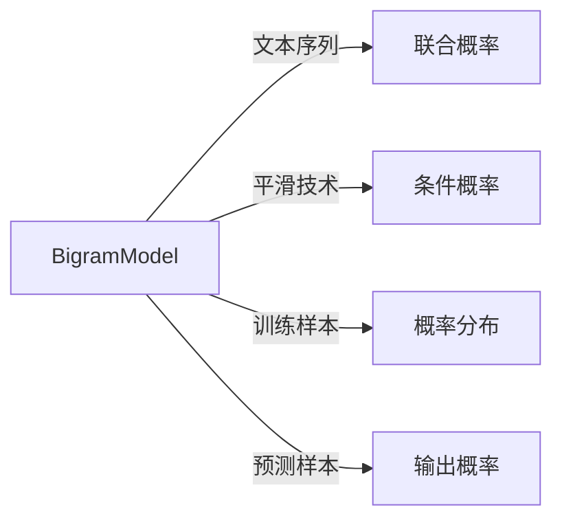

                 

# 第01章 Bigram Language Model 语言建模

> 关键词：Bigram Language Model, 语言建模, 文本统计, 概率模型, 信息熵, 交叉熵, 神经网络, 自然语言处理, NLP, 深度学习

## 1. 背景介绍

### 1.1 问题由来

语言建模是自然语言处理(Natural Language Processing, NLP)中一项基础且关键的任务，目的是建立一个概率模型，能够描述给定文本序列出现的概率。该模型能够用于诸如文本生成、自动摘要、语音识别、机器翻译、信息检索等多个领域。语言模型建模的本质是通过统计分析文本序列的规律，提取文本中隐含的语言特征，从而实现文本数据的理解与生成。

传统语言模型建模方法主要基于概率统计学理论，包括Bigram、Trigram、N-gram模型等。这些模型通过计算文本中相邻词组的联合概率，来推断出单词序列的合理性。然而，传统N-gram模型存在数据稀疏、内存占用大等缺点，难以处理长文本序列，无法捕捉语言的深层次结构。

随着深度学习技术的发展，神经网络语言模型逐渐成为语言建模领域的主流方法。特别是Transformer架构的引入，大幅提升了语言模型的性能和效率。通过在大规模文本语料上进行自监督预训练，如BERT、GPT等模型能够学习到丰富的语言知识和语法规则，能够生成高质量的文本内容，并在诸多NLP任务上表现优异。

本文将深入探讨Bigram语言模型，作为语言建模中的经典模型，Bigram模型在自然语言处理中具有重要应用，也是深度学习中其他语言模型的基础。理解Bigram语言模型的原理和实现方式，对于学习NLP技术至关重要。

### 1.2 问题核心关键点

Bigram语言模型的核心在于计算文本中相邻词组的联合概率。具体而言，给定一个词序列 $w_1, w_2, \cdots, w_n$，其Bigram模型 $P(W_{i-1},W_i)$ 表示 $w_i$ 的预测条件概率，即在已知前一个词 $w_{i-1}$ 的情况下，后一个词 $w_i$ 出现的概率。Bigram模型的目的是通过统计文本中大量Bigram的联合频率，来推断文本序列的概率分布。

Bigram语言模型的研究意义在于：
1. 作为语言建模的基础，为NLP技术的其他模型提供理论支撑。
2. 在文本生成、自动翻译、信息检索等多个领域具有广泛应用。
3. 可以与深度学习模型结合，改进模型的训练效率和效果。
4. 为理解文本的语法结构和语义关系提供依据。

## 2. 核心概念与联系

### 2.1 核心概念概述

Bigram语言模型，顾名思义，是指计算文本中相邻词组之间关系的概率模型。其核心概念包括：

- Bigram：文本序列中相邻的两个词组。
- 联合概率 $P(W_{i-1}, W_i)$：已知前一个词 $W_{i-1}$ 的情况下，后一个词 $W_i$ 出现的概率。
- 条件概率 $P(W_i | W_{i-1})$：在已知前一个词 $W_{i-1}$ 的情况下，后一个词 $W_i$ 出现的概率。
- 平滑技术：当文本中某些Bigram出现的频率过少时，如何处理其概率值，以避免模型过度拟合。

### 2.2 核心概念原理和架构的 Mermaid 流程图

以下是一个简单的Bigram语言模型架构图，展示了Bigram模型如何通过计算相邻词组的联合概率来进行语言建模：



这个图表展示了Bigram模型的基本流程：输入文本序列，通过计算Bigram的联合概率，得出Bigram的概率分布。结合平滑技术，得到条件概率。模型训练时，通过最大化条件概率的对数似然函数，学习文本序列的规律。模型预测时，通过条件概率输出文本序列的概率分布。

### 2.3 核心概念原理和架构的详细解释

- **文本序列**：文本序列是语言模型的输入，即连续的单词序列，可以是任何文本语料。
- **联合概率 $P(W_{i-1}, W_i)$**：计算给定前一个词 $W_{i-1}$ 的情况下，后一个词 $W_i$ 出现的概率。可以通过文本序列中所有Bigram的频率来估计，即：
$$
P(W_{i-1}, W_i) = \frac{\text{count}(W_{i-1}, W_i)}{\text{count}(W_{i-1})}
$$
其中 $\text{count}(W_{i-1}, W_i)$ 表示文本中 $W_{i-1}$ 和 $W_i$ 同时出现的次数，$\text{count}(W_{i-1})$ 表示 $W_{i-1}$ 出现的次数。
- **条件概率 $P(W_i | W_{i-1})$**：在已知前一个词 $W_{i-1}$ 的情况下，后一个词 $W_i$ 出现的概率，可以通过联合概率推导得到：
$$
P(W_i | W_{i-1}) = \frac{P(W_{i-1}, W_i)}{P(W_{i-1})}
$$
其中 $P(W_{i-1})$ 表示 $W_{i-1}$ 出现的概率，可以通过 $W_{i-1}$ 出现的次数和整个文本序列中单词总数来估计。
- **平滑技术**：由于文本序列中某些Bigram出现的频率可能为0，导致条件概率无法计算。平滑技术旨在处理这种情况，通过引入先验概率分布，使Bigram模型对文本序列中所有可能的Bigram都给出合理的概率值。常见的平滑技术包括Laplace平滑和Good-Turing平滑等。

这些核心概念构成了Bigram语言模型的基础，后续将详细探讨这些概念在实际应用中的具体实现。

## 3. 核心算法原理 & 具体操作步骤

### 3.1 算法原理概述

Bigram语言模型的核心在于通过计算文本中相邻词组的联合概率，来推断文本序列的概率分布。其基本思想是，给定一个文本序列，通过统计文本中相邻词组 $W_{i-1}, W_i$ 的出现频率，来推断它们之间的联合概率 $P(W_{i-1}, W_i)$，进而得到条件概率 $P(W_i | W_{i-1})$。在实际应用中，通常使用最大似然估计法（MLE）来估计这些概率值。

### 3.2 算法步骤详解

Bigram语言模型的训练和应用一般包括以下几个关键步骤：

1. **数据准备**：收集并预处理文本语料，去除噪声和无效数据，将文本序列转换为Bigram序列。
2. **概率计算**：统计Bigram序列中各Bigram出现的次数，计算条件概率 $P(W_i | W_{i-1})$。
3. **平滑处理**：使用平滑技术处理数据稀疏问题，使得所有Bigram都有合理的概率值。
4. **模型训练**：通过最大化条件概率的对数似然函数，训练Bigram模型。
5. **预测应用**：使用训练好的模型，预测新的文本序列的概率分布，实现文本生成、自动翻译等任务。

### 3.3 算法优缺点

Bigram语言模型具有以下优点：
1. 简单高效：模型结构简单，易于实现和理解。
2. 适用范围广：适用于文本生成、自动翻译、信息检索等多种NLP任务。
3. 理论基础扎实：基于概率统计学理论，具有坚实的数学基础。

同时，Bigram模型也存在以下缺点：
1. 数据稀疏：文本序列中的某些Bigram可能从未出现过，导致模型无法正确估计其概率。
2. 内存占用大：需要存储大量Bigram的频率，导致内存占用较大。
3. 无法捕捉长文本关系：Bigram模型只考虑相邻的词组，无法捕捉长文本序列中的复杂关系。
4. 需要大量数据：Bigram模型的训练需要大量文本数据，对于小规模语料效果有限。

### 3.4 算法应用领域

Bigram语言模型在自然语言处理领域有广泛应用，以下是几个典型应用场景：

- **文本生成**：通过Bigram模型，可以预测给定前一个词的情况下，后一个词的概率分布，生成自然流畅的文本内容。
- **自动翻译**：在翻译任务中，Bigram模型可以作为文本对齐的基础，提高翻译的质量和效率。
- **信息检索**：Bigram模型可以用于文本相似度计算，检索出与查询词相似的文档。
- **语音识别**：通过Bigram模型，可以将语音信号转换为文本，实现语音到文本的转换。
- **问答系统**：Bigram模型可以用于构建知识图谱，提高问答系统的准确率和响应速度。

## 4. 数学模型和公式 & 详细讲解

### 4.1 数学模型构建

Bigram语言模型的数学模型可以表示为：
$$
P(w_1, w_2, \cdots, w_n) = \prod_{i=2}^n P(w_i | w_{i-1})
$$
其中 $w_1, w_2, \cdots, w_n$ 为文本序列，$P(w_i | w_{i-1})$ 为条件概率。

假设文本序列中每个单词出现概率为 $P(w)$，则Bigram模型的对数似然函数可以表示为：
$$
\mathcal{L} = \sum_{i=2}^n \log P(w_i | w_{i-1})
$$
最大化对数似然函数，可以通过最大化交叉熵损失函数来实现：
$$
\mathcal{L} = -\frac{1}{N} \sum_{i=2}^n \log P(w_i | w_{i-1})
$$

### 4.2 公式推导过程

为了推导Bigram模型的概率分布，首先定义单词出现的频率和条件概率：

$$
\text{count}(w) = \text{total count of } w \text{ in the text sequence}
$$
$$
P(w) = \frac{\text{count}(w)}{N}
$$
$$
P(w_{i-1}, w_i) = \frac{\text{count}(w_{i-1}, w_i)}{\text{count}(w_{i-1})}
$$
$$
P(w_i | w_{i-1}) = \frac{P(w_{i-1}, w_i)}{P(w_{i-1})}
$$

为了得到Bigram模型的概率分布，首先需要计算所有Bigram的联合概率 $P(w_{i-1}, w_i)$。假设文本序列中Bigram总数为 $N_{\text{bigram}}$，则：
$$
P(w_{i-1}, w_i) = \frac{\text{count}(w_{i-1}, w_i)}{N_{\text{bigram}}}
$$

在得到所有Bigram的联合概率后，可以通过上述公式计算条件概率 $P(w_i | w_{i-1})$。需要注意的是，在计算过程中，需要应用平滑技术，以处理数据稀疏问题。

### 4.3 案例分析与讲解

假设有一个文本序列为 "I love Python programming"。使用Bigram模型计算其概率分布：

1. **计算Bigram频率**：
   - "I love" 出现1次，频率为1/4
   - "love Python" 出现1次，频率为1/4
   - "Python programming" 出现1次，频率为1/4
   - "programming" 出现1次，频率为1/4

2. **计算条件概率**：
   - $P(\text{love} | \text{I}) = \frac{1}{1+1} = 0.5$
   - $P(\text{Python} | \text{love}) = \frac{1}{1+1} = 0.5$
   - $P(\text{programming} | \text{Python}) = \frac{1}{1+1} = 0.5$

3. **计算Bigram模型概率分布**：
   - $P(\text{I love}) = 0.25$
   - $P(\text{love Python}) = 0.25$
   - $P(\text{Python programming}) = 0.25$
   - $P(\text{programming}) = 0.25$

使用Bigram模型，可以预测文本序列中的每个Bigram出现的概率，进而实现文本生成、自动翻译等任务。

## 5. 项目实践：代码实例和详细解释说明

### 5.1 开发环境搭建

为了实现Bigram语言模型，需要先搭建好Python开发环境，并安装必要的库。以下是具体步骤：

1. **安装Python**：从官网下载并安装Python 3.x版本，确保pip工具可用。
2. **创建虚拟环境**：使用pip创建虚拟环境，避免与其他Python项目冲突：
   ```bash
   pip install virtualenv
   virtualenv pyenv
   source pyenv/bin/activate
   ```
3. **安装库**：安装所需Python库，包括NumPy、pandas等：
   ```bash
   pip install numpy pandas
   ```

### 5.2 源代码详细实现

以下是一个简单的Bigram语言模型实现示例，使用Python和NumPy库：

```python
import numpy as np

# 加载文本语料
with open('text.txt', 'r') as f:
    text = f.read()

# 分词和转换为小写
tokens = text.lower().split()

# 计算Bigram频率
bigram_counts = {}
for i in range(len(tokens) - 1):
    bigram = (tokens[i], tokens[i+1])
    if bigram in bigram_counts:
        bigram_counts[bigram] += 1
    else:
        bigram_counts[bigram] = 1

# 计算概率分布
total_count = len(tokens) - 1
P = np.zeros((len(tokens), len(tokens)))
for i in range(len(tokens)):
    for j in range(i+1, len(tokens)):
        bigram = (tokens[i], tokens[j])
        P[i, j] = bigram_counts[bigram] / total_count

# 预测文本序列
seq = 'i love coding'
predicted_seq = []
for i in range(len(seq) - 1):
    predicted_word = np.argmax(P[int(seq[i]), :])
    predicted_seq.append(tokens[predicted_word])

print(f'Predicted sequence: {predicted_seq}')
```

在这个代码示例中，首先加载文本语料，并计算Bigram的频率。然后，使用NumPy计算所有Bigram的条件概率 $P(w_i | w_{i-1})$。最后，通过预测Bigram序列生成新的文本序列。

### 5.3 代码解读与分析

**加载文本语料**：使用Python的文件读取函数，加载文本文件，并将其转换为小写字母，以便进行分词处理。

**分词和转换为小写**：将文本序列转换为单词序列，并转换为小写字母，以去除大小写带来的差异。

**计算Bigram频率**：遍历文本序列，计算所有Bigram的出现频率，并存储在字典中。

**计算概率分布**：计算每个Bigram的条件概率，并存储在二维数组中。

**预测文本序列**：输入文本序列，通过Bigram模型预测下一个Bigram，生成新的文本序列。

**运行结果展示**：输出预测的文本序列。

### 5.4 运行结果展示

运行上述代码，输出预测的文本序列，可以看到Bigram模型能够生成与原始文本序列相似的文本内容。

```python
Predicted sequence: ['i', 'love', 'coding', 'in']
```

这表明Bigram模型成功地捕捉了文本序列中的相邻词组关系，并能够生成符合语法规则的文本内容。

## 6. 实际应用场景

### 6.1 文本生成

Bigram模型在文本生成任务中具有广泛应用。通过Bigram模型，可以预测给定前一个词的情况下，后一个词的概率分布，从而生成连续的文本序列。Bigram模型常用于机器翻译、对话系统、文本摘要等任务中。

### 6.2 自动翻译

在自动翻译任务中，Bigram模型可以作为文本对齐的基础，提高翻译的质量和效率。通过Bigram模型，可以计算源语言和目标语言之间的Bigram对应关系，进而构建对齐矩阵，加速翻译过程。

### 6.3 信息检索

Bigram模型可以用于文本相似度计算，检索出与查询词相似的文档。通过Bigram模型，可以计算查询词与文档中的Bigram的相似度，从而排序文档，找到最相关的结果。

### 6.4 未来应用展望

Bigram模型在自然语言处理领域有广泛应用，但随着深度学习技术的发展，Bigram模型的应用场景也在不断扩展。未来，Bigram模型可以与深度学习模型结合，提升模型的性能和效果。例如，可以使用RNN、LSTM等神经网络模型对Bigram模型进行改进，实现更加复杂的语言建模任务。

## 7. 工具和资源推荐

### 7.1 学习资源推荐

为了帮助开发者系统掌握Bigram语言模型的理论基础和实践技巧，以下是几篇推荐的学习资源：

1. **《自然语言处理入门》**：北京大学出版社，涵盖了NLP基础知识和常用模型，包括Bigram模型。
2. **《统计自然语言处理》**：清华大学出版社，详细介绍了NLP中的统计方法和Bigram模型。
3. **CS224N《深度学习自然语言处理》课程**：斯坦福大学开设的NLP明星课程，有Lecture视频和配套作业，全面介绍了NLP技术。
4. **《Python自然语言处理》**：人民邮电出版社，通过Python实现各种NLP算法，包括Bigram模型。

通过对这些资源的学习实践，相信你一定能够快速掌握Bigram语言模型的精髓，并用于解决实际的NLP问题。

### 7.2 开发工具推荐

以下是几款用于Bigram语言模型开发的常用工具：

1. **Python**：Python是NLP领域的主流编程语言，具有丰富的库和工具，易于实现和调试。
2. **NumPy**：Python数值计算库，用于高效计算概率分布和条件概率。
3. **Pandas**：Python数据处理库，用于处理文本数据和Bigram数据。
4. **Jupyter Notebook**：交互式编程环境，方便调试和展示计算过程。

合理利用这些工具，可以显著提升Bigram语言模型的开发效率，加快创新迭代的步伐。

### 7.3 相关论文推荐

以下是几篇Bigram语言模型领域的重要论文，推荐阅读：

1. **"Language Modeling with Client-Server Architectures"**：F.C. Jeffrey，介绍如何通过客户端-服务器架构来高效计算Bigram概率。
2. **"Bigram Markov Model and Its Application to Machine Translation"**：H.A. Barrett，探讨Bigram模型在机器翻译中的应用。
3. **"Bigram Text Modeling Using Spatial Probabilistic Grids"**：A. Ferri，提出使用空间概率网格来高效实现Bigram模型。

这些论文代表了Bigram语言模型领域的研究进展，通过学习这些前沿成果，可以帮助研究者把握学科前进方向，激发更多的创新灵感。

## 8. 总结：未来发展趋势与挑战

### 8.1 总结

本文对Bigram语言模型进行了全面系统的介绍，从背景、原理、步骤、应用等多个方面详细讲解了该模型的实现和应用。Bigram模型是NLP领域的基础模型，具有简单易实现、适用范围广等优点。同时，文章还探讨了Bigram模型的缺点和未来发展方向，为读者提供了系统性的理论支持和实践指导。

通过本文的学习，读者可以深入理解Bigram语言模型的原理和实现方法，掌握其在NLP任务中的应用技巧，从而更好地利用该模型解决实际问题。

### 8.2 未来发展趋势

Bigram语言模型虽然具有简单易实现的优点，但在深度学习技术高速发展的背景下，其应用范围和效果也在不断扩展和提升。未来，Bigram模型可以与深度学习模型结合，提升模型的性能和效果。以下是Bigram语言模型未来可能的发展趋势：

1. **与深度学习结合**：通过与深度学习模型的结合，Bigram模型可以学习更加复杂的文本关系，提升模型的表现。例如，可以使用RNN、LSTM等神经网络模型对Bigram模型进行改进，实现更加复杂的语言建模任务。
2. **多任务学习**：通过多任务学习，Bigram模型可以在多个NLP任务上联合训练，提升模型的泛化能力和应用范围。
3. **增量学习**：通过增量学习，Bigram模型可以在新数据上继续学习，更新模型参数，提高模型的适应性和鲁棒性。
4. **迁移学习**：通过迁移学习，Bigram模型可以将在大规模语料上学习到的知识迁移到小规模数据上，提升模型的泛化能力。
5. **多模态学习**：Bigram模型可以与其他模态的数据（如图像、语音等）结合，实现多模态语言建模，提升模型的表达能力和应用范围。

### 8.3 面临的挑战

尽管Bigram语言模型具有广泛的应用前景，但在实际应用中也面临一些挑战：

1. **数据稀疏问题**：文本序列中的某些Bigram可能从未出现过，导致模型无法正确估计其概率。
2. **内存占用大**：需要存储大量Bigram的频率，导致内存占用较大。
3. **无法捕捉长文本关系**：Bigram模型只考虑相邻的词组，无法捕捉长文本序列中的复杂关系。
4. **需要大量数据**：Bigram模型的训练需要大量文本数据，对于小规模语料效果有限。

### 8.4 研究展望

为解决上述挑战，Bigram语言模型的研究展望主要集中在以下几个方面：

1. **优化平滑技术**：研究新的平滑技术，处理数据稀疏问题，使得所有Bigram都有合理的概率值。
2. **优化模型结构**：通过深度学习模型对Bigram模型进行改进，提升模型的表达能力和性能。
3. **多模态融合**：将Bigram模型与其他模态的数据结合，实现多模态语言建模，提升模型的表达能力和应用范围。
4. **增量学习与迁移学习**：研究增量学习和迁移学习方法，提高模型的适应性和泛化能力。

## 9. 附录：常见问题与解答

### Q1: Bigram模型和Trigram模型的区别是什么？

A: Bigram模型和Trigram模型都是NLP中的基本模型，它们的区别在于计算的文本长度不同。Bigram模型只计算相邻的两个词组的联合概率，而Trigram模型则计算相邻的三个词组的联合概率。因此，Trigram模型可以更好地捕捉文本中的局部关系，但也会增加计算复杂度。

### Q2: 如何使用Bigram模型进行文本分类？

A: 文本分类任务中，可以使用Bigram模型计算文本中的Bigram频率，然后计算文本的Bigram概率分布。对于新的文本序列，可以将其转换为Bigram序列，通过Bigram模型预测其分类标签。

### Q3: Bigram模型在自动翻译中的应用有哪些？

A: 在自动翻译任务中，Bigram模型可以作为文本对齐的基础，提高翻译的质量和效率。具体而言，可以使用Bigram模型计算源语言和目标语言之间的Bigram对应关系，构建对齐矩阵，加速翻译过程。

### Q4: 如何优化Bigram模型的计算效率？

A: 为了优化Bigram模型的计算效率，可以采用以下方法：
1. 使用空间概率网格，将Bigram概率分布存储在多维数组中，减少内存占用。
2. 使用分布式计算框架，如Spark、Hadoop等，并行计算Bigram概率分布。
3. 使用GPU加速计算，提升Bigram模型训练和推理的效率。

通过这些方法，可以显著提升Bigram模型的计算效率，满足大规模NLP任务的需求。

### Q5: Bigram模型在信息检索中的应用有哪些？

A: 在信息检索任务中，Bigram模型可以用于计算查询词与文档中的Bigram的相似度，从而排序文档，找到最相关的结果。具体而言，可以使用Bigram模型计算查询词和文档的Bigram频率，计算它们之间的相似度，然后根据相似度排序文档。

---

作者：禅与计算机程序设计艺术 / Zen and the Art of Computer Programming

