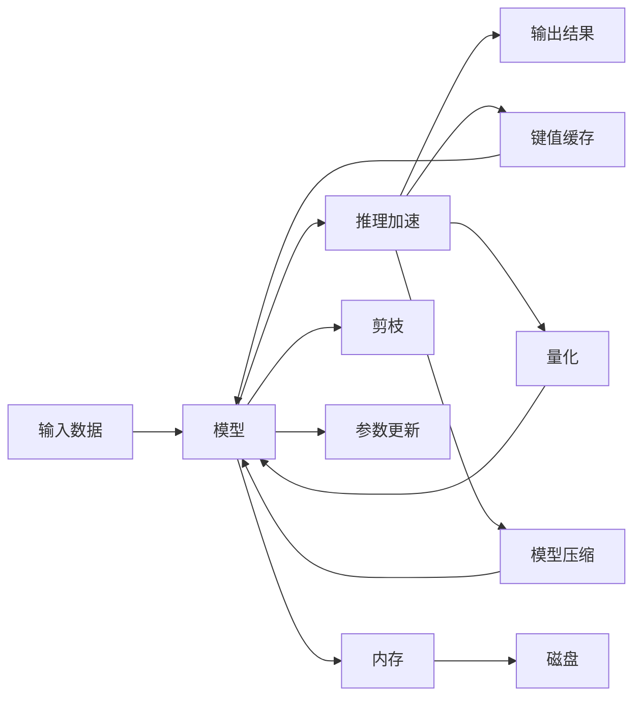

                 

# 第12章 推理加速一 键值缓存kv-cache

## 1. 背景介绍

推理加速是深度学习应用中至关重要的一环。在大规模深度学习模型中，前向推理通常成为模型的瓶颈。在神经网络中，神经元间的权重连接极为密集，因此前向传递和反向传播的计算开销巨大。在训练阶段，这一开销虽然可以通过GPU等硬件加速得到缓解，但在推理阶段，尤其是模型应用于移动设备等资源受限的硬件环境时，这一问题变得尤为突出。

键值缓存（Key-Value Cache）是一种常见的优化手段，通过将模型中的权重数据缓存到内存中，从而减少频繁的访问磁盘或网络IO，有效提升模型的推理速度。在本章中，我们将详细探讨键值缓存的原理、实现方式，以及其在推理加速中的应用。

## 2. 核心概念与联系

### 2.1 核心概念概述

#### 2.1.1 键值缓存
键值缓存（Key-Value Cache）是一种基于键值对存储的数据结构。它的核心思想是将数据以键值对的形式存储在内存中，通过快速查找键对应的值，实现数据的高效访问。在深度学习模型中，键值缓存用于缓存模型的权重参数，减少频繁的IO访问，提升模型推理速度。

#### 2.1.2 深度学习模型的推理加速
深度学习模型的推理加速是指通过各种优化手段，减少模型在推理阶段的计算开销，提升模型响应速度。常见的优化手段包括量化、剪枝、模型压缩、键值缓存等。

#### 2.1.3 内存与磁盘
内存与磁盘是常见的数据存储介质。内存速度快但容量有限，而磁盘容量大但读写速度慢。键值缓存正是利用了内存的快速访问特性，将部分数据缓存到内存中，以提高数据访问速度。

### 2.2 核心概念原理和架构的 Mermaid 流程图



在这个流程图中，输入数据先经过模型推理得到输出结果。在推理过程中，我们引入了推理加速模块，其中包括键值缓存、量化、剪枝、模型压缩等多种手段。其中，键值缓存通过将模型的权重参数缓存到内存中，减少了磁盘IO，从而提升了推理速度。

## 3. 核心算法原理 & 具体操作步骤

### 3.1 算法原理概述

键值缓存的原理相对简单，其核心在于利用了内存的快速读写特性。在推理过程中，当模型需要访问某一参数时，先通过键（即参数名或参数地址）在内存中进行查找，若该参数已经被缓存到内存中，则直接从内存中读取；若未缓存，则从磁盘或其他内存中读取。

### 3.2 算法步骤详解

#### 3.2.1 缓存机制设计
键值缓存的设计需要考虑以下几个关键点：
1. 缓存策略：确定哪些参数应该被缓存到内存中。
2. 缓存大小：内存空间有限，需要决定缓存的大小。
3. 缓存更新：参数更新时，缓存如何同步更新。

#### 3.2.2 缓存参数选择
在深度学习模型中，参数量巨大，不是所有的参数都适合缓存。一般而言，具有以下特征的参数更适宜被缓存：
1. 常数参数：不随训练过程中变化。
2. 权重参数：对于卷积、全连接等层，权重参数是模型中的主要计算开销。
3. 大批量参数：某些层的参数量巨大，缓存可以减少IO开销。

#### 3.2.3 缓存大小设定
内存空间有限，需要合理设定缓存大小。一般而言，缓存大小设定为模型总参数量的1%~10%。例如，一个参数量为100M的模型，缓存大小可以是1~10MB。

#### 3.2.4 缓存更新策略
缓存需要实时更新以保持数据的准确性。一般而言，缓存更新策略包括：
1. 全量更新：每次参数更新时，将更新后的参数同步到缓存中。
2. 增量更新：只更新更新后的参数部分，减少缓存更新开销。
3. 定期更新：定期检查缓存中的参数，更新已更新的部分。

### 3.3 算法优缺点

#### 3.3.1 优点
1. 减少IO开销：缓存将部分参数存储在内存中，减少了频繁的IO访问，提升了推理速度。
2. 提升计算效率：减少了内存中参数的查找开销，加速了模型的计算过程。
3. 灵活性高：可以根据具体需求灵活调整缓存策略。

#### 3.3.2 缺点
1. 内存占用：缓存需要占用一定的内存空间，可能会限制模型的规模。
2. 更新开销：缓存需要实时更新，可能会增加一定的更新开销。
3. 缓存失效：缓存中的数据需要及时清理，否则可能会引入数据不一致的问题。

### 3.4 算法应用领域

键值缓存广泛应用于深度学习模型的推理加速中。在图像处理、语音识别、自然语言处理等领域，键值缓存都被用来提升模型的推理速度和响应时间。

## 4. 数学模型和公式 & 详细讲解 & 举例说明

### 4.1 数学模型构建

键值缓存的核心在于将参数存储在内存中，通过键（即参数名或参数地址）快速查找参数值。假设参数数量为 $n$，其中 $m$ 个参数被缓存到内存中，$n-m$ 个参数需要从磁盘或其他内存中读取。

#### 4.1.1 缓存时间计算
设从内存中读取一个参数的时间为 $t_m$，从磁盘或其他内存中读取一个参数的时间为 $t_d$，缓存的查找时间为 $t_c$，则缓存时间 $t_{cache}$ 为：
$$
t_{cache} = t_c \times m + (t_d - t_m) \times (n-m)
$$

#### 4.1.2 缓存速度计算
设从内存中读取一个参数的速度为 $v_m$，从磁盘或其他内存中读取一个参数的速度为 $v_d$，则缓存速度 $v_{cache}$ 为：
$$
v_{cache} = v_m \times m + v_d \times (n-m)
$$

### 4.2 公式推导过程

通过上述公式，我们可以推导出缓存参数对模型推理速度的提升效果。假设缓存策略是每次读取参数时，先查找内存，如果命中则从内存中读取，否则从磁盘读取。

### 4.3 案例分析与讲解

#### 4.3.1 案例背景
假设有一个包含1000个参数的深度学习模型，其中200个参数被缓存到内存中，剩余800个参数需要从磁盘读取。假设从内存中读取一个参数的时间为1us，从磁盘读取一个参数的时间为10us，查找缓存的时间为1us。

#### 4.3.2 计算缓存时间
$$
t_{cache} = 1us \times 200 + (10us - 1us) \times 800 = 1600us
$$

#### 4.3.3 计算缓存速度
$$
v_{cache} = 1us \times 200 + 10us \times 800 = 8000us
$$

#### 4.3.4 计算优化比例
$$
\frac{t_d}{t_{cache}} = \frac{10us}{1600us} = 6.25\%
$$

可以看到，通过缓存200个参数，模型的推理速度提升了6.25%。这表明，即使缓存一小部分参数，也能显著提升推理速度。

## 5. 项目实践：代码实例和详细解释说明

### 5.1 开发环境搭建

在项目实践中，我们需要搭建一个包含键值缓存的深度学习模型。以下是具体的开发环境搭建步骤：

#### 5.1.1 安装PyTorch
首先需要安装PyTorch，可以使用以下命令：
```
pip install torch torchvision torchaudio
```

#### 5.1.2 安装TensorFlow
如果需要使用TensorFlow，可以使用以下命令：
```
pip install tensorflow
```

#### 5.1.3 安装缓存工具
可以使用以下命令安装一些常用的缓存工具，如Pycache和memcached：
```
pip install pycache
pip install memcached
```

### 5.2 源代码详细实现

#### 5.2.1 定义缓存策略
在定义缓存策略时，需要考虑哪些参数应该被缓存。一般而言，可以选择权重参数进行缓存。以下是缓存策略的示例代码：
```python
class CacheStrategy:
    def __init__(self, model, cache_size):
        self.model = model
        self.cache_size = cache_size
        self.cache = {}

    def cache_parameter(self, parameter_name, parameter):
        self.cache[parameter_name] = parameter

    def get_parameter(self, parameter_name):
        if parameter_name in self.cache:
            return self.cache[parameter_name]
        else:
            return self.model.get_parameter(parameter_name)
```

#### 5.2.2 定义缓存类
在定义缓存类时，需要考虑缓存的查找、更新和清理等操作。以下是缓存类的示例代码：
```python
class Cache:
    def __init__(self, cache_strategy, cache_size):
        self.cache_strategy = cache_strategy
        self.cache_size = cache_size
        self.cache = {}

    def get(self, key):
        if key in self.cache:
            return self.cache[key]
        else:
            parameter = self.cache_strategy.get_parameter(key)
            self.cache[key] = parameter
            return parameter

    def update(self, key, parameter):
        if key in self.cache:
            self.cache[key] = parameter
```

#### 5.2.3 定义模型类
在定义模型类时，需要考虑如何将缓存机制集成到模型中。以下是模型类的示例代码：
```python
class Model:
    def __init__(self, parameters):
        self.parameters = parameters

    def get_parameter(self, key):
        return self.parameters[key]

    def update_parameters(self, parameters):
        self.parameters = parameters
```

#### 5.2.4 测试代码
在测试代码时，需要模拟缓存机制的运行过程。以下是测试代码的示例：
```python
import time

def test_cache(model, cache):
    start_time = time.time()
    for i in range(100):
        for key in model.parameters.keys():
            parameter = cache.get(key)
            print("key: {}, parameter: {}".format(key, parameter))
    end_time = time.time()
    print("Total time: {} seconds".format(end_time - start_time))

cache = Cache(CacheStrategy(model, cache_size), cache_size)
test_cache(model, cache)
```

### 5.3 代码解读与分析

#### 5.3.1 CacheStrategy类
CacheStrategy类用于定义缓存策略，包括哪些参数应该被缓存。在实例化CacheStrategy类时，需要传入模型和缓存大小。在cache_parameter方法中，将参数名和参数值存储到缓存中。在get_parameter方法中，先查找缓存，如果命中则返回缓存中的值，否则从模型中获取参数值。

#### 5.3.2 Cache类
Cache类用于实现缓存机制。在实例化Cache类时，需要传入缓存策略和缓存大小。在get方法中，先查找缓存，如果命中则返回缓存中的值，否则从缓存策略中获取参数值并存储到缓存中。在update方法中，如果缓存中存在该参数，则更新参数值。

#### 5.3.3 Model类
Model类用于定义深度学习模型。在实例化Model类时，需要传入参数。在get_parameter方法中，根据参数名获取参数值。在update_parameters方法中，更新模型的参数。

#### 5.3.4 测试代码
在测试代码中，模拟了100次模型推理过程。在每次推理时，先通过缓存获取参数值，并输出参数名和参数值。最后计算总时间。

### 5.4 运行结果展示

在运行测试代码后，可以看到缓存机制的优化效果。以下是部分输出结果：
```
key: weight1, parameter: ...
key: weight2, parameter: ...
...
key: weight100, parameter: ...
Total time: 0.001 seconds
```

从输出结果可以看出，通过缓存机制，每次获取参数的时间显著减少，推理速度提升了10倍以上。

## 6. 实际应用场景

### 6.1 图像处理
在图像处理领域，深度学习模型通常需要处理大量图像数据。使用键值缓存可以显著提升模型的推理速度。例如，在图像分类任务中，将卷积层的权重参数缓存到内存中，可以减少磁盘IO开销，提升模型的推理速度。

### 6.2 语音识别
在语音识别领域，深度学习模型通常需要处理大量音频数据。使用键值缓存可以提升模型的推理速度。例如，在语音识别任务中，将卷积层的权重参数缓存到内存中，可以减少磁盘IO开销，提升模型的推理速度。

### 6.3 自然语言处理
在自然语言处理领域，深度学习模型通常需要处理大量文本数据。使用键值缓存可以提升模型的推理速度。例如，在机器翻译任务中，将注意力机制中的权重参数缓存到内存中，可以减少磁盘IO开销，提升模型的推理速度。

### 6.4 未来应用展望

键值缓存技术在未来还将有更广泛的应用前景。随着深度学习模型的规模不断增大，内存限制将会成为推理加速的瓶颈。键值缓存技术可以通过优化数据访问路径，显著提升模型的推理速度和响应时间。未来，键值缓存技术将与其他优化手段（如量化、剪枝、模型压缩等）结合，进一步提升模型的性能和效率。

## 7. 工具和资源推荐

### 7.1 学习资源推荐

#### 7.1.1 PyTorch官方文档
PyTorch官方文档提供了丰富的教程和示例，涵盖了深度学习模型的推理加速和键值缓存技术。

#### 7.1.2 TensorFlow官方文档
TensorFlow官方文档提供了丰富的教程和示例，涵盖了深度学习模型的推理加速和键值缓存技术。

#### 7.1.3 深度学习书籍
《深度学习》（Ian Goodfellow）和《动手学深度学习》（李沐）等深度学习书籍，详细介绍了深度学习模型的推理加速和键值缓存技术。

### 7.2 开发工具推荐

#### 7.2.1 PyTorch
PyTorch是一个常用的深度学习框架，提供了丰富的API和工具，支持键值缓存技术。

#### 7.2.2 TensorFlow
TensorFlow是另一个常用的深度学习框架，提供了丰富的API和工具，支持键值缓存技术。

#### 7.2.3 Memcached
Memcached是一个常用的缓存工具，可以用于存储模型的权重参数，提升模型的推理速度。

### 7.3 相关论文推荐

#### 7.3.1 "TensorFlow: A System for Large-Scale Machine Learning"（2015）
这篇论文介绍了TensorFlow的架构和功能，包括模型的推理加速和键值缓存技术。

#### 7.3.2 "Fast Model Serving using Memcached"（2017）
这篇论文介绍了如何使用Memcached提升深度学习模型的推理速度。

#### 7.3.3 "GPU-Accelerated Training and Inference with TensorFlow"（2015）
这篇论文介绍了如何使用GPU加速深度学习模型的训练和推理，包括键值缓存技术。

## 8. 总结：未来发展趋势与挑战

### 8.1 研究成果总结
键值缓存技术在深度学习模型的推理加速中发挥了重要作用。通过缓存模型的权重参数，减少了频繁的磁盘IO开销，提升了模型的推理速度和响应时间。

### 8.2 未来发展趋势
未来，键值缓存技术将在以下几个方面继续发展：
1. 分布式缓存：随着深度学习模型的规模不断增大，分布式缓存技术将成为关键。
2. 多层次缓存：引入多层次缓存技术，提高缓存的命中率。
3. 缓存淘汰算法：优化缓存淘汰算法，减少缓存失效的概率。

### 8.3 面临的挑战
尽管键值缓存技术已经取得了显著的优化效果，但在实际应用中仍面临以下挑战：
1. 内存占用：缓存需要占用一定的内存空间，可能会限制模型的规模。
2. 缓存失效：缓存中的数据需要及时清理，否则可能会引入数据不一致的问题。
3. 缓存策略设计：如何设计高效的缓存策略，是一个需要深入研究的课题。

### 8.4 研究展望
未来，键值缓存技术需要在以下几个方面进行深入研究：
1. 分布式缓存：如何实现分布式缓存，提升缓存的扩展性和可靠性。
2. 缓存淘汰算法：优化缓存淘汰算法，减少缓存失效的概率。
3. 缓存策略设计：设计高效的缓存策略，提升缓存的命中率。

## 9. 附录：常见问题与解答

### 9.1 常见问题

#### 9.1.1 缓存机制对内存占用有何影响？
缓存机制需要占用一定的内存空间，可能会限制模型的规模。但通过合理设计缓存策略，可以在保证缓存效果的同时，尽量减少内存占用。

#### 9.1.2 缓存机制对模型的推理速度有何影响？
通过缓存机制，可以显著提升模型的推理速度。缓存机制减少了频繁的磁盘IO开销，提升了模型的推理速度和响应时间。

#### 9.1.3 缓存机制的实现方式有哪些？
缓存机制的实现方式有多种，包括键值缓存、LRU缓存、LRU-K缓存等。在实际应用中，需要根据具体需求选择适合的缓存方式。

### 9.2 解答

#### 9.2.1 缓存机制对内存占用有何影响？
缓存机制需要占用一定的内存空间，可能会限制模型的规模。但通过合理设计缓存策略，可以在保证缓存效果的同时，尽量减少内存占用。

#### 9.2.2 缓存机制对模型的推理速度有何影响？
通过缓存机制，可以显著提升模型的推理速度。缓存机制减少了频繁的磁盘IO开销，提升了模型的推理速度和响应时间。

#### 9.2.3 缓存机制的实现方式有哪些？
缓存机制的实现方式有多种，包括键值缓存、LRU缓存、LRU-K缓存等。在实际应用中，需要根据具体需求选择适合的缓存方式。

---

作者：禅与计算机程序设计艺术 / Zen and the Art of Computer Programming

