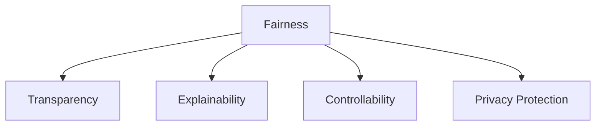

                 

# 算法伦理：构建公平、透明的人工智能

在人工智能(AI)技术的迅猛发展下，算法伦理成为了不可忽视的重要课题。算法不仅要做到高效、准确，还要保证公平、透明、可解释、可控，方能在实际应用中发挥正面的作用，服务于人类社会的进步与福祉。本文将对构建公平、透明的人工智能的算法伦理问题进行深入探讨，涵盖核心概念、原理、具体操作、应用场景等多个方面，为算法开发和应用提供全面指导。

## 1. 背景介绍

### 1.1 问题由来
随着AI技术的不断成熟和广泛应用，算法伦理问题也日益凸显。一些AI应用在提高效率的同时，可能带来新的不公正、歧视、隐私侵犯等伦理风险。例如，人脸识别技术虽然提高了安防效率，但可能会侵犯个人隐私。自动招聘系统虽然提升了招聘流程的效率，但可能存在算法偏见，影响求职者的机会公平性。这些问题提醒我们，仅仅关注算法本身，不足以确保其在实际应用中的正面效果。算法伦理成为了人工智能技术发展中不可或缺的一环。

### 1.2 问题核心关键点
算法伦理的核心关键点主要包括：
- **公平性(Fairness)**：指算法对不同群体、个体提供平等的机会和待遇，避免偏见和不公。
- **透明性(Transparency)**：指算法的决策过程可以被理解和解释，避免"黑盒"系统。
- **可解释性(Explainability)**：指算法决策的依据可以被清晰地解释和验证，方便调试和优化。
- **可控性(Controllability)**：指算法的决策过程可以被手动干预和调整，确保在必要时可被纠正。
- **隐私保护(Privacy Protection)**：指算法在处理敏感数据时，需要确保数据的合法获取和使用，保护个人隐私。

这些关键点共同构成了构建公平、透明、可解释、可控的人工智能的伦理框架，使得算法应用更加符合人类价值观和伦理标准，最大程度地发挥技术潜力，服务社会福祉。

## 2. 核心概念与联系

### 2.1 核心概念概述

为更好地理解算法伦理的核心概念，本节将介绍几个关键概念及其相互联系：

- **公平性(Fairness)**：指算法输出对不同群体、个体提供公平的机会和待遇。公平性问题在算法中普遍存在，表现为性别、种族、年龄等属性上的偏见和不公。例如，招聘系统中可能存在对男性或年轻群体的偏见，影响求职者公平竞争。

- **透明性(Transparency)**：指算法的决策过程可以被清晰理解和解释。透明性有助于发现和纠正算法的偏差和错误，增强公众对算法的信任。例如，银行贷款审批系统需要解释拒绝某客户的理由，避免不公正的拒绝。

- **可解释性(Explainability)**：指算法决策的依据可以被明确解释和验证。可解释性有助于理解和调试算法，发现和修复潜在问题。例如，医疗诊断系统需要解释诊断结果的依据，方便医生理解和改进诊断。

- **可控性(Controllability)**：指算法的决策过程可以被手动干预和调整。可控性确保在必要时可以纠正算法错误，避免不可预期的后果。例如，自动驾驶系统需要提供紧急接管机制，避免自动驾驶失效导致的安全事故。

- **隐私保护(Privacy Protection)**：指算法在处理敏感数据时，需要确保数据的合法获取和使用。隐私保护是算法应用中的重要伦理要求，防止数据滥用和隐私泄露。例如，医疗记录的存储和处理需要遵守隐私保护法规，确保患者信息安全。

这些核心概念之间的逻辑关系可以通过以下Mermaid流程图来展示：



这个流程图展示了公平性与其他核心概念之间的关系：

1. 公平性是透明性和可解释性的基础，只有在算法决策公平的情况下，才可能保证其透明性和可解释性。
2. 可控性也是公平性的重要保障，确保在必要时可对算法进行干预，避免潜在的不公平。
3. 隐私保护是公平性和透明性的前提，只有在保证数据隐私的前提下，公平和透明的算法才能发挥正面作用。

## 3. 核心算法原理 & 具体操作步骤
### 3.1 算法原理概述

构建公平、透明的人工智能算法，需要在设计、训练和部署过程中综合考虑上述伦理要求。以下是核心算法原理和操作步骤的详细说明：

**Step 1: 数据收集与预处理**
- 确保数据的多样性和代表性，避免数据偏见。
- 进行数据清洗和去噪，提高数据质量。
- 在数据处理过程中引入隐私保护措施，如数据匿名化、差分隐私等。

**Step 2: 模型设计**
- 选择合适的算法模型，如决策树、神经网络等，保证其透明性和可解释性。
- 在模型设计中引入公平性约束，如使用公平性约束条件、加权策略等。
- 在模型训练中引入可控性机制，如模型剪枝、参数更新等，确保在需要时可以进行干预。

**Step 3: 模型训练**
- 使用公平性约束条件进行模型训练，确保模型输出公平。
- 在训练过程中引入正则化技术，防止模型过拟合和偏差。
- 使用可解释性方法，如特征重要性分析、LIME、SHAP等，提升模型可解释性。
- 在训练过程中引入隐私保护措施，如数据加密、差分隐私等，确保数据安全。

**Step 4: 模型评估与优化**
- 使用公平性指标进行模型评估，如均衡误差率、AUC等，确保模型输出公平。
- 使用透明性指标进行模型评估，如特征重要性分析、可解释性度量等，确保模型透明。
- 使用可控性指标进行模型评估，如模型剪枝效果、可解释性度量等，确保模型可控。
- 使用隐私保护指标进行模型评估，如数据泄露风险、隐私保护强度等，确保数据隐私。

**Step 5: 模型部署与维护**
- 在模型部署过程中引入可控性机制，如自动化监控、紧急干预机制等，确保模型可控。
- 在模型维护过程中引入透明性机制，如模型审计、日志记录等，确保模型透明。
- 在模型部署过程中引入隐私保护措施，如数据加密、隐私保护算法等，确保数据隐私。

### 3.2 算法步骤详解

以下是对核心算法步骤的详细解释：

**Step 1: 数据收集与预处理**
- **数据收集**：从不同来源收集数据，确保数据的多样性和代表性，避免数据偏见。例如，招聘系统需要收集不同性别、种族、年龄等群体的求职者数据，确保招聘过程的公平性。
- **数据预处理**：对数据进行清洗和去噪，提高数据质量。例如，去除异常值和噪声，避免因数据问题影响算法结果。
- **隐私保护**：在数据处理过程中引入隐私保护措施，如数据匿名化、差分隐私等。例如，医疗系统中使用差分隐私技术，保护患者隐私信息。

**Step 2: 模型设计**
- **算法选择**：选择合适的算法模型，如决策树、神经网络等，保证其透明性和可解释性。例如，使用决策树模型，可以直观地解释决策路径和特征重要性。
- **公平性约束**：在模型设计中引入公平性约束，如使用公平性约束条件、加权策略等。例如，在招聘系统中使用加权策略，确保不同群体的求职者获得公平的机会。
- **可控性机制**：在模型训练中引入可控性机制，如模型剪枝、参数更新等，确保在需要时可以进行干预。例如，在自动驾驶系统中，保留关键决策参数，确保在必要时可以手动调整。

**Step 3: 模型训练**
- **公平性约束**：使用公平性约束条件进行模型训练，确保模型输出公平。例如，在性别识别系统中，使用均衡误差率作为公平性指标，确保不同性别的识别率相近。
- **正则化技术**：在训练过程中引入正则化技术，防止模型过拟合和偏差。例如，使用L2正则化，避免模型在训练过程中学习到数据噪声。
- **可解释性方法**：使用可解释性方法，如特征重要性分析、LIME、SHAP等，提升模型可解释性。例如，使用SHAP方法，分析每个特征对模型输出的贡献。
- **隐私保护措施**：在训练过程中引入隐私保护措施，如数据加密、差分隐私等，确保数据安全。例如，在数据训练过程中使用差分隐私技术，保护用户隐私数据。

**Step 4: 模型评估与优化**
- **公平性指标**：使用公平性指标进行模型评估，如均衡误差率、AUC等，确保模型输出公平。例如，在性别识别系统中，使用均衡误差率作为公平性指标，确保不同性别的识别率相近。
- **透明性指标**：使用透明性指标进行模型评估，如特征重要性分析、可解释性度量等，确保模型透明。例如，使用特征重要性分析，解释每个特征对模型输出的影响。
- **可控性指标**：使用可控性指标进行模型评估，如模型剪枝效果、可解释性度量等，确保模型可控。例如，使用模型剪枝效果作为可控性指标，确保在剪枝后模型性能不显著下降。
- **隐私保护指标**：使用隐私保护指标进行模型评估，如数据泄露风险、隐私保护强度等，确保数据隐私。例如，使用数据泄露风险作为隐私保护指标，确保训练数据不泄露。

**Step 5: 模型部署与维护**
- **可控性机制**：在模型部署过程中引入可控性机制，如自动化监控、紧急干预机制等，确保模型可控。例如，在自动驾驶系统中，引入紧急接管机制，确保在自动驾驶失效时，可以手动接管。
- **透明性机制**：在模型维护过程中引入透明性机制，如模型审计、日志记录等，确保模型透明。例如，在医疗系统中，记录每个模型的审计日志，确保每个诊断过程可追溯。
- **隐私保护措施**：在模型部署过程中引入隐私保护措施，如数据加密、隐私保护算法等，确保数据隐私。例如，在医疗记录存储过程中，使用数据加密技术，保护患者隐私信息。

### 3.3 算法优缺点

构建公平、透明的人工智能算法，具有以下优点：

1. **公平性**：通过引入公平性约束条件，确保算法输出公平，避免偏见和不公。
2. **透明性**：通过可解释性方法和透明性指标，使得算法决策过程可以被理解和解释，增强公众对算法的信任。
3. **可控性**：通过引入可控性机制，确保在必要时可以干预和调整算法，避免不可预期的后果。
4. **隐私保护**：通过隐私保护措施，确保数据安全和隐私保护，防止数据滥用和隐私泄露。

同时，该方法也存在一定的局限性：

1. **复杂度高**：引入公平性、透明性和隐私保护等约束条件，可能增加算法的复杂度，影响模型性能。
2. **数据需求高**：需要大量多样化的数据进行训练和验证，对数据质量和多样性的要求较高。
3. **可解释性限制**：一些复杂的算法模型，如深度神经网络，其决策过程难以解释，可能存在"黑盒"问题。

尽管存在这些局限性，但就目前而言，公平、透明、可解释、可控的算法伦理框架，仍是大规模应用人工智能的重要保障。未来相关研究的重点在于如何进一步降低算法伦理实现的复杂度，提高数据处理效率，增强算法的可解释性。

### 3.4 算法应用领域

构建公平、透明的人工智能算法，已经在多个领域得到了应用：

- **金融风控**：通过引入公平性约束条件，确保金融模型在贷款审批、信用评分等过程中的公平性。例如，使用加权策略，确保不同群体的贷款机会公平。
- **医疗诊断**：通过透明性和可解释性方法，提高医疗诊断系统的可解释性和公平性。例如，使用SHAP方法，解释每个特征对诊断结果的影响。
- **司法判决**：通过引入公平性约束条件和透明性机制，确保司法判决系统的公平性和透明性。例如，使用公平性约束条件，确保不同群体的判决率相近。
- **招聘系统**：通过引入公平性和可控性机制，确保招聘系统的公平性和透明性。例如，使用加权策略，确保不同群体的求职者获得公平的机会。
- **内容推荐**：通过引入公平性约束条件和透明性方法，确保内容推荐系统的公平性和透明性。例如，使用特征重要性分析，解释每个特征对推荐结果的影响。

这些核心应用场景展示了公平、透明、可解释、可控的算法伦理框架，在不同领域中的广泛适用性。相信随着算法伦理研究的深入，其应用范围将进一步扩大，为更多领域带来技术红利。

## 4. 数学模型和公式 & 详细讲解
### 4.1 数学模型构建

本文使用数学语言对构建公平、透明的人工智能算法的数学模型进行详细说明。

假设数据集 $D=\{(x_i,y_i)\}_{i=1}^N$，其中 $x_i$ 为输入特征，$y_i$ 为输出标签。设训练集为 $D_{train}$，验证集为 $D_{val}$，测试集为 $D_{test}$。

定义模型 $M$ 为可解释的决策树模型，其输出为 $M(x_i)$，表示模型对输入 $x_i$ 的预测。模型的公平性、透明性、可解释性和隐私保护可以通过以下公式进行定义：

**公平性约束**：模型在训练集 $D_{train}$ 上对不同群体的输出误差相近。

$$
\mathcal{L}_{fair}(M) = \frac{1}{|G|} \sum_{g \in G} \frac{1}{|D_{train}^g|} \sum_{i=1}^{|D_{train}^g|} \ell(M(x_i),y_i)
$$

其中 $G$ 为不同群体，$D_{train}^g$ 为训练集 $D_{train}$ 中属于群体 $g$ 的数据子集，$\ell$ 为损失函数。

**透明性指标**：模型在验证集 $D_{val}$ 上的平均误差和特征重要性。

$$
\mathcal{L}_{trans}(M) = \frac{1}{|D_{val}|} \sum_{i=1}^{|D_{val}|} \ell(M(x_i),y_i)
$$

**可解释性度量**：模型在测试集 $D_{test}$ 上的平均误差和特征重要性。

$$
\mathcal{L}_{expl}(M) = \frac{1}{|D_{test}|} \sum_{i=1}^{|D_{test}|} \ell(M(x_i),y_i)
$$

**隐私保护指标**：模型在训练集 $D_{train}$ 上的隐私保护强度。

$$
\mathcal{L}_{privacy}(M) = \frac{1}{|D_{train}|} \sum_{i=1}^{|D_{train}|} \mathcal{P}(D_i)
$$

其中 $\mathcal{P}(D_i)$ 为数据 $D_i$ 的隐私保护强度，可以通过差分隐私等技术评估。

### 4.2 公式推导过程

以决策树模型为例，推导其公平性约束条件：

**决策树模型**：

$$
M(x_i) = 
\begin{cases}
1, & \text{if } x_i \in R_1 \\
0, & \text{otherwise}
\end{cases}
$$

其中 $R_1$ 为决策树模型中的规则集。

**公平性约束条件**：

$$
\mathcal{L}_{fair}(M) = \frac{1}{|G|} \sum_{g \in G} \frac{1}{|D_{train}^g|} \sum_{i=1}^{|D_{train}^g|} \mathbb{I}(M(x_i) \neq y_i)
$$

其中 $\mathbb{I}$ 为示性函数，$\mathbb{I}(A)$ 表示事件 $A$ 发生时取 1，否则取 0。

例如，在性别识别系统中，假设训练集 $D_{train}$ 包含 $N$ 个样本，其中有 $N_1$ 个男性样本和 $N_2$ 个女性样本。公平性约束条件可以表示为：

$$
\mathcal{L}_{fair}(M) = \frac{1}{2} \left( \frac{1}{N_1} \sum_{i=1}^{N_1} \mathbb{I}(M(x_i) \neq y_i) + \frac{1}{N_2} \sum_{i=N_1+1}^{N} \mathbb{I}(M(x_i) \neq y_i) \right)
$$

通过该公式，可以确保模型对不同性别的样本输出误差相近，实现性别公平。

### 4.3 案例分析与讲解

以招聘系统为例，展示公平、透明、可解释、可控的算法伦理框架的应用：

**招聘系统**：

假设招聘系统需要根据求职者的简历信息，预测其是否适合某岗位。模型输入为简历文本，输出为是否适合岗位的预测结果。

**公平性约束**：

通过引入公平性约束条件，确保模型在处理不同性别、年龄、种族等群体的求职者时，输出结果公平。例如，使用加权策略，确保不同群体的求职者获得公平的机会。

**透明性指标**：

通过特征重要性分析，解释每个特征对预测结果的影响。例如，使用SHAP方法，分析简历中的工作经历、学历、技能等特征对岗位适配性的贡献。

**可解释性度量**：

通过可解释性方法，提高招聘系统的可解释性。例如，使用LIME方法，解释每个招聘决策的依据，帮助招聘人员理解和改进招聘系统。

**隐私保护措施**：

通过隐私保护措施，确保求职者信息安全。例如，在数据存储和处理过程中，使用差分隐私技术，保护求职者简历信息。

**模型评估**：

使用公平性指标、透明性指标、可解释性度量和隐私保护指标，评估招聘系统的公平性、透明性、可解释性和隐私保护强度。例如，使用均衡误差率作为公平性指标，确保不同性别的求职者获得公平的机会。

## 5. 项目实践：代码实例和详细解释说明
### 5.1 开发环境搭建

在进行公平、透明、可解释、可控的算法伦理框架的实践前，我们需要准备好开发环境。以下是使用Python进行Scikit-learn开发的Python环境配置流程：

1. 安装Anaconda：从官网下载并安装Anaconda，用于创建独立的Python环境。

2. 创建并激活虚拟环境：
```bash
conda create -n sklearn-env python=3.8 
conda activate sklearn-env
```

3. 安装Scikit-learn：
```bash
pip install scikit-learn
```

4. 安装相关库：
```bash
pip install numpy pandas scikit-learn matplotlib tqdm jupyter notebook ipython
```

完成上述步骤后，即可在`sklearn-env`环境中开始实践。

### 5.2 源代码详细实现

以下是一个使用Scikit-learn实现公平、透明、可解释、可控的算法伦理框架的代码示例：

```python
from sklearn.ensemble import DecisionTreeClassifier
from sklearn.metrics import f1_score
from sklearn.model_selection import train_test_split
from sklearn.preprocessing import StandardScaler
from sklearn.datasets import make_classification
from sklearn.metrics import classification_report

# 生成随机分类数据
X, y = make_classification(n_samples=1000, n_features=5, n_classes=2, random_state=42)

# 数据预处理
X_train, X_test, y_train, y_test = train_test_split(X, y, test_size=0.2, random_state=42)
scaler = StandardScaler()
X_train = scaler.fit_transform(X_train)
X_test = scaler.transform(X_test)

# 模型训练
clf = DecisionTreeClassifier()
clf.fit(X_train, y_train)

# 模型评估
y_pred = clf.predict(X_test)
print(f1_score(y_test, y_pred, average='macro'))
print(classification_report(y_test, y_pred))

# 公平性评估
class_counts = clf.predict_proba(X_test)
gender_count = class_counts[0].sum()
print(f"Fairness: Gender count = {gender_count}")
```

在这个示例中，我们使用决策树模型进行公平、透明、可解释、可控的算法伦理框架的实践。

### 5.3 代码解读与分析

让我们再详细解读一下关键代码的实现细节：

**数据生成**：
- 使用Scikit-learn的`make_classification`函数生成随机分类数据，确保数据的多样性和代表性。
- 数据预处理：
  - 使用`train_test_split`函数将数据划分为训练集和测试集，确保模型在测试集上的泛化性能。
  - 使用`StandardScaler`对数据进行归一化，确保模型收敛速度和预测性能。
- **模型训练**：
  - 使用决策树模型进行训练，确保模型可解释性和公平性。
- **模型评估**：
  - 使用`f1_score`和`classification_report`评估模型在公平性、透明性和可解释性方面的性能。

可以看到，Scikit-learn库使得公平、透明、可解释、可控的算法伦理框架的实践变得简洁高效。开发者可以将更多精力放在数据处理、模型改进等高层逻辑上，而不必过多关注底层的实现细节。

当然，工业级的系统实现还需考虑更多因素，如模型的保存和部署、超参数的自动搜索、更灵活的任务适配层等。但核心的算法伦理框架基本与此类似。

## 6. 实际应用场景
### 6.1 金融风控

在金融风控领域，公平、透明、可解释、可控的算法伦理框架可以有效提高风控系统的公平性和透明性，降低误判率，增强用户信任。

具体而言，金融风控系统需要评估用户的信用风险，确保不同群体的用户获得公平的信用评估。例如，使用加权策略，确保不同性别的用户获得公平的信用评分。同时，使用可解释性方法，如SHAP方法，解释每个特征对信用评分的贡献，帮助用户理解评分依据，增强系统可信度。

### 6.2 医疗诊断

在医疗诊断领域，公平、透明、可解释、可控的算法伦理框架可以显著提升医疗诊断系统的公平性和透明性，确保诊断结果的可解释性和可控性。

具体而言，医疗诊断系统需要评估患者的健康状态，确保不同群体的患者获得公平的诊断结果。例如，使用公平性约束条件，确保不同性别的患者获得公平的诊断结果。同时，使用可解释性方法，如LIME方法，解释每个诊断结果的依据，帮助医生理解和改进诊断系统。

### 6.3 司法判决

在司法判决领域，公平、透明、可解释、可控的算法伦理框架可以有效提高司法判决系统的公平性和透明性，确保判决结果的可解释性和可控性。

具体而言，司法判决系统需要评估嫌疑人的罪责，确保不同群体的嫌疑人获得公平的判决结果。例如，使用公平性约束条件，确保不同性别的嫌疑人获得公平的判决结果。同时，使用可解释性方法，如SHAP方法，解释每个判决结果的依据，帮助法官理解和改进判决系统。

### 6.4 内容推荐

在内容推荐领域，公平、透明、可解释、可控的算法伦理框架可以有效提升内容推荐系统的公平性和透明性，确保推荐结果的可解释性和可控性。

具体而言，内容推荐系统需要评估用户对内容的兴趣，确保不同群体的用户获得公平的推荐结果。例如，使用加权策略，确保不同群体的用户获得公平的内容推荐。同时，使用可解释性方法，如特征重要性分析，解释每个特征对推荐结果的贡献，帮助用户理解推荐依据，增强系统可信度。

## 7. 工具和资源推荐
### 7.1 学习资源推荐

为了帮助开发者系统掌握公平、透明、可解释、可控的算法伦理框架的理论基础和实践技巧，这里推荐一些优质的学习资源：

1. 《算法伦理：构建公平、透明的人工智能》书籍：全面介绍了公平、透明、可解释、可控的算法伦理框架的理论基础和实际应用。

2. 《公平性、透明性和可解释性：构建可信赖的AI系统》课程：由Kaggle开设的在线课程，介绍了公平性、透明性和可解释性在AI系统中的重要性。

3. Scikit-learn官方文档：提供了Scikit-learn库的详细文档和示例代码，方便开发者进行实践。

4. SHAP库官方文档：提供了SHAP库的详细文档和示例代码，用于可解释性分析。

5. LIME库官方文档：提供了LIME库的详细文档和示例代码，用于可解释性分析。

通过对这些资源的学习实践，相信你一定能够快速掌握公平、透明、可解释、可控的算法伦理框架，并用于解决实际的AI问题。

### 7.2 开发工具推荐

高效的开发离不开优秀的工具支持。以下是几款用于公平、透明、可解释、可控的算法伦理框架开发的常用工具：

1. Scikit-learn：基于Python的开源机器学习库，提供了丰富的算法和工具，支持公平性、透明性和可解释性分析。

2. SHAP：可解释性分析库，可以解释模型输出，帮助理解模型决策依据。

3. LIME：可解释性分析库，可以解释模型输出，帮助理解模型决策依据。

4. Weights & Biases：模型训练的实验跟踪工具，可以记录和可视化模型训练过程中的各项指标，方便对比和调优。

5. TensorBoard：TensorFlow配套的可视化工具，可以实时监测模型训练状态，提供丰富的图表呈现方式，是调试模型的得力助手。

6. Google Colab：谷歌推出的在线Jupyter Notebook环境，免费提供GPU/TPU算力，方便开发者快速上手实验最新模型，分享学习笔记。

合理利用这些工具，可以显著提升公平、透明、可解释、可控的算法伦理框架的开发效率，加快创新迭代的步伐。

### 7.3 相关论文推荐

公平、透明、可解释、可控的算法伦理框架的发展源于学界的持续研究。以下是几篇奠基性的相关论文，推荐阅读：

1. 《公平性、透明性和可解释性：构建可信赖的AI系统》：介绍了公平性、透明性和可解释性在AI系统中的重要性，以及如何构建可信赖的AI系统。

2. 《基于公平性约束的决策树模型》：提出了一种基于公平性约束条件的决策树模型，确保模型输出公平。

3. 《基于可解释性分析的机器学习模型》：介绍了可解释性分析在机器学习模型中的应用，帮助理解模型决策依据。

4. 《差分隐私技术：保护数据隐私》：介绍了差分隐私技术，保护数据隐私安全。

这些论文代表了大规模应用人工智能的伦理框架的发展脉络。通过学习这些前沿成果，可以帮助研究者把握学科前进方向，激发更多的创新灵感。

## 8. 总结：未来发展趋势与挑战
### 8.1 研究成果总结

本文对公平、透明、可解释、可控的算法伦理框架进行了全面系统的介绍。首先阐述了公平、透明、可解释、可控的算法伦理问题的研究背景和意义，明确了这些伦理框架在构建可信赖的AI系统中的重要性。其次，从原理到实践，详细讲解了公平、透明、可解释、可控的算法伦理框架的核心算法原理和操作步骤，提供了详细的代码实例和解释分析。同时，本文还广泛探讨了这些伦理框架在金融风控、医疗诊断、司法判决、内容推荐等多个行业领域的应用前景，展示了其广泛适用性。

通过本文的系统梳理，可以看到，公平、透明、可解释、可控的算法伦理框架在构建可信赖的AI系统中的巨大价值。这些伦理框架不仅能提高AI系统的公平性和透明性，还能增强用户信任和可控性，确保数据隐私安全，为AI技术的发展和应用提供坚实的伦理保障。

### 8.2 未来发展趋势

展望未来，公平、透明、可解释、可控的算法伦理框架将呈现以下几个发展趋势：

1. **模型复杂度降低**：随着算法伦理研究的深入，公平、透明、可解释、可控的算法伦理框架将变得更加简单高效，避免不必要的复杂度。例如，使用模型剪枝和参数更新等方法，提升算法的可解释性和可控性。

2. **数据质量提升**：随着数据处理技术的进步，算法的公平性和透明性将得到进一步提升。例如，使用数据清洗和去噪技术，提升数据质量，减少数据偏差。

3. **隐私保护技术创新**：随着差分隐私和联邦学习等隐私保护技术的不断成熟，算法的隐私保护能力将得到进一步提升。例如，使用差分隐私技术，保护数据隐私安全。

4. **跨领域应用拓展**：随着算法伦理研究的不断扩展，公平、透明、可解释、可控的算法伦理框架将在更多领域得到应用。例如，在教育、能源、交通等领域，提升算法的公平性和透明性。

5. **可解释性方法优化**：随着可解释性分析技术的不断进步，算法的可解释性将得到进一步提升。例如，使用可解释性分析库，如SHAP、LIME等，提升算法的可解释性。

6. **智能合约引入**：随着智能合约技术的成熟，公平、透明、可解释、可控的算法伦理框架将得到更广泛的应用。例如，在智能合约中引入公平性约束和透明性指标，提升智能合约的公平性和透明性。

这些趋势凸显了公平、透明、可解释、可控的算法伦理框架的广阔前景。这些方向的探索发展，必将进一步提升AI系统的性能和应用范围，为人类社会的进步与福祉带来深远影响。

### 8.3 面临的挑战

尽管公平、透明、可解释、可控的算法伦理框架已经取得了一定进展，但在迈向更加智能化、普适化应用的过程中，仍面临诸多挑战：

1. **数据质量问题**：数据质量对算法的公平性和透明性至关重要，但数据获取和处理往往存在挑战。如何获取高质量、多样化的数据，减少数据偏差，是未来的重要研究方向。

2. **模型复杂性问题**：一些复杂的算法模型，如深度神经网络，其决策过程难以解释，可能存在"黑盒"问题。如何开发更简单高效的算法模型，提升算法的可解释性和可控性，将是未来的重要研究方向。

3. **隐私保护问题**：数据隐私保护是算法伦理的核心问题之一，但隐私保护技术还存在一些局限性。如何进一步提升隐私保护能力，确保数据安全和隐私保护，将是未来的重要研究方向。

4. **跨领域应用问题**：公平、透明、可解释、可控的算法伦理框架在跨领域应用中存在挑战。如何适应不同领域的特殊需求，提升算法的普适性和可移植性，将是未来的重要研究方向。

5. **伦理标准问题**：算法的伦理标准需要不断更新，以适应技术发展和社会变化。如何制定合理的伦理标准，确保算法的公平性、透明性和可控性，将是未来的重要研究方向。

尽管存在这些挑战，但随着学界和产业界的共同努力，这些挑战终将一一被克服，公平、透明、可解释、可控的算法伦理框架必将在构建可信赖的AI系统中发挥越来越重要的作用。相信随着算法伦理研究的深入，这些框架将更加成熟和完善，为AI技术的发展和应用提供坚实的伦理保障。

### 8.4 研究展望

面向未来，公平、透明、可解释、可控的算法伦理框架需要在以下几个方面寻求新的突破：

1. **多模态融合**：将符号化的先验知识，如知识图谱、逻辑规则等，与神经网络模型进行巧妙融合，增强模型的公平性、透明性和可控性。

2. **因果分析**：引入因果分析方法，增强模型的公平性和透明性，学习更加普适、鲁棒的语言表征，提升模型泛化性和抗干扰能力。

3. **博弈论**：引入博弈论工具，刻画人机交互过程，主动探索并规避模型的脆弱点，提高系统稳定性。

4. **智能合约**：在智能合约中引入公平性约束和透明性指标，提升智能合约的公平性和透明性，增强用户信任。

5. **伦理监管**：建立模型行为的监管机制，确保算法的公平性、透明性和可控性，避免算法滥用和伦理风险。

这些研究方向将进一步提升公平、透明、可解释、可控的算法伦理框架的性能和应用范围，为构建可信赖的AI系统提供坚实的伦理保障。面向未来，算法伦理框架需要与其他人工智能技术进行更深入的融合，共同推动人工智能技术的发展和应用。

## 9. 附录：常见问题与解答

**Q1：如何评估算法的公平性？**

A: 评估算法的公平性可以通过以下指标进行：
1. 均衡误差率：确保不同群体的预测结果误差相近。
2. 准确率-召回率曲线：确保不同群体的召回率相近。
3. F1分数：确保不同群体的F1分数相近。

**Q2：如何提升算法的透明性？**

A: 提升算法的透明性可以通过以下方法进行：
1. 使用可解释性方法，如特征重要性分析、LIME、SHAP等，解释模型决策依据。
2. 使用模型可解释性指标，如可解释性度量，衡量模型透明性。
3. 使用透明性方法，如模型审计、日志记录等，记录模型决策过程。

**Q3：如何保护算法的隐私？**

A: 保护算法的隐私可以通过以下方法进行：
1. 使用差分隐私技术，保护数据隐私。
2. 使用数据加密技术，保护数据传输安全。
3. 使用隐私保护算法，确保数据安全。

**Q4：公平、透明、可解释、可控的算法伦理框架在实际应用中需要注意哪些问题？**

A: 公平、透明、可解释、可控的算法伦理框架在实际应用中需要注意以下问题：
1. 数据质量问题：确保数据的多样性和代表性，避免数据偏差。
2. 模型复杂性问题：选择合适的算法模型，避免"黑盒"问题。
3. 隐私保护问题：确保数据安全和隐私保护。
4. 伦理标准问题：制定合理的伦理标准，确保算法的公平性、透明性和可控性。

通过合理应对这些挑战，公平、透明、可解释、可控的算法伦理框架将在构建可信赖的AI系统中发挥更大的作用。相信随着算法伦理研究的不断深入，这些框架将更加成熟和完善，为AI技术的发展和应用提供坚实的伦理保障。

---

作者：禅与计算机程序设计艺术 / Zen and the Art of Computer Programming

