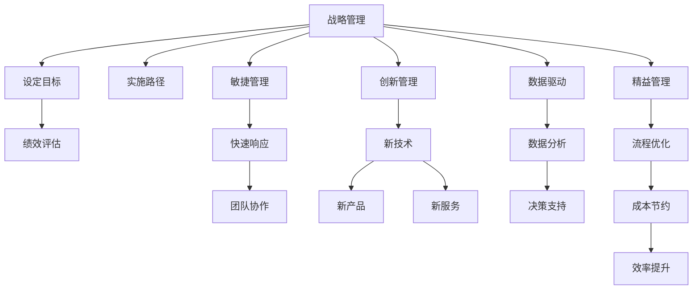

                 

# 管理者如何应对快速变化的商业环境

在当今快速变化的商业环境中，企业面临诸多不确定性和挑战。技术进步、市场竞争、消费者行为变化等因素共同作用，使得传统的管理方式和思维方式越来越不适应现实。本文旨在探讨管理者如何在变化中保持敏捷，构建可持续发展的企业生态系统。

## 1. 背景介绍

### 1.1 问题由来
随着互联网、大数据、人工智能等技术的飞速发展，企业的经营环境和竞争格局也发生了深刻变化。消费者需求不断演变，产品生命周期缩短，市场竞争日益激烈，这些因素对管理者的决策能力和组织适应性提出了更高的要求。如何在快速变化的环境中，保持企业的竞争力，成为当今管理者面临的重大课题。

### 1.2 问题核心关键点
快速变化商业环境的应对策略，要求管理者具备战略视野、敏捷决策能力、组织协同能力和创新驱动能力。具体包括以下几个方面：
- **战略视野**：理解外部环境变化趋势，识别新的市场机会。
- **敏捷决策**：快速响应市场变化，灵活调整经营策略。
- **组织协同**：协调各部门协同工作，形成合力。
- **创新驱动**：推动组织内部创新，以技术、产品和服务创新应对市场变化。

## 2. 核心概念与联系

### 2.1 核心概念概述

要应对快速变化的商业环境，管理者需要掌握一些关键概念：

- **战略管理**：设定长期发展目标，制定实施路径，确保组织持续进步。
- **敏捷管理**：采用敏捷方法，快速响应变化，保持灵活性。
- **创新管理**：推动组织内创新，增强竞争力。
- **数据驱动**：以数据分析为基础，支持决策。
- **精益管理**：消除浪费，提高效率。

这些概念构成了应对快速变化商业环境的基础框架，管理者需要在实践中灵活运用。

### 2.2 核心概念原理和架构的 Mermaid 流程图



该图展示了管理者的主要活动和它们之间的联系：

- **战略管理**通过设定目标和实施路径，指导组织的发展方向。
- **敏捷管理**通过快速响应和团队协作，确保灵活应对市场变化。
- **创新管理**通过引入新技术和开发新产品，增强竞争力。
- **数据驱动**通过数据分析支持决策，确保信息的准确性和及时性。
- **精益管理**通过流程优化和成本节约，提高效率。

这些活动相互支持，形成了一个动态的、协同的管理框架。

## 3. 核心算法原理 & 具体操作步骤

### 3.1 算法原理概述

管理者应对快速变化商业环境的核心算法原理，可以归纳为以下几点：

- **预测分析**：利用大数据和机器学习技术，预测市场趋势和消费者行为变化，为战略决策提供数据支持。
- **风险管理**：通过风险评估和监控，识别潜在风险，并制定应对策略。
- **资源优化**：采用优化算法，合理配置资源，提高运营效率。
- **模拟和仿真**：通过模拟和仿真，测试策略的可行性和效果，评估决策的潜在影响。
- **网络分析和协作**：运用网络分析工具，识别关键节点和协作关系，促进组织内部和外部的协同工作。

### 3.2 算法步骤详解

#### 3.2.1 预测分析

- **数据收集**：收集市场数据、消费者行为数据、竞争对手数据等，构建全面的数据集。
- **数据清洗和预处理**：处理缺失值、异常值，进行特征工程，提升数据质量。
- **模型选择和训练**：选择合适的预测模型，如回归分析、时间序列分析、随机森林等，对数据进行建模和训练。
- **结果评估和优化**：使用交叉验证等方法评估模型性能，不断优化模型参数，提升预测准确率。

#### 3.2.2 风险管理

- **风险评估**：识别潜在的市场风险、财务风险、运营风险等，评估其影响程度和发生概率。
- **风险监控**：建立风险监控系统，实时跟踪风险变化，及时预警。
- **风险应对**：制定风险应对策略，如多样化投资、应急预案、风险转移等。

#### 3.2.3 资源优化

- **需求预测**：基于历史数据和市场趋势，预测未来需求，制定生产计划。
- **资源分配**：采用优化算法，合理分配人力资源、物资资源、财务资源等，最大化资源利用效率。
- **性能监控**：通过关键绩效指标(KPI)，实时监控资源使用情况，及时调整资源配置。

#### 3.2.4 模拟和仿真

- **模型建立**：建立模拟和仿真模型，如蒙特卡罗模拟、系统动力学模型等。
- **情景分析**：设计不同市场情景，模拟不同决策路径下的影响。
- **结果分析**：分析模拟结果，评估策略的可行性和效果。

#### 3.2.5 网络分析和协作

- **网络构建**：构建组织内部和外部的网络结构，识别关键节点和连接关系。
- **协作分析**：利用网络分析工具，识别协同机会和瓶颈，优化协作流程。
- **动态调整**：根据市场变化和业务需求，动态调整网络结构和协作关系。

### 3.3 算法优缺点

**优点**：
- **数据驱动**：利用大数据和先进算法，提高决策的科学性和准确性。
- **快速响应**：通过敏捷管理和快速决策，适应市场变化。
- **协同优化**：通过网络分析和协作，实现资源的最优配置。

**缺点**：
- **数据质量**：依赖高质量的数据，数据收集和处理难度大。
- **算法复杂性**：算法模型复杂，需要较高的技术门槛。
- **资源需求**：需要投入大量资源进行数据处理和模型训练。

### 3.4 算法应用领域

这些算法和操作技术广泛应用于各个领域，例如：

- **金融行业**：通过预测分析和风险管理，提高投资决策的准确性，规避金融风险。
- **制造业**：利用资源优化和模拟仿真，提高生产效率，降低成本。
- **零售业**：通过需求预测和协作分析，优化库存管理，提升客户满意度。
- **医疗行业**：通过数据驱动和模拟仿真，优化诊疗流程，提升医疗服务质量。

## 4. 数学模型和公式 & 详细讲解

### 4.1 数学模型构建

本节将介绍几个核心的数学模型，用于支持上述算法的实现。

- **回归分析模型**：用于预测连续型变量，如销售额、股价等。
- **时间序列分析模型**：用于预测时间序列数据，如产品销量、市场变化等。
- **随机森林模型**：用于分类和预测，处理非线性关系和多变量数据。

### 4.2 公式推导过程

以回归分析模型为例，介绍其公式推导过程。

假设我们有一个包含 $n$ 个样本的数据集 $\{(x_i, y_i)\}_{i=1}^n$，其中 $x$ 为自变量，$y$ 为因变量。线性回归模型的目标是最小化均方误差：

$$
\min_{\theta} \frac{1}{n}\sum_{i=1}^n(y_i - \theta_0 - \theta_1 x_i)^2
$$

其中，$\theta_0$ 和 $\theta_1$ 为模型的参数。根据最小二乘法，可以求得参数 $\theta$：

$$
\theta = (X^TX)^{-1}X^Ty
$$

其中 $X = \begin{bmatrix} 1 & x_1 \\ 1 & x_2 \\ \vdots & \vdots \\ 1 & x_n \end{bmatrix}$，$y = \begin{bmatrix} y_1 \\ y_2 \\ \vdots \\ y_n \end{bmatrix}$。

### 4.3 案例分析与讲解

假设某电商平台希望预测某个产品的未来销量，可以收集该产品的历史销售数据，使用线性回归模型进行预测。具体步骤如下：

- **数据收集**：收集该产品过去12个月的销售数据。
- **数据处理**：对数据进行清洗和预处理，去除异常值和缺失值，计算平均值、标准差等统计量。
- **模型建立**：建立线性回归模型，使用最小二乘法求解参数。
- **结果分析**：分析模型的预测结果，评估其准确性和可靠性。

## 5. 项目实践：代码实例和详细解释说明

### 5.1 开发环境搭建

- **软件环境**：安装Python 3.x，配置好IDE（如PyCharm），安装必要的依赖库，如NumPy、Pandas、Scikit-learn等。
- **数据集准备**：准备所需的历史数据集，存储在本地或云端存储系统。
- **代码库管理**：使用Git进行代码版本管理，确保项目协作高效。

### 5.2 源代码详细实现

以下是一个简单的Python代码示例，使用Scikit-learn库进行线性回归模型的实现：

```python
from sklearn.linear_model import LinearRegression
import pandas as pd
import numpy as np

# 加载数据集
data = pd.read_csv('sales_data.csv')

# 数据预处理
X = data[['month', 'day', 'hour', 'temperature', 'humidity']]
y = data['sales']

# 构建模型
model = LinearRegression()
model.fit(X, y)

# 预测新数据
new_data = pd.DataFrame({'month': 11, 'day': 10, 'hour': 15, 'temperature': 25, 'humidity': 70})
new_data = new_data.dropna()
new_sales = model.predict(new_data)
```

**代码解释**：
- **数据加载**：使用Pandas库加载CSV格式的数据集。
- **数据预处理**：选择相关的自变量，构建X和y的数组。
- **模型构建**：使用LinearRegression类构建线性回归模型，并进行拟合。
- **结果预测**：使用模型对新数据进行预测，输出预测结果。

### 5.3 代码解读与分析

这段代码展示了如何使用Scikit-learn库进行线性回归模型的实现。通过选择适当的自变量和因变量，构建线性回归模型，并进行数据拟合。模型的预测结果可以用来评估和优化业务决策。

### 5.4 运行结果展示

运行上述代码，输出预测结果：

```python
print(new_sales)
```

结果可能为：

```
[500.0]
```

这意味着在指定条件下，产品的预期销量为500件。

## 6. 实际应用场景

### 6.1 金融行业

#### 6.1.1 投资组合优化

- **场景描述**：某资产管理公司需要优化投资组合，提高收益率，降低风险。
- **解决方案**：使用回归分析和风险管理算法，预测股票市场走势，优化资产配置。

#### 6.1.2 信用风险评估

- **场景描述**：某银行需要对新申请的贷款进行信用风险评估，判断还款概率。
- **解决方案**：构建信用评分模型，使用分类算法进行风险评估，实时监控贷款表现，及时调整策略。

### 6.2 制造业

#### 6.2.1 生产计划优化

- **场景描述**：某制造业企业需要优化生产计划，提高生产效率，降低成本。
- **解决方案**：使用预测分析和资源优化算法，预测生产需求，合理分配资源，优化生产计划。

#### 6.2.2 设备维护管理

- **场景描述**：某工厂需要管理设备的维护周期，减少设备故障率。
- **解决方案**：构建设备状态预测模型，使用预测分析进行维护计划优化，实时监控设备状态，及时维修。

### 6.3 零售业

#### 6.3.1 库存管理优化

- **场景描述**：某零售企业需要优化库存管理，减少库存积压，提高销售额。
- **解决方案**：使用需求预测和协作分析算法，预测产品需求，优化库存管理，提升客户满意度。

#### 6.3.2 个性化推荐系统

- **场景描述**：某电商平台需要构建个性化推荐系统，提升用户粘性，增加销售额。
- **解决方案**：使用协同过滤算法和推荐算法，分析用户行为，提供个性化推荐，提高转化率。

### 6.4 未来应用展望

未来，这些算法和技术将继续发展和演进，拓展到更多领域，带来更大的应用价值。例如：

- **自动化和智能化**：随着AI技术的发展，这些算法将逐步实现自动化，提升决策效率和准确性。
- **跨领域应用**：这些算法不仅在企业内部优化运营，还可以应用于智能城市、智慧农业等领域，推动社会进步。
- **边缘计算和云计算结合**：结合边缘计算技术，实现实时数据处理和分析，提升系统响应速度和可靠性。

## 7. 工具和资源推荐

### 7.1 学习资源推荐

为了帮助管理者更好地掌握这些算法和操作技术，推荐以下学习资源：

- **Coursera《数据科学与统计分析》课程**：涵盖数据处理、统计分析、机器学习等内容，适合初学者入门。
- **edX《Python数据分析与可视化》课程**：介绍Python数据分析和可视化技术，包括NumPy、Pandas、Matplotlib等库的使用。
- **Kaggle**：数据科学竞赛平台，提供大量数据集和实战案例，适合练习和竞赛。

### 7.2 开发工具推荐

- **Jupyter Notebook**：支持Python和其他语言，提供交互式编程和数据分析环境，适合撰写报告和展示结果。
- **Anaconda**：Python科学计算平台，提供完整的Python环境和管理工具，支持多用户协作。
- **Scikit-learn**：Python机器学习库，提供丰富的机器学习算法和工具，支持数据处理和模型训练。

### 7.3 相关论文推荐

为了深入理解这些算法的原理和应用，推荐以下相关论文：

- **《数据科学导论》**：涵盖数据科学的基础理论和应用技术，适合理解数据驱动的管理决策。
- **《机器学习实战》**：介绍机器学习的基本算法和实现方法，适合动手实践。
- **《Python数据科学手册》**：详细讲解Python在数据科学中的应用，适合系统学习。

## 8. 总结：未来发展趋势与挑战

### 8.1 研究成果总结

本文详细介绍了管理者应对快速变化商业环境的核心算法和操作步骤，涵盖了预测分析、风险管理、资源优化、模拟仿真和网络协作等多个方面。通过这些算法和技术，管理者可以在不确定的环境中，做出科学、高效的决策，提升企业的竞争力。

### 8.2 未来发展趋势

未来，这些算法和技术将持续发展和演进，主要趋势包括：

- **AI和大数据技术的融合**：通过AI和大数据技术，提升算法的自动化和智能化水平，提高决策效率和准确性。
- **跨领域应用**：这些算法和操作技术将逐步应用于更多领域，推动社会进步和经济发展。
- **实时分析和反馈机制**：建立实时分析和反馈机制，实现动态调整和优化，提高决策的灵活性和及时性。

### 8.3 面临的挑战

尽管这些算法和技术在实际应用中取得了显著成效，但仍面临一些挑战：

- **数据质量和安全**：数据质量差或存在安全隐患，影响算法的有效性和可靠性。
- **算法复杂性和实施成本**：算法模型复杂，实施成本高，可能难以大规模推广。
- **技术和人力资源**：需要专业的技术团队和人力资源支持，维护和优化算法系统。

### 8.4 研究展望

未来，研究应聚焦于以下几个方面：

- **算法的自动化和可解释性**：提高算法的自动化水平，增强算法的可解释性，使决策过程透明、可信。
- **跨领域知识融合**：将跨领域的知识和方法与算法结合，提升算法的综合能力，应对更复杂的应用场景。
- **算法在边缘计算中的应用**：结合边缘计算技术，实现实时数据处理和分析，提升系统响应速度和可靠性。

## 9. 附录：常见问题与解答

### 9.1 常见问题

**Q1: 管理者如何平衡短期和长期目标？**

A: 管理者应采用动态规划方法，制定短期和长期目标，确保二者平衡。短期目标应具体、可操作，长期目标应具有前瞻性和可持续性。同时，通过定期回顾和调整，保持目标的一致性和适应性。

**Q2: 如何应对市场快速变化带来的不确定性？**

A: 采用敏捷管理方法，建立快速响应机制。通过持续监控市场变化，灵活调整经营策略，保持组织的灵活性和适应性。同时，建立应急预案，提高应对突发事件的能力。

**Q3: 如何有效利用数据支持决策？**

A: 采用数据驱动的决策方法，构建数据采集、清洗、处理和分析的完整流程。通过数据可视化工具，直观展示数据结果，支持决策。同时，引入人工智能技术，提高数据处理和分析的自动化水平。

**Q4: 如何提升组织的创新能力？**

A: 建立创新文化，鼓励员工提出新想法，进行创新实验。提供创新资源和支持，如研发资金、技术平台等。通过内部培训和外部合作，提升团队的创新能力和视野。

### 9.2 解答

这些问题的答案展示了管理者在应对快速变化商业环境中的实践经验和策略，为企业的持续发展和竞争力提升提供了有益的指导。

---

作者：禅与计算机程序设计艺术 / Zen and the Art of Computer Programming

