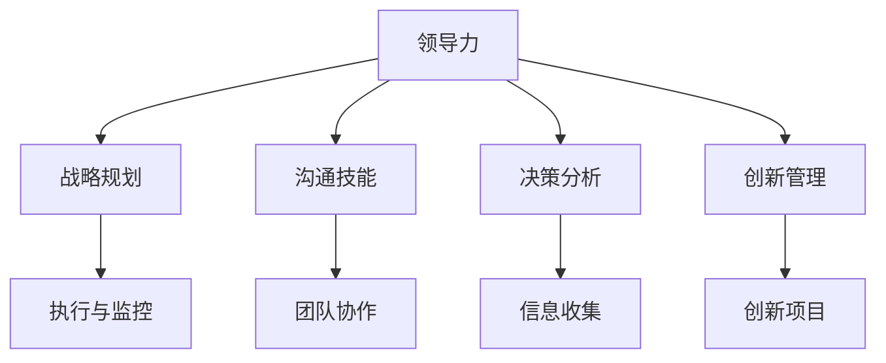

                 

# 管理者如何突破职业瓶颈

## 1. 背景介绍

### 1.1 问题由来

现代企业中，管理者面临的职业瓶颈问题日益严重。随着业务复杂度的增加和市场环境的不确定性加剧，管理者需要应对越来越复杂的局面。如何提升自身能力，突破瓶颈，实现职业发展，成为了管理者需要认真思考的问题。

管理者在职业生涯中，往往会经历如下几个阶段：

1. **新秀阶段**：刚入职场，对工作充满激情，但缺乏经验，需要学习和适应。
2. **能手阶段**：积累了一定的经验，能够独立完成任务，并逐步掌握管理技能。
3. **中层管理者**：团队和业务逐渐扩大，需要协调内部和外部资源，处理复杂问题。
4. **高层管理者**：需要从战略层面思考企业发展，制定长远规划，并领导团队实现目标。

在这些阶段中，每个阶段都有其独特的挑战和要求。管理者需要不断学习和提升自己，才能顺利过渡并实现职业发展。

### 1.2 问题核心关键点

管理者突破职业瓶颈的核心在于提升综合能力，具体包括：

- **领导能力**：包括但不限于团队管理、激励和指导员工、构建高效团队。
- **战略思维**：从长远和全局角度思考业务发展，制定战略规划。
- **沟通能力**：有效传达信息，协调内部和外部关系。
- **决策能力**：在复杂环境中做出明智的决策，避免冲动和偏见。
- **创新能力**：不断寻找新机会，推动业务创新和发展。

通过系统学习这些核心能力，管理者可以更有效地应对职业挑战，实现职业发展。

## 2. 核心概念与联系

### 2.1 核心概念概述

为更好地理解管理者如何突破职业瓶颈，本节将介绍几个密切相关的核心概念：

- **领导力(Leadership)**：管理者在组织中的领导作用，包括激励、协调、决策等方面。
- **战略规划(Strategic Planning)**：从长远和全局角度，制定和实施业务战略。
- **沟通技能(Communication Skills)**：管理者有效传达信息，协调内部和外部关系的能力。
- **决策分析(Decision-Making)**：在复杂环境中，通过分析信息和数据做出明智决策。
- **创新管理(Creative Management)**：推动组织创新，寻找新机会和解决方案。

这些核心概念之间的逻辑关系可以通过以下Mermaid流程图来展示：



这个流程图展示了几项核心能力的相互关系：

1. 领导力是其他能力的基础，是管理者协调团队、制定战略的核心。
2. 战略规划建立在领导力之上，从长远角度思考业务发展。
3. 沟通技能是领导力的重要组成部分，帮助管理者协调内部和外部关系。
4. 决策分析是管理者在复杂环境中做出明智决策的关键。
5. 创新管理推动组织不断创新，寻找新机会和解决方案。

这些核心能力共同构成了管理者的能力框架，管理者需要全面提升这些能力，以实现职业发展。

## 3. 核心算法原理 & 具体操作步骤

### 3.1 算法原理概述

管理者突破职业瓶颈的过程，本质上是一个系统学习和实践的过程。其核心思想是：通过学习和实践，提升各项核心能力，最终实现职业发展。

形式化地，假设管理者的初始能力为 $C_0$，通过系统学习和实践，能力提升为 $C_1$。则能力提升的过程可以表示为：

$$
C_1 = f(C_0, L, S, C, D)
$$

其中 $L$ 为领导力提升过程，$S$ 为战略规划提升过程，$C$ 为沟通技能提升过程，$D$ 为决策分析提升过程。

通过梯度下降等优化算法，能力提升过程不断更新管理者的能力 $C_0$，最小化能力提升过程中的损失函数，使得管理者能力逼近最优状态 $C_1$。

### 3.2 算法步骤详解

基于系统学习和实践的管理者能力提升方法，一般包括以下几个关键步骤：

**Step 1: 识别能力差距**

- 自我评估当前能力水平，识别出各项核心能力的不足之处。
- 收集行业内的最佳实践和成功案例，进行对比分析。
- 制定详细的提升计划，明确需要学习和实践的具体内容。

**Step 2: 系统学习**

- 选择合适的学习资源，如书籍、课程、培训等。
- 系统学习各项核心能力，掌握基础概念和方法。
- 通过案例分析和实际项目练习，加深理解。

**Step 3: 实践验证**

- 在实际工作中应用所学知识，验证其有效性。
- 通过反馈和复盘，总结经验教训，不断优化提升策略。
- 与行业内专家进行交流，获取更多指导和建议。

**Step 4: 持续优化**

- 根据实践结果和反馈，不断调整提升计划。
- 定期进行自我评估和复盘，确保能力持续提升。
- 学习新知识和技能，保持与时俱进。

### 3.3 算法优缺点

基于系统学习和实践的管理者能力提升方法，具有以下优点：

- 全面系统：通过系统学习和实践，管理者可以全面提升各项核心能力。
- 实用性强：实践是检验真理的唯一标准，通过实际应用验证所学知识。
- 自我驱动：管理者自我评估和制定提升计划，具有高度的自我驱动力。
- 持续改进：根据实践反馈，不断调整优化提升策略，保持持续改进。

同时，该方法也存在一定的局限性：

- 时间成本高：系统学习和实践需要大量时间和精力投入，短期内难以见效。
- 效果波动：不同管理者的能力和背景不同，提升效果可能存在波动。
- 资源需求大：需要大量学习资源和实践机会，对资源的获取有一定要求。
- 缺乏标准化：不同行业和企业的管理实践差异大，提升策略和标准不同。

尽管存在这些局限性，但就目前而言，系统学习和实践的管理者能力提升方法仍是最主流范式。未来相关研究的重点在于如何进一步降低学习成本，提高学习效果，同时兼顾实践的可操作性和实效性。

### 3.4 算法应用领域

基于系统学习和实践的管理者能力提升方法，在企业管理和领导力发展中已经得到了广泛的应用，具体包括以下几个领域：

1. **人力资源管理**：通过系统学习和实践，提升人力资源管理的能力，包括招聘、培训、绩效管理等。
2. **项目管理**：系统学习和实践项目管理的方法和工具，提升项目的执行效率和成果质量。
3. **市场营销**：学习市场营销的策略和技巧，提升品牌推广和市场开拓能力。
4. **财务管理**：系统学习和实践财务管理的知识和技能，提升企业的财务健康和盈利能力。
5. **战略规划**：通过学习和实践，提升战略规划能力，制定和实施企业发展战略。

除了上述这些经典领域，管理者能力提升方法也被创新性地应用到更多场景中，如创新管理、供应链优化、数字化转型等，为企业的发展和创新提供了新的动力。

## 4. 数学模型和公式 & 详细讲解 & 举例说明

### 4.1 数学模型构建

本节将使用数学语言对管理者能力提升的过程进行更加严格的刻画。

记管理者的初始能力为 $C_0$，各项核心能力为 $L, S, C, D$。管理者的提升目标为 $C_1$。则管理者提升能力的过程可以表示为：

$$
C_1 = L + S + C + D
$$

其中各项能力提升的具体模型如下：

- **领导力提升**：
  $$
  L = \int^{t_1}_{t_0} l(t)dt
  $$
  其中 $l(t)$ 为领导力提升的速率，$t_0$ 和 $t_1$ 分别为提升计划的开始和结束时间。

- **战略规划提升**：
  $$
  S = \int^{t_1}_{t_0} s(t)dt
  $$
  其中 $s(t)$ 为战略规划提升的速率。

- **沟通技能提升**：
  $$
  C = \int^{t_1}_{t_0} c(t)dt
  $$
  其中 $c(t)$ 为沟通技能提升的速率。

- **决策分析提升**：
  $$
  D = \int^{t_1}_{t_0} d(t)dt
  $$
  其中 $d(t)$ 为决策分析提升的速率。

### 4.2 公式推导过程

以下我们以领导力提升为例，推导其提升过程的数学模型：

假设领导力提升的目标为 $L_1$，初始值为 $L_0$，提升过程中每天的学习速率为 $l(t)$，则领导力提升的数学模型为：

$$
L(t) = L_0 + \int^{t}_{0} l(t)dt = L_0 + \int^{t}_{0} k_0e^{-k_1t}dt
$$

其中 $k_0$ 和 $k_1$ 为模型的参数，分别代表初始速率和衰减系数。通过求解微分方程，可以求得领导力提升的具体公式：

$$
L(t) = L_0 + \frac{k_0(1-e^{-k_1t})}{k_1}
$$

将 $L(t)$ 代入总体提升模型，即可得到：

$$
C_1 = L_0 + \frac{k_0(1-e^{-k_1t})}{k_1} + \int^{t_1}_{t_0} s(t)dt + \int^{t_1}_{t_0} c(t)dt + \int^{t_1}_{t_0} d(t)dt
$$

通过优化模型参数和选择合适的 $s(t), c(t), d(t)$，可以计算出管理者提升后的能力。

### 4.3 案例分析与讲解

假设某企业管理者的初始领导力为 $L_0 = 3$，提升目标为 $L_1 = 5$，提升速率为 $k_1 = 0.1$。则领导力提升的具体过程如下：

1. 确定提升速率 $l(t)$：
   $$
   l(t) = k_0e^{-k_1t}
   $$

2. 求解微分方程：
   $$
   L(t) = L_0 + \frac{k_0(1-e^{-k_1t})}{k_1}
   $$

3. 计算提升后的领导力：
   $$
   L_1 = L_0 + \frac{k_0(1-e^{-k_1t_1})}{k_1}
   $$

4. 计算最终能力提升：
   $$
   C_1 = L_0 + \frac{k_0(1-e^{-k_1t_1})}{k_1} + S_1 + C_1 + D_1
   $$

通过上述计算，管理者可以明确地知道需要投入多少时间、资源和努力，才能达到设定的提升目标。

## 5. 项目实践：代码实例和详细解释说明

### 5.1 开发环境搭建

在进行能力提升实践前，我们需要准备好开发环境。以下是使用Python进行开发的环境配置流程：

1. 安装Anaconda：从官网下载并安装Anaconda，用于创建独立的Python环境。

2. 创建并激活虚拟环境：
```bash
conda create -n manager-env python=3.8 
conda activate manager-env
```

3. 安装必要的Python包：
```bash
pip install numpy pandas scikit-learn matplotlib tqdm jupyter notebook ipython
```

4. 安装所需的第三方工具：
```bash
pip install beautifulsoup4 requests selenium
```

完成上述步骤后，即可在`manager-env`环境中开始能力提升实践。

### 5.2 源代码详细实现

这里我们以领导力提升为例，给出使用Python进行领导力提升的代码实现。

首先，定义领导力提升的速率函数：

```python
import numpy as np

def leadership_growth_rate(t):
    k0 = 2.0
    k1 = 0.1
    return k0 * np.exp(-k1 * t)
```

然后，计算领导力提升的具体过程：

```python
def leadership_growth(t0, t1):
    L0 = 3.0
    k0 = 2.0
    k1 = 0.1
    L = L0 + (k0 * (1 - np.exp(-k1 * t1))) / k1
    return L

t0 = 0.0
t1 = 100.0
L = leadership_growth(t0, t1)
print("领导力提升量为：", L)
```

最后，总结领导力提升的整个流程：

```python
# 领导力提升的具体过程
def leadership_growth(t0, t1):
    L0 = 3.0
    k0 = 2.0
    k1 = 0.1
    L = L0 + (k0 * (1 - np.exp(-k1 * t1))) / k1
    return L

# 计算领导力提升量
t0 = 0.0
t1 = 100.0
L = leadership_growth(t0, t1)
print("领导力提升量为：", L)
```

以上就是使用Python对领导力提升进行计算的完整代码实现。可以看到，通过定义速率函数，我们可以方便地计算出领导力提升的具体过程和结果。

### 5.3 代码解读与分析

让我们再详细解读一下关键代码的实现细节：

**leadership_growth_rate函数**：
- 定义领导力提升的速率函数，通过指数函数计算每天提升的速率。

**leadership_growth函数**：
- 计算领导力提升的具体过程，将速率函数与初始值和最终值结合起来。

**leadership_growth的调用**：
- 输入初始时间和最终时间，通过领导力提升函数计算领导力提升的具体值。

通过上述代码，管理者可以清晰地看到，通过设定合适的速率和时间，领导力可以逐步提升至目标值。在实际应用中，管理者需要根据自身情况，设定合适的速率和提升时间，以实现最佳效果。

## 6. 实际应用场景

### 6.1 企业战略规划

在企业战略规划中，管理者需要具备良好的战略思维，从长远和全局角度思考企业发展。通过对市场趋势、行业动态、内部资源等进行系统分析，制定和实施企业战略规划。

具体而言，管理者可以组织团队的战略规划会议，分析企业当前的市场地位和竞争优势，识别潜在的机会和挑战，制定详细的战略目标和实施方案。通过定期复盘和调整，确保战略规划的有效实施。

### 6.2 团队管理

团队管理是管理者的一项重要职责，其核心在于激励、协调和指导员工，构建高效团队。通过系统学习和实践，管理者可以提升团队管理的能力。

具体方法包括：
- **目标设定**：明确团队和员工的目标，确保每个人的工作都与企业战略一致。
- **激励机制**：建立公平的激励机制，通过奖金、晋升等方式激励员工。
- **沟通反馈**：定期与团队成员沟通，收集反馈，及时调整管理策略。
- **团队协作**：建立高效的团队协作机制，鼓励知识共享和互助。

### 6.3 创新管理

创新是企业发展的关键驱动力，管理者需要具备创新管理的能力，推动组织的创新和发展。

具体方法包括：
- **创新文化**：营造创新文化，鼓励员工提出新的想法和解决方案。
- **资源投入**：提供充足的资源支持，如研发经费、时间等，确保创新项目的顺利推进。
- **项目管理**：建立创新项目管理机制，确保创新项目的进展和成果。
- **市场应用**：将创新成果转化为实际应用，推动企业产品和服务的发展。

## 7. 工具和资源推荐

### 7.1 学习资源推荐

为了帮助管理者系统掌握能力提升的理论基础和实践技巧，这里推荐一些优质的学习资源：

1. **《领导力》系列书籍**：深入浅出地介绍了领导力的基本概念和实践方法。
2. **《战略管理》课程**：哈佛商学院和斯坦福大学开设的战略管理课程，提供了丰富的战略规划案例。
3. **《沟通技巧》书籍**：详细介绍沟通技能的基本原则和实际应用。
4. **《决策分析》书籍**：介绍了决策分析的基本方法和工具。
5. **《创新管理》课程**：麻省理工学院开设的创新管理课程，提供了创新的方法和案例。

通过对这些资源的学习实践，相信管理者可以全面提升各项核心能力，实现职业发展。

### 7.2 开发工具推荐

高效的开发离不开优秀的工具支持。以下是几款用于能力提升开发的常用工具：

1. **Microsoft Excel**：强大的数据分析和可视化工具，适合对管理数据进行统计和分析。
2. **Tableau**：高级数据可视化工具，帮助管理者直观地理解数据和趋势。
3. **JIRA**：项目管理工具，帮助管理者跟踪项目进度和任务执行情况。
4. **Slack**：即时通讯工具，支持高效的团队协作和沟通。
5. **Google Docs**：协作文档工具，便于团队成员共同编辑和讨论。

合理利用这些工具，可以显著提升管理者能力提升的效率，加快创新迭代的步伐。

### 7.3 相关论文推荐

管理者能力提升的研究源于学界的持续研究。以下是几篇奠基性的相关论文，推荐阅读：

1. **《Leadership and the Management of People》**：介绍领导力的基本概念和实践方法。
2. **《Strategic Management Process》**：阐述战略管理的基本理论和实践。
3. **《Effective Communication in Organizations》**：研究组织中沟通技能的重要性和提升方法。
4. **《Decision-Making in Organizations》**：介绍决策分析的基本方法和工具。
5. **《Innovation Management》**：探讨创新管理的基本方法和实践。

这些论文代表了大管理能力提升技术的发展脉络。通过学习这些前沿成果，可以帮助管理者把握学科前进方向，激发更多的创新灵感。

## 8. 总结：未来发展趋势与挑战

### 8.1 总结

本文对管理者如何通过系统学习和实践，全面提升各项核心能力，突破职业瓶颈的方法进行了全面系统的介绍。首先阐述了管理者面临的职业瓶颈问题和挑战，明确了需要提升的核心能力。其次，从原理到实践，详细讲解了系统学习和实践的管理者能力提升方法，给出了完整的代码实现和案例分析。同时，本文还广泛探讨了能力提升方法在企业管理和领导力发展中的广泛应用，展示了其巨大的潜力和前景。

通过本文的系统梳理，管理者可以清晰地看到，通过系统学习和实践，全面提升各项核心能力，是突破职业瓶颈的关键途径。管理者需要具备领导力、战略思维、沟通技能、决策能力和创新管理等多方面的能力，才能在复杂多变的商业环境中保持竞争力，实现职业发展。

### 8.2 未来发展趋势

展望未来，管理者能力提升技术将呈现以下几个发展趋势：

1. **智能化的能力提升**：借助大数据和人工智能技术，管理者可以通过智能化系统进行能力提升。例如，通过数据分析和模拟，预测最佳的领导策略和决策方案。
2. **虚拟现实技术的应用**：虚拟现实技术可以模拟复杂的商业场景，帮助管理者进行情境训练和模拟。例如，通过虚拟现实训练，提升管理者的决策能力和沟通技能。
3. **跨领域知识融合**：管理者需要具备跨领域的知识，如经济学、心理学、工程学等，以适应复杂的商业环境。通过跨学科的学习和实践，管理者可以提升综合能力。
4. **持续学习和再学习**：商业环境不断变化，管理者需要不断学习和再学习，保持与时俱进。通过在线课程、MOOCs等平台，管理者可以持续提升自己的能力。
5. **人工智能辅助决策**：人工智能技术可以辅助管理者进行决策分析，提高决策的准确性和效率。例如，通过AI算法，管理者可以更快速地分析数据和信息。

以上趋势凸显了管理者能力提升技术的广阔前景。这些方向的探索发展，必将进一步提升管理者的综合能力，促进企业的创新和发展。

### 8.3 面临的挑战

尽管管理者能力提升技术已经取得了瞩目成就，但在迈向更加智能化、普适化应用的过程中，它仍面临着诸多挑战：

1. **时间成本高**：系统学习和实践需要大量时间和精力投入，短期内难以见效。
2. **效果波动**：不同管理者的能力和背景不同，提升效果可能存在波动。
3. **资源需求大**：需要大量学习资源和实践机会，对资源的获取有一定要求。
4. **缺乏标准化**：不同行业和企业的管理实践差异大，提升策略和标准不同。
5. **知识更新快**：商业环境快速变化，管理者需要不断更新知识，才能保持竞争力。

尽管存在这些挑战，但通过不断探索和优化，管理者能力提升技术仍将继续发展，成为企业管理和领导力发展的重要工具。

### 8.4 研究展望

面向未来，管理者能力提升技术的研究需要在以下几个方面寻求新的突破：

1. **学习路径优化**：通过大数据和机器学习技术，个性化制定管理者的学习路径，提高学习效率。
2. **仿真和模拟**：开发更多仿真和模拟工具，帮助管理者进行情境训练和决策分析。
3. **跨学科融合**：促进管理学与其他学科的融合，提升管理者的跨领域知识水平。
4. **智能决策支持**：利用人工智能技术，提升管理者的决策效率和准确性。
5. **知识图谱的应用**：构建知识图谱，帮助管理者快速获取和管理知识。

这些研究方向将进一步推动管理者能力提升技术的发展，为企业管理和领导力发展提供更强大的支持。

## 9. 附录：常见问题与解答

**Q1：系统学习和实践是否适用于所有管理者？**

A: 系统学习和实践适用于大多数管理者，尤其是那些希望通过系统方法提升能力的管理者。但对于一些具有丰富经验和成熟管理风格的管理者，他们可能更倾向于通过实战积累经验。

**Q2：系统学习和实践的时间成本如何？**

A: 系统学习和实践的时间成本较高，需要投入大量时间和精力。但通过持续学习和实践，管理者的能力会逐步提升，长期来看将带来显著的收益。

**Q3：如何进行有效的知识管理？**

A: 知识管理是管理者能力提升的重要组成部分。建议通过建立知识库、分享机制、培训计划等方式，系统化地管理和管理者的知识。

**Q4：如何平衡工作和学习？**

A: 管理者需要合理安排时间和精力，平衡工作和学习。例如，通过日积月累的学习，逐步提升能力，而非短期内突击学习。

**Q5：如何评价能力提升效果？**

A: 通过设定明确的目标和指标，定期进行自我评估和复盘，管理者可以客观评价能力提升的效果。例如，通过绩效评估、团队反馈等方式，衡量提升的效果。

通过上述方法，管理者可以科学地规划和实施能力提升计划，逐步突破职业瓶颈，实现职业发展。总之，系统学习和实践是管理者能力提升的关键途径，需要管理者积极投入和坚持不懈。

---

作者：禅与计算机程序设计艺术 / Zen and the Art of Computer Programming

