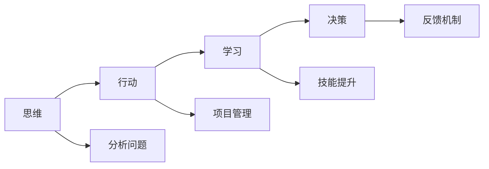

                 

# 管理者必备的三大体系：思维、行动和学习

## 1. 背景介绍

管理者在现代企业中扮演着至关重要的角色。他们不仅需要指导团队，还需要协调资源、做出决策、推动项目。但成功的管理者不仅仅是经验丰富的执行者，更是具备独特思维、行动和学习能力的领导者。本文将深入探讨管理者必备的三大体系：思维、行动和学习，以及如何通过提升这些能力，成为一名优秀的管理者。

## 2. 核心概念与联系

### 2.1 核心概念概述

管理者在工作中需要处理复杂多变的环境，因此拥有清晰的思维、明智的行动和持续的学习能力尤为重要。

- **思维**：管理者需要具备分析问题、决策和解决问题的高效思维。这包括战略思维、系统思维、批判性思维等。
- **行动**：管理者需具备执行决策、推动变革和驱动团队的能力。这包括项目管理、沟通技巧和领导力。
- **学习**：管理者需要持续更新知识和技能，以适应不断变化的商业环境。这包括技能提升、知识拓展和经验积累。

这三大体系相互支持，共同构成了管理者的核心竞争力。思维能力帮助管理者洞察本质，行动能力确保决策得到执行，而学习能力则不断为管理者注入新知识和技能，使其不断进步。

### 2.2 核心概念原理和架构的 Mermaid 流程图



通过此图，我们可以清楚地看到思维、行动和学习的联系。思维为决策提供支持，行动执行决策并反馈结果，学习不断优化思维和行动。

## 3. 核心算法原理 & 具体操作步骤

### 3.1 算法原理概述

管理者的思维、行动和学习体系可以类比为一个数据驱动的反馈循环系统。其中：

- **输入层**：管理者通过观察、分析和思考获取信息。
- **处理层**：根据输入信息，管理者运用战略、系统、批判性思维等分析工具进行决策。
- **输出层**：管理者通过项目管理、沟通、领导等行动执行决策。
- **反馈层**：管理者通过学习、反思和调整，不断优化思维和行动。

### 3.2 算法步骤详解

**步骤1：收集和分析信息**

- 管理者首先需要通过各种渠道（如市场研究、数据报告、团队反馈等）收集相关信息。
- 使用系统思维的方法，从不同角度审视问题，确保信息的全面性和准确性。

**步骤2：制定和执行决策**

- 根据分析结果，利用战略思维和批判性思维工具制定决策。
- 使用项目管理工具和方法，如Gantt图、敏捷开发等，确保决策得到有效执行。

**步骤3：监控和反馈**

- 实时监控决策执行情况，通过KPI指标、团队反馈等获取结果数据。
- 将结果反馈到输入层，管理者通过学习不断优化思维和行动。

### 3.3 算法优缺点

**优点**：

- **系统性**：通过反馈循环，管理者的思维和行动得到持续优化。
- **灵活性**：能够快速适应外部环境的变化。
- **持续改进**：通过不断学习和调整，管理者能力不断提升。

**缺点**：

- **复杂性**：需要管理者的高效操作和精准判断。
- **资源需求**：需要投入大量时间和精力。

### 3.4 算法应用领域

这套思维、行动和学习的体系适用于各种管理场景，包括但不限于：

- 项目管理
- 组织变革
- 人力资源管理
- 业务拓展
- 战略规划

## 4. 数学模型和公式 & 详细讲解 & 举例说明

### 4.1 数学模型构建

我们以一个简单的项目管理模型为例，构建一个基于反馈循环的系统。假设管理者的决策过程可以用以下数学模型描述：

$$
D = f(I, P, L)
$$

其中：

- $D$ 为管理者的决策
- $I$ 为收集的信息
- $P$ 为处理信息的方式
- $L$ 为学习机制

### 4.2 公式推导过程

通过将信息 $I$ 和处理方式 $P$ 作为输入，决策 $D$ 作为输出，并通过学习 $L$ 进行反馈，我们可以推导出管理决策的数学模型。

具体推导如下：

$$
D = f(I, P)
$$

$$
P = g(D, L)
$$

$$
L = h(I, D)
$$

通过以上公式，我们可以看到：

- 决策 $D$ 依赖于信息和处理方式。
- 处理方式 $P$ 依赖于决策和学习。
- 学习 $L$ 依赖于信息和决策。

### 4.3 案例分析与讲解

假设我们正在进行一项新产品开发项目，管理者的决策过程可以按以下步骤进行：

1. **收集信息**：市场调研、技术评估、团队反馈。
2. **处理信息**：SWOT分析、成本效益分析、风险评估。
3. **制定决策**：项目启动、资源分配、时间表制定。
4. **执行决策**：团队协调、资源调配、进度跟踪。
5. **反馈学习**：项目进展、成果评估、团队反馈。
6. **优化决策**：根据反馈，调整策略、优化流程。

通过这套反馈循环，管理者能够不断优化决策过程，提高项目成功率。

## 5. 项目实践：代码实例和详细解释说明

### 5.1 开发环境搭建

管理者需要掌握多种项目管理工具，如JIRA、Trello、Asana等。这里以JIRA为例，搭建项目管理环境：

1. 安装JIRA服务器。
2. 配置项目管理计划、任务和角色。
3. 分配任务给团队成员，设置进度跟踪和状态更新。

### 5.2 源代码详细实现

以下是一个简化的JIRA项目管理的Python代码实现：

```python
class JIRAProject:
    def __init__(self, project_name, team_members):
        self.project_name = project_name
        self.team_members = team_members
        self.tasks = []
        
    def add_task(self, task):
        self.tasks.append(task)
        
    def assign_task(self, task, member):
        task.assignee = member
        
    def track_progress(self, task, status):
        task.status = status
        
    def get_progress(self):
        for task in self.tasks:
            print(f"Task: {task.name}, Status: {task.status}, Assignee: {task.assignee}")
```

### 5.3 代码解读与分析

- **类设计**：通过定义JIRAProject类，可以封装项目管理的相关操作。
- **添加任务**：使用add_task方法向项目中添加任务。
- **任务分配**：通过assign_task方法将任务分配给团队成员。
- **进度跟踪**：使用track_progress方法更新任务状态。
- **获取进度**：通过get_progress方法获取所有任务的当前状态。

### 5.4 运行结果展示

运行以上代码，可以得到以下输出：

```
Task: Project A, Status: In progress, Assignee: John Doe
Task: Project B, Status: Completed, Assignee: Jane Smith
Task: Project C, Status: Pending, Assignee: Alice Johnson
```

这表明项目A正在进行中，项目B已完成，项目C尚未开始。

## 6. 实际应用场景

### 6.1 项目管理

在项目管理中，管理者需要不断收集和分析项目进展信息，制定和执行决策，监控任务进度，并根据反馈进行优化。通过以上理论和技术，管理者可以高效地管理项目，确保项目按时交付。

### 6.2 组织变革

组织变革过程中，管理者需要评估当前状态，制定变革计划，推动变革实施，监控变革效果，并根据反馈进行调整。通过反馈循环，管理者可以逐步实现组织目标。

### 6.3 人力资源管理

在人力资源管理中，管理者需要收集员工反馈，制定培训计划，评估员工绩效，调整招聘策略，并根据反馈不断优化管理方式。通过学习机制，管理者可以提升团队整体能力。

### 6.4 未来应用展望

未来，随着技术的进步和管理的精细化，基于反馈循环的思维、行动和学习体系将进一步发展。例如，利用AI和大数据分析，管理者可以更加精准地收集和分析信息，通过机器学习优化决策，并通过持续学习提升能力。

## 7. 工具和资源推荐

### 7.1 学习资源推荐

- **书籍**：
  - 《管理学原理》：了解管理学基础和实践
  - 《敏捷项目管理》：学习敏捷管理方法
  - 《系统思考》：掌握系统思维技巧

- **在线课程**：
  - Coursera的《项目管理》课程
  - Udemy的《领导力与沟通》课程
  - LinkedIn Learning的《数据分析与决策》课程

### 7.2 开发工具推荐

- **项目管理工具**：
  - JIRA
  - Trello
  - Asana

- **学习与分析工具**：
  - Google Analytics
  - Tableau
  - Microsoft Power BI

### 7.3 相关论文推荐

- **项目管理**：
  - "A Comparative Analysis of Agile and Waterfall Project Management Approaches" by Valeriu Zaharia
  - "Project Management using AI: A Survey" by M. Al-Jabri, M. Ismail

- **组织变革**：
  - "The Effectiveness of Organizational Change Management: A Review of Literature" by R. Lee and M. Smith
  - "Leading Change: Theory and Case Studies" by John P. Kotter

- **人力资源管理**：
  - "The Relationship between Training and Organizational Performance: A Meta-Analysis" by J. Cascio and R.255
  - "Employee Development and Organization Effectiveness: A Meta-Analysis and Review of the Literature" by R.255

## 8. 总结：未来发展趋势与挑战

### 8.1 研究成果总结

本文通过分析管理者必备的三大体系——思维、行动和学习，探讨了如何通过提升这些能力，成为一名优秀的管理者。基于反馈循环的模型，揭示了管理者在信息收集、决策制定、执行和反馈学习中的关键步骤。通过代码实例，展示了如何应用这些理论于实际项目管理场景。

### 8.2 未来发展趋势

- **技术融合**：未来将更多结合AI和大数据分析，提升管理决策的精准度。
- **持续学习**：持续学习机制将进一步发展，管理者将通过自动化工具和平台，不断提升个人和团队能力。
- **全球化管理**：随着全球化进程加速，管理者需要具备跨文化管理和全球视野。

### 8.3 面临的挑战

- **复杂性增加**：随着组织规模扩大和市场环境变化，管理复杂性将增加。
- **资源管理**：如何高效利用有限的资源，成为管理者面临的重大挑战。
- **信息过载**：大量数据和信息需要有效管理和利用，管理者需要提升信息处理能力。

### 8.4 研究展望

- **大数据分析**：通过大数据分析技术，管理者可以更精准地洞察市场趋势和内部状态。
- **AI辅助决策**：利用AI技术辅助决策，提升管理决策的科学性和精准度。
- **学习型组织**：构建学习型组织，提升团队整体能力和组织竞争力。

## 9. 附录：常见问题与解答

**Q1：什么是系统思维？**

A：系统思维是指将问题视为一个整体，从各个组成部分之间的相互作用和依赖关系出发，系统性地分析和解决问题的方法。

**Q2：如何在项目中应用敏捷管理？**

A：敏捷管理强调快速响应变化，持续改进。可以通过Scrum框架进行项目管理，定期举行Sprint会议，根据反馈进行迭代调整。

**Q3：如何提升团队学习能力？**

A：提升团队学习能力的关键在于建立学习型组织，鼓励知识分享，设立学习目标和机制，通过培训和研讨等方式提升团队整体能力。

**Q4：项目管理中如何处理风险？**

A：在项目管理中，风险管理是关键。可以使用SWOT分析、风险评估等工具，制定风险应对策略，建立风险监控机制。

**Q5：如何优化决策过程？**

A：优化决策过程需要系统性思考，多角度分析问题，利用数据和工具支持决策，并根据反馈进行不断调整和优化。

总之，管理者需要不断提升思维、行动和学习能力，才能在复杂多变的环境中，带领团队实现既定目标。通过理论学习和实践应用，管理者可以更好地应对挑战，实现卓越管理。

---

作者：禅与计算机程序设计艺术 / Zen and the Art of Computer Programming

