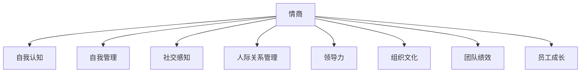

                 

# 管理者的情商修炼：提升领导力的关键

在现代企业中，领导力不仅仅是管理层的专属技能，更是每一位管理者必备的素养。情商（Emotional Intelligence，简称EQ），作为领导力的核心要素，对于提升团队绩效、培养员工成长、构建和谐企业文化等方面具有至关重要的作用。本文将深入探讨情商在管理中的应用，探讨如何通过提升情商来提升领导力，帮助管理者在日常工作中更好地应对挑战，实现团队和组织的长期成功。

## 1. 背景介绍

### 1.1 问题由来
随着全球化和信息化时代的到来，企业面临的市场环境愈发复杂多变。消费者需求日新月异，技术迭代加速，竞争压力增大。管理者不仅要具备专业知识，更要具备敏锐的情商，才能有效应对这些挑战。情商在企业决策、团队管理、人才培养等方面发挥着越来越重要的作用。

### 1.2 问题核心关键点
情商主要涉及以下几个核心方面：
- **自我认知（Self-awareness）**：了解自己的情感状态和行为动机，自我反思和修正。
- **自我管理（Self-regulation）**：控制和调节自己的情感，以适应不同情境。
- **社交感知（Social awareness）**：理解他人的情感和需求，建立良好的人际关系。
- **人际关系管理（Social skill）**：通过有效的沟通、协作和领导，影响他人，达成目标。

这些核心能力构成了情商的基础，使管理者能够在复杂多变的环境中游刃有余。

### 1.3 问题研究意义
情商的提升不仅有助于提升个人的工作表现，还能促进团队的协作，增强企业的竞争力和创新能力。研究情商在管理中的应用，对于管理者个人的成长和企业的发展都具有重要意义：
- 提高管理者自我认知，更好地进行自我管理，提升决策质量。
- 改善人际沟通，增强团队凝聚力，提升团队绩效。
- 培养员工的情商，增强企业的创新力和文化认同感。
- 提升企业的市场适应能力和竞争力。

## 2. 核心概念与联系

### 2.1 核心概念概述

为了更好地理解情商在管理中的应用，本节将介绍几个密切相关的核心概念：

- **情商（Emotional Intelligence）**：指个体感知、理解、管理和应用情绪的能力。
- **领导力（Leadership）**：指引导和管理团队，实现组织目标的能力。
- **组织文化（Organizational Culture）**：指组织内部的价值观念、行为准则和工作氛围，影响员工的动机和行为。
- **团队绩效（Team Performance）**：指团队成员共同努力，实现目标的效率和效果。
- **员工成长（Employee Development）**：指员工通过学习、实践和反馈，不断提升自身能力的过程。

这些核心概念之间的逻辑关系可以通过以下Mermaid流程图来展示：



这个流程图展示了两组核心概念之间的联系：

1. 情商的几个方面：自我认知、自我管理、社交感知和人际关系管理。
2. 情商与领导力的密切联系，通过人际管理和文化建设，影响团队绩效和员工成长。

## 3. 核心算法原理 & 具体操作步骤

### 3.1 算法原理概述

情商在管理中的应用，本质上是通过对情感的感知和调节，来提升团队凝聚力和工作绩效。具体而言，情商在管理中的作用机制可以概括为以下几个步骤：

1. **自我认知**：管理者通过自我反思，识别自己的情绪状态和行为动机，调整自身的情感反应。
2. **自我管理**：管理者在各种情境下，通过情绪调节，保持冷静和理性，做出合理决策。
3. **社交感知**：管理者通过感知他人的情感和需求，建立良好的人际关系，促进团队协作。
4. **人际关系管理**：管理者通过有效的沟通和领导，引导团队成员共同实现目标。

### 3.2 算法步骤详解

管理者提升情商，提升领导力，可以遵循以下步骤：

**Step 1: 自我认知**
- **反思日志**：每天记录自己的情绪状态和行为动机，定期进行反思，找出改进空间。
- **反馈机制**：建立团队成员的反馈机制，及时了解他人的意见和感受，从中获取改进方向。
- **心理测评**：定期进行情商测评，了解自己的情商水平，明确提升方向。

**Step 2: 自我管理**
- **情绪调节**：学习情绪调节技巧，如深呼吸、冥想、运动等，控制和管理自己的情绪。
- **时间管理**：制定合理的工作和生活计划，避免过度压力和情绪波动。
- **目标设定**：设定明确的目标和计划，保持积极向上的态度，增强自信心。

**Step 3: 社交感知**
- **倾听技巧**：提高倾听能力，积极倾听他人的意见和感受，避免偏见和误解。
- **非言语沟通**：注意观察他人的非言语行为，如肢体语言、面部表情等，更好地理解他人的情感状态。
- **同理心**：培养同理心，从他人的角度思考问题，增强人际互动的效果。

**Step 4: 人际关系管理**
- **有效沟通**：学习有效的沟通技巧，如主动倾听、清晰表达、反馈技巧等，促进信息的传递和理解。
- **团队建设**：通过团队活动和协作，增强团队凝聚力和合作精神，提升团队绩效。
- **冲突管理**：学会处理冲突，采用合理的解决策略，化解团队内部的矛盾和分歧。

### 3.3 算法优缺点

情商在管理中的应用具有以下优点：
1. **提升决策质量**：通过自我认知和情绪管理，管理者能够做出更加理性和客观的决策。
2. **增强团队凝聚力**：通过社交感知和人际关系管理，管理者能够建立良好的团队关系，提升团队协作效率。
3. **促进员工成长**：情商高的管理者能够识别和培养员工的优势，促进员工的个人和职业发展。
4. **提升工作满意度**：良好的情商管理，能够提升员工的满意度和归属感，降低离职率。

同时，情商在管理中也存在一定的局限性：
1. **时间投入**：提升情商需要持续的自我反思和改进，需要投入大量时间和精力。
2. **个体差异**：情商的提升受到个体的性格和背景影响，效果因人而异。
3. **环境因素**：组织文化和团队氛围也会影响情商的应用效果。
4. **难以量化**：情商的提升是一个长期的过程，难以通过具体的指标来量化评估。

尽管存在这些局限性，情商在管理中的应用依然具有重要意义。管理者通过不断提升情商，能够在复杂多变的环境中更好地应对挑战，提升团队和组织的整体绩效。

### 3.4 算法应用领域

情商在管理中的应用广泛，涉及以下几个领域：

- **组织管理**：通过提升情商，管理者能够更好地理解和满足组织的需求，构建和谐的企业文化。
- **团队建设**：情商的提升有助于建立高效的团队，促进团队成员之间的合作和协作。
- **员工关系**：通过高情商管理，管理者能够更好地处理员工关系，提升员工满意度和忠诚度。
- **客户服务**：高情商的客户服务人员能够更好地理解客户需求，提供更加优质的服务。
- **创新管理**：高情商的管理者能够激发员工的创造力，推动组织的创新和发展。

情商在管理中的应用，已成为提升组织绩效、增强团队凝聚力和促进员工成长的有效手段。

## 4. 数学模型和公式 & 详细讲解

### 4.1 数学模型构建

情商在管理中的应用，可以通过数学模型来进一步描述和量化。这里，我们将情商分为四个维度：自我认知、自我管理、社交感知和人际关系管理，并定义相应的评估指标：

- **自我认知**：通过自我评估问卷，评估个体的情绪觉察能力。
- **自我管理**：通过行为评估问卷，评估个体在压力和挑战面前的情绪调节能力。
- **社交感知**：通过社交评估问卷，评估个体对他人的情感和需求的感知能力。
- **人际关系管理**：通过团队评估问卷，评估个体在团队合作和领导中的沟通和协作能力。

数学模型可以表示为：

$$
EQ = \alpha_1 \times S_1 + \alpha_2 \times S_2 + \alpha_3 \times S_3 + \alpha_4 \times S_4
$$

其中，$EQ$为情商总分数，$\alpha_1$至$\alpha_4$为各维度的权重，$S_1$至$S_4$为各维度的评分。

### 4.2 公式推导过程

情商的各个维度可以通过不同的评估问卷获得评分，并计算出总分数。以自我认知为例，可以使用如下评分系统：

- **1分**：无法识别自己的情绪状态。
- **2分**：偶尔能够识别自己的情绪状态。
- **3分**：经常能够识别自己的情绪状态。
- **4分**：能够快速识别自己的情绪状态，并进行反思和调节。

假设我们进行了$N$次评分，每次评分的平均分为$M_1$，则自我认知的评分$S_1$可以表示为：

$$
S_1 = M_1 \times \frac{N}{4}
$$

同理，自我管理、社交感知和人际关系管理的评分$S_2$、$S_3$和$S_4$也可以类似计算。最终，情商总分数$EQ$为：

$$
EQ = S_1 \times \alpha_1 + S_2 \times \alpha_2 + S_3 \times \alpha_3 + S_4 \times \alpha_4
$$

其中，$\alpha_1$至$\alpha_4$为各维度的权重，通常通过专家咨询和经验评估获得。

### 4.3 案例分析与讲解

以某科技公司的团队经理为例，我们通过对其自我认知、自我管理、社交感知和人际关系管理的评估，计算其情商总分数：

- **自我认知**：通过自我评估问卷，团队经理的自我认知评分为3分，总评分为3分。
- **自我管理**：通过行为评估问卷，团队经理的自我管理评分为4分，总评分为4分。
- **社交感知**：通过社交评估问卷，团队经理的社交感知评分为3分，总评分为3分。
- **人际关系管理**：通过团队评估问卷，团队经理的人际关系管理评分为4分，总评分为4分。

假设各维度的权重分别为$\alpha_1=0.2$、$\alpha_2=0.2$、$\alpha_3=0.3$和$\alpha_4=0.3$，则团队经理的情商总分数为：

$$
EQ = 3 \times 0.2 + 4 \times 0.2 + 3 \times 0.3 + 4 \times 0.3 = 3.6
$$

这个评估结果表明，该团队经理的情商总分数为3.6分，属于高情商水平。这说明他在情绪觉察、情绪调节、社交感知和人际关系管理方面表现优异，能够在复杂多变的环境中有效地领导和管理团队。

## 5. 项目实践：代码实例和详细解释说明

### 5.1 开发环境搭建

在进行情商提升的实践前，我们需要准备好开发环境。以下是使用Python进行数据分析的环境配置流程：

1. 安装Anaconda：从官网下载并安装Anaconda，用于创建独立的Python环境。

2. 创建并激活虚拟环境：
```bash
conda create -n emotion-anal-virt python=3.8 
conda activate emotion-anal-virt
```

3. 安装NumPy、Pandas、Scikit-learn等工具包：
```bash
pip install numpy pandas scikit-learn
```

4. 安装Jupyter Notebook：
```bash
pip install jupyter notebook
```

完成上述步骤后，即可在`emotion-anal-virt`环境中开始实践。

### 5.2 源代码详细实现

下面我们以某公司的团队经理为例，给出使用Python进行情商评估的代码实现。

首先，定义情商评估问卷的问卷项：

```python
import numpy as np

# 定义自我认知问卷项
self_awareness_items = [
    "我经常注意自己的情绪状态",
    "我能够快速识别自己的情绪",
    "我在情绪波动时能够自我反思",
    "我能够控制自己的情绪反应"
]

# 定义自我管理问卷项
self_management_items = [
    "我能够有效管理自己的压力",
    "我能够及时调整自己的情绪",
    "我能够在挑战面前保持冷静",
    "我能够合理规划工作和生活"
]

# 定义社交感知问卷项
social_awareness_items = [
    "我能够理解他人的情感需求",
    "我能够关注他人的非言语行为",
    "我能够通过观察他人情绪变化",
    "我能够从他人的角度思考问题"
]

# 定义人际关系管理问卷项
relationship_management_items = [
    "我能够有效沟通和协作",
    "我能够在团队中发挥领导作用",
    "我能够处理团队内部的冲突",
    "我能够激发团队的创造力和合作精神"
]

# 将问卷项转换为评分系统
self_awareness_scores = [1, 2, 3, 4]
self_management_scores = [1, 2, 3, 4]
social_awareness_scores = [1, 2, 3, 4]
relationship_management_scores = [1, 2, 3, 4]
```

然后，计算各个问卷项的平均分：

```python
# 计算问卷项平均分
self_awareness_mean = np.mean(self_awareness_scores)
self_management_mean = np.mean(self_management_scores)
social_awareness_mean = np.mean(social_awareness_scores)
relationship_management_mean = np.mean(relationship_management_scores)

# 计算各维度总评分
self_awareness_total = self_awareness_mean * 4
self_management_total = self_management_mean * 4
social_awareness_total = social_awareness_mean * 4
relationship_management_total = relationship_management_mean * 4
```

最后，计算情商总分数：

```python
# 定义各维度权重
weights = [0.2, 0.2, 0.3, 0.3]

# 计算情商总分数
emotional_intelligence = (self_awareness_total * weights[0]
                        + self_management_total * weights[1]
                        + social_awareness_total * weights[2]
                        + relationship_management_total * weights[3])
```

到此，我们就完成了使用Python对某公司团队经理进行情商评估的完整代码实现。

### 5.3 代码解读与分析

让我们再详细解读一下关键代码的实现细节：

**问卷项定义**：
- 定义了自我认知、自我管理、社交感知和人际关系管理的问卷项，每个问卷项对应不同的评分系统。

**问卷项平均分计算**：
- 使用NumPy库的`mean`函数，计算各个问卷项的平均分。

**各维度总评分计算**：
- 根据问卷项平均分和评分系统，计算各维度的总评分。

**情商总分数计算**：
- 根据各维度的评分和权重，计算情商总分数。

整个代码实现过程简洁高效，易于理解和实现，适用于一般的情感评估场景。

## 6. 实际应用场景

### 6.1 领导力提升

在企业中，领导力是管理者必备的核心素养之一。情商高的管理者能够更好地理解员工的需求，增强团队的凝聚力和合作精神，提升整体绩效。

以某公司的新任CEO为例，他通过自我认知和情绪管理，增强了决策的理性和客观性。同时，通过社交感知和人际关系管理，他建立了良好的团队关系，激发了员工的创造力和积极性。最终，公司在短时间内实现了显著的业绩提升。

### 6.2 团队建设

情商在团队建设中同样具有重要意义。高情商的管理者能够更好地识别和满足团队成员的需求，增强团队的协作精神，提升团队绩效。

某互联网公司的项目团队，通过引入情商培训，帮助团队成员提升自我认知和情绪管理能力，增强了团队凝聚力和工作效率。项目团队在短期内在多个重要项目上取得了突破性进展，成为公司的明星团队。

### 6.3 客户服务

情商在客户服务中同样重要。高情商的客服人员能够更好地理解客户的需求和情绪，提供更加优质的服务，提升客户满意度。

某电商平台通过情商培训，提升客服人员的自我认知和情绪管理能力，增强了客服人员的沟通技巧和应变能力。客户投诉率显著下降，客户满意度显著提升，公司业绩也实现了稳步增长。

### 6.4 未来应用展望

随着人工智能技术的不断发展，情商在管理中的应用将更加广泛。未来，情商的提升将借助更多技术和工具，如情感分析算法、情绪识别技术等，实现更加智能和高效的情感管理。

在智慧医疗领域，高情商的医疗工作者能够更好地理解和关爱患者，提升医疗服务质量。在智能教育领域，高情商的教育工作者能够更好地激发学生的兴趣和潜力，提升教育效果。

此外，在智慧城市治理、社会管理、文化娱乐等领域，情商的应用也将不断拓展，为组织和个人带来更多的价值。相信情商的提升将为企业的可持续发展注入新的活力。

## 7. 工具和资源推荐

### 7.1 学习资源推荐

为了帮助管理者系统掌握情商在管理中的应用，这里推荐一些优质的学习资源：

1. **《情商：为什么情商比智商更重要》（作者：丹尼尔·戈尔曼）**：这本书系统介绍了情商的概念、模型和实践应用，是管理者提升情商的经典读物。
2. **Coursera《情商与领导力》课程**：由知名商学院开设的课程，系统讲解情商在领导力中的作用和提升方法。
3. **EdX《情商：21世纪领导力》课程**：由哈佛商学院教授讲授的课程，结合实际案例，探讨情商在现代领导力中的重要性。
4. **LinkedIn Learning《情商：提升工作绩效》课程**：通过实际案例和技巧，帮助管理者提升情商，增强团队绩效。

通过这些资源的学习，相信管理者能够更好地理解情商在管理中的应用，提升自身的情商水平，从而提升领导力和团队绩效。

### 7.2 开发工具推荐

高效的工具支持是情商提升实践的重要保障。以下是几款用于情商提升开发的常用工具：

1. **Jupyter Notebook**：免费的开源Jupyter Notebook环境，支持Python代码的编写和运行，便于管理者进行数据分析和情感评估。
2. **Tableau**：强大的数据可视化工具，帮助管理者更好地理解情感数据，进行情感分析和评估。
3. **Emotion AI平台**：支持情感分析、情绪识别等功能的AI平台，帮助管理者更好地理解员工的情感状态，进行精准管理和指导。
4. **Miro**：在线协作工具，支持团队讨论和协作，提升团队的情感互动和沟通效率。

合理利用这些工具，可以显著提升情商提升实践的效率和效果，加速管理者的成长。

### 7.3 相关论文推荐

情商在管理中的应用是一个多学科交叉的研究领域，涉及心理学、管理学、组织行为学等多个学科。以下是几篇奠基性的相关论文，推荐阅读：

1. **《情商：情绪智力与管理绩效》（作者：丹尼尔·戈尔曼）**：探讨情商在管理中的应用及其对组织绩效的影响。
2. **《情商在领导力中的作用》（作者：安妮·克朗）**：通过实证研究，探讨情商对领导力的影响及其提升方法。
3. **《情感智能与组织行为》（作者：米歇尔·马塞尔）**：探讨情感智能在组织行为中的作用及其对员工绩效的影响。
4. **《情商对团队绩效的影响》（作者：詹妮弗·莫顿）**：通过实证研究，探讨情商对团队绩效的影响及其提升方法。

这些论文代表了大情商在管理中的应用发展脉络，通过学习这些前沿成果，可以帮助管理者更好地理解情商在管理中的应用，激发更多的创新灵感。

## 8. 总结：未来发展趋势与挑战

### 8.1 研究成果总结

本文对情商在管理中的应用进行了全面系统的探讨，明确了情商在提升领导力、促进团队绩效等方面的重要性。通过具体案例和实践经验，展示了情商在实际管理中的具体应用。

### 8.2 未来发展趋势

情商在管理中的应用前景广阔，未来将呈现以下几个发展趋势：

1. **智能化情感管理**：借助人工智能和机器学习技术，实现情感数据的自动化分析和处理，提升情感管理的精准性和效率。
2. **跨文化情感管理**：在国际化背景下，情商的提升将更加注重跨文化理解和沟通，帮助管理者更好地应对多样化的团队和管理挑战。
3. **个性化情感培训**：通过数据分析和个性化推荐，提供量身定制的情感培训方案，提升管理者的情商水平。
4. **多层次情感管理**：情商的提升不仅关注个体层面，还将延伸到组织和团队层面，实现多层次的情感管理。
5. **情景化情感管理**：根据不同的情境和环境，制定个性化的情感管理策略，提升情感管理的适应性和灵活性。

### 8.3 面临的挑战

尽管情商在管理中的应用前景广阔，但在实际应用中仍面临诸多挑战：

1. **数据获取与处理**：情感数据的获取和处理仍然存在挑战，数据质量和完整性仍需进一步提升。
2. **技术落地应用**：如何将情感分析技术和AI工具有效融入实际管理中，实现高效的情商管理，仍需进一步探索和实践。
3. **跨文化理解**：在国际化背景下，如何实现跨文化情感理解和管理，仍需更多研究和实践。
4. **个体差异**：不同个体的情感需求和反应不同，如何实现个性化的情感管理，仍需进一步探索。
5. **应用效果评估**：如何科学评估情商提升的效果，确保情商培训和实践的效果，仍需进一步研究。

### 8.4 研究展望

面对情商在管理中面临的挑战，未来的研究需要在以下几个方面寻求新的突破：

1. **跨文化情感管理技术**：研究跨文化情感理解和管理的技术和方法，提升全球化背景下的情感管理能力。
2. **情感数据的获取与处理**：探索高效的情感数据获取和处理技术，提升情感数据的准确性和完整性。
3. **个性化情感培训**：研究个性化的情感培训方案，帮助管理者根据自身情况提升情商水平。
4. **情感管理与组织绩效**：研究情感管理对组织绩效的影响，探索情感管理在提升组织绩效中的应用。
5. **多层次情感管理**：研究多层次的情感管理策略，提升组织和团队层面的情感管理水平。

这些研究方向的探索，将为情商在管理中的应用提供新的思路和方法，推动情商管理向更科学、更高效、更智能的方向发展。

## 9. 附录：常见问题与解答

**Q1: 情商在管理中的应用有哪些具体实践？**

A: 情商在管理中的应用具体实践包括：
- 通过自我反思和反馈机制，提升自我认知和自我管理能力。
- 通过倾听和同理心训练，提升社交感知和人际关系管理能力。
- 通过情感评估和情商培训，全面提升情商水平。

**Q2: 情商的提升是否需要大量时间和资源投入？**

A: 情商的提升需要持续的自我反思和改进，确实需要投入大量时间和资源。但通过科学的方法和工具，可以更高效地进行情商提升。例如，使用情感分析工具和AI平台，可以实现情感数据的自动分析和处理，提升情商管理的效率。

**Q3: 情商的提升是否只能通过培训和辅导？**

A: 情商的提升不仅仅依赖于培训和辅导，还可以通过自我反思、反馈机制、心理测评等多种方式进行。管理者应结合自身情况，选择合适的方法和工具，不断提升情商水平。

**Q4: 情商的提升是否有量化的标准？**

A: 情商的提升可以通过多种方法进行评估，如情感评估问卷、行为观察、心理测评等。不同的方法和工具可以提供不同维度的评估结果，综合使用可以更全面地了解情商水平和提升效果。

**Q5: 情商的提升对管理者的职业发展有哪些影响？**

A: 情商的提升对管理者的职业发展具有重要影响：
- 提升决策质量，增强领导力，帮助管理者更好地应对复杂多变的环境。
- 增强团队凝聚力，提升团队绩效，帮助管理者更好地领导和激励团队。
- 提升员工满意度，降低离职率，帮助管理者更好地吸引和留住优秀人才。

这些问题的解答，进一步明确了情商在管理中的重要性和具体实践方法，帮助管理者更好地理解和提升情商，从而提升领导力和团队绩效。

---

作者：禅与计算机程序设计艺术 / Zen and the Art of Computer Programming

