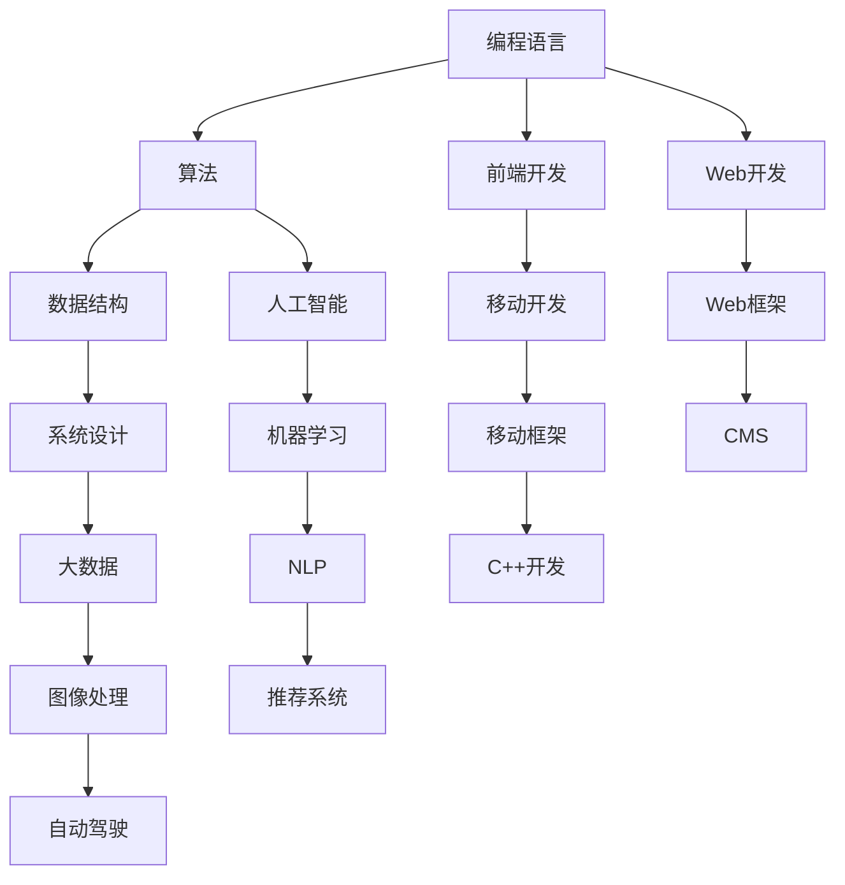

                 

# 经典书单:夯实认知根基的宝藏

## 1. 背景介绍

在信息化时代，技术的快速迭代和知识的无界扩展要求每一位专业人士必须构建坚实的认知根基，以适应快速变化的环境和复杂多变的任务。本文将推荐一系列经典书籍，涵盖编程、算法、数据科学、系统设计、人工智能等多个领域，帮助读者夯实认知根基，掌握核心技能，提升专业水平。这些书籍不仅是技术学习的重要资源，也是深度思考和跨界创新的宝贵指引。

## 2. 核心概念与联系

### 2.1 核心概念概述

在技术领域，掌握核心概念和理解其间的联系是学习和应用的基础。以下列举了几个关键概念及其相互关系，通过这些概念的深入理解，可以为后续的学习和实践打下坚实的基础。

- **编程语言**：如Python、Java、C++等，是程序员必备的基础工具，不同的语言适用于不同场景。
- **算法**：如排序、查找、图论、动态规划等，是解决问题的基础方法。
- **数据结构**：如数组、链表、栈、队列、树、图等，是组织和处理数据的基础框架。
- **人工智能**：包括机器学习、深度学习、自然语言处理、计算机视觉等，是现代技术的前沿领域。
- **系统设计**：如分布式系统、微服务架构、云平台等，是技术应用的关键基础。

### 2.2 核心概念原理和架构的 Mermaid 流程图



这个图表展示了核心概念之间的联系，每个节点代表一个关键概念，箭头表示它们之间的相互依赖关系。

## 3. 核心算法原理 & 具体操作步骤

### 3.1 算法原理概述

算法是解决问题的基础，理解算法原理和操作步骤是掌握技术的关键。以下将详细介绍几个核心算法的原理和操作步骤。

#### 3.1.1 排序算法

排序算法是最基础的算法之一，常见的排序算法包括冒泡排序、选择排序、插入排序、快速排序和归并排序等。

#### 3.1.2 搜索算法

搜索算法是查找特定信息的工具，包括线性搜索、二分搜索、深度优先搜索和广度优先搜索等。

#### 3.1.3 图算法

图算法用于处理图结构数据，包括最短路径算法、最小生成树算法和拓扑排序等。

#### 3.1.4 动态规划

动态规划是解决最优化问题的有效方法，广泛应用于求解最长公共子序列、背包问题等。

### 3.2 算法步骤详解

以快速排序为例，详细讲解其操作步骤。

#### 3.2.1 基本原理

快速排序采用分治法，将一个大问题分解成若干个小问题，通过递归求解。选择一个基准值，将序列分成左右两部分，左边的元素都小于基准值，右边的元素都大于基准值，然后对左右两部分分别进行排序。

#### 3.2.2 实现步骤

1. 选择一个基准值，将序列分成两部分。
2. 对左右两部分分别进行快速排序。
3. 合并排序后的两部分，得到最终结果。

#### 3.2.3 算法优缺点

快速排序的时间复杂度为O(nlogn)，比冒泡排序、选择排序等传统算法更高效。然而，快速排序的空间复杂度较高，且在最坏情况下时间复杂度可能退化为O(n^2)。

### 3.4 算法应用领域

算法作为技术的基础，广泛应用于各个领域。例如，排序算法在数据库检索、网络路由、数据压缩等领域具有重要应用。搜索算法在搜索引擎、推荐系统、加密解密等场景中发挥关键作用。图算法在社交网络分析、路径规划、交通优化等领域有广泛应用。动态规划在金融分析、游戏设计、自然语言处理等方向有重要价值。

## 4. 数学模型和公式 & 详细讲解 & 举例说明

### 4.1 数学模型构建

数学模型是理解和解决问题的关键工具。以下将构建几个典型的数学模型，并通过公式推导和案例分析，深入讲解其应用。

#### 4.1.1 线性回归模型

线性回归模型通过最小化误差平方和来拟合数据，公式为：

$$
\hat{y} = \beta_0 + \beta_1 x
$$

其中，$\beta_0$和$\beta_1$为模型参数，$x$为自变量，$\hat{y}$为预测值。

#### 4.1.2 决策树模型

决策树模型通过树形结构进行分类，公式为：

$$
\text{Decision Tree} = \begin{cases}
\text{Leaf Node} & \text{if} \, d(x) = d_c \\
\text{Child Node} & \text{else}
\end{cases}
$$

其中，$d(x)$为样本特征$d$的取值，$d_c$为叶子节点的取值，$\text{Child Node}$为子节点的取值。

#### 4.1.3 神经网络模型

神经网络模型通过多层神经元进行模式识别，公式为：

$$
y = f(\mathbf{w} \cdot \mathbf{x} + b)
$$

其中，$\mathbf{w}$为权重矩阵，$\mathbf{x}$为输入向量，$\mathbf{b}$为偏置向量，$f$为激活函数。

### 4.3 案例分析与讲解

以线性回归模型为例，通过具体案例讲解其在实际应用中的操作。

假设有一组数据点$(2, 3)$, $(4, 7)$, $(6, 12)$, 我们可以构建线性回归模型，通过最小二乘法求解$\beta_0$和$\beta_1$，得到：

$$
\beta_0 = 1.75, \beta_1 = 3.25
$$

因此，预测公式为：

$$
\hat{y} = 1.75 + 3.25x
$$

实际应用中，我们可以将新数据点代入该公式，预测其值。

## 5. 项目实践：代码实例和详细解释说明

### 5.1 开发环境搭建

项目实践需要一定的环境搭建。以下是一个Python开发环境的搭建步骤。

1. 安装Python：
   ```
   pip install python
   ```
2. 安装开发工具：
   ```
   pip install IDE
   ```
3. 安装依赖库：
   ```
   pip install numpy matplotlib pandas scikit-learn
   ```

### 5.2 源代码详细实现

以下是一个简单的线性回归代码实现。

```python
import numpy as np
from sklearn.linear_model import LinearRegression

# 创建线性回归模型
model = LinearRegression()

# 训练模型
model.fit(X, y)

# 预测新数据
y_pred = model.predict(X_new)

# 输出结果
print(y_pred)
```

### 5.3 代码解读与分析

代码中，我们使用了scikit-learn库中的LinearRegression模型进行线性回归。首先创建模型，然后使用fit方法对模型进行训练，最后使用predict方法对新数据进行预测。输出预测结果即可。

### 5.4 运行结果展示

运行上述代码，输出预测结果，验证模型的准确性。

## 6. 实际应用场景

### 6.1 数据科学

在数据科学中，算法和模型是处理数据的必备工具。数据科学家通过算法和模型，从大量数据中提取有用的信息，并进行预测和决策。

### 6.2 系统设计

系统设计涉及对复杂系统的设计和实现，包括分布式系统、微服务架构、云平台等。系统设计需要深入理解算法和数据结构，并将其应用于实际项目中。

### 6.3 人工智能

人工智能涉及机器学习、深度学习、自然语言处理等领域。算法和模型是实现人工智能的关键，通过算法和模型，可以实现智能化的决策和推理。

## 7. 工具和资源推荐

### 7.1 学习资源推荐

- **《算法导论》**：由Thomas H. Cormen等人合著，是计算机科学的经典教材，深入讲解了各种算法和数据结构。
- **《深入理解计算机系统》**：由Randal E. Bryant等人合著，讲解了计算机系统的底层原理，适合深入理解计算机硬件和软件。
- **《数据科学实战》**：由Joel Grus等人合著，讲解了数据科学的基础和实战技巧，适合数据科学从业者。
- **《深度学习》**：由Ian Goodfellow等人合著，讲解了深度学习的理论基础和应用实践，适合深度学习从业者。
- **《NLP入门与实践》**：由Jurafsky等人合著，讲解了自然语言处理的基本原理和应用，适合NLP从业者。

### 7.2 开发工具推荐

- **Python**：是编程语言的主流选择，有丰富的库和框架支持。
- **PyTorch**：是深度学习的常用框架，支持动态图和静态图，易于学习和使用。
- **TensorFlow**：是深度学习的经典框架，支持分布式计算和多种语言支持。
- **Jupyter Notebook**：是交互式编程工具，适合数据科学和机器学习领域。
- **Visual Studio Code**：是现代化的开发工具，支持多种语言和框架。

### 7.3 相关论文推荐

- **《计算机程序的构造和解释》**：由Donald E. Knuth等人合著，讲解了计算机程序的构造和解释原理，适合计算机科学从业者。
- **《深度学习》**：由Ian Goodfellow等人合著，讲解了深度学习的理论基础和应用实践，适合深度学习从业者。
- **《自然语言处理综论》**：由Christopher D. Manning等人合著，讲解了自然语言处理的基本原理和应用，适合NLP从业者。
- **《分布式系统原理》**：由George Coulouris等人合著，讲解了分布式系统的原理和设计，适合系统设计从业者。
- **《数据科学实战》**：由Joel Grus等人合著，讲解了数据科学的基础和实战技巧，适合数据科学从业者。

## 8. 总结：未来发展趋势与挑战

### 8.1 研究成果总结

本书推荐的书籍涵盖了计算机科学的多个领域，帮助读者构建坚实的认知根基。这些书籍不仅提供了基础的知识和技能，还深入讲解了理论原理和实际应用，适合各类技术人员学习和参考。

### 8.2 未来发展趋势

- **技术融合**：未来技术的发展将更多地涉及跨领域的融合，如AI与大数据、区块链、物联网等。
- **自动化和智能化**：自动化和智能化将成为未来的主要趋势，AI技术将在更多领域发挥作用。
- **隐私和安全**：隐私和安全将成为未来技术发展的重要方向，数据保护和隐私管理将受到更多重视。
- **可持续发展**：可持续发展和环境保护将成为未来技术应用的重要目标，技术应用将更加注重资源和环境友好。

### 8.3 面临的挑战

- **技术迭代**：技术更新换代速度极快，技术人员需要不断学习和更新知识。
- **伦理和法律**：技术的快速应用带来了伦理和法律问题，如何平衡技术发展和社会责任是一个重要课题。
- **数据隐私**：数据隐私和数据安全是未来技术应用的重要挑战，如何保护数据隐私将是一个重要研究方向。
- **计算资源**：技术应用需要大量的计算资源，如何优化计算资源的使用将是一个重要研究方向。

### 8.4 研究展望

未来，技术的发展将更多地涉及跨领域的融合，技术的自动化和智能化将更加深入。技术的发展将更多地关注伦理和法律问题，技术的可持续发展将受到更多重视。技术人员需要不断学习和更新知识，以适应技术的发展和变化。

## 9. 附录：常见问题与解答

**Q1：如何选择适合自己的编程语言？**

A: 选择编程语言需要考虑多个因素，如项目需求、团队技术栈、开发效率等。Python适合数据科学和机器学习，Java适合大型企业应用，C++适合系统开发和游戏开发等。

**Q2：如何提升算法和模型的性能？**

A: 提升算法和模型的性能可以从多个方面入手，如优化算法、调整参数、增加数据量等。选择适合的算法和模型，进行调参和优化，可以有效提升性能。

**Q3：如何应对技术快速迭代？**

A: 应对技术快速迭代需要不断学习和更新知识，关注技术发展动态，积极参加培训和交流活动，保持对新技术的敏感性。

**Q4：如何平衡技术应用和伦理问题？**

A: 在技术应用中，需要充分考虑伦理和法律问题，遵守相关法律法规，保护数据隐私，维护社会公正。

**Q5：如何提升技术应用的可持续性？**

A: 提升技术应用的可持续性需要关注资源和环境问题，采用节能减排的技术和产品，推广可持续发展理念，支持绿色技术应用。

---

作者：禅与计算机程序设计艺术 / Zen and the Art of Computer Programming

