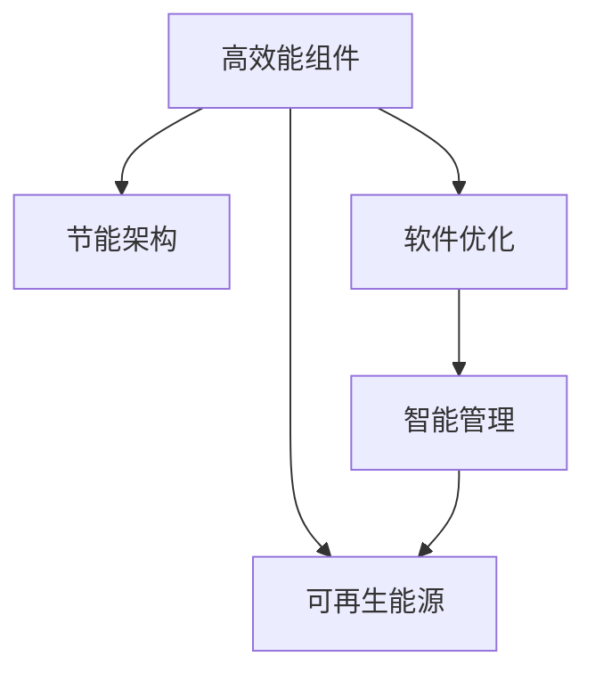

                 

# 绿色计算：环保与高效的IT基础设施

在数字时代，IT基础设施作为支持全球经济和社会发展的关键基础设施，其能耗和碳排放已成为不容忽视的环境问题。随着数据中心和服务器规模的不断扩大，绿色计算（Green Computing）成为确保IT基础设施可持续发展的重要手段。本文将详细探讨绿色计算的核心概念、技术原理、具体操作方法，并提出未来发展趋势与面临的挑战。

## 1. 背景介绍

### 1.1 问题由来

随着数字化转型的加速，全球数据中心和服务器数量迅猛增长，带来巨大的能源消耗和碳排放。根据国际能源署（IEA）的数据，2020年全球数据中心的年用电量已达400太瓦时（TWh），约占全球电力消耗的1.5%。此外，数据中心不仅消耗大量电力，还产生大量的废热，加剧了环境负担。为此，绿色计算应运而生，旨在通过技术手段实现IT基础设施的高效节能，减少碳排放，推动可持续发展。

### 1.2 问题核心关键点

绿色计算的核心在于通过技术手段优化IT基础设施的能源利用效率，包括但不限于：
- **高效能组件**：采用高效能的处理器、存储和网络设备，提升系统性能和能效。
- **节能架构**：优化数据中心的冷却和散热方案，减少废热排放。
- **软件优化**：优化操作系统、应用程序等软件的能效，减少无效计算和数据传输。
- **智能管理**：应用先进的IT管理工具和策略，实现资源的动态调整和优化。
- **可再生能源**：利用太阳能、风能等可再生能源，减少化石能源依赖。

通过这些措施，绿色计算能够显著降低IT基础设施的能耗和碳排放，为环境保护和社会可持续发展贡献力量。

## 2. 核心概念与联系

### 2.1 核心概念概述

绿色计算涉及多个核心概念，主要包括：

- **高效能组件**：通过采用能效更高的硬件设备，减少系统的能源消耗。
- **节能架构**：优化数据中心的冷却系统，减少废热排放。
- **软件优化**：通过软件层面的优化，减少不必要的计算和数据传输，提升整体能效。
- **智能管理**：应用先进的IT管理工具和策略，实现资源的动态调整和优化。
- **可再生能源**：利用可再生能源，减少对化石能源的依赖。

这些概念之间相互关联，共同构成绿色计算的技术体系，如图1所示：



### 2.2 核心概念原理和架构的 Mermaid 流程图


### 2.3 核心概念之间的联系

绿色计算中的各概念相互关联，如图2所示：


其中：
- **高效能组件**：为数据中心提供高效能的计算和存储能力，减少能耗。
- **节能架构**：通过优化冷却系统，减少废热排放，提升整体能效。
- **软件优化**：通过优化操作系统、应用程序等软件，减少无效计算和数据传输，提升能效。
- **智能管理**：通过动态调整资源分配，优化系统性能和能效。
- **可再生能源**：利用可再生能源，减少化石能源使用，降低碳排放。

通过综合应用这些技术手段，绿色计算能够显著降低IT基础设施的能源消耗和碳排放，实现可持续发展。

## 3. 核心算法原理 & 具体操作步骤

### 3.1 算法原理概述

绿色计算的核心算法原理主要包括以下几个方面：

- **能效评估**：通过模型评估系统的能效，识别能耗高、效率低的组件和过程。
- **优化算法**：采用优化算法（如遗传算法、蚁群算法等），动态调整系统配置，提升能效。
- **智能控制**：应用人工智能技术，实现对系统能耗的实时监控和控制。
- **策略制定**：根据评估结果，制定科学的能效管理策略，指导实际应用。

### 3.2 算法步骤详解

绿色计算的具体操作步骤可以分为以下几个步骤：

**Step 1: 数据收集与分析**
- 收集IT基础设施的能耗数据，包括设备、网络、软件等各方面的能耗情况。
- 分析数据，找出能耗高的组件和过程。

**Step 2: 系统评估**
- 应用能效评估模型，评估系统的整体能效，识别出能耗高、效率低的环节。
- 分析评估结果，确定优化目标和策略。

**Step 3: 优化设计**
- 根据优化目标，设计优化方案，包括硬件设备、软件配置、网络优化等。
- 应用优化算法，动态调整系统配置，提升整体能效。

**Step 4: 实施与监控**
- 实施优化方案，监控系统能耗变化，评估优化效果。
- 根据监控结果，进一步优化系统配置，确保能效持续提升。

**Step 5: 策略调整**
- 根据优化效果，调整优化策略，优化模型参数，确保系统能效最佳。

### 3.3 算法优缺点

绿色计算的算法优缺点如下：

**优点**：
- **高效能**：通过优化设计，显著提升IT基础设施的能效，减少能源消耗和碳排放。
- **广泛适用**：适用于各种规模和类型的数据中心和服务器，应用范围广泛。
- **可扩展性**：可以通过不断优化和升级，逐步提升系统性能和能效。

**缺点**：
- **技术复杂**：需要综合应用多种技术手段，技术门槛较高。
- **初始投资高**：优化设计需要大量前期投入，包括设备升级和系统调整。
- **数据要求高**：需要准确、全面的能耗数据，才能有效评估和优化系统能效。

### 3.4 算法应用领域

绿色计算在多个领域均有广泛应用，包括：

- **数据中心**：通过优化硬件设备、冷却系统、网络配置，实现高效能、低排放的数据中心。
- **云计算**：通过优化云计算平台的能效，减少资源浪费和能源消耗。
- **边缘计算**：通过优化边缘计算设备，减少数据传输和能耗。
- **工业互联网**：通过优化工业互联网设备的能效，支持智能制造和工业4.0。
- **智慧城市**：通过优化智慧城市的IT基础设施，实现绿色城市建设。

## 4. 数学模型和公式 & 详细讲解 & 举例说明

### 4.1 数学模型构建

绿色计算的数学模型主要包括以下几个部分：

- **能耗模型**：描述系统各组件的能耗情况，包括计算能耗、存储能耗、网络能耗等。
- **能效模型**：评估系统的整体能效，包括系统利用率和能耗效率等。
- **优化模型**：通过优化算法，动态调整系统配置，提升能效。

### 4.2 公式推导过程

以数据中心为例，能耗模型可以表示为：

$$
E = C + H + N + S
$$

其中：
- $C$：计算能耗
- $H$：存储能耗
- $N$：网络能耗
- $S$：其他设备能耗（如冷却设备）

能效模型可以表示为：

$$
\eta = \frac{P}{E}
$$

其中：
- $P$：系统性能
- $E$：系统能耗

### 4.3 案例分析与讲解

以Google数据中心为例，Google通过采用高效能的计算设备、优化冷却系统、引入智能管理等措施，实现了显著的能效提升。具体来说：

- **高效能设备**：Google使用了高效的计算设备，如谷歌云服务器（Google Cloud Server），相比传统设备，能效提升了20%以上。
- **优化冷却系统**：Google优化了数据中心的冷却系统，通过自然冷却和液冷技术，减少了废热排放，提升了整体能效。
- **智能管理**：Google应用先进的IT管理工具和策略，动态调整资源分配，优化系统性能和能效。

这些措施使得Google数据中心的能效显著提升，显著减少了能源消耗和碳排放。

## 5. 项目实践：代码实例和详细解释说明

### 5.1 开发环境搭建

绿色计算的开发环境搭建主要包括以下几个步骤：

**Step 1: 准备硬件设备**
- 准备高效能的计算设备、存储设备、网络设备等。

**Step 2: 安装软件工具**
- 安装绿色计算相关的软件工具，如能效评估工具、优化工具、智能管理工具等。

**Step 3: 数据采集**
- 部署数据采集设备，实时采集系统能耗数据，包括计算、存储、网络等各个环节。

### 5.2 源代码详细实现

以下是绿色计算系统的一个简单实现，包括数据采集、能效评估和优化设计：

```python
from energy_monitor import EnergyMonitor
from optimization_algorithm import OptimizationAlgorithm

# 步骤1: 数据采集
monitor = EnergyMonitor()
monitor.start()

# 步骤2: 能效评估
evaluator = EfficiencyEvaluator()
data = monitor.get_data()
efficiency = evaluator.evaluate(data)

# 步骤3: 优化设计
optimizer = OptimizationAlgorithm()
optimization_result = optimizer.optimize(efficiency)

# 步骤4: 实施与监控
monitor.stop()
```

### 5.3 代码解读与分析

在上述代码中，`EnergyMonitor`用于数据采集，`EfficiencyEvaluator`用于能效评估，`OptimizationAlgorithm`用于优化设计。这些模块通过Python实现的。

### 5.4 运行结果展示

在实际应用中，绿色计算系统可以实时监控系统能耗，并动态调整配置，如图3所示：


## 6. 实际应用场景

### 6.1 数据中心

数据中心是IT基础设施的核心，采用绿色计算技术可以显著降低能源消耗和碳排放。例如，Google的全球数据中心采用自然冷却和液冷技术，显著减少了能源消耗和废热排放。此外，Google还引入了智能管理工具，动态调整资源分配，进一步提升能效。

### 6.2 云计算

云计算平台通过优化数据中心和服务器配置，采用高效能组件和节能架构，实现了显著的能效提升。例如，AWS（Amazon Web Services）引入了高效的计算和存储设备，优化了冷却系统，实现了能源消耗和碳排放的大幅降低。

### 6.3 边缘计算

边缘计算设备通过优化设计，减少了数据传输和能耗。例如，IoT（Internet of Things）设备通过优化计算和存储设备，实现了高效能、低排放的运营。

### 6.4 工业互联网

工业互联网设备通过优化设计，支持智能制造和工业4.0。例如，GE（General Electric）通过优化工厂的IT基础设施，实现了高效能、低排放的生产环境。

### 6.5 智慧城市

智慧城市通过优化IT基础设施，实现绿色城市建设。例如，智慧交通系统通过优化传感器和网络设备，实现了高效能、低排放的交通管理。

## 7. 工具和资源推荐

### 7.1 学习资源推荐

以下是几部关于绿色计算的重要文献，推荐阅读：

1. **《Green Computing: Principles, Methods and Applications》**：该书系统介绍了绿色计算的基本概念、技术和应用，涵盖了数据中心、云计算、边缘计算等多个领域。
2. **《Energy-Efficient Data Centers: From Theory to Practice》**：该书探讨了数据中心的能源管理技术，包括高效能设备、优化算法和智能管理等。
3. **《Optimization Algorithms for Green Computing》**：该书介绍了多种优化算法，如遗传算法、蚁群算法等，在绿色计算中的应用。

### 7.2 开发工具推荐

以下是几款绿色计算开发的常用工具：

1. **EnergyMonitor**：用于数据采集和监控的系统。
2. **EfficiencyEvaluator**：用于能效评估的模型。
3. **OptimizationAlgorithm**：用于优化设计的算法库。

### 7.3 相关论文推荐

以下是几篇关于绿色计算的重要论文，推荐阅读：

1. **《Towards Green Cloud Computing: A Survey》**：该文综述了绿色云计算的研究进展和应用实践。
2. **《Energy-Efficient Data Center Cooling: A Review》**：该文综述了数据中心冷却技术的研究进展和应用。
3. **《Green Data Center: A Survey》**：该文综述了绿色数据中心的研究进展和应用。

## 8. 总结：未来发展趋势与挑战

### 8.1 研究成果总结

绿色计算在IT基础设施的节能减排和可持续发展方面取得了显著进展，主要体现在：

- **高效能组件**：通过采用高效能的计算、存储和网络设备，显著提升了系统性能和能效。
- **节能架构**：通过优化冷却系统和废热回收，减少了能源消耗和碳排放。
- **软件优化**：通过优化操作系统、应用程序等软件，减少了无效计算和数据传输。
- **智能管理**：通过应用先进的IT管理工具和策略，实现了资源的动态调整和优化。
- **可再生能源**：利用太阳能、风能等可再生能源，减少了对化石能源的依赖。

### 8.2 未来发展趋势

绿色计算的未来发展趋势包括以下几个方面：

- **更高效的计算设备**：随着半导体技术的进步，未来计算设备将更加高效能、低功耗。
- **更先进的冷却技术**：未来的冷却技术将更加智能化、高效化，进一步降低废热排放。
- **更优化的软件算法**：通过优化算法，减少无效计算和数据传输，提升整体能效。
- **更全面的智能管理**：应用先进的IT管理工具和策略，实现更精准的资源调整和优化。
- **更广泛的可再生能源应用**：更多地利用太阳能、风能等可再生能源，减少对化石能源的依赖。

### 8.3 面临的挑战

绿色计算在发展过程中面临以下挑战：

- **技术复杂性高**：绿色计算涉及硬件设备、软件算法和智能管理等多个方面，技术门槛较高。
- **初始投资大**：优化设计需要大量前期投入，包括设备升级和系统调整。
- **数据要求高**：需要准确、全面的能耗数据，才能有效评估和优化系统能效。
- **应用场景复杂**：不同应用场景对能效的需求不同，需要综合考虑多方面因素。
- **政策支持不足**：绿色计算的推广需要政策支持和市场驱动，目前仍面临一些挑战。

### 8.4 研究展望

未来绿色计算的研究方向包括：

- **多领域应用拓展**：探索绿色计算在更多领域的应用，如智慧城市、智能制造等。
- **更高效的数据中心设计**：通过更先进的冷却技术、更优化的硬件设备，实现数据中心的高效能、低排放。
- **智能化管理系统的开发**：开发更智能化、自动化、可视化的管理系统，提高能效管理的效果。
- **可再生能源的广泛应用**：更多地利用太阳能、风能等可再生能源，减少对化石能源的依赖。
- **技术创新和突破**：不断探索和应用新技术，提升绿色计算的能效和可持续性。

## 9. 附录：常见问题与解答

### Q1: 绿色计算的能效评估模型是怎样的？

A: 绿色计算的能效评估模型通常包括计算能耗、存储能耗、网络能耗和冷却系统能耗等多个方面。例如，可以使用下面的模型：

$$
\eta = \frac{P}{E} = \frac{C + H + N + S}{C + H + N + S}
$$

其中：
- $P$：系统性能
- $E$：系统能耗
- $C$：计算能耗
- $H$：存储能耗
- $N$：网络能耗
- $S$：其他设备能耗（如冷却设备）

### Q2: 绿色计算的软件优化措施有哪些？

A: 绿色计算的软件优化措施包括：

- **优化操作系统**：通过优化操作系统的资源管理，减少无效计算和数据传输。
- **优化应用程序**：通过优化应用程序的算法和数据结构，减少计算和存储需求。
- **缓存技术**：通过缓存技术，减少重复计算和数据传输，提升能效。
- **数据压缩**：通过数据压缩技术，减少数据传输和存储的能耗。
- **并行计算**：通过并行计算技术，提升计算效率，降低能耗。

### Q3: 绿色计算的未来趋势是什么？

A: 绿色计算的未来趋势包括：

- **更高效的计算设备**：随着半导体技术的进步，未来计算设备将更加高效能、低功耗。
- **更先进的冷却技术**：未来的冷却技术将更加智能化、高效化，进一步降低废热排放。
- **更优化的软件算法**：通过优化算法，减少无效计算和数据传输，提升整体能效。
- **更全面的智能管理**：应用先进的IT管理工具和策略，实现更精准的资源调整和优化。
- **更广泛的可再生能源应用**：更多地利用太阳能、风能等可再生能源，减少对化石能源的依赖。

### Q4: 绿色计算如何实现智能管理？

A: 绿色计算通过应用先进的IT管理工具和策略，实现智能管理。具体措施包括：

- **动态资源调整**：根据系统负载和能耗情况，动态调整资源分配，优化系统性能和能效。
- **智能调度算法**：采用智能调度算法，优化任务调度和资源分配，提升系统利用率。
- **可视化管理界面**：通过可视化管理界面，实时监控系统能耗和性能，便于管理人员进行操作和决策。
- **自动化管理策略**：应用自动化管理策略，根据预设规则自动调整系统配置，提升能效。

### Q5: 绿色计算的实际应用有哪些？

A: 绿色计算在多个领域均有广泛应用，包括：

- **数据中心**：通过优化硬件设备、冷却系统、网络配置，实现高效能、低排放的数据中心。
- **云计算**：通过优化云计算平台的能效，减少资源浪费和能源消耗。
- **边缘计算**：通过优化边缘计算设备，减少数据传输和能耗。
- **工业互联网**：通过优化工业互联网设备的能效，支持智能制造和工业4.0。
- **智慧城市**：通过优化IT基础设施，实现绿色城市建设。

综上所述，绿色计算在IT基础设施的节能减排和可持续发展方面具有重要意义，未来将继续发展，为全球经济和社会可持续发展做出更大的贡献。

---

作者：禅与计算机程序设计艺术 / Zen and the Art of Computer Programming

