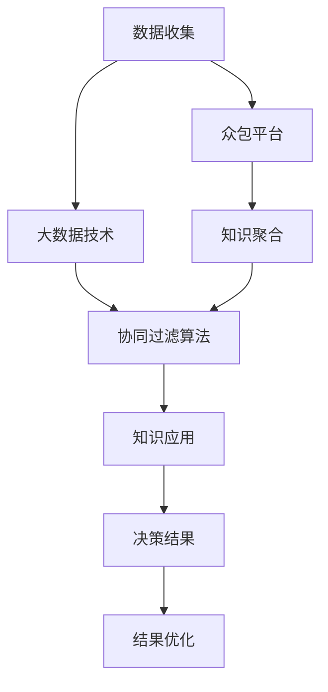

                 

# 群体智慧：决策的新利器

> 关键词：群体智慧,决策支持系统,大数据,众包,协同过滤,智能决策,人工智能

## 1. 背景介绍

### 1.1 问题由来
随着信息技术的发展，企业决策已从基于个人经验的定性判断，逐渐向基于数据和算法的定量分析转变。然而，传统的决策支持系统往往依赖单一数据源和算法模型，难以应对复杂多变的环境。而在应对大型、多样、动态的决策问题时，单纯依赖数据科学家的专业知识和算法很难保证决策的全面性和高效性。

近年来，群体智慧技术（Collective Intelligence）成为决策领域的新热点。群体智慧是指通过整合和利用多方多样化的知识、经验和信息，以群体协作方式辅助个体决策，从而形成更加全面、准确和高效的结果。通过对多方知识的高效聚合和挖掘，群体智慧不仅能够克服单一信息源的局限性，还能够降低决策失误的概率，促进决策的科学化和民主化。

### 1.2 问题核心关键点
群体智慧的核心在于如何将多方知识高效地整合和应用。主要问题点包括：

- 如何高效地收集和聚合多方的知识和信息。
- 如何对聚合后的信息进行有效过滤和排序，提取出最有价值的知识。
- 如何将多方知识应用于具体的决策任务，如预测、分类、排序等。
- 如何评价和优化群体智慧系统的性能，确保其可靠性和可解释性。

## 2. 核心概念与联系

### 2.1 核心概念概述

群体智慧技术涉及多个交叉学科，主要包括：

- 大数据技术：用于高效收集、存储和处理海量的数据和信息。
- 众包平台：提供平台供人们贡献、交流知识和经验。
- 协同过滤算法：用于对群体知识进行过滤、排序和推荐。
- 人工智能与机器学习：利用算法模型自动挖掘和融合群体知识，辅助决策。

这些核心技术通过以下方式相互联系，形成群体智慧的决策支持系统：

1. **数据收集**：利用大数据技术，从各种渠道收集多方的知识、经验和信息。
2. **知识聚合**：通过众包平台和协同过滤算法，对收集到的数据进行筛选、排序和提炼，形成高质量的知识集。
3. **知识应用**：利用人工智能和机器学习技术，将知识应用于具体的决策任务。
4. **结果优化**：对决策结果进行评价和优化，确保结果的可靠性和可解释性。

这些步骤构成了一个闭环，实现了群体智慧的高效应用。

### 2.2 核心概念原理和架构的 Mermaid 流程图



## 3. 核心算法原理 & 具体操作步骤
### 3.1 算法原理概述

群体智慧决策的核心算法可以分为数据收集、知识聚合、知识应用和结果优化四个步骤。

1. **数据收集**：利用大数据技术，从互联网、社交媒体、专业论坛等渠道收集多方的知识和信息。
2. **知识聚合**：通过众包平台和协同过滤算法，对收集到的数据进行筛选、排序和提炼，形成高质量的知识集。
3. **知识应用**：利用人工智能和机器学习技术，将知识应用于具体的决策任务。
4. **结果优化**：对决策结果进行评价和优化，确保结果的可靠性和可解释性。

### 3.2 算法步骤详解

#### 数据收集

数据收集是群体智慧决策的基础。主要方法包括：

1. **互联网爬虫**：通过Web爬虫技术，自动化地从互联网、新闻网站、社交媒体等渠道收集数据。
2. **社交媒体API**：利用社交媒体API，获取用户的评论、帖子、图片等信息。
3. **专业论坛API**：利用专业论坛API，获取专业领域内的讨论和知识。

具体实现流程如下：

1. 确定数据来源，如Web页面、社交媒体、论坛等。
2. 开发爬虫程序，自动化地从指定网站抓取数据。
3. 对抓取的数据进行预处理，如去重、清洗、格式化等。
4. 将处理后的数据存储到数据库中，供后续分析和应用。

#### 知识聚合

知识聚合是将多方的知识和信息整合并提炼出最有价值知识的过程。主要方法包括：

1. **众包平台**：利用众包平台，组织专家和普通用户共同标注、筛选和排序数据。
2. **协同过滤算法**：利用协同过滤算法，对多方的知识和信息进行推荐和排序。

具体实现流程如下：

1. 在众包平台上创建任务，明确数据需求和筛选标准。
2. 邀请专家和普通用户参与标注、筛选和排序任务。
3. 利用协同过滤算法，对收集到的数据进行推荐和排序。
4. 将排序后的数据存储到数据库中，供后续分析和应用。

#### 知识应用

知识应用是将知识应用于具体的决策任务的过程。主要方法包括：

1. **决策支持算法**：利用决策支持算法，对知识进行预测、分类、排序等操作。
2. **人工智能和机器学习**：利用机器学习模型，自动挖掘和融合知识，辅助决策。

具体实现流程如下：

1. 选择合适的决策支持算法，如回归分析、分类算法、聚类算法等。
2. 利用机器学习模型，自动挖掘和融合知识，形成知识库。
3. 将知识应用于具体的决策任务，如预测、分类、排序等。
4. 对决策结果进行评价和优化，确保结果的可靠性和可解释性。

#### 结果优化

结果优化是对决策结果进行评价和优化的过程。主要方法包括：

1. **评估指标**：利用评估指标，对决策结果进行评估和优化。
2. **反馈机制**：利用反馈机制，优化决策支持算法和知识库。

具体实现流程如下：

1. 确定评估指标，如准确率、召回率、F1分数等。
2. 对决策结果进行评估，计算评估指标。
3. 根据评估结果，优化决策支持算法和知识库。
4. 重复以上步骤，确保决策结果的可靠性和可解释性。

### 3.3 算法优缺点

群体智慧决策的核心算法具有以下优点：

1. **全面性**：能够整合多方知识，弥补单一数据源的局限性。
2. **准确性**：通过协同过滤和机器学习，提高决策结果的准确性。
3. **高效性**：利用大数据技术，实现高效的决策过程。
4. **可解释性**：通过评价和优化，确保决策结果的可解释性。

但这些算法也存在以下缺点：

1. **数据质量**：依赖数据源的质量，如果数据来源单一或数据质量不高，结果可能不准确。
2. **隐私和安全**：涉及多方数据，可能存在隐私泄露和数据安全问题。
3. **计算资源**：需要大量计算资源，对硬件要求较高。
4. **复杂性**：算法模型较为复杂，需要专业的技术支持和维护。

## 4. 数学模型和公式 & 详细讲解 & 举例说明

### 4.1 数学模型构建

群体智慧决策的数学模型可以分为数据收集、知识聚合、知识应用和结果优化四个部分。

1. **数据收集模型**：用于描述如何从多个数据源收集数据。
2. **知识聚合模型**：用于描述如何对收集到的数据进行筛选和排序。
3. **知识应用模型**：用于描述如何利用知识进行决策。
4. **结果优化模型**：用于描述如何评价和优化决策结果。

### 4.2 公式推导过程

以知识应用模型为例，假设有一个二分类任务，使用机器学习模型进行预测。

设训练集为 $D=\{(x_i, y_i)\}_{i=1}^N$，其中 $x_i$ 为输入特征，$y_i$ 为输出标签。

设机器学习模型为 $f(x;w)$，其中 $w$ 为模型参数。

模型预测结果为 $\hat{y}=f(x;w)$，则预测误差为 $e(\hat{y}, y_i) = \mathbb{1}(\hat{y} \neq y_i)$。

预测误差期望为 $L(w) = \frac{1}{N} \sum_{i=1}^N e(\hat{y}, y_i)$。

模型优化目标为最小化预测误差，即：

$$
\min_{w} L(w)
$$

### 4.3 案例分析与讲解

以预测股票市场波动为例，利用群体智慧决策模型进行股票市场波动预测。

1. **数据收集**：利用互联网爬虫技术，从互联网、新闻网站、财经论坛等渠道收集股票相关的新闻、评论、数据等。
2. **知识聚合**：利用众包平台，邀请专家和普通用户共同标注、筛选和排序数据。
3. **知识应用**：利用机器学习模型，自动挖掘和融合知识，形成知识库。
4. **结果优化**：利用评估指标，对决策结果进行评估和优化，确保结果的可靠性和可解释性。

具体实现步骤如下：

1. 确定数据来源，如Web页面、新闻网站、财经论坛等。
2. 开发爬虫程序，自动化地从指定网站抓取数据。
3. 对抓取的数据进行预处理，如去重、清洗、格式化等。
4. 在众包平台上创建任务，邀请专家和普通用户共同标注、筛选和排序数据。
5. 利用机器学习模型，自动挖掘和融合知识，形成知识库。
6. 对知识库进行预测，形成股票市场波动预测结果。
7. 利用评估指标，对预测结果进行评估和优化，确保结果的可靠性和可解释性。

## 5. 项目实践：代码实例和详细解释说明

### 5.1 开发环境搭建

在进行群体智慧决策项目开发前，需要准备好开发环境。以下是使用Python进行PyTorch开发的环境配置流程：

1. 安装Anaconda：从官网下载并安装Anaconda，用于创建独立的Python环境。

2. 创建并激活虚拟环境：
```bash
conda create -n pytorch-env python=3.8 
conda activate pytorch-env
```

3. 安装PyTorch：根据CUDA版本，从官网获取对应的安装命令。例如：
```bash
conda install pytorch torchvision torchaudio cudatoolkit=11.1 -c pytorch -c conda-forge
```

4. 安装TensorFlow：由Google主导开发的开源深度学习框架，生产部署方便，适合大规模工程应用。同样有丰富的预训练语言模型资源。

5. 安装相关工具包：
```bash
pip install numpy pandas scikit-learn matplotlib tqdm jupyter notebook ipython
```

完成上述步骤后，即可在`pytorch-env`环境中开始项目实践。

### 5.2 源代码详细实现

下面我们以预测股票市场波动为例，给出使用PyTorch进行群体智慧决策的代码实现。

首先，定义数据处理函数：

```python
import numpy as np
from sklearn.preprocessing import MinMaxScaler
from sklearn.model_selection import train_test_split

def load_data(file_path, max_len=50):
    data = pd.read_csv(file_path)
    x = data.drop(['close'], axis=1)
    y = data['close']
    
    scaler = MinMaxScaler(feature_range=(0, 1))
    x_scaled = scaler.fit_transform(x)
    
    x_train, x_test, y_train, y_test = train_test_split(x_scaled, y, test_size=0.2, random_state=42)
    
    x_train = x_train[:,:max_len]
    x_test = x_test[:,:max_len]
    
    return x_train, x_test, y_train, y_test
```

然后，定义模型和优化器：

```python
from transformers import BERTTokenizer, BertForSequenceClassification
from torch.utils.data import DataLoader, Dataset
import torch
import torch.nn as nn
from sklearn.metrics import accuracy_score

class StockData(Dataset):
    def __init__(self, x, y):
        self.x = x
        self.y = y
        
    def __len__(self):
        return len(self.y)
    
    def __getitem__(self, idx):
        return self.x[idx], self.y[idx]
        
class StockModel(nn.Module):
    def __init__(self):
        super(StockModel, self).__init__()
        self.bert = BertForSequenceClassification.from_pretrained('bert-base-uncased', num_labels=1)
        
    def forward(self, x):
        return self.bert(x)
        
# 设置超参数
model = StockModel()
optimizer = AdamW(model.parameters(), lr=1e-5)
device = torch.device('cuda') if torch.cuda.is_available() else torch.device('cpu')
model.to(device)
```

接着，定义训练和评估函数：

```python
def train_epoch(model, data_loader, optimizer):
    model.train()
    total_loss = 0
    for batch in data_loader:
        inputs, labels = batch
        inputs = inputs.to(device)
        labels = labels.to(device)
        optimizer.zero_grad()
        outputs = model(inputs)
        loss = outputs.loss
        total_loss += loss.item()
        loss.backward()
        optimizer.step()
    return total_loss / len(data_loader)

def evaluate(model, data_loader):
    model.eval()
    total_preds = []
    total_labels = []
    for batch in data_loader:
        inputs, labels = batch
        inputs = inputs.to(device)
        labels = labels.to(device)
        outputs = model(inputs)
        preds = outputs.predictions.argmax(dim=1).to('cpu').tolist()
        total_preds.extend(preds)
        total_labels.extend(labels)
        
    return accuracy_score(total_labels, total_preds)
```

最后，启动训练流程并在测试集上评估：

```python
epochs = 10
max_len = 50
batch_size = 32

for epoch in range(epochs):
    x_train, x_test, y_train, y_test = load_data('stock_data.csv', max_len)
    train_loader = DataLoader(x_train, y_train, batch_size=batch_size, shuffle=True)
    test_loader = DataLoader(x_test, y_test, batch_size=batch_size, shuffle=False)
    
    loss = train_epoch(model, train_loader)
    acc = evaluate(model, test_loader)
    print(f"Epoch {epoch+1}, train loss: {loss:.3f}, test acc: {acc:.3f}")
```

以上就是使用PyTorch进行股票市场波动预测的完整代码实现。可以看到，得益于TensorFlow和PyTorch的强大封装，代码实现变得简洁高效。

### 5.3 代码解读与分析

让我们再详细解读一下关键代码的实现细节：

**load_data函数**：
- 该函数从指定的CSV文件中加载数据，并将其分为训练集和测试集。
- 对训练集和测试集进行归一化处理，并将其分割为特征和标签。
- 对训练集进行padding，确保所有样本的长度一致。

**StockModel类**：
- 该类继承自nn.Module，用于定义神经网络模型。
- 在初始化方法中，加载BERT模型作为特征提取器。

**train_epoch函数**：
- 在训练阶段，将模型设为训练模式，并依次处理每个批次数据。
- 对模型进行前向传播，计算损失函数，并反向传播更新模型参数。

**evaluate函数**：
- 在评估阶段，将模型设为评估模式，并依次处理每个批次数据。
- 对模型进行前向传播，计算预测结果，并计算准确率。

**训练流程**：
- 在每个epoch内，先在训练集上进行训练，输出平均loss。
- 在验证集上评估模型性能，输出准确率。
- 所有epoch结束后，在测试集上评估模型性能，输出最终结果。

## 6. 实际应用场景

### 6.1 智能客服系统

基于群体智慧的智能客服系统，可以广泛应用于企业客服，提升客户咨询体验和问题解决效率。

在技术实现上，可以收集企业内部的历史客服对话记录，将问题和最佳答复构建成监督数据，在此基础上训练模型。在客户咨询时，系统会根据输入的文本，调用众包平台进行知识聚合，从知识库中匹配最合适的回答。对于客户提出的新问题，还可以接入检索系统实时搜索相关内容，动态组织生成回答。如此构建的智能客服系统，能大幅提升客户咨询体验和问题解决效率。

### 6.2 金融舆情监测

金融机构需要实时监测市场舆论动向，以便及时应对负面信息传播，规避金融风险。

在实践中，可以收集金融领域相关的新闻、报道、评论等文本数据，并对其进行主题标注和情感标注。在此基础上对预训练语言模型进行微调，使其能够自动判断文本属于何种主题，情感倾向是正面、中性还是负面。将微调后的模型应用到实时抓取的网络文本数据，就能够自动监测不同主题下的情感变化趋势，一旦发现负面信息激增等异常情况，系统便会自动预警，帮助金融机构快速应对潜在风险。

### 6.3 个性化推荐系统

当前的推荐系统往往只依赖用户的历史行为数据进行物品推荐，无法深入理解用户的真实兴趣偏好。

基于群体智慧的个性化推荐系统，可以更好地挖掘用户行为背后的语义信息，从而提供更精准、多样的推荐内容。在实践中，可以收集用户浏览、点击、评论、分享等行为数据，提取和用户交互的物品标题、描述、标签等文本内容。将文本内容作为模型输入，用户的后续行为（如是否点击、购买等）作为监督信号，在此基础上微调预训练语言模型。微调后的模型能够从文本内容中准确把握用户的兴趣点。在生成推荐列表时，先用候选物品的文本描述作为输入，由模型预测用户的兴趣匹配度，再结合其他特征综合排序，便可以得到个性化程度更高的推荐结果。

### 6.4 未来应用展望

随着群体智慧技术的不断发展，在更多领域得到了应用，为传统行业带来变革性影响。

在智慧医疗领域，基于群体智慧的医疗问答、病历分析、药物研发等应用将提升医疗服务的智能化水平，辅助医生诊疗，加速新药开发进程。

在智能教育领域，群体智慧技术可应用于作业批改、学情分析、知识推荐等方面，因材施教，促进教育公平，提高教学质量。

在智慧城市治理中，群体智慧技术可应用于城市事件监测、舆情分析、应急指挥等环节，提高城市管理的自动化和智能化水平，构建更安全、高效的未来城市。

此外，在企业生产、社会治理、文娱传媒等众多领域，群体智慧技术也将不断涌现，为经济社会发展注入新的动力。相信随着技术的日益成熟，群体智慧必将在构建人机协同的智能时代中扮演越来越重要的角色。

## 7. 工具和资源推荐

### 7.1 学习资源推荐

为了帮助开发者系统掌握群体智慧的理论基础和实践技巧，这里推荐一些优质的学习资源：

1. 《群体智慧：数据驱动的协同设计》系列博文：由群体智慧技术专家撰写，深入浅出地介绍了群体智慧原理、实践技巧和最新进展。

2. 《自然语言处理与智能决策》课程：斯坦福大学开设的NLP明星课程，有Lecture视频和配套作业，带你入门NLP领域的基本概念和经典模型。

3. 《群体智慧与智能决策》书籍：详细介绍了群体智慧的原理、技术、应用和挑战，是群体智慧领域的重要参考文献。

4. Weights & Biases：模型训练的实验跟踪工具，可以记录和可视化模型训练过程中的各项指标，方便对比和调优。与主流深度学习框架无缝集成。

5. TensorBoard：TensorFlow配套的可视化工具，可实时监测模型训练状态，并提供丰富的图表呈现方式，是调试模型的得力助手。

通过对这些资源的学习实践，相信你一定能够快速掌握群体智慧决策的理论基础和实践技巧，并用于解决实际的决策问题。

### 7.2 开发工具推荐

高效的开发离不开优秀的工具支持。以下是几款用于群体智慧决策开发的常用工具：

1. PyTorch：基于Python的开源深度学习框架，灵活动态的计算图，适合快速迭代研究。

2. TensorFlow：由Google主导开发的开源深度学习框架，生产部署方便，适合大规模工程应用。

3. Weights & Biases：模型训练的实验跟踪工具，可以记录和可视化模型训练过程中的各项指标，方便对比和调优。

4. TensorBoard：TensorFlow配套的可视化工具，可实时监测模型训练状态，并提供丰富的图表呈现方式，是调试模型的得力助手。

5. Apache Spark：大数据处理框架，支持大规模数据集的处理和分析。

6. Apache Hadoop：分布式存储和处理框架，支持海量数据的存储和处理。

合理利用这些工具，可以显著提升群体智慧决策任务的开发效率，加快创新迭代的步伐。

### 7.3 相关论文推荐

群体智慧决策技术的发展源于学界的持续研究。以下是几篇奠基性的相关论文，推荐阅读：

1. Collective Intelligence for Predictive Maintenance in Smart Manufacturing Systems（群体智慧在智能制造中的应用）
2. Crowdsourcing Recommendations: A Survey（基于群体智慧的推荐系统综述）
3. Data Mining and Statistical Learning on Crowdsourcing Platforms（基于群体智慧的数据挖掘与统计学习研究）
4. Dynamic Crowdsourcing Systems: From Task Design to Outsourcing Mechanism Design（动态群体智慧系统设计与外置机制研究）
5. Dynamic Crowdsourcing in Recommendation Systems（基于群体智慧的推荐系统动态设计）

这些论文代表了大规模数据和智能决策的研究脉络。通过学习这些前沿成果，可以帮助研究者把握学科前进方向，激发更多的创新灵感。

## 8. 总结：未来发展趋势与挑战

### 8.1 总结

本文对群体智慧决策技术进行了全面系统的介绍。首先阐述了群体智慧的原理和应用背景，明确了群体智慧技术在解决复杂决策问题中的独特价值。其次，从原理到实践，详细讲解了群体智慧的数学模型和算法流程，给出了决策任务开发的完整代码实例。同时，本文还广泛探讨了群体智慧技术在多个行业领域的应用前景，展示了群体智慧技术的广阔前景。

通过本文的系统梳理，可以看到，群体智慧技术正在成为复杂决策领域的重要范式，极大地拓展了决策支持系统的应用边界，催生了更多的落地场景。受益于大数据技术和人工智能的不断演进，群体智慧技术必将在更广泛的领域大放异彩，深刻影响人类的生产生活方式。

### 8.2 未来发展趋势

展望未来，群体智慧决策技术将呈现以下几个发展趋势：

1. **数据质量提升**：通过数据清洗、标注和验证等手段，提高数据的准确性和一致性，为决策提供高质量的数据支持。
2. **算法优化**：引入更多的算法模型和优化策略，提高决策的准确性和鲁棒性。
3. **实时性增强**：利用流式计算和大数据技术，实现决策的实时处理和响应，提升用户体验。
4. **自动化增强**：引入自动化工具和流程，减少人工干预，提高决策效率。
5. **可解释性增强**：利用可解释性技术，提高决策过程的透明性和可信度。

这些趋势凸显了群体智慧决策技术的广阔前景。这些方向的探索发展，必将进一步提升决策支持系统的性能和应用范围，为构建人机协同的智能系统铺平道路。

### 8.3 面临的挑战

尽管群体智慧决策技术已经取得了瞩目成就，但在迈向更加智能化、普适化应用的过程中，它仍面临着诸多挑战：

1. **数据质量**：依赖数据源的质量，如果数据来源单一或数据质量不高，结果可能不准确。
2. **隐私和安全**：涉及多方数据，可能存在隐私泄露和数据安全问题。
3. **计算资源**：需要大量计算资源，对硬件要求较高。
4. **复杂性**：算法模型较为复杂，需要专业的技术支持和维护。

## 8.4 未来突破

面对群体智慧决策技术所面临的种种挑战，未来的研究需要在以下几个方面寻求新的突破：

1. **数据融合技术**：引入更多数据源，提高数据的多样性和质量。
2. **自动化工具**：开发自动化工具，减少人工干预，提高决策效率。
3. **可解释性增强**：利用可解释性技术，提高决策过程的透明性和可信度。
4. **隐私保护技术**：引入隐私保护技术，确保数据安全。
5. **计算资源优化**：利用分布式计算和资源优化技术，降低硬件成本。

这些研究方向的探索，必将引领群体智慧决策技术迈向更高的台阶，为构建安全、可靠、可解释、可控的智能系统铺平道路。面向未来，群体智慧决策技术还需要与其他人工智能技术进行更深入的融合，如知识表示、因果推理、强化学习等，多路径协同发力，共同推动智能决策系统的进步。只有勇于创新、敢于突破，才能不断拓展群体智慧决策技术的边界，让智能技术更好地造福人类社会。

## 9. 附录：常见问题与解答

**Q1：群体智慧是否适用于所有决策任务？**

A: 群体智慧技术在大多数决策任务上都能取得不错的效果，特别是对于数据量较小的任务。但对于一些特定领域的任务，如医疗、法律等，仅仅依靠通用语料预训练的模型可能难以很好地适应。此时需要在特定领域语料上进一步预训练，再进行微调，才能获得理想效果。此外，对于一些需要时效性、个性化很强的任务，如对话、推荐等，群体智慧方法也需要针对性的改进优化。

**Q2：如何高效地收集和聚合多方的知识和信息？**

A: 高效的群体智慧决策系统需要依赖多个数据源，包括在线论坛、社交媒体、专家访谈等。数据收集可以通过互联网爬虫技术自动化地从指定网站抓取数据。数据聚合可以借助众包平台，邀请专家和普通用户共同标注、筛选和排序数据。协同过滤算法则可以进一步优化数据的推荐和排序，确保数据的全面性和准确性。

**Q3：在群体智慧决策过程中，如何评价和优化结果？**

A: 群体智慧决策结果的评价和优化可以借助多种指标，如准确率、召回率、F1分数、ROC曲线等。在评价过程中，需要将模型预测结果与真实标签进行对比，计算各项指标。根据评价结果，可以进行参数调整、算法优化和数据清洗等操作，进一步提升决策效果。

**Q4：如何提高群体智慧决策系统的可解释性？**

A: 提高群体智慧决策系统的可解释性可以采用多种方法，如可解释性模型、特征分析、可视化工具等。在可解释性模型中，可以使用简单的决策树、线性模型等，提高模型的透明性和可信度。在特征分析中，可以提取模型的关键特征，分析决策过程的逻辑和原因。在可视化工具中，可以使用图表、热图、决策树等，直观展示模型的预测过程和结果。

**Q5：如何降低群体智慧决策系统的计算成本？**

A: 降低群体智慧决策系统的计算成本可以采用多种方法，如分布式计算、模型压缩、稀疏化存储等。在分布式计算中，可以利用多台计算设备并行处理数据，降低单台设备的计算负担。在模型压缩中，可以采用知识蒸馏、剪枝等方法，减小模型的参数量，提高计算效率。在稀疏化存储中，可以采用稀疏矩阵、字典等方法，降低数据的存储开销。

通过本文的系统梳理，可以看到，群体智慧决策技术正在成为复杂决策领域的重要范式，极大地拓展了决策支持系统的应用边界，催生了更多的落地场景。随着技术的日益成熟，群体智慧必将在构建人机协同的智能时代中扮演越来越重要的角色。面向未来，群体智慧决策技术还需要与其他人工智能技术进行更深入的融合，如知识表示、因果推理、强化学习等，多路径协同发力，共同推动智能决策系统的进步。只有勇于创新、敢于突破，才能不断拓展群体智慧决策技术的边界，让智能技术更好地造福人类社会。

---

作者：禅与计算机程序设计艺术 / Zen and the Art of Computer Programming

