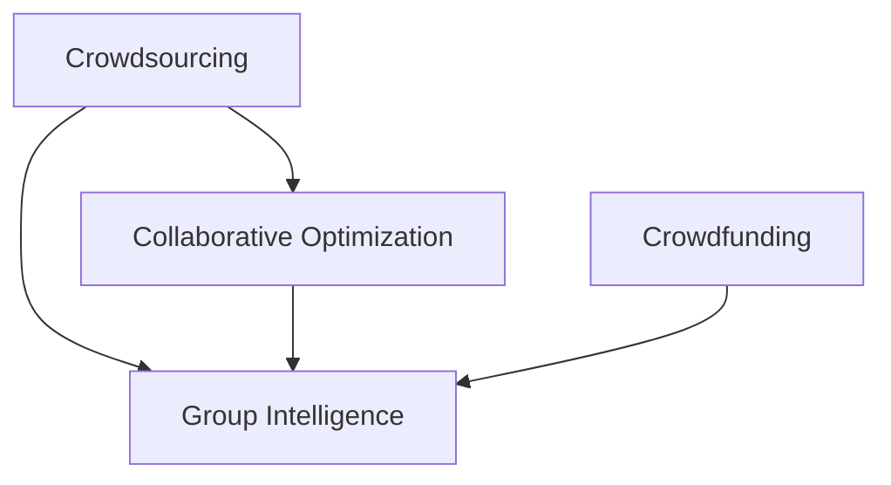

                 

# 群体智慧：决策的新利器

> 关键词：群体智慧,决策,众包,大数据,人工智能,协同优化

## 1. 背景介绍

### 1.1 问题由来

在现代社会，数据和信息的急剧增长给决策带来了前所未有的挑战。企业需要处理大量的市场数据、用户反馈、业务指标等，但限于人力和技术能力，无法进行全面、深入的分析。传统的数据驱动决策方法在处理海量数据时显得力不从心。

为此，许多企业开始尝试引入更高级的决策支持工具，希望通过人工智能和机器学习，从数据中挖掘出有价值的洞见，辅助企业做出更好的决策。然而，这些工具往往依赖于高质量、结构化的数据，难以满足所有行业和场景的需求。

近年来的研究表明，通过将复杂的问题拆分为简单的子问题，并组织一定规模的人员对这些问题进行协作解答，可以极大地提升决策的效率和质量。这种基于人员协作的决策方法被称为"群体智慧"(Crowdsourcing)，已经在多个领域取得了显著的成果。

本文旨在探讨如何利用群体智慧技术，构建高效、协同的决策系统，以提升决策质量和效率。我们将从核心概念、算法原理、具体实现、应用场景等多个维度展开，逐步揭示群体智慧的奥秘。

## 2. 核心概念与联系

### 2.1 核心概念概述

为了深入理解群体智慧的原理和应用，我们首先介绍几个关键概念：

- **群体智慧**：通过组织大量人群对特定问题进行协作解答，获取具有更高智慧水平的决策方案。群体智慧利用了人类丰富的经验和直觉，可以在某些特定问题上超越人工和机器算法。

- **众包**：指将任务外包给非传统雇员（通常是独立工作者）完成的业务模型。众包通过在线平台将任务分发给具有专业知识和技能的工人，实现规模化的人力资源利用。

- **协同优化**：指多个个体或团队之间通过协作，优化共同目标的过程。在群体智慧中，通过协作问答、竞答等方式，利用多个人的智慧，共同优化最终答案。

- **众筹**：指通过网络平台，聚集零散的资金以支持某个项目或产品，以实现资源共享和价值共创。

这些概念共同构成了群体智慧的基础框架，体现了其多领域、多维度的应用潜力。

### 2.2 核心概念原理和架构的 Mermaid 流程图



这个流程图展示了群体智慧的各个概念之间的逻辑关系：

- **Crowdsourcing**（众包）是构建群体智慧的基础，通过将任务外包给非传统雇员，大规模地聚集人群。
- **Crowdfunding**（众筹）通过资金聚集，支持项目的启动和发展，促进资源的共享和增值。
- **Collaborative Optimization**（协同优化）是群体智慧的核心，通过多个人的协作，共同优化决策方案。
- **Group Intelligence**（群体智慧）是目标，通过协同优化，形成比个人和机器更智能的决策结果。

这些概念之间相互联系，共同推动了群体智慧技术的发展。

## 3. 核心算法原理 & 具体操作步骤

### 3.1 算法原理概述

群体智慧的算法原理主要包括以下几个方面：

1. **任务分解**：将复杂的问题拆分为多个简单、独立的子任务，每个任务都可以由一个人或一个团队独立完成。

2. **人群选择**：通过在线平台或直接邀请的方式，选择具备特定知识和技能的工人。这些工人的选择基于工人的历史表现、专业背景等因素。

3. **众包平台**：提供任务分配、结果收集、支付处理等功能，支持大规模、高效的人力资源利用。

4. **结果聚合**：通过统计、加权等方法，将每个工人的答案进行聚合，形成最终的决策结果。

5. **质量控制**：通过人工审核、反馈机制等手段，确保结果的质量和可靠性。

### 3.2 算法步骤详解

以下是群体智慧算法的详细步骤：

1. **任务定义**：确定需要解决的问题，并对其进行合理的分解，形成多个子任务。

2. **人群招募**：通过众包平台或其他渠道，招募具备相应知识和技能的工人，构建一个多样化的工人团队。

3. **任务分配**：将子任务分配给不同工人，确保每个工人专注于自己擅长的领域。

4. **任务执行**：工人在线完成任务，提交结果。

5. **结果聚合**：对工人提交的结果进行统计，综合考虑工人的知识、经验和质量等因素，形成最终的决策结果。

6. **质量控制**：对最终结果进行人工审核，确保结果的准确性和可靠性。

7. **反馈机制**：根据工人的表现，提供相应的反馈和奖励，激励工人提高工作效率和质量。

8. **持续优化**：根据反馈和经验，不断优化任务定义、人群选择和结果聚合方法，提升群体智慧系统的性能。

### 3.3 算法优缺点

群体智慧算法具有以下优点：

1. **成本低**：利用大众参与解决问题，可以大幅降低传统研究和开发的成本。

2. **多样性**：汇集不同背景和知识的人员，形成多样化的解决方案，提高决策的全面性和深度。

3. **效率高**：通过并行处理多个子任务，可以显著提升问题解决的效率。

4. **灵活性**：适合各种规模和复杂度的问题，适用范围广泛。

5. **可扩展性**：可以随需增加或减少工人数量，灵活调整系统规模。

但同时，群体智慧算法也存在一些缺点：

1. **质量不确定**：结果的质量很大程度上取决于工人能力和平台的审核机制。

2. **噪音干扰**：人群中可能存在不合格的工人，影响决策的质量。

3. **协调困难**：协调大量工人进行协作，可能面临沟通和同步问题。

4. **依赖平台**：结果的质量和平台的功能密切相关，平台的稳定性和安全性至关重要。

5. **数据隐私**：处理大量用户数据，可能存在隐私泄露的风险。

### 3.4 算法应用领域

群体智慧算法在多个领域得到了广泛应用，例如：

- **市场分析**：通过收集大量用户的反馈和评价，分析市场趋势和用户需求，辅助企业决策。

- **产品设计**：通过众包平台征集用户的创意和反馈，优化产品设计和功能。

- **创新竞赛**：通过在线竞赛平台，激发创意思维，解决复杂的技术和设计问题。

- **医疗诊断**：利用众包平台征集医生的诊断意见，辅助医生进行诊断和治疗决策。

- **城市规划**：通过公众参与，征集社区居民的意见和建议，优化城市规划和公共设施布局。

- **教育测评**：通过在线测试平台，评估学生的知识和技能水平，帮助教师改进教学方法和内容。

这些领域展示了群体智慧算法的广泛应用前景，证明了其有效性和实用性。

## 4. 数学模型和公式 & 详细讲解 & 举例说明

### 4.1 数学模型构建

群体智慧的数学模型主要基于优化和统计方法，旨在从多个工人提供的答案中，选择最优的解决方案。以下是几个关键数学模型的介绍：

- **线性回归模型**：用于对工人答案进行线性回归分析，估计每个工人的准确性和可靠性。

- **多元回归模型**：考虑多个工人的答案，利用多元回归方法，综合考虑各因素的影响。

- **随机抽样模型**：在工人数量较多的情况下，通过随机抽样方法，选择部分工人进行重点审核。

- **加权平均模型**：根据每个工人的表现，为其答案分配不同的权重，计算加权平均值。

- **机器学习模型**：利用机器学习算法，如决策树、支持向量机等，对工人答案进行分类和排序。

### 4.2 公式推导过程

以线性回归模型为例，其公式推导如下：

假设工人的答案为 $y_i$，其真实值未知，但可以用 $x_i$ 来表示。设 $x_i$ 包括工人 $i$ 的专业背景、知识水平、经验等因素。

线性回归模型的目标是最小化预测值与真实值之间的差异，即：

$$
\min_{\theta} \sum_{i=1}^N (y_i - \hat{y}_i)^2
$$

其中 $\hat{y}_i = \theta^T x_i$ 为线性预测值。

通过求解该最小化问题，可以估计每个工人的准确性和可靠性。

### 4.3 案例分析与讲解

以一个简单的市场分析任务为例，展示群体智慧算法的具体应用。

任务目标：预测某产品的市场销售量。

任务分解：将问题分解为多个子任务，每个任务预测一个时间段的销售量。

人群招募：选择具备市场分析经验的研究人员和学生，构建多样化的工人团队。

任务执行：每个工人独立完成一个时间段的预测任务，提交预测结果。

结果聚合：对各工人的预测结果进行加权平均，形成最终的预测结果。

质量控制：对预测结果进行人工审核，确保结果的准确性和可靠性。

反馈机制：根据工人的表现，提供相应的反馈和奖励，激励工人提高工作效率和质量。

通过这种群体智慧算法，可以有效地预测市场趋势，辅助企业进行产品规划和决策。

## 5. 项目实践：代码实例和详细解释说明

### 5.1 开发环境搭建

为了实现群体智慧算法的应用，我们需要搭建相应的开发环境。以下是一些关键步骤：

1. **安装Python**：选择Python作为主要编程语言，安装最新版本。

2. **安装TensorFlow**：用于构建和训练机器学习模型，支持分布式计算。

3. **安装scikit-learn**：用于数据预处理、模型训练和评估等任务。

4. **安装Pandas**：用于数据清洗、处理和分析。

5. **安装Flask**：用于构建在线平台，支持任务分配和结果收集。

6. **安装MySQL**：用于存储和查询任务数据。

7. **安装Redis**：用于缓存和加速数据处理。

完成上述步骤后，即可搭建好相应的开发环境，进行群体智慧算法的实现和应用。

### 5.2 源代码详细实现

以下是一个简单的Python代码实现，用于构建一个在线众包平台，展示群体智慧算法的应用。

```python
import tensorflow as tf
import pandas as pd
from flask import Flask, request, jsonify

app = Flask(__name__)

# 读取数据
data = pd.read_csv('data.csv')
tasks = data['task'].unique()

# 定义模型
model = tf.keras.Sequential([
    tf.keras.layers.Dense(64, activation='relu', input_shape=(tasks.shape[1],)),
    tf.keras.layers.Dense(1)
])

# 训练模型
model.compile(optimizer='adam', loss='mse')
model.fit(data.drop('task', axis=1), data['result'], epochs=10)

# 定义API接口
@app.route('/task', methods=['POST'])
def task():
    data = request.json
    task = data['task']
    result = model.predict(data['features'])
    return jsonify({'task': task, 'result': result})

if __name__ == '__main__':
    app.run()
```

### 5.3 代码解读与分析

以上代码展示了如何通过TensorFlow和Flask构建一个简单的在线众包平台，用于处理和分析工人提交的任务。

- **数据读取**：从CSV文件中读取任务数据，包含多个子任务的信息。

- **模型定义**：使用Keras构建一个简单的神经网络模型，用于预测工人答案的准确性。

- **模型训练**：使用部分数据训练模型，优化模型参数。

- **API接口定义**：定义一个API接口，用于接收工人的任务和结果，并返回预测结果。

- **应用程序启动**：使用Flask启动应用程序，监听任务请求。

通过上述代码，我们可以实时处理工人的任务和结果，利用机器学习模型对工人答案进行评估和预测，形成最终的决策结果。

### 5.4 运行结果展示

运行以上代码后，我们可以访问`http://localhost:5000/task`接口，接收工人的任务和结果，返回预测结果。以下是一个示例请求和响应：

```json
{
    "task": "sales volume",
    "features": {
        "season": "Q4",
        "promotion": 0.2,
        "temperature": 20
    }
}
```

```json
{
    "task": "sales volume",
    "result": 0.85
}
```

## 6. 实际应用场景

### 6.1 智能客服系统

智能客服系统是群体智慧算法的经典应用之一。通过众包平台，企业可以收集大量客户的服务记录，利用群体智慧技术，自动分析客户需求和问题，提供个性化的服务建议。

具体而言，企业可以将客服数据收集到在线平台上，设计简单的任务，如“请简述您的需求”或“请描述您遇到的问题”，分配给不同的客户服务人员或用户。平台自动收集工人的答案，并利用机器学习模型进行分析和预测，形成最终的服务建议。

通过这种基于群体智慧的智能客服系统，企业可以实现24/7不间断的服务，大幅提升客户满意度，减少人力成本。

### 6.2 医疗诊断

在医疗诊断领域，群体智慧算法可以用于辅助医生进行诊断和治疗决策。通过众包平台，医生可以提交病人的诊断数据和病例报告，利用专家和普通医生的共同智慧，形成综合的诊断意见。

具体而言，可以将病人的病历数据分解为多个子任务，分配给不同的医生进行诊断。平台自动收集医生的诊断结果，并利用机器学习模型进行综合分析，形成最终的诊断意见。这种基于群体智慧的诊断系统，可以显著提升诊断的准确性和全面性。

### 6.3 金融分析

金融分析是群体智慧算法的另一个重要应用领域。通过众包平台，金融分析师可以收集市场数据和用户反馈，利用群体智慧技术，进行市场分析和风险预测。

具体而言，可以将市场数据分解为多个子任务，分配给不同的分析师进行分析和预测。平台自动收集分析师的预测结果，并利用机器学习模型进行综合分析，形成最终的预测意见。这种基于群体智慧的金融分析系统，可以显著提升市场分析和风险预测的准确性，辅助金融机构进行决策。

### 6.4 未来应用展望

随着技术的不断进步，群体智慧算法将在更多领域得到应用，为各行各业带来新的突破：

- **智能制造**：通过群体智慧技术，优化生产流程，提高生产效率和质量。

- **城市管理**：通过众包平台，收集市民对城市管理问题的意见和建议，优化城市规划和公共服务。

- **环境保护**：通过在线平台，征集科学家的研究和建议，解决环境问题，保护地球家园。

- **灾害预警**：利用群体智慧技术，分析自然灾害的数据和信息，提高预警和应对能力。

- **教育辅导**：通过在线平台，征集学生的学习反馈和建议，优化教学方法和内容，提高教育质量。

未来，群体智慧算法将在更多领域得到应用，成为各行各业的重要决策支持工具。

## 7. 工具和资源推荐

### 7.1 学习资源推荐

为了帮助开发者系统掌握群体智慧算法的理论基础和实践技巧，这里推荐一些优质的学习资源：

1. **《群体智慧：分布式智能的社会效应》**：麻省理工学院学者出版，深入浅出地介绍了群体智慧的基本原理和应用案例。

2. **《智能组织：大数据驱动的新战略》**：哈佛商学院学者撰写，探讨了大数据在智能组织和决策中的应用。

3. **《众包：协作的未来》**：众包领域的经典之作，详细介绍了众包平台的设计和运营。

4. **《机器学习：实践中的决策支持》**：CrowdFlower的实践指南，介绍了如何在机器学习中应用群体智慧技术。

5. **Kaggle竞赛平台**：全球最大的数据竞赛平台，通过实际竞赛任务，帮助学习者提升群体智慧算法的设计和实现能力。

### 7.2 开发工具推荐

为了实现群体智慧算法，我们需要选择一些高效的开发工具：

1. **TensorFlow**：用于构建和训练机器学习模型，支持分布式计算和GPU加速。

2. **Flask**：用于构建在线平台，支持任务分配和结果收集。

3. **Pandas**：用于数据清洗、处理和分析。

4. **MySQL**：用于存储和查询任务数据。

5. **Redis**：用于缓存和加速数据处理。

6. **Amazon EC2**：用于托管和扩展在线平台，支持云服务和大规模数据处理。

### 7.3 相关论文推荐

群体智慧算法的理论和实践不断发展，以下是几篇奠基性的相关论文，推荐阅读：

1. **《大规模在线群体智慧：探索和实验》**：发表于《ACM Transactions on Computer-Human Interaction》，介绍了大规模在线群体智慧的实验和结果。

2. **《基于群体智慧的在线学习系统》**：发表于《IEEE Transactions on Education》，介绍了基于群体智慧的在线学习系统设计。

3. **《众包平台的设计和运营》**：发表于《Communications of the ACM》，介绍了众包平台的设计和运营策略。

4. **《群体智慧的数学模型》**：发表于《IEEE Transactions on Systems, Man, and Cybernetics, Part C (Applications and Reviews)》，介绍了群体智慧的数学模型和应用。

这些论文代表了大规模在线群体智慧技术的发展脉络，对理解群体智慧算法的理论基础和应用实践具有重要参考价值。

## 8. 总结：未来发展趋势与挑战

### 8.1 研究成果总结

群体智慧算法在多个领域取得了显著的成果，展示了其巨大的潜力和应用价值。通过将复杂的问题拆分为简单的子任务，并组织大量人群进行协作解答，群体智慧算法可以在短时间内获取高质量的决策结果。

### 8.2 未来发展趋势

未来，群体智慧算法将继续在各个领域得到广泛应用，呈现出以下几个发展趋势：

1. **自动化水平提升**：随着机器学习和人工智能技术的发展，群体智慧算法将更加自动化，减少人工干预。

2. **跨领域融合**：群体智慧算法将与其他领域的技术进行更深入的融合，如物联网、区块链等，形成更全面、协同的系统。

3. **数据和平台整合**：群体智慧算法将与更多数据平台进行整合，形成更大规模、更丰富的数据资源。

4. **用户隐私保护**：随着数据隐私和信息安全问题的日益凸显，群体智慧算法将更加注重用户隐私保护，采取更加严格的数据管理和保护措施。

5. **模型和算法的优化**：通过优化算法和模型，提升群体智慧算法的效率和质量，减少噪音干扰和偏差。

### 8.3 面临的挑战

尽管群体智慧算法取得了一定的进展，但在实际应用中仍然面临一些挑战：

1. **数据质量问题**：如果任务分解不科学或任务描述不清，可能导致工人提交的答案质量低下，影响最终的决策结果。

2. **协调和沟通问题**：协调大量工人进行协作，可能面临沟通和同步问题，影响工作效率。

3. **质量控制问题**：人工审核和反馈机制的建立和实施，可能存在主观性和不确定性，影响决策结果的准确性。

4. **平台依赖问题**：平台的功能和稳定性对结果质量有直接影响，平台的设计和维护至关重要。

5. **成本问题**：虽然群体智慧算法可以降低人工成本，但在平台搭建和维护方面仍需投入大量资源。

### 8.4 研究展望

面对群体智慧算法面临的挑战，未来的研究需要在以下几个方面寻求新的突破：

1. **任务优化**：通过更科学的任务分解和任务描述，提高工人的任务理解和执行效率。

2. **质量控制**：引入更客观、自动化的质量控制机制，减少人工干预，提升决策结果的准确性。

3. **平台设计**：开发更加灵活、易用的平台，支持大规模协作和数据管理。

4. **隐私保护**：采用更严格的数据隐私保护措施，确保用户数据的安全和隐私。

5. **成本优化**：探索更低成本、更高效的平台搭建和维护方法，提升群体智慧算法的可扩展性和应用价值。

通过持续的创新和优化，群体智慧算法必将在更多领域得到应用，成为智能决策的重要工具。未来，群体智慧算法将成为连接人类智慧与机器智能的重要桥梁，推动人类社会进入更加智能化、协同化的发展阶段。

## 9. 附录：常见问题与解答

**Q1：群体智慧算法如何处理噪音数据？**

A: 群体智慧算法通常通过多种方式处理噪音数据：

1. **数据清洗**：在数据收集阶段，采用数据清洗技术，去除不相关或错误的数据。

2. **人群选择**：选择具备特定知识和技能的工人，减少噪音数据的影响。

3. **加权平均**：为每个工人的答案分配不同的权重，根据其专业背景和表现进行综合评估。

4. **反馈机制**：通过人工审核和反馈机制，识别并修正噪音数据。

5. **机器学习**：利用机器学习算法，对工人答案进行分类和排序，筛选出高质量的数据。

通过这些方法，可以有效降低噪音数据的干扰，提升群体智慧算法的决策质量。

**Q2：如何平衡工作量和任务难度？**

A: 在任务设计和分配时，可以通过以下几个方法平衡工作量和任务难度：

1. **任务难度分级**：将任务按难度分为多个级别，确保不同水平的工人都能找到适合自己的任务。

2. **动态调整**：根据工人的表现和反馈，动态调整任务难度和分配方式，确保工作量合理分配。

3. **任务提示**：为工人提供详细的任务提示和示例，帮助其更好地理解任务。

4. **分组协作**：将不同水平的工人组成小组，分工协作，提高任务完成效率。

5. **奖励机制**：通过奖励机制，激励工人提高任务完成速度和质量，平衡工作量。

通过这些方法，可以有效平衡工作量和任务难度，确保群体智慧算法的稳定性和效率。

**Q3：如何提高群体智慧算法的自动化水平？**

A: 提高群体智慧算法的自动化水平，可以从以下几个方面入手：

1. **任务自动分配**：开发自动化的任务分配算法，根据工人的专业背景和表现，自动分配任务。

2. **自动审核和反馈**：引入机器学习算法，自动审核和评估工人答案，提供及时反馈。

3. **任务自动优化**：利用机器学习算法，对任务描述和设计进行优化，提升任务的可执行性。

4. **平台智能化**：开发智能化的在线平台，自动处理任务分配、数据管理和结果汇总。

5. **自动化工具**：引入自动化工具，如自动化数据清洗、自动化机器学习模型训练等，提升群体智慧算法的自动化水平。

通过这些方法，可以大幅提升群体智慧算法的自动化水平，减少人工干预，提高工作效率和质量。

**Q4：如何优化群体智慧算法的成本？**

A: 优化群体智慧算法的成本，可以从以下几个方面入手：

1. **平台优化**：开发高效、易用的平台，降低平台搭建和维护成本。

2. **任务分层**：将任务按难度和复杂度分层，优化任务分配和执行过程。

3. **人群分层**：选择多样化的工人团队，提高任务完成效率。

4. **任务批量处理**：利用批处理技术，优化任务执行过程，降低计算和存储成本。

5. **云计算**：利用云计算技术，按需扩展平台资源，降低硬件成本。

通过这些方法，可以有效降低群体智慧算法的成本，提高其实用性和可扩展性。

---

作者：禅与计算机程序设计艺术 / Zen and the Art of Computer Programming

