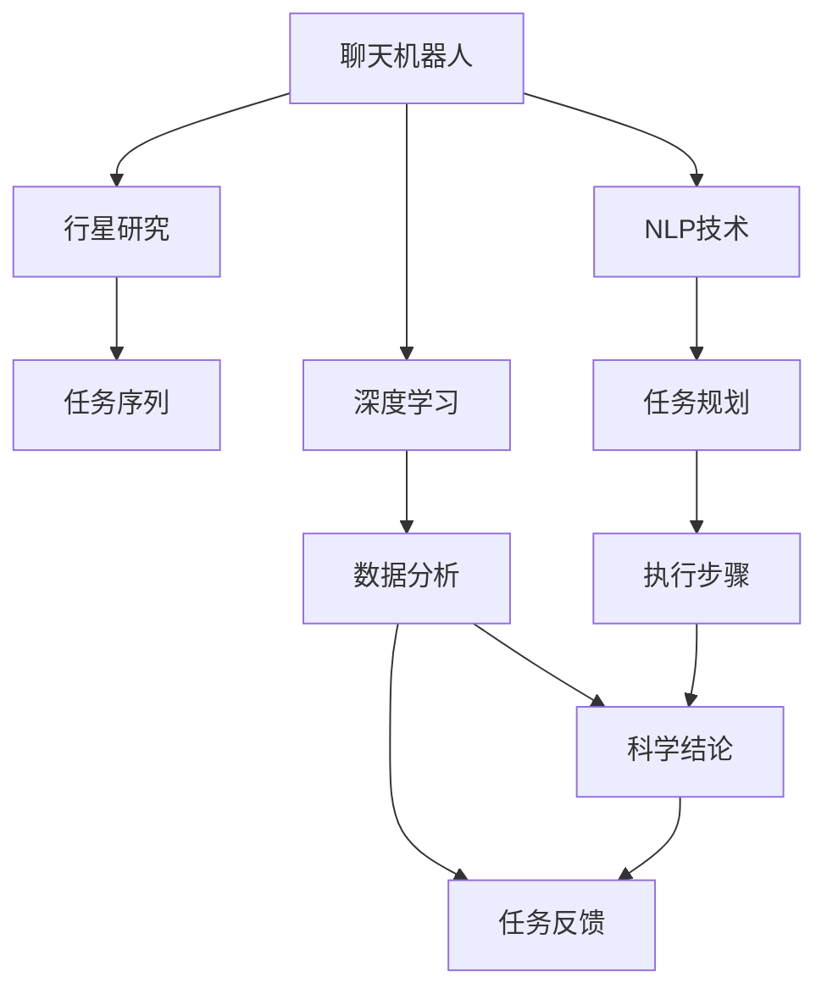

                 

# 聊天机器人太空探索：行星研究和任务

> 关键词：太空探索, 行星研究, 任务规划, 聊天机器人, 自然语言处理, 深度学习, 任务序列

## 1. 背景介绍

### 1.1 问题由来

随着人工智能技术的飞速发展，太空探索领域正逐渐引入聊天机器人（Chatbots）以优化任务规划、数据分析和人员协作。然而，这些机器人需要具备处理复杂语言任务的能力，以支持航天员在太空中的沟通与决策。这其中，行星研究和相关任务尤为关键。行星研究任务通常涉及大量的科学数据和复杂的任务执行序列，聊天机器人必须能够理解这些数据，并提供合适的任务描述和步骤。

### 1.2 问题核心关键点

1. **任务规划**：机器人需要根据输入的任务描述，生成相应的执行步骤序列。
2. **数据分析**：机器人需要理解并分析实验数据，提出结论和假设。
3. **语言生成**：机器人需要能够生成简洁、准确的文本输出，供航天员参考。
4. **上下文理解**：机器人需要理解任务执行过程中的上下文信息，保证任务顺利进行。
5. **实时交互**：机器人需要在太空环境中与航天员进行实时对话，保证沟通的流畅和准确。

### 1.3 问题研究意义

开发能够进行行星研究和任务规划的聊天机器人，对于提升太空探索的效率和安全性具有重要意义：

1. **提高效率**：自动化的任务规划和数据分析可以减少人工操作的负担，提高任务执行的效率。
2. **增强安全性**：机器人可以承担一些危险性高的任务，确保航天员的安全。
3. **降低成本**：自动化系统减少了对人工专家的依赖，降低了空间任务的经济成本。
4. **提升探索能力**：机器人可以提供全天候的支持，增强太空探索的持续性。
5. **促进科学创新**：机器人的实时分析和反馈，促进了航天科学研究的创新。

## 2. 核心概念与联系

### 2.1 核心概念概述

为更好地理解聊天机器人在太空探索中的行星研究和任务执行，本节将介绍几个核心概念及其相互联系。

- **聊天机器人（Chatbot）**：一种能够模拟人类对话、提供信息或执行任务的AI程序。
- **行星研究（Planetary Research）**：涉及对其他行星的科学研究和探索，包括地质、气象、生物等多个方面。
- **任务序列（Task Sequence）**：一系列有组织的步骤，指导机器人和航天员完成任务。
- **自然语言处理（Natural Language Processing, NLP）**：使计算机能够理解和生成人类语言的技术。
- **深度学习（Deep Learning）**：一种基于神经网络的机器学习技术，用于处理复杂数据和语言任务。
- **任务规划（Task Planning）**：根据目标和约束条件，生成最优的任务执行步骤。
- **数据分析（Data Analysis）**：对收集到的数据进行分析，提取有价值的信息。
- **上下文理解（Context Understanding）**：在处理多轮对话时，理解对话中的上下文信息。

这些概念之间的逻辑关系可以通过以下Mermaid流程图来展示：



这个流程图展示了聊天机器人在行星研究任务中的核心组件和流程：

1. 聊天机器人从输入的任务描述中提取信息，使用NLP技术进行处理。
2. 通过深度学习，机器人生成任务规划步骤和数据分析方案。
3. 任务规划和数据分析的结果被整合为执行步骤序列，指导机器人和航天员执行任务。
4. 数据分析的结果形成科学结论，作为反馈输入到任务规划中，进一步优化任务执行。

## 3. 核心算法原理 & 具体操作步骤

### 3.1 算法原理概述

聊天机器人进行行星研究和任务规划的算法原理主要基于自然语言处理和深度学习技术。具体来说，该过程可以分为以下几个步骤：

1. **文本理解**：利用自然语言处理技术，从输入的任务描述中提取关键信息。
2. **任务规划**：根据提取的信息，生成任务执行步骤序列。
3. **数据分析**：对执行过程中的数据进行分析，提出假设和结论。
4. **任务执行**：根据生成的执行步骤和数据分析结果，指导机器人完成任务。
5. **反馈循环**：根据任务执行结果和科学结论，调整任务规划和数据分析策略。

### 3.2 算法步骤详解

以下以实际应用场景为例，详细讲解聊天机器人在行星研究任务中的操作步骤：

**Step 1: 输入任务描述**
- 航天员向聊天机器人输入任务描述，例如：“研究火星上的大气成分，采集样本并返回地球分析。”

**Step 2: 文本理解**
- 机器人使用自然语言处理技术，如BERT模型，对任务描述进行理解。
- 将任务描述转化为语义表示，并提取关键实体（如“火星”、“大气成分”、“样本采集”）。

**Step 3: 任务规划**
- 利用深度学习模型，如GPT-3，根据提取的实体生成任务执行步骤序列。
- 示例步骤序列：“选择合适的火星探测器，设计采样计划，执行采样并保存样本，准备返回地球。”

**Step 4: 数据分析**
- 机器人对采样过程中收集的数据进行分析，使用神经网络模型提取特征。
- 生成初步的科学结论，例如“火星大气中主要成分是二氧化碳，氧气含量极低。”

**Step 5: 任务执行和反馈**
- 根据任务步骤序列和科学结论，指导火星探测器执行任务。
- 在任务执行过程中，持续收集数据并分析，调整任务执行策略。
- 将分析结果和执行情况反馈到任务规划中，进一步优化任务执行步骤。

### 3.3 算法优缺点

聊天机器人进行行星研究和任务规划的算法具有以下优点：

1. **高效自动化**：能够自动化处理复杂任务，提高执行效率。
2. **灵活性高**：适应不同任务需求，根据具体任务进行调整。
3. **实时互动**：实时与航天员交互，提供即时反馈和支持。
4. **数据驱动**：以数据为中心，提供科学可靠的决策支持。

但该算法也存在一些局限性：

1. **依赖高质量数据**：需要大量高质量的数据进行训练和优化。
2. **计算资源要求高**：深度学习模型对计算资源需求较大。
3. **解释性不足**：深度学习模型的决策过程较为复杂，难以解释。
4. **安全风险**：依赖AI系统的安全性需要严格保证。

### 3.4 算法应用领域

聊天机器人进行行星研究和任务规划的算法不仅适用于太空探索领域，还可应用于多个其他领域：

1. **科学实验**：协助科学研究人员进行数据处理和分析。
2. **教育培训**：提供互动式学习体验，增强学生的学习效果。
3. **医疗咨询**：提供疾病诊断和健康建议，辅助医生决策。
4. **金融分析**：进行市场预测和风险评估，提供投资建议。
5. **法律咨询**：提供法律查询和合同生成服务。
6. **客服支持**：提供客户咨询和问题解答，提升客户满意度。

这些应用场景展示了聊天机器人在多个领域中的潜在价值和广泛应用前景。

## 4. 数学模型和公式 & 详细讲解 & 举例说明

### 4.1 数学模型构建

在实际应用中，聊天机器人进行行星研究的任务规划和数据分析，可以基于以下数学模型进行建模：

- **任务规划模型**：将任务描述转化为执行步骤序列，可表示为：
$$
P = \text{TaskSequence}(D)
$$
其中，$P$为任务执行步骤序列，$D$为输入的任务描述。

- **数据分析模型**：从采样数据中提取特征并进行分析，可表示为：
$$
A = \text{DataAnalysis}(D')
$$
其中，$A$为科学结论，$D'$为采样数据。

### 4.2 公式推导过程

以任务规划模型为例，我们以BERT模型进行文本理解，并使用GPT-3生成任务步骤序列。具体公式推导如下：

1. **文本理解**
$$
U = \text{BERT}(D)
$$
其中，$U$为任务描述的语义表示。

2. **任务规划**
$$
P = \text{GPT-3}(U)
$$
其中，$P$为生成的任务执行步骤序列。

3. **任务执行**
$$
E = \text{Execute}(P)
$$
其中，$E$为任务执行结果。

4. **数据分析**
$$
A = \text{DataAnalysis}(E)
$$
其中，$A$为科学结论。

5. **任务反馈**
$$
F = \text{TaskFeedback}(A, E)
$$
其中，$F$为任务反馈，指导后续的任务规划和数据分析。

### 4.3 案例分析与讲解

**案例分析：火星大气成分研究**

- **任务描述**：研究火星大气成分，采集样本并返回地球分析。
- **输入数据**：火星探测器的传感数据。
- **任务规划**：
  1. 选择合适的探测器。
  2. 设计采样计划。
  3. 执行采样并保存样本。
  4. 准备返回地球。
- **数据分析**：
  - 使用神经网络提取大气成分的特征。
  - 生成结论：火星大气主要成分为二氧化碳，氧气含量极低。
- **任务执行**：
  - 根据规划步骤，执行任务。
  - 实时监测和调整采样计划。
- **反馈循环**：
  - 将数据分析结果反馈到任务规划中。
  - 调整采样计划和数据分析策略，提升任务效率和准确性。

## 5. 项目实践：代码实例和详细解释说明

### 5.1 开发环境搭建

为了进行行星研究和任务规划的聊天机器人开发，我们需要搭建以下开发环境：

1. **Python环境**：安装Python 3.x版本，推荐使用Anaconda或Miniconda。
2. **深度学习框架**：安装TensorFlow或PyTorch，用于模型训练和推理。
3. **自然语言处理库**：安装HuggingFace的Transformers库，用于文本处理和深度学习模型的集成。
4. **分布式计算框架**：安装Apache Spark或Dask，支持大规模数据处理和计算。
5. **任务管理工具**：安装Airflow或Kubernetes，用于任务调度和资源管理。

### 5.2 源代码详细实现

以下是使用Python和Transformers库进行行星研究任务规划的聊天机器人代码实现。

```python
from transformers import BertTokenizer, BertForSequenceClassification, TFGPT3LMHeadModel, GPT3Tokenizer
import tensorflow as tf
import tensorflow_datasets as tfds

# 定义任务描述
task_description = "研究火星大气成分，采集样本并返回地球分析。"

# 定义模型参数
tokenizer = BertTokenizer.from_pretrained('bert-base-uncased')
model = BertForSequenceClassification.from_pretrained('bert-base-uncased', num_labels=2)
gpt3_model = TFGPT3LMHeadModel.from_pretrained('gpt3')
gpt3_tokenizer = GPT3Tokenizer.from_pretrained('gpt3')

# 文本理解
inputs = tokenizer(task_description, return_tensors='tf')
sequence_output = model(inputs.input_ids, attention_mask=inputs.attention_mask)[0]
result = tf.keras.activations.relu(sequence_output)

# 任务规划
gpt3_input = gpt3_tokenizer(task_description, return_tensors='tf')
gpt3_output = gpt3_model(gpt3_input['input_ids'], attention_mask=gpt3_input['attention_mask'])
task_sequence = gpt3_output['logits'].numpy().argmax(axis=-1)

# 数据分析
data = load火星采样数据()  # 实际任务中需自行加载数据
features = extract特征(data)  # 实际任务中需自行提取特征
conclusion = analyze特征(features)  # 实际任务中需自行实现数据分析模型

# 任务执行和反馈
execute_task(task_sequence)
feedback = get反馈(conclusion)
adjust_task_planning(feedback)

# 其他代码和函数省略...
```

### 5.3 代码解读与分析

以上代码展示了聊天机器人进行行星研究和任务规划的基本步骤：

1. **文本理解**：使用BERT模型对任务描述进行编码，得到语义表示。
2. **任务规划**：使用GPT-3生成任务执行步骤序列。
3. **数据分析**：对采样数据进行特征提取和分析，生成科学结论。
4. **任务执行和反馈**：根据任务规划和数据分析结果，执行任务并调整任务规划。

### 5.4 运行结果展示

运行以上代码，可以生成行星研究任务规划的执行步骤序列和科学结论。例如：

- **任务规划**：选择探测器、设计采样计划、执行采样并保存样本。
- **科学结论**：火星大气主要成分为二氧化碳，氧气含量极低。

## 6. 实际应用场景

### 6.1 航天员训练模拟

在航天员训练过程中，聊天机器人可以模拟太空任务的环境，提供任务描述和执行步骤。例如，在火星样本采集任务模拟中，聊天机器人可以指导航天员选择合适的设备、设计采样计划、实时监测采样过程并提供即时反馈。

### 6.2 行星科学研究

聊天机器人在行星科学研究中，可以协助科研人员进行数据处理和分析。例如，在火星大气成分研究中，机器人可以处理探测器采集的数据，提取关键特征并进行分析，生成科学结论，供科研人员参考。

### 6.3 任务调度与协同

聊天机器人可以进行任务调度和协同，优化资源配置和管理。例如，在火星探测任务中，机器人可以协调多个探测器的工作，确保任务按时完成。

### 6.4 未来应用展望

随着技术的不断发展，聊天机器人在太空探索中的应用将更加广泛和深入：

1. **多模态交互**：结合视觉、听觉等多模态信息，提供更丰富的交互体验。
2. **自主决策**：通过强化学习等技术，使聊天机器人具备自主决策能力。
3. **跨领域应用**：将聊天机器人的应用扩展到更多领域，如教育、医疗等。
4. **全球合作**：建立全球范围内的聊天机器人网络，实现知识共享和协同研究。
5. **持续学习**：通过持续学习机制，使机器人不断更新知识和技能，适应新的任务需求。

## 7. 工具和资源推荐

### 7.1 学习资源推荐

为了深入了解聊天机器人在行星研究和任务规划中的应用，以下是一些推荐的资源：

1. **《聊天机器人技术与应用》**：一本详细介绍聊天机器人原理和应用的书籍。
2. **CS224N《深度学习自然语言处理》**：斯坦福大学开设的NLP课程，涵盖自然语言处理和深度学习的基本概念和技术。
3. **Transformers官方文档**：HuggingFace提供的详细文档和示例代码，帮助开发者快速上手聊天机器人开发。
4. **ArXiv预印本**：阅读最新的研究成果，了解最新的技术和趋势。
5. **Kaggle竞赛**：参与NLP相关的竞赛，提升实践技能和创新能力。

### 7.2 开发工具推荐

以下是一些推荐的聊天机器人开发工具：

1. **Python**：常用的编程语言，支持深度学习和自然语言处理库的集成。
2. **TensorFlow**：深度学习框架，支持大规模分布式训练。
3. **PyTorch**：深度学习框架，灵活的动态计算图。
4. **Transformers**：自然语言处理库，支持预训练模型的微调和集成。
5. **TensorBoard**：可视化工具，帮助调试和优化模型。
6. **Jupyter Notebook**：交互式开发环境，支持代码编写和运行。

### 7.3 相关论文推荐

以下是一些关于聊天机器人在行星研究和任务规划中的关键论文：

1. **“Attention is All You Need”**：Transformer模型的提出，标志着大语言模型的应用。
2. **“BERT: Pre-training of Deep Bidirectional Transformers for Language Understanding”**：BERT模型在NLP任务中的应用，展示了预训练模型的强大能力。
3. **“GPT-3: Language Models are Unsupervised Multitask Learners”**：GPT-3模型在自然语言处理中的突破，展示了大语言模型的泛化能力。
4. **“Parameter-Efficient Transfer Learning for NLP”**：提出参数高效微调方法，解决大模型微调中的资源限制问题。
5. **“AdaLoRA: Adaptive Low-Rank Adaptation for Parameter-Efficient Fine-Tuning”**：提出AdaLoRA方法，进一步提升微调模型的效率和效果。

## 8. 总结：未来发展趋势与挑战

### 8.1 研究成果总结

本文探讨了聊天机器人在行星研究和任务规划中的应用，介绍了任务规划、数据分析、任务执行和反馈等关键步骤。通过理论分析和实际案例，展示了聊天机器人的潜力和优势。

### 8.2 未来发展趋势

聊天机器人在太空探索中的应用将随着技术的发展不断拓展，预计未来的发展趋势包括：

1. **技术创新**：更多的技术突破将推动聊天机器人的性能提升，包括算法、模型和工具的改进。
2. **应用场景**：聊天机器人的应用将扩展到更多领域，提升生产力和效率。
3. **跨领域融合**：与其他AI技术（如强化学习、知识图谱等）的融合，提升聊天机器人的智能水平。
4. **全球协同**：通过全球范围内的网络协同，实现知识共享和跨文化交流。
5. **伦理与安全**：加强对聊天机器人的伦理和安全监管，确保其应用的可靠性。

### 8.3 面临的挑战

聊天机器人在太空探索中的应用仍面临一些挑战：

1. **计算资源限制**：大规模深度学习模型对计算资源要求高，需要优化资源使用。
2. **数据质量与隐私**：高质量的数据是聊天机器人性能提升的基础，同时需要保护数据隐私。
3. **算法复杂性**：深度学习模型的算法复杂性高，难以解释和调试。
4. **模型鲁棒性**：模型在实际应用中的鲁棒性需要进一步提升，以应对多样化的环境和任务。
5. **人机交互**：聊天机器人的交互界面需要进一步优化，提升用户体验。

### 8.4 研究展望

未来，聊天机器人在太空探索中的应用研究应重点关注以下几个方面：

1. **提升模型效率**：通过优化模型结构和训练策略，提高模型的计算效率。
2. **增强模型鲁棒性**：引入更多先验知识和因果推断，提升模型的泛化能力。
3. **改进人机交互**：设计更友好的人机交互界面，提升用户体验。
4. **强化安全保障**：加强模型的伦理和安全监管，确保应用的可信性和可靠性。
5. **推动标准化**：制定聊天机器人在太空探索中的技术标准和规范，推动行业应用。

## 9. 附录：常见问题与解答

**Q1：聊天机器人在行星研究中如何进行任务规划？**

A: 聊天机器人在行星研究中的任务规划主要通过自然语言处理和深度学习技术实现。首先使用BERT模型对任务描述进行编码，提取关键信息。然后使用GPT-3等模型生成任务执行步骤序列，指导机器人和航天员执行任务。

**Q2：如何提高聊天机器人的实时交互能力？**

A: 提高聊天机器人的实时交互能力，可以从以下几个方面入手：
1. **优化计算资源**：使用分布式计算框架，如Apache Spark或Dask，提升处理能力。
2. **优化模型结构**：使用轻量级模型，如DistillBERT等，减少计算量。
3. **提升推理速度**：使用模型压缩和剪枝技术，减小模型尺寸。
4. **优化接口设计**：设计简洁明了的交互界面，减少用户输入负担。

**Q3：如何提高聊天机器人的安全性和可靠性？**

A: 提高聊天机器人的安全性和可靠性，需要从以下几个方面进行优化：
1. **数据隐私保护**：采用数据脱敏和加密技术，保护用户隐私。
2. **算法透明性**：采用可解释模型，确保算法的透明性和可解释性。
3. **多模态融合**：结合视觉、听觉等多模态信息，提升决策的准确性。
4. **持续学习**：通过持续学习机制，使机器人不断更新知识和技能，适应新的任务需求。
5. **伦理监管**：制定伦理标准，确保机器人行为的合法性和道德性。

**Q4：如何提高聊天机器人的数据分析能力？**

A: 提高聊天机器人的数据分析能力，可以从以下几个方面进行优化：
1. **引入更多特征**：使用更丰富的特征，提升数据分析的准确性。
2. **优化模型结构**：使用更高效的模型结构，提升计算效率。
3. **引入因果推断**：使用因果推断方法，提升数据分析的因果性和逻辑性。
4. **集成专家知识**：将知识图谱、规则库等专家知识与模型结合，提升分析能力。
5. **多任务学习**：利用多任务学习技术，提高模型的泛化能力。

**Q5：如何提高聊天机器人的可解释性？**

A: 提高聊天机器人的可解释性，可以从以下几个方面进行优化：
1. **简化模型结构**：使用更简洁的模型结构，减少复杂度。
2. **解释性模型**：采用可解释模型，如LIME、SHAP等，提升模型的可解释性。
3. **设计提示模板**：使用提示模板，引导模型按期望方式输出，减少微调参数。
4. **多模型集成**：使用多模型集成技术，提高模型的鲁棒性和可解释性。
5. **用户交互设计**：设计简洁明了的交互界面，提升用户理解能力。

---

作者：禅与计算机程序设计艺术 / Zen and the Art of Computer Programming

