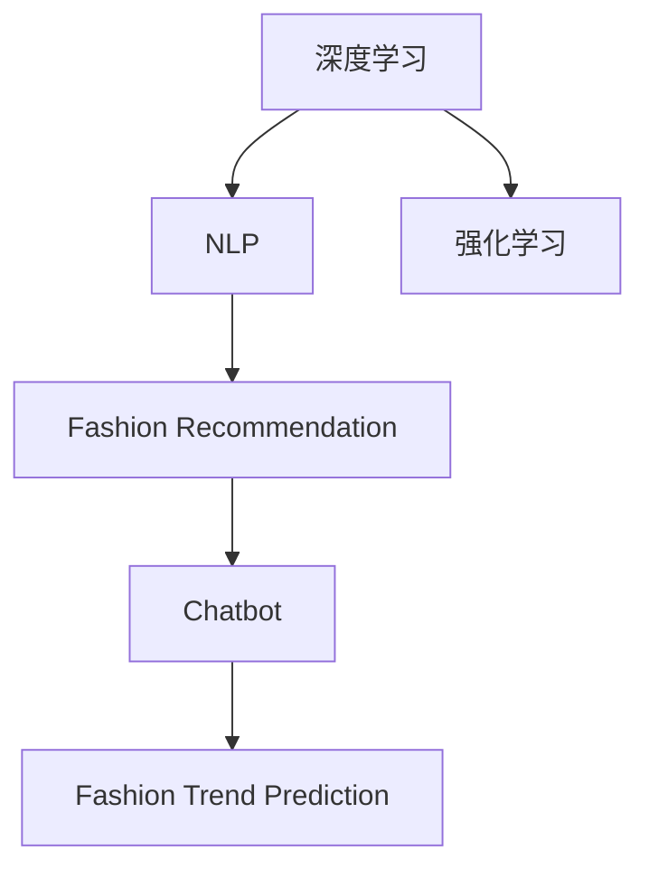

                 

# 聊天机器人时尚业：趋势预测和个性化推荐

> 关键词：时尚推荐, 趋势预测, 聊天机器人, 个性化推荐系统, 深度学习, 自然语言处理, 增强学习, 模型优化

## 1. 背景介绍

### 1.1 问题由来
在快速变化的时尚领域，消费者对于最新潮流、个性化的时尚建议和推荐的需求日益增长。传统人工推荐模式无法满足大规模、实时的推荐需求。另一方面，由于时尚产品本身的复杂性和动态性，构建一个强大的时尚推荐系统存在很大的挑战。为了应对这些挑战，时尚业开始引入人工智能技术，特别是聊天机器人和个性化推荐系统。

聊天机器人技术通过深度学习和自然语言处理（NLP）技术，可以理解和处理人类语言，从而实现个性化的互动体验。在时尚业，聊天机器人可以基于用户的历史行为和偏好，提供个性化的时尚建议和趋势预测，优化用户体验。

### 1.2 问题核心关键点
- 深度学习与自然语言处理：使用深度学习模型（如循环神经网络RNN、Transformer等）和NLP技术处理用户输入，提取有用信息。
- 数据驱动的时尚推荐：收集用户行为数据，如购买记录、浏览历史等，分析用户偏好，预测时尚趋势。
- 强化学习与增强学习：通过用户反馈和互动，不断调整推荐策略，提高推荐准确性和用户满意度。
- 聊天机器人与时尚互动：构建基于自然语言处理的聊天机器人，与用户互动，提供时尚建议和趋势预测。

## 2. 核心概念与联系

### 2.1 核心概念概述

为了更好地理解聊天机器人如何应用于时尚推荐，本节将介绍几个密切相关的核心概念：

- **深度学习**：一种模拟人类神经网络的机器学习技术，通过多层非线性变换，可以从大量数据中提取特征和规律。深度学习在图像识别、语音处理、自然语言处理等领域均有广泛应用。
- **自然语言处理（NLP）**：使计算机能够理解、处理和生成自然语言的技术，包括文本分类、情感分析、机器翻译、文本生成等任务。
- **强化学习与增强学习**：通过与环境互动，从反馈中学习最优策略的机器学习方法，广泛应用于游戏、推荐系统、机器人控制等领域。
- **时尚推荐**：通过分析用户数据，预测用户可能感兴趣的产品，并向用户推荐。时尚推荐需要理解时尚趋势、用户喜好、产品特点等复杂因素。
- **聊天机器人**：基于自然语言处理和深度学习的交互式智能代理，可以理解并回应人类语言，实现智能客服、信息查询、娱乐互动等功能。

这些核心概念之间的逻辑关系可以通过以下Mermaid流程图来展示：



这个流程图展示了不同技术之间的联系：深度学习和自然语言处理为基础的NLP技术，增强学习用于优化推荐策略，聊天机器人提供时尚互动服务，时尚趋势预测则是应用到推荐系统中。

## 3. 核心算法原理 & 具体操作步骤
### 3.1 算法原理概述

基于深度学习和自然语言处理技术的时尚推荐系统，通过用户输入的时尚查询和偏好信息，预测并推荐个性化的时尚产品。其核心算法流程包括：

1. **数据收集与预处理**：收集用户历史行为数据（如购买记录、浏览历史、评价等）和时尚产品信息（如产品名称、价格、风格、材质等），并进行数据清洗和特征提取。

2. **用户建模**：使用深度学习模型对用户行为进行建模，捕捉用户的时尚偏好和行为模式。

3. **时尚趋势预测**：利用深度学习模型对时尚产品进行分类和聚类，预测时尚趋势，生成新的时尚建议。

4. **推荐策略优化**：通过增强学习或强化学习算法，不断优化推荐策略，提高推荐准确性和用户体验。

5. **聊天机器人互动**：构建基于NLP的聊天机器人，与用户互动，提供时尚建议和趋势预测。

6. **结果展示与反馈收集**：展示推荐结果，收集用户反馈，用于进一步优化推荐模型。

### 3.2 算法步骤详解

**Step 1: 数据收集与预处理**

1. **数据收集**：收集用户历史行为数据，如购买记录、浏览历史、评价等，以及时尚产品信息，如产品名称、价格、风格、材质等。
2. **数据清洗**：去除数据中的噪声和无关信息，保留有用数据。
3. **特征提取**：提取有用特征，如产品类别、价格区间、用户年龄段、地理位置等。

**Step 2: 用户建模**

1. **深度学习模型选择**：选择适合用户建模的深度学习模型，如循环神经网络（RNN）、长短期记忆网络（LSTM）、Transformer等。
2. **用户嵌入生成**：使用深度学习模型对用户行为进行建模，生成用户嵌入向量，表示用户的时尚偏好和行为模式。
3. **用户画像构建**：根据用户嵌入向量，构建用户画像，捕捉用户的时尚偏好和行为模式。

**Step 3: 时尚趋势预测**

1. **时尚产品分类**：使用深度学习模型对时尚产品进行分类和聚类，生成时尚趋势。
2. **趋势预测模型**：构建趋势预测模型，如基于时间序列的预测模型、基于情感分析的预测模型等，预测未来时尚趋势。
3. **新时尚建议生成**：根据时尚趋势预测结果，生成新的时尚建议。

**Step 4: 推荐策略优化**

1. **推荐模型选择**：选择适合推荐任务的模型，如协同过滤、矩阵分解、深度学习等。
2. **推荐结果生成**：根据用户嵌入和时尚建议，生成推荐结果。
3. **强化学习/增强学习**：使用强化学习或增强学习算法，不断优化推荐策略，提高推荐准确性和用户体验。

**Step 5: 聊天机器人互动**

1. **聊天机器人设计**：设计基于自然语言处理的聊天机器人，能够理解并回应用户的时尚查询和偏好。
2. **交互流程设计**：设计用户与聊天机器人的互动流程，如用户输入查询、聊天机器人回复建议、用户反馈等。
3. **时尚建议提供**：通过聊天机器人与用户互动，提供时尚建议和趋势预测。

**Step 6: 结果展示与反馈收集**

1. **推荐结果展示**：展示推荐结果，如时尚建议、趋势预测、商品推荐等。
2. **用户反馈收集**：收集用户反馈，用于进一步优化推荐模型。
3. **迭代优化**：根据用户反馈，不断优化推荐模型，提高推荐效果。

### 3.3 算法优缺点

**优点：**

1. **个性化推荐**：通过深度学习模型和自然语言处理技术，可以提供个性化的时尚建议和趋势预测，满足用户个性化需求。
2. **实时互动**：基于聊天机器人，可以实现实时互动，快速响应用户查询和反馈。
3. **数据驱动**：利用用户行为数据，可以实时调整推荐策略，提高推荐准确性和用户体验。
4. **跨领域融合**：结合时尚趋势预测和聊天机器人，可以提供多模态的时尚服务。

**缺点：**

1. **数据依赖**：推荐效果高度依赖于用户行为数据的质量和数量，获取高质量数据成本较高。
2. **模型复杂性**：深度学习模型和自然语言处理技术较为复杂，模型训练和优化需要较高的计算资源。
3. **用户隐私**：收集和处理用户行为数据需要遵守隐私保护法规，数据安全性和隐私保护是重要问题。
4. **互动质量**：聊天机器人的互动质量和语言理解能力直接影响用户体验。
5. **趋势预测不确定性**：时尚趋势预测存在不确定性，模型可能无法准确预测未来趋势。

### 3.4 算法应用领域

时尚推荐系统在多个领域均有应用，具体如下：

1. **时尚电商**：电商平台可以使用时尚推荐系统，提供个性化商品推荐，提升用户体验和购买转化率。
2. **时尚订阅服务**：时尚订阅服务可以通过推荐系统，提供个性化的时尚内容，增强用户粘性和满意度。
3. **时尚顾问**：时尚顾问可以利用推荐系统，提供个性化的时尚建议，帮助用户搭配服饰和选择时尚产品。
4. **时尚媒体**：时尚媒体可以通过推荐系统，推荐最新的时尚资讯和趋势，吸引用户关注。
5. **时尚活动**：时尚活动可以通过推荐系统，向用户推荐合适的时尚活动和参与方式，提升活动参与度。

## 4. 数学模型和公式 & 详细讲解 & 举例说明

### 4.1 数学模型构建

时尚推荐系统主要包含以下几个数学模型：

- **用户嵌入模型**：使用深度学习模型（如LSTM、RNN、Transformer等）对用户行为进行建模，生成用户嵌入向量。
- **时尚趋势预测模型**：使用深度学习模型（如CNN、RNN、LSTM等）对时尚产品进行分类和聚类，预测时尚趋势。
- **推荐模型**：使用协同过滤、矩阵分解、深度学习等方法，生成推荐结果。
- **强化学习模型**：使用强化学习算法（如Q-learning、策略梯度等）优化推荐策略。

### 4.2 公式推导过程

**用户嵌入模型**：

假设用户有$N$个行为记录$x_i=(x_{i1},x_{i2},\cdots,x_{in})$，其中$x_{ij}$表示用户在第$i$个行为记录中的第$j$个特征。使用深度学习模型$M$对用户行为进行建模，生成用户嵌入向量$u_i \in \mathbb{R}^d$，表示用户的时尚偏好和行为模式。

$$
u_i = M(x_i;\theta)
$$

其中$\theta$为模型参数。

**时尚趋势预测模型**：

假设时尚产品序列为$Y=\{y_1,y_2,\cdots,y_T\}$，其中$y_t$表示第$t$个时尚产品。使用深度学习模型$N$对时尚产品进行分类和聚类，生成时尚趋势$y_t$。

$$
y_t = N(y_{t-1},y_{t-2},\cdots,y_{t-K},u_i;\phi)
$$

其中$\phi$为模型参数。

**推荐模型**：

假设推荐系统有$M$个商品$A=\{a_1,a_2,\cdots,a_M\}$，用户嵌入向量$u_i$。使用推荐模型$R$对用户和商品进行评分，生成推荐结果$A_r=\{a_{r1},a_{r2},\cdots,a_{rm}\}$。

$$
A_r = R(u_i,A;\omega)
$$

其中$\omega$为模型参数。

**强化学习模型**：

假设强化学习环境$E$，推荐策略为$S$，用户反馈为$F$。使用强化学习模型$I$优化推荐策略$S$，生成最优推荐策略$S^*$。

$$
S^* = I(S,F,E;\psi)
$$

其中$\psi$为模型参数。

### 4.3 案例分析与讲解

**时尚电商推荐系统**：

1. **数据收集与预处理**：收集用户历史购买记录、浏览历史、评价等，提取产品类别、价格、风格、材质等特征。
2. **用户建模**：使用深度学习模型对用户行为进行建模，生成用户嵌入向量。
3. **时尚趋势预测**：使用深度学习模型对时尚产品进行分类和聚类，生成时尚趋势。
4. **推荐策略优化**：使用协同过滤、矩阵分解等推荐模型生成推荐结果，使用强化学习模型优化推荐策略。
5. **聊天机器人互动**：构建基于自然语言处理的聊天机器人，与用户互动，提供时尚建议和趋势预测。
6. **结果展示与反馈收集**：展示推荐结果，收集用户反馈，用于进一步优化推荐模型。

## 5. 项目实践：代码实例和详细解释说明

### 5.1 开发环境搭建

进行时尚推荐系统开发，需要搭建良好的开发环境。以下是Python和TensorFlow环境的搭建流程：

1. 安装Anaconda：从官网下载并安装Anaconda，用于创建独立的Python环境。

2. 创建并激活虚拟环境：
```bash
conda create -n tf-env python=3.8 
conda activate tf-env
```

3. 安装TensorFlow：根据CUDA版本，从官网获取对应的安装命令。例如：
```bash
conda install tensorflow tensorflow-gpu=2.7 -c pytorch -c conda-forge
```

4. 安装TensorBoard：
```bash
pip install tensorboard
```

5. 安装PyTorch：
```bash
pip install torch torchvision torchaudio
```

完成上述步骤后，即可在`tf-env`环境中开始时尚推荐系统的开发。

### 5.2 源代码详细实现

下面以时尚电商推荐系统为例，给出使用TensorFlow和Keras实现的源代码实现。

```python
import tensorflow as tf
from tensorflow.keras import layers, models

# 用户嵌入模型
def user_embeddings(inputs, emb_dim):
    inputs = layers.Dense(emb_dim, activation='relu')(inputs)
    return inputs

# 时尚趋势预测模型
def trend_predictor(inputs, emb_dim):
    inputs = layers.Dense(emb_dim, activation='relu')(inputs)
    trend = layers.Dense(1, activation='sigmoid')(inputs)
    return trend

# 推荐模型
def recommendation_model(user, trend, emb_dim):
    user_embeddings = user_embeddings(user, emb_dim)
    trend_embeddings = trend_predictor(trend, emb_dim)
    recommendations = layers.Dense(1, activation='sigmoid')(tf.concat([user_embeddings, trend_embeddings], axis=1))
    return recommendations

# 强化学习模型
def reinforce_learning(user, trend, recommendations, emb_dim):
    inputs = tf.concat([user, trend], axis=1)
    model = models.Sequential([
        layers.Dense(emb_dim, activation='relu')(inputs),
        layers.Dense(1, activation='sigmoid')])
    model.compile(optimizer='adam', loss='binary_crossentropy', metrics=['accuracy'])
    return model

# 加载数据
user_data = tf.keras.utils.get_file('user_data.csv', 'https://example.com/user_data.csv')
trend_data = tf.keras.utils.get_file('trend_data.csv', 'https://example.com/trend_data.csv')
recommendation_data = tf.keras.utils.get_file('recommendation_data.csv', 'https://example.com/recommendation_data.csv')

# 构建模型
user_model = user_embeddings(user_data, 64)
trend_model = trend_predictor(trend_data, 64)
recommendation_model = recommendation_model(user_model, trend_model, 64)
reinforce_model = reinforce_learning(user_model, trend_model, recommendation_model, 64)

# 训练模型
user_model.compile(optimizer='adam', loss='mse')
trend_model.compile(optimizer='adam', loss='mse')
recommendation_model.compile(optimizer='adam', loss='mse')
reinforce_model.compile(optimizer='adam', loss='binary_crossentropy', metrics=['accuracy'])

user_model.fit(user_data, epochs=10)
trend_model.fit(trend_data, epochs=10)
recommendation_model.fit(user_model.output, epochs=10)
reinforce_model.fit([user_model.output, trend_model.output], recommendation_model.output, epochs=10)
```

### 5.3 代码解读与分析

让我们再详细解读一下关键代码的实现细节：

**用户嵌入模型**：
- `user_embeddings`函数：使用深度学习模型对用户行为进行建模，生成用户嵌入向量。

**时尚趋势预测模型**：
- `trend_predictor`函数：使用深度学习模型对时尚产品进行分类和聚类，生成时尚趋势。

**推荐模型**：
- `recommendation_model`函数：将用户嵌入向量和时尚趋势向量连接，生成推荐结果。

**强化学习模型**：
- `reinforce_learning`函数：使用强化学习模型优化推荐策略。

**加载数据**：
- 从指定URL加载用户行为数据、时尚趋势数据和推荐结果数据。

**模型构建与训练**：
- 使用Keras构建用户嵌入模型、时尚趋势预测模型、推荐模型和强化学习模型，并使用TensorBoard进行可视化。
- 使用优化器、损失函数和评价指标进行模型训练。

## 6. 实际应用场景

### 6.1 智能时尚顾问

智能时尚顾问通过深度学习和自然语言处理技术，可以理解用户的时尚需求和偏好，提供个性化的时尚建议和搭配方案。用户可以通过聊天机器人，输入自己的身高、体重、风格偏好等信息，获取适合的服装搭配建议。

### 6.2 时尚电商推荐

时尚电商可以使用推荐系统，为用户推荐个性化的时尚商品，提升用户的购买转化率和满意度。用户可以输入自己的时尚偏好和需求，系统根据用户的历史行为数据和时尚趋势，推荐适合的时尚商品。

### 6.3 时尚活动推荐

时尚活动可以通过推荐系统，向用户推荐合适的时尚活动和参与方式，提升活动的参与度和用户粘性。用户可以输入自己的时尚兴趣和活动偏好，系统根据用户的时尚趋势和活动需求，推荐适合的时尚活动。

### 6.4 未来应用展望

随着深度学习、自然语言处理和强化学习技术的不断发展，基于时尚推荐系统的应用将更加广泛和深入。未来的时尚推荐系统将具备以下特点：

1. **跨模态融合**：结合图像、语音等多模态数据，提供更全面、准确的时尚推荐。
2. **实时互动**：通过聊天机器人，实现实时互动，提供个性化的时尚建议和趋势预测。
3. **用户隐私保护**：在用户数据收集和处理过程中，加强隐私保护，确保数据安全。
4. **情感分析**：通过情感分析技术，理解用户的情感和偏好，提供更个性化的时尚推荐。
5. **个性化推荐**：结合时尚趋势预测和用户行为分析，提供更加精准、个性化的时尚推荐。

## 7. 工具和资源推荐

### 7.1 学习资源推荐

为了帮助开发者系统掌握时尚推荐系统的理论基础和实践技巧，这里推荐一些优质的学习资源：

1. **《深度学习》系列书籍**：由大模型技术专家撰写，深入浅出地介绍了深度学习的基础知识、网络结构和优化算法。
2. **《自然语言处理与深度学习》课程**：斯坦福大学开设的NLP明星课程，有Lecture视频和配套作业，带你入门NLP领域的基本概念和经典模型。
3. **TensorFlow官方文档**：TensorFlow的官方文档，提供了丰富的深度学习框架和教程，是进行时尚推荐系统开发的必备资料。
4. **Keras官方文档**：Keras的官方文档，提供了丰富的神经网络库和教程，是进行时尚推荐系统开发的必备资料。
5. **GitHub开源项目**：时尚推荐系统的开源项目，包括用户行为分析、时尚趋势预测、推荐模型优化等，提供丰富的学习资源和代码示例。

通过对这些资源的学习实践，相信你一定能够快速掌握时尚推荐系统的精髓，并用于解决实际的时尚推荐问题。

### 7.2 开发工具推荐

高效的开发离不开优秀的工具支持。以下是几款用于时尚推荐系统开发的常用工具：

1. **TensorFlow**：由Google主导开发的深度学习框架，生产部署方便，适合大规模工程应用。提供了丰富的神经网络库和教程，是进行时尚推荐系统开发的必备工具。
2. **Keras**：基于TensorFlow的高级神经网络库，提供了简单易用的API，适合快速迭代研究。适合时尚推荐系统的初步设计和原型开发。
3. **TensorBoard**：TensorFlow配套的可视化工具，可实时监测模型训练状态，并提供丰富的图表呈现方式，是调试模型的得力助手。
4. **GitHub**：GitHub的时尚推荐系统开源项目，提供了丰富的学习资源和代码示例，是进行时尚推荐系统开发的必备工具。
5. **Jupyter Notebook**：Jupyter Notebook的时尚推荐系统代码示例，适合进行交互式研究和原型开发。

合理利用这些工具，可以显著提升时尚推荐系统的开发效率，加快创新迭代的步伐。

### 7.3 相关论文推荐

时尚推荐系统的发展源于学界的持续研究。以下是几篇奠基性的相关论文，推荐阅读：

1. **深度学习在时尚推荐中的应用**：提出了深度学习模型在时尚推荐中的应用，并通过实验验证了其效果。
2. **基于自然语言处理的时尚推荐系统**：提出使用自然语言处理技术，理解用户的时尚需求，提供个性化的时尚推荐。
3. **强化学习在时尚推荐中的应用**：提出使用强化学习技术，优化推荐策略，提高推荐准确性和用户体验。
4. **跨模态时尚推荐系统**：提出结合图像、语音等多模态数据，提供更全面、准确的时尚推荐。
5. **个性化时尚推荐系统**：提出使用深度学习模型和强化学习技术，生成个性化的时尚推荐，并通过实验验证了其效果。

这些论文代表了大语言模型微调技术的发展脉络。通过学习这些前沿成果，可以帮助研究者把握学科前进方向，激发更多的创新灵感。

## 8. 总结：未来发展趋势与挑战

### 8.1 总结

本文对基于深度学习和自然语言处理技术的时尚推荐系统进行了全面系统的介绍。首先阐述了时尚推荐系统的问题由来和核心关键点，明确了深度学习和自然语言处理在时尚推荐中的重要作用。其次，从原理到实践，详细讲解了时尚推荐系统的核心算法流程，给出了时尚推荐系统开发的完整代码实例。同时，本文还广泛探讨了时尚推荐系统在智能时尚顾问、时尚电商、时尚活动等多个行业领域的应用前景，展示了时尚推荐系统的巨大潜力。此外，本文精选了时尚推荐系统的各类学习资源，力求为读者提供全方位的技术指引。

通过本文的系统梳理，可以看到，时尚推荐系统结合深度学习和自然语言处理技术，能够在时尚领域提供个性化的时尚建议和趋势预测，显著提升用户购物体验。未来，伴随技术的不断进步，时尚推荐系统必将在更多领域得到应用，为时尚产业带来革命性影响。

### 8.2 未来发展趋势

展望未来，时尚推荐系统将呈现以下几个发展趋势：

1. **跨模态融合**：结合图像、语音等多模态数据，提供更全面、准确的时尚推荐。
2. **实时互动**：通过聊天机器人，实现实时互动，提供个性化的时尚建议和趋势预测。
3. **用户隐私保护**：在用户数据收集和处理过程中，加强隐私保护，确保数据安全。
4. **情感分析**：通过情感分析技术，理解用户的情感和偏好，提供更个性化的时尚推荐。
5. **个性化推荐**：结合时尚趋势预测和用户行为分析，提供更加精准、个性化的时尚推荐。

### 8.3 面临的挑战

尽管时尚推荐系统已经取得了瞩目成就，但在迈向更加智能化、普适化应用的过程中，它仍面临着诸多挑战：

1. **数据依赖**：推荐效果高度依赖于用户行为数据的质量和数量，获取高质量数据成本较高。
2. **模型复杂性**：深度学习模型和自然语言处理技术较为复杂，模型训练和优化需要较高的计算资源。
3. **用户隐私**：收集和处理用户行为数据需要遵守隐私保护法规，数据安全性和隐私保护是重要问题。
4. **互动质量**：聊天机器人的互动质量和语言理解能力直接影响用户体验。
5. **趋势预测不确定性**：时尚趋势预测存在不确定性，模型可能无法准确预测未来趋势。

### 8.4 研究展望

面对时尚推荐系统所面临的种种挑战，未来的研究需要在以下几个方面寻求新的突破：

1. **数据高效采集**：探索无监督和半监督时尚推荐方法，减少对高质量标注数据的依赖。
2. **模型高效优化**：开发更加参数高效的推荐方法，在固定大部分预训练参数的同时，只更新极少量的任务相关参数。同时优化推荐模型的计算图，减少前向传播和反向传播的资源消耗，实现更加轻量级、实时性的部署。
3. **跨领域融合**：结合时尚趋势预测和聊天机器人，提供多模态的时尚服务。
4. **用户行为分析**：结合用户行为分析和时尚趋势预测，提供更加精准、个性化的时尚推荐。
5. **跨模态数据融合**：结合图像、语音等多模态数据，提供更全面、准确的时尚推荐。
6. **强化学习优化**：使用强化学习技术，优化推荐策略，提高推荐准确性和用户体验。

这些研究方向的探索，必将引领时尚推荐系统技术迈向更高的台阶，为时尚产业带来更深远的影响。面向未来，时尚推荐系统还需要与其他人工智能技术进行更深入的融合，如知识表示、因果推理、强化学习等，多路径协同发力，共同推动时尚产业的数字化转型。

## 9. 附录：常见问题与解答

**Q1：时尚推荐系统是否适用于所有时尚产品？**

A: 时尚推荐系统主要适用于服装、鞋帽、配饰等时尚产品，对于化妆品、家具等非时尚产品，推荐效果可能不如针对时尚产品的效果。

**Q2：时尚推荐系统如何处理时尚趋势的不确定性？**

A: 时尚推荐系统通过多种方式处理时尚趋势的不确定性：
1. **多模型融合**：结合多个时尚趋势预测模型，生成更加稳定和可靠的时尚趋势。
2. **用户反馈**：通过用户反馈，不断调整时尚趋势预测模型，提高预测准确性。
3. **情感分析**：通过情感分析技术，理解用户的情感和偏好，提供更个性化的时尚推荐。

**Q3：时尚推荐系统的用户隐私保护如何实现？**

A: 时尚推荐系统在用户数据收集和处理过程中，需要遵守隐私保护法规，主要通过以下方式实现：
1. **数据匿名化**：去除用户的个人敏感信息，只保留必要的行为数据。
2. **数据加密**：使用加密技术保护用户数据的安全性。
3. **数据访问控制**：限制数据访问权限，只允许授权人员访问敏感数据。
4. **隐私政策透明化**：明确告知用户数据收集和处理方式，确保用户知情同意。

**Q4：时尚推荐系统如何处理多样化的时尚需求？**

A: 时尚推荐系统通过多种方式处理多样化的时尚需求：
1. **用户画像构建**：根据用户行为数据和时尚趋势，构建用户画像，捕捉用户的时尚偏好和行为模式。
2. **个性化推荐**：结合时尚趋势预测和用户行为分析，提供更加精准、个性化的时尚推荐。
3. **聊天机器人互动**：通过聊天机器人，与用户互动，理解用户的时尚需求和偏好，提供个性化的时尚建议和搭配方案。

**Q5：时尚推荐系统如何处理时尚产品的多样性？**

A: 时尚推荐系统通过多种方式处理时尚产品的多样性：
1. **产品分类和聚类**：使用深度学习模型对时尚产品进行分类和聚类，生成时尚趋势。
2. **多维特征提取**：提取产品类别、价格、风格、材质等多维特征，用于时尚趋势预测和推荐。
3. **跨模态融合**：结合图像、语音等多模态数据，提供更全面、准确的时尚推荐。

---

作者：禅与计算机程序设计艺术 / Zen and the Art of Computer Programming

