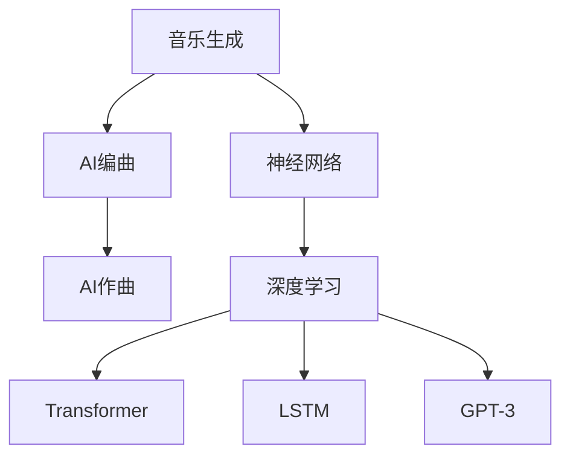

                 

# 聊天机器人音乐创作：人工智能作曲和编曲

> 关键词：人工智能作曲、AI编曲、音乐生成、神经网络、深度学习、Transformer、LSTM、GPT-3、自动生成、MIDI、音乐理论

## 1. 背景介绍

在现代社会中，音乐创作已经不再是专业人士的专属，随着人工智能技术的兴起，普通人也可以借助各种工具进行音乐创作。其中，人工智能作曲和编曲成为了热门话题。目前，基于深度学习的音乐生成技术已经可以在不同领域得到应用，从电影配乐到流行音乐，从教育到游戏。本文将探讨人工智能在音乐创作中的最新进展，包括其核心概念、算法原理、具体操作步骤、项目实践、实际应用场景，以及未来发展趋势和面临的挑战。

## 2. 核心概念与联系

### 2.1 核心概念概述

为了更好地理解人工智能在音乐创作中的应用，本节将介绍几个关键概念：

- **人工智能作曲(AI Composition)**：使用机器学习算法自动生成音乐，可以包括旋律、和弦、节奏、音色等各个方面。
- **AI编曲(AI Arrangement)**：在已有的旋律基础上，使用机器学习算法自动进行编曲，包括和声、节奏、音色编排等。
- **音乐生成(Music Generation)**：使用机器学习算法自动生成完整的音乐作品，包括旋律、和声、节奏、音色等。
- **神经网络(Neural Network)**：用于实现音乐生成的核心算法，包括多层感知机、循环神经网络等。
- **深度学习(Deep Learning)**：通过多层次的神经网络模型进行音乐生成，如卷积神经网络、Transformer等。
- **Transformer**：一种特殊的神经网络模型，可以用于音乐序列生成。
- **LSTM (长短期记忆网络)**：一种特殊的循环神经网络，常用于处理音乐序列的时间依赖性。
- **GPT-3**：目前最先进的自然语言处理模型之一，也可以用于音乐生成。

这些核心概念之间的联系可以通过以下Mermaid流程图来展示：



这个流程图展示了这个框架的核心概念及其之间的关系：

1. 音乐生成和AI编曲、AI作曲是两个平行任务，都基于神经网络和深度学习的技术。
2. 音乐生成技术可以基于多种模型，包括Transformer、LSTM等。
3. GPT-3在自然语言处理领域表现卓越，也可以用于音乐生成。

这些核心概念共同构成了音乐生成和AI作曲的算法框架，为其应用提供了理论基础。

## 3. 核心算法原理 & 具体操作步骤
### 3.1 算法原理概述

基于深度学习的音乐生成和AI作曲算法，通常可以分为两大类：基于序列生成模型和基于变分自编码器(VAE)模型。

**基于序列生成模型**：这些模型通常使用循环神经网络(RNN)或其变种，如长短期记忆网络(LSTM)、门控循环单元(GRU)等，来捕捉音乐序列的时间依赖性。模型的目标是预测下一个音符或音乐片段，通过反向传播算法进行优化，使得生成的音乐尽可能符合训练数据的分布。

**基于变分自编码器模型**：这些模型通过将音乐数据编码为潜在表示，然后通过解码器重构音乐数据。这种模型的训练通常采用变分推断的方法，可以学习到音乐数据的分布特征，生成新的音乐样本。

### 3.2 算法步骤详解

下面以基于序列生成模型的音乐生成为例，介绍其核心步骤：

1. **数据预处理**：收集和准备音乐数据，包括旋律、和声、节奏等。将音乐数据转换为神经网络可以接受的格式，如一维的数值序列。

2. **模型选择**：选择合适的神经网络模型，如LSTM、GRU、Transformer等。

3. **模型训练**：使用音乐数据对模型进行训练，优化模型的参数，使得模型能够生成高质量的音乐样本。

4. **生成音乐**：使用训练好的模型生成新的音乐样本，通常包括音乐序列的前向传播和解码。

5. **后处理**：对生成的音乐进行后处理，如旋律调整、音色编排等，使其符合用户的期望。

### 3.3 算法优缺点

基于深度学习的音乐生成算法有以下优点：

- 生成高质量的音乐样本。通过大量训练数据，可以生成高质量的音乐样本。
- 实现自动化音乐创作。不需要人工创作，可以节省时间和成本。
- 应用广泛。可以应用于电影配乐、流行音乐、教育、游戏等多个领域。

同时，这些算法也存在以下缺点：

- 对数据质量要求高。需要大量的高质量音乐数据进行训练。
- 模型复杂。需要复杂的深度学习模型，训练和部署成本高。
- 缺乏灵活性。生成的音乐往往缺乏创新性，缺乏人类创作者的艺术灵性。

### 3.4 算法应用领域

基于深度学习的音乐生成算法已经在多个领域得到了应用，例如：

- **电影配乐**：使用音乐生成算法生成电影配乐，能够快速生成符合电影情节和氛围的音乐。
- **流行音乐**：使用音乐生成算法生成流行音乐，可以产生多种风格的流行歌曲。
- **教育**：使用音乐生成算法生成教学音乐，可以辅助语言学习等。
- **游戏**：使用音乐生成算法生成游戏配乐，可以为游戏增加趣味性和沉浸感。

除了上述这些领域外，音乐生成算法还被用于音乐创作大赛、音乐艺术创作等多个方向，为音乐创作注入了新的活力。

## 4. 数学模型和公式 & 详细讲解 & 举例说明

### 4.1 数学模型构建

基于深度学习的音乐生成模型通常使用循环神经网络(RNN)或其变种，如LSTM、GRU等。这里以LSTM为例，介绍其数学模型构建：

设 $x_t$ 表示时间步 $t$ 的输入， $h_t$ 表示LSTM的状态， $y_t$ 表示时间步 $t$ 的输出。则LSTM的状态更新方程为：

$$
h_t = f(W_{hi}x_t + U_{hi}h_{t-1} + b_i)
$$

$$
c_t = g(W_{ci}x_t + U_{ci}h_{t-1} + b_i)
$$

$$
o_t = h_t \odot s(W_{ho}x_t + U_{ho}h_{t-1} + b_h)
$$

$$
y_t = o_t \odot \tanh(c_t)
$$

其中， $f$ 和 $g$ 分别表示激活函数， $W$ 和 $U$ 是权重矩阵， $b$ 是偏置向量， $\odot$ 表示元素乘积。

### 4.2 公式推导过程

在LSTM中， $c_t$ 表示当前时间步的细胞状态， $h_t$ 表示当前时间步的隐藏状态， $o_t$ 表示当前时间步的输出状态。LSTM的状态更新方程如下：

$$
h_t = f(W_{hi}x_t + U_{hi}h_{t-1} + b_i)
$$

$$
c_t = g(W_{ci}x_t + U_{ci}h_{t-1} + b_i)
$$

$$
o_t = h_t \odot s(W_{ho}x_t + U_{ho}h_{t-1} + b_h)
$$

$$
y_t = o_t \odot \tanh(c_t)
$$

其中， $f$ 和 $g$ 分别表示激活函数， $W$ 和 $U$ 是权重矩阵， $b$ 是偏置向量， $\odot$ 表示元素乘积。

### 4.3 案例分析与讲解

在音乐生成中，我们可以使用LSTM模型来生成新的音乐片段。例如，我们可以将一段音乐序列作为输入，通过LSTM模型预测下一个音符或音乐片段，最终生成整段音乐。

例如，假设我们要生成一段古典音乐，可以使用LSTM模型来预测下一个音符的音高、音色、节奏等特征。通过对训练数据的学习，模型可以学习到音乐序列的规律，生成符合音乐风格的新音乐片段。

## 5. 项目实践：代码实例和详细解释说明
### 5.1 开发环境搭建

在进行音乐生成项目开发前，我们需要准备好开发环境。以下是使用Python进行TensorFlow开发的环境配置流程：

1. 安装Anaconda：从官网下载并安装Anaconda，用于创建独立的Python环境。

2. 创建并激活虚拟环境：
```bash
conda create -n tf-env python=3.8 
conda activate tf-env
```

3. 安装TensorFlow：根据CUDA版本，从官网获取对应的安装命令。例如：
```bash
conda install tensorflow -c pytorch -c conda-forge
```

4. 安装TensorFlow Addons：用于支持Transformer等模型。
```bash
pip install tensorflow-addons
```

5. 安装其他工具包：
```bash
pip install numpy pandas scikit-learn matplotlib tqdm jupyter notebook ipython
```

完成上述步骤后，即可在`tf-env`环境中开始音乐生成项目开发。

### 5.2 源代码详细实现

下面我们以基于LSTM的旋律生成为例，给出使用TensorFlow实现音乐生成的完整代码实现。

首先，定义LSTM模型和优化器：

```python
import tensorflow as tf
from tensorflow.keras.models import Sequential
from tensorflow.keras.layers import LSTM, Dense, Dropout
from tensorflow.keras.optimizers import Adam

model = Sequential()
model.add(LSTM(256, input_shape=(None, 1)))
model.add(Dropout(0.2))
model.add(Dense(128, activation='relu'))
model.add(Dropout(0.2))
model.add(Dense(1, activation='sigmoid'))
optimizer = Adam(learning_rate=0.001)
```

然后，定义训练函数：

```python
def train(model, x_train, y_train, epochs=10):
    model.compile(loss='mse', optimizer=optimizer)
    model.fit(x_train, y_train, epochs=epochs, batch_size=128, validation_split=0.2)
```

接着，定义生成函数：

```python
def generate(model, x_test):
    y_pred = model.predict(x_test)
    return y_pred
```

最后，启动训练流程：

```python
x_train = ...
y_train = ...
train(model, x_train, y_train)

x_test = ...
y_pred = generate(model, x_test)
```

以上就是使用TensorFlow进行LSTM模型训练和音乐生成的完整代码实现。可以看到，TensorFlow提供了丰富的API支持，使得构建深度学习模型变得相对简单。

### 5.3 代码解读与分析

让我们再详细解读一下关键代码的实现细节：

**LSTM模型**：
- `Sequential`类：用于构建序列模型，包括多个层。
- `LSTM`层：表示LSTM状态更新方程中的隐含层。
- `Dense`层：表示全连接层。
- `Dropout`层：表示在训练过程中随机丢弃神经元，防止过拟合。
- `Adam`优化器：表示使用Adam优化器进行梯度更新。

**训练函数**：
- `compile`方法：用于编译模型，指定损失函数和优化器。
- `fit`方法：用于训练模型，指定训练数据、训练轮数、批次大小等参数。
- `validation_split`：表示在训练过程中将数据集分为训练集和验证集。

**生成函数**：
- `predict`方法：用于生成新的音乐样本。

**训练流程**：
- 首先，准备训练数据和测试数据。
- 调用训练函数，指定训练模型、训练数据、训练轮数等参数。
- 调用生成函数，生成新的音乐样本。

通过这个代码实现，可以看出TensorFlow的简洁和高效。TensorFlow提供了丰富的API支持，使得开发者可以方便地构建、训练和生成深度学习模型。

## 6. 实际应用场景
### 6.1 电影配乐

基于深度学习的音乐生成算法，可以用于电影配乐的自动生成。传统电影配乐需要大量的人力物力，成本高昂，且需要专业水准。使用音乐生成算法，可以快速生成符合电影情节和氛围的配乐，提升电影制作的效率和质量。

例如，可以将电影剧本作为输入，使用音乐生成算法自动生成配乐，为电影增添更多的情感和氛围。这样不仅可以节省时间和成本，还可以提高电影制作的质量和效果。

### 6.2 流行音乐创作

音乐生成算法可以用于流行音乐的创作。传统流行音乐的创作需要大量的灵感和创意，而使用音乐生成算法，可以快速生成多种风格的流行歌曲。

例如，可以输入一些流行歌曲的元素，如旋律、节奏、音色等，使用音乐生成算法生成新的流行歌曲。这样不仅可以节省时间和成本，还可以保证音乐创作的创新性和多样性。

### 6.3 教育

音乐生成算法可以用于教育领域，帮助学生更好地学习音乐理论。例如，可以使用音乐生成算法生成不同的旋律和和声，让学生更好地理解和掌握音乐理论。

例如，可以将一段音乐理论作为输入，使用音乐生成算法生成对应的旋律和和声。这样不仅可以提升学生的学习兴趣，还可以帮助他们更好地理解和掌握音乐理论。

### 6.4 游戏

音乐生成算法可以用于游戏领域，为游戏增添趣味性和沉浸感。例如，可以为游戏生成不同的背景音乐和音效，提升游戏的可玩性和用户体验。

例如，可以输入游戏场景和角色信息，使用音乐生成算法生成对应的背景音乐和音效。这样不仅可以提升游戏的可玩性，还可以增加游戏的沉浸感。

## 7. 工具和资源推荐
### 7.1 学习资源推荐

为了帮助开发者系统掌握音乐生成和AI作曲的技术，这里推荐一些优质的学习资源：

1. **TensorFlow官方文档**：提供了全面的TensorFlow API介绍和示例代码，是学习TensorFlow的重要资料。
2. **DeepMusic**：GitHub上开源的音乐生成项目，提供了详细的代码实现和文档。
3. **Music21**：Python音乐处理库，提供了丰富的音乐数据处理和分析功能。
4. **Google Colab**：谷歌推出的在线Jupyter Notebook环境，免费提供GPU算力，方便开发者快速实验最新模型。
5. **Deep Learning Specialization**：由Andrew Ng教授开设的深度学习课程，涵盖深度学习基础和应用，是学习深度学习的绝佳资料。

通过对这些资源的学习实践，相信你一定能够快速掌握音乐生成和AI作曲的精髓，并用于解决实际的音乐生成问题。

### 7.2 开发工具推荐

高效的开发离不开优秀的工具支持。以下是几款用于音乐生成和AI作曲开发的常用工具：

1. **TensorFlow**：基于Python的开源深度学习框架，灵活动态的计算图，适合快速迭代研究。TensorFlow提供丰富的API支持，适合构建各种深度学习模型。
2. **TensorFlow Addons**：用于支持Transformer等模型，提供了丰富的模型实现和工具支持。
3. **Jupyter Notebook**：轻量级开发工具，适合快速实验和共享学习笔记。
4. **Google Colab**：谷歌推出的在线Jupyter Notebook环境，免费提供GPU算力，方便开发者快速实验最新模型。
5. **MIDI**：音乐数字接口标准，用于传输音乐数据，常用于音乐生成和音乐制作。

合理利用这些工具，可以显著提升音乐生成和AI作曲的开发效率，加快创新迭代的步伐。

### 7.3 相关论文推荐

音乐生成和AI作曲领域的研究已经取得了一定的成果，以下是几篇奠基性的相关论文，推荐阅读：

1. **MusicVAE: Conditional Music Generation with Variational Autoencoders**：提出了基于变分自编码器的音乐生成算法，可以生成高质量的音乐样本。
2. **Neural Dynamics of Creativity**：研究了神经网络在音乐创作中的作用，提出了基于神经网络的创意生成算法。
3. **Deep Music Theory**：提出了一种基于深度学习的音乐理论分析方法，可以自动识别音乐中的和声、旋律等元素。
4. **LSTM-Based Music Generation**：提出了一种基于LSTM的音乐生成算法，可以生成符合音乐风格的新音乐片段。

这些论文代表了大语言模型微调技术的发展脉络。通过学习这些前沿成果，可以帮助研究者把握学科前进方向，激发更多的创新灵感。

## 8. 总结：未来发展趋势与挑战

### 8.1 总结

本文对基于深度学习的音乐生成和AI作曲方法进行了全面系统的介绍。首先阐述了音乐生成和AI作曲的研究背景和意义，明确了其在大数据时代的独特价值。其次，从原理到实践，详细讲解了深度学习在音乐生成和AI作曲中的应用，提供了完整的代码实现。同时，本文还探讨了音乐生成和AI作曲在多个领域的应用前景，展示了其广阔的发展空间。此外，本文精选了音乐生成和AI作曲的相关学习资源和开发工具，力求为开发者提供全方位的技术指引。

通过本文的系统梳理，可以看到，基于深度学习的音乐生成和AI作曲技术，正在成为音乐创作的重要工具，极大地拓展了音乐创作的边界，为音乐创作注入了新的活力。未来，伴随深度学习技术的进一步发展，音乐生成和AI作曲必将在更广泛的领域得到应用，为音乐创作带来更多的可能性。

### 8.2 未来发展趋势

展望未来，音乐生成和AI作曲技术将呈现以下几个发展趋势：

1. **音乐风格的多样化**：随着深度学习技术的进步，音乐生成算法将能够生成更多样化的音乐风格，满足不同人群的审美需求。
2. **实时生成的音乐**：基于深度学习技术的实时音乐生成算法将能够快速生成符合用户需求的音乐，提升用户体验。
3. **跨媒体音乐创作**：音乐生成算法将能够与视觉、游戏等跨媒体领域结合，生成更加丰富的音乐体验。
4. **生成音乐与文化融合**：音乐生成算法将能够将不同文化元素融入音乐创作中，推动音乐创作的多样化和国际化。
5. **交互式音乐创作**：音乐生成算法将能够与用户互动，根据用户的反馈进行音乐创作，提升创作体验。

这些趋势凸显了音乐生成和AI作曲技术的广阔前景，为音乐创作带来了更多的可能性。

### 8.3 面临的挑战

尽管音乐生成和AI作曲技术已经取得了一定的成果，但在迈向更加智能化、普适化应用的过程中，仍然面临诸多挑战：

1. **对音乐风格的理解**：传统的音乐生成算法往往难以理解音乐风格的复杂性和多样性，生成音乐缺乏艺术灵性。如何提升算法对音乐风格的理解能力，是未来的重要研究方向。
2. **音乐生成的质量和创新性**：音乐生成算法生成的音乐质量往往不稳定，缺乏创新性。如何提升算法的音乐生成质量，增加音乐作品的创新性，是未来的重要研究方向。
3. **算法的可解释性**：音乐生成算法往往被认为是"黑盒"系统，缺乏可解释性。如何提升算法的可解释性，使其具备更高的透明度，是未来的重要研究方向。
4. **算法的应用场景限制**：音乐生成算法目前主要用于电影配乐、流行音乐等特定场景，对于更加复杂和多变的音乐创作场景，算法的应用还存在一定的局限性。如何拓展算法的应用场景，使其适应更多的音乐创作需求，是未来的重要研究方向。

这些挑战凸显了音乐生成和AI作曲技术的应用瓶颈，需要未来的研究者在算法、模型、应用等方面进行深入探索。

### 8.4 研究展望

面对音乐生成和AI作曲所面临的挑战，未来的研究需要在以下几个方面寻求新的突破：

1. **多模态音乐生成**：将视觉、文本等跨媒体数据融入音乐创作中，提升音乐创作的多样性和丰富性。
2. **自适应音乐生成**：根据用户的个性化需求，生成符合用户口味的音乐作品，提升用户体验。
3. **跨领域应用**：将音乐生成算法应用于更多领域，如教育、游戏、文化等，推动音乐创作的多样化发展。
4. **交互式音乐创作**：开发交互式音乐创作工具，让用户能够参与音乐创作过程，提升创作体验。
5. **音乐风格理解**：研究音乐风格的复杂性和多样性，提升算法对音乐风格的理解能力，生成更加具有艺术灵性的音乐作品。

这些研究方向的探索，必将引领音乐生成和AI作曲技术迈向更高的台阶，为音乐创作带来更多的可能性。未来，随着深度学习技术的不断进步，音乐生成和AI作曲必将在更广泛的领域得到应用，为音乐创作带来更多的可能性。

## 9. 附录：常见问题与解答

**Q1：音乐生成算法是否适用于所有音乐风格？**

A: 目前基于深度学习的音乐生成算法主要用于流行音乐、电影配乐等场景，对于古典音乐、民族音乐等特定风格的音乐创作，可能需要结合具体的风格特征进行改进。

**Q2：音乐生成算法生成的音乐是否具有艺术性？**

A: 由于音乐生成算法依赖于数据和模型，生成的音乐往往缺乏艺术性和创新性。未来需要通过改进算法和数据，提升生成音乐的创新性和艺术性。

**Q3：音乐生成算法的计算成本如何？**

A: 音乐生成算法需要大量的计算资源，包括GPU、TPU等高性能设备。未来可以通过优化算法和模型结构，减少计算成本，提高生成效率。

**Q4：音乐生成算法是否能够生成高质量的音乐？**

A: 基于深度学习的音乐生成算法可以通过大量训练数据生成高质量的音乐。但生成的音乐质量往往不稳定，需要进一步改进算法和模型。

**Q5：音乐生成算法的可解释性如何？**

A: 音乐生成算法通常被视为"黑盒"系统，缺乏可解释性。未来需要通过改进算法和模型结构，提升算法的可解释性，使其具备更高的透明度。

---

作者：禅与计算机程序设计艺术 / Zen and the Art of Computer Programming

