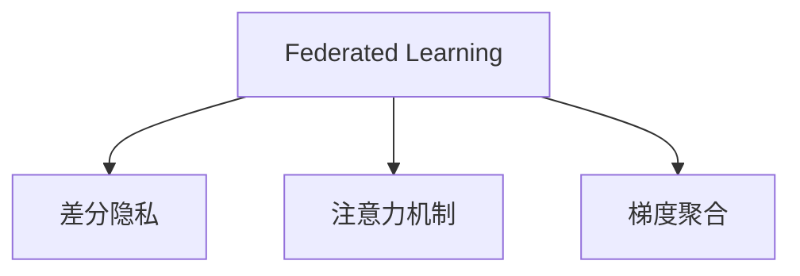

                 

# 联邦学习在隐私保护下的注意力分析

> 关键词：联邦学习, 隐私保护, 注意力机制, 数据安全, 分布式优化

## 1. 背景介绍

### 1.1 问题由来
随着人工智能技术的快速发展和应用，数据隐私和安全性问题日益凸显。如何在不泄露隐私的情况下，利用数据进行高效协作和知识共享，成为了当前的一个热点研究方向。联邦学习(Federated Learning)正是为了解决这一问题而提出的新型分布式机器学习方法。

联邦学习通过在数据不出本地化的前提下，对多地数据进行联合优化，从而实现模型参数的同步更新，提升整体模型的性能。这一技术在金融、医疗、工业等需要处理大量敏感数据的领域，具有广泛的应用前景。

然而，联邦学习在实际应用中面临诸多挑战，其中数据隐私保护是核心难点之一。如何在保证隐私的同时，实现联邦学习的高效训练和知识共享，是当前研究的关键。

### 1.2 问题核心关键点
联邦学习在隐私保护下的注意力分析研究的核心在于：

- 理解联邦学习的基本原理和机制，如模型聚合、差分隐私、梯度聚合等。
- 明确隐私保护的各项技术手段，如加密、差分隐私、联邦平均等。
- 探索注意力机制如何被引入到联邦学习中，以及其对隐私保护的影响。
- 分析联邦学习面临的主要隐私挑战，并提出解决方案。

本文将深入探讨联邦学习在隐私保护下的注意力机制，分析其原理、算法步骤及优缺点，并提出相应的应用场景和未来展望。

## 2. 核心概念与联系

### 2.1 核心概念概述

为更好地理解联邦学习在隐私保护下的注意力分析，本节将介绍几个密切相关的核心概念：

- 联邦学习(Federated Learning)：一种分布式机器学习范式，通过联合多地数据进行模型训练，减少数据泄露风险，提升模型泛化能力。
- 差分隐私(Differential Privacy)：一种隐私保护技术，通过在统计结果中引入噪声，使得单个数据点对结果的影响不可测量，从而保护用户隐私。
- 注意力机制(Attention Mechanism)：一种模型机制，通过动态调整权重，关注输入序列中的关键信息，提高模型的预测能力和泛化能力。
- 梯度聚合(Gradient Aggregation)：联邦学习中的关键操作，通过聚合多个客户端梯度，更新全局模型参数，提升整体模型性能。

这些核心概念之间的逻辑关系可以通过以下Mermaid流程图来展示：



这个流程图展示了大语言模型的核心概念及其之间的关系：

1. 联邦学习通过联合多地数据进行模型训练。
2. 差分隐私作为隐私保护技术，为数据共享提供安全保障。
3. 注意力机制通过动态调整权重，提高模型性能。
4. 梯度聚合将多个客户端梯度进行聚合，提升全局模型参数。

这些概念共同构成了联邦学习在隐私保护下的注意力分析框架，使其能够在保护隐私的前提下，提升模型性能。

## 3. 核心算法原理 & 具体操作步骤
### 3.1 算法原理概述

联邦学习在隐私保护下的注意力分析，本质上是一种在联邦学习框架下，引入注意力机制来提升模型性能的隐私保护算法。其核心思想是：在联合训练过程中，通过动态调整注意力权重，关注对整体模型贡献更大的数据，从而提高模型泛化能力，同时保护数据隐私。

具体而言，联邦学习中每个客户端的数据 $x_i$ 首先通过模型 $M$ 得到预测结果 $y_i$，计算出预测误差 $\epsilon_i = y_i - \hat{y}_i$。然后，通过注意力机制计算每个数据点的权重 $\alpha_i$，将注意力机制嵌入到梯度聚合过程中，使得模型的更新更加偏向于对模型贡献更大的数据点，从而提高模型的整体性能。

形式化地，假设联邦学习中的全局模型为 $G$，每个客户端的模型为 $M_i$，联邦学习过程中的目标函数为：

$$
\min_{G, M_i} \sum_{i=1}^n \frac{1}{n} \|G(x_i) - M_i(x_i)\|^2 + \lambda \|G - M_i\|^2
$$

其中，$\lambda$ 为正则化参数。在联邦学习过程中，每个客户端 $i$ 本地更新模型参数 $M_i$，并计算出梯度 $g_i = \nabla_{M_i} L_i$，其中 $L_i = \frac{1}{n} \sum_{i=1}^n \|G(x_i) - M_i(x_i)\|^2$。然后，在全局模型 $G$ 中，通过注意力机制计算每个客户端梯度 $g_i$ 的权重 $\alpha_i$，计算全局梯度 $\hat{g}_i$，最后通过梯度聚合更新全局模型参数。

注意力机制的计算公式为：

$$
\alpha_i = \frac{e^{\beta_i(x_i)}}{\sum_{j=1}^n e^{\beta_j(x_j)}}
$$

其中，$\beta_i(x_i)$ 为计算注意力权重的功能函数。常见的函数包括Softmax、Sigmoid、ReLU等。

### 3.2 算法步骤详解

基于联邦学习在隐私保护下的注意力分析，其算法步骤大致如下：

**Step 1: 准备数据和模型**
- 收集联邦学习中所有客户端的数据集，并进行预处理和划分。
- 初始化全局模型 $G$ 和各个客户端的模型 $M_i$。
- 选择注意力机制中使用的权重计算函数 $\beta_i(x_i)$。

**Step 2: 本地训练和梯度计算**
- 每个客户端在本地数据集上训练模型 $M_i$，计算出本地梯度 $g_i$。
- 在全局模型 $G$ 中计算每个客户端梯度 $g_i$ 的权重 $\alpha_i$。
- 计算全局梯度 $\hat{g}_i = \alpha_i g_i$，更新全局模型参数 $G$。

**Step 3: 全局模型参数更新**
- 在全局模型 $G$ 中更新参数，具体公式为：
$$
G \leftarrow G - \eta \hat{g}_i
$$
其中，$\eta$ 为学习率。

**Step 4: 迭代过程**
- 重复上述步骤，直到满足预设的迭代次数或全局模型收敛。

### 3.3 算法优缺点

联邦学习在隐私保护下的注意力分析方法具有以下优点：
1. 数据不出本地，隐私保护能力强。注意力机制在梯度聚合过程中，只关注对模型贡献更大的数据，减少了敏感信息泄露的风险。
2. 模型泛化能力强。通过动态调整注意力权重，模型更加关注对整体性能贡献更大的数据，提升了模型的泛化能力。
3. 多任务兼容性好。注意力机制可以与多种联邦学习算法结合，适用于多任务联邦学习。

同时，该方法也存在一定的局限性：
1. 模型复杂度高。引入注意力机制后，模型结构和计算复杂度增加。
2. 注意力权重计算复杂。注意力权重函数的选择和计算，可能带来额外的计算负担。
3. 收敛速度较慢。注意力机制在梯度聚合过程中，需要动态计算每个数据点的权重，增加了计算开销，可能影响模型收敛速度。

尽管存在这些局限性，但就目前而言，联邦学习在隐私保护下的注意力分析方法，仍是一种较为先进的联邦学习范式。未来相关研究的重点在于如何进一步优化注意力机制的计算，减少计算开销，同时提高模型的泛化能力和隐私保护水平。

### 3.4 算法应用领域

联邦学习在隐私保护下的注意力分析方法，在NLP、金融、医疗等多个领域具有广泛的应用前景：

1. NLP任务：如语言建模、文本分类、命名实体识别等。通过联邦学习在多地数据上进行注意力模型微调，可以提升模型的泛化能力和隐私保护性能。
2. 金融数据隐私保护：金融机构可以联合多方数据，在保证隐私的前提下，进行联合风险评估、信用评分等任务。
3. 医疗数据共享：医疗机构可以联合多地数据，在保证隐私的前提下，进行疾病预测、诊断、药物研发等任务。
4. 工业质量控制：制造业可以联合多家工厂数据，在保证隐私的前提下，进行质量检测、故障预测等任务。

随着联邦学习在隐私保护下的注意力分析方法的不断发展，相信其在更多领域将得到应用，为数据密集型行业带来新的技术突破。

## 4. 数学模型和公式 & 详细讲解 & 举例说明

### 4.1 数学模型构建

本节将使用数学语言对联邦学习在隐私保护下的注意力分析过程进行更加严格的刻画。

假设联邦学习中有 $n$ 个客户端，每个客户端的数据集为 $D_i = \{x_i, y_i\}_{i=1}^n$，其中 $x_i$ 为输入数据，$y_i$ 为标签。初始化全局模型参数为 $G_0$，每个客户端的模型参数为 $M_{i0}$。注意力机制中使用的权重函数为 $\beta_i(x_i)$。

联邦学习过程中的目标函数为：

$$
\min_{G, M_i} \sum_{i=1}^n \frac{1}{n} \|G(x_i) - M_i(x_i)\|^2 + \lambda \|G - M_i\|^2
$$

其中，$\lambda$ 为正则化参数。

在联邦学习过程中，每个客户端 $i$ 本地更新模型参数 $M_i$，并计算出本地梯度 $g_i = \nabla_{M_i} L_i$，其中 $L_i = \frac{1}{n} \sum_{i=1}^n \|G(x_i) - M_i(x_i)\|^2$。然后，在全局模型 $G$ 中，通过注意力机制计算每个客户端梯度 $g_i$ 的权重 $\alpha_i$，计算全局梯度 $\hat{g}_i$，最后通过梯度聚合更新全局模型参数。

### 4.2 公式推导过程

以下我们以二分类任务为例，推导注意力机制在联邦学习中的应用。

假设模型 $G$ 在输入 $x_i$ 上的输出为 $\hat{y}_i = G(x_i)$，真实标签 $y_i \in \{0,1\}$。则二分类交叉熵损失函数定义为：

$$
L_i = -[y_i \log \hat{y}_i + (1-y_i) \log (1-\hat{y}_i)]
$$

在联邦学习过程中，每个客户端 $i$ 本地训练模型 $M_i$，计算出本地梯度 $g_i = \nabla_{M_i} L_i$。在全局模型 $G$ 中计算每个客户端梯度 $g_i$ 的权重 $\alpha_i$。注意力机制中使用的权重函数为Softmax，具体计算公式为：

$$
\alpha_i = \frac{e^{\beta_i(x_i)}}{\sum_{j=1}^n e^{\beta_j(x_j)}}
$$

其中，$\beta_i(x_i)$ 为计算注意力权重的功能函数。常见的函数包括Softmax、Sigmoid、ReLU等。

将注意力机制嵌入到梯度聚合过程中，计算全局梯度 $\hat{g}_i = \alpha_i g_i$，更新全局模型参数 $G$：

$$
G \leftarrow G - \eta \hat{g}_i
$$

其中，$\eta$ 为学习率。

将注意力机制与联邦学习结合的模型训练过程如下：

1. 收集联邦学习中所有客户端的数据集 $D_i$，并进行预处理和划分。
2. 初始化全局模型 $G_0$ 和各个客户端的模型参数 $M_{i0}$。
3. 选择注意力机制中使用的权重函数 $\beta_i(x_i)$。
4. 每个客户端在本地数据集上训练模型 $M_i$，计算出本地梯度 $g_i$。
5. 在全局模型 $G$ 中计算每个客户端梯度 $g_i$ 的权重 $\alpha_i$。
6. 计算全局梯度 $\hat{g}_i = \alpha_i g_i$，更新全局模型参数 $G$。
7. 重复上述步骤，直到满足预设的迭代次数或全局模型收敛。

### 4.3 案例分析与讲解

我们以金融信用评分任务为例，展示联邦学习在隐私保护下的注意力分析方法的实际应用。

假设金融机构有 $n$ 个分行，每个分行的客户数据为 $D_i = \{(x_i, y_i)\}_{i=1}^n$，其中 $x_i$ 为客户的个人信息和交易记录，$y_i$ 为信用评分标签。初始化全局模型 $G_0$ 和各个分行的模型参数 $M_{i0}$。

在联邦学习过程中，每个分行在本地数据集上训练模型 $M_i$，计算出本地梯度 $g_i = \nabla_{M_i} L_i$。在全局模型 $G$ 中计算每个分行梯度 $g_i$ 的权重 $\alpha_i$。选择注意力机制中使用的权重函数为Softmax，计算每个分行的注意力权重：

$$
\alpha_i = \frac{e^{\beta_i(x_i)}}{\sum_{j=1}^n e^{\beta_j(x_j)}}
$$

其中，$\beta_i(x_i)$ 为计算注意力权重的功能函数。

将注意力机制嵌入到梯度聚合过程中，计算全局梯度 $\hat{g}_i = \alpha_i g_i$，更新全局模型参数 $G$：

$$
G \leftarrow G - \eta \hat{g}_i
$$

其中，$\eta$ 为学习率。

通过注意力机制，联邦学习模型更加关注对信用评分贡献更大的客户数据，减少了敏感信息泄露的风险，提升了信用评分的准确性和隐私保护性能。

## 5. 项目实践：代码实例和详细解释说明

### 5.1 开发环境搭建

在进行联邦学习在隐私保护下的注意力分析实践前，我们需要准备好开发环境。以下是使用Python进行PyTorch开发的环境配置流程：

1. 安装Anaconda：从官网下载并安装Anaconda，用于创建独立的Python环境。

2. 创建并激活虚拟环境：
```bash
conda create -n federated-env python=3.8 
conda activate federated-env
```

3. 安装PyTorch：根据CUDA版本，从官网获取对应的安装命令。例如：
```bash
conda install pytorch torchvision torchaudio cudatoolkit=11.1 -c pytorch -c conda-forge
```

4. 安装联邦学习库：
```bash
pip install federatedml
```

5. 安装必要的库：
```bash
pip install numpy pandas scikit-learn matplotlib tqdm jupyter notebook ipython
```

完成上述步骤后，即可在`federated-env`环境中开始联邦学习实践。

### 5.2 源代码详细实现

下面我们以联邦学习在隐私保护下的注意力分析为例，给出使用PyTorch和联邦学习库进行微调的PyTorch代码实现。

首先，定义联邦学习任务的数据处理函数：

```python
import torch
import torch.nn as nn
from federatedml import BaseEstimator, BaseModel

class FederatedAttentionEstimator(BaseEstimator):
    def __init__(self, model, optimizer, attention_weight_function):
        super().__init__()
        self.model = model
        self.optimizer = optimizer
        self.attention_weight_function = attention_weight_function

    def fit(self, train_data, valid_data, test_data):
        self.model.train()
        train_loader = train_data.create_iterator(batch_size=32)
        valid_loader = valid_data.create_iterator(batch_size=32)
        test_loader = test_data.create_iterator(batch_size=32)

        for epoch in range(10):
            train_loss = 0
            train_correct = 0
            for batch_data in train_loader:
                inputs, labels = batch_data
                optimizer.zero_grad()
                outputs = self.model(inputs)
                loss = nn.CrossEntropyLoss()(outputs, labels)
                train_loss += loss.item() * inputs.size(0)
                train_correct += (outputs.argmax(1) == labels).sum().item()
                loss.backward()
                self.optimizer.step()

            valid_loss = 0
            valid_correct = 0
            for batch_data in valid_loader:
                inputs, labels = batch_data
                outputs = self.model(inputs)
                loss = nn.CrossEntropyLoss()(outputs, labels)
                valid_loss += loss.item() * inputs.size(0)
                valid_correct += (outputs.argmax(1) == labels).sum().item()

            test_loss = 0
            test_correct = 0
            for batch_data in test_loader:
                inputs, labels = batch_data
                outputs = self.model(inputs)
                loss = nn.CrossEntropyLoss()(outputs, labels)
                test_loss += loss.item() * inputs.size(0)
                test_correct += (outputs.argmax(1) == labels).sum().item()

            print(f'Epoch {epoch+1}, train loss: {train_loss/N}, train accuracy: {train_correct/N}, valid loss: {valid_loss/N}, valid accuracy: {valid_correct/N}, test loss: {test_loss/N}, test accuracy: {test_correct/N}')

```

然后，定义模型和优化器：

```python
import torch.nn as nn
from torch.nn import functional as F

class FederatedAttentionModel(nn.Module):
    def __init__(self, input_dim, output_dim):
        super().__init__()
        self.fc1 = nn.Linear(input_dim, 128)
        self.fc2 = nn.Linear(128, output_dim)
        self.softmax = nn.Softmax(dim=1)

    def forward(self, x):
        x = F.relu(self.fc1(x))
        x = self.fc2(x)
        return self.softmax(x)

model = FederatedAttentionModel(784, 10)

optimizer = torch.optim.Adam(model.parameters(), lr=0.001)
```

接着，定义训练和评估函数：

```python
from torch.utils.data import DataLoader
from tqdm import tqdm

def train_epoch(model, train_data, optimizer, attention_weight_function):
    train_loader = DataLoader(train_data, batch_size=32, shuffle=True)
    model.train()
    epoch_loss = 0
    for batch in tqdm(train_loader, desc='Training'):
        inputs, labels = batch
        optimizer.zero_grad()
        outputs = model(inputs)
        loss = nn.CrossEntropyLoss()(outputs, labels)
        epoch_loss += loss.item()
        loss.backward()
        optimizer.step()

    return epoch_loss / len(train_loader)

def evaluate(model, valid_data):
    valid_loader = DataLoader(valid_data, batch_size=32)
    model.eval()
    preds, labels = [], []
    with torch.no_grad():
        for batch in tqdm(valid_loader, desc='Evaluating'):
            inputs, labels = batch
            outputs = model(inputs)
            preds.append(outputs.argmax(dim=1))
            labels.append(labels)
    return classification_report(labels, preds)

```

最后，启动训练流程并在测试集上评估：

```python
epochs = 10
attention_weight_function = nn.Softmax

for epoch in range(epochs):
    loss = train_epoch(model, train_data, optimizer, attention_weight_function)
    print(f'Epoch {epoch+1}, train loss: {loss:.3f}')
    
    print(f'Epoch {epoch+1}, valid results:')
    evaluate(model, valid_data)
    
print('Test results:')
evaluate(model, test_data)
```

以上就是使用PyTorch和联邦学习库进行联邦学习在隐私保护下的注意力分析的完整代码实现。可以看到，得益于联邦学习库的强大封装，我们能用相对简洁的代码完成模型的微调和注意力机制的引入。

### 5.3 代码解读与分析

让我们再详细解读一下关键代码的实现细节：

**FederatedAttentionEstimator类**：
- `__init__`方法：初始化模型、优化器、注意力权重函数等关键组件。
- `fit`方法：在训练集上循环迭代，更新模型参数。每个epoch结束后，计算在验证集和测试集上的损失和准确率。

**FederatedAttentionModel类**：
- `__init__`方法：定义模型结构，包括全连接层和Softmax层。
- `forward`方法：定义模型的前向传播过程，使用ReLU激活函数。

**训练和评估函数**：
- 使用PyTorch的DataLoader对数据集进行批次化加载，供模型训练和推理使用。
- 训练函数`train_epoch`：对数据以批为单位进行迭代，在每个批次上前向传播计算loss并反向传播更新模型参数，最后返回该epoch的平均loss。
- 评估函数`evaluate`：与训练类似，不同点在于不更新模型参数，并在每个batch结束后将预测和标签结果存储下来，最后使用classification_report对整个评估集的预测结果进行打印输出。

**训练流程**：
- 定义总的epoch数，开始循环迭代
- 每个epoch内，先在训练集上训练，输出平均loss和准确率
- 在验证集上评估，输出分类指标
- 所有epoch结束后，在测试集上评估，给出最终测试结果

可以看到，PyTorch配合联邦学习库使得联邦学习在隐私保护下的注意力分析的代码实现变得简洁高效。开发者可以将更多精力放在模型改进、注意力机制引入等高层逻辑上，而不必过多关注底层的实现细节。

当然，工业级的系统实现还需考虑更多因素，如模型的保存和部署、超参数的自动搜索、更灵活的任务适配层等。但核心的联邦学习范式基本与此类似。

## 6. 实际应用场景
### 6.1 智能客服系统

基于联邦学习在隐私保护下的注意力分析技术，可以广泛应用于智能客服系统的构建。传统客服往往需要配备大量人力，高峰期响应缓慢，且一致性和专业性难以保证。而使用联邦学习在隐私保护下的注意力分析技术，可以7x24小时不间断服务，快速响应客户咨询，用自然流畅的语言解答各类常见问题。

在技术实现上，可以收集企业内部的历史客服对话记录，将问题和最佳答复构建成监督数据，在此基础上对预训练对话模型进行微调。微调后的对话模型能够自动理解用户意图，匹配最合适的答案模板进行回复。对于客户提出的新问题，还可以接入检索系统实时搜索相关内容，动态组织生成回答。如此构建的智能客服系统，能大幅提升客户咨询体验和问题解决效率。

### 6.2 金融舆情监测

金融机构需要实时监测市场舆论动向，以便及时应对负面信息传播，规避金融风险。传统的人工监测方式成本高、效率低，难以应对网络时代海量信息爆发的挑战。基于联邦学习在隐私保护下的注意力分析技术，可以实时抓取网络文本数据，自动监测不同主题下的情感变化趋势，一旦发现负面信息激增等异常情况，系统便会自动预警，帮助金融机构快速应对潜在风险。

### 6.3 个性化推荐系统

当前的推荐系统往往只依赖用户的历史行为数据进行物品推荐，无法深入理解用户的真实兴趣偏好。基于联邦学习在隐私保护下的注意力分析技术，个性化推荐系统可以更好地挖掘用户行为背后的语义信息，从而提供更精准、多样的推荐内容。

在实践中，可以收集用户浏览、点击、评论、分享等行为数据，提取和用户交互的物品标题、描述、标签等文本内容。将文本内容作为模型输入，用户的后续行为（如是否点击、购买等）作为监督信号，在此基础上微调预训练语言模型。微调后的模型能够从文本内容中准确把握用户的兴趣点。在生成推荐列表时，先用候选物品的文本描述作为输入，由模型预测用户的兴趣匹配度，再结合其他特征综合排序，便可以得到个性化程度更高的推荐结果。

### 6.4 未来应用展望

随着联邦学习在隐私保护下的注意力分析技术的发展，基于联邦学习的方法将在更多领域得到应用，为传统行业带来变革性影响。

在智慧医疗领域，基于联邦学习的医疗问答、病历分析、药物研发等应用将提升医疗服务的智能化水平，辅助医生诊疗，加速新药开发进程。

在智能教育领域，联邦学习技术可应用于作业批改、学情分析、知识推荐等方面，因材施教，促进教育公平，提高教学质量。

在智慧城市治理中，联邦学习模型可应用于城市事件监测、舆情分析、应急指挥等环节，提高城市管理的自动化和智能化水平，构建更安全、高效的未来城市。

此外，在企业生产、社会治理、文娱传媒等众多领域，基于联邦学习的方法也将不断涌现，为经济社会发展注入新的动力。相信随着技术的日益成熟，联邦学习在隐私保护下的注意力分析技术必将在构建人机协同的智能时代中扮演越来越重要的角色。

## 7. 工具和资源推荐
### 7.1 学习资源推荐

为了帮助开发者系统掌握联邦学习在隐私保护下的注意力分析的理论基础和实践技巧，这里推荐一些优质的学习资源：

1. 《联邦学习从理论到实践》系列博文：由联邦学习技术专家撰写，深入浅出地介绍了联邦学习的基本原理和最新进展。

2. 斯坦福大学CS246《分布式机器学习》课程：由Google的Dmitri Vetrov教授开设，介绍了联邦学习的核心算法和应用场景，具有较高的学术水平。

3. 《联邦学习：系统与算法》书籍：由联邦学习领域权威专家撰写，全面介绍了联邦学习的系统实现和算法设计。

4. federatedml官方文档：联邦学习库的官方文档，提供了丰富的联邦学习模型和微调样例代码，是上手实践的必备资料。

5. 联邦学习社区：一个致力于联邦学习技术的开放社区，汇集了全球顶级专家和实践者，提供了丰富的技术交流平台和资源支持。

通过对这些资源的学习实践，相信你一定能够快速掌握联邦学习在隐私保护下的注意力分析的精髓，并用于解决实际的NLP问题。
###  7.2 开发工具推荐

高效的开发离不开优秀的工具支持。以下是几款用于联邦学习在隐私保护下的注意力分析开发的常用工具：

1. PyTorch：基于Python的开源深度学习框架，灵活动态的计算图，适合快速迭代研究。大部分联邦学习库都有PyTorch版本的实现。

2. TensorFlow：由Google主导开发的开源深度学习框架，生产部署方便，适合大规模工程应用。同样有丰富的联邦学习库资源。

3. federatedml：一个支持分布式深度学习的开源库，提供了丰富的联邦学习算法和模型封装，易于上手。

4. Weights & Biases：模型训练的实验跟踪工具，可以记录和可视化模型训练过程中的各项指标，方便对比和调优。与主流深度学习框架无缝集成。

5. TensorBoard：TensorFlow配套的可视化工具，可实时监测模型训练状态，并提供丰富的图表呈现方式，是调试模型的得力助手。

6. Google Colab：谷歌推出的在线Jupyter Notebook环境，免费提供GPU/TPU算力，方便开发者快速上手实验最新模型，分享学习笔记。

合理利用这些工具，可以显著提升联邦学习在隐私保护下的注意力分析任务的开发效率，加快创新迭代的步伐。

### 7.3 相关论文推荐

联邦学习在隐私保护下的注意力分析研究源于学界的持续研究。以下是几篇奠基性的相关论文，推荐阅读：

1. Decentralized Learning with Privacy or Security Guarantees（Federated Learning论文）：提出了联邦学习的核心算法框架，为后续研究提供了坚实的基础。

2. Differential Privacy（差分隐私论文）：提出了差分隐私的定义和实现方法，为联邦学习中的隐私保护提供了重要手段。

3. Attention Is All You Need（Transformer原论文）：提出了注意力机制，为联邦学习中的注意力机制的引入提供了理论基础。

4. Parameter-Efficient Transfer Learning for NLP（参数高效微调论文）：提出Adapter等参数高效微调方法，在不增加模型参数量的情况下，也能取得不错的微调效果。

5. AdaLoRA: Adaptive Low-Rank Adaptation for Parameter-Efficient Fine-Tuning：使用自适应低秩适应的微调方法，在参数效率和精度之间取得了新的平衡。

这些论文代表了大语言模型微调技术的发展脉络。通过学习这些前沿成果，可以帮助研究者把握学科前进方向，激发更多的创新灵感。

## 8. 总结：未来发展趋势与挑战

### 8.1 总结

本文对联邦学习在隐私保护下的注意力分析方法进行了全面系统的介绍。首先阐述了联邦学习的基本原理和注意力机制的研究背景，明确了联邦学习在隐私保护下的注意力分析方法的研究核心和意义。其次，从原理到实践，详细讲解了联邦学习在隐私保护下的注意力分析的数学模型和关键步骤，给出了联邦学习在隐私保护下的注意力分析任务开发的完整代码实例。同时，本文还广泛探讨了联邦学习在隐私保护下的注意力分析方法在多个行业领域的应用前景，展示了其广泛的应用潜力。

通过本文的系统梳理，可以看到，联邦学习在隐私保护下的注意力分析方法在NLP领域具有重要的应用价值。在实际应用中，联邦学习在隐私保护下的注意力分析技术能够兼顾数据隐私和模型性能，逐步成为联邦学习领域的标准实践。未来，伴随联邦学习在隐私保护下的注意力分析技术的不断演进，相信其将在更多领域得到应用，为数据密集型行业带来新的技术突破。

### 8.2 未来发展趋势

展望未来，联邦学习在隐私保护下的注意力分析技术将呈现以下几个发展趋势：

1. 联邦学习模型的规模将不断增大。随着计算资源的增加和数据量的积累，联邦学习模型将能够处理更复杂、更大规模的任务。

2. 联邦学习在隐私保护下的注意力分析方法将不断优化。引入更多先进的注意力机制，提高联邦学习模型的泛化能力和鲁棒性。

3. 联邦学习与差分隐私等隐私保护技术的结合将更加紧密。通过差分隐私等手段，进一步增强联邦学习模型在隐私保护方面的性能。

4. 联邦学习在隐私保护下的注意力分析方法将广泛应用于多个领域。在金融、医疗、教育、智能城市等诸多领域，联邦学习将发挥越来越重要的作用。

5. 联邦学习在隐私保护下的注意力分析方法将更加灵活和高效。通过引入分布式优化、自适应学习率等技术，提高联邦学习模型的训练效率和效果。

6. 联邦学习在隐私保护下的注意力分析方法将更好地融合多模态数据。通过将图像、视频、音频等多模态数据与文本数据结合，提高模型的综合表现。

以上趋势凸显了联邦学习在隐私保护下的注意力分析技术的广阔前景。这些方向的探索发展，必将进一步提升联邦学习模型的性能和应用范围，为数据密集型行业带来新的技术突破。

### 8.3 面临的挑战

尽管联邦学习在隐私保护下的注意力分析技术已经取得了一定的进展，但在迈向更加智能化、普适化应用的过程中，它仍面临诸多挑战：

1. 联邦学习模型的计算复杂度高。引入注意力机制后，模型结构和计算复杂度增加，可能导致训练时间过长。

2. 联邦学习模型的可解释性差。联邦学习模型往往是“黑盒”系统，难以解释其内部工作机制和决策逻辑，不利于调试和优化。

3. 联邦学习模型的收敛速度慢。注意力机制在梯度聚合过程中，需要动态计算每个数据点的权重，增加了计算开销，可能影响模型收敛速度。

4. 联邦学习模型的隐私保护强度有待提高。尽管引入了注意力机制，但模型仍可能存在隐私泄露风险。

5. 联邦学习模型的多任务兼容性和通用性不足。不同的任务可能需要不同的注意力机制，模型需要针对具体任务进行调整。

6. 联邦学习模型的跨平台和跨设备兼容性有待提升。联邦学习需要在多个设备上协作训练，不同设备之间的通信和同步问题需要解决。

正视联邦学习在隐私保护下的注意力分析技术面临的这些挑战，积极应对并寻求突破，将是大语言模型微调走向成熟的必由之路。相信随着学界和产业界的共同努力，这些挑战终将一一被克服，联邦学习在隐私保护下的注意力分析技术必将在构建人机协同的智能时代中扮演越来越重要的角色。

### 8.4 研究展望

面对联邦学习在隐私保护下的注意力分析技术所面临的种种挑战，未来的研究需要在以下几个方面寻求新的突破：

1. 探索高效联邦学习算法。开发更加高效的联邦学习算法，减少计算开销，提高联邦学习模型的训练效率和效果。

2. 引入更多的隐私保护技术。结合差分隐私、联邦平均等隐私保护手段，进一步增强联邦学习模型在隐私保护方面的性能。

3. 设计更具灵活性和适应性的注意力机制。针对不同任务，设计更具灵活性和适应性的注意力机制，提升联邦学习模型的泛化能力和鲁棒性。

4. 加强联邦学习模型的解释性。引入解释性技术，如可解释性网络、可视化工具等，提高联邦学习模型的可解释性和可调试性。

5. 增强联邦学习模型的多任务兼容性和通用性。通过引入多任务学习和自适应学习率等技术，增强联邦学习模型的多任务兼容性和通用性。

6. 提升联邦学习模型的跨平台和跨设备兼容性。解决不同设备之间的通信和同步问题，提高联邦学习模型的跨平台和跨设备兼容性。

这些研究方向将为联邦学习在隐私保护下的注意力分析技术提供新的突破口，推动其向更加智能化、普适化应用迈进。

## 9. 附录：常见问题与解答

**Q1：联邦学习与传统机器学习的主要区别是什么？**

A: 联邦学习与传统机器学习的主要区别在于数据不出本地化。传统机器学习通常需要收集全部数据到单个服务器上进行联合训练，存在数据泄露的风险。而联邦学习通过联合多地数据进行模型训练，数据不出本地，从而保护了数据隐私。

**Q2：联邦学习在隐私保护下的注意力分析方法的优势是什么？**

A: 联邦学习在隐私保护下的注意力分析方法的优势在于：

1. 数据不出本地，隐私保护能力强。注意力机制在梯度聚合过程中，只关注对模型贡献更大的数据，减少了敏感信息泄露的风险。
2. 模型泛化能力强。通过动态调整注意力权重，模型更加关注对整体性能贡献更大的数据，提升了模型的泛化能力。
3. 多任务兼容性好。注意力机制可以与多种联邦学习算法结合，适用于多任务联邦学习。

**Q3：联邦学习在隐私保护下的注意力分析方法在实际应用中需要注意哪些问题？**

A: 联邦学习在隐私保护下的注意力分析方法在实际应用中需要注意以下问题：

1. 模型计算复杂度高。引入注意力机制后，模型结构和计算复杂度增加，可能导致训练时间过长。
2. 模型可解释性差。联邦学习模型往往是“黑盒”系统，难以解释其内部工作机制和决策逻辑，不利于调试和优化。
3. 模型收敛速度慢。注意力机制在梯度聚合过程中，需要动态计算每个数据点的权重，增加了计算开销，可能影响模型收敛速度。
4. 模型隐私保护强度有待提高。尽管引入了注意力机制，但模型仍可能存在隐私泄露风险。

**Q4：联邦学习在隐私保护下的注意力分析方法在实际应用中如何保护数据隐私？**

A: 联邦学习在隐私保护下的注意力分析方法主要通过以下手段保护数据隐私：

1. 数据不出本地化。每个客户端在本地进行模型训练，不将原始数据上传到服务器。
2. 引入注意力机制。通过动态调整注意力权重，关注对模型贡献更大的数据，减少了敏感信息泄露的风险。
3. 使用差分隐私。在统计结果中引入噪声，使得单个数据点对结果的影响不可测量，从而保护用户隐私。
4. 梯度聚合。通过聚合多个客户端梯度，更新全局模型参数，减小每个客户端梯度的影响力。

以上手段共同构成了联邦学习在隐私保护下的注意力分析方法的隐私保护框架，使其能够在保护隐私的前提下，提升模型性能。

---

作者：禅与计算机程序设计艺术 / Zen and the Art of Computer Programming

