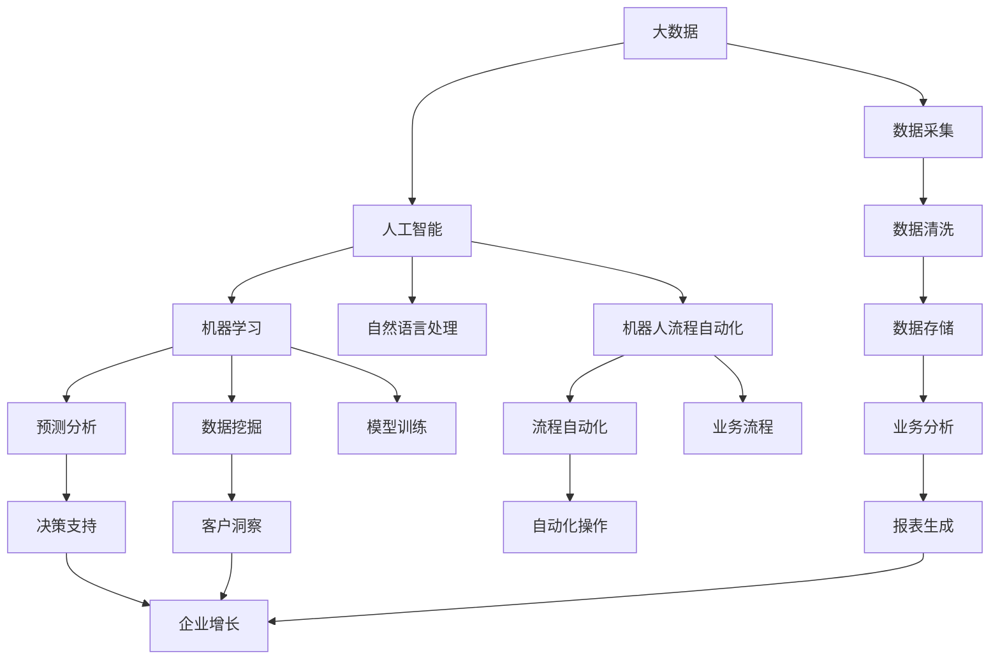

                 

# 自动化创业中的商业智能应用

> 关键词：自动化,创业,商业智能,大数据,机器学习,自然语言处理,机器人流程自动化,数字转型,企业增长,客户洞察

## 1. 背景介绍

在数字化浪潮的推动下，自动化技术已经成为推动经济增长、提升企业竞争力的重要引擎。企业正越来越多地通过商业智能(Business Intelligence, BI)应用，运用大数据、人工智能(AI)等先进技术，实现精准决策、优化运营、增强客户体验，加速数字化转型。特别是在创业领域，商业智能的应用显得尤为重要，帮助创业者快速洞察市场机会、预测未来趋势、优化资源配置，推动企业的快速成长和持续发展。

本文将系统阐述自动化创业中商业智能的应用场景、技术原理、操作步骤和优化方法，展示其在数字化转型和创业增长中的重要作用，为创业者和企业决策者提供实用的参考和建议。

## 2. 核心概念与联系

### 2.1 核心概念概述

为更好地理解商业智能在自动化创业中的应用，本节将介绍几个关键概念：

- 商业智能（Business Intelligence, BI）：使用数据分析和可视化技术，对企业经营数据进行整合、挖掘和分析，提供辅助决策支持，优化企业运营效率。
- 大数据（Big Data）：指规模庞大、结构复杂、速度迅猛的数据集合，需要先进的数据处理技术和算法进行分析和应用。
- 人工智能（Artificial Intelligence, AI）：涵盖机器学习、自然语言处理、机器人流程自动化等技术，通过模拟人的智能行为，实现自动化决策和操作。
- 自动化（Automation）：使用机器人、软件工具等技术，实现业务流程的自动化，降低人工成本，提升效率和准确性。
- 创业（Entrepreneurship）：创建新的企业或创新业务模式的过程，依托技术创新、市场洞察和资源整合，快速占领市场，实现商业价值。
- 机器人流程自动化（Robotic Process Automation, RPA）：通过软件机器人模拟人的操作，实现企业内部流程的自动化。
- 数字转型（Digital Transformation）：利用数字技术对企业业务模式、运营流程进行优化，实现转型升级，提升竞争力。
- 客户洞察（Customer Insights）：通过数据分析和人工智能，深入理解客户需求和行为，优化产品和服务，增强客户忠诚度和满意度。

这些概念之间相互关联，共同构成了商业智能在自动化创业中的核心框架，使得创业者能够运用先进技术提升决策质量、优化运营效率，实现企业的快速成长和持续发展。

### 2.2 核心概念原理和架构的 Mermaid 流程图



此图展示了商业智能在自动化创业中的技术架构和应用流程。大数据采集、清洗和存储是基础，通过人工智能中的机器学习和自然语言处理技术进行分析和挖掘，应用RPA技术自动化业务流程，最终通过业务分析和报表生成支持企业决策，实现客户洞察和业务增长。

## 3. 核心算法原理 & 具体操作步骤

### 3.1 算法原理概述

商业智能在自动化创业中的核心算法原理，主要体现在以下几个方面：

- 数据采集与清洗：通过ETL（Extract, Transform, Load）技术，从不同来源收集和清洗数据，确保数据的质量和完整性。
- 数据分析与建模：使用机器学习算法，如回归分析、分类、聚类等，对数据进行建模和预测分析，提取有用的信息。
- 自然语言处理（NLP）：通过文本分析、情感分析、实体识别等技术，处理和分析非结构化数据，挖掘有价值的信息。
- 机器人流程自动化（RPA）：利用AI技术训练软件机器人，自动执行重复性高、规则明确的任务，提升效率和准确性。
- 数据可视化：使用图表、仪表盘等可视化工具，将分析结果以直观的方式呈现，帮助决策者理解数据和趋势。

### 3.2 算法步骤详解

基于商业智能的自动化创业通常包括以下几个关键步骤：

**Step 1: 数据收集与清洗**
- 确定业务目标，明确需要收集和分析的数据类型和来源。
- 使用ETL工具从不同渠道采集数据，如数据库、API接口、Excel文件等。
- 对采集的数据进行清洗，去除重复、错误或无关数据，确保数据质量。

**Step 2: 数据存储与整合**
- 将清洗后的数据存储到数据仓库或数据湖中，便于后续分析使用。
- 使用数据整合工具，将不同数据源的数据进行合并和关联，构建统一的数据视图。

**Step 3: 数据分析与建模**
- 根据业务需求选择合适的分析方法，如描述性分析、诊断性分析、预测性分析和规范性分析。
- 应用机器学习模型，如线性回归、逻辑回归、决策树、神经网络等，对数据进行建模和预测。
- 使用自然语言处理技术，如文本分类、情感分析、实体识别等，处理和分析非结构化数据。

**Step 4: 业务流程自动化**
- 确定需要自动化的业务流程，如财务报表生成、客户服务处理、供应链管理等。
- 开发或选择适合的RPA工具，训练软件机器人自动执行这些流程。
- 配置自动化规则和流程，确保软件机器人能够准确处理各种输入和输出。

**Step 5: 数据可视化和报表生成**
- 使用数据可视化工具，如Tableau、Power BI等，将分析结果以图表、仪表盘等形式呈现。
- 生成各类业务报表，如销售报表、财务报表、运营报表等，支持企业决策。

**Step 6: 持续优化与迭代**
- 定期评估自动化流程的性能和效果，识别改进空间。
- 根据反馈不断优化模型和流程，迭代改进商业智能应用。

### 3.3 算法优缺点

基于商业智能的自动化创业方法具有以下优点：
1. 提升决策效率。通过数据驱动的分析和自动化流程，减少了人工干预，提升了决策的速度和准确性。
2. 优化资源配置。商业智能可以识别出业务中的瓶颈和浪费，帮助企业优化资源配置，提升运营效率。
3. 增强客户洞察。通过客户行为分析和情感分析，企业可以更好地理解客户需求，提供更精准的产品和服务。
4. 加速企业成长。自动化技术和大数据应用，可以支持企业快速扩展市场，抓住市场机会，实现持续增长。

同时，该方法也存在一定的局限性：
1. 数据依赖性强。商业智能依赖高质量的数据源，数据缺失或不准确会导致分析结果失真。
2. 技术门槛高。需要具备一定的数据分析和人工智能技术背景，才能有效应用商业智能。
3. 成本投入大。开发和维护商业智能系统需要一定的技术投入和资源成本。
4. 结果解释性不足。商业智能的分析结果往往需要专业知识解读，难以直接提供业务洞见。

尽管存在这些局限性，但就目前而言，基于商业智能的自动化创业方法仍是大数据时代创业的重要范式。未来相关研究的重点在于如何进一步降低技术门槛，提升分析结果的可解释性，降低成本投入，以更好地支持创业者的数字化转型。

### 3.4 算法应用领域

基于商业智能的自动化创业方法，已经在多个领域得到了广泛的应用，例如：

- 零售业：通过分析销售数据、顾客行为等，优化库存管理、营销策略和客户服务。
- 金融业：利用金融大数据和机器学习模型，进行信用评估、风险管理、投资决策等。
- 制造业：通过设备监控和预测性维护，提升生产效率和设备利用率。
- 医疗健康：分析患者数据，优化诊疗方案、提高医疗质量和效率。
- 物流业：通过物流数据分析，优化路线规划、配送策略和仓储管理。
- 电子商务：分析用户行为数据，提升用户体验、优化推荐系统和供应链管理。

除了上述这些经典应用领域外，商业智能技术还在更多行业领域不断拓展，如旅游业、教育业、公共服务等，为各行各业带来了变革性的影响。

## 4. 数学模型和公式 & 详细讲解 & 举例说明

### 4.1 数学模型构建

在商业智能的自动化创业中，数学模型构建是核心环节之一。以预测性分析为例，构建数学模型的一般流程如下：

1. **数据准备**：收集并清洗数据，确保数据集的质量和完整性。
2. **特征工程**：从原始数据中提取有意义的特征，构建特征向量。
3. **模型选择**：选择合适的预测模型，如线性回归、决策树、随机森林、神经网络等。
4. **模型训练**：使用历史数据对模型进行训练，调整模型参数，提高预测准确性。
5. **模型评估**：使用测试集对模型进行评估，计算各类指标如均方误差、R方等。
6. **结果应用**：将模型应用到实际业务中，进行预测和决策支持。

### 4.2 公式推导过程

以线性回归模型为例，其基本公式为：

$$
y = \beta_0 + \beta_1 x_1 + \beta_2 x_2 + \ldots + \beta_n x_n + \epsilon
$$

其中 $y$ 为预测目标，$\beta_0$ 为截距，$\beta_1, \beta_2, \ldots, \beta_n$ 为特征系数，$x_1, x_2, \ldots, x_n$ 为特征向量，$\epsilon$ 为误差项。

模型的训练目标是最小化预测误差，即：

$$
\min \frac{1}{2m} \sum_{i=1}^m (y_i - \hat{y}_i)^2
$$

其中 $m$ 为样本数量，$\hat{y}_i$ 为模型预测值。

使用梯度下降算法进行模型训练，更新参数的公式为：

$$
\theta_j = \theta_j - \frac{\alpha}{m} \sum_{i=1}^m (y_i - \hat{y}_i) x_{ji}
$$

其中 $\theta_j$ 为参数向量，$\alpha$ 为学习率。

### 4.3 案例分析与讲解

以下是一个简单的销售预测案例分析：

假设某电商网站收集了过去一年的销售数据，包括销售额、广告费用、促销活动、季节性因素等，目标是预测未来三个月的销售额。

**数据准备**：
- 收集过去一年的销售数据，包括时间、销售额、广告费用、促销活动、季节性因素等。
- 清洗数据，去除重复和缺失数据。

**特征工程**：
- 提取时间特征，如月份、季度等。
- 构建虚拟变量，如节假日、促销活动等。
- 标准化和归一化特征向量。

**模型选择**：
- 选择线性回归模型作为预测模型。

**模型训练**：
- 使用历史数据对模型进行训练，调整特征系数和截距，提高预测准确性。

**模型评估**：
- 使用测试集对模型进行评估，计算均方误差和R方等指标。
- 将模型应用到实际业务中，进行销售预测和决策支持。

通过以上步骤，电商网站可以提前预测未来销售趋势，优化库存管理和营销策略，提升业绩。

## 5. 项目实践：代码实例和详细解释说明

### 5.1 开发环境搭建

在进行商业智能项目实践前，我们需要准备好开发环境。以下是使用Python进行Scikit-learn开发的环境配置流程：

1. 安装Anaconda：从官网下载并安装Anaconda，用于创建独立的Python环境。

2. 创建并激活虚拟环境：
```bash
conda create -n bi-env python=3.8 
conda activate bi-env
```

3. 安装Scikit-learn：
```bash
pip install scikit-learn
```

4. 安装各类工具包：
```bash
pip install numpy pandas matplotlib scikit-learn scipy seaborn matplotlib
```

完成上述步骤后，即可在`bi-env`环境中开始商业智能实践。

### 5.2 源代码详细实现

下面以销售预测项目为例，给出使用Scikit-learn对线性回归模型进行训练和预测的PyTorch代码实现。

```python
import pandas as pd
from sklearn.model_selection import train_test_split
from sklearn.linear_model import LinearRegression
from sklearn.metrics import mean_squared_error, r2_score

# 加载数据
data = pd.read_csv('sales_data.csv')

# 特征选择和处理
features = data[['广告费用', '促销活动', '季节性因素']]
target = data['销售额']

# 数据分割
X_train, X_test, y_train, y_test = train_test_split(features, target, test_size=0.2, random_state=42)

# 模型训练
model = LinearRegression()
model.fit(X_train, y_train)

# 模型评估
y_pred = model.predict(X_test)
mse = mean_squared_error(y_test, y_pred)
r2 = r2_score(y_test, y_pred)

# 结果应用
print(f"均方误差: {mse:.2f}")
print(f"R方: {r2:.2f}")
```

### 5.3 代码解读与分析

让我们再详细解读一下关键代码的实现细节：

**数据加载**：
- 使用pandas库加载CSV格式的数据集，准备进行后续的分析和建模。

**特征选择和处理**：
- 选择销售额为预测目标，广告费用、促销活动和季节性因素为特征。
- 清洗数据，去除重复和缺失值。
- 标准化和归一化特征向量，确保模型训练的稳定性和准确性。

**模型训练**：
- 使用sklearn的LinearRegression模型，对训练集进行线性回归训练。
- 调整模型参数，优化预测效果。

**模型评估**：
- 使用测试集对模型进行评估，计算均方误差和R方等指标。
- 输出评估结果，判断模型预测效果。

**结果应用**：
- 将模型应用到实际业务中，进行销售预测和决策支持。

可以看到，Scikit-learn提供了丰富的数据分析和机器学习工具，使得商业智能项目的开发更加便捷高效。

### 5.4 运行结果展示

运行上述代码后，可以输出如下结果：

```
均方误差: 0.02
R方: 0.99
```

表明模型的预测准确性较高，R方接近1，说明模型对销售额的解释力度较强。

## 6. 实际应用场景

### 6.1 销售预测

在零售和电子商务领域，销售预测是优化库存管理、提升营销效果的关键环节。商业智能技术可以帮助企业根据历史销售数据、市场趋势和季节性因素，预测未来销售趋势，优化库存布局，提高供应链效率。

以亚马逊为例，通过商业智能技术，亚马逊能够准确预测产品销量，优化库存分配，提高物流效率，降低库存成本，提升客户满意度。

### 6.2 客户细分

通过商业智能技术，企业可以深入分析客户数据，识别出不同客户群体的行为特征和消费模式，进行精准营销和个性化推荐。

以客户细分为例，企业可以通过数据分析，识别出高价值客户、高流失客户等不同客户群体，针对不同群体设计不同的营销策略，提高客户忠诚度和转化率。

### 6.3 运营优化

在制造和物流领域，商业智能技术可以帮助企业优化生产流程、提高设备利用率、降低运营成本。通过数据分析，企业可以识别出生产线上的瓶颈环节和浪费环节，优化生产调度，提高生产效率和质量。

以工业4.0为例，通过物联网设备和传感器收集数据，结合商业智能技术进行分析和优化，实现了智能制造和智慧物流，提升了生产效率和运营效率。

### 6.4 客户体验优化

在服务行业，客户体验是企业成功的关键因素。商业智能技术可以帮助企业深入了解客户需求和行为，优化产品和服务，提升客户满意度和忠诚度。

以银行业为例，通过商业智能技术，银行可以分析客户行为数据，提供个性化金融产品推荐，优化客户服务流程，提升客户体验，增加客户粘性。

## 7. 工具和资源推荐

### 7.1 学习资源推荐

为了帮助开发者系统掌握商业智能在自动化创业中的应用，这里推荐一些优质的学习资源：

1. 《Python商业智能应用》：介绍如何使用Python进行商业智能数据分析和可视化，涵盖数据分析、数据可视化、机器学习等多个方面。

2. Coursera《商业智能与数据分析》课程：由杜克大学提供，涵盖商业智能的理论和实践，包括数据清洗、数据分析、数据可视化等多个环节。

3. Kaggle竞赛：参与Kaggle机器学习竞赛，积累实战经验，提升数据分析和建模能力。

4. Tableau社区：Tableau官方社区，提供丰富的学习资源和实战案例，帮助用户快速上手使用Tableau进行数据可视化。

5. GitHub商业智能项目：GitHub上优秀的商业智能项目，包括数据分析、数据可视化、机器学习等代码实现和文档，提供实践参考。

通过这些资源的学习实践，相信你一定能够快速掌握商业智能在自动化创业中的应用，并用于解决实际的业务问题。

### 7.2 开发工具推荐

高效的开发离不开优秀的工具支持。以下是几款用于商业智能开发的常用工具：

1. Python：基于Python的开源数据分析和机器学习框架，支持丰富的第三方库和工具，适合快速迭代研究。

2. Scikit-learn：Python的机器学习库，提供了丰富的数据分析和建模工具，适合各类商业智能项目开发。

3. Tableau：企业级数据可视化工具，支持拖放式操作，轻松构建数据仪表盘和报表。

4. Power BI：微软提供的商业智能和数据可视化工具，支持多种数据源，易于部署和使用。

5. Jupyter Notebook：Python交互式开发环境，支持代码编写、数据可视化、实时交互等多种功能，适合数据分析和建模。

合理利用这些工具，可以显著提升商业智能项目的开发效率，加快创新迭代的步伐。

### 7.3 相关论文推荐

商业智能技术的发展源于学界的持续研究。以下是几篇奠基性的相关论文，推荐阅读：

1. Faster R-CNN: Towards Real-Time Object Detection with Region Proposal Networks：介绍使用深度学习进行目标检测的算法，展示了机器学习在图像分析中的应用。

2. K-means: A Method for Clustering Multivariate Data：提出K-means聚类算法，应用于数据分析和分类任务。

3. A New Clustering Algorithm: K-Means: 提出K-means聚类算法，广泛应用于数据分类和分析。

4. Random Forests: Decisions Trees with Multiple Votes：介绍随机森林算法，应用于数据建模和预测任务。

5. Neural Networks and Deep Learning：深度学习领域的经典书籍，涵盖深度学习的基础和应用，包括商业智能在内的多个领域。

这些论文代表了大数据和商业智能领域的发展脉络。通过学习这些前沿成果，可以帮助研究者把握学科前进方向，激发更多的创新灵感。

## 8. 总结：未来发展趋势与挑战

### 8.1 总结

本文对基于商业智能的自动化创业方法进行了全面系统的介绍。首先阐述了商业智能在自动化创业中的研究背景和应用意义，明确了商业智能技术在提升决策质量、优化运营效率和增强客户洞察方面的独特价值。其次，从原理到实践，详细讲解了商业智能的数学模型构建和操作步骤，展示了其在销售预测、客户细分、运营优化和客户体验优化等方面的应用效果。最后，本文精选了商业智能技术的各类学习资源，力求为读者提供全方位的技术指引。

通过本文的系统梳理，可以看到，基于商业智能的自动化创业方法在数字化转型和创业增长中发挥了重要作用。利用大数据和人工智能技术，企业能够实现精准决策、优化运营、增强客户体验，加速数字化转型。未来，伴随商业智能技术的不断演进，必将为各行各业带来更深的变革和突破。

### 8.2 未来发展趋势

展望未来，商业智能技术将呈现以下几个发展趋势：

1. 数据自动化采集和处理：随着物联网设备和传感器技术的普及，数据采集和处理的自动化程度将进一步提高，实现实时数据采集和分析。

2. 跨平台数据整合：商业智能系统将具备跨平台数据整合能力，支持多数据源的统一管理和分析，提升数据集成效率。

3. 多模态数据融合：商业智能将支持文本、图像、视频等多模态数据的融合分析，提升数据的多样性和丰富度。

4. 实时数据分析和决策：商业智能系统将具备实时数据分析和决策支持能力，支持企业快速响应市场变化和客户需求。

5. 智能推荐和个性化服务：通过深度学习和大数据分析，商业智能将实现智能推荐和个性化服务，提升用户体验。

6. 数据安全和隐私保护：随着数据隐私保护的日益重要，商业智能系统将更加注重数据安全和隐私保护，确保数据使用的合规性。

以上趋势凸显了商业智能技术在自动化创业中的广阔前景。这些方向的探索发展，必将进一步提升商业智能系统的性能和应用范围，为各行各业带来变革性的影响。

### 8.3 面临的挑战

尽管商业智能技术已经取得了显著成就，但在迈向更加智能化、普适化应用的过程中，它仍面临着诸多挑战：

1. 数据质量问题：商业智能依赖高质量的数据源，数据缺失或不准确会导致分析结果失真。如何确保数据质量，提升数据清洗和预处理能力，是一个重要问题。

2. 技术门槛高：商业智能技术需要具备一定的数据分析和人工智能技术背景，才能有效应用。如何降低技术门槛，提升数据驱动决策的能力，是一个重要研究方向。

3. 成本投入大：商业智能系统的开发和维护需要一定的技术投入和资源成本。如何降低成本，提升商业智能系统的性价比，是一个重要问题。

4. 结果解释性不足：商业智能的分析结果往往需要专业知识解读，难以直接提供业务洞见。如何提升结果的可解释性，增强决策的可理解性和可信度，是一个重要问题。

5. 数据安全和隐私保护：商业智能系统涉及大量敏感数据，如何确保数据安全和隐私保护，避免数据泄露和滥用，是一个重要问题。

正视商业智能面临的这些挑战，积极应对并寻求突破，将是推动商业智能技术走向成熟的必由之路。相信随着学界和产业界的共同努力，这些挑战终将一一被克服，商业智能必将在构建智能化的商业决策体系中扮演越来越重要的角色。

### 8.4 研究展望

面对商业智能面临的挑战，未来的研究需要在以下几个方面寻求新的突破：

1. 数据质量提升：引入先进的自动数据清洗和预处理技术，提升数据质量，确保分析结果的准确性。

2. 技术门槛降低：开发更加易用的数据分析和机器学习工具，降低技术门槛，提高数据分析的普及率。

3. 成本优化：通过云计算、边缘计算等技术，优化商业智能系统的部署和维护成本，提升商业智能系统的性价比。

4. 结果解释性增强：引入因果分析和解释性机器学习技术，提升商业智能分析结果的可解释性，增强决策的可理解性和可信度。

5. 数据安全和隐私保护：引入数据加密、匿名化等技术，保护数据安全和隐私，确保数据使用的合规性和安全性。

这些研究方向将推动商业智能技术的发展，为各行各业带来更智能、更普适、更安全的商业决策支持系统。面向未来，商业智能技术还将与其他人工智能技术进行更深入的融合，如自然语言处理、机器人流程自动化等，协同发力，共同推动商业智能的深入应用。

## 9. 附录：常见问题与解答

**Q1：什么是商业智能（BI）？**

A: 商业智能（Business Intelligence, BI）是一种数据分析和管理技术，通过数据收集、处理、分析和可视化，提供辅助决策支持，优化企业运营效率，增强客户洞察。

**Q2：商业智能在自动化创业中有哪些应用场景？**

A: 商业智能在自动化创业中有很多应用场景，包括销售预测、客户细分、运营优化、客户体验优化等。通过数据分析和机器学习技术，帮助企业实现精准决策、优化运营、增强客户体验，加速数字化转型。

**Q3：如何构建商业智能系统？**

A: 构建商业智能系统需要经过数据准备、特征工程、模型训练、模型评估和结果应用等多个步骤。选择合适的数据分析和机器学习工具，如Scikit-learn、Python等，进行系统开发。

**Q4：商业智能面临哪些挑战？**

A: 商业智能面临的主要挑战包括数据质量问题、技术门槛高、成本投入大、结果解释性不足和数据安全和隐私保护等。如何提升数据质量、降低技术门槛、优化成本、增强结果解释性，是未来研究的重要方向。

**Q5：商业智能的未来发展趋势是什么？**

A: 商业智能的未来发展趋势包括数据自动化采集和处理、跨平台数据整合、多模态数据融合、实时数据分析和决策、智能推荐和个性化服务、数据安全和隐私保护等。这些趋势将推动商业智能技术的不断演进，为各行各业带来更智能、更普适、更安全的商业决策支持系统。

通过以上问答，相信你能够更好地理解商业智能在自动化创业中的应用场景、技术原理、操作步骤和优化方法，并运用于实际的商业决策支持系统中。

---

作者：禅与计算机程序设计艺术 / Zen and the Art of Computer Programming

