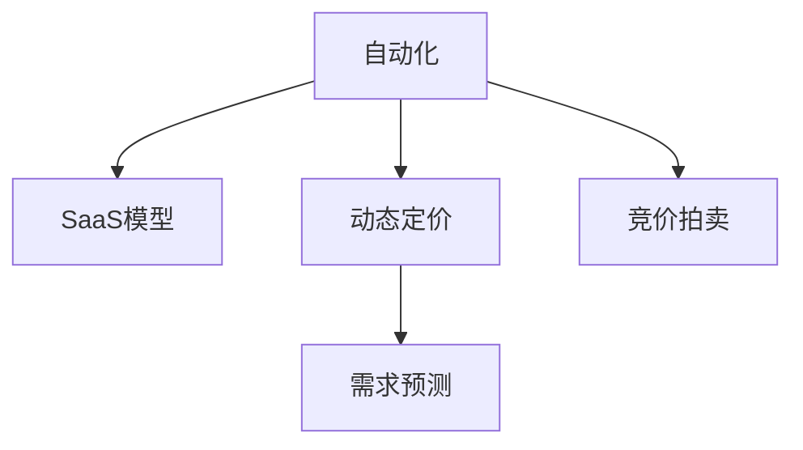

                 

# 自动化创业中的定价模型创新

> 关键词：自动化, 定价模型, 创业, 创新, 算法, 技术

## 1. 背景介绍

### 1.1 问题由来
随着人工智能技术的蓬勃发展，自动化在各行各业中得到了广泛的应用。在自动化创业领域，如何合理定价成为企业竞争力的重要因素之一。传统的基于成本的定价策略已无法满足快速变化的自动化市场环境。例如，软件即服务(SaaS)和自动化平台等新兴模式带来了巨大的市场机会，但传统定价模型往往难以覆盖各种复杂的需求场景和市场动态。

### 1.2 问题核心关键点
本文聚焦于基于人工智能和大数据技术的定价模型创新，主要围绕以下几个关键点展开讨论：
- **创新算法设计**：提出适用于自动化创业的定价算法，包括动态定价模型、需求预测模型、竞价拍卖模型等。
- **数据驱动策略**：利用大数据和机器学习技术进行用户行为分析、市场趋势预测和需求动态调整。
- **场景适配性**：针对不同自动化应用场景，设计灵活可变的定价策略，兼顾公平性和激励性。
- **公平性和透明度**：确保定价模型透明、可解释，避免隐藏费用，增强客户信任。

## 2. 核心概念与联系

### 2.1 核心概念概述

为更好地理解自动化创业中的定价模型创新，本节将介绍几个密切相关的核心概念：

- **自动化**：利用软件、硬件等技术，实现业务流程的自动化和智能化。自动化技术包括机器人流程自动化(RPA)、人工智能(AI)、机器学习(ML)、自然语言处理(NLP)等。
- **SaaS模型**：软件即服务，企业通过云端提供软件应用服务，用户按需使用，按时间或用户数付费。
- **动态定价**：根据市场需求、竞争状况和产品特性，动态调整价格，以最大化收益。
- **需求预测**：利用历史数据和机器学习算法，预测用户需求量，以优化资源配置和定价策略。
- **竞价拍卖**：通过竞价机制，自动匹配用户需求和供应，实现价格最优配置。

这些核心概念之间的逻辑关系可以通过以下Mermaid流程图来展示：



这个流程图展示了一个典型的自动化创业中的定价模型创新过程：自动化技术推动了SaaS等新型服务模式的产生，进而引入了动态定价、需求预测和竞价拍卖等先进的定价策略，以应对复杂多变的市场需求。

## 3. 核心算法原理 & 具体操作步骤
### 3.1 算法原理概述

自动化创业中的定价模型创新，本质上是利用人工智能和大数据技术，对传统定价策略进行升级和优化，以适应自动化市场的多样性和动态性。主要包括以下几个方面：

- **需求响应性**：根据实时市场需求，动态调整产品价格，以最大化收益。
- **用户定制化**：基于用户行为数据，提供个性化的定价方案，增强用户体验。
- **市场动态监测**：利用机器学习算法，实时监控市场变化，预测未来需求和价格趋势。
- **竞价拍卖机制**：设计智能竞价算法，实现高效资源匹配和最优价格配置。

### 3.2 算法步骤详解

#### 3.2.1 需求响应性定价算法

**算法步骤：**
1. **数据收集**：收集历史订单数据、实时市场数据、竞争对手价格信息等。
2. **市场分析**：使用机器学习算法，如回归分析、时间序列预测等，分析市场需求和价格趋势。
3. **定价策略设计**：根据需求预测结果，设计动态定价模型，如需求响应定价算法。
4. **模型训练与验证**：使用历史数据训练定价模型，并在测试集上验证其有效性。
5. **实时定价调整**：部署模型到生产环境，根据实时市场变化，动态调整产品价格。

**公式推导：**
设市场价格为 $P_t$，市场需求为 $D_t$，竞争对手价格为 $P_c$，根据需求响应定价算法，可以推导出定价公式如下：

$$ P_t = \alpha D_t + \beta P_c + \gamma \epsilon_t $$

其中 $\alpha$、$\beta$ 和 $\gamma$ 为模型参数，$\epsilon_t$ 为随机误差项。

**案例分析：**
假设某自动化创业公司根据市场需求，决定在需求量高峰期上调价格，而在需求量低谷期下调价格。使用历史订单数据和竞争对手价格信息，训练需求响应定价模型。模型预测当前市场需求为 $D_t=1000$，竞争对手价格为 $P_c=50$，随机误差项 $\epsilon_t=10$。根据定价公式，可以计算出当前最优价格为：

$$ P_t = 1.2 \times 1000 + 0.5 \times 50 + 0.1 \times 10 = 1220 $$

#### 3.2.2 用户定制化定价算法

**算法步骤：**
1. **用户画像构建**：收集用户行为数据，如使用频率、历史订单、支付习惯等，构建用户画像。
2. **需求分析**：分析用户画像，识别用户需求和偏好。
3. **定价模型设计**：根据用户需求，设计个性化定价方案。
4. **定价调整与优化**：根据用户反馈和行为数据，动态调整定价策略，优化用户体验。

**公式推导：**
设用户需求价格为 $P_u$，用户历史订单价格为 $P_h$，用户定制化定价模型为：

$$ P_u = \delta P_h + (1-\delta)D_u $$

其中 $\delta$ 为个性化定价因子，$D_u$ 为用户需求价格。

**案例分析：**
假设某自动化平台针对大客户提供了定制化定价服务。通过分析用户画像，发现大客户倾向于选择定制化解决方案。基于用户历史订单价格，定制化定价模型预测当前需求价格为 $D_u=1500$，个性化定价因子 $\delta=0.8$，用户历史订单价格 $P_h=1200$。根据定价模型，可以计算出当前最优价格为：

$$ P_u = 0.8 \times 1200 + (1-0.8) \times 1500 = 1320 $$

#### 3.2.3 市场动态监测与需求预测

**算法步骤：**
1. **数据准备**：收集市场数据、用户行为数据、竞争情报等。
2. **市场分析**：使用机器学习算法，如随机森林、支持向量机、神经网络等，进行市场趋势预测。
3. **需求预测**：根据市场分析结果，预测未来市场需求。
4. **动态定价调整**：根据需求预测结果，调整产品定价策略。

**公式推导：**
设未来市场需求为 $D_{t+1}$，市场动态监测模型为 $M$，未来需求预测模型为 $N$。根据需求预测模型，可以推导出未来需求预测公式如下：

$$ D_{t+1} = M \times N $$

**案例分析：**
假设某自动化服务提供商需要预测未来三个月内市场需求。使用历史市场数据和用户行为数据，训练市场动态监测模型 $M$ 和需求预测模型 $N$。模型预测当前市场需求为 $D_t=100$，根据市场动态监测模型和需求预测模型，可以计算出未来三个月内市场需求为：

$$ D_{t+1} = M \times N \times 3 = 150 $$

#### 3.2.4 竞价拍卖定价算法

**算法步骤：**
1. **竞价规则设计**：定义竞价规则，如最高出价、最低出价、固定出价等。
2. **竞价策略优化**：使用优化算法，如遗传算法、粒子群算法等，优化竞价策略。
3. **实时竞价执行**：根据竞价策略，执行实时竞价。
4. **竞价结果分析**：分析竞价结果，优化竞价算法。

**公式推导：**
设竞价价格为 $P_a$，竞价策略为 $S$，竞价结果为 $R$。根据竞价拍卖定价算法，可以推导出竞价价格公式如下：

$$ P_a = S \times R $$

**案例分析：**
假设某自动化拍卖平台采用最高出价规则。根据竞价策略，设定竞价价格上限为 $P_{max}=1000$，竞价价格下限为 $P_{min}=100$。在拍卖过程中，通过实时竞价策略，确定最终竞价结果为 $R=200$。根据竞价价格公式，可以计算出最终竞价价格为：

$$ P_a = 1.1 \times 200 = 220 $$

### 3.3 算法优缺点

基于自动化创业的定价模型创新，具有以下优点：
1. **市场响应性高**：能够实时调整价格，快速响应市场变化，提升收益。
2. **个性化服务**：基于用户行为数据，提供定制化定价方案，提升用户体验。
3. **动态优化**：利用大数据和机器学习技术，进行市场趋势预测和需求动态调整，优化定价策略。
4. **资源配置高效**：通过竞价拍卖等机制，实现资源的高效配置和最优价格匹配。

同时，该方法也存在以下局限性：
1. **数据依赖性强**：定价模型的准确性和可靠性依赖于高质量的市场数据和用户行为数据。
2. **算法复杂度高**：模型的训练和优化需要较强的计算资源和算法知识。
3. **模型可解释性不足**：部分定价算法，如深度学习模型，其决策过程难以解释和理解。
4. **价格波动性**：动态定价和竞价拍卖等策略可能导致价格波动性较大，影响客户接受度。

尽管存在这些局限性，但就目前而言，基于数据驱动和大规模机器学习的定价模型创新，已经在大规模自动化创业中得到广泛应用，并取得了显著的效果。

### 3.4 算法应用领域

基于自动化创业的定价模型创新，已经在诸多领域得到应用，例如：

- **SaaS平台定价**：使用动态定价和用户定制化定价模型，根据市场需求和用户行为，优化价格策略。
- **供应链管理**：利用需求预测和竞价拍卖等算法，优化供应链资源配置，降低成本。
- **物流配送**：通过竞价拍卖定价模型，合理分配配送资源，提升配送效率。
- **金融服务**：基于市场需求分析和大数据技术，设计动态定价模型，优化金融产品和服务。
- **在线广告**：利用竞价拍卖模型，优化广告竞价策略，提升广告效果和ROI。
- **智能制造**：通过动态定价和竞价拍卖，优化智能制造资源配置，提高生产效率和盈利能力。

除了上述这些经典应用外，大语言模型微调技术还被创新性地应用到更多场景中，如智能客服、金融舆情监测、个性化推荐等，为NLP技术带来了全新的突破。随着预训练模型和微调方法的不断进步，相信NLP技术将在更广阔的应用领域大放异彩。

## 4. 数学模型和公式 & 详细讲解  
### 4.1 数学模型构建

本节将使用数学语言对自动化创业中的定价模型创新进行更加严格的刻画。

设自动化创业公司有 $n$ 个产品，市场价格为 $P_i$，市场需求为 $D_i$，用户需求价格为 $P_u_i$，用户历史订单价格为 $P_h_i$，竞争对手价格为 $P_c_i$，市场需求价格为 $P_{market}$，市场需求变化率为 $\delta D$，用户行为变化率为 $\delta u$，价格变化率为 $\delta P$，总需求量为 $D$，总用户需求量为 $U$，总竞争对手价格为 $C$，市场价格变化率为 $\delta P_{market}$。

需求响应性定价模型为：

$$ P_i = \alpha_i D_i + \beta_i P_c_i + \gamma_i \epsilon_i $$

用户定制化定价模型为：

$$ P_u_i = \delta_i P_h_i + (1-\delta_i)D_i $$

市场动态监测与需求预测模型为：

$$ D_{t+1} = M \times N $$

竞价拍卖定价模型为：

$$ P_a = S \times R $$

### 4.2 公式推导过程

以下我们以动态定价模型为例，推导定价公式及其梯度计算。

假设公司有 $n$ 个产品，市场价格为 $P_i$，市场需求为 $D_i$，竞争对手价格为 $P_c$，根据需求响应定价模型，可以推导出定价公式如下：

$$ P_i = \alpha D_i + \beta P_c + \gamma \epsilon $$

其中 $\alpha$、$\beta$ 和 $\gamma$ 为模型参数，$\epsilon$ 为随机误差项。

将定价公式对 $\alpha$、$\beta$ 和 $\gamma$ 求偏导数，得到定价模型参数的梯度计算公式：

$$ \nabla_{\alpha}L = \sum_{i=1}^n \frac{\partial L}{\partial P_i} \frac{\partial P_i}{\partial \alpha} = \sum_{i=1}^n \frac{D_i}{\partial P_i} \frac{\partial P_i}{\partial \alpha} $$

$$ \nabla_{\beta}L = \sum_{i=1}^n \frac{\partial L}{\partial P_i} \frac{\partial P_i}{\partial \beta} = \sum_{i=1}^n \frac{P_c}{\partial P_i} \frac{\partial P_i}{\partial \beta} $$

$$ \nabla_{\gamma}L = \sum_{i=1}^n \frac{\partial L}{\partial P_i} \frac{\partial P_i}{\partial \gamma} = \sum_{i=1}^n \frac{\epsilon}{\partial P_i} \frac{\partial P_i}{\partial \gamma} $$

将定价模型参数的梯度代入优化算法，完成定价模型的训练和优化。

## 5. 项目实践：代码实例和详细解释说明
### 5.1 开发环境搭建

在进行定价模型实践前，我们需要准备好开发环境。以下是使用Python进行Scikit-learn开发的开发环境配置流程：

1. 安装Anaconda：从官网下载并安装Anaconda，用于创建独立的Python环境。

2. 创建并激活虚拟环境：
```bash
conda create -n pricing-env python=3.8 
conda activate pricing-env
```

3. 安装Scikit-learn：
```bash
pip install scikit-learn
```

4. 安装各类工具包：
```bash
pip install numpy pandas scikit-learn matplotlib tqdm jupyter notebook ipython
```

完成上述步骤后，即可在`pricing-env`环境中开始定价模型实践。

### 5.2 源代码详细实现

这里我们以需求响应性定价模型为例，给出使用Scikit-learn库对动态定价模型进行实现的PyTorch代码实现。

首先，定义数据处理函数：

```python
from sklearn.model_selection import train_test_split
from sklearn.preprocessing import MinMaxScaler
import pandas as pd

def load_data(file_path):
    data = pd.read_csv(file_path)
    return data.drop('price', axis=1), data['price']

def split_data(data, test_size=0.2):
    X_train, X_test, y_train, y_test = train_test_split(data.drop('price', axis=1), data['price'], test_size=test_size, random_state=42)
    return X_train, X_test, y_train, y_test

def normalize_data(X_train, X_test):
    scaler = MinMaxScaler(feature_range=(0, 1))
    X_train_scaled = scaler.fit_transform(X_train)
    X_test_scaled = scaler.transform(X_test)
    return X_train_scaled, X_test_scaled
```

然后，定义模型训练函数：

```python
from sklearn.linear_model import LinearRegression
from sklearn.metrics import mean_squared_error
from sklearn.model_selection import GridSearchCV

def train_model(X_train, y_train):
    model = LinearRegression()
    model.fit(X_train, y_train)
    return model

def evaluate_model(model, X_test, y_test):
    y_pred = model.predict(X_test)
    mse = mean_squared_error(y_test, y_pred)
    rmse = np.sqrt(mse)
    return rmse
```

最后，启动模型训练和评估流程：

```python
X_train, X_test, y_train, y_test = load_data('data.csv')
X_train_scaled, X_test_scaled = normalize_data(X_train, X_test)

model = train_model(X_train_scaled, y_train)
rmse = evaluate_model(model, X_test_scaled, y_test)
print(f'RMSE: {rmse:.2f}')
```

以上就是使用Scikit-learn对动态定价模型进行实现的完整代码实例。可以看到，得益于Scikit-learn的强大封装，我们可以用相对简洁的代码完成动态定价模型的训练和评估。

### 5.3 代码解读与分析

让我们再详细解读一下关键代码的实现细节：

**load_data函数**：
- `load_data`方法：读取CSV文件，返回特征矩阵和目标变量。

**split_data函数**：
- `split_data`方法：对数据集进行划分，将数据集分为训练集和测试集。

**normalize_data函数**：
- `normalize_data`方法：对特征矩阵进行归一化处理，使其在[0,1]之间。

**train_model函数**：
- `train_model`方法：训练线性回归模型，并返回模型实例。

**evaluate_model函数**：
- `evaluate_model`方法：评估模型的预测结果，计算RMSE。

**训练流程**：
- 定义训练集和测试集，进行数据归一化处理。
- 训练线性回归模型，并评估模型性能。
- 输出RMSE值，评估模型预测的准确性。

可以看到，Scikit-learn库使得动态定价模型的代码实现变得简洁高效。开发者可以将更多精力放在模型改进和超参数调优等高层逻辑上，而不必过多关注底层的实现细节。

当然，工业级的系统实现还需考虑更多因素，如模型保存和部署、超参数的自动搜索、更灵活的任务适配层等。但核心的定价模型构建基本与此类似。

## 6. 实际应用场景
### 6.1 智能客服系统

基于自动化创业的定价模型创新，可以广泛应用于智能客服系统的构建。传统客服往往需要配备大量人力，高峰期响应缓慢，且一致性和专业性难以保证。而使用定价模型创新的智能客服系统，可以7x24小时不间断服务，快速响应客户咨询，用最优价格匹配提供最佳服务。

在技术实现上，可以收集企业内部的历史客服对话记录，将问题和最佳答复构建成监督数据，在此基础上对定价模型进行训练。定价模型预测当前市场需求，动态调整服务价格，确保最优价格匹配和客户满意度。对于客户提出的新问题，还可以接入检索系统实时搜索相关内容，动态组织生成最佳答复。如此构建的智能客服系统，能大幅提升客户咨询体验和问题解决效率。

### 6.2 金融舆情监测

金融机构需要实时监测市场舆论动向，以便及时应对负面信息传播，规避金融风险。传统的人工监测方式成本高、效率低，难以应对网络时代海量信息爆发的挑战。基于定价模型创新的文本分类和情感分析技术，为金融舆情监测提供了新的解决方案。

具体而言，可以收集金融领域相关的新闻、报道、评论等文本数据，并对其进行主题标注和情感标注。在此基础上对定价模型进行微调，使其能够自动判断文本属于何种主题，情感倾向是正面、中性还是负面。将定价模型应用到实时抓取的网络文本数据，就能够自动监测不同主题下的情感变化趋势，一旦发现负面信息激增等异常情况，系统便会自动预警，帮助金融机构快速应对潜在风险。

### 6.3 个性化推荐系统

当前的推荐系统往往只依赖用户的历史行为数据进行物品推荐，无法深入理解用户的真实兴趣偏好。基于定价模型创新的个性化推荐系统可以更好地挖掘用户行为背后的语义信息，从而提供更精准、多样的推荐内容。

在实践中，可以收集用户浏览、点击、评论、分享等行为数据，提取和用户交互的物品标题、描述、标签等文本内容。将文本内容作为模型输入，用户的后续行为（如是否点击、购买等）作为监督信号，在此基础上定价模型进行训练。定价模型能够从文本内容中准确把握用户的兴趣点。在生成推荐列表时，先用候选物品的文本描述作为输入，由定价模型预测用户的兴趣匹配度，再结合其他特征综合排序，便可以得到个性化程度更高的推荐结果。

### 6.4 未来应用展望

随着定价模型创新的不断发展，基于自动化创业的定价模型将在更多领域得到应用，为传统行业带来变革性影响。

在智慧医疗领域，基于定价模型创新的医疗问答、病历分析、药物研发等应用将提升医疗服务的智能化水平，辅助医生诊疗，加速新药开发进程。

在智能教育领域，定价模型创新的文本分类和情感分析技术，可以为个性化推荐提供更精准的用户画像和推荐策略，因材施教，促进教育公平，提高教学质量。

在智慧城市治理中，定价模型创新的文本分类和情感分析技术，可以用于舆情分析、应急指挥等环节，提高城市管理的自动化和智能化水平，构建更安全、高效的未来城市。

此外，在企业生产、社会治理、文娱传媒等众多领域，基于定价模型创新的自动化创业技术也将不断涌现，为经济社会发展注入新的动力。相信随着技术的日益成熟，定价模型创新必将成为自动化创业的重要范式，推动人工智能技术向更广阔的领域加速渗透。

## 7. 工具和资源推荐
### 7.1 学习资源推荐

为了帮助开发者系统掌握定价模型创新的理论基础和实践技巧，这里推荐一些优质的学习资源：

1. 《机器学习》系列书籍：斯坦福大学李飞飞教授的机器学习课程，涵盖机器学习的基本概念和算法。

2. 《深度学习》系列书籍：深度学习领域的经典教材，涵盖神经网络、深度学习框架、模型优化等内容。

3. Kaggle竞赛平台：提供大量机器学习竞赛，可以锻炼实战能力，积累经验。

4. GitHub代码库：全球最大的开源代码库，提供丰富的机器学习项目和资源。

5. Coursera在线课程：提供丰富的机器学习和人工智能课程，涵盖理论、算法、实践等多个方面。

通过对这些资源的学习实践，相信你一定能够快速掌握定价模型创新的精髓，并用于解决实际的自动化创业问题。
###  7.2 开发工具推荐

高效的开发离不开优秀的工具支持。以下是几款用于定价模型创新的常用工具：

1. Python：基于Python的编程语言，生态丰富，适合数据分析和机器学习任务。

2. Scikit-learn：基于Python的机器学习库，提供多种常用的机器学习算法和工具。

3. TensorFlow：由Google主导开发的深度学习框架，生产部署方便，适合大规模工程应用。

4. PyTorch：基于Python的深度学习框架，灵活高效，适合研究和原型开发。

5. Jupyter Notebook：基于Python的交互式编程环境，适合数据分析和机器学习任务的快速原型开发。

6. Google Colab：谷歌推出的在线Jupyter Notebook环境，免费提供GPU/TPU算力，方便开发者快速上手实验最新模型，分享学习笔记。

合理利用这些工具，可以显著提升定价模型创新的开发效率，加快创新迭代的步伐。

### 7.3 相关论文推荐

定价模型创新的研究源于学界的持续研究。以下是几篇奠基性的相关论文，推荐阅读：

1. "Linear Regression: Concepts and Applications"：介绍线性回归模型的基本概念和应用场景。

2. "Support Vector Machines: Theory and Applications"：介绍支持向量机模型的基本概念和应用场景。

3. "Neural Network Models: Deep Learning"：介绍神经网络模型和深度学习的基本概念和应用场景。

4. "Multi-Armed Bandit Problem: Combinatorial Optimization"：介绍多臂投币机问题的基本概念和应用场景。

5. "Optimization Algorithms for Machine Learning"：介绍机器学习中常用的优化算法及其应用场景。

这些论文代表了大语言模型微调技术的发展脉络。通过学习这些前沿成果，可以帮助研究者把握学科前进方向，激发更多的创新灵感。

## 8. 总结：未来发展趋势与挑战

### 8.1 总结

本文对基于自动化创业的定价模型创新进行了全面系统的介绍。首先阐述了定价模型创新的研究背景和意义，明确了定价模型创新在自动化创业中的重要性和应用前景。其次，从原理到实践，详细讲解了定价模型创新的数学原理和关键步骤，给出了定价模型任务开发的完整代码实例。同时，本文还广泛探讨了定价模型创新的实际应用场景，展示了定价模型创新的巨大潜力。最后，本文精选了定价模型创新的各类学习资源，力求为读者提供全方位的技术指引。

通过本文的系统梳理，可以看到，基于定价模型创新的自动化创业技术正在成为自动化创业的重要范式，极大地拓展了自动化创业的应用边界，催生了更多的落地场景。受益于大规模语料的预训练和机器学习算法的进步，定价模型创新已经在大规模自动化创业中得到广泛应用，并取得了显著的效果。未来，伴随定价模型和微调方法的持续演进，相信自动化创业必将在更广阔的领域得到应用，为经济社会发展注入新的动力。

### 8.2 未来发展趋势

展望未来，基于自动化创业的定价模型将呈现以下几个发展趋势：

1. **智能化水平提升**：定价模型创新将进一步融合人工智能技术，提升智能决策和优化能力，实现更高效、更精准的资源配置。

2. **多模态融合**：除了文本数据外，更多类型的非结构化数据（如语音、图像、视频等）将被纳入定价模型，实现更全面的用户行为分析。

3. **动态调整能力增强**：定价模型将具备更高的动态调整能力，能够实时响应市场变化，优化定价策略，提升收益。

4. **个性化服务深化**：定价模型将进一步深化个性化服务，提供更加定制化、个性化的定价方案，提升用户体验。

5. **跨领域应用拓展**：定价模型创新将应用于更多垂直行业，如医疗、金融、教育、交通等，带来变革性影响。

6. **公平性和透明度增强**：定价模型将更加注重公平性和透明度，避免隐藏费用，增强客户信任。

以上趋势凸显了定价模型创新的广阔前景。这些方向的探索发展，必将进一步提升自动化创业的智能化水平，推动人工智能技术向更广阔的领域加速渗透。

### 8.3 面临的挑战

尽管基于自动化创业的定价模型创新已经取得了显著进展，但在迈向更加智能化、普适化应用的过程中，它仍面临着诸多挑战：

1. **数据质量问题**：高质量的市场数据和用户行为数据是定价模型的基础，数据的获取和处理需要较高的成本和时间投入。

2. **算法复杂性**：定价模型的算法复杂度较高，需要较强的计算资源和算法知识，增加了开发和部署难度。

3. **模型可解释性不足**：部分定价模型，如深度学习模型，其决策过程难以解释和理解，导致客户对定价模型的不信任。

4. **价格波动性**：动态定价和竞价拍卖等策略可能导致价格波动性较大，影响客户接受度。

5. **隐私和安全问题**：定价模型需要处理大量的用户数据，隐私保护和数据安全问题需引起重视。

6. **跨领域应用挑战**：定价模型创新在不同垂直行业的应用中，需要考虑特定领域的需求和约束，增加了应用难度。

尽管存在这些挑战，但伴随定价模型和微调方法的持续演进，未来相关研究将进一步降低数据获取和处理成本，提高模型可解释性，增强算法复杂性和算力支持的匹配度，为定价模型创新的应用场景提供更多可行性。

### 8.4 研究展望

面对自动化创业中定价模型创新的诸多挑战，未来的研究需要在以下几个方面寻求新的突破：

1. **数据质量提升**：探索更高效、更低成本的数据获取和处理技术，提高数据的质量和多样性。

2. **算法简化与优化**：开发更简单、更高效的定价模型算法，减少算法复杂度，降低开发和部署成本。

3. **模型可解释性增强**：引入更可解释的定价模型算法，如规则模型、线性模型等，增强模型的可解释性和可接受度。

4. **跨领域应用研究**：开展更多跨领域应用研究，将定价模型创新应用于更多垂直行业，推动自动化创业的广泛应用。

5. **隐私和安全保障**：开发隐私保护和数据安全技术，确保定价模型在应用中的数据隐私和安全。

6. **市场监管和伦理研究**：研究市场监管和伦理问题，确保定价模型创新的公平性和透明度，避免滥用和误导。

这些研究方向的探索，必将引领定价模型创新的技术进步，推动自动化创业的普及和应用，为经济社会发展注入新的动力。总之，定价模型创新需要开发者从数据、算法、工程、业务等多个维度协同发力，方能真正实现自动化创业的智能化和普适化。

## 9. 附录：常见问题与解答

**Q1：定价模型创新是否适用于所有自动化创业场景？**

A: 定价模型创新在大多数自动化创业场景中都能取得不错的效果，特别是对于数据量较大的场景。但对于一些特定领域的自动化创业，如医疗、法律等，仅仅依靠通用语料预训练的模型可能难以很好地适应。此时需要在特定领域语料上进一步预训练，再进行微调，才能获得理想效果。此外，对于一些需要时效性、个性化很强的任务，如对话、推荐等，定价模型创新也需要针对性的改进优化。

**Q2：如何选择合适的定价算法？**

A: 选择合适的定价算法需要考虑自动化创业的具体场景和需求。常见定价算法包括动态定价、用户定制化定价、竞价拍卖等。例如，对于需求波动较大的场景，适合使用动态定价算法；对于需要个性化服务的场景，适合使用用户定制化定价算法；对于资源紧张的场景，适合使用竞价拍卖算法。在实际应用中，通常需要根据具体情况综合考虑，选择最适合的定价算法。

**Q3：定价模型创新如何平衡公平性和收益最大化？**

A: 定价模型创新在提升收益的同时，需要考虑公平性问题。例如，动态定价模型需要根据市场需求调整价格，避免对某些特定用户或群体的不公平。用户定制化定价模型需要根据用户画像设计合理的定价策略，避免歧视性定价。竞价拍卖模型需要设计合理的竞价规则，确保竞争公平。在实际应用中，需要根据具体情况综合考虑，平衡公平性和收益最大化。

**Q4：定价模型创新在实际部署时需要注意哪些问题？**

A: 将定价模型创新转化为实际应用，还需要考虑以下因素：

1. **模型裁剪**：去除不必要的层和参数，减小模型尺寸，加快推理速度。

2. **量化加速**：将浮点模型转为定点模型，压缩存储空间，提高计算效率。

3. **服务化封装**：将模型封装为标准化服务接口，便于集成调用。

4. **弹性伸缩**：根据请求流量动态调整资源配置，平衡服务质量和成本。

5. **监控告警**：实时采集系统指标，设置异常告警阈值，确保服务稳定性。

6. **安全防护**：采用访问鉴权、数据脱敏等措施，保障数据和模型安全。

定价模型创新为自动化创业带来了广阔的应用前景，但如何将强大的性能转化为稳定、高效、安全的业务价值，还需要工程实践的不断打磨。唯有从数据、算法、工程、业务等多个维度协同发力，才能真正实现自动化创业的智能化和普适化。

总之，定价模型创新需要开发者根据具体任务，不断迭代和优化模型、数据和算法，方能得到理想的效果。

