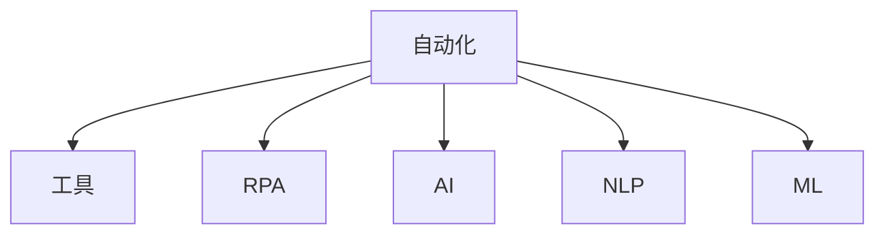

                 

# 自动化工具：创业者的得力助手

## 1. 背景介绍

在现代社会，创新创业的步伐不断加快，创业者面临着前所未有的机遇与挑战。从市场分析到产品设计，从客户沟通到团队管理，各个环节都需高效、精确地完成。自动化工具，作为现代技术创新与企业管理的得力助手，正在逐步重塑创业生态。本文将深入探讨自动化工具如何成为创业者不可或缺的助手，助推企业成长与创新。

## 2. 核心概念与联系

### 2.1 核心概念概述

为了更好地理解自动化工具在创业中的应用，首先需要了解以下核心概念：

- **自动化(Automation)**：通过工具、软件等技术手段，实现任务的无人工干预自动化处理。自动化工具可以大幅度提升工作效率，降低错误率，是现代企业的重要生产力工具。
- **工具(Tool)**：指软件、应用程序或硬件设备，用于特定任务或过程的自动化和优化。
- **机器人流程自动化(RPA)**：一种技术，通过软件机器人模拟人工操作，自动执行重复性高的任务。
- **人工智能(AI)**：赋予机器学习和理解的能力，使其能够执行复杂任务，并从经验中学习和改进。
- **自然语言处理(NLP)**：使计算机能够理解和处理人类语言的技术，是实现智能自动化和高效沟通的基础。
- **机器学习(ML)**：使计算机通过数据分析和模式识别，自动改进算法和任务执行效率。

这些概念之间的联系可以通过以下Mermaid流程图来展示：



该流程图展示了自动化工具通过RPA、AI、NLP、ML等技术手段，实现自动化处理的能力。

## 3. 核心算法原理 & 具体操作步骤

### 3.1 算法原理概述

自动化工具的核心算法原理主要包括机器人流程自动化（RPA）和机器学习（ML）。

**机器人流程自动化（RPA）**：
- **原理**：RPA利用软件机器人模拟人工操作，执行规则明确的业务流程。例如，自动化发票处理、客户服务聊天机器人等。
- **操作步骤**：
  1. 识别和定义流程规则。
  2. 部署机器人至指定系统。
  3. 运行机器人并监控其执行情况。
  4. 根据结果调整和优化流程规则。

**机器学习（ML）**：
- **原理**：通过算法从数据中学习模式和规律，预测未来行为或结果。例如，客户细分、销售预测等。
- **操作步骤**：
  1. 收集和整理数据。
  2. 选择和训练模型。
  3. 验证模型性能。
  4. 部署和应用模型。

### 3.2 算法步骤详解

**RPA操作步骤**：
1. **流程分析**：分析业务流程，识别出可以自动化的步骤。
2. **工具选择**：选择适合的RPA工具和平台，如UiPath、Blue Prism等。
3. **流程设计**：设计自动化流程，包括数据提取、转换、加载等步骤。
4. **测试与部署**：在测试环境中测试自动化流程，确保无误后部署到生产环境。
5. **持续优化**：监控自动化流程运行情况，根据实际业务变化进行优化。

**ML操作步骤**：
1. **数据准备**：收集和清洗数据，确保数据质量和一致性。
2. **模型选择**：根据问题选择合适的机器学习算法，如线性回归、决策树、神经网络等。
3. **模型训练**：使用训练集数据训练模型。
4. **模型验证**：使用验证集数据验证模型性能。
5. **模型应用**：在实际业务中应用模型，进行预测或决策。
6. **模型监控与更新**：监控模型性能，根据新数据定期更新模型。

### 3.3 算法优缺点

**RPA的优点**：
- **提升效率**：RPA可以处理大量重复性任务，大大提升工作效率。
- **减少错误**：通过标准化的自动化流程，减少人为错误。
- **成本效益**：部署RPA工具相对低廉，维护成本较低。

**RPA的缺点**：
- **依赖规则**：适用于规则明确、流程固定的场景，灵活性较差。
- **复杂任务挑战**：难以处理复杂多变、需要决策的任务。
- **维护成本**：需要持续更新和维护自动化流程，保证其准确性和可靠性。

**ML的优点**：
- **自主学习**：通过数据驱动的算法，自动学习模式和规律。
- **灵活性高**：适用于复杂多变的场景，能够处理非结构化数据。
- **决策质量高**：基于数据的决策更加客观、准确。

**ML的缺点**：
- **数据依赖**：需要大量高质量的数据，数据偏差会影响模型性能。
- **复杂度高**：算法和模型复杂，需要专业知识进行开发和维护。
- **部署成本高**：需要高性能计算资源和专业知识进行部署和维护。

### 3.4 算法应用领域

自动化工具的应用领域广泛，涵盖企业管理、客户服务、市场营销、财务处理等多个方面：

- **企业管理**：自动化流程管理、供应链优化、人力资源管理等。
- **客户服务**：自动化客户咨询、客户支持、客户关系管理等。
- **市场营销**：自动化市场分析、广告投放、销售预测等。
- **财务处理**：自动化发票处理、账目核对、财务报表生成等。
- **研发创新**：自动化数据分析、原型开发、代码测试等。

自动化工具的应用使创业企业在各个环节提升效率，降低成本，快速响应市场变化，从而在竞争中占据有利位置。

## 4. 数学模型和公式 & 详细讲解 & 举例说明

### 4.1 数学模型构建

**机器人流程自动化（RPA）模型**：
- **输入**：流程描述、数据源、系统接口。
- **输出**：自动化流程、任务处理结果、监控数据。

**机器学习（ML）模型**：
- **输入**：训练数据、特征集、算法。
- **输出**：模型参数、预测结果、性能指标。

### 4.2 公式推导过程

**RPA模型公式**：
$$
RPA_{output} = F(RPA_{input}, System_{interface})
$$
其中，$RPA_{input}$ 表示流程描述和数据源，$System_{interface}$ 表示与系统的接口，$F$ 表示自动化流程函数。

**ML模型公式**：
$$
ML_{prediction} = M_{algorithm}(X_{train}, X_{test})
$$
其中，$X_{train}$ 表示训练数据集，$X_{test}$ 表示测试数据集，$M_{algorithm}$ 表示机器学习算法函数，$ML_{prediction}$ 表示模型预测结果。

### 4.3 案例分析与讲解

**案例：自动化发票处理**

1. **流程分析**：自动识别发票图片，提取发票信息，并生成电子发票。
2. **工具选择**：选择OCR技术和Tesseract OCR库。
3. **流程设计**：使用RPA工具模拟人工操作，识别图片并提取信息。
4. **测试与部署**：在测试环境中运行RPA流程，确保准确性后部署至生产环境。
5. **持续优化**：根据实际业务反馈，调整OCR模型参数，提升识别准确率。

**案例：客户细分**

1. **数据准备**：收集客户行为数据，清洗和整理数据。
2. **模型选择**：选择K-means聚类算法。
3. **模型训练**：使用客户数据集训练K-means模型。
4. **模型验证**：使用验证集数据评估模型性能。
5. **模型应用**：根据模型结果，将客户分为不同细分市场。
6. **模型监控与更新**：定期更新模型参数，确保细分市场划分准确性。

## 5. 项目实践：代码实例和详细解释说明

### 5.1 开发环境搭建

**环境配置**：
1. **操作系统**：Windows 10 或 macOS。
2. **编程语言**：Python 3.8 及以上版本。
3. **开发工具**：Visual Studio Code、PyCharm 等IDE。
4. **依赖库**：OpenCV、Tesseract OCR、UiPath、TensorFlow 等。

**配置示例**：
```bash
pip install opencv-python
pip install pytesseract
pip install ui-path-studio
pip install tensorflow
```

### 5.2 源代码详细实现

**RPA示例代码**：

```python
import ui_path
from ui_path import RPA

# 定义自动化流程
def process_invoice(invoice_path):
    # 读取发票图片
    invoice_image = open(invoice_path, 'rb').read()
    
    # 使用OCR提取发票信息
    ocr_data = rpa.ocr(invoice_image)
    
    # 生成电子发票
    rpa.generate_invoice(ocr_data)

# 运行自动化流程
if __name__ == '__main__':
    process_invoice('invoice.png')
```

**ML示例代码**：

```python
import tensorflow as tf
from sklearn.cluster import KMeans

# 准备数据集
X_train = load_data('train.csv')
X_test = load_data('test.csv')

# 定义K-means模型
kmeans = KMeans(n_clusters=5)

# 训练模型
kmeans.fit(X_train)

# 预测细分市场
y_pred = kmeans.predict(X_test)

# 输出预测结果
print(y_pred)
```

### 5.3 代码解读与分析

**RPA示例代码解读**：
- **步骤1**：通过UiPath的RPA工具，读取发票图片。
- **步骤2**：使用OCR技术提取发票上的信息。
- **步骤3**：将提取的信息生成电子发票。

**ML示例代码解读**：
- **步骤1**：使用TensorFlow加载数据集。
- **步骤2**：定义K-means模型，进行聚类分析。
- **步骤3**：使用测试集数据预测细分市场。

## 6. 实际应用场景

### 6.1 智能客服系统

智能客服系统通过RPA和NLP技术，自动化处理客户咨询，提升客户满意度和服务效率。使用RPA技术，自动执行客服流程，如接听电话、回复消息等。同时，使用NLP技术，理解客户意图，生成响应。智能客服系统能够24小时不间断服务，快速响应客户需求，大大提升客户体验。

### 6.2 市场营销

市场营销中，自动化工具通过RPA和ML技术，实现市场分析、广告投放、销售预测等任务。RPA技术自动化处理数据采集和处理，确保数据的准确性和及时性。ML技术通过数据驱动，预测市场趋势和客户行为，指导营销策略制定和优化。通过自动化工具，市场营销部门能够更快速、精准地进行决策，提升营销效果。

### 6.3 财务管理

财务处理是企业管理的核心环节，通过RPA和ML技术，可以自动化处理发票处理、账目核对、财务报表生成等任务。RPA技术自动化处理重复性高、规则明确的财务流程，提高工作效率和准确性。ML技术通过数据分析，预测财务风险和趋势，辅助决策。

## 7. 工具和资源推荐

### 7.1 学习资源推荐

**1. UiPath官方文档**：UiPath提供了详细的技术文档和示例代码，帮助你快速上手RPA开发。
**2. TensorFlow官方文档**：TensorFlow提供了丰富的机器学习算法和模型，帮助开发和部署ML应用。
**3. Google Cloud Platform 学习中心**：提供了RPA和ML的实战课程和案例，帮助深入理解自动化工具的应用。
**4. Coursera的“Machine Learning”课程**：由斯坦福大学教授Andrew Ng讲授，深入讲解ML的原理和应用。

### 7.2 开发工具推荐

**1. UiPath Studio**：RPA开发的主流工具，支持流程自动化、测试和部署。
**2. Visual Studio Code**：轻量级IDE，支持多种编程语言和扩展。
**3. TensorFlow**：深度学习框架，支持构建和训练复杂的ML模型。
**4. Apache Kafka**：数据流处理平台，支持自动化数据处理和分析。

### 7.3 相关论文推荐

**1. "Robotic Process Automation: Principles, Opportunities and Challenges"**：探讨RPA技术的应用和挑战。
**2. "Deep Learning with Google TensorFlow"**：介绍TensorFlow框架和机器学习应用。
**3. "Customer Relationship Management with AI: A Survey"**：综述AI在客户关系管理中的应用。

## 8. 总结：未来发展趋势与挑战

### 8.1 研究成果总结

本文详细探讨了自动化工具在创业中的应用，涵盖RPA和ML两大核心技术。自动化工具通过提升效率、降低错误率、优化流程，极大地提升了企业的生产力和竞争力。未来，自动化工具的应用将更加广泛和深入，进一步推动企业管理和运营的智能化。

### 8.2 未来发展趋势

未来自动化工具的发展趋势包括：

- **智能自动化**：通过NLP和AI技术，提升自动化流程的智能化和灵活性。
- **多模态融合**：将文本、图像、语音等多模态数据融合，实现更全面的自动化处理。
- **自动化生态系统**：构建自动化工具之间的生态系统，实现无缝协作和信息共享。
- **跨行业应用**：自动化工具将进一步拓展到更多行业，实现跨领域的智能化应用。

### 8.3 面临的挑战

自动化工具的发展仍面临诸多挑战：

- **数据质量**：高质量的数据是自动化工具的基础，数据的准确性和一致性直接影响工具的性能。
- **技术门槛**：自动化工具的应用需要一定的技术知识和开发能力，对人员素质要求较高。
- **安全和隐私**：自动化工具处理大量敏感数据，如何保障数据安全和隐私是重要问题。
- **成本控制**：自动化工具的开发和维护成本较高，如何平衡成本与收益是关键。

### 8.4 研究展望

未来，自动化工具的发展需要在以下方向进行突破：

- **数据治理**：建立标准化的数据治理流程，确保数据质量和一致性。
- **技术普及**：通过教育和培训，普及自动化工具的技术和应用知识，降低门槛。
- **安全保障**：引入数据加密、访问控制等安全措施，保障数据安全和隐私。
- **成本优化**：通过云计算、容器化等技术，降低自动化工具的部署和维护成本。

自动化工具的发展前景广阔，未来将在更多行业和企业中得到应用，推动数字化转型的进程。创业者应积极拥抱自动化工具，提升企业竞争力和效率。

## 9. 附录：常见问题与解答

**Q1：如何选择合适的自动化工具？**

A: 选择合适的自动化工具需考虑以下因素：
- **任务复杂度**：根据任务复杂度选择适当的RPA工具或ML算法。
- **数据需求**：评估工具对数据的需求，确保工具能够处理所需数据。
- **部署成本**：考虑工具的部署成本和维护成本，选择性价比高的工具。
- **技术支持**：评估工具的技术支持和社区资源，确保工具的稳定性和可维护性。

**Q2：自动化工具如何提升企业效率？**

A: 自动化工具通过以下方式提升企业效率：
- **减少人为干预**：自动化处理重复性高、规则明确的流程，减少人工错误。
- **提升处理速度**：自动化工具可以并行处理大量任务，提升处理速度。
- **优化资源配置**：自动化工具能够动态调整资源分配，提高资源利用率。
- **降低人力成本**：自动化工具可以减少人力需求，降低人工成本。

**Q3：自动化工具在企业中的常见应用场景？**

A: 自动化工具在企业中的常见应用场景包括：
- **财务处理**：自动化发票处理、账目核对、财务报表生成等。
- **人力资源管理**：自动化员工招聘、绩效评估、工资发放等。
- **客户服务**：自动化客户咨询、客户关系管理等。
- **市场营销**：自动化市场分析、广告投放、销售预测等。

**Q4：自动化工具如何保障数据安全和隐私？**

A: 自动化工具保障数据安全和隐私的措施包括：
- **数据加密**：使用数据加密技术，确保数据在传输和存储过程中的安全。
- **访问控制**：设置严格的访问权限，限制数据的访问和使用。
- **审计记录**：记录数据操作日志，便于审计和追溯。
- **安全培训**：对相关人员进行安全培训，提升安全意识和技能。

通过本文的详细探讨，希望读者能够更好地理解自动化工具在创业中的应用，积极利用自动化工具提升企业的生产力和竞争力。未来，自动化工具将在更多领域得到广泛应用，助力企业迈向智能化和高效化。

