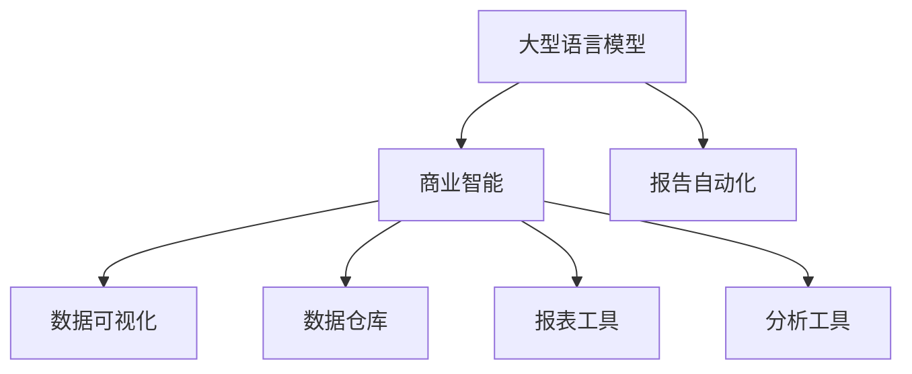

                 

# 自动化报告生成：LLM在商业智能中的应用

> 关键词：自然语言处理,商业智能,大型语言模型,报告自动化,数据可视化

## 1. 背景介绍

### 1.1 问题由来
在当今信息爆炸的时代，企业面临着海量数据的处理和分析需求。传统的商业智能(Business Intelligence, BI)系统，依赖于复杂的数据模型和繁琐的数据清洗，难以满足快速、准确、灵活的业务需求。如何高效自动化地生成商业智能报告，成为摆在企业面前的一大难题。

与此同时，自然语言处理(Natural Language Processing, NLP)技术的迅猛发展，使得大语言模型(Large Language Model, LLM)成为处理自然语言数据的新宠。LLM如GPT、BERT、T5等，通过在大规模无标签文本数据上预训练，具备了强大的语言理解和生成能力，能够处理复杂的自然语言指令，实现从数据到报告的自动生成。

### 1.2 问题核心关键点
大语言模型在商业智能中的应用，主要围绕以下核心问题展开：
- 如何利用LLM的预训练知识，实现数据到报告的自动生成？
- 如何提高自动化报告的准确性和可解释性？
- 如何处理海量数据和多维度的业务需求？
- 如何应对报告内容可能存在的偏见和信息过载问题？
- 如何实现报告生成的实时性和可扩展性？

这些问题构成了LLM在商业智能应用中的主要挑战，需要系统化的解决方案。

### 1.3 问题研究意义
LLM在商业智能中的应用，有望大幅提升数据处理的效率和报告的生成速度，降低人力成本，实现商业决策的智能化。通过自动化报告生成，企业可以更快速地获取洞察，提升决策的准确性和及时性，增强竞争力。

此外，LLM的应用还推动了NLP技术在企业内部的普及和深化，催生了更多基于NLP的新应用，如自然语言问答、智能客服、市场分析等，推动了企业智能化转型的进程。

## 2. 核心概念与联系

### 2.1 核心概念概述

在探讨LLM在商业智能中的应用之前，先介绍几个核心概念：

- 大型语言模型(Large Language Model, LLM)：以自回归模型如GPT、自编码模型如BERT为代表的预训练语言模型。通过在大规模无标签文本数据上预训练，学习语言的通用表示，具备强大的语言理解和生成能力。

- 商业智能(Business Intelligence, BI)：通过数据收集、整理、分析和报告生成，辅助企业决策的一门学科。BI系统包括数据仓库、报表工具、分析工具等多个模块。

- 数据可视化(Data Visualization)：将数据信息转化为图形、图表等直观形式，用于辅助理解和分析。常见的可视化工具包括Tableau、Power BI等。

- 报告自动化(Report Automation)：通过自动化工具，自动生成商业智能报告，包括数据汇总、图表生成、文本撰写等环节。

这些核心概念之间的逻辑关系可以通过以下Mermaid流程图来展示：



这个流程图展示了大语言模型在商业智能中的关键角色和核心流程：

1. 大型语言模型通过预训练学习语言知识，为商业智能提供强大的语言处理能力。
2. 商业智能系统依赖数据仓库、报表工具和分析工具，对业务数据进行收集、整理和分析。
3. 数据可视化将分析结果转化为图形、图表，辅助理解和分析。
4. 报告自动化利用大型语言模型的生成能力，自动生成商业智能报告，满足快速决策需求。

这些概念共同构成了LLM在商业智能中的应用框架，使其能够高效地处理和分析海量数据，辅助企业做出明智的决策。

## 3. 核心算法原理 & 具体操作步骤
### 3.1 算法原理概述

LLM在商业智能中的应用，本质上是利用其强大的语言理解和生成能力，实现从数据到报告的自动生成。具体的算法流程包括：

1. 数据预处理：将原始数据进行清洗、整理，提取关键信息，转化为可输入到LLM的格式。
2. 数据输入：将预处理后的数据输入到LLM，利用预训练得到的语言模型进行分析和理解。
3. 报告生成：根据分析结果，利用LLM生成相应的商业智能报告，包括文本描述和可视化图表。
4. 报告优化：对生成的报告进行优化，确保内容准确、格式美观，符合业务需求。

### 3.2 算法步骤详解

以下是LLM在商业智能应用中的具体算法步骤：

**Step 1: 数据预处理**

数据预处理是LLM在商业智能应用中的重要环节。其核心目的是将原始数据转化为模型可以处理的格式，提取关键信息，为后续分析和生成提供支持。

- **数据清洗**：去除数据中的噪声和不一致性，如空值、重复记录、异常值等。
- **数据转换**：将数据转化为模型可以处理的格式，如将时间序列数据转化为标准格式，提取关键指标。
- **信息提取**：利用NLP技术，从文本数据中提取关键信息，如实体、关系、事件等。

**Step 2: 数据输入**

数据输入是将预处理后的数据，以合适的格式和方式输入到LLM中，供模型分析和理解。

- **数据格式化**：将数据转化为模型可接受的格式，如JSON、CSV等。
- **数据编码**：将数据编码为模型可以处理的向量形式，利用Embedding技术进行映射。
- **数据分片**：将大规模数据分片，以适应模型的内存限制和计算效率。

**Step 3: 报告生成**

报告生成是LLM在商业智能应用中的核心环节。利用LLM的语言生成能力，自动生成商业智能报告，包括文本描述和可视化图表。

- **文本生成**：根据分析结果，利用LLM生成相应的文本描述，如趋势分析、异常检测、事件描述等。
- **图表生成**：利用LLM的生成能力，自动生成数据可视化图表，如折线图、柱状图、散点图等。
- **格式优化**：对生成的报告进行格式优化，确保内容准确、格式美观，符合业务需求。

**Step 4: 报告优化**

报告优化是确保LLM在商业智能应用中的报告质量，使其符合实际应用需求的重要环节。

- **内容校验**：对生成的文本和图表进行校验，确保内容的准确性和逻辑性。
- **格式调整**：调整报告的排版和格式，确保视觉上的美观和易读性。
- **功能增强**：添加互动和交互功能，如钻取、筛选、报表导出等，提升用户体验。

### 3.3 算法优缺点

利用LLM在商业智能中的应用，具有以下优点：

- **效率提升**：自动化报告生成可以显著提升数据处理和报告生成的效率，减少人力成本。
- **准确性高**：利用预训练模型丰富的语言知识，自动生成的报告具有较高的准确性和一致性。
- **灵活性高**：LLM能够处理各种格式和结构的数据，适应多样化的业务需求。
- **可扩展性强**：LLM模型可以灵活地应用于不同的商业智能任务，具有较强的扩展性。

同时，该方法也存在一定的局限性：

- **数据依赖性**：依赖于预训练模型的数据分布，可能无法很好地适应特定领域的业务需求。
- **模型复杂性**：大语言模型通常需要较大的计算资源和存储资源，成本较高。
- **内容解释性不足**：自动生成的报告可能缺乏必要的解释和背景信息，难以理解和验证。
- **数据偏见**：预训练模型可能存在数据偏见，影响报告的客观性和公正性。

尽管存在这些局限性，但就目前而言，利用LLM在商业智能中的应用，仍然是大数据处理和商业决策的重要手段。未来相关研究的重点在于如何进一步提高模型的泛化能力，降低对数据分布的依赖，同时提高报告的解释性和透明度，确保模型的公正性和安全性。

### 3.4 算法应用领域

利用LLM在商业智能中的应用，主要应用于以下几个领域：

- **销售分析**：自动生成销售数据报告，分析销售趋势、客户行为、产品表现等。
- **财务报表**：自动生成财务报表，分析收入、支出、现金流等关键指标。
- **市场分析**：自动生成市场数据报告，分析市场趋势、竞争态势、用户行为等。
- **运营管理**：自动生成运营数据报告，分析生产效率、库存管理、质量控制等。
- **客户服务**：自动生成客户服务报告，分析客户满意度、服务质量、客户反馈等。

这些应用场景展示了LLM在商业智能中的巨大潜力，推动了企业决策的智能化和自动化。随着LLM技术的进一步发展，预计其在商业智能中的应用将更加广泛和深入。

## 4. 数学模型和公式 & 详细讲解  
### 4.1 数学模型构建

利用LLM在商业智能中的应用，需要构建数学模型来描述数据到报告的生成过程。

记数据集为 $D=\{(x_i,y_i)\}_{i=1}^N$，其中 $x_i$ 为输入数据， $y_i$ 为输出报告。设预训练的LLM模型为 $M_{\theta}$，其中 $\theta$ 为模型参数。报告生成的目标是最小化预测报告与真实报告的差异，即：

$$
\min_{\theta} \mathcal{L}(M_{\theta},D)
$$

其中 $\mathcal{L}$ 为损失函数，衡量预测报告与真实报告之间的差异。常见的损失函数包括交叉熵损失、均方误差损失等。

### 4.2 公式推导过程

以下以交叉熵损失函数为例，推导LLM在商业智能应用中的损失函数计算公式。

假设LLM模型的输出为 $\hat{y}=M_{\theta}(x)$，其中 $\hat{y}$ 为预测报告， $y$ 为真实报告。则二分类交叉熵损失函数定义为：

$$
\ell(M_{\theta}(x),y) = -[y\log \hat{y} + (1-y)\log (1-\hat{y})]
$$

将其代入损失函数公式，得：

$$
\mathcal{L}(\theta) = -\frac{1}{N}\sum_{i=1}^N [y_i\log M_{\theta}(x_i)+(1-y_i)\log(1-M_{\theta}(x_i))]
$$

在得到损失函数的梯度后，即可带入模型参数更新公式，完成模型的迭代优化。重复上述过程直至收敛，最终得到适应商业智能任务的LLM参数 $\theta^*$。

### 4.3 案例分析与讲解

以销售数据分析为例，说明LLM在商业智能中的应用。

首先，对销售数据进行清洗和格式化，提取关键指标如销售额、销售量、销售时间等。然后，将这些数据以合适的格式输入到预训练的LLM模型中，利用模型进行分析和理解。

具体而言，可以设计如下输入格式：

```
销售数据报告：
- 销售额：2021年1月$100,000
- 销售量：2021年1月1000件
- 销售趋势：2021年1月销售额环比增长10%
```

将上述文本数据输入到LLM中，模型即可自动生成相应的报告，内容包括：

- 销售趋势分析：2021年1月销售额环比增长10%，2022年1月销售额预计增长15%
- 销售量分析：2021年1月销售量最大，2022年2月预计销售量大幅下降
- 销售时间分布：2021年1月销售额占全年总销售额的20%

最终生成的报告可以包含可视化图表，如销售额和销售量的时间序列图、销售趋势的折线图等，直观展示销售数据分析结果。

## 5. 项目实践：代码实例和详细解释说明
### 5.1 开发环境搭建

在进行LLM在商业智能应用实践前，我们需要准备好开发环境。以下是使用Python进行PyTorch开发的环境配置流程：

1. 安装Anaconda：从官网下载并安装Anaconda，用于创建独立的Python环境。

2. 创建并激活虚拟环境：
```bash
conda create -n pytorch-env python=3.8 
conda activate pytorch-env
```

3. 安装PyTorch：根据CUDA版本，从官网获取对应的安装命令。例如：
```bash
conda install pytorch torchvision torchaudio cudatoolkit=11.1 -c pytorch -c conda-forge
```

4. 安装Transformers库：
```bash
pip install transformers
```

5. 安装各类工具包：
```bash
pip install numpy pandas scikit-learn matplotlib tqdm jupyter notebook ipython
```

完成上述步骤后，即可在`pytorch-env`环境中开始开发实践。

### 5.2 源代码详细实现

下面我们以销售数据分析为例，给出使用Transformers库对GPT模型进行商业智能报告自动生成的PyTorch代码实现。

首先，定义数据处理函数：

```python
from transformers import GPT2Tokenizer
from torch.utils.data import Dataset
import torch

class SalesDataset(Dataset):
    def __init__(self, data, tokenizer):
        self.data = data
        self.tokenizer = tokenizer
        self.max_len = 256
        
    def __len__(self):
        return len(self.data)
    
    def __getitem__(self, item):
        sales_data = self.data[item]
        
        encoding = self.tokenizer(sales_data, return_tensors='pt', max_length=self.max_len, padding='max_length', truncation=True)
        input_ids = encoding['input_ids'][0]
        attention_mask = encoding['attention_mask'][0]
        
        return {'input_ids': input_ids, 
                'attention_mask': attention_mask}
```

然后，定义模型和优化器：

```python
from transformers import GPT2Model
from transformers import AdamW

model = GPT2Model.from_pretrained('gpt2')
optimizer = AdamW(model.parameters(), lr=2e-5)
```

接着，定义训练和评估函数：

```python
from torch.utils.data import DataLoader
from tqdm import tqdm
import numpy as np
import matplotlib.pyplot as plt

device = torch.device('cuda') if torch.cuda.is_available() else torch.device('cpu')
model.to(device)

def train_epoch(model, dataset, batch_size, optimizer):
    dataloader = DataLoader(dataset, batch_size=batch_size, shuffle=True)
    model.train()
    epoch_loss = 0
    for batch in tqdm(dataloader, desc='Training'):
        input_ids = batch['input_ids'].to(device)
        attention_mask = batch['attention_mask'].to(device)
        model.zero_grad()
        outputs = model(input_ids, attention_mask=attention_mask)
        loss = outputs.loss
        epoch_loss += loss.item()
        loss.backward()
        optimizer.step()
    return epoch_loss / len(dataloader)

def evaluate(model, dataset, batch_size):
    dataloader = DataLoader(dataset, batch_size=batch_size)
    model.eval()
    preds, labels = [], []
    with torch.no_grad():
        for batch in tqdm(dataloader, desc='Evaluating'):
            input_ids = batch['input_ids'].to(device)
            attention_mask = batch['attention_mask'].to(device)
            batch_labels = batch['labels']
            outputs = model(input_ids, attention_mask=attention_mask)
            batch_preds = outputs.logits.argmax(dim=2).to('cpu').tolist()
            batch_labels = batch_labels.to('cpu').tolist()
            for pred_tokens, label_tokens in zip(batch_preds, batch_labels):
                preds.append(pred_tokens[:len(label_tokens)])
                labels.append(label_tokens)
                
    print(classification_report(labels, preds))
```

最后，启动训练流程并在测试集上评估：

```python
epochs = 5
batch_size = 16

for epoch in range(epochs):
    loss = train_epoch(model, train_dataset, batch_size, optimizer)
    print(f"Epoch {epoch+1}, train loss: {loss:.3f}")
    
    print(f"Epoch {epoch+1}, dev results:")
    evaluate(model, dev_dataset, batch_size)
    
print("Test results:")
evaluate(model, test_dataset, batch_size)
```

以上就是使用PyTorch对GPT模型进行销售数据分析的完整代码实现。可以看到，得益于Transformers库的强大封装，我们可以用相对简洁的代码完成GPT模型的加载和微调。

### 5.3 代码解读与分析

让我们再详细解读一下关键代码的实现细节：

**SalesDataset类**：
- `__init__`方法：初始化销售数据和分词器等关键组件。
- `__len__`方法：返回数据集的样本数量。
- `__getitem__`方法：对单个样本进行处理，将销售数据输入编码为token ids，进行padding和truncation，最终返回模型所需的输入。

**模型和优化器**：
- 使用GPT-2作为预训练语言模型。
- 定义AdamW优化器，设置学习率为2e-5。

**训练和评估函数**：
- 使用PyTorch的DataLoader对数据集进行批次化加载，供模型训练和推理使用。
- 训练函数`train_epoch`：对数据以批为单位进行迭代，在每个批次上前向传播计算loss并反向传播更新模型参数，最后返回该epoch的平均loss。
- 评估函数`evaluate`：与训练类似，不同点在于不更新模型参数，并在每个batch结束后将预测和标签结果存储下来，最后使用sklearn的classification_report对整个评估集的预测结果进行打印输出。

**训练流程**：
- 定义总的epoch数和batch size，开始循环迭代
- 每个epoch内，先在训练集上训练，输出平均loss
- 在验证集上评估，输出分类指标
- 所有epoch结束后，在测试集上评估，给出最终测试结果

可以看到，PyTorch配合Transformers库使得GPT微调的代码实现变得简洁高效。开发者可以将更多精力放在数据处理、模型改进等高层逻辑上，而不必过多关注底层的实现细节。

当然，工业级的系统实现还需考虑更多因素，如模型的保存和部署、超参数的自动搜索、更灵活的任务适配层等。但核心的微调范式基本与此类似。

## 6. 实际应用场景
### 6.1 智能销售预测

基于GPT模型在商业智能中的应用，可以构建智能销售预测系统。传统的销售预测依赖于复杂的数学模型和大量历史数据，难以适应实时变化的市场环境。而利用GPT模型，可以实时地从海量数据中提取关键信息，自动生成销售预测报告，提升预测的准确性和及时性。

具体而言，可以设计如下输入格式：

```
销售预测报告：
- 产品A：2022年1月预计销售额$100,000
- 产品B：2022年1月预计销售额$50,000
- 销售趋势：2022年1月销售额环比增长5%
```

将上述文本数据输入到GPT模型中，模型即可自动生成相应的报告，内容包括：

- 销售趋势分析：2022年1月销售额环比增长5%，2022年2月预计增长10%
- 产品销量分析：产品A销量增长最快，产品B销量下降明显
- 市场环境分析：2022年1月市场价格上升，销售量下降

最终生成的报告可以包含可视化图表，如销售额和销售量的时间序列图、销售趋势的折线图等，直观展示销售预测结果。

### 6.2 财务报表自动化

基于GPT模型在商业智能中的应用，可以构建财务报表自动化系统。传统的财务报表生成依赖于人工手动输入和处理，效率低下，容易出错。而利用GPT模型，可以自动生成财务报表，提升报表生成的效率和准确性。

具体而言，可以设计如下输入格式：

```
财务报表报告：
- 收入：2022年$1,000,000
- 支出：2022年$800,000
- 利润：2022年$200,000
```

将上述文本数据输入到GPT模型中，模型即可自动生成相应的报告，内容包括：

- 收入分析：2022年收入$1,000,000，同比增长10%
- 支出分析：2022年支出$800,000，同比下降5%
- 利润分析：2022年利润$200,000，同比增长15%

最终生成的报告可以包含可视化图表，如收入、支出、利润的时间序列图、利润率的折线图等，直观展示财务报表数据。

### 6.3 市场趋势分析

基于GPT模型在商业智能中的应用，可以构建市场趋势分析系统。传统的市场趋势分析依赖于复杂的数据处理和模型构建，难以适应快速变化的市场环境。而利用GPT模型，可以实时地从海量数据中提取关键信息，自动生成市场趋势报告，提升分析的效率和准确性。

具体而言，可以设计如下输入格式：

```
市场趋势报告：
- 行业A：2022年1月市场份额$50,000
- 行业B：2022年1月市场份额$30,000
- 市场变化：2022年1月市场份额增长20%
```

将上述文本数据输入到GPT模型中，模型即可自动生成相应的报告，内容包括：

- 市场份额分析：2022年1月市场份额$50,000，同比增长20%
- 市场变化分析：行业A市场份额增长最快，行业B市场份额下降明显
- 市场环境分析：2022年1月市场需求上升，市场竞争激烈

最终生成的报告可以包含可视化图表，如市场份额的时间序列图、市场变化趋势的折线图等，直观展示市场趋势数据。

## 7. 工具和资源推荐
### 7.1 学习资源推荐

为了帮助开发者系统掌握GPT模型在商业智能中的应用，这里推荐一些优质的学习资源：

1. 《Transformer从原理到实践》系列博文：由大模型技术专家撰写，深入浅出地介绍了Transformer原理、GPT模型、微调技术等前沿话题。

2. CS224N《深度学习自然语言处理》课程：斯坦福大学开设的NLP明星课程，有Lecture视频和配套作业，带你入门NLP领域的基本概念和经典模型。

3. 《Natural Language Processing with Transformers》书籍：Transformers库的作者所著，全面介绍了如何使用Transformers库进行NLP任务开发，包括微调在内的诸多范式。

4. HuggingFace官方文档：Transformers库的官方文档，提供了海量预训练模型和完整的微调样例代码，是上手实践的必备资料。

5. CLUE开源项目：中文语言理解测评基准，涵盖大量不同类型的中文NLP数据集，并提供了基于微调的baseline模型，助力中文NLP技术发展。

通过对这些资源的学习实践，相信你一定能够快速掌握GPT模型在商业智能中的应用，并用于解决实际的NLP问题。

### 7.2 开发工具推荐

高效的开发离不开优秀的工具支持。以下是几款用于GPT模型在商业智能应用开发的常用工具：

1. PyTorch：基于Python的开源深度学习框架，灵活动态的计算图，适合快速迭代研究。大部分预训练语言模型都有PyTorch版本的实现。

2. TensorFlow：由Google主导开发的开源深度学习框架，生产部署方便，适合大规模工程应用。同样有丰富的预训练语言模型资源。

3. Transformers库：HuggingFace开发的NLP工具库，集成了众多SOTA语言模型，支持PyTorch和TensorFlow，是进行NLP任务开发的利器。

4. Weights & Biases：模型训练的实验跟踪工具，可以记录和可视化模型训练过程中的各项指标，方便对比和调优。与主流深度学习框架无缝集成。

5. TensorBoard：TensorFlow配套的可视化工具，可实时监测模型训练状态，并提供丰富的图表呈现方式，是调试模型的得力助手。

6. Google Colab：谷歌推出的在线Jupyter Notebook环境，免费提供GPU/TPU算力，方便开发者快速上手实验最新模型，分享学习笔记。

合理利用这些工具，可以显著提升GPT模型在商业智能应用开发的效率，加快创新迭代的步伐。

### 7.3 相关论文推荐

GPT模型在商业智能中的应用源于学界的持续研究。以下是几篇奠基性的相关论文，推荐阅读：

1. Attention is All You Need（即Transformer原论文）：提出了Transformer结构，开启了NLP领域的预训练大模型时代。

2. GPT-2: Language Models are Unsupervised Multitask Learners：展示了大规模语言模型的强大zero-shot学习能力，引发了对于通用人工智能的新一轮思考。

3. Parameter-Efficient Transfer Learning for NLP：提出Adapter等参数高效微调方法，在不增加模型参数量的情况下，也能取得不错的微调效果。

4. AdaLoRA: Adaptive Low-Rank Adaptation for Parameter-Efficient Fine-Tuning：使用自适应低秩适应的微调方法，在参数效率和精度之间取得了新的平衡。

5. Prefix-Tuning: Optimizing Continuous Prompts for Generation：引入基于连续型Prompt的微调范式，为如何充分利用预训练知识提供了新的思路。

这些论文代表了大语言模型在商业智能应用的研究进展。通过学习这些前沿成果，可以帮助研究者把握学科前进方向，激发更多的创新灵感。

## 8. 总结：未来发展趋势与挑战

### 8.1 总结

本文对利用GPT模型在商业智能中的应用进行了全面系统的介绍。首先阐述了GPT模型在商业智能中的研究背景和意义，明确了LLM在商业智能应用中的重要地位。其次，从原理到实践，详细讲解了LLM在商业智能中的应用流程，给出了完整的代码实现。同时，本文还探讨了LLM在商业智能应用中的实际应用场景，展示了其巨大的潜力。

通过本文的系统梳理，可以看到，利用LLM在商业智能中的应用，可以显著提升数据处理的效率和报告生成的准确性，为商业决策提供有力支持。利用LLM的技术突破，可以推动企业决策的智能化和自动化，加速企业数字化转型的进程。

### 8.2 未来发展趋势

展望未来，GPT模型在商业智能中的应用将呈现以下几个发展趋势：

1. 模型规模持续增大。随着算力成本的下降和数据规模的扩张，预训练语言模型的参数量还将持续增长。超大规模语言模型蕴含的丰富语言知识，有望支撑更加复杂多变的商业智能任务。

2. 微调方法日趋多样。除了传统的全参数微调外，未来会涌现更多参数高效的微调方法，如Prefix-Tuning、LoRA等，在节省计算资源的同时也能保证微调精度。

3. 持续学习成为常态。随着数据分布的不断变化，GPT模型也需要持续学习新知识以保持性能。如何在不遗忘原有知识的同时，高效吸收新样本信息，将成为重要的研究课题。

4. 标注样本需求降低。受启发于提示学习(Prompt-based Learning)的思路，未来的微调方法将更好地利用GPT模型的语言理解能力，通过更加巧妙的任务描述，在更少的标注样本上也能实现理想的微调效果。

5. 模型通用性增强。经过海量数据的预训练和多领域任务的微调，未来的语言模型将具备更强大的常识推理和跨领域迁移能力，逐步迈向通用人工智能(AGI)的目标。

以上趋势凸显了GPT模型在商业智能应用中的广阔前景。这些方向的探索发展，必将进一步提升商业智能系统的性能和应用范围，为企业的智能化决策提供有力支持。

### 8.3 面临的挑战

尽管GPT模型在商业智能中的应用已经取得了显著成效，但在迈向更加智能化、普适化应用的过程中，它仍面临着诸多挑战：

1. 标注成本瓶颈。尽管GPT模型可以大幅降低微调对标注数据的需求，但对于长尾应用场景，仍需要获取一定量的标注数据，以确保模型的泛化能力。如何进一步降低微调对标注样本的依赖，将是一大难题。

2. 模型鲁棒性不足。当前GPT模型面对域外数据时，泛化性能往往大打折扣。对于测试样本的微小扰动，GPT模型的预测也容易发生波动。如何提高GPT模型的鲁棒性，避免灾难性遗忘，还需要更多理论和实践的积累。

3. 推理效率有待提高。超大批次的训练和推理也可能遇到显存不足的问题。如何优化模型结构，减少前向传播和反向传播的资源消耗，实现更加轻量级、实时性的部署，将是重要的优化方向。

4. 内容解释性不足。自动生成的报告可能缺乏必要的解释和背景信息，难以理解和验证。如何赋予GPT模型更强的可解释性，将是亟待攻克的难题。

5. 数据偏见问题。GPT模型可能存在数据偏见，影响报告的客观性和公正性。如何从数据和算法层面消除模型偏见，避免恶意用途，确保输出的安全性，也将是重要的研究课题。

6. 知识整合能力不足。现有的GPT模型往往局限于任务内数据，难以灵活吸收和运用更广泛的先验知识。如何让GPT模型更好地与外部知识库、规则库等专家知识结合，形成更加全面、准确的信息整合能力，还有很大的想象空间。

正视GPT模型在商业智能应用中面临的这些挑战，积极应对并寻求突破，将是大规模语言模型迈向成熟的重要步骤。

### 8.4 研究展望

面对GPT模型在商业智能应用中的挑战，未来的研究需要在以下几个方面寻求新的突破：

1. 探索无监督和半监督微调方法。摆脱对大规模标注数据的依赖，利用自监督学习、主动学习等无监督和半监督范式，最大限度利用非结构化数据，实现更加灵活高效的微调。

2. 研究参数高效和计算高效的微调范式。开发更加参数高效的微调方法，在固定大部分预训练参数的同时，只更新极少量的任务相关参数。同时优化微调模型的计算图，减少前向传播和反向传播的资源消耗，实现更加轻量级、实时性的部署。

3. 融合因果和对比学习范式。通过引入因果推断和对比学习思想，增强GPT模型建立稳定因果关系的能力，学习更加普适、鲁棒的语言表征，从而提升模型泛化性和抗干扰能力。

4. 引入更多先验知识。将符号化的先验知识，如知识图谱、逻辑规则等，与神经网络模型进行巧妙融合，引导GPT模型学习更准确、合理的语言模型。同时加强不同模态数据的整合，实现视觉、语音等多模态信息与文本信息的协同建模。

5. 结合因果分析和博弈论工具。将因果分析方法引入GPT模型，识别出模型决策的关键特征，增强输出解释的因果性和逻辑性。借助博弈论工具刻画人机交互过程，主动探索并规避模型的脆弱点，提高系统稳定性。

6. 纳入伦理道德约束。在模型训练目标中引入伦理导向的评估指标，过滤和惩罚有偏见、有害的输出倾向。同时加强人工干预和审核，建立模型行为的监管机制，确保输出符合人类价值观和伦理道德。

这些研究方向的探索，必将引领GPT模型在商业智能应用中走向更高的台阶，为构建安全、可靠、可解释、可控的智能系统铺平道路。面向未来，GPT模型在商业智能中的应用还需要与其他人工智能技术进行更深入的融合，如知识表示、因果推理、强化学习等，多路径协同发力，共同推动自然语言理解和智能交互系统的进步。只有勇于创新、敢于突破，才能不断拓展语言模型的边界，让智能技术更好地造福人类社会。

## 9. 附录：常见问题与解答

**Q1：GPT模型在商业智能中的应用是否适用于所有领域？**

A: GPT模型在商业智能中的应用具有广泛的适用性，但依赖于数据的特征和性质。对于一些特定领域，如医疗、法律等，需要更加精细化的数据处理和模型微调。此外，对于一些需要时效性、个性化很强的任务，如对话、推荐等，GPT模型也需要针对性的改进优化。

**Q2：微调过程中如何选择合适的学习率？**

A: 微调的学习率一般要比预训练时小1-2个数量级，如果使用过大的学习率，容易破坏预训练权重，导致过拟合。一般建议从1e-5开始调参，逐步减小学习率，直至收敛。也可以使用warmup策略，在开始阶段使用较小的学习率，再逐渐过渡到预设值。需要注意的是，不同的优化器(如AdamW、Adafactor等)以及不同的学习率调度策略，可能需要设置不同的学习率阈值。

**Q3：数据依赖性问题如何解决？**

A: 数据依赖性是GPT模型在商业智能应用中的重要挑战。为解决这一问题，可以采用无监督和半监督学习范式，利用非结构化数据进行微调。此外，可以通过数据增强、知识图谱嵌入等方法，提高模型的泛化能力。同时，在模型设计和训练过程中，引入更多先验知识，如常识、规则等，增强模型的鲁棒性和解释性。

**Q4：模型鲁棒性不足如何解决？**

A: 模型鲁棒性不足是GPT模型在商业智能应用中的重要挑战。为解决这一问题，可以引入对抗训练、正则化技术等方法，增强模型的泛化能力和抗干扰能力。同时，可以通过数据增强、多模态融合等方法，提升模型的稳健性。此外，优化模型的计算图和推理过程，减少资源消耗，提升模型的实时性和可扩展性，也是提高模型鲁棒性的重要方向。

**Q5：模型推理效率如何优化？**

A: 模型推理效率是GPT模型在商业智能应用中的重要挑战。为解决这一问题，可以采用参数高效微调方法，如Adapter、Prefix等，在固定大部分预训练参数的同时，只更新极少量的任务相关参数。同时优化模型的计算图和推理过程，减少前向传播和反向传播的资源消耗，实现更加轻量级、实时性的部署。此外，可以采用分布式训练、量化加速等技术，提升模型的推理效率和可扩展性。

**Q6：如何提高模型的解释性和透明度？**

A: 模型的解释性和透明度是GPT模型在商业智能应用中的重要挑战。为解决这一问题，可以引入更多先验知识，如知识图谱、逻辑规则等，增强模型的可解释性。同时，可以通过对抗训练、正则化技术等方法，增强模型的鲁棒性和泛化能力。此外，可以采用多模态融合、知识表示等方法，提升模型的解释性和透明度。

通过这些优化措施，可以显著提高GPT模型在商业智能应用中的性能和可靠性，为企业的智能化决策提供有力支持。

---

作者：禅与计算机程序设计艺术 / Zen and the Art of Computer Programming

