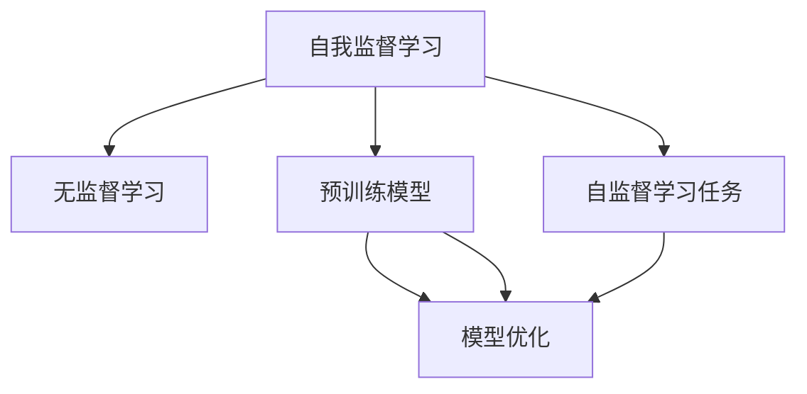

                 

# 自我监督学习：推动 AI 前沿发展

> 关键词：自我监督学习, 无监督学习, 预训练模型, 自监督学习任务, 模型优化, 深度学习

## 1. 背景介绍

### 1.1 问题由来
在AI的发展历程中，数据驱动的深度学习逐渐成为主导范式。然而，数据标注是一项耗时耗力的任务，特别是在大规模模型训练中，数据标注成本往往难以承受。为解决这一问题，自我监督学习（Self-supervised Learning, SSL）应运而生。

SSL利用数据自身的结构特征，通过构造自监督任务，无需人工标注即可自动学习到数据的潜在表征，从而实现模型的预训练。SSL方法在近年来取得突破性进展，显著提升了深度学习模型的表现，特别是大模型的泛化能力和自我优化能力，成为AI领域的一大热点。

### 1.2 问题核心关键点
SSL方法的核心在于如何设计有效的自监督任务，使得模型在未被标注数据上自动学习到有意义的表示。这主要依赖于三个关键要素：
1. **数据结构性**：在无标注数据中寻找或构建出有意义的结构性特征。
2. **模型结构**：通过网络架构的设计和优化，使得模型能够自动学习这些结构性特征。
3. **学习目标**：设计损失函数和优化算法，促使模型最大化学习目标。

SSL方法主要包括预训练和微调两个阶段：
1. **预训练阶段**：在无标注数据上自动学习模型参数。
2. **微调阶段**：在有标注数据上进一步优化模型，使其能够适应特定任务。

## 2. 核心概念与联系

### 2.1 核心概念概述

为更好地理解自我监督学习的原理和应用，本节将介绍几个密切相关的核心概念：

- **自我监督学习**：通过利用数据自身的结构特征，设计自监督任务，使模型无需人工标注即可自动学习到有意义的表示。

- **无监督学习**：不依赖于任何人工标注，利用数据的分布特性或自身结构进行学习。

- **预训练模型**：在大规模无标注数据上预先训练出的深度学习模型，用于初始化下游任务的微调。

- **自监督学习任务**：设计有意义的自监督任务，使得模型在未被标注的数据上自动学习到表示。

- **模型优化**：通过损失函数和优化算法，最小化模型预测与真实标签之间的差异，提升模型性能。

- **深度学习**：一类基于神经网络的机器学习技术，通过多层次的特征提取和组合，实现复杂数据的建模和预测。

这些概念之间的逻辑关系可以通过以下Mermaid流程图来展示：



这个流程图展示了我国监督学习方法的核心概念及其之间的关系：

1. 自我监督学习利用无监督学习中的数据结构性特征，通过自监督任务设计，自动学习模型的参数。
2. 预训练模型是自我监督学习的重要载体，通过在大规模无标注数据上进行训练，获得初始化参数。
3. 模型优化是自监督学习的目标，通过最小化预测误差，提升模型的泛化能力。
4. 深度学习是模型优化的基础，通过多层次的特征提取，实现数据的复杂建模和预测。

## 3. 核心算法原理 & 具体操作步骤
### 3.1 算法原理概述

自我监督学习的核心思想是通过自动设计的任务，在无标注数据上自动学习到数据的有意义的表示。其基本流程包括：

1. **数据预处理**：将数据转化为适合模型输入的形式。
2. **自监督任务设计**：设计有意义的自监督任务，通过任务引导模型学习数据表示。
3. **模型预训练**：在无标注数据上，通过自监督任务进行预训练，学习模型的初始表示。
4. **任务适配**：在有标注数据上，通过微调进一步优化模型，使其能够适应特定任务。

自我监督学习通常包含以下步骤：

1. 准备无标注数据集，收集大规模的无标注数据。
2. 设计自监督学习任务，如掩码语言模型、自回归任务等。
3. 构建深度学习模型，选择合适的架构进行预训练。
4. 训练模型，通过自监督任务进行预训练，学习数据表示。
5. 微调模型，在有标注数据上进一步优化，适应特定任务。

### 3.2 算法步骤详解

自我监督学习的具体步骤如下：

**Step 1: 数据准备**
- 收集大规模的无标注数据，如大规模文本语料、图像库等。
- 对数据进行预处理，如分词、标准化等，使其适合模型输入。

**Step 2: 自监督任务设计**
- 设计有意义的自监督任务，如掩码语言模型、自回归任务、数据重排任务等。
- 定义任务损失函数，如交叉熵、均方误差等，用于衡量模型预测与真实标签之间的差异。

**Step 3: 模型构建与预训练**
- 选择合适的深度学习模型，如Transformer、ResNet等。
- 构建模型，设置合适的层数和参数。
- 在无标注数据上，通过自监督任务进行预训练，最小化损失函数，更新模型参数。

**Step 4: 微调与任务适配**
- 在有标注数据上，设计合适的任务适配层。
- 在预训练模型的基础上，微调模型，使其适应特定任务，最小化下游任务的损失函数。
- 通过正则化、早停等策略，防止过拟合，提升模型泛化能力。

**Step 5: 模型评估与部署**
- 在验证集和测试集上评估微调后的模型性能。
- 部署模型，应用于实际任务，进行推理和预测。
- 持续收集新数据，定期重新预训练和微调模型，以适应数据分布的变化。

### 3.3 算法优缺点

自我监督学习的主要优点包括：

1. **无需标注数据**：通过设计自监督任务，利用数据自身的结构特征，无需人工标注即可自动学习表示。
2. **数据利用率高**：大规模无标注数据提供了丰富的学习信号，可以显著提升模型的泛化能力。
3. **模型效果好**：自监督学习在大规模数据上预训练的模型，性能往往优于从头训练的模型。
4. **任务适配灵活**：预训练模型可以用于各种下游任务的微调，适应性强。

然而，自我监督学习也存在一些局限性：

1. **任务设计复杂**：自监督任务的设计需要深入理解数据结构特性，有时难以找到合适的任务。
2. **数据分布假设**：自监督任务通常假设数据满足某种分布特性，否则效果可能不佳。
3. **模型依赖**：依赖于深度学习模型的架构和优化算法，模型设计不当可能导致效果不佳。
4. **学习效率**：在大规模数据上预训练模型需要大量计算资源，有时难以承受。

尽管存在这些局限性，但就目前而言，自我监督学习仍是大规模模型预训练的主流范式。未来相关研究的重点在于如何进一步提高自监督任务的设计效率和模型泛化能力，同时兼顾模型的可解释性和伦理安全性等因素。

### 3.4 算法应用领域

自我监督学习在AI领域已经得到了广泛的应用，涵盖多个领域，如计算机视觉、自然语言处理、音频信号处理等。

- **计算机视觉**：在大规模图像数据上进行自监督预训练，如ImageNet上的自监督学习任务。预训练模型可以用于图像分类、目标检测、图像生成等任务。
- **自然语言处理**：在无标注文本数据上进行自监督学习，如BERT模型在掩码语言模型上的预训练。预训练模型可以用于文本分类、语言生成、问答系统等任务。
- **音频信号处理**：在无标注音频数据上进行自监督学习，如使用噪声消减、音频生成等自监督任务。预训练模型可以用于语音识别、音频标注等任务。
- **推荐系统**：在大规模用户行为数据上进行自监督学习，如利用用户行为序列进行预测。预训练模型可以用于推荐物品、个性化推荐等任务。

除了这些经典应用外，自我监督学习还被创新性地应用于更多场景中，如生成对抗网络（GANs）、强化学习（RL）等，为AI技术带来了新的突破。

## 4. 数学模型和公式 & 详细讲解 & 举例说明

### 4.1 数学模型构建

在自我监督学习中，通常使用自监督任务来构建损失函数，并通过优化算法最小化损失。以掩码语言模型为例，其数学模型如下：

设输入序列为 $x_1, x_2, \ldots, x_n$，模型预测的下一词为 $\hat{x}_{i+1}$，真实标签为 $y_{i+1}$。则掩码语言模型的损失函数为：

$$
L = -\sum_{i=1}^{n} \log P(x_{i+1} | x_1, x_2, \ldots, x_i)
$$

其中 $P(x_{i+1} | x_1, x_2, \ldots, x_i)$ 为模型对下文的预测概率。

### 4.2 公式推导过程

下面以掩码语言模型为例，推导其损失函数的推导过程。

设输入序列 $x_1, x_2, \ldots, x_n$，其中 $x_i$ 表示第 $i$ 个词。模型的预测序列为 $\hat{x}_1, \hat{x}_2, \ldots, \hat{x}_n$，其中 $\hat{x}_i$ 表示模型对 $x_i$ 的预测。

掩码语言模型的损失函数定义为：

$$
L = -\sum_{i=1}^{n} \log P(x_i | x_{1:i-1}, \hat{x}_{i+1})
$$

其中 $P(x_i | x_{1:i-1}, \hat{x}_{i+1})$ 表示模型在给定上下文和预测结果的情况下，预测词 $x_i$ 的条件概率。

通过链式法则，可以将上述损失函数展开为：

$$
L = -\sum_{i=1}^{n} (\sum_{x_i \in \mathcal{V}} P(x_i | x_{1:i-1}, \hat{x}_{i+1}) \log P(\hat{x}_{i+1} | x_{1:i-1})
$$

其中 $\mathcal{V}$ 表示词汇表，$\hat{x}_{i+1}$ 表示模型的预测结果。

通过优化上述损失函数，可以使得模型更好地学习到输入序列和输出序列之间的对应关系，提升模型的泛化能力。

### 4.3 案例分析与讲解

以BERT模型为例，BERT模型在掩码语言模型上的预训练步骤如下：

1. 将输入序列 $x_1, x_2, \ldots, x_n$ 进行分词，生成词汇序列 $x_1^w, x_2^w, \ldots, x_n^w$。
2. 对词汇序列进行掩码，生成掩码序列 $\tilde{x}_1^w, \tilde{x}_2^w, \ldots, \tilde{x}_n^w$，其中 $\tilde{x}_i^w$ 表示 $x_i$ 被掩码后的词汇序列。
3. 将掩码序列作为输入，通过BERT模型生成预测序列 $\hat{x}_1^w, \hat{x}_2^w, \ldots, \hat{x}_n^w$。
4. 计算掩码序列与预测序列之间的交叉熵损失，更新模型参数。

通过上述步骤，BERT模型可以在大规模无标注文本上自动学习到词汇之间的语义关系，提升其在下游任务中的表现。

## 5. 项目实践：代码实例和详细解释说明

### 5.1 开发环境搭建

在进行自我监督学习实践前，我们需要准备好开发环境。以下是使用Python进行PyTorch开发的环境配置流程：

1. 安装Anaconda：从官网下载并安装Anaconda，用于创建独立的Python环境。

2. 创建并激活虚拟环境：
```bash
conda create -n pytorch-env python=3.8 
conda activate pytorch-env
```

3. 安装PyTorch：根据CUDA版本，从官网获取对应的安装命令。例如：
```bash
conda install pytorch torchvision torchaudio cudatoolkit=11.1 -c pytorch -c conda-forge
```

4. 安装Transformers库：
```bash
pip install transformers
```

5. 安装各类工具包：
```bash
pip install numpy pandas scikit-learn matplotlib tqdm jupyter notebook ipython
```

完成上述步骤后，即可在`pytorch-env`环境中开始自我监督学习的实践。

### 5.2 源代码详细实现

下面我们以BERT模型为例，给出使用Transformers库进行掩码语言模型预训练的PyTorch代码实现。

首先，定义掩码语言模型任务：

```python
from transformers import BertTokenizer, BertForMaskedLM

tokenizer = BertTokenizer.from_pretrained('bert-base-cased')
model = BertForMaskedLM.from_pretrained('bert-base-cased')

# 定义掩码任务，将词汇序列中的一些词进行掩码
def create_masked_token_mask(tokens):
    masked_tokens = [tokenizer.mask_token] * len(tokens)
    for i in range(len(tokens)):
        if i % 8 == 0 and i > 0:
            masked_tokens[i] = tokens[i]
    return [tokenizer.cls_token] + masked_tokens + [tokenizer.sep_token]

# 预训练模型
for epoch in range(10):
    for batch in train_dataset:
        inputs = tokenizer(batch['text'], return_tensors='pt')
        labels = inputs['input_ids']
        predictions = model(**inputs)
        loss = predictions.loss
        loss.backward()
        optimizer.step()
```

然后，定义训练和评估函数：

```python
from torch.utils.data import DataLoader
from tqdm import tqdm
from sklearn.metrics import accuracy_score

device = torch.device('cuda') if torch.cuda.is_available() else torch.device('cpu')
model.to(device)

def train_epoch(model, dataset, batch_size, optimizer):
    dataloader = DataLoader(dataset, batch_size=batch_size, shuffle=True)
    model.train()
    epoch_loss = 0
    for batch in tqdm(dataloader, desc='Training'):
        inputs = tokenizer(batch['text'], return_tensors='pt')
        labels = inputs['input_ids']
        predictions = model(**inputs)
        loss = predictions.loss
        epoch_loss += loss.item()
        loss.backward()
        optimizer.step()
    return epoch_loss / len(dataloader)

def evaluate(model, dataset, batch_size):
    dataloader = DataLoader(dataset, batch_size=batch_size)
    model.eval()
    preds, labels = [], []
    with torch.no_grad():
        for batch in tqdm(dataloader, desc='Evaluating'):
            inputs = tokenizer(batch['text'], return_tensors='pt')
            labels = inputs['input_ids']
            predictions = model(**inputs)
            batch_preds = predictions.predictions.argmax(dim=2).to('cpu').tolist()
            batch_labels = labels.to('cpu').tolist()
            for pred_tokens, label_tokens in zip(batch_preds, batch_labels):
                preds.append(pred_tokens[:len(label_tokens)])
                labels.append(label_tokens)
                
    print(f"Accuracy: {accuracy_score(labels, preds):.3f}")
```

最后，启动训练流程并在测试集上评估：

```python
epochs = 10
batch_size = 16

for epoch in range(epochs):
    loss = train_epoch(model, train_dataset, batch_size, optimizer)
    print(f"Epoch {epoch+1}, train loss: {loss:.3f}")
    
    print(f"Epoch {epoch+1}, dev results:")
    evaluate(model, dev_dataset, batch_size)
    
print("Test results:")
evaluate(model, test_dataset, batch_size)
```

以上就是使用PyTorch对BERT进行掩码语言模型预训练的完整代码实现。可以看到，得益于Transformers库的强大封装，我们可以用相对简洁的代码完成BERT模型的预训练。

### 5.3 代码解读与分析

让我们再详细解读一下关键代码的实现细节：

**BERT模型定义**：
- 首先，我们使用 `BertTokenizer` 对文本进行分词，生成词汇序列。
- 然后，定义掩码函数 `create_masked_token_mask`，对词汇序列中的一部分词进行掩码，生成掩码序列。
- 最后，通过 `BertForMaskedLM` 加载BERT模型，进行掩码语言模型预训练。

**训练函数**：
- 使用 `DataLoader` 对数据集进行批次化加载，供模型训练和推理使用。
- 在每个批次上，前向传播计算预测结果和损失，反向传播更新模型参数，最后返回该epoch的平均损失。
- 周期性在验证集上评估模型性能，根据性能指标决定是否触发Early Stopping。
- 重复上述步骤直至满足预设的迭代轮数或Early Stopping条件。

**评估函数**：
- 与训练类似，不同点在于不更新模型参数，并在每个batch结束后将预测和标签结果存储下来。
- 使用 `accuracy_score` 函数计算模型在验证集和测试集上的准确率。

**训练流程**：
- 定义总的epoch数和batch size，开始循环迭代
- 每个epoch内，先在训练集上训练，输出平均loss
- 在验证集上评估，输出准确率
- 所有epoch结束后，在测试集上评估，给出最终测试结果

可以看到，PyTorch配合Transformers库使得BERT模型的预训练过程变得简洁高效。开发者可以将更多精力放在数据处理、模型改进等高层逻辑上，而不必过多关注底层的实现细节。

当然，工业级的系统实现还需考虑更多因素，如模型的保存和部署、超参数的自动搜索、更灵活的任务适配层等。但核心的预训练范式基本与此类似。

## 6. 实际应用场景
### 6.1 智能客服系统

基于自我监督学习的对话技术，可以广泛应用于智能客服系统的构建。传统客服往往需要配备大量人力，高峰期响应缓慢，且一致性和专业性难以保证。而使用预训练的对话模型，可以7x24小时不间断服务，快速响应客户咨询，用自然流畅的语言解答各类常见问题。

在技术实现上，可以收集企业内部的历史客服对话记录，将问题和最佳答复构建成监督数据，在此基础上对预训练对话模型进行微调。微调后的对话模型能够自动理解用户意图，匹配最合适的答案模板进行回复。对于客户提出的新问题，还可以接入检索系统实时搜索相关内容，动态组织生成回答。如此构建的智能客服系统，能大幅提升客户咨询体验和问题解决效率。

### 6.2 金融舆情监测

金融机构需要实时监测市场舆论动向，以便及时应对负面信息传播，规避金融风险。传统的人工监测方式成本高、效率低，难以应对网络时代海量信息爆发的挑战。基于自我监督学习的文本分类和情感分析技术，为金融舆情监测提供了新的解决方案。

具体而言，可以收集金融领域相关的新闻、报道、评论等文本数据，并对其进行主题标注和情感标注。在此基础上对预训练语言模型进行微调，使其能够自动判断文本属于何种主题，情感倾向是正面、中性还是负面。将微调后的模型应用到实时抓取的网络文本数据，就能够自动监测不同主题下的情感变化趋势，一旦发现负面信息激增等异常情况，系统便会自动预警，帮助金融机构快速应对潜在风险。

### 6.3 个性化推荐系统

当前的推荐系统往往只依赖用户的历史行为数据进行物品推荐，无法深入理解用户的真实兴趣偏好。基于自我监督学习的推荐系统可以更好地挖掘用户行为背后的语义信息，从而提供更精准、多样的推荐内容。

在实践中，可以收集用户浏览、点击、评论、分享等行为数据，提取和用户交互的物品标题、描述、标签等文本内容。将文本内容作为模型输入，用户的后续行为（如是否点击、购买等）作为监督信号，在此基础上微调预训练语言模型。微调后的模型能够从文本内容中准确把握用户的兴趣点。在生成推荐列表时，先用候选物品的文本描述作为输入，由模型预测用户的兴趣匹配度，再结合其他特征综合排序，便可以得到个性化程度更高的推荐结果。

### 6.4 未来应用展望

随着自我监督学习技术的发展，其在更多领域的应用前景也将更加广阔。

在智慧医疗领域，基于自我监督学习的医学问答、病历分析、药物研发等应用将提升医疗服务的智能化水平，辅助医生诊疗，加速新药开发进程。

在智能教育领域，自我监督学习可应用于作业批改、学情分析、知识推荐等方面，因材施教，促进教育公平，提高教学质量。

在智慧城市治理中，自我监督学习可应用于城市事件监测、舆情分析、应急指挥等环节，提高城市管理的自动化和智能化水平，构建更安全、高效的未来城市。

此外，在企业生产、社会治理、文娱传媒等众多领域，基于自我监督学习的人工智能应用也将不断涌现，为经济社会发展注入新的动力。相信随着技术的日益成熟，自我监督学习必将在构建人机协同的智能时代中扮演越来越重要的角色。

## 7. 工具和资源推荐
### 7.1 学习资源推荐

为了帮助开发者系统掌握自我监督学习的理论基础和实践技巧，这里推荐一些优质的学习资源：

1. 《深度学习理论与实践》系列博文：由大模型技术专家撰写，深入浅出地介绍了深度学习原理、自监督学习任务、模型优化等前沿话题。

2. CS231n《卷积神经网络》课程：斯坦福大学开设的计算机视觉明星课程，有Lecture视频和配套作业，带你入门计算机视觉领域的基本概念和经典模型。

3. 《Deep Learning》书籍：深度学习领域的经典教材，全面介绍了深度学习的基本原理和应用，是深度学习从业者的必备书籍。

4. Arxiv和Google Scholar：大量的学术论文和会议论文，涵盖深度学习、自我监督学习等领域的最新研究成果，是了解前沿动态的重要来源。

通过对这些资源的学习实践，相信你一定能够快速掌握自我监督学习的精髓，并用于解决实际的NLP问题。
###  7.2 开发工具推荐

高效的开发离不开优秀的工具支持。以下是几款用于自我监督学习开发的常用工具：

1. PyTorch：基于Python的开源深度学习框架，灵活动态的计算图，适合快速迭代研究。大部分深度学习模型都有PyTorch版本的实现。

2. TensorFlow：由Google主导开发的开源深度学习框架，生产部署方便，适合大规模工程应用。同样有丰富的深度学习模型资源。

3. Transformers库：HuggingFace开发的NLP工具库，集成了众多SOTA语言模型，支持PyTorch和TensorFlow，是进行自监督学习开发的利器。

4. Weights & Biases：模型训练的实验跟踪工具，可以记录和可视化模型训练过程中的各项指标，方便对比和调优。与主流深度学习框架无缝集成。

5. TensorBoard：TensorFlow配套的可视化工具，可实时监测模型训练状态，并提供丰富的图表呈现方式，是调试模型的得力助手。

6. Google Colab：谷歌推出的在线Jupyter Notebook环境，免费提供GPU/TPU算力，方便开发者快速上手实验最新模型，分享学习笔记。

合理利用这些工具，可以显著提升自我监督学习的开发效率，加快创新迭代的步伐。

### 7.3 相关论文推荐

自我监督学习在AI领域已经取得了显著进展，以下是几篇奠基性的相关论文，推荐阅读：

1. SimCLR: A Simple Framework for Contrastive Learning in Visual Recognition：提出SimCLR方法，在大规模无标注数据上进行自监督学习，取得了SOTA的图像分类性能。

2. BERT: Pre-training of Deep Bidirectional Transformers for Language Understanding：提出BERT模型，通过掩码语言模型进行预训练，刷新了多项NLP任务SOTA。

3. AutoAugment: Learning Augmentation Strategies from Data：提出AutoAugment方法，自动生成数据增强策略，提升模型的泛化能力。

4. Noisy Student: Improving Generalization with Noisy Data-Efficient Learning：提出Noisy Student方法，通过引入噪声提升模型的泛化能力，取得了SOTA的图像分类性能。

5. SimCLRv2: A Simple Framework for Unsupervised Contrastive Learning：改进SimCLR方法，引入随机邻域采样策略，进一步提升模型性能。

6. Self-Attentive Clustering with Noisy Data：提出SAC方法，通过自注意力机制和噪声数据提升模型的聚类能力，取得了SOTA的图像聚类性能。

这些论文代表了我国监督学习领域的发展脉络。通过学习这些前沿成果，可以帮助研究者把握学科前进方向，激发更多的创新灵感。

## 8. 总结：未来发展趋势与挑战

### 8.1 总结

本文对基于自我监督学习的AI前沿发展进行了全面系统的介绍。首先阐述了自我监督学习的背景和意义，明确了其在大规模模型预训练中的核心价值。其次，从原理到实践，详细讲解了自我监督学习的数学原理和关键步骤，给出了自我监督学习任务开发的完整代码实例。同时，本文还广泛探讨了自我监督学习在智能客服、金融舆情、个性化推荐等多个行业领域的应用前景，展示了自我监督学习方法的巨大潜力。此外，本文精选了自我监督学习的各类学习资源，力求为读者提供全方位的技术指引。

通过本文的系统梳理，可以看到，自我监督学习通过自动设计的任务，在无标注数据上自动学习到数据的有意义的表示，显著提升了深度学习模型的泛化能力和自我优化能力。得益于大模型的广泛应用，自我监督学习将引领AI技术进入更智能化、普适化应用的新纪元。

### 8.2 未来发展趋势

展望未来，自我监督学习的发展趋势如下：

1. **模型规模持续增大**：随着算力成本的下降和数据规模的扩张，自监督学习的深度模型规模还将持续增长。超大模型蕴含的丰富知识，有望支撑更加复杂多变的下游任务。

2. **数据利用率提升**：未来将利用更多的无标注数据进行自监督学习，提升模型的泛化能力和自我优化能力。

3. **任务设计更加多样**：将涌现更多自监督任务设计方法，提升任务设计的灵活性和自动化水平。

4. **模型性能提升**：基于自监督学习的方法将不断优化，提升模型的泛化能力和自我优化能力。

5. **多模态融合**：将视觉、语音、文本等多种模态数据融合，提升模型的综合建模能力。

6. **伦理和公平性提升**：将更加注重模型的公平性、公正性和伦理性，避免有害信息的输出。

以上趋势凸显了自我监督学习方法的广阔前景。这些方向的探索发展，必将进一步提升AI系统的性能和应用范围，为经济社会发展注入新的动力。

### 8.3 面临的挑战

尽管自我监督学习已经取得了显著进展，但在迈向更加智能化、普适化应用的过程中，它仍面临诸多挑战：

1. **数据质量问题**：大规模无标注数据的噪声和偏差可能导致模型性能下降。如何提高数据质量和数据代表性，仍然是一个重要挑战。

2. **模型鲁棒性不足**：自监督模型面对域外数据时，泛化性能往往不佳。如何提高模型的鲁棒性和泛化能力，是一个重要的研究方向。

3. **计算资源消耗大**：在大规模数据上自监督学习需要大量计算资源，有时难以承受。如何优化计算资源消耗，提高模型训练效率，是一个需要解决的问题。

4. **模型可解释性不足**：自监督模型通常是“黑盒”系统，难以解释其内部工作机制和决策逻辑。如何赋予模型更强的可解释性，是一个重要的研究方向。

5. **伦理和公平性问题**：模型可能会学习到有偏见、有害的信息，导致有害的输出。如何确保模型的公平性、公正性和伦理性，是一个重要的问题。

6. **多模态融合挑战**：不同模态数据的融合难度大，如何构建多模态数据协同的模型，是一个重要的研究方向。

这些挑战凸显了自我监督学习方法的局限性，需要进一步的研究和探索来解决。

### 8.4 研究展望

面向未来，自我监督学习的研究方向如下：

1. **无监督学习和自监督学习结合**：探索无监督学习和自监督学习相结合的方法，提升模型泛化能力和自我优化能力。

2. **多任务自监督学习**：探索多任务自监督学习的方法，提升模型的多任务泛化能力和自我优化能力。

3. **自监督学习与强化学习结合**：探索自监督学习与强化学习相结合的方法，提升模型的决策能力和泛化能力。

4. **多模态自监督学习**：探索多模态自监督学习的方法，提升模型的综合建模能力。

5. **自监督学习与因果推理结合**：探索自监督学习与因果推理相结合的方法，提升模型的因果推理能力和泛化能力。

6. **自监督学习与知识图谱结合**：探索自监督学习与知识图谱相结合的方法，提升模型的知识表示和推理能力。

以上研究方向将引领自我监督学习技术迈向更高的台阶，为构建智能化的AI系统提供更强大的技术支撑。

## 9. 附录：常见问题与解答

**Q1：什么是自我监督学习？**

A: 自我监督学习是一种无需人工标注数据，通过利用数据自身的结构特性，设计自监督任务，使模型自动学习到有意义的表示的深度学习方法。

**Q2：自我监督学习与无监督学习有何区别？**

A: 自我监督学习和无监督学习都是无需人工标注数据的学习方法。但自我监督学习通过设计自监督任务，利用数据自身的结构特性进行学习，而无监督学习则是直接利用数据的分布特性进行学习。

**Q3：如何进行自我监督学习任务设计？**

A: 自我监督任务设计需要深入理解数据的结构特性，通常包括掩码语言模型、自回归任务、数据重排任务等。设计任务时需要考虑任务的合理性、可解释性和高效性。

**Q4：如何选择适当的自监督学习任务？**

A: 选择适当的自监督学习任务需要考虑任务的设计难度、数据的分布特性、模型的架构和优化算法等因素。通常需要结合具体应用场景进行灵活选择。

**Q5：如何优化自监督学习模型的性能？**

A: 优化自监督学习模型性能的方法包括选择合适的自监督任务、设计合适的模型架构、优化损失函数和优化算法、引入正则化技术等。

这些问题的解答，帮助读者更深入地理解自我监督学习的基本概念和关键技术，助力其在实际应用中的有效应用。

---

作者：禅与计算机程序设计艺术 / Zen and the Art of Computer Programming

