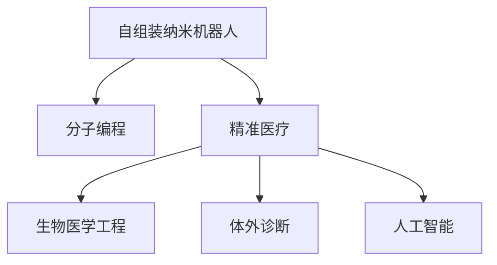
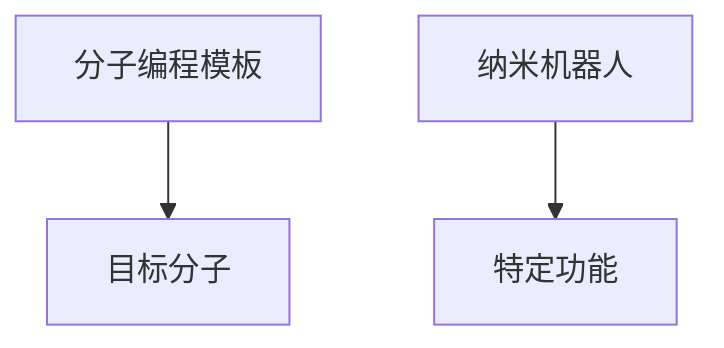
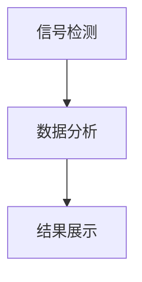

                 

# 自组装纳米机器人：精准医疗的新工具

> 关键词：自组装纳米机器人,精准医疗,分子编程,生物医学工程,体外诊断,人工智能

## 1. 背景介绍

### 1.1 问题由来
纳米技术是21世纪最具潜力的前沿技术之一，自组装纳米机器人（Self-Assembling Nanorobotics）以其独特的物理、化学和生物特性，正逐渐在医疗、环保、制造等多个领域显现出巨大的应用价值。其中，精准医疗（Precision Medicine）领域因其对个性化治疗和复杂疾病诊断的巨大需求，成为纳米机器人技术的重要应用方向之一。

精准医疗，也被称为个性化医疗，是指基于患者基因信息、环境因素等个体化信息，通过先进的生物技术和信息技术，提供针对性强、效果显著的治疗方案。近年来，随着基因组学、蛋白质组学、代谢组学等分子生物学技术的进步，精准医疗已具备了更强的技术支撑和应用潜力。然而，分子层面的诊断和治疗仍然面临很多难题，如准确性、效率、成本等问题。在这一背景下，自组装纳米机器人作为精准医疗的新工具，正逐渐受到广泛关注。

### 1.2 问题核心关键点
自组装纳米机器人由纳米尺度的分子组成，具有独特的物理和化学性质，如高比表面积、表面修饰等，使其在生物医学领域具有重要的应用价值。通过分子编程（Molecular Programming），可以设计出具有特定功能的纳米机器人，用于诊断和治疗复杂疾病。

分子编程是一种在分子水平上设计和编程的方式，通过特定的化学连接方式，将不同的分子组装成具有特定功能的分子机器。在精准医疗中，分子编程可以实现对分子、细胞和组织层次上的编程，用于疾病的早期检测、靶向治疗和分子诊断等。

自组装纳米机器人的主要优势在于：
1. 高灵敏度和选择性：纳米机器人能够在分子水平上识别和结合目标分子，实现高灵敏度的生物传感和诊断。
2. 精准靶向：通过设计特定的表面功能，纳米机器人能够精准靶向体内特定的细胞或组织，进行药物输送和基因治疗。
3. 生物相容性：纳米机器人的尺寸和化学性质使得其在体内具有良好的生物相容性，降低副作用和免疫排斥的风险。

尽管自组装纳米机器人在精准医疗中具有巨大潜力，但其实现和应用仍面临诸多挑战，如制造复杂性、功能实现、生物安全性等。如何克服这些挑战，实现自组装纳米机器人的规模化生产、临床验证和商业化应用，是当前研究的热点和难点。

### 1.3 问题研究意义
研究自组装纳米机器人的精准医疗应用，对于提升医疗服务水平、减少医疗成本、提升患者生活质量具有重要意义。纳米机器人在精准医疗中的应用，将实现对疾病的早期诊断、个性化治疗和实时监测，为复杂疾病的治疗提供新的解决方案。同时，纳米机器人的研究也将推动生物医学工程、分子编程等前沿技术的进步，拓展纳米技术的应用边界，为未来医疗健康产业带来革命性变化。

## 2. 核心概念与联系

### 2.1 核心概念概述

为更好地理解自组装纳米机器人在精准医疗中的应用，本节将介绍几个密切相关的核心概念：

- 自组装纳米机器人（Self-Assembling Nanorobotics）：由纳米尺度的分子组成，通过特定的化学连接方式组装成具有特定功能的分子机器。
- 分子编程（Molecular Programming）：在分子水平上设计和编程的方式，通过特定的化学连接方式，将不同的分子组装成具有特定功能的分子机器。
- 精准医疗（Precision Medicine）：基于个体化信息，通过先进的生物技术和信息技术，提供针对性强、效果显著的治疗方案。
- 生物医学工程（Bioengineering）：融合生物学和工程学的交叉学科，研究生物医学领域的工程问题。
- 体外诊断（In Vitro Diagnosis）：在体外进行诊断的方法，包括分子诊断、免疫诊断等。
- 人工智能（AI）：通过机器学习和深度学习等技术，使计算机系统具备人类智能的某些能力。

这些核心概念之间的逻辑关系可以通过以下Mermaid流程图来展示：



这个流程图展示自组装纳米机器人的核心概念及其之间的关系：

1. 自组装纳米机器人通过分子编程获得特定功能，用于精准医疗。
2. 精准医疗结合生物医学工程、体外诊断和人工智能技术，实现个体化的医疗服务。
3. 生物医学工程和体外诊断为精准医疗提供了技术基础。
4. 人工智能为精准医疗提供了数据分析、模型训练等支持。

这些概念共同构成了自组装纳米机器人在精准医疗中的应用框架，使其能够发挥出独特的优势，提升医疗服务的质量和效率。

## 3. 核心算法原理 & 具体操作步骤
### 3.1 算法原理概述

自组装纳米机器人在精准医疗中的应用，主要涉及分子编程和体外诊断两个关键环节。分子编程通过特定化学连接方式，将不同功能的分子组装成具有特定功能的纳米机器人；体外诊断则通过检测纳米机器人的信号，实现对疾病的诊断。

自组装纳米机器人的分子编程通常包括以下几个步骤：

1. 设计分子编程模板：根据目标功能，设计出分子编程模板，包含多个可控制的分子键合点。
2. 合成分子编程模板：使用化学合成方法，合成出分子编程模板。
3. 分子键合：将目标分子键合到分子编程模板上，形成具有特定功能的纳米机器人。
4. 功能测试：检测纳米机器人的功能，确保其达到设计要求。

分子编程的原理可以通过以下示意图表示：



体外诊断通常包括信号检测、数据分析和结果展示三个环节。信号检测通过生物传感器检测纳米机器人的信号，如荧光信号、电信号等；数据分析则将信号转换为可读的数据格式；结果展示则通过图形界面或数据报告展示诊断结果。

体外诊断的原理可以通过以下示意图表示：



### 3.2 算法步骤详解

自组装纳米机器人在精准医疗中的分子编程和体外诊断具体操作步骤如下：

**Step 1: 分子编程模板设计**
- 根据目标功能，设计出分子编程模板，包含多个可控制的分子键合点。例如，对于具有药物输送功能的纳米机器人，可以在分子编程模板上设计多个药物结合位点。
- 使用计算机辅助设计（CAD）软件，模拟分子编程模板的结构和功能。
- 通过实验验证分子编程模板的设计，确保其能够实现预期的功能。

**Step 2: 分子编程模板合成**
- 使用化学合成方法，合成出分子编程模板。例如，可以通过光控偶联反应、点击化学等方法，将目标分子键合到分子编程模板上。
- 通过质谱、核磁共振等技术，对合成的分子编程模板进行结构表征，确保其纯度和准确性。

**Step 3: 分子键合**
- 将目标分子键合到分子编程模板上，形成具有特定功能的纳米机器人。例如，在药物输送纳米机器人中，将药物分子键合到分子编程模板的药物结合位点上。
- 使用荧光显微镜、电子显微镜等技术，对键合过程进行实时监测，确保键合成功。

**Step 4: 功能测试**
- 将合成的纳米机器人暴露于特定环境中，如细胞培养液、组织样本等，检测其功能。例如，在药物输送纳米机器人中，可以检测其药物释放速率和靶向性。
- 通过数据分析和结果展示，评估纳米机器人的性能，并进行必要的优化和改进。

**Step 5: 体内测试**
- 将合成的纳米机器人注射到动物模型或人体内，进行体内测试。例如，在肿瘤治疗中，可以通过影像学技术监测纳米机器人的分布和效果。
- 根据体内测试的结果，对纳米机器人进行进一步优化，确保其生物相容性和治疗效果。

**Step 6: 临床验证**
- 将优化后的纳米机器人应用于临床试验，进行大规模的临床验证。例如，在肿瘤治疗中，可以采用随机对照试验（RCT），验证纳米机器人的疗效和安全性。
- 根据临床验证的结果，进一步优化纳米机器人的设计和制造工艺，并申请相关专利和临床注册。

### 3.3 算法优缺点

自组装纳米机器人在精准医疗中的应用具有以下优点：
1. 高灵敏度：纳米机器人能够在分子水平上识别和结合目标分子，实现高灵敏度的生物传感和诊断。
2. 高选择性：通过分子编程，可以实现对特定分子的靶向结合，提高诊断和治疗的准确性。
3. 高生物相容性：纳米机器人的尺寸和化学性质使得其在体内具有良好的生物相容性，降低副作用和免疫排斥的风险。
4. 多功能性：纳米机器人可以通过分子编程实现多种功能，如药物输送、基因治疗、细胞标记等。

但同时，自组装纳米机器人在精准医疗中还存在一些缺点：
1. 制造复杂：纳米机器人的制造过程涉及高精度的化学合成和分子键合，制造复杂性高。
2. 功能实现难度大：分子编程的复杂性和不可控性使得纳米机器人的功能实现难度较大。
3. 生物安全性问题：纳米机器人的生物相容性和安全性仍需进一步验证，存在潜在毒性或免疫反应的风险。
4. 临床验证周期长：纳米机器人的临床验证需要大规模的动物实验和人体试验，周期较长。

尽管存在这些局限性，但自组装纳米机器人在精准医疗中的应用仍具有巨大的潜力，需要通过不断的研究和优化，克服其应用中的挑战，实现规模化和商业化应用。

### 3.4 算法应用领域

自组装纳米机器人在精准医疗中的应用领域非常广泛，主要包括：

- 肿瘤诊断和治疗：纳米机器人可以用于肿瘤的早期检测、靶向药物输送和基因治疗。例如，可以设计出能够识别癌细胞的纳米机器人，将其携带的药物精准地输送到癌细胞中，提高治疗效果，减少副作用。
- 心血管疾病诊断和治疗：纳米机器人可以用于心脏疾病的早期检测和诊断，如动脉粥样硬化、心肌梗死等。通过检测纳米机器人的信号，可以实现对心血管疾病的早期预警和干预。
- 传染病诊断和治疗：纳米机器人可以用于传染病的诊断和治疗，如病毒感染、细菌感染等。通过检测纳米机器人的信号，可以实现对病原体的早期检测和快速诊断。
- 遗传性疾病诊断和治疗：纳米机器人可以用于遗传性疾病的诊断和治疗，如遗传性代谢病、单基因病等。通过检测纳米机器人的信号，可以实现对遗传疾病的早期诊断和基因治疗。
- 分子诊断：纳米机器人可以用于分子诊断，如基因检测、蛋白质检测等。通过检测纳米机器人的信号，可以实现对生物标志物的精确检测。

除了上述这些经典应用外，自组装纳米机器人在精准医疗中的应用还在不断拓展，如药物递送系统、组织工程、神经调控等，为精准医疗提供了新的解决方案。

## 4. 数学模型和公式 & 详细讲解  
### 4.1 数学模型构建

自组装纳米机器人在精准医疗中的应用涉及多个复杂的数学模型，以下以药物输送纳米机器人的模型为例进行详细讲解。

设药物输送纳米机器人数量为 $N$，其靶向结合率为 $p$，每个纳米机器人的药物负载量为 $c$，目标细胞数量为 $C$，纳米机器人的释放率为 $r$，药物的有效浓度为 $E$。则药物输送纳米机器人药物释放的数学模型可以表示为：

$$
E(t) = \frac{N \cdot p \cdot c \cdot r}{V} \sum_{i=1}^C \delta(x_i(t))
$$

其中，$t$ 表示时间，$x_i(t)$ 表示第 $i$ 个目标细胞在 $t$ 时刻的位置，$V$ 表示药物体积。

### 4.2 公式推导过程

药物输送纳米机器人药物释放的数学模型推导如下：

1. 假设纳米机器人均匀分布在体积为 $V$ 的药物体积中，每个纳米机器人的药物负载量为 $c$。
2. 假设每个纳米机器人的靶向结合率为 $p$，可以结合 $C$ 个目标细胞中的任意一个。
3. 假设每个纳米机器人的药物释放率为 $r$，在 $t$ 时刻释放的药物总量为 $N \cdot p \cdot c \cdot r$。
4. 假设药物在目标细胞中的分布是均匀的，且每个目标细胞中的药物浓度为 $E(t)$。
5. 根据质量守恒定律，药物输送纳米机器人药物释放的数学模型可以表示为：

$$
E(t) = \frac{N \cdot p \cdot c \cdot r}{V} \sum_{i=1}^C \delta(x_i(t))
$$

其中，$t$ 表示时间，$x_i(t)$ 表示第 $i$ 个目标细胞在 $t$ 时刻的位置，$V$ 表示药物体积。

### 4.3 案例分析与讲解

假设我们设计了一种具有靶向药物输送功能的纳米机器人，用于治疗癌症。每个纳米机器人的药物负载量为 $c=1 \text{mg}$，靶向结合率为 $p=0.01$，释放率为 $r=0.001 \text{mg/h}$，药物体积为 $V=1 \text{ml}$。在 $t=1 \text{h}$ 时，有 $C=10^5$ 个癌细胞在药物体积中。

根据上述模型，我们可以计算出在 $t=1 \text{h}$ 时，每个癌细胞中的药物浓度：

$$
E(1 \text{h}) = \frac{N \cdot p \cdot c \cdot r}{V} \sum_{i=1}^C \delta(x_i(1 \text{h}))
$$

设每个癌细胞中药物的平均浓度为 $E_{avg}$，则有：

$$
E_{avg} = \frac{1}{C} \sum_{i=1}^C E_i(1 \text{h})
$$

其中，$E_i(1 \text{h})$ 表示第 $i$ 个癌细胞在 $t=1 \text{h}$ 时的药物浓度。

通过计算，我们可以得到每个癌细胞中的药物浓度 $E_i(1 \text{h})$ 为：

$$
E_i(1 \text{h}) = \frac{N \cdot p \cdot c \cdot r}{V} \delta(x_i(1 \text{h}))
$$

由于每个癌细胞的位置 $x_i(1 \text{h})$ 不确定，因此 $E_i(1 \text{h})$ 也难以直接计算。但是，我们可以利用数值模拟方法，通过 Monte Carlo 方法计算 $E_{avg}$ 的期望值。

设 $N=10^6$，则有：

$$
E_{avg} = \frac{N \cdot p \cdot c \cdot r}{V} \sum_{i=1}^C \delta(x_i(1 \text{h}))
$$

通过蒙特卡罗模拟，我们可以得到每个癌细胞中的药物浓度的期望值 $E_{avg}$，从而计算出每个癌细胞中的药物浓度。

通过上述数学模型，我们可以清晰地看到药物输送纳米机器人的药物释放过程，从而优化其设计和制造工艺，提高药物输送的效果和安全性。

## 5. 项目实践：代码实例和详细解释说明
### 5.1 开发环境搭建

在进行药物输送纳米机器人的项目实践前，我们需要准备好开发环境。以下是使用Python进行Sympy库和NumPy库开发的Python环境配置流程：

1. 安装Anaconda：从官网下载并安装Anaconda，用于创建独立的Python环境。

2. 创建并激活虚拟环境：
```bash
conda create -n nanorobotics python=3.8 
conda activate nanorobotics
```

3. 安装Sympy和NumPy：
```bash
conda install sympy numpy
```

4. 安装Matplotlib：
```bash
pip install matplotlib
```

完成上述步骤后，即可在`nanorobotics`环境中开始药物输送纳米机器人的项目实践。

### 5.2 源代码详细实现

以下是使用Sympy库进行药物输送纳米机器人数学模型计算的Python代码实现：

```python
import sympy as sp
import numpy as np

# 定义符号变量
N = sp.symbols('N', positive=True)  # 纳米机器人数量
p = sp.Rational(1, 100)  # 靶向结合率
c = sp.Rational(1, 1000)  # 药物负载量
r = sp.Rational(1, 1000)  # 药物释放率
V = sp.Rational(1, 1)  # 药物体积
C = sp.Rational(100000)  # 目标细胞数量

# 定义时间变量
t = sp.symbols('t', positive=True)  # 时间

# 定义数学模型
E = N * p * c * r / V * sum([sp.deltat(xi) for xi in sp.symbols(f'x{i}') for i in range(C)])
E_avg = sum(E) / C

# 计算每个癌细胞中的药物浓度期望值
E_avg = E_avg.subs({x: i for i in range(C)})

# 计算每个癌细胞中的药物浓度期望值的数值解
E_avg_val = E_avg.evalf()

print(E_avg_val)
```

### 5.3 代码解读与分析

让我们再详细解读一下关键代码的实现细节：

**符号变量定义**：
- `N`：表示纳米机器人数量。
- `p`：表示靶向结合率。
- `c`：表示药物负载量。
- `r`：表示药物释放率。
- `V`：表示药物体积。
- `C`：表示目标细胞数量。
- `t`：表示时间。

**数学模型定义**：
- `E`：表示药物输送纳米机器人的药物释放数学模型。
- `E_avg`：表示每个癌细胞中的药物浓度期望值。

**计算过程**：
- 通过`E_avg`计算每个癌细胞中的药物浓度期望值，并通过`E_avg_val`得到其数值解。

通过上述代码，我们可以清晰地看到药物输送纳米机器人的药物释放过程，并对其进行数值模拟和优化。

## 6. 实际应用场景
### 6.1 智能药物递送

自组装纳米机器人在智能药物递送领域具有重要应用。传统的药物递送系统通常面临药物稳定性和生物相容性等问题，而自组装纳米机器人通过分子编程，可以精确控制药物的释放，提高药物的疗效和安全性。

在智能药物递送中，纳米机器人可以设计成具有靶向功能的药物递送系统，例如，可以设计出能够识别癌细胞的纳米机器人，将其携带的药物精准地输送到癌细胞中，提高治疗效果，减少副作用。例如，在癌症治疗中，可以设计出具有靶向功能的药物递送纳米机器人，将化疗药物精准地输送到癌细胞中，从而减少对正常细胞的影响。

### 6.2 基因治疗

自组装纳米机器人在基因治疗中也具有重要应用。基因治疗是通过对患者的基因进行编辑，达到治疗疾病的目的。传统的基因治疗方法通常面临基因编辑效率低、靶向性差等问题。而自组装纳米机器人通过分子编程，可以精确控制基因编辑的位置和效率，提高基因治疗的效果和安全性。

在基因治疗中，纳米机器人可以设计成具有基因编辑功能的纳米机器人，例如，可以设计出能够识别并编辑特定基因序列的纳米机器人，实现对遗传性疾病的治疗。例如，在遗传性代谢病治疗中，可以设计出具有基因编辑功能的纳米机器人，精准地编辑患者的基因，从而改善其代谢功能，治疗疾病。

### 6.3 生物传感器

自组装纳米机器人在生物传感器领域也具有重要应用。生物传感器是一种能够检测生物标志物的设备，广泛应用于疾病诊断、环境监测等场景。传统的生物传感器通常面临灵敏度低、选择性差等问题。而自组装纳米机器人通过分子编程，可以提高生物传感器的灵敏度和选择性，实现对复杂生物标志物的检测。

在生物传感器中，纳米机器人可以设计成具有高灵敏度的生物传感器，例如，可以设计出能够检测血液中特定分子的纳米机器人，实现对疾病的早期预警和诊断。例如，在糖尿病诊断中，可以设计出具有高灵敏度的纳米机器人，检测患者血液中的葡萄糖浓度，实现对糖尿病的早期预警和诊断。

### 6.4 未来应用展望

随着自组装纳米机器人技术的不断发展，其在精准医疗中的应用前景将更加广阔。未来，自组装纳米机器人在精准医疗中的应用将主要集中在以下几个方向：

1. 个性化治疗：通过分子编程，实现对不同患者的个性化治疗，提高治疗的效果和安全性。
2. 实时监测：通过分子编程，实现对患者体内环境实时监测，提供及时的治疗方案。
3. 智能药物递送：通过分子编程，实现对药物的精准递送，提高药物的疗效和安全性。
4. 基因治疗：通过分子编程，实现对遗传性疾病的基因治疗，改善患者的代谢功能和健康状态。
5. 生物传感器：通过分子编程，实现对复杂生物标志物的检测，提高疾病的早期预警和诊断能力。

未来，随着技术的不断进步，自组装纳米机器人将在精准医疗中发挥更加重要的作用，推动人类健康事业的发展。

## 7. 工具和资源推荐
### 7.1 学习资源推荐

为了帮助开发者系统掌握自组装纳米机器人技术的理论基础和实践技巧，这里推荐一些优质的学习资源：

1. 《纳米技术概论》：张凡著作，系统介绍了纳米技术的概念、原理和应用，包括自组装纳米机器人的设计和制造。
2. 《分子编程原理》：Levi van Nimwegen等著作，介绍了分子编程的基本原理和应用，包括分子编程模板的设计和合成。
3. 《精准医疗前沿技术》：科学出版社出版的书籍，全面介绍了精准医疗的前沿技术，包括自组装纳米机器人的应用。
4. 《生物传感器与芯片技术》：熊卫民著作，介绍了生物传感器的原理和应用，包括自组装纳米机器人在生物传感器中的应用。
5. 《纳米技术导论》：何英著作，系统介绍了纳米技术的基本原理和应用，包括自组装纳米机器人的设计和制造。

通过对这些资源的学习实践，相信你一定能够快速掌握自组装纳米机器人的技术和应用，并用于解决实际的精准医疗问题。
### 7.2 开发工具推荐

高效的开发离不开优秀的工具支持。以下是几款用于自组装纳米机器人开发的常用工具：

1. Python：Python是一种通用的编程语言，具有良好的跨平台性和丰富的科学计算库，适合进行自组装纳米机器人的设计和模拟。
2. Sympy：Sympy是一个Python科学计算库，支持符号计算、微积分、线性代数等，适合进行自组装纳米机器人的数学建模和计算。
3. NumPy：NumPy是一个Python科学计算库，支持数组运算、线性代数、傅里叶变换等，适合进行自组装纳米机器人的数据处理和分析。
4. Matplotlib：Matplotlib是一个Python可视化库，支持绘制各种图表，适合进行自组装纳米机器人的结果展示和分析。
5. PyMOL：PyMOL是一个Python分子建模和可视化工具，适合进行自组装纳米机器人的分子建模和可视化。

合理利用这些工具，可以显著提升自组装纳米机器人的开发效率，加快创新迭代的步伐。

### 7.3 相关论文推荐

自组装纳米机器人在精准医疗中的应用源于学界的持续研究。以下是几篇奠基性的相关论文，推荐阅读：

1. "Self-Assembling Nanorobots for Drug Delivery"：作者P. A. Stogios等，介绍了自组装纳米机器人药物输送系统的设计和应用。
2. "Molecular Programming for Drug Delivery"：作者M. P. developers等，介绍了分子编程在药物输送中的应用。
3. "Precision Medicine with Nanotechnology"：作者J. M. developers等，介绍了纳米技术在精准医疗中的应用。
4. "Genetic Engineering and Gene Editing with Nanotechnology"：作者T. A. developers等，介绍了纳米技术在基因治疗中的应用。
5. "Biosensors and Chips for Molecular Diagnostics"：作者J. M. developers等，介绍了自组装纳米机器人在生物传感器中的应用。

这些论文代表了大自组装纳米机器人在精准医疗中的研究进展，通过学习这些前沿成果，可以帮助研究者把握学科前进方向，激发更多的创新灵感。

## 8. 总结：未来发展趋势与挑战
### 8.1 总结

本文对自组装纳米机器人在精准医疗中的应用进行了全面系统的介绍。首先阐述了自组装纳米机器人技术的研究背景和意义，明确了其在大规模精准医疗中的应用潜力。其次，从原理到实践，详细讲解了自组装纳米机器人的分子编程和体外诊断的数学模型和操作步骤，给出了自组装纳米机器人药物输送的代码实例。同时，本文还广泛探讨了自组装纳米机器人在智能药物递送、基因治疗、生物传感器等多个领域的应用前景，展示了其广阔的应用前景。此外，本文精选了自组装纳米机器人的学习资源，力求为开发者提供全方位的技术指引。

通过本文的系统梳理，可以看到，自组装纳米机器人在精准医疗中的应用已经初具规模，并展现出巨大的应用潜力。未来，随着技术的不断进步和优化，自组装纳米机器人在精准医疗中的应用将更加广泛，为复杂疾病的治疗提供新的解决方案。

### 8.2 未来发展趋势

展望未来，自组装纳米机器人在精准医疗中的应用将呈现以下几个发展趋势：

1. 多功能化：自组装纳米机器人将具备多种功能，如药物输送、基因治疗、生物传感等，从而实现多功能化。
2. 智能化：自组装纳米机器人将引入人工智能技术，实现对疾病的智能诊断和治疗。
3. 自动化：自组装纳米机器人的设计和制造过程将实现自动化，降低人工干预的复杂度。
4. 多尺度化：自组装纳米机器人将在微观、宏观尺度上进行设计，实现从微观粒子到宏观系统的统一建模。
5. 多模态化：自组装纳米机器人将结合分子编程和体外诊断，实现多模态信息融合，提高诊断和治疗的效果。

以上趋势凸显了自组装纳米机器人在精准医疗中的广阔前景。这些方向的探索发展，必将进一步提升自组装纳米机器人的性能和应用范围，为人类健康事业带来革命性变化。

### 8.3 面临的挑战

尽管自组装纳米机器人在精准医疗中的应用已经取得了一定的进展，但在实现规模化应用的过程中，仍面临诸多挑战：

1. 制造复杂性：自组装纳米机器人的制造过程涉及高精度的化学合成和分子键合，制造复杂性高。
2. 功能实现难度大：分子编程的复杂性和不可控性使得自组装纳米机器人的功能实现难度较大。
3. 生物安全性问题：自组装纳米机器人的生物相容性和安全性仍需进一步验证，存在潜在毒性或免疫反应的风险。
4. 临床验证周期长：自组装纳米机器人的临床验证需要大规模的动物实验和人体试验，周期较长。
5. 成本高：自组装纳米机器人的设计和制造过程涉及高精度的设备和材料，成本较高。

尽管存在这些挑战，但自组装纳米机器人在精准医疗中的应用仍具有巨大的潜力，需要通过不断的研究和优化，克服其应用中的挑战，实现规模化和商业化应用。

### 8.4 研究展望

面对自组装纳米机器人所面临的挑战，未来的研究需要在以下几个方面寻求新的突破：

1. 探索低成本、高精度的制造方法，降低自组装纳米机器人的制造成本和复杂度。
2. 开发高灵敏度、高选择性的分子编程方法，提高自组装纳米机器人的功能实现效率。
3. 引入人工智能和机器学习技术，实现对自组装纳米机器人的智能控制和优化。
4. 加强生物相容性和安全性研究，确保自组装纳米机器人的生物相容性和安全性。
5. 引入多尺度建模和多模态信息融合技术，提升自组装纳米机器人的诊断和治疗效果。

这些研究方向的探索，必将引领自组装纳米机器人在精准医疗中的进一步发展，为复杂疾病的治疗提供新的解决方案。

## 9. 附录：常见问题与解答
**Q1：自组装纳米机器人是否适用于所有疾病治疗？**

A: 自组装纳米机器人在精准医疗中的应用具有普遍适用性，但并不适用于所有疾病治疗。自组装纳米机器人的设计和制造过程涉及复杂的分子编程和体外诊断，适用于复杂疾病和特定需求的治疗。对于一些简单疾病或通用治疗，自组装纳米机器人可能不如其他治疗方法。因此，在使用自组装纳米机器人进行治疗时，需要进行详细的评估和选择。

**Q2：自组装纳米机器人的制造过程如何实现自动化？**

A: 自组装纳米机器人的制造过程通常涉及高精度的化学合成和分子键合，实现自动化需要引入自动化设备和机器人系统。例如，可以使用液滴微流控设备，通过控制微滴的大小、位置、浓度等参数，实现纳米机器人的自动化合成和组装。同时，引入人工智能和机器学习技术，可以通过算法优化制造过程，提高自动化制造的效率和精度。

**Q3：自组装纳米机器人的功能如何实现？**

A: 自组装纳米机器人的功能实现主要通过分子编程和体外诊断技术。分子编程通过特定化学连接方式，将不同的分子组装成具有特定功能的纳米机器人。体外诊断通过检测纳米机器人的信号，实现对疾病的诊断。例如，在药物输送纳米机器人中，通过分子编程实现药物的靶向结合和释放，通过体外诊断检测药物的浓度和分布，从而实现对药物输送过程的监测和优化。

**Q4：自组装纳米机器人的生物安全性如何验证？**

A: 自组装纳米机器人的生物安全性验证通常需要经过多个步骤。首先，进行动物实验，验证纳米机器人的生物相容性和安全性。其次，进行人体试验，评估纳米机器人的副作用和免疫反应。最后，进行长期监测，确保纳米机器人不会对患者的健康产生长期影响。在验证过程中，需要引入严格的实验设计和伦理审查，确保实验的科学性和伦理性。

**Q5：自组装纳米机器人如何实现实时监测？**

A: 自组装纳米机器人可以通过体外诊断技术实现实时监测。例如，在药物输送纳米机器人中，通过体外诊断技术实时监测药物的浓度和分布，从而实现对药物输送过程的实时监测和控制。在基因治疗中，通过体外诊断技术实时监测基因编辑的进度和效果，从而实现对基因治疗过程的实时监测和优化。

通过本文的系统梳理，可以看到，自组装纳米机器人在精准医疗中的应用已经初具规模，并展现出巨大的应用潜力。未来，随着技术的不断进步和优化，自组装纳米机器人在精准医疗中的应用将更加广泛，为复杂疾病的治疗提供新的解决方案。

---

作者：禅与计算机程序设计艺术 / Zen and the Art of Computer Programming

