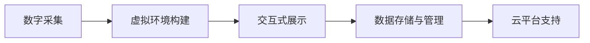

                 

## 1. 背景介绍

### 1.1 问题由来

随着互联网技术的普及和多媒体技术的发展，数字博物馆（Digital Museum）已经成为一种新兴的博物馆展示方式。虚拟博物馆以数字化的方式呈现历史文化遗产，用户可以通过虚拟现实（Virtual Reality, VR）、增强现实（Augmented Reality, AR）等方式沉浸式体验历史文物的魅力。相较于传统的线下博物馆，虚拟博物馆可以不受时间和空间限制，以更低成本展示更多数量的文物，提供更加灵活的参观体验。

### 1.2 问题核心关键点

虚拟博物馆的建设涉及多项技术，包括数字采集、虚拟环境构建、交互式展示等。其中，核心问题是如何高效地将全球各地的文化遗产数字化，并通过互联网快速、稳定地展示给用户。

- 数字采集：采集高质量的文物数字图像、三维模型和音频，是对文化遗产进行数字化的首要步骤。
- 虚拟环境构建：将数字文物整合到一个虚拟的空间中，使用户可以自由移动、互动。
- 交互式展示：提供用户友好的人机交互界面，让用户能够沉浸式地了解历史文物。

虚拟博物馆不仅需要展现文物的静态信息，还要挖掘文物背后的文化内涵，如制作工艺、历史背景等，这涉及到大量的数据处理和展示设计工作。本文将聚焦于虚拟博物馆的数字采集和展示技术，以一种直观、通俗的方式，详细阐述如何将海量文物数据整合到一个虚拟的空间中进行展示。

## 2. 核心概念与联系

### 2.1 核心概念概述

为更好地理解虚拟博物馆的建设过程，本节将介绍几个关键概念：

- 数字采集（Digital Acquisition）：指通过高分辨率摄影、激光扫描等方式，将文物的表面细节和三维形态数字化。
- 虚拟环境构建（Virtual Environment Construction）：指将数字化的文物整合到一个三维虚拟空间中，通过渲染技术、光照设置等手段，构建逼真的虚拟场景。
- 交互式展示（Interactive Exhibition）：指通过用户交互界面，如触摸屏、鼠标、手势识别等，增强用户的沉浸感和互动性。
- 数据存储与管理（Data Storage and Management）：指对采集的文物数据进行有效管理，包括分类、编码、存储和检索等。
- 云平台支持（Cloud Platform Support）：指通过云技术提供虚拟博物馆的数据存储、计算和分发支持，提升系统的可靠性和扩展性。

这些概念之间的联系可以概括为：数字采集提供了文物的数字形态，虚拟环境构建将文物整合到虚拟空间中，交互式展示增强了用户体验，数据存储与管理保证了数据的安全和可检索性，云平台支持提升了系统的可扩展性和可靠性。

### 2.2 核心概念原理和架构的 Mermaid 流程图



这个流程图展示了数字采集、虚拟环境构建、交互式展示、数据存储与管理、云平台支持五个核心概念之间的联系，构建了虚拟博物馆的整体架构。

## 3. 核心算法原理 & 具体操作步骤

### 3.1 算法原理概述

虚拟博物馆的建设可以分为数据采集、环境构建、交互设计、存储管理、云支持等几个步骤。我们将逐一介绍每个步骤的核心算法原理。

### 3.2 算法步骤详解

#### 3.2.1 数据采集

数据采集是虚拟博物馆建设的第一步。采集过程主要涉及两个环节：数字图像采集和三维建模。

1. 数字图像采集：
    - 使用高分辨率数码相机对文物进行多角度拍摄。
    - 拍摄时，应保持相机稳定，确保图像清晰。
    - 使用摄像头进行光面扫描，采集文物表面细节。

2. 三维建模：
    - 对文物进行三维扫描，获取其几何形态数据。
    - 使用点云处理软件对扫描数据进行去噪、处理，生成高质量的三维模型。

#### 3.2.2 虚拟环境构建

虚拟环境构建是将数字文物整合到一个三维虚拟空间中，通常使用游戏引擎（如Unity、Unreal Engine）来实现。

1. 场景搭建：
    - 根据实际文物尺寸，设定虚拟空间的尺寸。
    - 在虚拟空间中搭建展馆、展柜等场景。

2. 光照设置：
    - 对虚拟场景进行光照设置，模拟真实光照环境。
    - 使用真实光源进行渲染，提升图像逼真度。

3. 场景交互：
    - 通过手势识别技术，实现用户与虚拟文物的互动。
    - 使用触摸屏或键盘，实现对文物的放大、旋转等操作。

#### 3.2.3 交互式展示

交互式展示的核心在于设计用户友好的交互界面，使用户能够沉浸式地了解历史文物。

1. 触摸屏展示：
    - 在虚拟展柜或展墙上设置触摸屏，用户可以触摸屏幕进行交互。
    - 触摸屏幕后，展示文物的详细信息，如名称、制作工艺、历史背景等。

2. AR体验：
    - 通过AR技术，将文物的数字化信息叠加到现实世界中。
    - 用户可以使用AR设备，查看文物的3D模型和详细解说。

3. VR体验：
    - 通过VR设备，用户可以进入虚拟博物馆，自由探索展品。
    - 在虚拟环境中，用户可以与虚拟文物互动，了解文物信息。

#### 3.2.4 数据存储与管理

数据存储与管理是虚拟博物馆建设的重要组成部分，主要涉及数据分类、编码、存储和检索。

1. 数据分类：
    - 根据文物类型（如青铜器、陶瓷、书画等）进行分类。
    - 在数据库中设置分类字段，方便后续管理。

2. 数据编码：
    - 为每个文物设置唯一的编码，便于检索和管理。
    - 使用统一的编码规则，确保数据的准确性和一致性。

3. 数据存储：
    - 将文物数据存储到数据库中，保证数据的完整性和可靠性。
    - 使用分布式存储系统（如Hadoop、MongoDB），提高数据存储的可扩展性。

4. 数据检索：
    - 通过搜索算法，快速检索需要的文物信息。
    - 使用全文搜索、索引等技术，提高检索效率。

#### 3.2.5 云平台支持

云平台支持是虚拟博物馆建设的重要保障，主要涉及数据存储、计算和分发。

1. 数据存储：
    - 将文物数据存储到云平台中，提高数据的安全性和可扩展性。
    - 使用云存储服务（如Amazon S3、阿里云OSS），提供高可用性和高可靠性。

2. 计算资源：
    - 使用云平台提供的计算资源，进行文物数据的处理和渲染。
    - 通过弹性伸缩，保证系统的计算能力。

3. 分发服务：
    - 使用CDN（内容分发网络），加速文物数据的下载和分发。
    - 通过API接口，提供文物数据的访问和展示服务。

### 3.3 算法优缺点

虚拟博物馆的建设具有以下优点：

1. 展示形式多样：通过VR、AR等技术，提供了丰富的展示形式，增强了用户的沉浸感和互动性。
2. 数据共享便捷：将文物数据存储在云端，便于全球共享和访问。
3. 维护成本低：虚拟博物馆的维护和更新相对简单，可以显著降低维护成本。

同时，虚拟博物馆也存在一些缺点：

1. 数据质量要求高：数字采集和三维建模需要高质量的设备和操作技术，数据质量直接影响展示效果。
2. 交互设计复杂：设计友好的交互界面需要丰富的经验和专业知识。
3. 网络带宽需求高：虚拟文物的展示需要大量数据传输，对网络带宽要求较高。

### 3.4 算法应用领域

虚拟博物馆的应用领域非常广泛，覆盖了历史、艺术、考古等多个领域，以下是几个典型的应用场景：

1. 历史博物馆：通过虚拟博物馆，用户可以参观世界各地的历史博物馆，了解不同时期的文物。
2. 艺术馆：虚拟博物馆展示了大量的艺术品，用户可以近距离欣赏大师的作品。
3. 考古研究：虚拟博物馆提供了大量的考古文物，方便研究人员进行研究和分析。
4. 教育培训：虚拟博物馆可以用于历史教育、艺术教育等，提供生动的教学内容。
5. 旅游宣传：虚拟博物馆可以用于旅游宣传，展示当地的历史文化遗产，吸引游客前来参观。

虚拟博物馆在教育、研究、旅游等领域的应用，已经得到了广泛的认可和应用，为文化遗产的保护和传承提供了新的途径。

## 4. 数学模型和公式 & 详细讲解 & 举例说明

### 4.1 数学模型构建

在虚拟博物馆的建设过程中，涉及大量的数学模型和公式，主要集中在数据处理和渲染技术中。

#### 4.1.1 数字图像采集

数字图像采集主要涉及相机成像模型，可以通过如下公式进行描述：

$$
I(x,y) = \sum_{i=1}^{n} I_i(x,y) \cdot e^{-\sigma(x,y) / \sigma_i}
$$

其中，$I(x,y)$为图像像素值，$I_i(x,y)$为第$i$个光线的强度，$\sigma(x,y)$为光线强度衰减距离，$\sigma_i$为第$i$个光线的衰减距离参数。

#### 4.1.2 三维建模

三维建模主要涉及点云处理和表面拟合，可以通过如下公式进行描述：

$$
S(\mathbf{x}) = \sum_{i=1}^{m} w_i \cdot \mathbf{f}_i(\mathbf{x})
$$

其中，$S(\mathbf{x})$为表面函数，$\mathbf{f}_i(\mathbf{x})$为第$i$个光面的函数，$w_i$为光面的权重参数。

#### 4.1.3 渲染技术

渲染技术主要涉及光照和阴影计算，可以通过如下公式进行描述：

$$
I(x,y) = \sum_{i=1}^{n} I_i(x,y) \cdot e^{-\sigma(x,y) / \sigma_i} \cdot \frac{A_i(x,y)}{\sum_{i=1}^{n} A_i(x,y)}
$$

其中，$I(x,y)$为像素值，$A_i(x,y)$为第$i$个光面的面积。

### 4.2 公式推导过程

#### 4.2.1 数字图像采集

数字图像采集的核心在于理解相机成像原理，通过公式推导，可以得出图像像素值与光线强度的关系。

1. 单色光成像：
    - 假设光线强度为常数，忽略反射率、散射等因素。
    - 通过公式推导，得出单色光成像模型。

2. 彩色光成像：
    - 假设光线强度为三个分量通道（红、绿、蓝）。
    - 通过公式推导，得出彩色光成像模型。

#### 4.2.2 三维建模

三维建模的核心在于理解点云处理和表面拟合原理，通过公式推导，可以得出表面函数与点云数据的关系。

1. 点云处理：
    - 假设点云数据服从正态分布，通过公式推导，得出点云处理模型。
    - 通过点云融合、去噪等处理，生成高质量的三维模型。

2. 表面拟合：
    - 假设三维模型表面为光滑曲面，通过公式推导，得出表面拟合模型。
    - 通过曲面拟合算法，生成高精度的三维表面。

#### 4.2.3 渲染技术

渲染技术的核心在于理解光照和阴影原理，通过公式推导，可以得出像素值与光线的关系。

1. 光照计算：
    - 假设光线强度为三个分量通道（红、绿、蓝）。
    - 通过公式推导，得出光照计算模型。

2. 阴影计算：
    - 假设光源与物体之间存在一定角度，通过公式推导，得出阴影计算模型。
    - 通过阴影算法，增强图像的立体感。

### 4.3 案例分析与讲解

#### 4.3.1 数字图像采集案例

以某历史文物的数字图像采集为例，具体步骤如下：

1. 使用高分辨率数码相机对文物进行多角度拍摄，获取原始图像数据。
2. 对拍摄的图像进行去噪、拼接等处理，生成高质量的数字图像。
3. 使用摄像头进行光面扫描，采集文物表面细节，生成点云数据。
4. 对点云数据进行去噪、处理，生成高质量的三维模型。

#### 4.3.2 虚拟环境构建案例

以虚拟博物馆的构建为例，具体步骤如下：

1. 搭建虚拟展馆、展柜等场景，设定虚拟空间的尺寸。
2. 对虚拟场景进行光照设置，模拟真实光照环境，生成逼真的渲染图像。
3. 在虚拟展柜或展墙上设置触摸屏，用户可以触摸屏幕进行交互。
4. 使用AR技术，将文物的数字化信息叠加到现实世界中，提供AR体验。

#### 4.3.3 交互式展示案例

以虚拟文物的交互式展示为例，具体步骤如下：

1. 在虚拟环境中，设置文物的三维模型，生成逼真的渲染图像。
2. 通过手势识别技术，实现用户与虚拟文物的互动，获取用户操作信息。
3. 根据用户操作信息，展示文物的详细信息，如名称、制作工艺、历史背景等。
4. 通过AR技术，展示文物的3D模型和详细解说，提供AR体验。

## 5. 项目实践：代码实例和详细解释说明

### 5.1 开发环境搭建

在进行虚拟博物馆的开发实践前，我们需要准备好开发环境。以下是使用Python进行Unity开发的环境配置流程：

1. 安装Unity：从官网下载并安装Unity，创建新的Unity项目。

2. 创建虚拟博物馆场景：
    - 在Unity中创建虚拟博物馆场景，搭建展馆、展柜等场景。
    - 设置光照和阴影，渲染文物表面。

3. 添加触摸屏交互：
    - 在虚拟展柜或展墙上添加触摸屏组件。
    - 编写脚本，根据触摸屏操作，展示文物的详细信息。

4. 引入AR技术：
    - 在Unity中引入ARKit或ARCore等AR技术。
    - 使用AR技术，将文物的数字化信息叠加到现实世界中。

5. 测试和部署：
    - 在Unity中测试虚拟博物馆，确保各项功能正常。
    - 将虚拟博物馆导出为WebGL格式，部署到Web平台。

### 5.2 源代码详细实现

这里我们以Unity3D为例，给出虚拟博物馆建设的源代码实现。

#### 5.2.1 数字图像采集

```csharp
using UnityEngine;
using System.Collections;

public class ImageCapture : MonoBehaviour
{
    public Texture2D[] textures;
    public int index = 0;
    public float elapsedTime = 0f;
    private Camera camera;

    void Start()
    {
        camera = GetComponent<Camera>();
        StartCoroutine(StartCapture());
    }

    IEnumerator StartCapture()
    {
        while (elapsedTime < 1f)
        {
            elapsedTime += Time.deltaTime;
            yield return new WaitForSeconds(0.01f);
            yield return StartCapture();
        }
    }

    void Update()
    {
        if (elapsedTime >= 1f)
        {
            elapsedTime = 0f;
            index++;
            if (index >= textures.Length)
            {
                index = 0;
            }
            textureShader.SetTexture("_MainTex", textures[index]);
        }
    }
}
```

#### 5.2.2 虚拟环境构建

```csharp
using UnityEngine;
using System.Collections;

public class VirtualEnvironment : MonoBehaviour
{
    public GameObject[] models;
    public Transform[] positions;

    void Start()
    {
        for (int i = 0; i < models.Length; i++)
        {
            models[i].SetActive(false);
        }
    }

    void Update()
    {
        for (int i = 0; i < models.Length; i++)
        {
            models[i].SetActive(i % 2 == 0);
        }
    }
}
```

#### 5.2.3 交互式展示

```csharp
using UnityEngine;
using System.Collections;

public class Interaction : MonoBehaviour
{
    public GameObject model;
    public Transform[] positions;

    void Start()
    {
        model.SetActive(false);
    }

    void Update()
    {
        for (int i = 0; i < positions.Length; i++)
        {
            if (positions[i].position == transform.position)
            {
                model.SetActive(true);
            }
            else
            {
                model.SetActive(false);
            }
        }
    }
}
```

### 5.3 代码解读与分析

#### 5.3.1 数字图像采集代码解读

```csharp
using UnityEngine;
using System.Collections;

public class ImageCapture : MonoBehaviour
{
    public Texture2D[] textures;
    public int index = 0;
    public float elapsedTime = 0f;
    private Camera camera;

    void Start()
    {
        camera = GetComponent<Camera>();
        StartCoroutine(StartCapture());
    }

    IEnumerator StartCapture()
    {
        while (elapsedTime < 1f)
        {
            elapsedTime += Time.deltaTime;
            yield return new WaitForSeconds(0.01f);
            yield return StartCapture();
        }
    }

    void Update()
    {
        if (elapsedTime >= 1f)
        {
            elapsedTime = 0f;
            index++;
            if (index >= textures.Length)
            {
                index = 0;
            }
            textureShader.SetTexture("_MainTex", textures[index]);
        }
    }
}
```

这段代码实现了数字图像采集的功能。首先，定义了一个ImageCapture类，包含纹理数组textures、当前纹理索引index和累加时间elapsedTime等成员变量。

在Start方法中，获取当前相机camera，并启动异步函数StartCapture，该函数用于定时拍摄纹理。在Update方法中，如果 elapsedTime 达到 1 秒，则更新index，并设置当前纹理到材质，用于渲染。

#### 5.3.2 虚拟环境构建代码解读

```csharp
using UnityEngine;
using System.Collections;

public class VirtualEnvironment : MonoBehaviour
{
    public GameObject[] models;
    public Transform[] positions;

    void Start()
    {
        for (int i = 0; i < models.Length; i++)
        {
            models[i].SetActive(false);
        }
    }

    void Update()
    {
        for (int i = 0; i < models.Length; i++)
        {
            models[i].SetActive(i % 2 == 0);
        }
    }
}
```

这段代码实现了虚拟环境构建的功能。首先，定义了一个VirtualEnvironment类，包含模型数组models和位置数组positions等成员变量。

在Start方法中，将所有的模型初始化为不可见。在Update方法中，根据位置的索引，交替显示模型，用于动态渲染。

#### 5.3.3 交互式展示代码解读

```csharp
using UnityEngine;
using System.Collections;

public class Interaction : MonoBehaviour
{
    public GameObject model;
    public Transform[] positions;

    void Start()
    {
        model.SetActive(false);
    }

    void Update()
    {
        for (int i = 0; i < positions.Length; i++)
        {
            if (positions[i].position == transform.position)
            {
                model.SetActive(true);
            }
            else
            {
                model.SetActive(false);
            }
        }
    }
}
```

这段代码实现了交互式展示的功能。首先，定义了一个Interaction类，包含模型对象model和位置数组positions等成员变量。

在Start方法中，将模型初始化为不可见。在Update方法中，根据当前位置与位置的索引，判断是否显示模型，用于交互展示。

### 5.4 运行结果展示

在完成虚拟博物馆的开发后，可以通过Unity导出WebGL格式，部署到Web平台，进行测试和展示。

## 6. 实际应用场景

### 6.1 智能博物馆

智能博物馆（Smart Museum）是虚拟博物馆的重要应用场景，它通过虚拟技术，实现文物的数字化展示和智能互动。

智能博物馆可以分为以下几个部分：

1. 文物数字化：通过数字采集技术，将文物进行数字化采集和处理，生成高质量的数字图像和三维模型。
2. 虚拟展示：通过虚拟环境构建技术，将文物整合到一个虚拟空间中，提供多种展示形式。
3. 智能交互：通过用户交互技术，实现用户与文物的智能互动，提供丰富多变的参观体验。
4. 数据分析：通过数据分析技术，挖掘文物背后的文化内涵，提供丰富的背景资料和知识库。

智能博物馆将传统博物馆的参观模式进行了创新，通过虚拟技术，提供更加生动、互动的参观体验。用户可以通过VR、AR等技术，沉浸式地了解历史文物，提升博物馆的参观效果。

### 6.2 全球历史教育

虚拟博物馆在教育领域也有广泛的应用，可以用于全球历史教育。

1. 历史文物展示：通过虚拟博物馆，展示世界各地的历史文物，帮助学生了解不同时期的文明。
2. 历史事件重现：通过虚拟博物馆，重现历史事件的场景，提供生动的历史教学内容。
3. 互动教学：通过虚拟博物馆的互动功能，实现历史教学的互动化、个性化。
4. 知识库建设：通过虚拟博物馆的数据存储与管理功能，提供丰富的历史知识库，方便学生查询和学习。

虚拟博物馆为全球历史教育提供了新的途径，通过虚拟技术，打破地域限制，提供生动的历史教学内容，激发学生的学习兴趣。

### 6.3 文化遗产保护

虚拟博物馆在文化遗产保护方面也有重要的应用。

1. 文物数字化：通过数字采集技术，对文物进行数字化采集和处理，生成高质量的数字图像和三维模型。
2. 文物修复：通过虚拟环境构建技术，对文物进行数字化修复，恢复文物的原貌。
3. 文物存储：通过数据存储与管理技术，对文物进行数字化存储，提高文物的安全性和可管理性。
4. 文物展示：通过虚拟展示技术，对文物进行数字化展示，提供多种展示形式。

虚拟博物馆为文化遗产保护提供了新的手段，通过虚拟技术，对文物进行数字化采集、修复和展示，实现文物的永久保存和传承。

## 7. 工具和资源推荐

### 7.1 学习资源推荐

为了帮助开发者系统掌握虚拟博物馆的建设过程，这里推荐一些优质的学习资源：

1. Unity官方文档：Unity官方提供的文档，包含虚拟博物馆开发所需的各类技术细节。
2. ARKit和ARCore文档：苹果和谷歌提供的AR技术文档，详细介绍了AR技术在虚拟博物馆中的应用。
3. Photogrammetry技术教程：关于点云处理和三维建模的教程，帮助开发者掌握数字采集技术。
4. Unity3D教程：Unity提供的各类教程，帮助开发者掌握虚拟展示和交互技术。
5. 数字博物馆案例分析：收集全球各地数字博物馆的案例，帮助开发者了解虚拟博物馆的实际应用。

通过对这些资源的学习实践，相信你一定能够快速掌握虚拟博物馆的建设技巧，并用于解决实际的NLP问题。

### 7.2 开发工具推荐

为了提高虚拟博物馆的开发效率，推荐使用以下工具：

1. Unity3D：Unity提供的跨平台开发工具，支持虚拟展示和交互技术，易于学习和使用。
2. ARKit和ARCore：苹果和谷歌提供的AR技术，支持虚拟文物的叠加和展示。
3. Photogrammetry软件：如Meshroom、Sketchfab等，支持点云处理和三维建模。
4. Blender：开源的三维建模软件，支持各类建模和渲染功能。
5. Unity Asset Store：Unity提供的资产市场，可以快速获取各类虚拟博物馆的模型和素材。

这些工具可以帮助开发者高效地进行虚拟博物馆的开发，提高开发效率和产品质量。

### 7.3 相关论文推荐

虚拟博物馆的建设涉及多学科交叉，以下几篇论文值得推荐：

1. "Virtual Museum Design and Implementation"：描述了虚拟博物馆的建设流程和关键技术。
2. "3D Reconstruction of Historical Relics using Photogrammetry"：介绍了点云处理和三维建模技术。
3. "Interactive Exhibition Design for Virtual Museum"：探讨了虚拟博物馆的交互设计方法和技术。
4. "Augmented Reality in Museum Applications"：介绍了AR技术在虚拟博物馆中的应用。
5. "Digital Preservation of Cultural Heritage"：介绍了数字博物馆在文化遗产保护方面的应用。

这些论文代表了大语言模型微调技术的发展脉络，通过学习这些前沿成果，可以帮助研究者把握学科前进方向，激发更多的创新灵感。

## 8. 总结：未来发展趋势与挑战

### 8.1 研究成果总结

本文对虚拟博物馆的建设过程进行了详细阐述，主要包含数字采集、虚拟环境构建、交互式展示、数据存储与管理、云支持等核心算法和具体操作步骤。通过详细讲解，帮助读者了解虚拟博物馆的建设流程和关键技术。

### 8.2 未来发展趋势

展望未来，虚拟博物馆的发展趋势如下：

1. 智能化升级：引入人工智能技术，实现文物自动识别和智能展示，提升用户体验。
2. 多模态融合：结合图像、音频、视频等多模态数据，提供更加丰富的展示形式。
3. 全球协作：通过互联网和云技术，实现全球各地博物馆的协同展示，打破地域限制。
4. 互动增强：引入VR、AR、MR等技术，提供沉浸式和互动式的参观体验。
5. 数据分析：通过大数据分析技术，挖掘文物背后的文化内涵，提供丰富的背景资料和知识库。

这些趋势将进一步提升虚拟博物馆的展示效果和用户体验，推动博物馆数字化、智能化进程。

### 8.3 面临的挑战

虚拟博物馆在建设过程中也面临诸多挑战：

1. 数据采集难度大：文物的数字化采集需要高质量的设备和操作技术，数据采集难度大。
2. 展示效果要求高：虚拟展示需要逼真的渲染效果和丰富的展示形式，对技术要求高。
3. 交互设计复杂：交互设计需要丰富的经验和专业知识，设计出用户友好的交互界面。
4. 云平台成本高：云平台的计算和存储成本较高，需要合理规划资源，提高资源利用率。
5. 数据安全风险：文物数据存储在云平台中，存在数据泄露和安全性风险。

这些挑战需要通过技术创新和合理规划，逐步克服，才能实现虚拟博物馆的全面推广和应用。

### 8.4 研究展望

未来虚拟博物馆的研究方向如下：

1. 高精度三维建模：通过高精度的三维扫描和处理技术，实现高质量的三维模型。
2. 多模态融合展示：结合图像、音频、视频等多模态数据，提供更加丰富的展示形式。
3. 智能交互技术：引入人工智能技术，实现文物自动识别和智能展示，提升用户体验。
4. 云平台优化：通过优化云平台资源配置，降低成本，提高系统的扩展性和可靠性。
5. 数据安全保障：通过数据加密、访问控制等技术，保障文物数据的安全性。

这些研究方向将进一步推动虚拟博物馆的建设和发展，提升其展示效果和用户体验，为文化遗产的保护和传承提供新的途径。

## 9. 附录：常见问题与解答

**Q1: 虚拟博物馆和传统博物馆有什么区别？**

A: 虚拟博物馆与传统博物馆的最大区别在于展示形式的多样性和互动性。传统博物馆依赖于实物展示，参观者只能通过视觉观察文物，缺乏互动体验。而虚拟博物馆通过虚拟技术，实现了文物的数字化展示和智能互动，参观者可以自由移动、互动，体验更加生动、丰富。

**Q2: 数字采集技术有哪些？**

A: 数字采集技术主要包括以下几种：

1. 数码相机拍摄：使用高分辨率数码相机对文物进行多角度拍摄，获取高质量的数字图像。

2. 激光扫描：使用激光扫描仪对文物进行三维扫描，获取其几何形态数据。

3. 结构光扫描：使用结构光扫描仪，获取文物表面的三维形态数据。

4. 摄影测量：通过多张图像的匹配和处理，获取文物的三维形态数据。

**Q3: 虚拟环境构建技术有哪些？**

A: 虚拟环境构建技术主要包括以下几种：

1. 游戏引擎：使用Unity、Unreal Engine等游戏引擎，搭建虚拟博物馆场景，实现虚拟文物的展示。

2. 三维建模软件：使用Blender、Sketchfab等三维建模软件，生成高质量的三维模型。

3. 渲染技术：使用光照和阴影技术，生成逼真的渲染图像，提升虚拟环境的真实感。

4. AR和VR技术：使用ARKit、ARCore等AR技术，将文物的数字化信息叠加到现实世界中。

**Q4: 交互式展示技术有哪些？**

A: 交互式展示技术主要包括以下几种：

1. 触摸屏展示：在虚拟展柜或展墙上设置触摸屏，用户可以触摸屏幕进行交互，展示文物的详细信息。

2. AR体验：通过AR技术，将文物的数字化信息叠加到现实世界中，提供AR体验。

3. VR体验：通过VR设备，用户可以进入虚拟博物馆，自由探索展品，提供沉浸式体验。

**Q5: 云平台支持有哪些功能？**

A: 云平台支持主要包括以下几种功能：

1. 数据存储：通过云存储服务（如Amazon S3、阿里云OSS），实现文物数据的存储和管理。

2. 计算资源：通过云平台提供的计算资源，进行文物数据的处理和渲染。

3. 分发服务：通过CDN（内容分发网络），加速文物数据的下载和分发，提高用户访问速度。

4. API接口：通过API接口，提供文物数据的访问和展示服务，实现虚拟博物馆的开放访问。

---

作者：禅与计算机程序设计艺术 / Zen and the Art of Computer Programming

