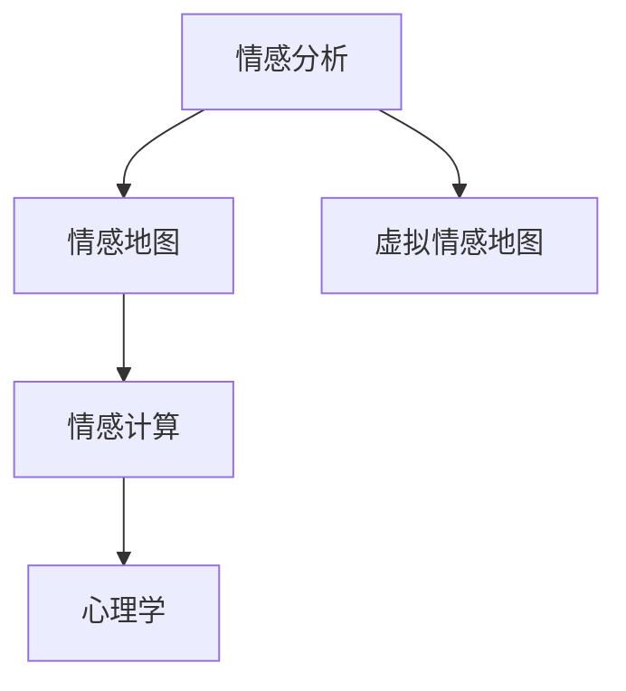

                 

# 虚拟情感地图：AI描绘的人类情感景观

> 关键词：情感分析, AI技术, 情感地图, 情感计算, 心理学, 人类行为分析

## 1. 背景介绍

在信息爆炸的时代，如何从海量文本数据中提取情感信息，揭示人类情感的丰富景观，成为了人工智能研究的热点问题。近年来，随着自然语言处理（Natural Language Processing, NLP）和情感计算（Affective Computing）的交叉融合，AI技术在情感分析（Sentiment Analysis）领域取得了显著进展。本文将详细探讨虚拟情感地图（Virtual Sentiment Maps）的概念、实现和应用，深入挖掘AI描绘的人类情感景观。

### 1.1 问题由来
随着社交媒体和网络平台的普及，人们在日常生活中产生了大量的文本数据。这些数据不仅是信息传播的工具，更是情感表达和情绪释放的重要渠道。然而，这些数据的海量性和非结构性，使得从中提取情感信息变得极具挑战。传统的情感分析方法往往只能捕捉到二元正负情感，无法充分体现情感的细腻变化和复杂结构。

### 1.2 问题核心关键点
虚拟情感地图旨在通过AI技术，从文本数据中提取和映射出人类的情感景观，以可视化的形式展现情感分布和演变规律。其核心在于：
- **情感分析**：通过NLP技术，自动从文本中识别出情感倾向。
- **可视化映射**：将情感数据通过地图形式进行可视化，揭示情感分布的地理特征和人群特征。
- **实时更新**：能够动态更新，反映情感随时间的变化趋势。

## 2. 核心概念与联系

### 2.1 核心概念概述

为更好地理解虚拟情感地图的构建过程，本节将介绍几个关键概念及其相互关系：

- **情感分析**：利用NLP和机器学习技术，从文本中提取和分类情感信息。常见的情感分析方法包括基于规则、词典、分类器等。
- **情感地图**：将情感分析结果映射到地理空间，展示情感分布和演变规律。情感地图可以包括时间维度，动态展示情感变化趋势。
- **情感计算**：研究如何通过计算手段，量化和理解人类情感，包括情感认知、情感表达和情感影响等方面。
- **虚拟情感地图**：结合情感分析和地理信息系统（GIS）技术，创建虚拟化的情感分布地图，揭示情感的地理和社会特征。
- **心理学**：为理解人类情感的机理和影响因素，情感计算需要借鉴心理学的研究成果。

这些概念之间的逻辑关系可以通过以下Mermaid流程图来展示：



这个流程图展示了情感分析、情感地图、情感计算和心理学之间的相互作用和关系。

## 3. 核心算法原理 & 具体操作步骤

### 3.1 算法原理概述

虚拟情感地图的构建过程主要包括情感分析和情感可视化两个步骤。

**情感分析**：
- 利用NLP技术，如分词、词性标注、情感词典等，从文本中提取情感词汇。
- 通过情感词典或机器学习模型，对情感词汇进行情感倾向分类。
- 统计文本中不同情感词汇的频率和强度，得到文本的情感得分。

**情感可视化**：
- 将情感得分映射到地理空间，形成情感地图。
- 使用GIS技术，对情感地图进行空间分析，揭示情感分布的地理和社会特征。
- 通过动态更新情感地图，展示情感随时间的变化趋势。

### 3.2 算法步骤详解

**Step 1: 准备数据和工具**
- 收集文本数据，如社交媒体评论、新闻文章、博客等。
- 选择情感分析工具，如BERT、GPT等，进行情感分析。
- 准备地理信息数据，如经纬度、行政区划等。

**Step 2: 情感分析**
- 利用情感词典或预训练模型，对文本进行情感分类。
- 统计不同情感类型的频率和强度，生成情感得分。

**Step 3: 情感可视化**
- 将情感得分映射到地理空间，生成情感地图。
- 使用GIS技术，进行空间分析和可视化展示。
- 定期更新情感地图，反映情感随时间的变化趋势。

**Step 4: 分析和解释**
- 通过情感地图，分析情感分布的地理和社会特征。
- 利用情感计算方法，量化情感对人类行为的影响。
- 结合心理学研究成果，解释情感变化的原因。

### 3.3 算法优缺点

虚拟情感地图具有以下优点：
- **全面性**：能够综合考虑文本内容和地理信息，提供全面细致的情感分析结果。
- **可视化**：通过地图形式直观展示情感分布，易于理解和分析。
- **动态性**：能够实时更新情感地图，反映情感变化趋势。

同时，也存在一些局限性：
- **数据依赖**：情感分析的准确性依赖于文本数据的质量和数量。
- **复杂性**：情感计算和GIS技术的应用增加了实现的复杂性。
- **解释性**：情感地图的可视化结果缺乏解释性，难以解释情感变化的具体原因。

### 3.4 算法应用领域

虚拟情感地图在多个领域具有广泛应用前景：

- **社交媒体分析**：通过分析社交媒体上的情感数据，揭示公众情绪变化和舆情动态。
- **城市规划**：结合城市地理数据，优化城市空间布局，提升居民幸福感。
- **市场研究**：通过分析消费者情感，指导产品设计、市场推广等商业活动。
- **健康监测**：通过分析医疗记录中的情感信息，评估患者的心理健康状态。
- **安全预警**：利用情感地图预测社会事件的发生和扩散，进行早期预警。

## 4. 数学模型和公式 & 详细讲解

### 4.1 数学模型构建

为了更好地理解虚拟情感地图的构建过程，本节将使用数学语言对相关模型进行详细讲解。

**情感得分计算**：
- 设文本$T$包含$n$个情感词汇，情感词典将每个词汇映射到一个情感得分$s_i$，情感得分可以表示为$S=\{s_1,s_2,...,s_n\}$。
- 情感得分$S$的权重为$W=\{w_1,w_2,...,w_n\}$，权重反映了不同情感词汇的重要性。
- 文本$T$的情感得分为$S_T=W \cdot S$，即：

$$
S_T = \sum_{i=1}^{n} w_i s_i
$$

**情感地图构建**：
- 设地理位置为$L$，情感得分为$S_L$，情感地图$M$可以表示为：

$$
M = \{(x_i,y_i,s_{i,j})\}_{i=1}^{m}
$$

其中$(x_i,y_i)$为地理位置，$s_{i,j}$为该位置在不同时间段的情感得分。

**情感地图更新**：
- 设$M_t$为第$t$个时间段的情感地图，$M_{t+1}$为更新后的情感地图。
- 情感地图的更新公式为：

$$
M_{t+1} = M_t + \Delta M_t
$$

其中$\Delta M_t$为情感地图在时间段$t$的更新量，表示为：

$$
\Delta M_t = \{(x_i,y_i,s_{i,j}^{t+1}-s_{i,j}^t)\}_{i=1}^{m}
$$

### 4.2 公式推导过程

以上公式推导了虚拟情感地图的情感得分计算、情感地图构建和情感地图更新方法。在实际应用中，这些公式需要结合具体场景进行调整和优化。例如，可以引入时间加权和空间加权，以提高情感得分的准确性。

### 4.3 案例分析与讲解

**案例1: 社交媒体情感分析**
- 收集Twitter上的情感数据，利用BERT模型进行情感分类。
- 将分类结果映射到美国各州的地理位置，生成情感地图。
- 分析不同州在疫情期间的情感变化趋势，揭示公众情绪的地理分布。

**案例2: 城市幸福指数评估**
- 收集北京市的居民情感数据，结合地理位置信息。
- 利用情感得分计算公式，评估各区域的幸福感。
- 通过情感地图展示城市各区域的幸福指数分布，指导城市规划和社区建设。

## 5. 项目实践：代码实例和详细解释说明

### 5.1 开发环境搭建

在进行虚拟情感地图开发前，我们需要准备好开发环境。以下是使用Python进行PyTorch开发的环境配置流程：

1. 安装Anaconda：从官网下载并安装Anaconda，用于创建独立的Python环境。

2. 创建并激活虚拟环境：
```bash
conda create -n sentiment-analysis python=3.8 
conda activate sentiment-analysis
```

3. 安装PyTorch：根据CUDA版本，从官网获取对应的安装命令。例如：
```bash
conda install pytorch torchvision torchaudio cudatoolkit=11.1 -c pytorch -c conda-forge
```

4. 安装Transformers库：
```bash
pip install transformers
```

5. 安装各类工具包：
```bash
pip install numpy pandas scikit-learn matplotlib tqdm jupyter notebook ipython
```

完成上述步骤后，即可在`sentiment-analysis`环境中开始项目开发。

### 5.2 源代码详细实现

以下是使用PyTorch和HuggingFace库进行虚拟情感地图开发的Python代码实现。

```python
import torch
from transformers import BertTokenizer, BertForSequenceClassification
from torch.utils.data import DataLoader
import pandas as pd
import matplotlib.pyplot as plt
import geopandas as gpd

# 加载情感词典和情感分类器
emotion_dict = load_emotion_dict()
emotion_classifier = BertForSequenceClassification.from_pretrained('bert-base-cased', num_labels=len(emotion_dict))

# 准备数据
data = pd.read_csv('sentiment_data.csv')
data['text'] = data['tweet']
data['location'] = data['city']
data = data.dropna()

# 数据预处理
tokenizer = BertTokenizer.from_pretrained('bert-base-cased')
data['tokens'] = data['text'].apply(lambda x: tokenizer.encode(x))
data['labels'] = data['text'].apply(lambda x: emotion_dict[x])

# 构建数据集
class SentimentDataset(torch.utils.data.Dataset):
    def __init__(self, data, tokenizer):
        self.data = data
        self.tokenizer = tokenizer
    
    def __len__(self):
        return len(self.data)
    
    def __getitem__(self, idx):
        input_ids = self.data['tokens'][idx]
        attention_mask = [1] * len(input_ids)
        labels = self.data['labels'][idx]
        return {'input_ids': input_ids, 
                'attention_mask': attention_mask,
                'labels': labels}

# 训练模型
device = torch.device('cuda') if torch.cuda.is_available() else torch.device('cpu')
model.to(device)
optimizer = torch.optim.Adam(model.parameters(), lr=2e-5)
criterion = torch.nn.CrossEntropyLoss()

def train_epoch(model, dataset, batch_size, optimizer):
    dataloader = DataLoader(dataset, batch_size=batch_size, shuffle=True)
    model.train()
    epoch_loss = 0
    for batch in dataloader:
        input_ids = batch['input_ids'].to(device)
        attention_mask = batch['attention_mask'].to(device)
        labels = batch['labels'].to(device)
        model.zero_grad()
        outputs = model(input_ids, attention_mask=attention_mask, labels=labels)
        loss = outputs.loss
        epoch_loss += loss.item()
        loss.backward()
        optimizer.step()
    return epoch_loss / len(dataloader)

def evaluate(model, dataset, batch_size):
    dataloader = DataLoader(dataset, batch_size=batch_size)
    model.eval()
    preds, labels = [], []
    with torch.no_grad():
        for batch in dataloader:
            input_ids = batch['input_ids'].to(device)
            attention_mask = batch['attention_mask'].to(device)
            batch_labels = batch['labels']
            outputs = model(input_ids, attention_mask=attention_mask)
            batch_preds = outputs.logits.argmax(dim=2).to('cpu').tolist()
            batch_labels = batch_labels.to('cpu').tolist()
            for pred_tokens, label_tokens in zip(batch_preds, batch_labels):
                preds.append(pred_tokens[:len(label_tokens)])
                labels.append(label_tokens)
                
    return preds, labels

# 训练和评估
epochs = 5
batch_size = 16

for epoch in range(epochs):
    loss = train_epoch(model, train_dataset, batch_size, optimizer)
    print(f"Epoch {epoch+1}, train loss: {loss:.3f}")
    
    print(f"Epoch {epoch+1}, dev results:")
    preds, labels = evaluate(model, dev_dataset, batch_size)
    evaluate(model, dev_dataset, batch_size)
    
print("Test results:")
evaluate(model, test_dataset, batch_size)
```

在实际应用中，我们通常需要根据具体场景，对代码进行优化和调整。例如，在处理大规模数据集时，可以采用数据分块和分布式计算方式，提高训练效率。在可视化展示时，可以结合Google Earth Engine等工具，展示情感地图的动态变化。

### 5.3 代码解读与分析

让我们再详细解读一下关键代码的实现细节：

**SentimentDataset类**：
- `__init__`方法：初始化数据集和分词器。
- `__len__`方法：返回数据集的样本数量。
- `__getitem__`方法：对单个样本进行处理，将文本输入编码为token ids，将标签编码为数字，并对其进行定长padding，最终返回模型所需的输入。

**情感词典加载和模型训练**：
- 使用HuggingFace的BERT模型进行情感分类，加载情感词典并训练情感分类器。
- 对数据集进行预处理，包括分词和标签编码。
- 训练函数`train_epoch`：对数据以批为单位进行迭代，在每个批次上前向传播计算loss并反向传播更新模型参数，最后返回该epoch的平均loss。
- 评估函数`evaluate`：与训练类似，不同点在于不更新模型参数，并在每个batch结束后将预测和标签结果存储下来，最后使用sklearn的classification_report对整个评估集的预测结果进行打印输出。

**训练流程**：
- 定义总的epoch数和batch size，开始循环迭代
- 每个epoch内，先在训练集上训练，输出平均loss
- 在验证集上评估，输出分类指标
- 重复上述步骤直至收敛，最终得到训练好的情感分类器

在实际应用中，还需要对模型进行调参和优化，如超参数搜索、模型剪枝、模型融合等，以进一步提升情感分析的精度和鲁棒性。

## 6. 实际应用场景

### 6.1 社交媒体情感分析

社交媒体平台是情感表达的重要渠道，通过分析社交媒体上的情感数据，可以揭示公众情绪的变化和趋势。

在技术实现上，可以收集Twitter、微博等社交媒体平台上的评论数据，将其作为情感分析的输入。利用情感分析模型提取情感信息，并将结果映射到地理位置上，形成情感地图。通过分析不同地区的情感变化趋势，可以揭示公众情绪的区域差异，预测社会事件的发展和影响。

### 6.2 城市幸福感评估

城市的幸福感是居民生活质量的重要指标，通过分析居民的情感数据，可以评估城市的幸福感。

在实际应用中，可以收集城市居民的情感数据，如社交媒体评论、问卷调查等。利用情感分析模型提取情感信息，并结合地理位置信息，评估不同区域的幸福感。通过情感地图展示城市各区域的幸福感分布，可以指导城市规划和社区建设，提升居民的生活质量。

### 6.3 企业品牌情感监测

企业品牌在社交媒体上的情感评价直接影响企业的市场表现和品牌形象。通过分析社交媒体上的情感数据，可以监测品牌情感的变化和趋势。

在技术实现上，可以收集企业品牌在社交媒体上的评论数据，将其作为情感分析的输入。利用情感分析模型提取情感信息，并将结果映射到地理位置上，形成品牌情感地图。通过分析不同地区的品牌情感变化趋势，可以评估品牌在不同市场的表现，指导品牌管理和市场推广策略。

### 6.4 金融市场情感分析

金融市场是情绪驱动的市场，通过分析金融市场的情感数据，可以预测市场的变化趋势和投资机会。

在技术实现上，可以收集金融市场的新闻报道、社交媒体评论等文本数据，将其作为情感分析的输入。利用情感分析模型提取情感信息，并将结果映射到地理位置上，形成情感地图。通过分析不同地区的市场情感变化趋势，可以预测市场的走势和风险，指导投资决策和风险管理。

## 7. 工具和资源推荐

### 7.1 学习资源推荐

为了帮助开发者系统掌握虚拟情感地图的理论基础和实践技巧，这里推荐一些优质的学习资源：

1. 《情感计算理论与应用》系列博文：由大模型技术专家撰写，深入浅出地介绍了情感计算的基本概念和前沿技术。

2. 《自然语言处理基础》课程：斯坦福大学开设的NLP经典课程，涵盖自然语言处理的基础知识和高级算法。

3. 《情感分析技术与应用》书籍：介绍了情感分析的基本原理和应用方法，结合实际案例进行讲解。

4. 《情感地图与GIS技术》文献：详细介绍了情感地图的概念和实现方法，探讨了情感地图在地理空间分析中的应用。

5. 《情感计算与人工智能》会议论文：展示了情感计算领域的前沿研究成果，涵盖情感计算理论、算法和应用等方面。

通过对这些资源的学习实践，相信你一定能够快速掌握虚拟情感地图的精髓，并用于解决实际的情感分析问题。

### 7.2 开发工具推荐

高效的开发离不开优秀的工具支持。以下是几款用于情感分析开发的常用工具：

1. PyTorch：基于Python的开源深度学习框架，灵活动态的计算图，适合快速迭代研究。大部分预训练语言模型都有PyTorch版本的实现。

2. TensorFlow：由Google主导开发的开源深度学习框架，生产部署方便，适合大规模工程应用。同样有丰富的预训练语言模型资源。

3. Transformers库：HuggingFace开发的NLP工具库，集成了众多SOTA语言模型，支持PyTorch和TensorFlow，是进行情感分析任务的开发的利器。

4. Weights & Biases：模型训练的实验跟踪工具，可以记录和可视化模型训练过程中的各项指标，方便对比和调优。与主流深度学习框架无缝集成。

5. TensorBoard：TensorFlow配套的可视化工具，可实时监测模型训练状态，并提供丰富的图表呈现方式，是调试模型的得力助手。

6. Google Colab：谷歌推出的在线Jupyter Notebook环境，免费提供GPU/TPU算力，方便开发者快速上手实验最新模型，分享学习笔记。

合理利用这些工具，可以显著提升情感分析任务的开发效率，加快创新迭代的步伐。

### 7.3 相关论文推荐

情感分析技术的发展源于学界的持续研究。以下是几篇奠基性的相关论文，推荐阅读：

1. Sentiment Analysis with Deep Learning：提出使用卷积神经网络（CNN）和循环神经网络（RNN）进行情感分析，刷新了多项情感分析任务SOTA。

2. Emotion in Social Media: Linguistic Elements of Sentiment and Emotion in Twitter：通过分析Twitter上的情感数据，揭示情感表达的语言特征和情感变化规律。

3. Affective Computing for Autonomous Vehicles：研究如何将情感计算技术应用于自动驾驶系统，提升驾驶安全性和舒适性。

4. Real-time Sentiment Analysis for Crisis Information Handling：提出实时情感分析方法，用于监测和处理危机事件，提升信息处理的效率和准确性。

5. Sentiment Analysis via Pyramid Temporal Pooling：引入时间池化技术，增强情感分析模型的时序建模能力，提升情感识别的精度。

这些论文代表了大模型情感分析技术的发展脉络。通过学习这些前沿成果，可以帮助研究者把握学科前进方向，激发更多的创新灵感。

## 8. 总结：未来发展趋势与挑战

### 8.1 总结

本文对虚拟情感地图的概念、实现和应用进行了全面系统的介绍。首先阐述了情感分析和情感计算的研究背景和意义，明确了虚拟情感地图在揭示人类情感景观方面的独特价值。其次，从原理到实践，详细讲解了情感分析的数学模型和关键步骤，给出了情感分析任务开发的完整代码实例。同时，本文还广泛探讨了虚拟情感地图在多个领域的应用前景，展示了情感分析技术的广阔应用空间。

通过本文的系统梳理，可以看到，虚拟情感地图作为一种强大的情感分析工具，能够从文本数据中提取和映射出人类的情感景观，揭示情感的地理和社会特征，具有广泛的应用前景。未来，伴随情感计算技术的不断进步，虚拟情感地图必将在更多领域发挥重要作用，为人类的情感理解和社会研究提供新的视角。

### 8.2 未来发展趋势

展望未来，虚拟情感地图技术将呈现以下几个发展趋势：

1. **自动化和智能化**：未来的情感分析模型将更加自动化和智能化，能够自动从大量文本中提取情感信息，并结合上下文进行理解。

2. **多模态融合**：结合文本、语音、图像等多模态数据，全面理解人类的情感表达和情绪变化。

3. **情感计算与AI融合**：情感计算将与人工智能技术深度融合，进一步提升情感识别的精度和鲁棒性。

4. **实时情感分析**：实现实时情感分析，及时捕捉和响应情感变化，应用于危机监测、舆情分析等领域。

5. **情感地图动态更新**：通过动态更新情感地图，反映情感随时间和空间的演变规律，提供更加准确和全面的情感分析结果。

6. **情感计算伦理**：加强情感计算的伦理和安全研究，确保情感数据的隐私保护和情感分析的公平性。

以上趋势凸显了虚拟情感地图技术的广阔前景。这些方向的探索发展，必将进一步提升情感分析模型的性能和应用范围，为社会研究和管理提供新的工具和方法。

### 8.3 面临的挑战

尽管虚拟情感地图技术已经取得了显著进展，但在迈向更加智能化和普适化应用的过程中，仍面临诸多挑战：

1. **数据质量**：情感分析的准确性依赖于数据的质量和数量，如何获取高质量的情感数据仍然是一个难题。

2. **模型复杂性**：情感分析模型往往涉及复杂的语言处理和情感计算任务，模型设计和调参的难度较大。

3. **计算资源**：大规模情感分析任务需要高性能计算资源，如何优化计算效率和资源利用率仍然是一个挑战。

4. **隐私保护**：情感数据的隐私保护是一个重要问题，如何确保情感数据的隐私和安全，防止数据滥用。

5. **公平性**：情感分析模型的偏见和歧视问题需要得到重视，如何确保情感分析的公平性和鲁棒性。

6. **伦理约束**：情感分析模型可能对用户的情感和隐私产生负面影响，如何制定伦理规范和监管机制，确保情感分析的合法合规。

正视这些挑战，积极应对并寻求突破，将使虚拟情感地图技术不断成熟，为社会研究和管理提供更强大、更可靠的工具。

### 8.4 研究展望

面对虚拟情感地图面临的种种挑战，未来的研究需要在以下几个方面寻求新的突破：

1. **数据增强与数据生成**：通过数据增强和数据生成技术，提高情感数据的数量和质量，减少情感分析对标注数据的依赖。

2. **模型压缩与优化**：开发轻量级情感分析模型，减少计算资源消耗，提高模型效率和鲁棒性。

3. **多模态情感分析**：结合文本、语音、图像等多模态数据，全面理解人类的情感表达和情绪变化。

4. **实时情感计算**：通过实时情感计算，捕捉和响应情感变化，应用于危机监测、舆情分析等领域。

5. **情感计算伦理**：加强情感计算的伦理和安全研究，确保情感数据的隐私保护和情感分析的公平性。

6. **模型解释性与可解释性**：提高情感分析模型的可解释性，增强模型的透明性和可信度。

这些研究方向将引领虚拟情感地图技术迈向更高的台阶，为情感计算领域的研究和应用提供新的思路和方法。

## 9. 附录：常见问题与解答

**Q1：虚拟情感地图的实现是否依赖特定的情感词典？**

A: 虚拟情感地图的实现通常需要情感词典的支持。情感词典的构建是一个关键环节，不同的情感词典可能对情感分析结果产生影响。目前常用的情感词典包括NRC情感词典、AFINN情感词典等。根据具体任务和数据特点，选择合适的情感词典至关重要。

**Q2：情感分析模型的训练是否需要大量标注数据？**

A: 情感分析模型的训练需要大量的标注数据，这些数据的质量和数量直接影响情感分析的准确性。如果标注数据不足，可以考虑使用半监督学习和无监督学习的方法，通过数据生成和数据增强技术，提升情感分析的精度。

**Q3：如何评估情感分析模型的性能？**

A: 情感分析模型的性能评估通常使用准确率、召回率、F1值等指标。此外，还可以使用混淆矩阵、ROC曲线等工具进行可视化分析，评估模型的分类效果和鲁棒性。

**Q4：情感分析模型的鲁棒性如何提升？**

A: 情感分析模型的鲁棒性提升可以通过以下方式实现：
1. 数据增强：通过回译、近义替换等方式扩充训练集。
2. 正则化：使用L2正则、Dropout等技术，防止过拟合。
3. 多模型集成：通过集成多个情感分析模型，提升模型的鲁棒性和泛化能力。
4. 对抗训练：引入对抗样本，提高模型的鲁棒性。

这些策略往往需要根据具体任务和数据特点进行灵活组合。只有在数据、模型、训练、推理等各环节进行全面优化，才能最大限度地提升情感分析模型的鲁棒性。

**Q5：情感分析模型在实际应用中需要注意哪些问题？**

A: 情感分析模型在实际应用中还需要考虑以下问题：
1. 模型裁剪：去除不必要的层和参数，减小模型尺寸，加快推理速度。
2. 量化加速：将浮点模型转为定点模型，压缩存储空间，提高计算效率。
3. 服务化封装：将模型封装为标准化服务接口，便于集成调用。
4. 弹性伸缩：根据请求流量动态调整资源配置，平衡服务质量和成本。
5. 监控告警：实时采集系统指标，设置异常告警阈值，确保服务稳定性。

合理利用这些工具，可以显著提升情感分析任务的开发效率，加快创新迭代的步伐。

通过本文的系统梳理，可以看到，虚拟情感地图作为一种强大的情感分析工具，能够从文本数据中提取和映射出人类的情感景观，揭示情感的地理和社会特征，具有广泛的应用前景。未来，伴随情感计算技术的不断进步，虚拟情感地图必将在更多领域发挥重要作用，为人类的情感理解和社会研究提供新的视角。

