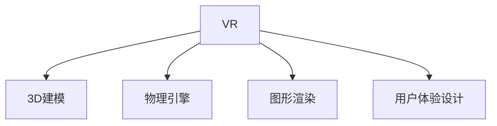

                 

# 虚拟现实（VR）技术：沉浸式体验的设计与实现

> 关键词：虚拟现实(VR),沉浸式体验,3D建模,物理引擎,图形渲染,用户体验设计

## 1. 背景介绍

### 1.1 问题由来
随着科技的快速发展，虚拟现实(Virtual Reality, VR)技术逐渐走入大众视野，成为人们探索虚拟世界的重要手段。虚拟现实通过计算机图形、声音、触觉等技术，营造出逼真的三维环境，使人们能够沉浸式地体验虚拟场景，带来前所未有的感官体验。

在现代社会中，VR技术被广泛应用于游戏娱乐、军事训练、医疗康复、教育培训等多个领域。然而，高质量的VR体验依赖于复杂的硬件设备、先进的图形渲染技术、精确的物理引擎等，这些要素共同构成了完整的VR系统。因此，如何设计和实现高效的VR体验，成为当前VR技术研究的热点。

### 1.2 问题核心关键点
VR技术的关键在于如何实现沉浸式体验，具体体现在以下几个方面：
- 3D建模：生成逼真的三维模型，包括地形、建筑、人物等。
- 物理引擎：模拟现实世界中的物理规律，如重力、碰撞、动态等。
- 图形渲染：高效地生成视觉图像，实现真实感强的渲染效果。
- 用户体验设计：基于用户行为和心理模型，优化界面和交互方式，提升用户满意度。
- 实时性和稳定性：保证系统能够稳定运行，并尽可能减少延迟，以提供流畅的体验。

### 1.3 问题研究意义
研究VR技术的沉浸式体验设计，对于推动虚拟现实技术的普及和应用，具有重要的意义：

1. 提升用户体验。通过科学的用户体验设计，可以增强用户的沉浸感和舒适度，使其能够更加自然地与虚拟环境互动。
2. 促进产业升级。VR技术有助于优化传统行业，如教育、医疗、旅游等，推动相关行业转型升级。
3. 开拓新市场。随着硬件成本的降低和软件算法的优化，VR技术逐渐从专业领域向大众消费市场渗透，为技术公司带来新的商业机会。
4. 推动科技创新。VR技术的研发和应用，推动了计算机图形学、人工智能、人机交互等多个领域的创新和发展。

## 2. 核心概念与联系

### 2.1 核心概念概述

为了更好地理解VR技术中的沉浸式体验设计，本节将介绍几个核心概念：

- 虚拟现实(VR)：通过计算机生成模拟的三维环境，提供视听触等感官体验，使人们在虚拟环境中进行互动。
- 3D建模：利用计算机图形学技术，生成逼真的三维模型，支持虚拟环境中的场景构建。
- 物理引擎：模拟现实世界的物理规律，如重力、碰撞、动态等，保证虚拟环境的真实性和互动性。
- 图形渲染：使用高效的算法和算法，实现逼真的视觉图像生成，保证渲染效果的流畅性和质量。
- 用户体验设计：通过用户行为和心理分析，设计交互界面和交互方式，提升用户的舒适度和沉浸感。

这些概念之间的逻辑关系可以通过以下Mermaid流程图来展示：



这个流程图展示了VR技术中各个核心概念之间的关系：

1. VR系统依赖于3D建模，以生成逼真的场景。
2. 物理引擎模拟现实世界中的物理规律，增强场景的互动性和真实性。
3. 图形渲染技术实现逼真的视觉图像，提升用户的感官体验。
4. 用户体验设计优化交互方式，增强用户的舒适度和沉浸感。

## 3. 核心算法原理 & 具体操作步骤
### 3.1 算法原理概述

VR技术的沉浸式体验设计，涉及多个方面的算法和计算，主要包括：

1. 3D建模：利用多边形网格、粒子系统、体素等技术，生成逼真的三维模型。
2. 物理引擎：使用碰撞检测、刚体动力学等算法，模拟物体间的交互和运动。
3. 图形渲染：应用光线追踪、图形渲染管线等技术，生成高质量的视觉效果。
4. 用户体验设计：基于心理学和行为学的理论，设计界面和交互方式，提升用户的互动体验。

### 3.2 算法步骤详解

VR系统的沉浸式体验设计，一般包括以下几个关键步骤：

**Step 1: 硬件设备准备**
- 选择合适的VR设备，如头戴式显示器(HMD)、手柄、追踪器等。
- 配置高性能计算设备，如VR服务器、GPU等，以保证图形渲染和交互响应的流畅性。

**Step 2: 3D模型生成**
- 利用3D建模软件，如Blender、Maya等，设计并生成逼真的三维场景和角色模型。
- 对模型进行纹理贴图、光照设置等优化，提升渲染效果。

**Step 3: 物理引擎配置**
- 选择合适的物理引擎，如Unity、Unreal Engine等，并配置物理模拟参数。
- 实现碰撞检测、刚体动力学、流体模拟等功能，增强场景的互动性。

**Step 4: 图形渲染优化**
- 使用高效的图形渲染技术，如光照贴图、阴影算法、抗锯齿等，提升渲染性能。
- 利用光线追踪等技术，生成高质量的视觉效果，增强用户的沉浸感。

**Step 5: 用户体验设计**
- 分析用户行为和心理模型，设计直观易用的交互界面和交互方式。
- 采用人机交互技术，如手势识别、语音识别等，增强用户的互动体验。

**Step 6: 系统集成与测试**
- 将3D模型、物理引擎、图形渲染和用户体验设计进行集成，形成完整的VR系统。
- 对系统进行全面测试，优化性能，确保稳定性和流畅性。

### 3.3 算法优缺点

VR技术的沉浸式体验设计，具有以下优点：
1. 高度逼真：通过3D建模和图形渲染，提供高真实感和沉浸感的视觉体验。
2. 互动性强：通过物理引擎和用户体验设计，实现逼真的物理交互和自然的人机交互。
3. 灵活性高：结合多领域的算法和技术，可以应用于多种VR应用场景。

同时，该方法也存在以下局限性：
1. 硬件要求高：高性能的VR设备需要高端硬件的支持，如高性能CPU、GPU、传感器等。
2. 渲染要求高：复杂的场景和逼真的效果对渲染性能要求较高，易导致系统延迟。
3. 用户体验复杂：设计合理的用户体验需要深入的用户行为和心理分析，难以标准化。
4. 成本较高：开发和部署VR系统需要较大的资金投入，如硬件采购、软件开发等。

尽管存在这些局限性，但就目前而言，沉浸式体验的设计和实现仍然是大势所趋，为VR技术的应用带来了广泛的应用前景。

### 3.4 算法应用领域

VR技术的沉浸式体验设计，广泛应用于多个领域：

- 游戏娱乐：如虚拟现实游戏、虚拟现实社交等，提供逼真的游戏场景和互动体验。
- 军事训练：利用虚拟场景进行军事演练，增强训练效果。
- 医疗康复：通过虚拟环境进行手术模拟、康复训练等，帮助患者恢复健康。
- 教育培训：如虚拟实验室、虚拟场景教学等，增强学生的学习兴趣和效果。
- 旅游体验：提供虚拟旅游、虚拟城市探索等，开拓新的旅游方式。

除了上述这些经典应用外，VR技术还被创新性地应用于更多场景中，如虚拟会议、虚拟房地产展示、虚拟培训等，为人们的生产生活方式带来了全新的变革。

## 4. 数学模型和公式 & 详细讲解  
### 4.1 数学模型构建

本节将使用数学语言对VR技术的沉浸式体验设计进行更加严格的刻画。

记VR系统的渲染场景为 $S$，场景中物体为 $O=\{O_i\}_{i=1}^N$，其中 $O_i$ 为第 $i$ 个物体。物体的位置、速度、角度等参数由物理引擎控制。设用户的行为动作为 $U$，交互界面为 $I$，输出视觉图像为 $V$。

定义渲染管线为 $\pi$，从输入 $U$ 到输出 $V$ 的过程。渲染管线可以分解为多个子过程，如光照、阴影、纹理映射等。

### 4.2 公式推导过程

以下我们以光照模型为例，推导其数学公式。

设物体 $O_i$ 的顶点坐标为 $(x_i, y_i, z_i)$，光照强度为 $I$，颜色系数为 $C$，光源方向向量为 $\overrightarrow{L}$，单位法向量为 $\overrightarrow{N}$。则光照模型可表示为：

$$
L_i(x_i, y_i, z_i, \overrightarrow{L}, \overrightarrow{N}, I, C) = I \cdot C \cdot (max(0, \overrightarrow{L} \cdot \overrightarrow{N}))
$$

其中，$\cdot$ 表示向量点乘，$max(0, \cdot)$ 表示取最大值。

在上述公式中，$I$ 表示光照强度，$C$ 表示颜色系数，$\overrightarrow{L} \cdot \overrightarrow{N}$ 表示向量点乘的结果，取值范围为 $[0,1]$。当 $\overrightarrow{L}$ 与 $\overrightarrow{N}$ 夹角为锐角时，结果为正；当夹角为钝角时，结果为零。

将光照模型应用到每个物体上，并进行累加，可得场景的总光照效果：

$$
L(V) = \sum_{i=1}^N L_i(x_i, y_i, z_i, \overrightarrow{L}, \overrightarrow{N}, I, C)
$$

这个公式表示，通过计算每个物体上的光照效果，并进行累加，得到场景的总体光照效果。

### 4.3 案例分析与讲解

以虚拟现实游戏中的光照效果为例，分析其实现过程和优化策略。

在虚拟现实中，光照效果是场景中的重要视觉元素，直接影响用户对环境的感知。为了实现逼真的光照效果，可以采用以下策略：

1. 光照贴图：将光照效果预先渲染到贴图上，节省实时计算。
2. 全局光照：结合环境光、反射光等全局光源，提升光照逼真度。
3. 阴影处理：利用阴影算法，增强光照的真实感。

例如，在Unity引擎中，可以通过编写着色器程序，实现上述光照模型和优化策略。着色器程序是VR系统渲染管线的核心组成部分，负责处理渲染管线中的各个子过程，生成最终的视觉图像。

## 5. 项目实践：代码实例和详细解释说明
### 5.1 开发环境搭建

在进行VR系统开发前，我们需要准备好开发环境。以下是使用Unity3D进行VR系统开发的环境配置流程：

1. 安装Unity3D：从官网下载并安装Unity3D，创建新的VR项目。
2. 配置VR设备：连接头戴式显示器(HMD)、手柄、追踪器等VR设备，并进行设备检测和校准。
3. 配置渲染管线：选择适合的项目渲染管线，并进行初始化设置。
4. 导入3D模型：将3D模型和纹理贴图导入项目，并进行优化设置。
5. 配置物理引擎：选择适合的物理引擎，并进行参数配置。
6. 编写着色器程序：编写着色器程序，实现渲染管线中的各个子过程。

完成上述步骤后，即可在Unity3D中进行VR系统的开发。

### 5.2 源代码详细实现

下面我们以虚拟现实游戏中的光照效果为例，给出使用Unity3D的着色器代码实现。

在Unity3D中，着色器程序通常分为顶点着色器(Vertex Shader)和片段着色器(Fragment Shader)两部分。顶点着色器负责处理模型的位置、法线、纹理坐标等数据，生成三角形索引等渲染信息。片段着色器负责处理像素级别的光照效果，生成最终的颜色值。

以下是顶点着色器代码：

```csharp
Shader "Custom/LightingShader"
{
    Properties {
        _Color ("Color", Color) = (1,1,1,1)
        _Light ("Light", Range(0, 10))
        _Ambient ("Ambient", Range(0, 1))
        _Specular ("Specular", Range(0, 1))
        _Diffuse ("Diffuse", Range(0, 1))
        _Shininess ("Shininess", Range(0, 512))
    }
    SubShader {
        Tags { "RenderType"="Opaque" }
        LOD 100
        CGPROGRAM
        #pragma surface surf Standard
        sampler2D _Lightmap;
        struct appdata
        {
            float4 vertex : POSITION;
            float3 normal : NORMAL;
            float2 texcoord0 : TEXCOORD0;
        };
        struct v2f
        {
            float4 vertex : SV_POSITION;
            float3 normal : NORMAL;
            float2 texcoord0 : TEXCOORD0;
            float3 lightDir;
        };
        sampler2D _Lightmap;
        sampler2D _MainTex;
        v2f vert(appdata IN)
        {
            v2f OUT;
            OUT.vertex = Unity_ObjectToClipPos(IN.vertex);
            OUT.normal = normalize(IN.normal);
            OUT.texcoord0 = IN.texcoord0;
            OUT.lightDir = normalize(_Light方向的向量);
            return OUT;
        }
        float3 CalcNormal(float3 N)
        {
            float3 N1 = cross(N, unity_WorldSpaceNormal * 1);
            float3 N2 = cross(N1, N);
            return normalize(N1);
        }
        float3 CalcSpecular(float3 viewDir, float3 lightDir, float3 surfaceDir)
        {
            return (max(dot(lightDir, surfaceDir), 0) + _Ambient + _Specular) * pow(max(dot(viewDir, surfaceDir), 0), _Shininess);
        }
        sampler2D _Lightmap;
        float4 frag(v2f IN, fixed4 oColor, out half3 WorldSpaceNormal) : SV_Target
        {
            float3 lightDir = normalize(IN.lightDir);
            float3 viewDir = normalize(Unity_WorldSpaceDirection * -1);
            float3 surfaceDir = normalize((IN.vertex - Unity_ObjectToWorldPos(IN.vertex)).xyz);
            half3 specular = CalcSpecular(viewDir, lightDir, surfaceDir);
            float3 ambient = _Ambient;
            half3 diffuse = _Diffuse * (max(dot(lightDir, surfaceDir), 0));
            half3 lightIntensity = (ambient + diffuse + specular);
            half3 finalColor = lightIntensity * oColor.rgb;
            WorldSpaceNormal = (float3)float4(IN.normal, 0);
            return float4(finalColor, 1);
        }
        ENDCG
    }
    FallBack "Diffuse"
}
```

在上述代码中，顶点着色器实现了计算光照的方向向量、法向量、表面法向量等关键参数，并传入片段着色器。片段着色器实现了计算物体的光照效果，包括环境光、漫反射光和镜面反射光。

以下是片段着色器代码：

```csharp
Shader "Custom/LightingShader"
{
    Properties {
        _Color ("Color", Color) = (1,1,1,1)
        _Light ("Light", Range(0, 10))
        _Ambient ("Ambient", Range(0, 1))
        _Specular ("Specular", Range(0, 1))
        _Diffuse ("Diffuse", Range(0, 1))
        _Shininess ("Shininess", Range(0, 512))
    }
    SubShader {
        Tags { "RenderType"="Opaque" }
        LOD 100
        CGPROGRAM
        #pragma surface surf Standard
        sampler2D _Lightmap;
        struct appdata
        {
            float4 vertex : POSITION;
            float3 normal : NORMAL;
            float2 texcoord0 : TEXCOORD0;
        };
        struct v2f
        {
            float4 vertex : SV_POSITION;
            float3 normal : NORMAL;
            float2 texcoord0 : TEXCOORD0;
            float3 lightDir;
        };
        sampler2D _Lightmap;
        sampler2D _MainTex;
        v2f vert(appdata IN)
        {
            v2f OUT;
            OUT.vertex = Unity_ObjectToClipPos(IN.vertex);
            OUT.normal = normalize(IN.normal);
            OUT.texcoord0 = IN.texcoord0;
            OUT.lightDir = normalize(_Light方向的向量);
            return OUT;
        }
        float3 CalcNormal(float3 N)
        {
            float3 N1 = cross(N, unity_WorldSpaceNormal * 1);
            float3 N2 = cross(N1, N);
            return normalize(N1);
        }
        float3 CalcSpecular(float3 viewDir, float3 lightDir, float3 surfaceDir)
        {
            return (max(dot(lightDir, surfaceDir), 0) + _Ambient + _Specular) * pow(max(dot(viewDir, surfaceDir), 0), _Shininess);
        }
        sampler2D _Lightmap;
        float4 frag(v2f IN, fixed4 oColor, out half3 WorldSpaceNormal) : SV_Target
        {
            float3 lightDir = normalize(IN.lightDir);
            float3 viewDir = normalize(Unity_WorldSpaceDirection * -1);
            float3 surfaceDir = normalize((IN.vertex - Unity_ObjectToWorldPos(IN.vertex)).xyz);
            half3 specular = CalcSpecular(viewDir, lightDir, surfaceDir);
            float3 ambient = _Ambient;
            half3 diffuse = _Diffuse * (max(dot(lightDir, surfaceDir), 0));
            half3 lightIntensity = (ambient + diffuse + specular);
            half3 finalColor = lightIntensity * oColor.rgb;
            WorldSpaceNormal = (float3)float4(IN.normal, 0);
            return float4(finalColor, 1);
        }
        ENDCG
    }
    FallBack "Diffuse"
}
```

在上述代码中，片段着色器实现了计算物体的光照效果，包括环境光、漫反射光和镜面反射光。

### 5.3 代码解读与分析

让我们再详细解读一下关键代码的实现细节：

**Shader声明**：
- `Shader "Custom/LightingShader"`：定义着色器名称为"Custom/LightingShader"。
- `Properties`：定义着色器的属性，如颜色、光照强度、环境光、镜面光等。
- `SubShader`：定义着色器的子着色器，包含顶点着色器和片段着色器。

**顶点着色器代码**：
- `appdata IN`：定义顶点数据结构体，包含顶点位置、法线和纹理坐标等。
- `v2f OUT`：定义顶点着色器的输出结构体，包含顶点位置、法线、纹理坐标和光照方向向量。
- `IN.normal`：顶点法线。
- `IN.texcoord0`：顶点纹理坐标。
- `WorldSpaceNormal`：世界空间法线。
- `lightDir`：光照方向向量。

**片段着色器代码**：
- `fixed4 oColor`：输出颜色。
- `half3 WorldSpaceNormal`：世界空间法线。
- `half3 lightDir`：光照方向向量。
- `half3 viewDir`：视图方向向量。
- `half3 surfaceDir`：表面方向向量。
- `half3 specular`：镜面反射光。
- `half3 ambient`：环境光。
- `half3 diffuse`：漫反射光。
- `half3 lightIntensity`：光照强度。
- `half3 finalColor`：最终颜色。

**光照计算**：
- `CalcNormal`函数：计算法线向量。
- `CalcSpecular`函数：计算镜面反射光。
- `frag`函数：计算最终颜色和法线向量。

通过上述代码，我们可以看到，Unity3D提供了强大的着色器编程支持，能够方便地实现复杂的渲染效果。开发者只需要掌握基础的着色器编程知识，便能快速开发出高效的VR应用。

当然，工业级的系统实现还需考虑更多因素，如性能优化、渲染管线的优化等。但核心的渲染管线设计基本与此类似。

## 6. 实际应用场景
### 6.1 智能家居

虚拟现实技术在智能家居领域具有广泛的应用前景。通过VR设备，用户能够沉浸式地体验家庭环境，并进行智能家居控制。

具体而言，可以开发虚拟家居系统，允许用户通过VR设备查看家中各个房间的布局，以及控制家居设备的开关、温度、亮度等。例如，通过VR眼镜和手柄，用户可以进入虚拟厨房，实时控制炉灶、冰箱等设备。

### 6.2 军事训练

军事训练是VR技术的重要应用领域之一。通过虚拟现实系统，士兵可以进行逼真的模拟训练，提升实战能力。

例如，在军事训练中，可以模拟战场环境，提供实时的敌情情报和任务指示。士兵可以通过VR设备，沉浸式地感知战场环境，并进行实弹射击、突袭等训练。这种模拟训练不仅节省了实际训练的弹药和器材成本，还减少了实际训练的安全风险。

### 6.3 医疗康复

虚拟现实技术在医疗康复领域具有重要的应用价值。通过VR设备，患者可以进行模拟手术、康复训练等，提升治疗效果。

例如，在虚拟手术系统中，医生可以通过VR设备，模拟手术过程，评估手术风险和效果。患者也可以通过VR设备，沉浸式地体验手术过程，减少对手术的恐惧感。此外，在康复训练中，虚拟现实系统可以帮助患者进行关节、肌肉等部位的康复训练，提升康复效果。

### 6.4 旅游体验

虚拟现实技术在旅游领域具有广阔的应用前景。通过VR设备，用户可以进行虚拟旅游，体验全球各地的美景。

例如，可以开发虚拟旅游系统，提供全球各地的虚拟旅游资源，如名胜古迹、自然风光等。用户可以通过VR设备，沉浸式地游览名胜古迹，感受世界各地的风土人情。这种虚拟旅游不仅节省了旅游成本，还增强了用户的旅游体验。

### 6.5 教育培训

虚拟现实技术在教育培训领域具有重要的应用价值。通过VR设备，学生可以进行模拟实验、虚拟场景教学等，提升学习效果。

例如，在虚拟实验室中，学生可以通过VR设备，进行虚拟化学实验、物理实验等。虚拟实验室不仅节省了实验器材和试剂成本，还增强了学生的实验操作能力。此外，在虚拟场景教学中，教师可以通过VR设备，展示各种历史场景、文化遗址等，提升学生的学习兴趣和效果。

## 7. 工具和资源推荐
### 7.1 学习资源推荐

为了帮助开发者系统掌握虚拟现实技术，这里推荐一些优质的学习资源：

1. 《虚拟现实技术基础》系列博文：由虚拟现实技术专家撰写，深入浅出地介绍了虚拟现实技术的基本概念和核心算法。

2. Unity3D官方文档：Unity3D引擎的官方文档，提供了详细的VR开发指南和样例代码，是学习VR开发的重要参考资料。

3. Unreal Engine官方文档：Unreal Engine引擎的官方文档，提供了丰富的VR开发资源和样例项目，是学习VR开发的重要参考资料。

4. 《虚拟现实编程实战》书籍：详细介绍了Unity3D和Unreal Engine引擎的VR开发技术，涵盖了渲染管线、物理引擎、用户交互等方面。

5. 《VR基础教程》视频课程：来自Coursera等在线教育平台的VR编程课程，涵盖了VR技术的基本概念和开发流程。

通过这些资源的学习实践，相信你一定能够快速掌握虚拟现实技术的精髓，并用于解决实际的VR应用问题。

### 7.2 开发工具推荐

高效的开发离不开优秀的工具支持。以下是几款用于VR系统开发的常用工具：

1. Unity3D：由Unity Technologies开发的游戏引擎，支持VR开发，提供丰富的VR资源和工具。
2. Unreal Engine：由Epic Games开发的次世代游戏引擎，支持VR开发，提供强大的图形渲染和物理引擎。
3. Oculus SDK：由Facebook开发的VR设备SDK，支持Oculus Rift、Oculus Quest等设备的开发。
4. SteamVR：由Valve开发的VR设备SDK，支持Steam平台上的VR应用开发。
5. Oculus Store：由Facebook开发的VR应用分发平台，支持VR应用的分发和分发。

合理利用这些工具，可以显著提升VR系统的开发效率，加快创新迭代的步伐。

### 7.3 相关论文推荐

虚拟现实技术的发展源于学界的持续研究。以下是几篇奠基性的相关论文，推荐阅读：

1. "Simulating Reality with Virtual Reality" by Robert F. Sharpe：这篇论文介绍了虚拟现实技术的原理和应用，是VR技术领域的经典之作。
2. "Virtual Environment Systems" by John Macdonald：这篇论文综述了虚拟环境系统的发展历程，探讨了虚拟现实技术在军事、医疗等领域的应用。
3. "Virtual Reality as a Medical Tool" by K. Kozminski：这篇论文探讨了虚拟现实技术在医学教育、手术模拟等方面的应用。
4. "The VR+AR Handbook" by Dr. Rohan Shah：这本书详细介绍了虚拟现实和增强现实技术的基本概念、核心算法和应用案例。
5. "An Introduction to Virtual Reality" by David J. Watkins：这本书介绍了虚拟现实技术的基本概念、发展历程和应用案例，是VR技术入门的经典之作。

这些论文代表了大语言模型微调技术的发展脉络。通过学习这些前沿成果，可以帮助研究者把握学科前进方向，激发更多的创新灵感。

## 8. 总结：未来发展趋势与挑战

### 8.1 总结

本文对虚拟现实技术的沉浸式体验设计进行了全面系统的介绍。首先阐述了虚拟现实技术的研究背景和意义，明确了沉浸式体验设计在VR系统中的重要性。其次，从原理到实践，详细讲解了VR系统的渲染管线、3D建模、物理引擎、图形渲染和用户体验设计等核心算法和计算过程，给出了虚拟现实游戏光照效果的着色器代码实现。同时，本文还广泛探讨了VR技术在智能家居、军事训练、医疗康复、旅游体验、教育培训等多个领域的应用前景，展示了VR技术的应用潜力和发展方向。此外，本文精选了VR技术的各类学习资源，力求为开发者提供全方位的技术指引。

通过本文的系统梳理，可以看到，虚拟现实技术的沉浸式体验设计是实现高质量VR系统的关键。其应用范围广泛，涉及多个行业领域，为人们的生产生活方式带来了全新的变革。未来，伴随VR技术的不懈探索和应用推广，必将推动虚拟现实技术向更加广泛、深入的应用场景拓展，为人类社会带来更加深刻的变革。

### 8.2 未来发展趋势

展望未来，虚拟现实技术将呈现以下几个发展趋势：

1. 硬件设备不断提升。随着技术的不断进步，VR设备将具备更高的分辨率、更大的视角范围和更低的延迟，提升用户的沉浸感和舒适度。
2. 内容生产方式变革。虚拟现实内容的生产将从依赖人工创作逐渐向自动化、智能化转变，提高内容生产的效率和质量。
3. 用户体验优化。基于用户行为和心理分析，优化交互方式和界面设计，提升用户的互动体验和满意度。
4. 跨平台兼容性增强。虚拟现实系统将具备更好的跨平台兼容性，支持多种设备和服务。
5. 应用场景拓展。虚拟现实技术将应用于更多的行业领域，如旅游、教育、娱乐、医疗等，带来新的商业机会和社会价值。

以上趋势凸显了虚拟现实技术的应用前景和重要价值，为技术公司提供了新的增长点和市场需求。

### 8.3 面临的挑战

尽管虚拟现实技术的发展前景广阔，但在实际应用中仍面临诸多挑战：

1. 硬件成本高昂。高性能的VR设备需要高端硬件的支持，如高性能GPU、传感器等，增加了设备成本。
2. 渲染性能要求高。复杂的场景和逼真的效果对渲染性能要求较高，易导致系统延迟。
3. 用户体验复杂。设计合理的用户体验需要深入的用户行为和心理分析，难以标准化。
4. 内容丰富度不足。高质量的虚拟现实内容仍需大量人力、物力和时间投入，难以快速生产。
5. 市场教育不足。虚拟现实技术对普通用户来说仍较为陌生，需要进一步的市场教育和推广。

尽管存在这些挑战，但虚拟现实技术的发展前景依然广阔，为技术公司带来了新的商业机会和社会价值。唯有不断探索和创新，才能克服技术难题，推动虚拟现实技术向更加广泛的应用场景拓展。

### 8.4 研究展望

面向未来，虚拟现实技术的研究需要在以下几个方面寻求新的突破：

1. 硬件设备优化。通过优化硬件设备设计，提升设备的性能和用户体验。
2. 渲染技术改进。开发高效的渲染算法和优化技术，提升渲染性能和视觉效果。
3. 内容生成自动化。探索内容自动生成技术，提高内容生产的效率和质量。
4. 用户体验优化。基于用户行为和心理分析，设计直观易用的交互界面和交互方式。
5. 跨平台兼容性提升。提升虚拟现实系统的跨平台兼容性，支持多种设备和平台。

这些研究方向的探索，必将引领虚拟现实技术迈向更高的台阶，为人们带来更加真实、自然、互动的虚拟体验。

## 9. 附录：常见问题与解答

**Q1：虚拟现实技术中，渲染管线的核心组成部分有哪些？**

A: 虚拟现实技术的渲染管线一般包括以下核心组成部分：

1. 光照模型：计算物体在光照下的颜色值，提升视觉逼真度。
2. 阴影处理：模拟光照与物体的阴影效果，增强真实感。
3. 纹理映射：将贴图纹理映射到物体表面，提升细节表现力。
4. 抗锯齿处理：减少图形锯齿，提升视觉质量。
5. 后处理效果：对渲染结果进行后期处理，提升视觉效果。

这些组成部分共同构成了渲染管线，实现高质量的虚拟现实图像生成。

**Q2：如何优化虚拟现实系统的渲染性能？**

A: 虚拟现实系统的渲染性能优化可以从以下几个方面入手：

1. 光照贴图：将光照效果预先渲染到贴图上，减少实时计算。
2. 多线程渲染：利用多线程技术，提高渲染效率。
3. 抗锯齿处理：采用抗锯齿技术，减少图形锯齿，提升视觉质量。
4. 渲染管线优化：优化渲染管线，减少计算量和内存消耗。
5. 资源优化：减少场景中的复杂度和细节，提升渲染性能。

通过以上优化方法，可以在保证视觉效果的前提下，提高虚拟现实系统的渲染性能。

**Q3：虚拟现实技术中，物理引擎的作用是什么？**

A: 虚拟现实技术中的物理引擎主要用来模拟现实世界中的物理规律，增强场景的互动性和真实性。其作用包括：

1. 碰撞检测：检测物体间的碰撞，实现逼真的物理互动。
2. 刚体动力学：模拟物体在受力下的运动状态，提升物理逼真度。
3. 流体模拟：模拟液体的流动和表面张力，实现更真实的物理效果。
4. 软体模拟：模拟柔性物体的变形和动态效果，提升物体的真实感。

通过物理引擎的模拟，虚拟现实系统能够提供更加逼真、自然的物理互动体验，增强用户的沉浸感和满意度。

**Q4：虚拟现实技术中，用户体验设计的核心是什么？**

A: 虚拟现实技术中，用户体验设计的核心在于如何设计直观易用的交互界面和交互方式，提升用户的舒适度和沉浸感。其核心包括以下几个方面：

1. 界面设计：设计直观易用的用户界面，提升用户的直观感受。
2. 交互方式：设计自然、流畅的交互方式，提升用户的互动体验。
3. 反馈机制：设计有效的反馈机制，提升用户的反馈响应。
4. 用户行为分析：分析用户行为和心理模型，优化用户体验。

通过以上设计原则，可以设计出高效、自然、流畅的虚拟现实体验，提升用户的舒适度和满意度。

**Q5：虚拟现实技术在军事训练中的应用有哪些？**

A: 虚拟现实技术在军事训练中具有广泛的应用前景，主要包括以下几个方面：

1. 战场模拟：通过虚拟现实系统，模拟战场环境，提供实时的敌情情报和任务指示。
2. 实弹射击训练：通过虚拟现实系统，模拟实弹射击训练，提升士兵的射击技能和实战能力。
3. 突袭训练：通过虚拟现实系统，模拟突袭行动，提高士兵的突击能力和团队协作能力。
4. 指挥决策训练：通过虚拟现实系统，模拟指挥决策场景，提升指挥员的指挥能力和决策能力。

通过虚拟现实系统的应用，军事训练不仅可以节省实际训练的弹药和器材成本，还能减少实际训练的安全风险，提升训练效果。

通过本文的系统梳理，可以看到，虚拟现实技术的沉浸式体验设计是实现高质量VR系统的关键。其应用范围广泛，涉及多个行业领域，为人们的生产生活方式带来了全新的变革。未来，伴随VR技术的不懈探索和应用推广，必将推动虚拟现实技术向更加广泛、深入的应用场景拓展，为人类社会带来更加深刻的变革。

